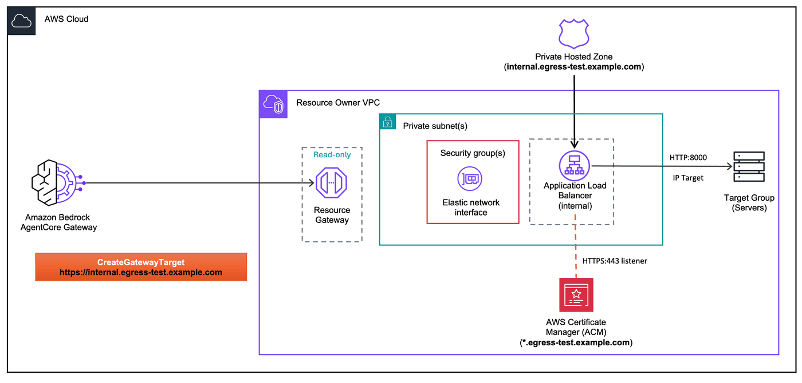

# Private Domain with AgentCore Gateway (Private DNS)

This lab demonstrates how to connect [Amazon Bedrock AgentCore Gateway](https://docs.aws.amazon.com/bedrock-agentcore/latest/devguide/gateway.html) to a resource that uses a **private domain** — a domain that only resolves inside your VPC via a [Route 53 private hosted zone](https://docs.aws.amazon.com/Route53/latest/DeveloperGuide/hosted-zones-private.html).

With **Private DNS** enabled on your VPC (the default), AgentCore Gateway's managed Resource Gateway resolves the private domain via your VPC's DNS resolver.

## Architecture



- The target URL uses your private FQDN (e.g., `https://internal.yourcompany.com`)
- A Route 53 **private hosted zone** for that FQDN, associated with your VPC, aliases the domain to an internal ALB
- The ALB terminates TLS with a publicly trusted ACM certificate for the same FQDN
- AgentCore Gateway's Resource Gateway resolves the domain via Private DNS → gets the ALB's private IPs → establishes TLS against the public cert → requests land on your backend

For background on VPC egress and managed VPC resource, see the [project README](../README.md) and [Advanced Concepts README](./README.md).

## How Private DNS makes this work

VPC Lattice's managed Resource Gateway (created by AgentCore when you call `CreateGatewayTarget` with `managedVpcResource`) uses your VPC's DNS resolver to look up the target endpoint domain. If your VPC is associated with a Route 53 private hosted zone for that domain, the resolver returns the record from that zone.

### Requirements

- **VPC DNS enabled** — `enableDnsSupport` and `enableDnsHostnames` are both `true` on the VPC (the default; set in the workshop's `VpcegressStack`).
- **Private hosted zone association** — the hosted zone must be associated with the VPC where the Resource Gateway ENIs live.
- **Publicly trusted TLS certificate** — the ALB must present a cert issued by a public CA (ACM public certificate) covering the target FQDN. AgentCore Gateway validates certs against public root CAs.
- **Target FQDN covered by the cert** — the domain you pass in the `endpoint` URL must match the cert's subject/SAN.

> **Backend without HTTPS?** If your backend doesn't speak TLS (e.g., a plain HTTP service on port 8000), the ALB in this lab handles TLS termination. If your backend already terminates TLS with a public cert on a domain you own, you can skip the ALB and point the private hosted zone directly at it. If your backend uses a **private** certificate, see the [Private Certificate Authority](./02-private-certificate-authority.ipynb) and [Self-Signed Certificate](./03-self-signed-certificate.ipynb) labs for the ALB + host-header-transform pattern.

## Prerequisites

- Completed [Lab 0](../00-prerequisites/00-vpc-gateway-setup.ipynb) (VPC + AgentCore Gateway deployed)
- An [ACM public certificate](../00-prerequisites/create-acm-public-certificate.md) for a domain you own

## Step 1: Install dependencies and import libraries

```python
import os
from pathlib import Path

# Change to project root
cwd = Path.cwd()
while cwd != cwd.parent:
    if (cwd / "cdk.json").exists():
        break
    cwd = cwd.parent
os.chdir(cwd)
print(f"Working directory: {os.getcwd()}")

!pip install --force-reinstall -q -r requirements.txt
```

```python
import json
import os
import time

import boto3
from utils.utils import get_token

# Restore variables from Lab 0
%store -r ACCOUNT_A_ID
%store -r ACCOUNT_A_PROFILE
%store -r GATEWAY_ID
%store -r GATEWAY_URL
%store -r USER_POOL_ID
%store -r USER_POOL_CLIENT_ID
%store -r TOKEN_ENDPOINT_URL
%store -r OAUTH_SCOPES
%store -r VPC_USW2_ID
%store -r VPC_USW2_PRIVATE_SUBNETS

os.environ["ACCOUNT_A_ID"] = ACCOUNT_A_ID

REGION = "us-west-2"
session = boto3.Session(profile_name=ACCOUNT_A_PROFILE, region_name=REGION)
agentcore = session.client("bedrock-agentcore-control")

# Get Cognito client secret
cognito = session.client("cognito-idp")
client_desc = cognito.describe_user_pool_client(UserPoolId=USER_POOL_ID, ClientId=USER_POOL_CLIENT_ID)
CLIENT_SECRET = client_desc["UserPoolClient"]["ClientSecret"]

print(f"Account:    {ACCOUNT_A_ID}")
print(f"Region:     {REGION}")
print(f"Gateway ID: {GATEWAY_ID}")
print(f"VPC ID:     {VPC_USW2_ID}")
```

## Step 2: Configure domain and certificate

Provide your ACM public certificate ARN and the **private FQDN** it covers. The FQDN must match the certificate's subject/SAN — e.g., if your cert is for `internal.yourcompany.com`, enter `internal.yourcompany.com` here.

The CDK stack will create a **Route 53 private hosted zone** with this exact zone name, associated with your VPC, and add an apex Alias record pointing to the internal ALB. Inside the VPC, `https://<DOMAIN>` will resolve to the ALB's private IPs via Private DNS — no public DNS record needed.

```python
CERT_ARN = input("ACM public certificate ARN: ").strip()
DOMAIN = input("Domain name covered by the certificate (e.g., api.internal.yourcompany.com): ").strip()

assert CERT_ARN.startswith("arn:aws:acm:"), "Invalid certificate ARN"
assert not DOMAIN.startswith("http"), "Domain should not include http:// or https://"
assert "." in DOMAIN, "Domain must contain at least one dot"
assert " " not in DOMAIN, "Domain must not contain whitespace"

print(f"Cert ARN: {CERT_ARN}")
print(f"Domain:   {DOMAIN}")
```

## Step 3: Deploy infrastructure

This stack deploys:
- An **EC2 instance** running a REST API (FastAPI) on HTTP port 8000
- An **internal ALB** with your public ACM certificate on HTTPS port 443, forwarding to the EC2 over HTTP
- A **Route 53 private hosted zone** named `<DOMAIN>` associated with the VPC, with an **apex Alias** record pointing to the ALB

Inside the VPC, `<DOMAIN>` resolves to the ALB's private IPs. Outside the VPC, the domain does not resolve — which is fine, because AgentCore Gateway's Resource Gateway lives inside the VPC and uses Private DNS to look it up.

```python
!cdk deploy PrivateDomain \
    -c "publicCertArn={CERT_ARN}" \
    -c "privateDomain={DOMAIN}" \
    --profile {ACCOUNT_A_PROFILE} \
    --require-approval never \
    --outputs-file pd-outputs.json
```

```python
with open("pd-outputs.json") as f:
    pd_outputs = json.load(f)["PrivateDomain"]

ALB_DNS = pd_outputs["AlbDnsName"]
ALB_SG_ID = pd_outputs["AlbSgId"]
API_KEY_VALUE = pd_outputs["ApiKey"]
EC2_INSTANCE_ID = pd_outputs["Ec2InstanceId"]
EC2_PRIVATE_IP = pd_outputs["Ec2PrivateIp"]
PRIVATE_DOMAIN = pd_outputs["PrivateDomain"]

print(f"Private FQDN:     {PRIVATE_DOMAIN}  (resolves via Private DNS inside VPC → ALB)")
print(f"ALB DNS:          {ALB_DNS}")
print(f"ALB SG:           {ALB_SG_ID}")
print(f"EC2 instance:     {EC2_INSTANCE_ID}")
print(f"EC2 private IP:   {EC2_PRIVATE_IP}")
```

## Step 4: Create AgentCore Gateway Target

Point the target directly at your private endpoint.

- **Target URL**: `https://{DOMAIN}` — resolves to the ALB's private IPs via the private hosted zone
- **`managedVpcResource`**: VPC ID, subnet IDs, and the ALB's security group so the Resource Gateway ENIs can reach the ALB on port 443

> **Security group:** We pass the ALB's security group to `securityGroupIds` so the Resource Gateway ENIs can reach the ALB on port 443.

```python
with open("03-advanced-concepts/openapi-private.json") as f:
    openapi_schema = json.load(f)

TARGET_ENDPOINT = f"https://{DOMAIN}"
openapi_schema["servers"] = [{"url": TARGET_ENDPOINT}]

OPENAPI_SCHEMA = json.dumps(openapi_schema)
print(f"Server URL:     {TARGET_ENDPOINT}  (resolves via Private DNS inside the VPC)")
print(f"Endpoints:      {list(openapi_schema['paths'].keys())}")
```

```python
# Create API key credential provider
cred_response = agentcore.create_api_key_credential_provider(
    name="private-domain-api-key",
    apiKey=API_KEY_VALUE,
)
CRED_PROVIDER_ARN = cred_response["credentialProviderArn"]
print(f"Credential provider ARN: {CRED_PROVIDER_ARN}")
```

```python
response = agentcore.create_gateway_target(
    gatewayIdentifier=GATEWAY_ID,
    name="private-domain",
    description="Private domain via Private DNS",
    targetConfiguration={
        "mcp": {
            "openApiSchema": {
                "inlinePayload": OPENAPI_SCHEMA,
            }
        }
    },
    credentialProviderConfigurations=[
        {
            "credentialProviderType": "API_KEY",
            "credentialProvider": {
                "apiKeyCredentialProvider": {
                    "providerArn": CRED_PROVIDER_ARN,
                    "credentialParameterName": "x-api-key",
                    "credentialLocation": "HEADER",
                }
            },
        }
    ],
    privateEndpoint={
        "managedVpcResource": {
            "vpcIdentifier": VPC_USW2_ID,
            "subnetIds": VPC_USW2_PRIVATE_SUBNETS,
            "endpointIpAddressType": "IPV4",
            "securityGroupIds": [ALB_SG_ID],
        }
    },
)

TARGET_ID = response["targetId"]
print(f"\nTarget ID: {TARGET_ID}")
print(f"Status:    {response['status']}")
```

```python
while True:
    target = agentcore.get_gateway_target(gatewayIdentifier=GATEWAY_ID, targetId=TARGET_ID)
    status = target["status"]
    print(f"Status: {status}")
    if status == "READY":
        print("\nTarget is active!")
        print(f"  Managed resources: {target.get('privateEndpointManagedResources', {})}")
        break
    if status == "FAILED":
        print(f"\nTarget creation failed: {target.get('statusReasons', [])}")
        break
    time.sleep(30)
```

## Step 5: Invoke the API through AgentCore Gateway

Get an access token from Cognito, then invoke the API through the gateway.
The target's private domain is resolved entirely via your VPC's DNS resolver — nothing is exposed publicly.

```python
token_response = get_token(
    token_endpoint_url=TOKEN_ENDPOINT_URL,
    client_id=USER_POOL_CLIENT_ID,
    client_secret=CLIENT_SECRET,
    scope_string=OAUTH_SCOPES.replace(",", " "),
)
ACCESS_TOKEN = token_response["access_token"]
print(f"Access token obtained (expires in {token_response['expires_in']}s)")
```

```python
import requests

headers = {
    "Authorization": f"Bearer {ACCESS_TOKEN}",
    "Content-Type": "application/json",
}

response = requests.post(
    GATEWAY_URL,
    headers=headers,
    json={"jsonrpc": "2.0", "method": "tools/list", "id": 1},
)
print("Available tools:")
print(json.dumps(response.json(), indent=2))
```

```python
response = requests.post(
    GATEWAY_URL,
    headers=headers,
    json={
        "jsonrpc": "2.0",
        "method": "tools/call",
        "params": {"name": "private-domain___healthCheck", "arguments": {}},
        "id": 2,
    },
)
print("Health check:")
print(json.dumps(response.json(), indent=2))
```

```python
# Create an item
response = requests.post(
    GATEWAY_URL,
    headers=headers,
    json={
        "jsonrpc": "2.0",
        "method": "tools/call",
        "params": {
            "name": "private-domain___createItem",
            "arguments": {"name": "Widget", "price": 9.99},
        },
        "id": 3,
    },
)
print("Create item:")
print(json.dumps(response.json(), indent=2))
```

```python
response = requests.post(
    GATEWAY_URL,
    headers=headers,
    json={
        "jsonrpc": "2.0",
        "method": "tools/call",
        "params": {"name": "private-domain___listItems", "arguments": {}},
        "id": 4,
    },
)
print("Items:")
print(json.dumps(response.json(), indent=2))
```

## Cleanup

1. Delete the gateway target and credential provider
2. Destroy the CDK stack
3. Delete the retained ALB security group

> **Note:** The ALB security group is retained during stack deletion because AgentCore's managed Resource Gateway ENIs may still reference it. Delete it manually after the gateway target is fully removed.

```python
# # Step 1: Delete gateway target
# agentcore.delete_gateway_target(gatewayIdentifier=GATEWAY_ID, targetId=TARGET_ID)
# print(f"Deleting target: {TARGET_ID}")
# while True:
#     try:
#         t = agentcore.get_gateway_target(gatewayIdentifier=GATEWAY_ID, targetId=TARGET_ID)
#         print(f"  Status: {t['status']}")
#         time.sleep(15)
#     except agentcore.exceptions.ResourceNotFoundException:
#         print("  Target deleted.")
#         break

# # Delete credential provider
# agentcore.delete_api_key_credential_provider(name="private-domain-api-key")
# print("Deleted credential provider: private-domain-api-key")
```

```python
# # Step 2: Destroy the stack
# !cdk destroy PrivateDomain \
#     -c "publicCertArn={CERT_ARN}" \
#     -c "privateDomain={DOMAIN}" \
#     --profile {ACCOUNT_A_PROFILE} --force
```

```python
# # Step 3: Delete the retained ALB security group
# # If this fails with "DependencyViolation", wait a few minutes for ENIs to be released
# ec2_client = session.client("ec2")
# try:
#     ec2_client.delete_security_group(GroupId=ALB_SG_ID)
#     print(f"Deleted security group: {ALB_SG_ID}")
# except ec2_client.exceptions.ClientError as e:
#     if "DependencyViolation" in str(e):
#         print(f"SG {ALB_SG_ID} still has dependencies. Wait a few minutes and retry.")
#     else:
#         raise
```
