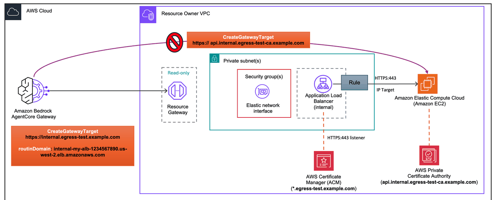

# Private Certificate Authority: ALB Solution for AgentCore Gateway

This lab demonstrates how to connect [Amazon Bedrock AgentCore Gateway](https://docs.aws.amazon.com/bedrock-agentcore/latest/devguide/gateway.html) to a backend API that uses a **private certificate** (from AWS Private CA).

AgentCore Gateway validates TLS certificates against **public root CAs only**. If your backend API uses a certificate issued by a private certificate authority (CA) or is self-signed, AgentCore Gateway cannot establish a TLS connection to it. This applies regardless of what the API runs on — it could be behind an ALB, NLB, on an EC2 instance, in ECS/EKS, or any other compute platform.

The standard fix is to replace the private certificate with a public ACM certificate. However, **public ACM certificates require DNS validation** to prove domain ownership. If you don't own the domain on the certificate (e.g., it's an internal domain managed by another team or a third-party domain), you can't obtain a public certificate for it.



## Solution

**Simplest fix:** If you can, replace the private certificate with a public ACM certificate for a domain you own. This avoids adding any new infrastructure.

**If that's not possible** (e.g., you don't own the domain, or the certificate is self-signed), deploy an **internal ALB with a public certificate** in front of your backend:

1. Get a public ACM certificate for a domain you own (e.g., `*.external.yourcompany.com`)
2. Deploy a new internal ALB with the public certificate for TLS termination
3. Point the new ALB at your backend API

The new ALB's domain does **not** need to match the backend API's domain. It terminates TLS with the public cert, then forwards to the backend over HTTPS. Your existing setup remains untouched for internal consumers.

## Architecture

**How this works step by step:**

1. Set the **target URL** to a domain that matches your public ACM certificate (e.g., `https://my-server.my-company.com`)
2. Set the **`routingDomain`** to the internal ALB DNS name (e.g., `internal-my-alb-1234567890.us-west-2.elb.amazonaws.com`)
3. VPC Lattice routes traffic to the ALB via the routing domain. The TLS SNI is set to `my-server.my-company.com`, which matches the ALB's public ACM certificate, so the **TLS handshake succeeds**
4. The ALB **terminates TLS** and applies a **host header transform** to rewrite the `Host` header from `my-server.my-company.com` to the private resource's domain (e.g., `my-server.my-company.internal`)
5. The ALB **forwards the request to your backend over HTTPS** using the private certificate. All traffic stays inside your VPC

For background on VPC egress and managed VPC resource, see the [project README](../README.md) and [Advanced Concepts README](./README.md).

## Prerequisites

- Completed [Lab 0](../00-prerequisites/00-vpc-gateway-setup.ipynb) (VPC + AgentCore Gateway deployed)
- An [ACM public certificate](../00-prerequisites/create-acm-public-certificate.md) for a domain you own

## Step 1: Install dependencies and import libraries

```python
import os
from pathlib import Path

# Change to project root
cwd = Path.cwd()
while cwd != cwd.parent:
    if (cwd / "cdk.json").exists():
        break
    cwd = cwd.parent
os.chdir(cwd)
print(f"Working directory: {os.getcwd()}")

!pip install --force-reinstall -q -r requirements.txt
```

```python
import json
import os
import time

import boto3
from utils.utils import get_token

# Restore variables from Lab 0
%store -r ACCOUNT_A_ID
%store -r ACCOUNT_A_PROFILE
%store -r GATEWAY_ID
%store -r GATEWAY_URL
%store -r USER_POOL_ID
%store -r USER_POOL_CLIENT_ID
%store -r TOKEN_ENDPOINT_URL
%store -r OAUTH_SCOPES
%store -r VPC_USW2_ID
%store -r VPC_USW2_PRIVATE_SUBNETS

os.environ["ACCOUNT_A_ID"] = ACCOUNT_A_ID

REGION = "us-west-2"
session = boto3.Session(profile_name=ACCOUNT_A_PROFILE, region_name=REGION)
agentcore = session.client("bedrock-agentcore-control")

# Get Cognito client secret
cognito = session.client("cognito-idp")
client_desc = cognito.describe_user_pool_client(UserPoolId=USER_POOL_ID, ClientId=USER_POOL_CLIENT_ID)
CLIENT_SECRET = client_desc["UserPoolClient"]["ClientSecret"]

print(f"Account:    {ACCOUNT_A_ID}")
print(f"Region:     {REGION}")
print(f"Gateway ID: {GATEWAY_ID}")
print(f"VPC ID:     {VPC_USW2_ID}")
```

## Step 2: Deploy a sample backend with a private CA cert

For this lab, we deploy a sample API that uses a TLS certificate from AWS Private CA. This simulates any internal endpoint with a private certificate — the same solution applies regardless of what your API runs on.

1. **ShortLivedPrivateCa** — An [AWS Private CA](https://docs.aws.amazon.com/privateca/latest/userguide/PcaWelcome.html) in [short-lived certificate mode](https://docs.aws.amazon.com/privateca/latest/userguide/short-lived-certificates.html) (\$50/month instead of \$400/month for general-purpose mode). Certificates are valid for up to 7 days.

2. **PrivateCaBackend** — The sample backend infrastructure:
   - An **EC2 instance** running a REST API (FastAPI) on HTTPS port 443, using a certificate issued by the Private CA
   - A **Route 53 private hosted zone** (`internal.<baseDomain>`) with an A record pointing `api.internal.<baseDomain>` to the EC2's private IP
   - An **internal NLB** (TCP passthrough on port 443) that provides a publicly resolvable DNS name for the EC2

The **NLB** provides a publicly resolvable DNS name (`internal-xxx.elb.amazonaws.com`) that VPC Lattice can use as a `routingDomain`, since the private hosted zone domain is not publicly resolvable. The NLB does TCP passthrough — it does not terminate TLS, so the EC2's private CA certificate is presented directly to the client.

> **Note:** If you have a self-signed certificate instead of a Private CA certificate, the same workaround applies, see the [self-signed certificate lab](./03-self-signed-certificate.ipynb).

> **Cost Warning:** Short-lived Private CA costs \$50/month. Make sure to destroy the `ShortLivedPrivateCa` stack when you are done with this lab.

```python
!cdk deploy ShortLivedPrivateCa --profile {ACCOUNT_A_PROFILE} --require-approval never
```

```python
!cdk deploy PrivateCaBackend --profile {ACCOUNT_A_PROFILE} --require-approval never --outputs-file backend-outputs.json
```

```python
with open("backend-outputs.json") as f:
    backend_outputs = json.load(f)["PrivateCaBackend"]

API_KEY_VALUE = backend_outputs["ApiKey"]
EC2_INSTANCE_ID = backend_outputs["Ec2InstanceId"]
EC2_PRIVATE_IP = backend_outputs["Ec2PrivateIp"]
CERT_ARN_PRIVATE = backend_outputs["CertArn"]
CERT_DOMAIN = backend_outputs["CertDomain"]
NLB_DNS = backend_outputs["NlbDnsName"]
NLB_SG_ID = backend_outputs["NlbSgId"]

print(f"EC2 instance:         {EC2_INSTANCE_ID}")
print(f"EC2 private IP:       {EC2_PRIVATE_IP}")
print(f"Private CA cert:      {CERT_ARN_PRIVATE}")
print(f"Certificate domain:   {CERT_DOMAIN}")
print(f"NLB DNS:              {NLB_DNS}")
print(f"NLB SG:               {NLB_SG_ID}")
print(f"EC2 HTTPS endpoint:   https://{CERT_DOMAIN}:443")
```

```python
# Create API key credential provider (needed for both the fail test and the working target)
cred_response = agentcore.create_api_key_credential_provider(
    name="private-cert-proxy-api-key",
    apiKey=API_KEY_VALUE,
)
CRED_PROVIDER_ARN = cred_response["credentialProviderArn"]
print(f"Credential provider ARN: {CRED_PROVIDER_ARN}")
```

### Why this doesn't work with AgentCore Gateway (optional)

Our backend uses a certificate issued by **AWS Private CA**. If we try to create an AgentCore Gateway target pointing to this endpoint, the TLS handshake will fail because AgentCore Gateway validates certificates against **public root CAs only**.

In this case target creation will pass, but when you invoke the tool you will get the following error:

```bash
Health check:
{
  "jsonrpc": "2.0",
  "id": 2,
  "result": {
    "content": [
      {
        "type": "text",
        "text": "OpenAPIClientException - Error executing HTTP request for unknown: (certificate_unknown) PKIX path building failed: sun.security.provider.certpath.SunCertPathBuilderException: unable to find valid certification path to requested target"
      }
    ],
    "isError": true
  }
}
```

To prove it, uncomment and run the cells below. They create a target using the private-cert endpoint, invoke it to see the TLS error, and clean it up. This takes a few minutes. **Skip these cells if you want to go straight to the solution.**

```python
# # The EC2 instance serves HTTPS:443 with the private CA cert.
# # The NLB provides a publicly resolvable DNS (routingDomain) so VPC Lattice
# # can route to it. But the private CA cert will cause a TLS error.
# with open("03-advanced-concepts/openapi-private.json") as f:
#     fail_schema = json.load(f)

# FAIL_ENDPOINT = f"https://{CERT_DOMAIN}"
# fail_schema["servers"] = [{"url": FAIL_ENDPOINT}]

# print(f"Target URL: {FAIL_ENDPOINT}")
# print(f"routingDomain: {NLB_DNS}")
# print(f"This will fail because the private CA cert is not trusted by AgentCore.")
```

```python
# # Create a target using the NLB as routingDomain — TLS will fail on invocation
# fail_response = agentcore.create_gateway_target(
#     gatewayIdentifier=GATEWAY_ID,
#     name="private-cert-test",
#     description="Testing private CA cert — expected to fail on invocation",
#     targetConfiguration={
#         "mcp": {
#             "openApiSchema": {
#                 "inlinePayload": json.dumps(fail_schema),
#             }
#         }
#     },
#     credentialProviderConfigurations=[
#         {
#             "credentialProviderType": "API_KEY",
#             "credentialProvider": {
#                 "apiKeyCredentialProvider": {
#                     "providerArn": CRED_PROVIDER_ARN,
#                     "credentialParameterName": "x-api-key",
#                     "credentialLocation": "HEADER",
#                 }
#             },
#         }
#     ],
#     privateEndpoint={
#         "managedVpcResource": {
#             "vpcIdentifier": VPC_USW2_ID,
#             "subnetIds": VPC_USW2_PRIVATE_SUBNETS,
#             "endpointIpAddressType": "IPV4",
#             "securityGroupIds": [NLB_SG_ID],
#             "routingDomain": NLB_DNS,
#         }
#     },
# )

# FAIL_TARGET_ID = fail_response["targetId"]
# print(f"Target ID: {FAIL_TARGET_ID}")
# print(f"Status:    {fail_response['status']}")
```

```python
# # Wait for the target to become ready, then invoke to see the TLS error
# while True:
#     fail_target = agentcore.get_gateway_target(
#         gatewayIdentifier=GATEWAY_ID, targetId=FAIL_TARGET_ID
#     )
#     status = fail_target["status"]
#     print(f"Status: {status}")
#     if status == "READY":
#         print("\nTarget is ready — but invocation will fail due to private CA cert.")
#         break
#     if status == "FAILED":
#         print(f"\nTarget creation failed: {fail_target.get('statusReasons', [])}")
#         break
#     time.sleep(30)
```

```python
# # Invoke the target — expect a TLS/certificate error
# import requests

# token_response = get_token(
#     token_endpoint_url=TOKEN_ENDPOINT_URL,
#     client_id=USER_POOL_CLIENT_ID,
#     client_secret=CLIENT_SECRET,
#     scope_string=OAUTH_SCOPES.replace(",", " "),
# )

# headers = {
#     "Authorization": f"Bearer {token_response['access_token']}",
#     "Content-Type": "application/json",
# }

# response = requests.post(
#     GATEWAY_URL,
#     headers=headers,
#     json={
#         "jsonrpc": "2.0",
#         "method": "tools/call",
#         "params": {"name": "private-cert-test___healthCheck", "arguments": {}},
#         "id": 2,
#     },
# )
# print("Health check:")
# print(json.dumps(response.json(), indent=2))
```

```python
# # Clean up the failed target
# agentcore.delete_gateway_target(gatewayIdentifier=GATEWAY_ID, targetId=FAIL_TARGET_ID)
# print(f"Deleting target: {FAIL_TARGET_ID}")
# while True:
#     try:
#         t = agentcore.get_gateway_target(
#             gatewayIdentifier=GATEWAY_ID, targetId=FAIL_TARGET_ID
#         )
#         print(f"  Status: {t['status']}")
#         time.sleep(15)
#     except agentcore.exceptions.ResourceNotFoundException:
#         print("  Target deleted.")
#         break
```

### Options

| Option | When to use |
|--------|-------------|
| **Replace private CA cert with public cert** on existing endpoint | Simplest fix — if you own the domain and can get a public ACM certificate for it |
| **Add a new ALB with public cert** in front (this lab) | When you can't modify the existing endpoint's cert, don't own the domain, or the cert is from a private CA you can't change |

We'll proceed with Option 2: deploying a new internal ALB with a public certificate in front of the existing backend.

## Step 3: Configure your public certificate

Provide an ACM public certificate ARN for a domain **you own**. This can be any domain, it does not need to match the backend API's domain. For example, if your cert is for `*.external.yourcompany.com`, enter a subdomain like `api.external.yourcompany.com`.

This domain is used as the AgentCore Gateway target URL. You do **not** need a public DNS record for it, `routingDomain` handles routing via the new ALB's DNS.

```python
CERT_ARN = input("ACM public certificate ARN: ")
DOMAIN = input("Domain name covered by the certificate (e.g., api.external.yourcompany.com): ")

assert CERT_ARN.startswith("arn:aws:acm:"), "Invalid certificate ARN"
assert not DOMAIN.startswith("http"), "Domain should not include http:// or https://"
assert "." in DOMAIN, "Domain must contain at least one dot"

print(f"Cert ARN: {CERT_ARN}")
print(f"Domain:   {DOMAIN}")
```

## Step 4: Create the public cert proxy ALB

The solution deploys a **new internal ALB** with your public ACM certificate in front of your API. We create this using boto3 so you can see exactly what parameters to pass.

The following sub-steps mirror the [documentation](https://docs.aws.amazon.com/bedrock-agentcore/latest/devguide/vpc-egress-private-endpoints.html):

1. **Create an internal ALB** in the same VPC and private subnets
2. **Create an IP-based target group** pointing to your API's IP address on **HTTPS port 443**
3. **Create an HTTPS listener** with the public ACM certificate and a **host header transform** that rewrites the `Host` header from the public domain to the private domain

The traffic flow matches the [documentation](https://docs.aws.amazon.com/bedrock-agentcore/latest/devguide/vpc-egress-private-endpoints.html):

1. VPC Lattice routes traffic to the proxy ALB via `routingDomain`
2. The TLS SNI matches the public ACM certificate — TLS handshake succeeds
3. The ALB **terminates TLS** and applies a **host header transform** (`DOMAIN` → `CERT_DOMAIN`)
4. The ALB **forwards the request over HTTPS** to the backend using the private certificate
5. All traffic stays inside the VPC

> **Note:** The ALB does not validate the backend's private certificate when forwarding over HTTPS. This is standard ALB behavior — backend certificate validation is not performed.

```python
elbv2 = session.client("elbv2")
ec2_client = session.client("ec2")

# Get VPC CIDR for security group ingress rule
vpc_info = ec2_client.describe_vpcs(VpcIds=[VPC_USW2_ID])
VPC_CIDR = vpc_info["Vpcs"][0]["CidrBlock"]

# Create security group for the proxy ALB
sg_response = ec2_client.create_security_group(
    GroupName=f"proxy-alb-sg-{int(time.time())}",
    Description="Public cert proxy ALB - HTTPS from VPC",
    VpcId=VPC_USW2_ID,
)
PROXY_ALB_SG_ID = sg_response["GroupId"]

ec2_client.authorize_security_group_ingress(
    GroupId=PROXY_ALB_SG_ID,
    IpPermissions=[
        {
            "IpProtocol": "tcp",
            "FromPort": 443,
            "ToPort": 443,
            "IpRanges": [{"CidrIp": VPC_CIDR, "Description": "HTTPS from VPC"}],
        }
    ],
)
print(f"Security group: {PROXY_ALB_SG_ID}")

# Create internal Application Load Balancer
alb_response = elbv2.create_load_balancer(
    Name="private-ca-proxy-alb",
    Subnets=VPC_USW2_PRIVATE_SUBNETS,
    SecurityGroups=[PROXY_ALB_SG_ID],
    Scheme="internal",
    Type="application",
    IpAddressType="ipv4",
)
PROXY_ALB_ARN = alb_response["LoadBalancers"][0]["LoadBalancerArn"]
PROXY_ALB_DNS = alb_response["LoadBalancers"][0]["DNSName"]
print(f"ALB ARN: {PROXY_ALB_ARN}")
print(f"ALB DNS: {PROXY_ALB_DNS}")

# Wait for ALB to become active
print("Waiting for ALB to become active...")
waiter = elbv2.get_waiter("load_balancer_available")
waiter.wait(LoadBalancerArns=[PROXY_ALB_ARN])
print("ALB is active.")
```

```python
# Create IP-based target group pointing to the backend on HTTPS:443
# The EC2 instance serves HTTPS using the private CA certificate
tg_response = elbv2.create_target_group(
    Name="private-ca-proxy-tg",
    Protocol="HTTPS",
    Port=443,
    VpcId=VPC_USW2_ID,
    TargetType="ip",
    HealthCheckProtocol="HTTPS",
    HealthCheckPort="443",
    HealthCheckPath="/health",
)
TARGET_GROUP_ARN = tg_response["TargetGroups"][0]["TargetGroupArn"]
print(f"Target group: {TARGET_GROUP_ARN}")

# Register the backend's private IP on HTTPS port 443
elbv2.register_targets(
    TargetGroupArn=TARGET_GROUP_ARN,
    Targets=[{"Id": EC2_PRIVATE_IP, "Port": 443}],
)
print(f"Registered target: {EC2_PRIVATE_IP}:443 (HTTPS)")
```

```python
# Create HTTPS listener with public ACM certificate
listener_response = elbv2.create_listener(
    LoadBalancerArn=PROXY_ALB_ARN,
    Protocol="HTTPS",
    Port=443,
    Certificates=[{"CertificateArn": CERT_ARN}],
    DefaultActions=[
        {
            "Type": "forward",
            "TargetGroupArn": TARGET_GROUP_ARN,
            "ForwardConfig": {"TargetGroups": [{"TargetGroupArn": TARGET_GROUP_ARN, "Weight": 1}]},
        }
    ],
)
LISTENER_ARN = listener_response["Listeners"][0]["ListenerArn"]
print(f"Listener ARN: {LISTENER_ARN}")

# Add a rule with host header transform (default rules can't have transforms)
# This rewrites the Host header from the public domain to the private domain
elbv2.create_rule(
    ListenerArn=LISTENER_ARN,
    Priority=1,
    Conditions=[
        {
            "Field": "path-pattern",
            "PathPatternConfig": {"Values": ["/*"]},
        }
    ],
    Actions=[
        {
            "Type": "forward",
            "TargetGroupArn": TARGET_GROUP_ARN,
            "ForwardConfig": {"TargetGroups": [{"TargetGroupArn": TARGET_GROUP_ARN, "Weight": 1}]},
        }
    ],
    Transforms=[
        {
            "Type": "host-header-rewrite",
            "HostHeaderRewriteConfig": {"Rewrites": [{"Regex": ".*", "Replace": CERT_DOMAIN}]},
        }
    ],
)
print(f"Host header transform: {DOMAIN} -> {CERT_DOMAIN}")
```

```python
print("Proxy ALB created successfully!")
print(f"  ALB DNS (routingDomain): {PROXY_ALB_DNS}")
print(f"  Security Group ID:       {PROXY_ALB_SG_ID}")
print()
print("Traffic flow:")
print("  Proxy ALB (public cert :443) -> EC2 (private CA cert :443)")
print(f"  routingDomain: {PROXY_ALB_DNS}")
print(f"  Backend IP:    {EC2_PRIVATE_IP}:443")
```

## Step 5: Create AgentCore Gateway Target

Create a gateway target using [managed VPC resource](../01-managed-vpc-resource/README.md) with `routingDomain`.

The full traffic flow:

1. The **target URL** uses a domain that matches your public ACM certificate (`https://{DOMAIN}`)
2. The **`routingDomain`** is the proxy ALB DNS name, which is publicly resolvable
3. VPC Lattice routes traffic to the ALB via the routing domain. The TLS SNI is set to `{DOMAIN}`, which matches the ALB's public ACM certificate, so the **TLS handshake succeeds**
4. The ALB **terminates TLS** and applies the **host header transform** (`{DOMAIN}` → `{CERT_DOMAIN}`)
5. The ALB **forwards the request over HTTPS** to the backend using the private certificate
6. All traffic stays inside the VPC

Your API keeps its private CA certificate as-is. Internal consumers continue accessing it directly. AgentCore Gateway uses the new ALB with the public certificate.

> **Security group:** We pass the **proxy ALB's** security group to `securityGroupIds` so the Resource Gateway ENIs can reach the new ALB on port 443.

```python
# Load the OpenAPI schema and set the server URL to the public domain
with open("03-advanced-concepts/openapi-private.json") as f:
    openapi_schema = json.load(f)

TARGET_ENDPOINT = f"https://{DOMAIN}"
openapi_schema["servers"] = [{"url": TARGET_ENDPOINT}]

OPENAPI_SCHEMA = json.dumps(openapi_schema)
print(f"Loaded OpenAPI schema: {openapi_schema['info']['title']} v{openapi_schema['info']['version']}")
print(f"Server URL: {TARGET_ENDPOINT}")
print(f"Endpoints: {list(openapi_schema['paths'].keys())}")
print(f"routingDomain: {PROXY_ALB_DNS}")
```

```python
response = agentcore.create_gateway_target(
    gatewayIdentifier=GATEWAY_ID,
    name="private-cert-proxy",
    description="Backend API with private cert, routed through public cert proxy ALB via managed VPC egress",
    targetConfiguration={
        "mcp": {
            "openApiSchema": {
                "inlinePayload": OPENAPI_SCHEMA,
            }
        }
    },
    credentialProviderConfigurations=[
        {
            "credentialProviderType": "API_KEY",
            "credentialProvider": {
                "apiKeyCredentialProvider": {
                    "providerArn": CRED_PROVIDER_ARN,
                    "credentialParameterName": "x-api-key",
                    "credentialLocation": "HEADER",
                }
            },
        }
    ],
    privateEndpoint={
        "managedVpcResource": {
            "vpcIdentifier": VPC_USW2_ID,
            "subnetIds": VPC_USW2_PRIVATE_SUBNETS,
            "endpointIpAddressType": "IPV4",
            "securityGroupIds": [PROXY_ALB_SG_ID],
            "routingDomain": PROXY_ALB_DNS,
        }
    },
)

TARGET_ID = response["targetId"]
print(f"\nTarget ID: {TARGET_ID}")
print(f"Status:    {response['status']}")
```

```python
while True:
    target = agentcore.get_gateway_target(gatewayIdentifier=GATEWAY_ID, targetId=TARGET_ID)
    status = target["status"]
    print(f"Status: {status}")
    if status == "READY":
        print("\nTarget is active!")
        print(f"  Managed resources: {target.get('privateEndpointManagedResources', {})}")
        break
    if status == "FAILED":
        print(f"\nTarget creation failed: {target.get('statusReasons', [])}")
        break
    time.sleep(30)
```

## Step 6: Invoke the API through AgentCore Gateway

Get an access token from Cognito, then invoke the API's operations through the gateway as MCP tools. The traffic flows:

```
Your request → AgentCore Gateway → VPC Lattice → Proxy ALB (public cert, TLS termination
  + host header transform) → Your API (private CA cert, HTTPS:443)
```

```python
token_response = get_token(
    token_endpoint_url=TOKEN_ENDPOINT_URL,
    client_id=USER_POOL_CLIENT_ID,
    client_secret=CLIENT_SECRET,
    scope_string=OAUTH_SCOPES.replace(",", " "),
)
ACCESS_TOKEN = token_response["access_token"]
print(f"Access token obtained (expires in {token_response['expires_in']}s)")
```

```python
import requests

headers = {
    "Authorization": f"Bearer {ACCESS_TOKEN}",
    "Content-Type": "application/json",
}

# List available tools (API operations exposed as MCP tools)
response = requests.post(
    GATEWAY_URL,
    headers=headers,
    json={"jsonrpc": "2.0", "method": "tools/list", "id": 1},
)
print("Available tools:")
print(json.dumps(response.json(), indent=2))
```

```python
# Health check
response = requests.post(
    GATEWAY_URL,
    headers=headers,
    json={
        "jsonrpc": "2.0",
        "method": "tools/call",
        "params": {"name": "private-cert-proxy___healthCheck", "arguments": {}},
        "id": 2,
    },
)
print("Health check:")
print(json.dumps(response.json(), indent=2))
```

```python
# Create an item
response = requests.post(
    GATEWAY_URL,
    headers=headers,
    json={
        "jsonrpc": "2.0",
        "method": "tools/call",
        "params": {
            "name": "private-cert-proxy___createItem",
            "arguments": {"name": "Widget", "price": 9.99},
        },
        "id": 3,
    },
)
print("Create item:")
print(json.dumps(response.json(), indent=2))
```

```python
# List items
response = requests.post(
    GATEWAY_URL,
    headers=headers,
    json={
        "jsonrpc": "2.0",
        "method": "tools/call",
        "params": {"name": "private-cert-proxy___listItems", "arguments": {}},
        "id": 4,
    },
)
print("Items:")
print(json.dumps(response.json(), indent=2))
```

## Cleanup

1. Delete the gateway target and credential provider
2. Delete the proxy ALB resources (created via boto3)
3. Destroy the CDK stacks (backend, then Private CA)
4. Delete the retained NLB security group

> **Note:** The NLB security group is retained during stack deletion because AgentCore's managed Resource Gateway ENIs may still reference it. Delete it manually after the gateway target is fully removed.

> **Cost Warning:** Short-lived Private CA costs \$50/month. Destroy the `ShortLivedPrivateCa` stack when done.

```python
# # Step 1: Delete gateway target
# agentcore.delete_gateway_target(gatewayIdentifier=GATEWAY_ID, targetId=TARGET_ID)
# print(f"Deleting target: {TARGET_ID}")
# while True:
#     try:
#         t = agentcore.get_gateway_target(gatewayIdentifier=GATEWAY_ID, targetId=TARGET_ID)
#         print(f"  Status: {t['status']}")
#         time.sleep(15)
#     except agentcore.exceptions.ResourceNotFoundException:
#         print("  Target deleted.")
#         break

# # Delete credential provider
# agentcore.delete_api_key_credential_provider(name="private-cert-proxy-api-key")
# print("Deleted credential provider: private-cert-proxy-api-key")
```

```python
# # Step 2: Delete proxy ALB resources (created via boto3)
# elbv2.delete_listener(ListenerArn=LISTENER_ARN)
# print("Deleted listener")

# elbv2.delete_load_balancer(LoadBalancerArn=PROXY_ALB_ARN)
# print("Deleting ALB...")
# waiter = elbv2.get_waiter("load_balancers_deleted")
# waiter.wait(LoadBalancerArns=[PROXY_ALB_ARN])
# print("ALB deleted")

# elbv2.delete_target_group(TargetGroupArn=TARGET_GROUP_ARN)
# print("Deleted target group")
```

```python
# # Step 3: Destroy CDK stacks (backend API)
# !cdk destroy PrivateCaBackend --profile {ACCOUNT_A_PROFILE} --force
```

```python
# # Step 3.1: Delete proxy ALB SG (may have DependencyViolation if ENIs still reference it)
# try:
#     ec2_client.delete_security_group(GroupId=PROXY_ALB_SG_ID)
#     print(f"Deleted proxy ALB security group: {PROXY_ALB_SG_ID}")
# except ec2_client.exceptions.ClientError as e:
#     if "DependencyViolation" in str(e):
#         print(f"SG {PROXY_ALB_SG_ID} still has dependencies. Wait a few minutes and retry.")
#     else:
#         raise
```

```python
# # Step 4: Destroy CDK stacks (private API)
# !cdk destroy ShortLivedPrivateCa --profile {ACCOUNT_A_PROFILE} --force
```

```python
# # Step 5: Delete the retained NLB security group
# # If this fails with "DependencyViolation", wait a few minutes for ENIs to be released
# ec2_client = session.client("ec2")
# try:
#     ec2_client.delete_security_group(GroupId=NLB_SG_ID)
#     print(f"Deleted security group: {NLB_SG_ID}")
# except ec2_client.exceptions.ClientError as e:
#     if "DependencyViolation" in str(e):
#         print(f"SG {NLB_SG_ID} still has dependencies. Wait a few minutes and retry.")
#     else:
#         raise
```
