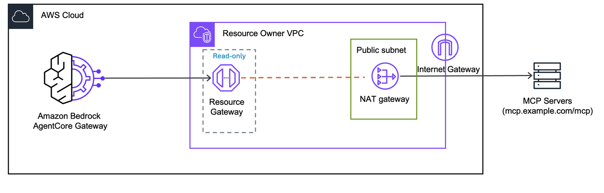

# Static Gateway IP: Allowlist AgentCore Gateway Traffic

This lab demonstrates how to give Amazon Bedrock AgentCore Gateway a **static, known IP address** so that external services can allowlist it.When AgentCore Gateway connects to an external endpoint, the traffic originates from AWS-managed IP addresses that can change. 

This creates challenges for:
- **WAF rules on your API Gateways**: Your public API gateways are behind a WAF, and tool calls from AgentCore Gateway are being blocked. You need specific IPs to allowlist in the WAF, but AgentCore Gateway's source IP range is not fixed — maintaining a WAF allowlist for a dynamic set of IPs is impractical.
- **MCP server IP allowlisting**: Your MCP server provider requires a static source IP for allowlisting, but AgentCore Gateway's source IPs are dynamic.

## The Solution

Route AgentCore Gateway traffic through your VPC using VPC egress, and exit through a **NAT Gateway with an Elastic IP**. The MCP server sees all requests coming from the NAT Gateway's static Elastic IP, which you can provide to the MCP server operator for allowlisting.



## How it works

1. AgentCore Gateway uses **managed VPC resource** to route traffic into your VPC through a Resource Gateway
2. The Resource Gateway ENIs are placed in a **private subnet** that routes outbound traffic (0.0.0.0/0) through a NAT Gateway
3. The NAT Gateway has an **Elastic IP** — a static, public IP address
4. All traffic to the external MCP server exits through this single Elastic IP
5. The MCP server allowlists this IP — only AgentCore Gateway traffic is accepted

> **Resilience vs. simplicity:** This lab uses a single NAT Gateway for a single static IP. In production, consider deploying one NAT Gateway per Availability Zone for high availability. Each NAT Gateway has its own Elastic IP, so you would provide multiple IPs to the MCP server for allowlisting.

For background on VPC egress and managed VPC resource, see the [project README](../README.md) and [Advanced Concepts README](./README.md).

## Prerequisites

- Completed [Lab 0](../00-prerequisites/00-vpc-gateway-setup.ipynb) (VPC + AgentCore Gateway deployed)

## Step 1: Install dependencies and import libraries

```python
import os
from pathlib import Path

# Change to project root
cwd = Path.cwd()
while cwd != cwd.parent:
    if (cwd / "cdk.json").exists():
        break
    cwd = cwd.parent
os.chdir(cwd)
print(f"Working directory: {os.getcwd()}")

!pip install --force-reinstall -q -r requirements.txt
```

```python
import json
import os
import time

import boto3
from utils.utils import get_token

# Restore variables from Lab 0
%store -r ACCOUNT_A_ID
%store -r ACCOUNT_A_PROFILE
%store -r GATEWAY_ID
%store -r GATEWAY_URL
%store -r USER_POOL_ID
%store -r USER_POOL_CLIENT_ID
%store -r TOKEN_ENDPOINT_URL
%store -r OAUTH_SCOPES
%store -r VPC_USW2_ID
%store -r VPC_USW2_PRIVATE_SUBNETS

os.environ["ACCOUNT_A_ID"] = ACCOUNT_A_ID

REGION = "us-west-2"
session = boto3.Session(profile_name=ACCOUNT_A_PROFILE, region_name=REGION)
agentcore = session.client("bedrock-agentcore-control")
ec2_client = session.client("ec2")

# Get Cognito client secret
cognito = session.client("cognito-idp")
client_desc = cognito.describe_user_pool_client(UserPoolId=USER_POOL_ID, ClientId=USER_POOL_CLIENT_ID)
CLIENT_SECRET = client_desc["UserPoolClient"]["ClientSecret"]

print(f"Account:    {ACCOUNT_A_ID}")
print(f"Region:     {REGION}")
print(f"Gateway ID: {GATEWAY_ID}")
print(f"VPC ID:     {VPC_USW2_ID}")
```

## Step 2: Identify the static IP

The VPC deployed in [Lab 0](../00-prerequisites/00-vpc-gateway-setup.ipynb) already has NAT Gateways with Elastic IPs — one per Availability Zone. Each private subnet routes outbound traffic (0.0.0.0/0) through its AZ's NAT Gateway.

For a **single static IP**, we use a single private subnet. All Resource Gateway ENIs in that subnet exit through one NAT Gateway with one Elastic IP.

> **Note:** No additional infrastructure is needed. We reuse the existing VPC, private subnets, and NAT Gateways from Lab 0.

```python
# Use the first private subnet (single AZ = single NAT Gateway = single static IP)
STATIC_IP_SUBNET_ID = VPC_USW2_PRIVATE_SUBNETS[0]

# Find which NAT Gateway this subnet routes through
route_tables = ec2_client.describe_route_tables(
    Filters=[{"Name": "association.subnet-id", "Values": [STATIC_IP_SUBNET_ID]}]
)["RouteTables"]

nat_gw_id = None
for route in route_tables[0]["Routes"]:
    if route.get("DestinationCidrBlock") == "0.0.0.0/0" and route.get("NatGatewayId"):
        nat_gw_id = route["NatGatewayId"]
        break

# Get the NAT Gateway's Elastic IP
nat_gw = ec2_client.describe_nat_gateways(NatGatewayIds=[nat_gw_id])["NatGateways"][0]
STATIC_IP = nat_gw["NatGatewayAddresses"][0]["PublicIp"]
AZ = nat_gw["SubnetId"]  # NAT GW subnet (public)

# Get the private subnet's AZ
subnet_info = ec2_client.describe_subnets(SubnetIds=[STATIC_IP_SUBNET_ID])["Subnets"][0]
AZ = subnet_info["AvailabilityZone"]

print(f"Private subnet:  {STATIC_IP_SUBNET_ID} ({AZ})")
print(f"NAT Gateway:     {nat_gw_id}")
print(f"Static IP:       {STATIC_IP}")
print(f"\nAll outbound traffic from this subnet exits via {STATIC_IP}")
print("Provide this IP to your MCP server operator for allowlisting.")
```

```python
# Create a security group for the Resource Gateway ENIs
# New security groups allow all outbound by default
sg = ec2_client.create_security_group(
    GroupName=f"static-ip-rg-sg-{int(time.time())}",
    Description="Resource Gateway SG for static IP lab - allows outbound HTTPS",
    VpcId=VPC_USW2_ID,
)
STATIC_IP_SG_ID = sg["GroupId"]
print(f"Security group: {STATIC_IP_SG_ID}")
```

## Step 3: Create AgentCore Gateway target

We create a gateway target that points to [httpbin.org](https://httpbin.org), a public HTTP testing service. The `/ip` endpoint returns the caller's source IP address, which lets us verify that traffic exits through our static Elastic IP.

By placing the Resource Gateway in our dedicated private subnet, all traffic to httpbin.org flows through:

```
AgentCore Gateway -> VPC Lattice -> Resource Gateway ENI (private subnet) -> NAT Gateway (EIP) -> httpbin.org
```

```python
# Define an OpenAPI schema for httpbin.org's /ip endpoint
openapi_schema = {
    "openapi": "3.0.0",
    "info": {"title": "IP Check", "version": "1.0.0"},
    "servers": [{"url": "https://httpbin.org"}],
    "paths": {
        "/ip": {
            "get": {
                "operationId": "getOriginIp",
                "summary": "Returns the origin IP address of the request",
                "responses": {
                    "200": {
                        "description": "Origin IP",
                        "content": {
                            "application/json": {
                                "schema": {
                                    "type": "object",
                                    "properties": {"origin": {"type": "string"}},
                                }
                            }
                        },
                    }
                },
            }
        }
    },
}

OPENAPI_SCHEMA = json.dumps(openapi_schema)
print("Target endpoint: https://httpbin.org/ip")
print(f"Expected source IP: {STATIC_IP}")
```

```python
# Create a dummy API key credential provider (required by AgentCore Gateway)
# httpbin.org ignores this header, but the API requires credentialProviderConfigurations
cred_response = agentcore.create_api_key_credential_provider(
    name="static-ip-check-api-key",
    apiKey="dummy-key-for-httpbin",
)
CRED_PROVIDER_ARN = cred_response["credentialProviderArn"]
print(f"Credential provider ARN: {CRED_PROVIDER_ARN}")

response = agentcore.create_gateway_target(
    gatewayIdentifier=GATEWAY_ID,
    name="static-ip-check",
    description="IP check via httpbin - verifies static IP egress through NAT Gateway",
    targetConfiguration={
        "mcp": {
            "openApiSchema": {
                "inlinePayload": OPENAPI_SCHEMA,
            }
        }
    },
    credentialProviderConfigurations=[
        {
            "credentialProviderType": "API_KEY",
            "credentialProvider": {
                "apiKeyCredentialProvider": {
                    "providerArn": CRED_PROVIDER_ARN,
                    "credentialParameterName": "x-api-key",
                    "credentialLocation": "HEADER",
                }
            },
        }
    ],
    privateEndpoint={
        "managedVpcResource": {
            "vpcIdentifier": VPC_USW2_ID,
            "subnetIds": [STATIC_IP_SUBNET_ID],
            "endpointIpAddressType": "IPV4",
            "securityGroupIds": [STATIC_IP_SG_ID],
        }
    },
)

TARGET_ID = response["targetId"]
print(f"Target ID: {TARGET_ID}")
print(f"Status:    {response['status']}")
```

```python
while True:
    target = agentcore.get_gateway_target(gatewayIdentifier=GATEWAY_ID, targetId=TARGET_ID)
    status = target["status"]
    print(f"Status: {status}")
    if status == "READY":
        print("\nTarget is active!")
        print(f"  Managed resources: {target.get('privateEndpoint', {})}")
        break
    if status == "FAILED":
        print(f"\nTarget creation failed: {target.get('statusReasons', [])}")
        break
    time.sleep(30)
```

## Step 4: Verify the static IP

Invoke the httpbin `/ip` endpoint through AgentCore Gateway. The response shows the source IP that httpbin sees — this should match our NAT Gateway's Elastic IP.

```python
token_response = get_token(
    token_endpoint_url=TOKEN_ENDPOINT_URL,
    client_id=USER_POOL_CLIENT_ID,
    client_secret=CLIENT_SECRET,
    scope_string=OAUTH_SCOPES.replace(",", " "),
)
ACCESS_TOKEN = token_response["access_token"]
print(f"Access token obtained (expires in {token_response['expires_in']}s)")
```

```python
import requests

headers = {
    "Authorization": f"Bearer {ACCESS_TOKEN}",
    "Content-Type": "application/json",
}

# Call the IP check endpoint through AgentCore Gateway
response = requests.post(
    GATEWAY_URL,
    headers=headers,
    json={
        "jsonrpc": "2.0",
        "method": "tools/call",
        "params": {"name": "static-ip-check___getOriginIp", "arguments": {}},
        "id": 1,
    },
)

result = response.json()
print("Response:")
print(json.dumps(result, indent=2))
```

```python
# Extract the origin IP from the response and compare with our Elastic IP
try:
    tool_result = result["result"]["content"][0]["text"]
    origin_data = json.loads(tool_result)
    origin_ip = origin_data["origin"]
except (KeyError, json.JSONDecodeError, IndexError):
    origin_ip = "(could not parse)"
    print(f"Raw result: {result}")

print(f"Origin IP seen by httpbin:  {origin_ip}")
print(f"NAT Gateway Elastic IP:     {STATIC_IP}")
print()
if origin_ip == STATIC_IP:
    print("MATCH - All AgentCore Gateway traffic exits through the static Elastic IP.")
    print(f"Provide this IP to your MCP server operator for allowlisting: {STATIC_IP}")
else:
    print("MISMATCH - Traffic may be using a different egress path.")
    print("Check the subnet route table and NAT Gateway configuration.")
```

## Step 5: Connect to a real MCP server

Now that we've verified the static IP, let's connect to a real external MCP server — [Exa](https://exa.ai), a search API that exposes an MCP endpoint at `https://mcp.exa.ai/mcp`.

This demonstrates the actual use case: routing AgentCore Gateway traffic to an external MCP server through your static IP, so the MCP server operator can allowlist it.

```python
# Create gateway target for Example MCP server

exa_response = agentcore.create_gateway_target(
    gatewayIdentifier=GATEWAY_ID,
    name="exa-mcp",
    description="Exa search MCP server via static IP egress through NAT Gateway",
    targetConfiguration={
        "mcp": {
            "mcpServer": {
                "endpoint": "https://mcp.exa.ai/mcp",
            }
        }
    },
    privateEndpoint={
        "managedVpcResource": {
            "vpcIdentifier": VPC_USW2_ID,
            "subnetIds": [STATIC_IP_SUBNET_ID],
            "endpointIpAddressType": "IPV4",
            "securityGroupIds": [STATIC_IP_SG_ID],
        }
    },
)

EXA_TARGET_ID = exa_response["targetId"]
print(f"Exa Target ID: {EXA_TARGET_ID}")
print(f"Status:        {exa_response['status']}")
```

```python
while True:
    target = agentcore.get_gateway_target(gatewayIdentifier=GATEWAY_ID, targetId=EXA_TARGET_ID)
    status = target["status"]
    print(f"Status: {status}")
    if status == "READY":
        print("\nExa target is active!")
        break
    if status == "FAILED":
        print(f"\nTarget creation failed: {target.get('statusReasons', [])}")
        break
    time.sleep(30)
```

```python
# List tools available on the Exa MCP server
response = requests.post(
    GATEWAY_URL,
    headers=headers,
    json={"jsonrpc": "2.0", "method": "tools/list", "id": 1},
)
# Filter to just Exa tools
tools = response.json().get("result", {}).get("tools", [])
exa_tools = [t for t in tools if t["name"].startswith("exa-mcp___")]
print(f"Exa MCP tools ({len(exa_tools)}):")
for t in exa_tools:
    print(f"  {t['name']}: {t.get('description', '')[:80]}")
```

```python
# Search the web using Exa through AgentCore Gateway
response = requests.post(
    GATEWAY_URL,
    headers=headers,
    json={
        "jsonrpc": "2.0",
        "method": "tools/call",
        "params": {
            "name": "exa-mcp___web_search_exa",
            "arguments": {"query": "Amazon Bedrock AgentCore Gateway"},
        },
        "id": 2,
    },
)
print("Exa search results:")
print(json.dumps(response.json(), indent=2))
```

## Production considerations

### High availability

This lab uses a **single NAT Gateway** in one Availability Zone for simplicity — one NAT Gateway means one Elastic IP to allowlist. In production, consider deploying one NAT Gateway per AZ for resilience:


With multiple NAT Gateways, you have multiple Elastic IPs. Provide all of them to the MCP server operator for allowlisting. If one AZ goes down, traffic fails over to the other AZ's NAT Gateway and still uses a known IP.

### Dedicated egress subnet

For tighter control, create a **dedicated private subnet** exclusively for Resource Gateway ENIs. This subnet gets its own route table pointing to a specific NAT Gateway, isolating AgentCore Gateway egress from other workloads in your VPC.


Benefits:
- **Blast radius** — security group and NACL rules scoped to just the egress subnet
- **Auditability** — VPC Flow Logs on the egress subnet capture only AgentCore Gateway traffic
- **Cost attribution** — NAT Gateway data processing charges are isolated to gateway egress

### Cost

| Resource | Cost |
|----------|------|
| Elastic IP (associated) | No charge |
| NAT Gateway | ~\$0.045/hour + \$0.045/GB processed |
| VPC Lattice | Data processing charges (per GB) |

### Security

The static IP approach ensures that only traffic routed through your VPC's NAT Gateway can reach the MCP server. Direct access from other parts of your organization is blocked because their traffic would come from different source IPs. Combine this with the MCP server's own authentication for defense in depth.

### VPC Block Public Access (BPA)

[VPC Block Public Access](https://docs.aws.amazon.com/vpc/latest/userguide/security-vpc-bpa.html) lets you block all traffic through Internet Gateways across your VPC. **NAT Gateways bypass VPC BPA** — they use a separate outbound path that is not controlled by BPA's internet gateway restrictions.

This makes VPC BPA a strong complement to the static IP pattern:

- **Enable bidirectional BPA** on the VPC to block all direct internet access via IGW
- **NAT Gateway traffic is unaffected** — Resource Gateway ENIs in private subnets continue to route outbound through the NAT Gateway
- **Defense in depth** — even if a resource in your VPC is misconfigured with a public IP, VPC BPA prevents it from reaching the internet directly

This ensures that the NAT Gateway's Elastic IP is the **only** outbound path from your VPC, giving you full control over egress traffic.

## Cleanup

1. Delete the gateway target
2. Delete the security group

> **Note:** The security group may have a `DependencyViolation` if AgentCore's managed Resource Gateway ENIs still reference it. Wait a few minutes after deleting the target before retrying.

```python
# # Step 1: Delete gateway targets
# for tid, name in [(TARGET_ID, "static-ip-check"), (EXA_TARGET_ID, "exa-mcp")]:
#     agentcore.delete_gateway_target(gatewayIdentifier=GATEWAY_ID, targetId=tid)
#     print(f"Deleting target: {tid} ({name})")
#     while True:
#         try:
#             t = agentcore.get_gateway_target(gatewayIdentifier=GATEWAY_ID, targetId=tid)
#             print(f"  Status: {t['status']}")
#             time.sleep(15)
#         except agentcore.exceptions.ResourceNotFoundException:
#             print(f"  {name} deleted.")
#             break

# # Delete credential providers
# agentcore.delete_api_key_credential_provider(name="static-ip-check-api-key")
# agentcore.delete_api_key_credential_provider(name="exa-mcp-api-key")
# print("Deleted credential providers")
```

```python
# # Step 2: Delete the security group
# # If this fails with "DependencyViolation", wait a few minutes for ENIs to be released
# try:
#     ec2_client.delete_security_group(GroupId=STATIC_IP_SG_ID)
#     print(f"Deleted security group: {STATIC_IP_SG_ID}")
# except ec2_client.exceptions.ClientError as e:
#     if "DependencyViolation" in str(e):
#         print(
#             f"SG {STATIC_IP_SG_ID} still has dependencies. Wait a few minutes and retry."
#         )
#     else:
#         raise
```
