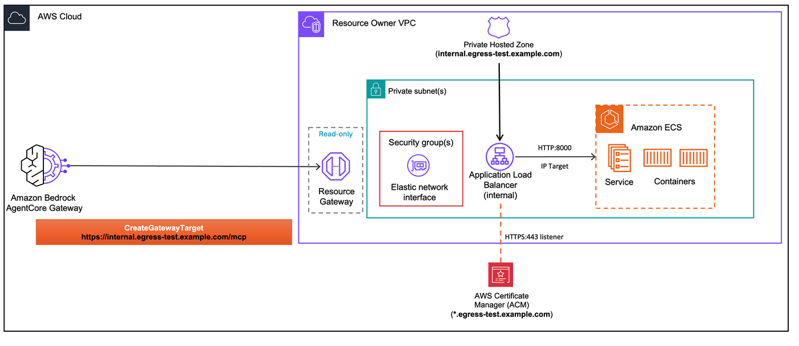

# Connecting Amazon ECS MCP Servers (Fargate) to AgentCore Gateway

This lab deploys a [FastMCP](https://github.com/jlowin/fastmcp) server on Amazon ECS Fargate inside a private VPC, then connects it to [Amazon Bedrock AgentCore Gateway](https://docs.aws.amazon.com/bedrock-agentcore/latest/devguide/gateway.html) using managed VPC egress with an internal ALB.

The MCP server is reachable via a **private domain** in a Route 53 private hosted zone associated with your VPC. With **Private DNS** enabled on the VPC (the default), AgentCore Gateway's managed Resource Gateway resolves the domain via your VPC's DNS resolver.

For background on VPC egress, certificate requirements, and Private DNS, see the [project README](../README.md), [01-managed-vpc-resource README](../01-managed-vpc-resource/README.md), and [prerequisites](../00-prerequisites/).



## Prerequisites

- Completed [Lab 0](../00-prerequisites/00-vpc-gateway-setup.ipynb) (VPC + AgentCore Gateway deployed)
- Docker running (for CDK container image builds)
- An [ACM public certificate](../00-prerequisites/create-acm-public-certificate.md) for TLS termination on the ALB

## Step 1: Install dependencies and import libraries

```python
import os
from pathlib import Path

# Change to project root
cwd = Path.cwd()
while cwd != cwd.parent:
    if (cwd / "cdk.json").exists():
        break
    cwd = cwd.parent
os.chdir(cwd)
print(f"Working directory: {os.getcwd()}")

!pip install --force-reinstall -q -r requirements.txt
```

```python
import json
import os
import time

import boto3
from utils.utils import get_token

# Restore variables from Lab 0
%store -r ACCOUNT_A_ID
%store -r ACCOUNT_A_PROFILE
%store -r GATEWAY_ID
%store -r GATEWAY_URL
%store -r USER_POOL_ID
%store -r USER_POOL_CLIENT_ID
%store -r TOKEN_ENDPOINT_URL
%store -r OAUTH_SCOPES
%store -r VPC_USW2_ID
%store -r VPC_USW2_PRIVATE_SUBNETS

os.environ["ACCOUNT_A_ID"] = ACCOUNT_A_ID

REGION = "us-west-2"
session = boto3.Session(profile_name=ACCOUNT_A_PROFILE, region_name=REGION)
agentcore = session.client("bedrock-agentcore-control")

# Get Cognito client secret
cognito = session.client("cognito-idp")
client_desc = cognito.describe_user_pool_client(UserPoolId=USER_POOL_ID, ClientId=USER_POOL_CLIENT_ID)
CLIENT_SECRET = client_desc["UserPoolClient"]["ClientSecret"]

print(f"Account:    {ACCOUNT_A_ID}")
print(f"Region:     {REGION}")
print(f"Gateway ID: {GATEWAY_ID}")
print(f"VPC ID:     {VPC_USW2_ID}")
```

```python
CERT_ARN = input("ACM public certificate ARN: ").strip()
DOMAIN = input("Domain name covered by the certificate (e.g., api.internal.yourcompany.com): ").strip()

assert CERT_ARN.startswith("arn:aws:acm:"), "Invalid certificate ARN"
assert not DOMAIN.startswith("http"), "Domain should not include http:// or https://"
assert "." in DOMAIN, "Domain must contain at least one dot"
assert " " not in DOMAIN, "Domain must not contain whitespace"

print(f"Cert ARN: {CERT_ARN}")
print(f"Domain:   {DOMAIN}")
```

## Step 2: Deploy MCP server on ECS Fargate

This CDK stack deploys:
- **ECS Fargate service** running FastMCP (echo, add, get_time tools) on port 8000, registered in Cloud Map (`mcp.local`)
- **Internal ALB** with HTTPS listener (port 443) using your ACM public certificate for TLS termination
- **Route 53 private hosted zone** named `<DOMAIN>` associated with the VPC, with an apex Alias record pointing to the ALB
- **Bastion instance** (t3.micro) with SSM Session Manager for testing

Inside the VPC, `<DOMAIN>` resolves to the ALB's private IPs via Private DNS. AgentCore Gateway's Resource Gateway uses this resolution path.

```python
!cdk deploy McpEcs \
    -c "publicCertArn={CERT_ARN}" \
    -c "privateDomain={DOMAIN}" \
    --profile {ACCOUNT_A_PROFILE} \
    --require-approval never \
    --outputs-file ecs-outputs.json
```

```python
with open("ecs-outputs.json") as f:
    ecs_outputs = json.load(f)["McpEcs"]

ALB_DNS = ecs_outputs["AlbDnsName"]
ALB_SG_ID = ecs_outputs["AlbSgId"]
PRIVATE_DOMAIN = ecs_outputs["PrivateDomain"]

print(f"Private FQDN: {PRIVATE_DOMAIN}  (resolves via Private DNS inside VPC → ALB)")
print(f"ALB DNS:      {ALB_DNS}")
print(f"ALB SG:       {ALB_SG_ID}")
```

## Step 3: Create AgentCore Gateway target

Create a gateway target using [managed VPC resource](../01-managed-vpc-resource/). Point the target at your private FQDN — Private DNS resolves it to the ALB inside the VPC.

- **Target URL** (`https://{DOMAIN}/mcp`) — resolves to the ALB's private IPs via the private hosted zone; matches the public certificate on the ALB
- **`managedVpcResource`** — VPC, subnets, and the ALB's security group so the Resource Gateway ENIs can reach the ALB on port 443

> **Security group:** We pass the ALB's security group to `securityGroupIds` so the Resource Gateway ENIs can reach the ALB on port 443.

```python
TARGET_ENDPOINT = f"https://{DOMAIN}/mcp"

print(f"Target endpoint: {TARGET_ENDPOINT}  (resolves via Private DNS inside the VPC)")

response = agentcore.create_gateway_target(
    gatewayIdentifier=GATEWAY_ID,
    name="ecs-mcp-server",
    description="MCP server on ECS Fargate via internal ALB and managed VPC egress (Private DNS)",
    targetConfiguration={
        "mcp": {
            "mcpServer": {
                "endpoint": TARGET_ENDPOINT,
            }
        }
    },
    privateEndpoint={
        "managedVpcResource": {
            "vpcIdentifier": VPC_USW2_ID,
            "subnetIds": VPC_USW2_PRIVATE_SUBNETS,
            "endpointIpAddressType": "IPV4",
            "securityGroupIds": [ALB_SG_ID],
        }
    },
)

TARGET_ID = response["targetId"]
print(f"\nTarget ID: {TARGET_ID}")
print(f"Status:    {response['status']}")
```

```python
while True:
    target = agentcore.get_gateway_target(gatewayIdentifier=GATEWAY_ID, targetId=TARGET_ID)
    status = target["status"]
    print(f"Status: {status}")
    if status == "READY":
        print("\nTarget is active!")
        print(f"  Managed resources: {target.get('privateEndpoint', {})}")
        break
    if status == "FAILED":
        print(f"\nTarget creation failed: {target.get('statusReasons', [])}")
        break
    time.sleep(30)
```

## Step 4: Invoke the MCP server through AgentCore Gateway

Get an access token from Cognito, then invoke the MCP server's tools through the gateway.

```python
token_response = get_token(
    token_endpoint_url=TOKEN_ENDPOINT_URL,
    client_id=USER_POOL_CLIENT_ID,
    client_secret=CLIENT_SECRET,
    scope_string=OAUTH_SCOPES.replace(",", " "),
)
ACCESS_TOKEN = token_response["access_token"]
print(f"Access token obtained (expires in {token_response['expires_in']}s)")
```

```python
import requests

headers = {
    "Authorization": f"Bearer {ACCESS_TOKEN}",
    "Content-Type": "application/json",
}

# List available tools
response = requests.post(
    GATEWAY_URL,
    headers=headers,
    json={"jsonrpc": "2.0", "method": "tools/list", "id": 1},
)
print("Available tools:")
print(json.dumps(response.json(), indent=2))
```

```python
# Invoke the "add" tool on the private MCP server
response = requests.post(
    GATEWAY_URL,
    headers=headers,
    json={
        "jsonrpc": "2.0",
        "method": "tools/call",
        "params": {
            "name": "ecs-mcp-server___add",
            "arguments": {"a": 5, "b": 3},
        },
        "id": 2,
    },
)
print("Result of add(5, 3):")
print(json.dumps(response.json(), indent=2))
```

## Step 5 (Optional): Connect the Stock Price MCP Server

The CDK stack deployed a second MCP server — a **stock price mock** — on the same ALB using **path-based routing**:
- `/mcp` → original MCP server (echo, add, get_time)
- `/stock-mcp/*` → stock MCP server (get_stock_price, get_market_summary)

Both share the same ALB, certificate, private hosted zone, and security group. The second target reuses the same Resource Gateway in the VPC (since the VPC/subnet/SG config matches).

```python
STOCK_TARGET_ENDPOINT = f"https://{DOMAIN}/stock-mcp/"

print(f"Stock target endpoint: {STOCK_TARGET_ENDPOINT}")

stock_response = agentcore.create_gateway_target(
    gatewayIdentifier=GATEWAY_ID,
    name="ecs-stock-mcp",
    description="Stock price MCP server on ECS Fargate via same ALB (path-based routing, Private DNS)",
    targetConfiguration={
        "mcp": {
            "mcpServer": {
                "endpoint": STOCK_TARGET_ENDPOINT,
            }
        }
    },
    privateEndpoint={
        "managedVpcResource": {
            "vpcIdentifier": VPC_USW2_ID,
            "subnetIds": VPC_USW2_PRIVATE_SUBNETS,
            "endpointIpAddressType": "IPV4",
            "securityGroupIds": [ALB_SG_ID],
        }
    },
)

STOCK_TARGET_ID = stock_response["targetId"]
print(f"\nStock Target ID: {STOCK_TARGET_ID}")
print(f"Status:          {stock_response['status']}")
```

```python
while True:
    target = agentcore.get_gateway_target(gatewayIdentifier=GATEWAY_ID, targetId=STOCK_TARGET_ID)
    status = target["status"]
    print(f"Status: {status}")
    if status == "READY":
        print("\nStock target is active!")
        break
    if status == "FAILED":
        print(f"\nTarget creation failed: {target.get('statusReasons', [])}")
        break
    time.sleep(30)
```

```python
token_response = get_token(
    token_endpoint_url=TOKEN_ENDPOINT_URL,
    client_id=USER_POOL_CLIENT_ID,
    client_secret=CLIENT_SECRET,
    scope_string=OAUTH_SCOPES.replace(",", " "),
)
ACCESS_TOKEN = token_response["access_token"]

headers = {
    "Authorization": f"Bearer {ACCESS_TOKEN}",
    "Content-Type": "application/json",
}

# List stock MCP tools
response = requests.post(
    GATEWAY_URL,
    headers=headers,
    json={"jsonrpc": "2.0", "method": "tools/list", "id": 1},
)
tools = response.json().get("result", {}).get("tools", [])
stock_tools = [t for t in tools if t["name"].startswith("ecs-stock-mcp___")]
print(f"Stock MCP tools ({len(stock_tools)}):")
for t in stock_tools:
    print(f"  {t['name']}: {t.get('description', '')[:80]}")

# Get a stock price
response = requests.post(
    GATEWAY_URL,
    headers=headers,
    json={
        "jsonrpc": "2.0",
        "method": "tools/call",
        "params": {
            "name": "ecs-stock-mcp___get_stock_price",
            "arguments": {"symbol": "AAPL"},
        },
        "id": 2,
    },
)
print("\nAAPL stock price:")
print(json.dumps(response.json(), indent=2))
```

## Cleanup

1. Delete the gateway target
2. Destroy the CDK stack (ALB SG is retained)
3. Delete the retained ALB security group

> **Note:** The ALB security group is retained during stack deletion because AgentCore's managed Resource Gateway ENIs may still reference it. Delete it manually after the gateway target is fully removed.

```python
# # Step 1: Delete gateway targets
# agentcore.delete_gateway_target(gatewayIdentifier=GATEWAY_ID, targetId=TARGET_ID)
# print(f"Deleting target: {TARGET_ID}")
# while True:
#     try:
#         t = agentcore.get_gateway_target(
#             gatewayIdentifier=GATEWAY_ID, targetId=TARGET_ID
#         )
#         print(f"  Status: {t['status']}")
#         time.sleep(15)
#     except agentcore.exceptions.ResourceNotFoundException:
#         print("  Target deleted.")
#         break

# # Delete stock target (if created in Step 5)
# try:
#     agentcore.delete_gateway_target(
#         gatewayIdentifier=GATEWAY_ID, targetId=STOCK_TARGET_ID
#     )
#     print(f"Deleting stock target: {STOCK_TARGET_ID}")
#     while True:
#         try:
#             t = agentcore.get_gateway_target(
#                 gatewayIdentifier=GATEWAY_ID, targetId=STOCK_TARGET_ID
#             )
#             print(f"  Status: {t['status']}")
#             time.sleep(15)
#         except agentcore.exceptions.ResourceNotFoundException:
#             print("  Stock target deleted.")
#             break
# except NameError:
#     pass  # Stock target was not created (Step 5 skipped)
```

```python
# # Step 2: Destroy CDK stack (ALB SG is retained, deleted in next cell)
# !ACCOUNT_A_ID={ACCOUNT_A_ID} cdk destroy McpEcs \
#     -c "publicCertArn={CERT_ARN}" \
#     -c "privateDomain={DOMAIN}" \
#     --profile {ACCOUNT_A_PROFILE} --force
```

```python
# # Step 3: Delete the retained ALB security group
# ec2_client = session.client("ec2")
# try:
#     ec2_client.delete_security_group(GroupId=ALB_SG_ID)
#     print(f"Deleted ALB security group: {ALB_SG_ID}")
# except ec2_client.exceptions.ClientError as e:
#     if "DependencyViolation" in str(e):
#         print(f"SG {ALB_SG_ID} still has dependencies. Wait a few minutes and retry.")
#     else:
#         raise
```
