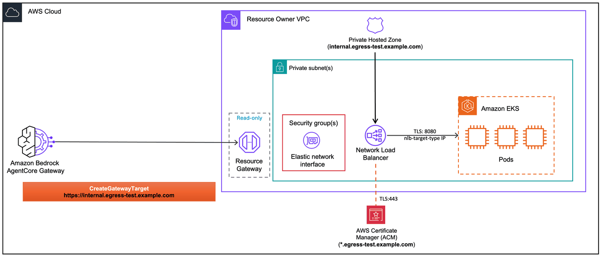

# Connecting EKS REST API to AgentCore Gateway

This lab deploys a REST API (FastAPI) on Amazon EKS inside a private VPC, then connects it to [Amazon Bedrock AgentCore Gateway](https://docs.aws.amazon.com/bedrock-agentcore/latest/devguide/gateway.html) as an **MCP target with an OpenAPI schema**, using managed VPC egress with an internal NLB.

The API is reachable via a **private domain** in a Route 53 private hosted zone associated with your VPC. With **Private DNS** enabled on the VPC (the default), AgentCore Gateway's managed Resource Gateway resolves the domain via your VPC's DNS resolver.

Unlike the MCP server lab, this lab uses an **OpenAPI schema** to describe the API endpoints. AgentCore Gateway uses the schema to expose the API operations as tools that AI agents can invoke.

For background on VPC egress, certificate requirements, and Private DNS, see the [project README](../README.md), [01-managed-vpc-resource README](../01-managed-vpc-resource/README.md), and [prerequisites](../00-prerequisites/).



## Prerequisites

- Completed [Lab 0](../00-prerequisites/00-vpc-gateway-setup.ipynb) (VPC + AgentCore Gateway deployed)
- Docker running (for CDK container image builds)
- An [ACM public certificate](../00-prerequisites/create-acm-public-certificate.md) for TLS termination on the NLB

> **Important:** If you previously ran the [MCP server notebook](./mcp-server-gateway-managed.ipynb), clean up that stack first (delete the gateway target and run `cdk destroy McpEks ...`) before deploying this one. The Shared EKS Cluster does not need to be destroyed.

## Step 1: Install dependencies and import libraries

```python
import os
from pathlib import Path

# Change to project root
cwd = Path.cwd()
while cwd != cwd.parent:
    if (cwd / "cdk.json").exists():
        break
    cwd = cwd.parent
os.chdir(cwd)
print(f"Working directory: {os.getcwd()}")

!pip install --force-reinstall -q -r requirements.txt
```

```python
import json
import os
import time

import boto3
from utils.utils import get_token

# Restore variables from Lab 0
%store -r ACCOUNT_A_ID
%store -r ACCOUNT_A_PROFILE
%store -r GATEWAY_ID
%store -r GATEWAY_URL
%store -r USER_POOL_ID
%store -r USER_POOL_CLIENT_ID
%store -r TOKEN_ENDPOINT_URL
%store -r OAUTH_SCOPES
%store -r VPC_USW2_ID
%store -r VPC_USW2_PRIVATE_SUBNETS

os.environ["ACCOUNT_A_ID"] = ACCOUNT_A_ID

REGION = "us-west-2"
session = boto3.Session(profile_name=ACCOUNT_A_PROFILE, region_name=REGION)
agentcore = session.client("bedrock-agentcore-control")

# Get Cognito client secret
cognito = session.client("cognito-idp")
client_desc = cognito.describe_user_pool_client(UserPoolId=USER_POOL_ID, ClientId=USER_POOL_CLIENT_ID)
CLIENT_SECRET = client_desc["UserPoolClient"]["ClientSecret"]

print(f"Account:    {ACCOUNT_A_ID}")
print(f"Region:     {REGION}")
print(f"Gateway ID: {GATEWAY_ID}")
print(f"VPC ID:     {VPC_USW2_ID}")
```

```python
CERT_ARN = input("ACM public certificate ARN: ").strip()
DOMAIN = input("Domain name covered by the certificate (e.g., api.internal.yourcompany.com): ").strip()

assert CERT_ARN.startswith("arn:aws:acm:"), "Invalid certificate ARN"
assert not DOMAIN.startswith("http"), "Domain should not include http:// or https://"
assert "." in DOMAIN, "Domain must contain at least one dot"
assert " " not in DOMAIN, "Domain must not contain whitespace"

print(f"Cert ARN: {CERT_ARN}")
print(f"Domain:   {DOMAIN}")
```

## Step 2: Deploy REST API on EKS

This CDK stack deploys:
- **REST API** (FastAPI: /health, /items GET/POST) as a Kubernetes Deployment on port 8080
- **Internal NLB** with TLS listener (port 443) using your ACM certificate, created via K8s Service annotations
- **Route 53 private hosted zone** named `<DOMAIN>` associated with the VPC (empty — the notebook adds an Alias record to the NLB once it's provisioned)

> **Note:** This assumes the Shared EKS Cluster (with AWS Load Balancer Controller) is already deployed from the MCP server lab or Lab 0.

```python
# # Deploy shared EKS cluster (skip if already deployed, --exclusively avoids cross-stack update issues)
# !ACCOUNT_A_ID={ACCOUNT_A_ID} cdk deploy SharedEksCluster \
#     --profile {ACCOUNT_A_PROFILE} \
#     --require-approval never \
#     --outputs-file eks-cluster-outputs.json \
#     --exclusively
```

```python
# Deploy API server on EKS with NLB + private hosted zone
!ACCOUNT_A_ID={ACCOUNT_A_ID} cdk deploy ApiEks \
    -c "publicCertArn={CERT_ARN}" \
    -c "privateDomain={DOMAIN}" \
    --profile {ACCOUNT_A_PROFILE} \
    --require-approval never \
    --outputs-file eks-api-outputs.json
```

```python
# Read CDK outputs (private hosted zone is created at deploy time; NLB DNS is filled in below)
with open("eks-api-outputs.json") as f:
    eks_api_outputs = json.load(f)["ApiEks"]

PRIVATE_ZONE_ID = eks_api_outputs["PrivateZoneId"]
PRIVATE_DOMAIN = eks_api_outputs["PrivateDomain"]
print(f"Private hosted zone: {PRIVATE_DOMAIN}  (zone ID: {PRIVATE_ZONE_ID})")

# Discover the K8s-managed NLB
print("\nWaiting for NLB to be provisioned by the AWS Load Balancer Controller...")

elbv2_client = session.client("elbv2")
ec2_client = session.client("ec2")
route53_client = session.client("route53")


def _nlb_has_healthy_target(nlb_arn):
    """Return True if any target group on this NLB has at least one healthy target.

    Why this matters: if the K8s Service has been redeployed (or moved between
    stack iterations), the AWS Load Balancer Controller can leave behind an
    orphaned NLB pointing at a stale pod IP. Both NLBs match the name filter,
    but only one routes to a live pod. Picking the first match by chance can
    silently route to the dead one and you'll see "Connection closed by peer"
    when invoking the gateway target.
    """
    tgs = elbv2_client.describe_target_groups(LoadBalancerArn=nlb_arn)["TargetGroups"]
    for tg in tgs:
        health = elbv2_client.describe_target_health(TargetGroupArn=tg["TargetGroupArn"])["TargetHealthDescriptions"]
        if any(t["TargetHealth"]["State"] == "healthy" for t in health):
            return True
    return False


NLB_DNS = None
NLB_HOSTED_ZONE_ID = None
NLB_SG_ID = None
for attempt in range(20):
    nlbs = elbv2_client.describe_load_balancers()["LoadBalancers"]
    api_nlbs = [
        n
        for n in nlbs
        if n.get("VpcId") == VPC_USW2_ID
        and n["Scheme"] == "internal"
        and n["Type"] == "network"
        and "restapi" in n.get("LoadBalancerName", "").lower().replace("-", "")
    ]
    # Prefer NLBs with at least one healthy target — skips orphaned NLBs
    healthy = [n for n in api_nlbs if _nlb_has_healthy_target(n["LoadBalancerArn"])]
    chosen = healthy[0] if healthy else (api_nlbs[0] if api_nlbs else None)
    if chosen and (healthy or attempt >= 5):
        # Either a healthy NLB exists, or we've waited long enough — accept the only candidate
        nlb = chosen
        NLB_DNS = nlb["DNSName"]
        NLB_HOSTED_ZONE_ID = nlb["CanonicalHostedZoneId"]
        NLB_SG_ID = nlb["SecurityGroups"][0] if nlb.get("SecurityGroups") else None
        if len(api_nlbs) > 1:
            stale = [n["LoadBalancerName"] for n in api_nlbs if n is not nlb]
            print(
                f"WARNING: Multiple matching NLBs found; chose {nlb['LoadBalancerName']}. "
                f"Stale (orphaned by AWS LB Controller): {stale}"
            )
        break
    print(f"  Waiting... (attempt {attempt + 1}/20)")
    time.sleep(15)

assert NLB_DNS, "NLB not found. Check if the K8s Service was created and the LB controller is running."

print(f"\nNLB DNS: {NLB_DNS}")
print(f"NLB SG:  {NLB_SG_ID}")

# Open NLB SG for inbound 443 from the VPC CIDR
if NLB_SG_ID:
    try:
        ec2_client.authorize_security_group_ingress(
            GroupId=NLB_SG_ID,
            IpPermissions=[
                {
                    "IpProtocol": "tcp",
                    "FromPort": 443,
                    "ToPort": 443,
                    "IpRanges": [{"CidrIp": "10.0.0.0/16", "Description": "Allow TLS from VPC"}],
                }
            ],
        )
        print(f"Added inbound rule: {NLB_SG_ID} <- TCP 443 from 10.0.0.0/16")
    except ec2_client.exceptions.ClientError as e:
        if "InvalidPermission.Duplicate" in str(e):
            print(f"Inbound rule already exists on {NLB_SG_ID}")
        else:
            raise

# UPSERT an Alias A record in the private hosted zone pointing at the NLB
route53_client.change_resource_record_sets(
    HostedZoneId=PRIVATE_ZONE_ID,
    ChangeBatch={
        "Changes": [
            {
                "Action": "UPSERT",
                "ResourceRecordSet": {
                    "Name": PRIVATE_DOMAIN,
                    "Type": "A",
                    "AliasTarget": {
                        "HostedZoneId": NLB_HOSTED_ZONE_ID,
                        "DNSName": NLB_DNS,
                        "EvaluateTargetHealth": False,
                    },
                },
            }
        ]
    },
)
print(f"\nUPSERT-ed Alias record: {PRIVATE_DOMAIN} -> {NLB_DNS}")
print("Inside the VPC, the private domain now resolves to the NLB's private IPs.")
```

## Step 3: Create AgentCore Gateway Target (MCP with OpenAPI schema)

For REST APIs, we use the MCP target type with an **OpenAPI schema**. AgentCore Gateway uses the schema to discover the API's operations and expose them as tools that AI agents can invoke.

The target endpoint is your private FQDN. Private DNS resolves it to the NLB's private IPs inside the VPC — no `routingDomain` needed.

> **Security group:** We pass the NLB's security group to `securityGroupIds` so the Resource Gateway ENIs can reach the NLB on port 443.

```python
# Load the OpenAPI schema and set the server URL to the target endpoint
with open("05-eks-deployment/openapi.json") as f:
    openapi_schema = json.load(f)

openapi_schema["servers"] = [{"url": f"https://{DOMAIN}"}]

OPENAPI_SCHEMA = json.dumps(openapi_schema)
print(f"Loaded OpenAPI schema: {openapi_schema['info']['title']} v{openapi_schema['info']['version']}")
print(f"Server URL: {openapi_schema['servers'][0]['url']}")
print(f"Endpoints: {list(openapi_schema['paths'].keys())}")
```

```python
# Create a dummy API key credential provider (required for OpenAPI targets)
# The REST API doesn't use auth, but AgentCore Gateway requires credentialProviderConfigurations
cred_response = agentcore.create_api_key_credential_provider(
    name="eks-api-server-api-key",
    apiKey="dummy-key-for-eks-api",
)
CRED_PROVIDER_ARN = cred_response["credentialProviderArn"]
print(f"Credential provider ARN: {CRED_PROVIDER_ARN}")
```

```python
TARGET_ENDPOINT = f"https://{DOMAIN}"

print(f"Target endpoint: {TARGET_ENDPOINT}  (resolves via Private DNS inside the VPC)")

managed_vpc_resource_config = {
    "vpcIdentifier": VPC_USW2_ID,
    "subnetIds": VPC_USW2_PRIVATE_SUBNETS,
    "endpointIpAddressType": "IPV4",
}
if NLB_SG_ID:
    managed_vpc_resource_config["securityGroupIds"] = [NLB_SG_ID]

response = agentcore.create_gateway_target(
    gatewayIdentifier=GATEWAY_ID,
    name="eks-api-server",
    description="REST API on EKS via internal NLB and managed VPC egress (Private DNS)",
    targetConfiguration={
        "mcp": {
            "openApiSchema": {
                "inlinePayload": OPENAPI_SCHEMA,
            }
        }
    },
    credentialProviderConfigurations=[
        {
            "credentialProviderType": "API_KEY",
            "credentialProvider": {
                "apiKeyCredentialProvider": {
                    "providerArn": CRED_PROVIDER_ARN,
                    "credentialParameterName": "x-api-key",
                    "credentialLocation": "HEADER",
                }
            },
        }
    ],
    privateEndpoint={
        "managedVpcResource": managed_vpc_resource_config,
    },
)

TARGET_ID = response["targetId"]
print(f"\nTarget ID: {TARGET_ID}")
print(f"Status:    {response['status']}")
```

```python
while True:
    target = agentcore.get_gateway_target(gatewayIdentifier=GATEWAY_ID, targetId=TARGET_ID)
    status = target["status"]
    print(f"Status: {status}")
    if status == "READY":
        print("\nTarget is active!")
        print(f"  Managed resources: {target.get('privateEndpoint', {})}")
        break
    if status == "FAILED":
        print(f"\nTarget creation failed: {target.get('statusReasons', [])}")
        break
    time.sleep(30)
```

## Step 4: Invoke the API through AgentCore Gateway

Get an access token from Cognito, then invoke the REST API's operations through the gateway as MCP tools.

```python
token_response = get_token(
    token_endpoint_url=TOKEN_ENDPOINT_URL,
    client_id=USER_POOL_CLIENT_ID,
    client_secret=CLIENT_SECRET,
    scope_string=OAUTH_SCOPES.replace(",", " "),
)
ACCESS_TOKEN = token_response["access_token"]
print(f"Access token obtained (expires in {token_response['expires_in']}s)")
```

```python
import requests

headers = {
    "Authorization": f"Bearer {ACCESS_TOKEN}",
    "Content-Type": "application/json",
}

# List available tools (API operations exposed as MCP tools)
response = requests.post(
    GATEWAY_URL,
    headers=headers,
    json={"jsonrpc": "2.0", "method": "tools/list", "id": 1},
)
print("Available tools:")
print(json.dumps(response.json(), indent=2))
```

```python
# Create an item via the API (invoked as an MCP tool)
response = requests.post(
    GATEWAY_URL,
    headers=headers,
    json={
        "jsonrpc": "2.0",
        "method": "tools/call",
        "params": {
            "name": "eks-api-server___createItem",
            "arguments": {"name": "Widget", "price": 9.99},
        },
        "id": 2,
    },
)
print("Created item:")
print(json.dumps(response.json(), indent=2))
```

```python
# List items via the API
response = requests.post(
    GATEWAY_URL,
    headers=headers,
    json={
        "jsonrpc": "2.0",
        "method": "tools/call",
        "params": {
            "name": "eks-api-server___listItems",
            "arguments": {},
        },
        "id": 3,
    },
)
print("Items:")
print(json.dumps(response.json(), indent=2))
```

## Cleanup

1. Delete the gateway target
2. Destroy the CDK stacks

> **Note:** Only destroy the Shared EKS Cluster if you are not running the [MCP server notebook](./mcp-server-gateway-managed.ipynb).

```python
# # Step 1: Delete gateway target
# agentcore.delete_gateway_target(gatewayIdentifier=GATEWAY_ID, targetId=TARGET_ID)
# print(f"Deleting target: {TARGET_ID}")
# while True:
#     try:
#         t = agentcore.get_gateway_target(gatewayIdentifier=GATEWAY_ID, targetId=TARGET_ID)
#         print(f"  Status: {t['status']}")
#         time.sleep(15)
#     except agentcore.exceptions.ResourceNotFoundException:
#         print("  Target deleted.")
#         break

# # Delete credential provider
# agentcore.delete_api_key_credential_provider(name="eks-api-server-api-key")
# print("Deleted credential provider")

# # Delete the Alias record from the private hosted zone
# # (CDK can't delete a hosted zone that still contains records)
# route53_client.change_resource_record_sets(
#     HostedZoneId=PRIVATE_ZONE_ID,
#     ChangeBatch={
#         "Changes": [
#             {
#                 "Action": "DELETE",
#                 "ResourceRecordSet": {
#                     "Name": PRIVATE_DOMAIN,
#                     "Type": "A",
#                     "AliasTarget": {
#                         "HostedZoneId": NLB_HOSTED_ZONE_ID,
#                         "DNSName": NLB_DNS,
#                         "EvaluateTargetHealth": False,
#                     },
#                 },
#             }
#         ]
#     },
# )
# print(f"Deleted Alias record: {PRIVATE_DOMAIN} -> {NLB_DNS}")
```

```python
# # Step 2: Destroy CDK stack
# !ACCOUNT_A_ID={ACCOUNT_A_ID} cdk destroy ApiEks \
#     -c "publicCertArn={CERT_ARN}" \
#     -c "privateDomain={DOMAIN}" \
#     --profile {ACCOUNT_A_PROFILE} --force
```

```python
# # Only destroy EKS cluster if you DO NOT want to run mcp-server-gateway-managed.ipynb notebook
# !ACCOUNT_A_ID={ACCOUNT_A_ID} cdk destroy SharedEksCluster \
#     --profile {ACCOUNT_A_PROFILE} --force
```
