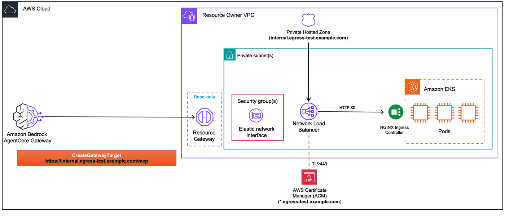

# Connecting EKS MCP Servers to AgentCore Gateway

This lab deploys two [FastMCP](https://github.com/jlowin/fastmcp) servers on Amazon EKS inside a private VPC, fronted by an [NGINX Ingress Controller](https://kubernetes.github.io/ingress-nginx/) behind a single internal NLB, then connects them to [Amazon Bedrock AgentCore Gateway](https://docs.aws.amazon.com/bedrock-agentcore/latest/devguide/gateway.html) using managed VPC egress.

The MCP servers are reachable via a **private domain** in a Route 53 private hosted zone associated with your VPC. With **Private DNS** enabled on the VPC (the default), AgentCore Gateway's managed Resource Gateway resolves the domain via your VPC's DNS resolver — no `routingDomain` workaround needed. NGINX does path-based routing so a single NLB serves both MCP servers (`/mcp-server/mcp` and `/stock-mcp/mcp`).

For background on VPC egress, certificate requirements, and Private DNS, see the [project README](../README.md), [01-managed-vpc-resource README](../01-managed-vpc-resource/README.md), and [prerequisites](../00-prerequisites/).



## Prerequisites

- Completed [Lab 0](../00-prerequisites/00-vpc-gateway-setup.ipynb) (VPC + AgentCore Gateway deployed)
- Docker running (for CDK container image builds)
- An [ACM public certificate](../00-prerequisites/create-acm-public-certificate.md) for TLS termination on the NLB

## Step 1: Install dependencies and import libraries

```python
import os
from pathlib import Path

# Change to project root
cwd = Path.cwd()
while cwd != cwd.parent:
    if (cwd / "cdk.json").exists():
        break
    cwd = cwd.parent
os.chdir(cwd)
print(f"Working directory: {os.getcwd()}")

!pip install --force-reinstall -q -r requirements.txt
```

```python
import json
import os
import time

import boto3
from utils.utils import get_token

# Restore variables from Lab 0
%store -r ACCOUNT_A_ID
%store -r ACCOUNT_A_PROFILE
%store -r GATEWAY_ID
%store -r GATEWAY_URL
%store -r USER_POOL_ID
%store -r USER_POOL_CLIENT_ID
%store -r TOKEN_ENDPOINT_URL
%store -r OAUTH_SCOPES
%store -r VPC_USW2_ID
%store -r VPC_USW2_PRIVATE_SUBNETS

os.environ["ACCOUNT_A_ID"] = ACCOUNT_A_ID

REGION = "us-west-2"
session = boto3.Session(profile_name=ACCOUNT_A_PROFILE, region_name=REGION)
agentcore = session.client("bedrock-agentcore-control")

# Get Cognito client secret
cognito = session.client("cognito-idp")
client_desc = cognito.describe_user_pool_client(UserPoolId=USER_POOL_ID, ClientId=USER_POOL_CLIENT_ID)
CLIENT_SECRET = client_desc["UserPoolClient"]["ClientSecret"]

print(f"Account:    {ACCOUNT_A_ID}")
print(f"Region:     {REGION}")
print(f"Gateway ID: {GATEWAY_ID}")
print(f"VPC ID:     {VPC_USW2_ID}")
```

```python
CERT_ARN = input("ACM public certificate ARN: ").strip()
DOMAIN = input("Domain name covered by the certificate (e.g., api.internal.yourcompany.com): ").strip()

assert CERT_ARN.startswith("arn:aws:acm:"), "Invalid certificate ARN"
assert not DOMAIN.startswith("http"), "Domain should not include http:// or https://"
assert "." in DOMAIN, "Domain must contain at least one dot"
assert " " not in DOMAIN, "Domain must not contain whitespace"

print(f"Cert ARN: {CERT_ARN}")
print(f"Domain:   {DOMAIN}")
```

## Step 2: Deploy MCP servers on EKS

This CDK stack deploys:
- **Two MCP servers** running FastMCP as Kubernetes Deployments, each with a ClusterIP Service
- **Ingress resource** with path-based routing: `/mcp-server/*` → port 8000, `/stock-mcp/*` → port 8001
- **Route 53 private hosted zone** named `<DOMAIN>` associated with the VPC (empty — the notebook adds an Alias record to the NGINX NLB once it's provisioned)

The Shared EKS Cluster (with NGINX Ingress Controller behind a single internal NLB and your ACM certificate) is deployed separately. A single NLB serves both MCP servers through NGINX path-based routing.

```python
# # Deploy shared EKS cluster with NGINX Ingress Controller (skip if already deployed)
# # --exclusively avoids cross-stack update issues
# !ACCOUNT_A_ID={ACCOUNT_A_ID} cdk deploy SharedEksCluster \
#     -c publicCertArn={CERT_ARN} \
#     --profile {ACCOUNT_A_PROFILE} \
#     --require-approval never \
#     --outputs-file eks-cluster-outputs.json \
#     --exclusively
```

```python
# Deploy MCP servers on EKS (ClusterIP services + Ingress resource + private hosted zone)
# publicCertArn is needed so CDK synthesizes the McpEks stack (gated by the cert check)
!ACCOUNT_A_ID={ACCOUNT_A_ID} cdk deploy McpEks \
    -c "publicCertArn={CERT_ARN}" \
    -c "privateDomain={DOMAIN}" \
    --profile {ACCOUNT_A_PROFILE} \
    --require-approval never \
    --outputs-file eks-mcp-outputs.json
```

```python
# Read CDK outputs (private hosted zone is created at deploy time; NLB DNS is filled in below)
with open("eks-mcp-outputs.json") as f:
    eks_mcp_outputs = json.load(f)["McpEks"]

PRIVATE_ZONE_ID = eks_mcp_outputs["PrivateZoneId"]
PRIVATE_DOMAIN = eks_mcp_outputs["PrivateDomain"]
print(f"Private hosted zone: {PRIVATE_DOMAIN}  (zone ID: {PRIVATE_ZONE_ID})")

# Discover the NGINX Ingress NLB
print("\nWaiting for NGINX Ingress NLB to be provisioned...")

elbv2_client = session.client("elbv2")
ec2_client = session.client("ec2")
route53_client = session.client("route53")


def _nlb_has_healthy_target(nlb_arn):
    """Return True if any target group on this NLB has at least one healthy target.

    Why this matters: if the NGINX Ingress Service has been redeployed, the
    AWS Load Balancer Controller can leave behind an orphaned NLB pointing at
    a stale pod IP. Both NLBs match the name filter, but only one routes to a
    live pod. Picking the first match by chance can silently route to the dead
    one and you'll see "Connection closed by peer" when invoking the gateway
    target.
    """
    tgs = elbv2_client.describe_target_groups(LoadBalancerArn=nlb_arn)["TargetGroups"]
    for tg in tgs:
        health = elbv2_client.describe_target_health(TargetGroupArn=tg["TargetGroupArn"])["TargetHealthDescriptions"]
        if any(t["TargetHealth"]["State"] == "healthy" for t in health):
            return True
    return False


NLB_DNS = None
NLB_HOSTED_ZONE_ID = None
NLB_SG_ID = None
for attempt in range(20):
    nlbs = elbv2_client.describe_load_balancers()["LoadBalancers"]
    # AWS LB Controller names NGINX NLBs like "k8s-ingressn-..." (truncated from ingress-nginx)
    nginx_nlbs = [
        n
        for n in nlbs
        if n.get("VpcId") == VPC_USW2_ID
        and n["Scheme"] == "internal"
        and n["Type"] == "network"
        and "k8s-ingressn" in n.get("LoadBalancerName", "").lower()
    ]
    # Prefer NLBs with at least one healthy target — skips orphaned NLBs
    healthy = [n for n in nginx_nlbs if _nlb_has_healthy_target(n["LoadBalancerArn"])]
    chosen = healthy[0] if healthy else (nginx_nlbs[0] if nginx_nlbs else None)
    if chosen and (healthy or attempt >= 5):
        # Either a healthy NLB exists, or we've waited long enough — accept the only candidate
        nlb = chosen
        NLB_DNS = nlb["DNSName"]
        NLB_HOSTED_ZONE_ID = nlb["CanonicalHostedZoneId"]
        NLB_SG_ID = nlb["SecurityGroups"][0] if nlb.get("SecurityGroups") else None
        if len(nginx_nlbs) > 1:
            stale = [n["LoadBalancerName"] for n in nginx_nlbs if n is not nlb]
            print(
                f"WARNING: Multiple matching NLBs found; chose {nlb['LoadBalancerName']}. "
                f"Stale (orphaned by AWS LB Controller): {stale}"
            )
        break
    print(f"  Waiting... (attempt {attempt + 1}/20)")
    time.sleep(15)

assert NLB_DNS, "NGINX Ingress NLB not found. Check if the NGINX Ingress Controller is running."

print(f"\nNLB DNS: {NLB_DNS}")
print(f"NLB SG:  {NLB_SG_ID}")

# Open NLB SG for inbound 443 from the VPC CIDR
if NLB_SG_ID:
    try:
        ec2_client.authorize_security_group_ingress(
            GroupId=NLB_SG_ID,
            IpPermissions=[
                {
                    "IpProtocol": "tcp",
                    "FromPort": 443,
                    "ToPort": 443,
                    "IpRanges": [{"CidrIp": "10.0.0.0/16", "Description": "Allow TLS from VPC"}],
                }
            ],
        )
        print(f"Added inbound rule: {NLB_SG_ID} <- TCP 443 from 10.0.0.0/16")
    except ec2_client.exceptions.ClientError as e:
        if "InvalidPermission.Duplicate" in str(e):
            print(f"Inbound rule already exists on {NLB_SG_ID}")
        else:
            raise

# UPSERT an Alias A record in the private hosted zone pointing at the NLB
route53_client.change_resource_record_sets(
    HostedZoneId=PRIVATE_ZONE_ID,
    ChangeBatch={
        "Changes": [
            {
                "Action": "UPSERT",
                "ResourceRecordSet": {
                    "Name": PRIVATE_DOMAIN,
                    "Type": "A",
                    "AliasTarget": {
                        "HostedZoneId": NLB_HOSTED_ZONE_ID,
                        "DNSName": NLB_DNS,
                        "EvaluateTargetHealth": False,
                    },
                },
            }
        ]
    },
)
print(f"\nUPSERT-ed Alias record: {PRIVATE_DOMAIN} -> {NLB_DNS}")
print("Inside the VPC, the private domain now resolves to the NLB's private IPs.")
```

## Step 3: Create AgentCore Gateway target

Create a gateway target using [managed VPC resource](../01-managed-vpc-resource/).

- **Target URL** (`https://{DOMAIN}/mcp-server/mcp`) — resolves to the NLB's private IPs via the private hosted zone; the NGINX Ingress rewrites `/mcp-server/mcp` to `/mcp` before forwarding to the pod
- **`managedVpcResource`** — VPC, subnets, and the NLB's security group so the Resource Gateway ENIs can reach the NLB on port 443

Both MCP servers share the same NLB via path-based routing. AgentCore Gateway's Resource Gateway resolves `{DOMAIN}` via Private DNS, then NGINX dispatches based on path. No `routingDomain` needed.

> **Security group:** We pass the NLB's security group to `securityGroupIds` so the Resource Gateway ENIs can reach the NLB on port 443.

```python
TARGET_ENDPOINT = f"https://{DOMAIN}/mcp-server/mcp"

print(f"Target endpoint: {TARGET_ENDPOINT}  (resolves via Private DNS inside the VPC)")

managed_vpc_resource_config = {
    "vpcIdentifier": VPC_USW2_ID,
    "subnetIds": VPC_USW2_PRIVATE_SUBNETS,
    "endpointIpAddressType": "IPV4",
}
if NLB_SG_ID:
    managed_vpc_resource_config["securityGroupIds"] = [NLB_SG_ID]

response = agentcore.create_gateway_target(
    gatewayIdentifier=GATEWAY_ID,
    name="eks-mcp-server",
    description="MCP server on EKS via NGINX Ingress and managed VPC egress (Private DNS)",
    targetConfiguration={
        "mcp": {
            "mcpServer": {
                "endpoint": TARGET_ENDPOINT,
                # Lower wins on resource URI collisions across targets — see Step 8
                "resourcePriority": 10,
            }
        }
    },
    privateEndpoint={
        "managedVpcResource": managed_vpc_resource_config,
    },
)

TARGET_ID = response["targetId"]
print(f"\nTarget ID: {TARGET_ID}")
print(f"Status:    {response['status']}")
```

```python
while True:
    target = agentcore.get_gateway_target(gatewayIdentifier=GATEWAY_ID, targetId=TARGET_ID)
    status = target["status"]
    print(f"Status: {status}")
    if status == "READY":
        print("\nTarget is active!")
        print(f"  Managed resources: {target.get('privateEndpoint', {})}")
        break
    if status == "FAILED":
        print(f"\nTarget creation failed: {target.get('statusReasons', [])}")
        break
    time.sleep(30)
```

## Step 4: Invoke the MCP server through AgentCore Gateway

Get an access token from Cognito, then invoke the MCP server's tools through the gateway.

```python
token_response = get_token(
    token_endpoint_url=TOKEN_ENDPOINT_URL,
    client_id=USER_POOL_CLIENT_ID,
    client_secret=CLIENT_SECRET,
    scope_string=OAUTH_SCOPES.replace(",", " "),
)
ACCESS_TOKEN = token_response["access_token"]
print(f"Access token obtained (expires in {token_response['expires_in']}s)")
```

```python
import requests

headers = {
    "Authorization": f"Bearer {ACCESS_TOKEN}",
    "Content-Type": "application/json",
}


def _print_req_ids(resp):
    """Print AgentCore Gateway request/trace IDs for correlating with service logs."""
    req_id = resp.headers.get("x-amzn-RequestId") or resp.headers.get("x-amz-request-id")
    trace_id = resp.headers.get("X-Amzn-Trace-Id") or resp.headers.get("x-amzn-trace-id")
    print(f"  x-amzn-RequestId: {req_id}")
    if trace_id:
        print(f"  X-Amzn-Trace-Id:  {trace_id}")


# List available tools
response = requests.post(
    GATEWAY_URL,
    headers=headers,
    json={"jsonrpc": "2.0", "method": "tools/list", "id": 1},
)
print("Available tools:")
_print_req_ids(response)
print(json.dumps(response.json(), indent=2))
```

```python
# Invoke the "add" tool on the private MCP server
response = requests.post(
    GATEWAY_URL,
    headers=headers,
    json={
        "jsonrpc": "2.0",
        "method": "tools/call",
        "params": {
            "name": "eks-mcp-server___add",
            "arguments": {"a": 5, "b": 3},
        },
        "id": 2,
    },
)
print("Result of add(5, 3):")
_print_req_ids(response)
print(json.dumps(response.json(), indent=2))
```

## Step 5 (Optional): Connect the Stock Price MCP Server

The CDK stack deployed a second MCP server — a **stock price mock** — routed through the same NGINX Ingress NLB at a different path (`/stock-mcp/mcp`). This demonstrates connecting **multiple MCP servers** through a single load balancer using path-based routing.

The second target reuses the same Resource Gateway in the VPC (since the VPC/subnet/SG config matches).

```python
STOCK_TARGET_ENDPOINT = f"https://{DOMAIN}/stock-mcp/mcp"

print(f"Stock target endpoint: {STOCK_TARGET_ENDPOINT}")

# Same VPC/subnets/SG as the first MCP server — different path
stock_vpc_resource_config = {
    "vpcIdentifier": VPC_USW2_ID,
    "subnetIds": VPC_USW2_PRIVATE_SUBNETS,
    "endpointIpAddressType": "IPV4",
}
if NLB_SG_ID:
    stock_vpc_resource_config["securityGroupIds"] = [NLB_SG_ID]

stock_response = agentcore.create_gateway_target(
    gatewayIdentifier=GATEWAY_ID,
    name="eks-stock-mcp",
    description="Stock price MCP server on EKS via NGINX Ingress (shared NLB, Private DNS)",
    targetConfiguration={
        "mcp": {
            "mcpServer": {
                "endpoint": STOCK_TARGET_ENDPOINT,
                # Higher than mcp-server's 10 — mcp-server wins resource collisions (see Step 8)
                "resourcePriority": 100,
            }
        }
    },
    privateEndpoint={
        "managedVpcResource": stock_vpc_resource_config,
    },
)

STOCK_TARGET_ID = stock_response["targetId"]
print(f"\nStock Target ID: {STOCK_TARGET_ID}")
print(f"Status:          {stock_response['status']}")
```

```python
while True:
    target = agentcore.get_gateway_target(gatewayIdentifier=GATEWAY_ID, targetId=STOCK_TARGET_ID)
    status = target["status"]
    print(f"Status: {status}")
    if status == "READY":
        print("\nStock target is active!")
        break
    if status == "FAILED":
        print(f"\nTarget creation failed: {target.get('statusReasons', [])}")
        break
    time.sleep(30)
```

```python
# List stock MCP tools
response = requests.post(
    GATEWAY_URL,
    headers=headers,
    json={"jsonrpc": "2.0", "method": "tools/list", "id": 1},
)
print("tools/list:")
_print_req_ids(response)
tools = response.json().get("result", {}).get("tools", [])
stock_tools = [t for t in tools if t["name"].startswith("eks-stock-mcp___")]
print(f"Stock MCP tools ({len(stock_tools)}):")
for t in stock_tools:
    print(f"  {t['name']}: {t.get('description', '')[:80]}")

# Get a stock price
response = requests.post(
    GATEWAY_URL,
    headers=headers,
    json={
        "jsonrpc": "2.0",
        "method": "tools/call",
        "params": {
            "name": "eks-stock-mcp___get_stock_price",
            "arguments": {"symbol": "AAPL"},
        },
        "id": 2,
    },
)
print("\nAAPL stock price:")
_print_req_ids(response)
print(json.dumps(response.json(), indent=2))
```

## Step 6: Use prompts through the Gateway

MCP **prompts** are parameterized message templates the server exposes. Gateway forwards two MCP methods:

- `prompts/list` — returns Gateway's cached catalog. Prompt names are returned with the target prefix `{targetName}___{promptName}` (triple underscore, same convention as tools).
- `prompts/get` — proxied **live** to the downstream MCP server. The `name` argument must include the `targetName___` prefix.

The mcp-server exposes one prompt: `order_summary_prompt(orderId)`.

```python
# prompts/list
response = requests.post(
    GATEWAY_URL,
    headers=headers,
    json={"jsonrpc": "2.0", "method": "prompts/list", "id": 10},
)
print("Available prompts:")
_print_req_ids(response)
print(json.dumps(response.json(), indent=2))
```

```python
# prompts/get — proxied live to the MCP server. Prefix the prompt name with the target name.
response = requests.post(
    GATEWAY_URL,
    headers=headers,
    json={
        "jsonrpc": "2.0",
        "method": "prompts/get",
        "params": {
            "name": "eks-mcp-server___order_summary_prompt",
            "arguments": {"orderId": "123"},
        },
        "id": 11,
    },
)
print("Rendered prompt:")
_print_req_ids(response)
print(json.dumps(response.json(), indent=2))
```

## Step 7: Use resources through the Gateway

MCP **resources** are addressable content the server exposes via URIs. Templated resources use [RFC 6570 URI templates](https://datatracker.ietf.org/doc/html/rfc6570) so a single handler serves many concrete URIs. Gateway forwards three methods:

- `resources/list` and `resources/templates/list` — served from Gateway's catalog. Resource URIs are returned **as-is** — there is no `target___` prefix.
- `resources/read` — proxied **live** to the downstream MCP server.

The mcp-server exposes:
- `orders://catalog` — static
- `orders://{orderId}/details` — templated
- `shared://collision-demo` — also exposed by stock-mcp (Step 8 demos `resourcePriority`)

> **Security warning:** Resource URIs are provided by the downstream MCP server target and are not validated by the gateway. A malicious or compromised MCP server could return URIs pointing to internal endpoints (SSRF) or local filesystem paths (e.g. `file:///etc/passwd`). Validate and sanitize resource URIs before fetching/rendering them.

```python
# resources/list — merged catalog from all targets, URIs returned as-is
response = requests.post(
    GATEWAY_URL,
    headers=headers,
    json={"jsonrpc": "2.0", "method": "resources/list", "id": 20},
)
print("Available resources:")
_print_req_ids(response)
print(json.dumps(response.json(), indent=2))
```

```python
# resources/read — proxied live to the MCP server (static URI)
response = requests.post(
    GATEWAY_URL,
    headers=headers,
    json={
        "jsonrpc": "2.0",
        "method": "resources/read",
        "params": {"uri": "orders://catalog"},
        "id": 21,
    },
)
print("orders://catalog →")
_print_req_ids(response)
print(json.dumps(response.json(), indent=2))
```

```python
# resources/templates/list — RFC 6570 URI templates the server registered
response = requests.post(
    GATEWAY_URL,
    headers=headers,
    json={"jsonrpc": "2.0", "method": "resources/templates/list", "id": 22},
)
print("Resource templates:")
_print_req_ids(response)
print(json.dumps(response.json(), indent=2))

# resources/read against a concrete URI derived from the template
response = requests.post(
    GATEWAY_URL,
    headers=headers,
    json={
        "jsonrpc": "2.0",
        "method": "resources/read",
        "params": {"uri": "orders://123/details"},
        "id": 23,
    },
)
print("\norders://123/details →")
_print_req_ids(response)
print(json.dumps(response.json(), indent=2))
```

## Step 8: Multi-target conflict resolution with `resourcePriority`

Tools and prompts are auto-namespaced with `{targetName}___{name}`, so collisions across targets are impossible. **Resources are different** — Gateway returns resource URIs raw. When two targets expose the same URI, Gateway resolves the read by routing to the target with the **lowest `resourcePriority`** (range `0–1000`; default `1000`; lower wins).

In this lab both MCP servers expose `shared://collision-demo` with different content:

| Target | `resourcePriority` | Returned content |
|---|---|---|
| `eks-mcp-server` | **10** (lower → wins) | `served by mcp-server (resourcePriority=10 wins over stock-mcp=100)` |
| `eks-stock-mcp` | 100 | `served by stock-mcp (resourcePriority=100 — should be shadowed by mcp-server=10)` |

Calling `resources/list` will show `shared://collision-demo` **twice** (once per target). `resources/read` resolves to the lower-priority target — mcp-server.

```python
# resources/list — shared://collision-demo appears twice (once per target)
response = requests.post(
    GATEWAY_URL,
    headers=headers,
    json={"jsonrpc": "2.0", "method": "resources/list", "id": 30},
)
print("resources/list:")
_print_req_ids(response)
collision_entries = [
    r for r in response.json().get("result", {}).get("resources", []) if r.get("uri") == "shared://collision-demo"
]
print(f"shared://collision-demo entries in resources/list: {len(collision_entries)}")
print(json.dumps(collision_entries, indent=2))
```

```python
# resources/read — Gateway routes to the lower-priority target (mcp-server, priority=10)
response = requests.post(
    GATEWAY_URL,
    headers=headers,
    json={
        "jsonrpc": "2.0",
        "method": "resources/read",
        "params": {"uri": "shared://collision-demo"},
        "id": 31,
    },
)
print("shared://collision-demo →")
_print_req_ids(response)
print(json.dumps(response.json(), indent=2))
print()
print("Expected: 'served by mcp-server (resourcePriority=10 wins over stock-mcp=100)'")
```

### Naming and conflict-resolution recap

| Capability | Naming across targets | Conflict resolution |
|---|---|---|
| Tools | `targetName___toolName` (triple underscore) | impossible — names are namespaced |
| Prompts | `targetName___promptName` (triple underscore) | impossible — names are namespaced |
| Resources | URI returned as-is, no prefix | `resourcePriority` on target (lower wins; default 1000) |
| Resource templates | URI template returned as-is, no prefix | follows `resourcePriority` |

## Cleanup

1. Delete the gateway target
2. Destroy the CDK stacks

> **Note:** Only destroy the Shared EKS Cluster if you are not running the [REST API notebook](./api-server-gateway-managed.ipynb).

```python
# # Step 1: Delete gateway targets
# agentcore.delete_gateway_target(gatewayIdentifier=GATEWAY_ID, targetId=TARGET_ID)
# print(f"Deleting target: {TARGET_ID}")
# while True:
#     try:
#         t = agentcore.get_gateway_target(gatewayIdentifier=GATEWAY_ID, targetId=TARGET_ID)
#         print(f"  Status: {t['status']}")
#         time.sleep(15)
#     except agentcore.exceptions.ResourceNotFoundException:
#         print("  Target deleted.")
#         break

# # Delete stock target (if created in Step 5)
# try:
#     agentcore.delete_gateway_target(gatewayIdentifier=GATEWAY_ID, targetId=STOCK_TARGET_ID)
#     print(f"Deleting stock target: {STOCK_TARGET_ID}")
#     while True:
#         try:
#             t = agentcore.get_gateway_target(gatewayIdentifier=GATEWAY_ID, targetId=STOCK_TARGET_ID)
#             print(f"  Status: {t['status']}")
#             time.sleep(15)
#         except agentcore.exceptions.ResourceNotFoundException:
#             print("  Stock target deleted.")
#             break
# except NameError:
#     pass  # Stock target was not created (Step 5 skipped)

# # Delete the Alias record from the private hosted zone
# # (CDK can't delete a hosted zone that still contains records)
# route53_client.change_resource_record_sets(
#     HostedZoneId=PRIVATE_ZONE_ID,
#     ChangeBatch={
#         "Changes": [
#             {
#                 "Action": "DELETE",
#                 "ResourceRecordSet": {
#                     "Name": PRIVATE_DOMAIN,
#                     "Type": "A",
#                     "AliasTarget": {
#                         "HostedZoneId": NLB_HOSTED_ZONE_ID,
#                         "DNSName": NLB_DNS,
#                         "EvaluateTargetHealth": False,
#                     },
#                 },
#             }
#         ]
#     },
# )
# print(f"Deleted Alias record: {PRIVATE_DOMAIN} -> {NLB_DNS}")
```

```python
# # Step 2: Destroy CDK stacks
# !ACCOUNT_A_ID={ACCOUNT_A_ID} cdk destroy McpEks \
#     -c "publicCertArn={CERT_ARN}" \
#     -c "privateDomain={DOMAIN}" \
#     --profile {ACCOUNT_A_PROFILE} --force
```

```python
# # Only destroy EKS cluster if you DO NOT want to run api-server-gateway-managed.ipynb notebook
# !ACCOUNT_A_ID={ACCOUNT_A_ID} cdk destroy SharedEksCluster \
#     -c publicCertArn={CERT_ARN} \
#     --profile {ACCOUNT_A_PROFILE} --force \
#     --output cdk-eks.out
```
