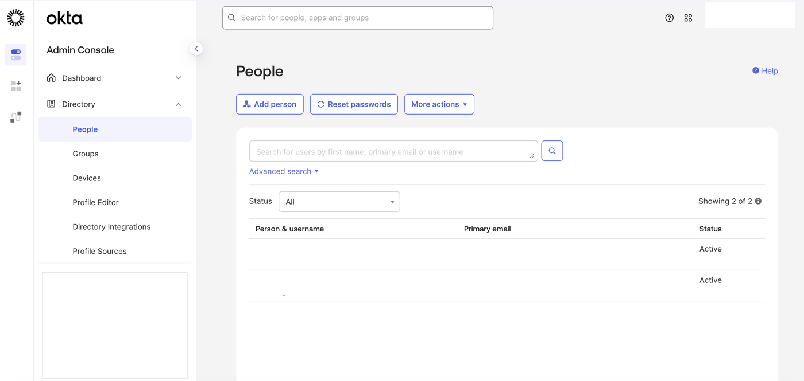
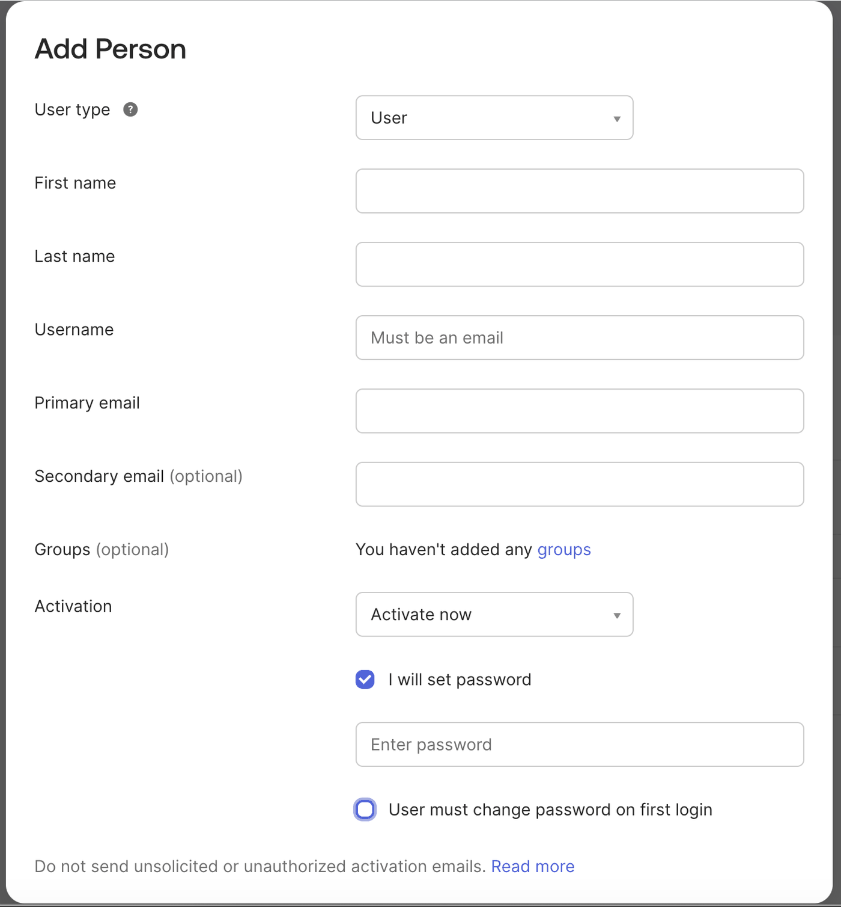
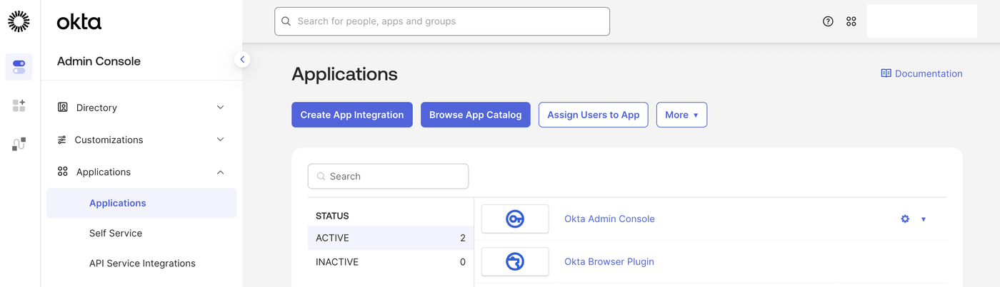
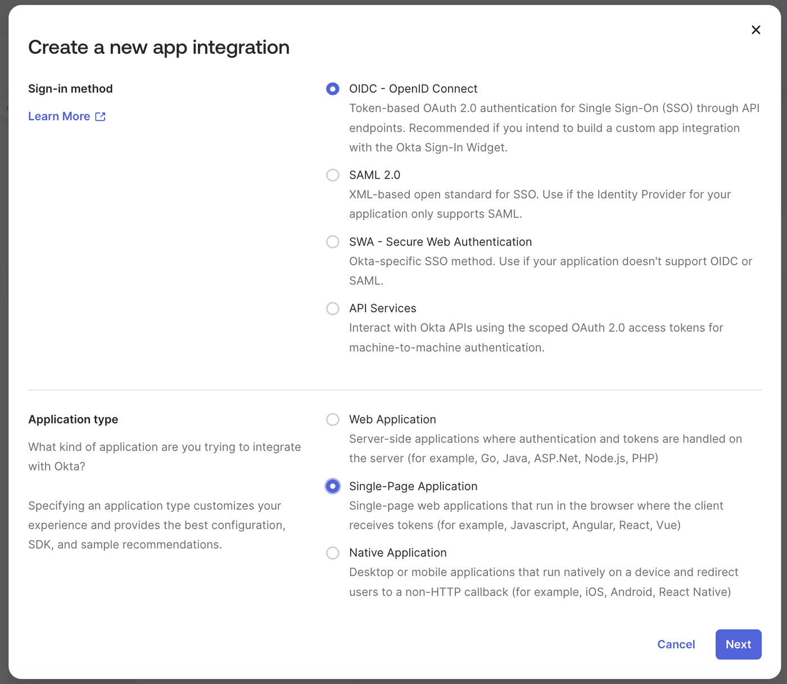
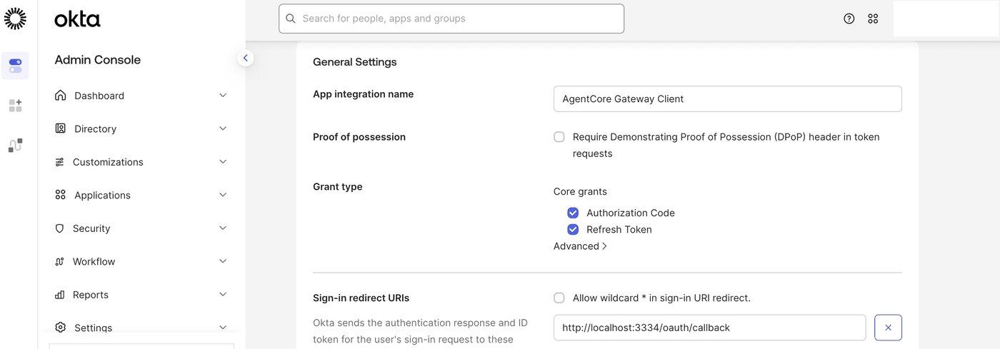
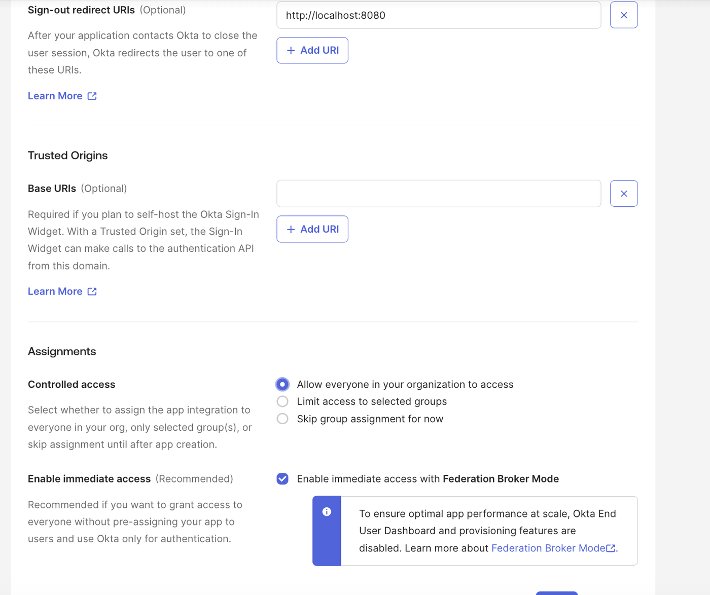
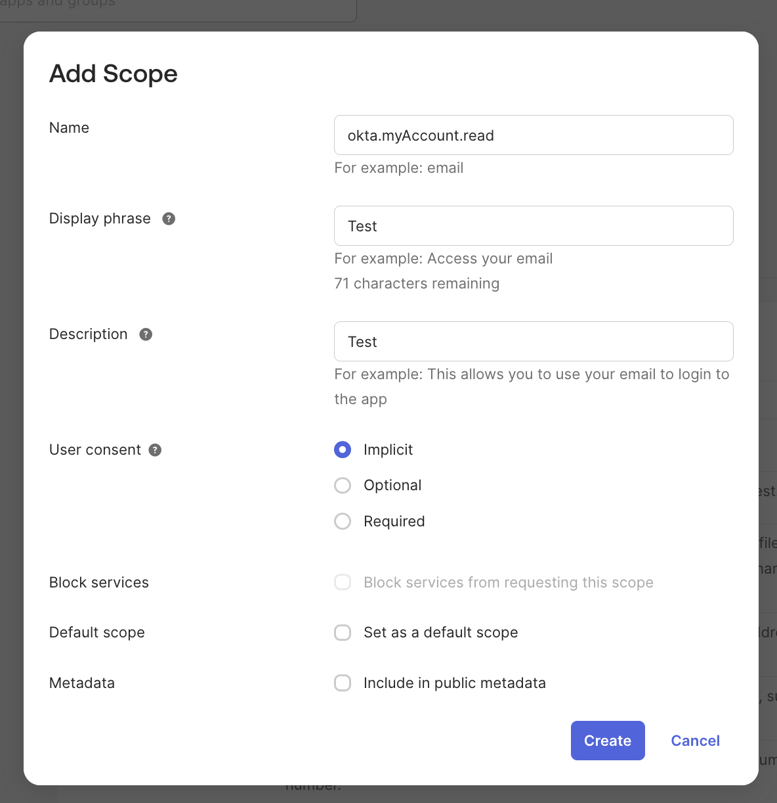
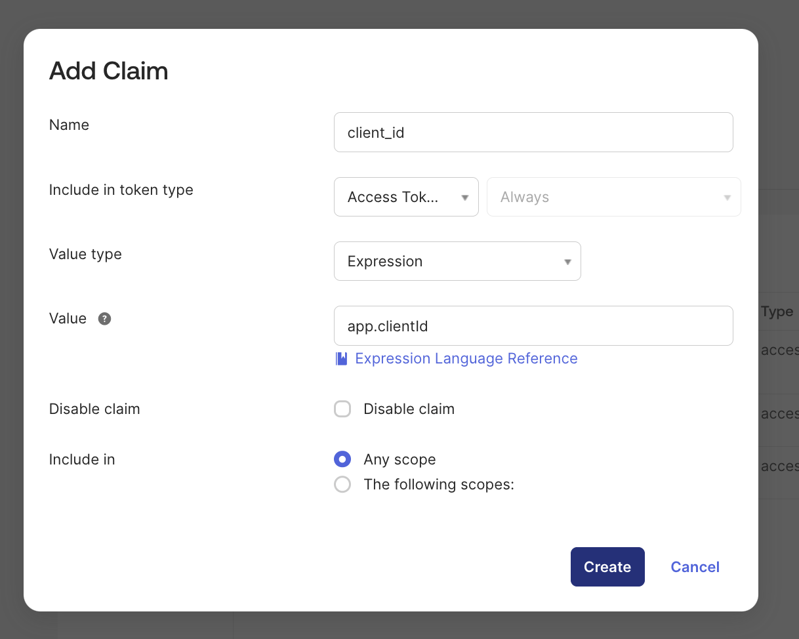
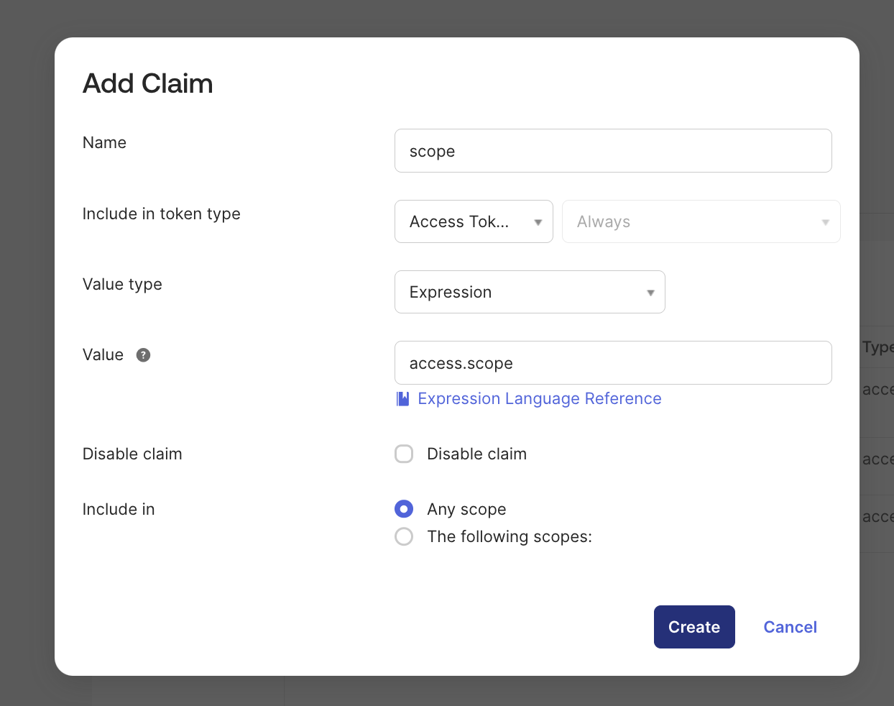

# Building Secure Auth Code Flow with AgentCore Gateway & Okta for MCP Clients

This notebook walks through the implementation of the blog post **"Building Secure Auth Code Flow setup using AgentCore Gateway with MCP clients"**, using **Okta** as the Identity Provider.

By the end of this notebook you will have:
- An Okta OIDC application configured for Authorization Code flow with PKCE
- An AgentCore Gateway with JWT inbound auth pointing to Okta
- A working Kiro IDE configuration that authenticates via Okta before accessing Gateway tools

### Prerequisites
- An AWS account with AgentCore Gateway permissions
- An Okta developer account (https://developer.okta.com/signup/)
- `mcp-remote` installed (`npm install -g mcp-remote`)
- Kiro IDE installed locally
- `boto3` installed in this Python environment

## Step 1: Configure Okta as Your Identity Provider

If you already have an Okta account, log in. Otherwise, browse to https://developer.okta.com/signup/ and select **"Sign up for Integrator Free Plan"**.

### 1.1 Create a Test User

1. Log in to your Okta admin console.
2. Select **Directory** > **People** and click **Add person**.



3. Fill in the form:
   - For **Activation**, select **Activate now**.
   - Check **I will set password** and set a password.
   - Uncheck **User must change password on first login**.
   - Click **Save**.



### 1.2 Create an OIDC Application

1. Select **Applications** > **Create App Integration**.



2. For sign-in method, select **OIDC - OpenID Connect**.
3. For application type, select **Single-Page Application** and click **Next**.



> **Important:** You must select **Single-Page Application**, not "Web Application". SPA apps are public OAuth clients that use PKCE without requiring a client secret — which is exactly what `mcp-remote` expects. A "Web Application" (confidential client) requires a `client_secret` during token exchange, causing the auth flow to fail.

#### Configure the application:

   a. **App integration name:** `AgentCore Gateway Client` (or your preferred name).
   
   b. Leave **Proof of possession** unchecked.
   
   c. **Grant type:** Select **Authorization Code** and **Refresh Token**.
   
   d. **Sign-in redirect URI:** Set to:
   ```
   http://localhost:3334/oauth/callback
   ```
   This is the callback URL that `mcp-remote` uses during the OAuth flow with Kiro IDE. Remove any other default redirect URIs.


   
   e. Leave the **Sign-out redirect URI** as is.
   
   f. Under **Assignments**, select **Allow everyone in your organization to access**, leave **Enable immediate access** checked, and click **Save**.


   
   g. Copy the **Client ID** for later use.

> **Note:** Since this is a Single-Page Application (public client), there is no Client Secret. The flow uses PKCE (Proof Key for Code Exchange) instead, which is the recommended approach for desktop/CLI OAuth clients like `mcp-remote`.

### 1.3 Configure the Authorization Server

1. In the left-hand menu, select **Security** > **API**, and click the name of your authorization server (e.g., `default`).

2. Copy the **Audience** and save it for later use.
   > **Note:** It is recommended to create a new authorization server if you plan to change the audience, so other apps are not affected.

3. Click **Scopes** > **Add Scope**:
   - **Name:** `okta.myAccount.read`
   - Give it a **Display Phrase** and **Description**.
   - Set **User Consent** to **implicit**.
   - Leave other settings at default.
   - Click **Save**.



4. Click **Claims** and add the following claims:
   - A `client_id` claim



   - A `scope` claim


   
   These are needed so the AgentCore Gateway can validate the `cid` custom claim in the JWT token.

5. Click **Access Policies** > **Add New Access Policy**:
   - Enter a **Name** and **Description**, click **Create Policy**.
   - Click **Add rule**, give it a **Rule Name**, and click **Create Rule**.

### 1.4 Save Your Configuration Values

You will need these values for the next steps:

| Value | Where to find it | Example |
|-------|------------------|---------|
| **Client ID** | Application > General tab | `0oaz7147z771FZmdQ697` |
| **Audience** | Security > API > Authorization Server | `api://default` |
| **Okta Domain** | Top-right of admin console or Settings | `dev-12345678.okta.com` |
| **Discovery URL** | Derived from domain | `https://{domain}/oauth2/default/.well-known/openid-configuration` |

## Step 2: Create AgentCore Gateway with Okta JWT Auth

We'll create a new AgentCore Gateway with JWT-based inbound authentication pointing to your Okta authorization server.

> **Note:** The Gateway's authorizer type cannot be changed after creation, so we configure it with `CUSTOM_JWT` from the start.

Enter your Okta configuration values below and run the cell.

```python
# --- Enter your Okta values ---
OKTA_DOMAIN = input("Enter your Okta domain (e.g., dev-12345678.okta.com): ")
OKTA_CLIENT_ID = input("Enter your Okta Client ID: ")
OKTA_AUDIENCE = input("Enter your Okta Audience: ")

# --- Gateway values ---
GATEWAY_NAME = "okta-auth-code-gateway"
GATEWAY_ROLE_ARN = "arn:aws:iam::265666655061:role/AgentCoreGatewayExecutionRole"
REGION = "us-west-2"

# Derived values
DISCOVERY_URL = f"https://{OKTA_DOMAIN}/oauth2/default/.well-known/openid-configuration"

print(f"\nDiscovery URL: {DISCOVERY_URL}")
print(f"Gateway Name:  {GATEWAY_NAME}")
```

```python
import boto3

client = boto3.client("bedrock-agentcore-control", region_name=REGION)

response = client.create_gateway(
    name=GATEWAY_NAME,
    roleArn=GATEWAY_ROLE_ARN,
    protocolType="MCP",
    authorizerType="CUSTOM_JWT",
    authorizerConfiguration={
        "customJWTAuthorizer": {
            "discoveryUrl": DISCOVERY_URL,
            "allowedAudience": [OKTA_AUDIENCE],
            "allowedClients": [OKTA_CLIENT_ID],
            "customClaims": [
                {
                    "inboundTokenClaimName": "cid",
                    "inboundTokenClaimValueType": "STRING",
                    "authorizingClaimMatchValue": {
                        "claimMatchValue": {"matchValueString": OKTA_CLIENT_ID},
                        "claimMatchOperator": "EQUALS",
                    },
                }
            ],
        }
    },
)

GATEWAY_ID = response["gatewayId"]
GATEWAY_URL = response["gatewayUrl"]

print(f"Gateway ID:  {GATEWAY_ID}")
print(f"Gateway URL: {GATEWAY_URL}")
print(f"Status:      {response['status']}")
print(f"Auth Type:   {response['authorizerType']}")
print("\nSave the Gateway ID and URL for the next steps.")
```

## Step 3: Verify Gateway Requires Authentication

Send an unauthenticated MCP request to confirm the Gateway requires a valid JWT token.

> **Note:** `GATEWAY_URL` was set in the previous cell from the create response. Make sure you ran Step 2 first.

```python
import requests
import json

GATEWAY_URL = f"https://{GATEWAY_ID}.gateway.bedrock-agentcore.{REGION}.amazonaws.com/mcp"

print(f"Testing: {GATEWAY_URL}\n")

resp = requests.post(
    GATEWAY_URL,
    headers={"Content-Type": "application/json"},
    json={"jsonrpc": "2.0", "method": "initialize", "params": {}, "id": 1},
)

print(f"Status Code: {resp.status_code}")
print("Headers:")
for k, v in resp.headers.items():
    if "auth" in k.lower() or "www" in k.lower():
        print(f"  {k}: {v}")
print(f"\nBody: {resp.text[:500]}")

if resp.status_code == 401:
    print("\n✓ Gateway correctly requires authentication.")
else:
    print(f"\n⚠ Expected 401, got {resp.status_code}. Check your Gateway configuration.")
```

## Step 4: Install mcp-remote

`mcp-remote` acts as the OAuth proxy between Kiro IDE and the Gateway. It handles the Authorization Code flow with PKCE, manages token refresh, and forwards authenticated requests.

Run this in your terminal (not in the notebook):

```bash
npm install -g mcp-remote
```

## Step 5: Configure Kiro IDE

Add the Gateway to your Kiro MCP configuration. The cell below generates the exact JSON you need.

> **Important for Kiro IDE:** Kiro spawns MCP server processes without inheriting your shell's `PATH` or `HOME`. You must specify the full absolute path to the `mcp-remote` binary and explicitly set `HOME` and `PATH` in the `env` section. Run `which mcp-remote` in your terminal to find the full path.

```python
import shutil
import os

MCP_PORT = "3334"

# Find the full path to mcp-remote (required for Kiro IDE)
mcp_remote_path = shutil.which("mcp-remote") or "mcp-remote"
home_dir = os.path.expanduser("~")
path_env = os.path.dirname(mcp_remote_path) + ":/usr/local/bin:/usr/bin:/bin"

kiro_config = {
    "mcpServers": {
        "gateway-tools": {
            "command": mcp_remote_path,
            "args": [
                GATEWAY_URL,
                MCP_PORT,
                "--static-oauth-client-info",
                json.dumps(
                    {
                        "client_id": OKTA_CLIENT_ID,
                        "redirect_uris": [f"http://localhost:{MCP_PORT}/oauth/callback"],
                        "scope": "openid profile email offline_access",
                    }
                ),
            ],
            "env": {"PATH": path_env, "HOME": home_dir},
        }
    }
}

config_json = json.dumps(kiro_config, indent=2)
print("Add the following to ~/.kiro/settings/mcp.json:\n")
print(config_json)
```

### Apply the configuration

1. Open (or create) `~/.kiro/settings/mcp.json`
2. Add the `gateway-tools` entry from the output above to the `mcpServers` section
3. Save the file

> **Tip:** If Kiro IDE is already open, it will automatically detect the config change and try to connect the new MCP server — no restart needed.

## Step 6: Test the End-to-End Flow

Once you save `mcp.json`, Kiro IDE automatically picks up the new config and starts connecting to the Gateway.

1. Your browser will open to Okta's login page
2. Authenticate with the test user you created in Step 1
3. You should see "Authorization successful! You may close this window" in the browser
4. Back in Kiro IDE, check the MCP server status — you should see a green checkmark next to `gateway-tools`

In the MCP Logs, a successful connection looks like:
```
[info] [gateway-tools] Successfully connected and synced tools and resources for MCP server
```

### What's happening behind the scenes:

```
Kiro IDE → mcp-remote → Gateway returns 401 with auth metadata
    → mcp-remote opens browser to Okta login
    → User authenticates with Okta
    → Okta redirects to http://localhost:3334/oauth/callback with auth code
    → mcp-remote exchanges code for access token (using PKCE)
    → mcp-remote sends tool request with Bearer token
    → Gateway validates JWT (signature, expiry, cid claim)
    → Gateway proxies request to MCP server
    → Response flows back to Kiro IDE
```
