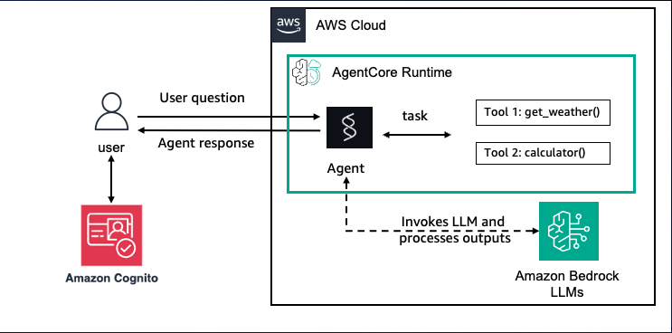

# Inbound Auth

AgentCore Identity lets you validate inbound access (Inbound Auth) for users and applications calling agents or tools in an AgentCore Runtime or validate access to AgentCore Gateway targets. It also provide secure outbound access (Outbound Auth) from an agent to external services or a Gateway target. It integrates with your existing identity providers (such as Amazon Cognito) while enforcing permission boundaries for agents acting independently or on behalf of users (via OAuth).

Inbound Auth validates callers attempting to invoke agents or tools, whether they're hosted in AgentCore Runtime, AgentCore Gateway , or in other environments. Inbound Auth works with IAM (SigV4 credentials) or with OAuth authorization.

By default, Amazon Bedrock AgentCore uses IAM credentials, meaning user requests to the agent are authenticated with the user's IAM credentials. If you use OAuth, you will need to specify the following when configuring your AgentCore Runtime resources or AgentCore Gateway endpoints:

- OAuth discovery server Url — A string that must match the pattern ^.+/\.well-known/openid-configuration$ for OpenID Connect discovery URLs

- Allowed audiences — List of allowed audiences for JWT tokens

- Allowed clients — List of allowed client identifiers

If you use the AgentCore CLI, you can specify the type of authorization (and OAuth discovery server) for an AgentCore Runtime when you use the **configure** command. You can also use the CreateAgentRuntime operation and Amazon Bedrock AgentCore console. If you are creating a Gateway, you use the CreateGateway operation, or the console.

Before the user can use the agent, the client application must have the user authenticate with the OAuth authorizer. Your client receives a bearer token which it then passes to the agent in an invocation request. Upon receipt the agent validates the token with the authorization server before allowing access.


## Overview

In this tutorial we will modify the agent you deployed in 01-AgentCore-runtime and configure it for Inbound Auth using Cognito as the Identity provider. You will set up a Cognito User pool with one user and an app client. You will learn how to host your existing agent, using Amazon Bedrock AgentCore Runtime with Inbound Auth using the Cognito user pool. 

### Tutorial Architecture

<div style="text-align:center">
    
</div>

### Tutorial Details


| Information         | Details                                                                          |
|:--------------------|:---------------------------------------------------------------------------------|
| Tutorial type       | Conversational                                                                   |
| Agent type          | Single                                                                           |
| Agentic Framework   | Strands Agents                                                                   |
| LLM model           | Anthropic Claude Haiku 4.5                                                      |
| Tutorial components | Hosting agent on AgentCore Runtime. Using Strands Agent and Amazon Bedrock Model |
| Tutorial vertical   | Cross-vertical                                                                   |
| Example complexity  | Easy                                                                             |
| Inbound Auth        | Cognito                                                                          |
| SDK used            | Amazon BedrockAgentCore Python SDK and boto3                                     |


### Tutorial Key Features

* Hosting Agents on Amazon Bedrock AgentCore Runtime with Inbound Auth using Amazon Cognito
* Using Amazon Bedrock models
* Using Strands Agents

## Prerequisites

To execute this tutorial you will need:
* Python 3.10+
* AWS credentials
* Amazon Bedrock AgentCore SDK
* Strands Agents
* Docker running

```python
!pip install --force-reinstall -U -r requirements.txt --quiet
```

## Setting up Amazon Cognito for Authentication

Lets provision a Cognito Userpool with an App client and one test user. We'll use Amazon Cognito to provide JWT tokens for accessing our deployed MCP server. To do so, we will use the `setup_cognito_user_pool` support function from our `utils` script.

Note: The Cognito access_token is valid for 2 hours only. If the access_token expires you can vend another access_token by using the `reauthenticate_user` method.

```python
import sys
import os

# Get the current notebook's directory
current_dir = os.path.dirname(os.path.abspath("__file__" if "__file__" in globals() else "."))

utils_dir = os.path.join(current_dir, "..")
utils_dir = os.path.abspath(utils_dir)

# Add to sys.path
sys.path.insert(0, utils_dir)
print("sys.path[0]:", sys.path[0])

from utils import setup_cognito_user_pool, reauthenticate_user
```

```python
print("Setting up Amazon Cognito user pool...")
cognito_config = setup_cognito_user_pool()
print("Cognito setup completed ✓")
```

## Preparing your agent for deployment on AgentCore Runtime

### Strands Agents with Amazon Bedrock model
Let's start with our Strands Agent we created in the 01-AgentCore-runtime tutorial and configure it with Inbound Auth that uses Amazon Cognito as the Identity Provider.

```python
%%writefile strands_claude.py
from strands import Agent, tool
from strands_tools import calculator # Import the calculator tool
import argparse
import json
from bedrock_agentcore.runtime import BedrockAgentCoreApp
from strands.models import BedrockModel

app = BedrockAgentCoreApp()

# Create a custom tool 
@tool
def weather():
    """ Get weather """ # Dummy implementation
    return "sunny"


model_id = "global.anthropic.claude-haiku-4-5-20251001-v1:0"
model = BedrockModel(
    model_id=model_id,
)
agent = Agent(
    model=model,
    tools=[calculator, weather],
    system_prompt="You're a helpful assistant. You can do simple math calculation, and tell the weather."
)

@app.entrypoint
def strands_agent_bedrock(payload):
    """
    Invoke the agent with a payload
    """
    user_input = payload.get("prompt")
    print("User input:", user_input)
    response = agent(user_input)
    return response.message['content'][0]['text']

if __name__ == "__main__":
    app.run()
```

## Deploying the agent to AgentCore Runtime

The `CreateAgentRuntime` operation supports comprehensive configuration options, letting you specify container images, environment variables and encryption settings. You can also configure protocol settings (HTTP, MCP) and authorization mechanisms to control how your clients communicate with the agent. 

**Note:** Operations best practice is to package code as container and push to ECR using CI/CD pipelines and IaC

In this tutorial can will the Amazon Bedrock AgentCode Python SDK to easily package your artifacts and deploy them to AgentCore runtime.

### Configure AgentCore Runtime deployment

Next we will use our starter toolkit to configure the AgentCore Runtime deployment with an entrypoint, the execution role we just created and a requirements file. We will also configure the starter kit to auto create the Amazon ECR repository on launch.

During the configure step, your docker file will be generated based on your application code

**Important** - Update the Cognito Discovery url and the Cognito App client id from the previous steps.

```python
from bedrock_agentcore_starter_toolkit import Runtime
from boto3.session import Session

boto_session = Session()
region = boto_session.region_name
region

discovery_url = cognito_config.get("discovery_url")

client_id = cognito_config.get("client_id")

agentcore_runtime = Runtime()

response = agentcore_runtime.configure(
    entrypoint="strands_claude.py",
    auto_create_execution_role=True,
    auto_create_ecr=True,
    requirements_file="requirements.txt",
    region=region,
    agent_name="strands_agent_inbound_identity",
    authorizer_configuration={
        "customJWTAuthorizer": {
            "discoveryUrl": discovery_url,
            "allowedClients": [client_id],
        }
    },
)
response
```

## Review the AgentCore configuration

```python
!cat .bedrock_agentcore.yaml
```

### Launching agent to AgentCore Runtime

Now that we've got a docker file, let's launch the agent to the AgentCore Runtime. This will create the Amazon ECR repository and the AgentCore Runtime

<div style="text-align:left">
    
</div>

```python
launch_result = agentcore_runtime.launch()
launch_result
```

### Checking for the AgentCore Runtime Status
Now that we've deployed the AgentCore Runtime, let's check for it's deployment status

```python
status_response = agentcore_runtime.status()
status = status_response.endpoint["status"]
end_status = ["READY", "CREATE_FAILED", "DELETE_FAILED", "UPDATE_FAILED"]
while status not in end_status:
    time.sleep(10)
    status_response = agentcore_runtime.status()
    status = status_response.endpoint["status"]
    print(status)
status
```

### Invoking AgentCore Runtime without authorization

Finally, we can invoke our AgentCore Runtime with a payload. Try running the following cell and you will see an error that says **"AccessDeniedException: An error occurred (AccessDeniedException) when calling the InvokeAgentRuntime operation: Agent is configured for a different authorization token type".**

<div style="text-align:left">
    
</div>

```python
invoke_response = agentcore_runtime.invoke({"prompt": "How is the weather now?"})
invoke_response
```

### Invoking AgentCore Runtime with authorization

Lets invoke the agent with the right authorization token type. In our case, it will be the Cognito access token. Copy the access token from the cell "**Provision a Cognito User Pool**"

```python
bearer_token = reauthenticate_user(cognito_config.get("client_id"))
invoke_response = agentcore_runtime.invoke({"prompt": "How is the weather now?"}, bearer_token=bearer_token)
invoke_response
```

## Cleanup (Optional)

Let's now clean up the AgentCore Runtime created

```python
from boto3.session import Session
import boto3

boto_session = Session()

agentcore_control_client = boto3.client("bedrock-agentcore-control", region_name=region)
ecr_client = boto3.client("ecr", region_name=region)

runtime_delete_response = agentcore_control_client.delete_agent_runtime(
    agentRuntimeId=launch_result.agent_id,
)

response = ecr_client.delete_repository(repositoryName=launch_result.ecr_uri.split("/")[1], force=True)
```

# Congratulations!
