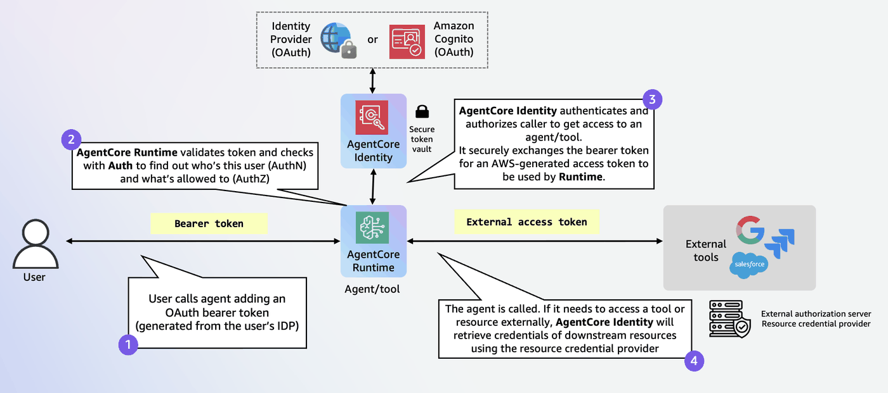
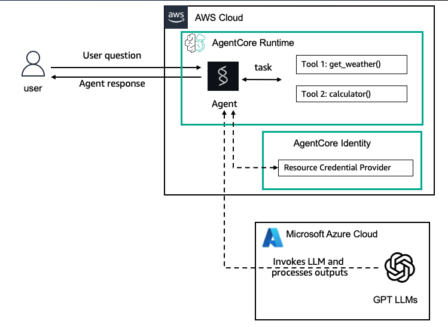
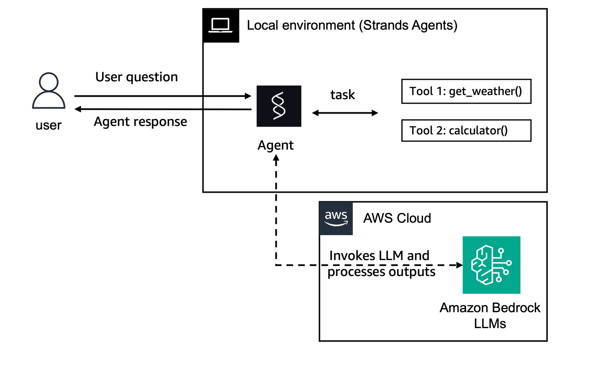

# Outbound Auth

Outbound Auth allows agents and the AgentCore Gateway to securely access AWS resources and third-party services on behalf of users who have been authenticated and authorized during Inbound Auth. To integrate authorization with an AWS resource or third-party service, it's necessary to configure both Inbound Auth and Outbound Auth.

With just-enough access and secure permission delegation supported by AgentCore Identity, agents can seamlessly and securely access AWS resources and third-party tools such as GitHub, Google, Salesforce, and Slack. Agents can perform actions on these services either on behalf of users or independently, provided there is pre-authorized user consent. Additionally, you can reduce consent fatigue using a secure token vault and create streamlined AI agent experiences.

## Outbound Authentication Configuration

First, you register your client application with third-party providers and then create an Outbound Auth. You specify how you want to validate access to the AWS resource or third-party service or AgentCore Gateway targets. You can use OAuth 2LO/3LO or API keys. With OAuth, you can select from providers that AgentCore Identity provides. In which case you enter the configuration details for the providers from AgentCore Identity. Alternatively, you can supply details for a custom provider. 

When a user wants access to an AWS resource or third-party service or AgentCore Gateway target, the Outbound Auth confirms that the access tokens provided by Incoming Auth are valid and if so, allows access to the resource.

<div style="text-align:center">
    
</div>

## Resource credential providers

This is a component that agent code uses to retrieve credentials of downstream resource servers (e.g., Google, GitHub) to access them, e.g., fetch emails from Gmail, add a meeting to Google Calendar.  It removes the heavy-lifting of agent developers implementing 2LO and 3LO OAuth2 orchestration flows across end-users, agent code, and external authorization servers. AgentCore provides both a custom OAuth2 credential provider and a list of built-in providers such Google, GitHub, Slack, Salesforce with authorization server endpoint and provider-specific parameters pre-filled.
  

Bedrock AgentCore Identity provides OAuth2 and API Key Credential Providers for agent developers to authenticate with external resources that support OAuth2 or API key. In the following example, we will walk you through configuring an API Key credential provider.  An agent can then use the API Key credential provider to retrieve the API key for any agent operations. Please refer to the documentation for the other credential providers.

 ### Creating a resource credential provider.

 Here is an example of creating a API Key resource credential provider.

```
from bedrock_agentcore.services.identity import IdentityClient
identity_client = IdentityClient(region="us-west-2")

api_key_provider = identity_client.create_api_key_credential_provider({
    "name": "APIKey-provider-name",
    "apiKey": "<my-api-key>" # Replace it with the API key you obtain from the external application vendor, e.g., OpenAI
})
print(api_key_provider)
```

 ### Retrieving access tokens or API keys from the Resource credential provider.

Here is an example of retrieving the API key from the API Key credential provider. The agent can use the API key to interact with services like a LLM or other services that use an API key configuration. In order to retrieve credentials like access_token or API key from the credential provider, you can decorate your function as shown below.

```
import asyncio
from bedrock_agentcore.identity.auth import requires_access_token, requires_api_key

@requires_api_key(
    provider_name="APIKey-provider" # replace with your own credential provider name
)
async def need_api_key(*, api_key: str):
    print(f'received api key for async func: {api_key}')

await need_api_key(api_key="")
```

Here are the various parameters you can use with the @require_access_token decorator.


| Parameter Name      | Description                                                              |
|:--------------------|:-------------------------------------------------------------------------|
| provider_name       | The credential provider name                                             |
| into                | Parameter name to inject the token into                                  |
| scopes              | OAuth2 scopes to request                                                 |
| on_auth_url	      | Callback for handling authorization URLs                                 |
| auth_flow           | Authentication flow type ("M2M" or "USER_FEDERATION")                    |
| callback_url        | OAuth2 callback URL                                                      |
| force_authentication| Force re-authentication                                                  |
| token_poller        | Custom token poller implementation                                       |

		


# Hosting Strands Agents with OpenAI models in Amazon Bedrock AgentCore Runtime

## Overview


In this tutorial we will modify the agent you deployed in 01-AgentCore-runtime, that uses openai-model and configure it for Outbound Auth using the API Key credential provider. You will set up an API Key credential provider to store the open-ai key and modify the agent code to use this key.

### Tutorial Architecture

<div style="text-align:center">
    
</div>


### Tutorial Details

| Information         | Details                                                                  |
|:--------------------|:-------------------------------------------------------------------------|
| Tutorial type       | Conversational                                                           |
| Agent type          | Single                                                                   |
| Agentic Framework   | Strands Agents                                                           |
| LLM model           | GPT 4.1 mini                                                             |
| Tutorial components | Hosting agent on AgentCore Runtime. Using Strands Agent and OpenAI Model |
| Tutorial vertical   | Cross-vertical                                                           |
| Example complexity  | Easy                                                                     |
| SDK used            | Amazon BedrockAgentCore Python SDK and boto3                             |
| Credential Provider | Type : API Key                                                           |


### Tutorial Key Features

* Hosting Agents on Amazon Bedrock AgentCore Runtime
* Using OpenAI models
* Using Strands Agents
* Using AgentCore egress Auth with API Key credential provider.

## Prerequisites

To execute this tutorial you will need:
* Python 3.10+
* AWS credentials
* Amazon Bedrock AgentCore SDK
* Strands Agents
* Docker running
* OpenAI API Keys

How to obtain OpenAI API keys:
- OpenAI: [OpenAI API keys](https://help.openai.com/en/articles/4936850-where-do-i-find-my-openai-api-key)
- Azure OpenAI: [Create Azure OpenAI resource and get keys](https://learn.microsoft.com/azure/ai-services/openai/how-to/create-resource?tabs=azure-portal)

Set environment variables before running:
- OpenAI:
  - `OPENAI_API_KEY`
- Azure OpenAI:
  - `AZURE_OPENAI_API_KEY`
  - `AZURE_OPENAI_ENDPOINT`
  - `AZURE_OPENAI_API_VERSION` (e.g., `2024-02-15-preview`)
  - `AZURE_OPENAI_DEPLOYMENT` (your deployed model name)

Optional provider switch:
- `OPENAI_PROVIDER` = `openai` (default) or `azure`

NOTE:
- Do not hardcode secrets. Use AgentCore Identity’s credential provider to store and retrieve API keys at runtime, and rotate keys regularly.

```python
!pip install --force-reinstall -U -r requirements.txt --quiet
```

## Creating your agents and experimenting locally

Before we deploy our agents to AgentCore Runtime, let's develop and run them locally for experimentation purposes.

For production agentic applications we will need to decouple the agent creation process from the agent invocation one. With AgentCore Runtime, we will decorate the invocation part of our agent with the `@app.entrypoint` decorator and have it as the entry point for our runtime. Let's first look how each agent is developed during the experimentation phase.

The architecture here will look as following:

<div style="text-align:left">
    
</div>

```python
%%writefile strands_agents_openai.py
from strands import Agent, tool
from strands_tools import calculator # Import the calculator tool
import argparse
import json
from strands.models.litellm import LiteLLMModel
import os

##Update the below configuration with your Azure API Key details.
os.environ["AZURE_API_KEY"] = "<YOUR_API_KEY>"
os.environ["AZURE_API_BASE"] = "<YOUR_API_BASE>"
os.environ["AZURE_API_VERSION"] = "<YOUR_API_VERSION>"

# Create a custom tool 
@tool
def weather():
    """ Get weather """ # Dummy implementation
    return "sunny"

model = "azure/gpt-4.1-mini"
litellm_model = LiteLLMModel(
    model_id=model, params={"max_tokens": 32000, "temperature": 0.7}
)


agent = Agent(
    model=litellm_model,
    tools=[calculator, weather],
    system_prompt="You're a helpful assistant. You can do simple math calculation, and tell the weather."
)

def strands_agent_open_ai(payload):
    """
    Invoke the agent with a payload
    """
    user_input = payload.get("prompt")
    response = agent(user_input)
    return response.message['content'][0]['text']

if __name__ == "__main__":
    parser = argparse.ArgumentParser()
    parser.add_argument("payload", type=str)
    args = parser.parse_args()
    response = strands_agent_open_ai(json.loads(args.payload))
    print(response)
```

#### Invoking local agent

```python
!python strands_agents_openai.py '{"prompt": "What is the weather now?"}'
```

## Create a Resource Credential Provider

```python
from bedrock_agentcore.services.identity import IdentityClient

from boto3.session import Session
import boto3

boto_session = Session()
region = boto_session.region_name

# Configure API Key Provider
identity_client = IdentityClient(region=region)

api_key_provider = identity_client.create_api_key_credential_provider(
    {
        "name": "openai-apikey-provider",
        "apiKey": "<YOUR_API_KEY>",  # Replace it with the API key you obtain from the external application vendor, e.g., OpenAI
    }
)
print(api_key_provider)
```

## Preparing your agent for deployment on AgentCore Runtime and use the Resource Credential Provider

Let's now deploy our agents to AgentCore Runtime. To do so we need to:
* Import the Runtime App with `from bedrock_agentcore.runtime import BedrockAgentCoreApp`
* Initialize the App in our code with `app = BedrockAgentCoreApp()`
* Decorate the invocation function with the `@app.entrypoint` decorator
* Let AgentCoreRuntime control the running of the agent with `app.run()`
* Retrieve the openAI key from the resource credential provider created in the previous step

### Strands Agents with OpenAI model
Let's start with our Strands Agent using the GPT 4.1 mini model. All the others will work exactly the same.

```python
%%writefile strands_agents_openai.py
import asyncio
from bedrock_agentcore.identity.auth import requires_access_token, requires_api_key
from strands import Agent, tool
from strands_tools import calculator 
import argparse
import json
from strands.models.litellm import LiteLLMModel
import os
from bedrock_agentcore.runtime import BedrockAgentCoreApp

AZURE_API_KEY_FROM_CREDS_PROVIDER = ""


@requires_api_key(
    provider_name="openai-apikey-provider" # replace with your own credential provider name
)
async def need_api_key(*, api_key: str):
    global AZURE_API_KEY_FROM_CREDS_PROVIDER
    print(f'received api key for async func: {api_key}')
    AZURE_API_KEY_FROM_CREDS_PROVIDER = api_key

# Don't print empty value at module level - will print in entrypoint function

app = BedrockAgentCoreApp()

# API key will be set dynamically in the entrypoint function
#Update the below configuration with your Azure API Key details.
os.environ["AZURE_API_BASE"] = "<YOUR_API_BASE>"
os.environ["AZURE_API_VERSION"] = "<YOUR_API_VERSION>"

# Create a custom tool 
@tool
def weather():
    """ Get weather """ # Dummy implementation
    return "sunny"

# Global agent variable
agent = None

@app.entrypoint
async def strands_agent_open_ai(payload):
    """
    Invoke the agent with a payload
    """
    global AZURE_API_KEY_FROM_CREDS_PROVIDER, agent
    
    print(f"Entrypoint called with AZURE_API_KEY_FROM_CREDS_PROVIDER: '{AZURE_API_KEY_FROM_CREDS_PROVIDER}'")
    
    # Get API key if not already retrieved
    if not AZURE_API_KEY_FROM_CREDS_PROVIDER:
        print("Attempting to retrieve API key...")
        try:
            await need_api_key(api_key="")
            print(f"API key retrieved: '{AZURE_API_KEY_FROM_CREDS_PROVIDER}'")
            os.environ["AZURE_API_KEY"] = AZURE_API_KEY_FROM_CREDS_PROVIDER
            print("Environment variable AZURE_API_KEY set")
        except Exception as e:
            print(f"Error retrieving API key: {e}")
            raise
    else:
        print("API key already available")
    
    # Initialize agent after API key is set
    if agent is None:
        print("Initializing agent with API key...")
        model = "azure/gpt-4.1-mini"
        litellm_model = LiteLLMModel(
            model_id=model, params={"max_tokens": 32000, "temperature": 0.7}
        )
        
        agent = Agent(
            model=litellm_model,
            tools=[calculator, weather],
            system_prompt="You're a helpful assistant. You can do simple math calculation, and tell the weather."
        )
        print("Agent initialized successfully")
    
    user_input = payload.get("prompt")
    print(f"User input: {user_input}")
    
    try:
        response = agent(user_input)
        print(f"Agent response: {response}")
        return response.message['content'][0]['text']
    except Exception as e:
        print(f"Error in agent processing: {e}")
        raise

if __name__ == "__main__":
    app.run()
```

## What happens behind the scenes?

When you use `BedrockAgentCoreApp`, it automatically:

* Creates an HTTP server that listens on the port 8080
* Implements the required `/invocations` endpoint for processing the agent's requirements
* Implements the `/ping` endpoint for health checks (very important for asynchronous agents)
* Handles proper content types and response formats
* Manages error handling according to the AWS standards

## Deploying the agent to AgentCore Runtime

The `CreateAgentRuntime` operation supports comprehensive configuration options, letting you specify container images, environment variables and encryption settings. You can also configure protocol settings (HTTP, MCP) and authorization mechanisms to control how your clients communicate with the agent. 

**Note:** Operations best practice is to package code as container and push to ECR using CI/CD pipelines and IaC

In this tutorial can will the Amazon Bedrock AgentCode Python SDK to easily package your artifacts and deploy them to AgentCore runtime.

### Configure AgentCore Runtime deployment

Next we will use our starter toolkit to configure the AgentCore Runtime deployment with an entrypoint, the execution role we just created and a requirements file. We will also configure the starter kit to auto create the Amazon ECR repository on launch.

During the configure step, your docker file will be generated based on your application code

<div style="text-align:left">
    
</div>

```python
from bedrock_agentcore_starter_toolkit import Runtime
from boto3.session import Session
import json

boto_session = Session()
region = boto_session.region_name
region

agentcore_runtime = Runtime()
agent_name = "strands_agents_openai"

response = agentcore_runtime.configure(
    entrypoint="strands_agents_openai.py",
    auto_create_execution_role=True,
    auto_create_ecr=True,
    agent_name=agent_name,
    requirements_file="requirements.txt",
    region=region,
)
response
```

### Launching agent to AgentCore Runtime

Now that we've got a docker file, let's launch the agent to the AgentCore Runtime. This will create the Amazon ECR repository and the AgentCore Runtime

<div style="text-align:left">
    
</div>

```python
launch_result = agentcore_runtime.launch()
launch_result
```

#### Add extra required policies to auto-created role

Since we are adding some outbound identity to our agent, we will need to get some API Keys and Secrets that are not available in the auto-created role. To do so, we will need to add some extra permissions to our auto-created IAM role. Let's first get this role and then add those permissions to it.

```python
agentcore_control_client = boto3.client("bedrock-agentcore-control", region_name=region)

runtime_response = agentcore_control_client.get_agent_runtime(agentRuntimeId=launch_result.agent_id)
runtime_role = runtime_response["roleArn"]

policies_to_add = {
    "Version": "2012-10-17",
    "Statement": [
        {
            "Sid": "GetResourceAPIKey",
            "Effect": "Allow",
            "Action": ["bedrock-agentcore:GetResourceApiKey"],
            "Resource": "*",
        },
        {
            "Sid": "SecretManager",
            "Effect": "Allow",
            "Action": ["secretsmanager:GetSecretValue"],
            "Resource": "arn:aws:secretsmanager:*:*:secret:bedrock-agentcore*",
        },
    ],
}
iam_client = boto3.client("iam", region_name=region)

response = iam_client.put_role_policy(
    PolicyDocument=json.dumps(policies_to_add),
    PolicyName="outbound_policies",
    RoleName=runtime_role.split("/")[1],
)
```

### Checking for the AgentCore Runtime Status
Now that we've deployed the AgentCore Runtime, let's check for it's deployment status

```python
status_response = agentcore_runtime.status()
status = status_response.endpoint["status"]
end_status = ["READY", "CREATE_FAILED", "DELETE_FAILED", "UPDATE_FAILED"]
while status not in end_status:
    time.sleep(10)
    status_response = agentcore_runtime.status()
    status = status_response.endpoint["status"]
    print(status)
status
```

### Invoking AgentCore Runtime

Finally, we can invoke our AgentCore Runtime with a payload

<div style="text-align:left">
    
</div>

```python
invoke_response = agentcore_runtime.invoke({"prompt": "Hello"}, user_id="userid_1234567890")
invoke_response
```

### Processing invocation results

We can now process our invocation results to include it in an application

```python
from IPython.display import Markdown, display

response_text = invoke_response["response"][0]
display(Markdown(response_text))
```

### Invoking AgentCore Runtime with boto3

Now that your AgentCore Runtime was created you can invoke it with any AWS SDK. For instance, you can use the boto3 `invoke_agent_runtime` method for it.

```python
agent_arn = launch_result.agent_arn
agentcore_client = boto3.client("bedrock-agentcore", region_name=region)

boto3_response = agentcore_client.invoke_agent_runtime(
    agentRuntimeArn=agent_arn,
    runtimeUserId="userid_1234567890",
    qualifier="DEFAULT",
    payload=json.dumps({"prompt": "How much is 2X2?"}),
)
if "text/event-stream" in boto3_response.get("contentType", ""):
    content = []
    for line in boto3_response["response"].iter_lines(chunk_size=1):
        if line:
            line = line.decode("utf-8")
            if line.startswith("data: "):
                line = line[6:]
                logger.info(line)
                content.append(line)
    display(Markdown("\n".join(content)))
else:
    try:
        events = []
        for event in boto3_response.get("response", []):
            events.append(event)
    except Exception as e:
        events = [f"Error reading EventStream: {e}"]
    display(Markdown(json.loads(events[0].decode("utf-8"))))
```

## Cleanup (Optional)

Let's now clean up the AgentCore Runtime created

```python
agentcore_control_client = boto3.client("bedrock-agentcore-control", region_name=region)
ecr_client = boto3.client("ecr", region_name=region)

iam_client = boto3.client("iam")

runtime_delete_response = agentcore_control_client.delete_agent_runtime(agentRuntimeId=launch_result.agent_id)

response = ecr_client.delete_repository(repositoryName=launch_result.ecr_uri.split("/")[1], force=True)

policies = iam_client.list_role_policies(RoleName=runtime_role.split("/")[1], MaxItems=100)

for policy_name in policies["PolicyNames"]:
    iam_client.delete_role_policy(RoleName=runtime_role.split("/")[1], PolicyName=policy_name)
iam_response = iam_client.delete_role(RoleName=runtime_role.split("/")[1])
```

# Congratulations!
