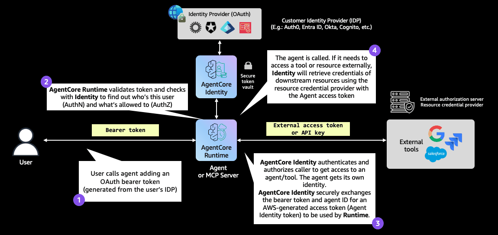
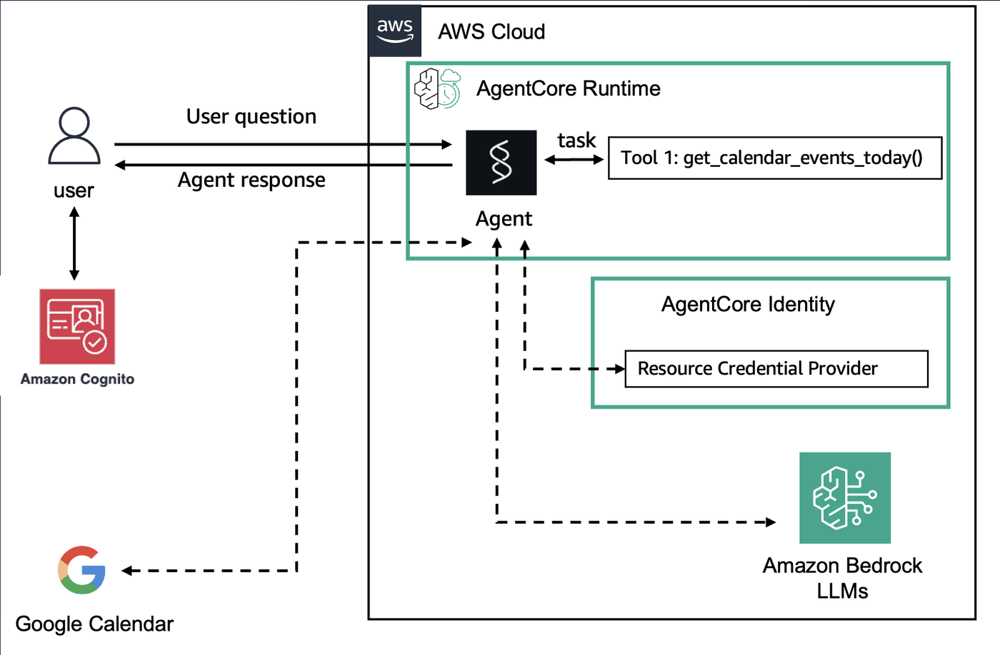
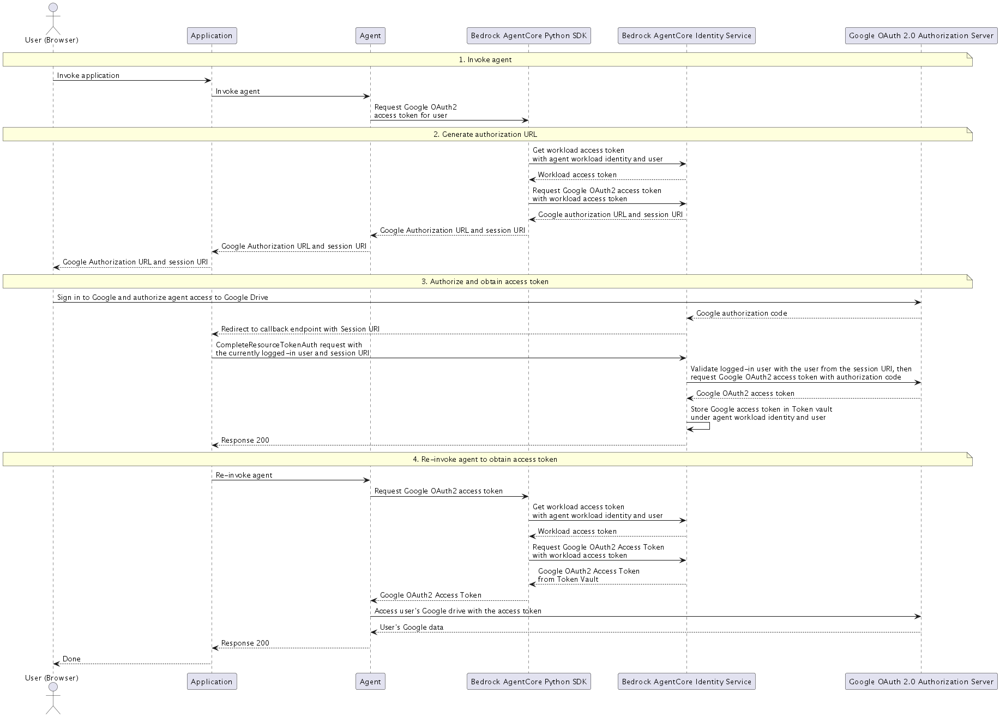

# Outbound Auth

Outbound Auth allows agents and the AgentCore Gateway to securely access AWS resources and third-party services on behalf of users who have been authenticated and authorized during Inbound Auth. To integrate authorization with an AWS resource or third-party service, it's necessary to configure both Inbound Auth and Outbound Auth.

With just-enough access and secure permission delegation supported by AgentCore Identity, agents can seamlessly and securely access AWS resources and third-party tools such as GitHub, Google, Salesforce, and Slack. Agents can perform actions on these services either on behalf of users or independently, provided there is pre-authorized user consent. Additionally, you can reduce consent fatigue using a secure token vault and create streamlined AI agent experiences.

## Outbound Authentication Configuration

First, you register your client application with third-party providers and then create an Outbound Auth. You specify how you want to validate access to the AWS resource or third-party service or AgentCore Gateway targets. You can use OAuth 2LO/3LO or API keys. With OAuth, you can select from providers that AgentCore Identity provides. In which case you enter the configuration details for the providers from AgentCore Identity. Alternatively, you can supply details for a custom provider. 

When a user wants access to an AWS resource or third-party service or AgentCore Gateway target, the Outbound Auth confirms that the access tokens provided by Incoming Auth are valid and if so, allows access to the resource.

<div style="text-align:center">
    
</div>


Here are the various parameters you can use with the @require_access_token decorator.


| Parameter Name      | Description                                                              |
|:--------------------|:-------------------------------------------------------------------------|
| provider_name       | The credential provider name                                             |
| into                | Parameter name to inject the token into                                  |
| scopes              | OAuth2 scopes to request                                                 |
| on_auth_url	      | Callback for handling authorization URLs                                 |
| auth_flow           | Authentication flow type ("M2M" or "USER_FEDERATION")                    |
| callback_url        | OAuth2 callback URL                                                      |
| force_authentication| Force re-authentication                                                  |
| token_poller        | Custom token poller implementation                                       |

		


# Hosting Strands Agents in Amazon Bedrock AgentCore Runtime

## Overview


In this tutorial we will develop a scheduling agent using Strands agents that can list the events from the users Google Calendar. We will configure a credential provider to help with credential management with Google. We can use the named provider for Google and modify our agent code to call the credential provider and use the access_token to get the users calendar events or schedule from Google.

### Tutorial Architecture

<div style="text-align:center">
    
</div>


### Tutorial Details

| Information         | Details                                                                  |
|:--------------------|:-------------------------------------------------------------------------|
| Tutorial type       | Conversational                                                           |
| Agent type          | Single                                                                   |
| Agentic Framework   | Strands Agents                                                           |
| LLM model           | Anthropic Claude Haiku 4.5                                              |
| Tutorial components | Hosting agent on AgentCore Runtime. Using Strands Agent and Claude Model |
| Tutorial vertical   | Cross-vertical                                                           |
| Example complexity  | Medium                                                                   |
| SDK used            | Amazon BedrockAgentCore Python SDK and boto3                             |
| Credential Provider | Type : OAuth2 - Google Provider                                          |


### Tutorial Key Features

* Hosting Agents on Amazon Bedrock AgentCore Runtime
* Using Claude models
* Using Strands Agents
* Using AgentCore egress Auth with OAuth2 Google credential provider.

## Prerequisites

To execute this tutorial you will need:
* Python 3.10+
* AWS credentials
* Amazon Bedrock AgentCore SDK
* Strands Agents
* Docker running

```python
!pip install --force-reinstall -U -r requirements.txt --quiet
```

##  Configure Inbound Auth with Cognito as the IDP
Lets provision a Cognito Userpool with an App client and one test user. We'll use Amazon Cognito to provide JWT tokens for accessing our deployed MCP server. To do so, we will use the `setup_cognito_user_pool` support function from our `utils` script.

Note: The Cognito access_token is valid for 2 hours only. If the access_token expires you can vend another access_token by using the `reauthenticate_user` method.

```python
import sys
import os

# Get the current notebook's directory
current_dir = os.path.dirname(os.path.abspath("__file__" if "__file__" in globals() else "."))

utils_dir = os.path.join(current_dir, "..")
utils_dir = os.path.abspath(utils_dir)

# Add to sys.path
sys.path.insert(0, utils_dir)
print("sys.path[0]:", sys.path[0])
```

```python
import subprocess
from boto3.session import Session
from utils import setup_cognito_user_pool, reauthenticate_user

boto_session = Session()
region = boto_session.region_name

print(f"Region: {region}")

identity_client = boto_session.client("bedrock-agentcore-control")
```

```python
region
```

```python
print("Setting up Amazon Cognito user pool...")
cognito_config = setup_cognito_user_pool("Cognito_3LO_Google")
print("Cognito setup completed ✓")
```

## Configure Google for OAuth2. ( On behalf of user flow )
Follow these steps to register your app, create a project, and configure OAuth credentials for Google Calendar access:

In this section, we will configure your Google to access the Google Calendar API with readonly permissions.

1. Create a Project in Google Developer Console
    1.    Go to the [Google Developer Console](https://console.developers.google.com/)
    2.    In the top navigation bar, click on “Create Project”
    3.    Enter a Project Name.
    4.    Choose an Organization or leave as “No organization” if not applicable.
    5.    Click Create. Your new project will appear in the project list.
2. Enable Google Calendar API
    1.    With your project selected ( using the checkbox),  open the left menu (hamburger menu) and go to APIs & Services > Library.
    2.    In the search bar, type Google Calendar API.
    3.    Click on Google Calendar API in the results, then click Enable.
3. Configure OAuth Consent Screen
    1.    In the left menu, go to APIs & Services > OAuth consent screen.
    2.    Click “Get started”
    3.    Fill in the required fields:
    4.    App Name
    5.    User Support Email
    6. Click Next and then select the right Audience type, i.e. Internal or External, Click Next, ( If you select External, then ensure you have entered email ids of users entered here, so you can test with those users)
    7.    Developer Contact Information, Enter your email id.
    8.  Click “Finish” after accepting the terms and conditions. an then click “Create”.
4. Add your google email id as a test user
    1.    In the left menu, go to APIs & Services > OAuth consent screen.
    2.    Select "Audience" from the left hand menu.
    3.    Under Test users, click "+ Add Users" and add your gmail id for the Google account.
5. Create OAuth 2.0 Credentials
    1.    Go to APIs & Services from the left hand menu and then select  > Credentials.
    2.    Click Create Credentials > OAuth client ID.
    3.    Select Web application as the application type.
    4.    Enter a name for the credentials.
    5.    Click Create.
6. Obtain Client ID and Client Secret
    1.    After creation, a dialog will display your Client ID and Client Secret. Copy these for later use.
    2.    Download the credentials as a JSON file or copy them for use in your app’s configuration.
7. Update the Data access 
    1. Go to APIs & Services from the left hand menu and then select  > Credentials.
    2. Select the “web app” you created in step 4d.
    3. Select “Data access” on the left hand menu
    4. Click “Add or remove scopes”
    5. Add scopes based on your use case. E.g: For Google calendar add, “https://www.googleapis.com/auth/calendar.readonly” under “Manually add scopes” and click update followed by Save/Update.
    6. Click “Save” again on the “Data access” page to save your configuration.
8. Use the Credentials in Your Agent
    1.    In the next section, we will configure a resource credentials provider to use the Client ID, Client Secret, and Redirect URI for the OAuth 3-legged flow.

## OAuth2 Authorization URL Session Binding Process

The OAuth2 authorization URL session binding process is a critical security mechanism that ensures OAuth2 authorization sessions are properly associated with authenticated users in AgentCore Identity. This process prevents session hijacking and ensures that OAuth tokens are only granted to the intended user.

Ref : https://docs.aws.amazon.com/bedrock-agentcore/latest/devguide/oauth2-authorization-url-session-binding.html

### How session binding works
<div style="text-align:center">
    
</div>

1. Invoke agent – Your agent code invokes GetResourceOauth2Token API to retrieve an authorization URL, when an originating agent user wants to access some application or resource that he/she owns.

2. Generate authorization URL – AgentCore Identity generates an authorization URL and session URI for the user to navigate to and consent access.

3. Authorize and obtain access token – The user navigates to the authorization URL and grants consent for your agent to access his/her resource. After that, AgentCore Identity redirects the user's browser to your HTTPS application endpoint with information containing the originating user of the authorization request. At this point, your HTTPS application endpoint determines if the originating agent user is still the same as the currently logged in user of your application. If they match, your application endpoint invokes CompleteResourceTokenAuth so that AgentCore Identity can fetch and store the access token.

4. Re-invoke agent to obtain access token – Once the application returns a valid response, your agent application will be able to retrieve the OAuth2.0 access tokens that were originally requested for the user. If the users do not match, your application simply does nothing or logs the attempt.

By allowing your application endpoint to verify the user identity, AgentCore Identity allows your agent application to ensure that it is always the same user who initiated the authorization request and the one who consented access.

### Overview of the OAuth2 Session Binding Flow in this sample

The OAuth2 session binding process involves several key steps that coordinate between your application, AgentCore Identity, external OAuth providers (like Google, Github ), and a local callback server:

#### Step 1: Create Application Callback URL
- Create a publicly accessible HTTPS callback endpoint in your application
- This endpoint will handle OAuth redirects and validate user sessions
- Example: `https://myagentapp.com/callback`

#### Step 2: Update Workload Identity with Callback URL
- Register your callback URL as an `AllowedResourceOauth2ReturnUrl` in the workload identity
- This is accomplished using the `UpdateWorkloadIdentity` API
- **In this tutorial**: This step is handled automatically by the code below that updates the workload identity with the local callback server URL

#### Step 3: Create OAuth2 Credential Provider
- Configure the credential provider with external OAuth provider details (client ID, secret)
- AgentCore Identity returns a unique callback URL for the provider
- Register this callback URL with the external OAuth provider (e.g., Google Console)

#### Step 4: Implement Session Validation and Token Completion
- Your callback endpoint must validate the current user's session
- Call `CompleteResourceTokenAuth` API with the user identifier and session URI
- **In this tutorial**: The `oauth2_callback_server.py` handles this automatically

#### Step 5: OAuth Flow Execution
- User triggers OAuth flow through agent interaction
- User is redirected to external provider for authorization
- Provider redirects back to your callback with session information
- Session binding completes and OAuth tokens become available

### Local Development with oauth2_callback_server.py

For local development and testing, this tutorial uses `oauth2_callback_server.py` which:

1. **Runs a Local FastAPI Server** (`localhost:9090`)
   - Provides `/ping` endpoint for health checks
   - Provides `/userIdentifier/token` endpoint to store user tokens
   - Provides `/oauth2/callback` endpoint to handle OAuth redirects

2. **Manages User Token Storage**
   - Stores the user's JWT token from Cognito authentication
   - Associates OAuth sessions with the correct user identity

3. **Handles OAuth Callback Processing**
   - Receives OAuth redirects with `session_id` parameter
   - Calls `CompleteResourceTokenAuth` to bind the session
   - Validates user identity before completing the flow

4. **Provides Session Security**
   - Ensures OAuth sessions are bound to authenticated users
   - Prevents unauthorized access to OAuth tokens

### Integration with Workload Identity Update

The code snippet you referenced performs a crucial step in the OAuth2 session binding process:

```python
if launch_result.agent_id:
    workload_name = launch_result.agent_id
    workload_identity = identity_client.get_workload_identity(name=workload_name)
    allowed_resource_oauth_2_return_urls = workload_identity.get("allowedResourceOauth2ReturnUrls") or []
    oauth2_callback_url = get_oauth2_callback_url()
    print(f"Updating workload {workload_name} with callback url {oauth2_callback_url}")

    updated_workload_identity = identity_client.update_workload_identity(
        name=workload_name,
        allowed_resource_oauth_2_return_urls=[*allowed_resource_oauth_2_return_urls, oauth2_callback_url],
    )
```

This code:
1. **Retrieves the Agent's Workload Identity**: Uses the agent ID from the runtime deployment
2. **Gets Current Allowed URLs**: Fetches existing `allowedResourceOauth2ReturnUrls`
3. **Adds Local Callback URL**: Includes `http://localhost:9090/oauth2/callback` as an allowed return URL
4. **Updates Workload Identity**: Registers the callback URL with AgentCore Identity

This registration is essential because AgentCore Identity will only redirect OAuth callbacks to pre-registered URLs, providing an additional security layer.

### Security Considerations

The OAuth2 session binding process includes several security measures:
- **URL Validation**: Only pre-registered callback URLs are allowed
- **Session Verification**: User sessions must be validated before token completion
- **User Identity Binding**: OAuth sessions are explicitly bound to authenticated users
- **Token Isolation**: Each user's OAuth tokens are isolated and secure

This comprehensive approach ensures that OAuth2 flows are secure and properly attributed to the correct users in multi-user environments.

---

### Configure the Google OAuth2 credential provider.

Create a `.env` file in the current folder copy the following text in it:
```sh
GOOGLE_CLIENT_ID="" #"client id" recorded from Step 6.1 above
GOOGLE_CLIENT_SECRET="" #"client secret" recorded from Step 6.2 above.
```

Once the client id and client secret are updated, run the below code to create a credentials provider for Google. <br>
Resource credential providers in AgentCore Identity act as intelligent intermediaries that manage the complex relationships between agents, identity providers, and resource servers. Each provider encapsulates the specific endpoint configuration required for a particular service or identity system. The service provides built-in providers for popular services including Google, GitHub, Slack, and Salesforce, with authorization server endpoints and provider-specific parameters pre-configured to reduce development effort. AgentCore Identity supports custom configurations through configurable OAuth2 credential providers that can be tailored to work with any OAuth2-compatible resource server.

```python
%%writefile .env
GOOGLE_CLIENT_ID="" #"client id" recorded from Step 6.1 above
GOOGLE_CLIENT_SECRET="" #"client secret" recorded from Step 6.2 above.
```

```python
import dotenv

dotenv.load_dotenv(override=True)

# Configure Google OAuth2 provider - On-Behalf-Of User
google_provider = identity_client.create_oauth2_credential_provider(
    **{
        "name": "google-cal-provider",
        "credentialProviderVendor": "GoogleOauth2",
        "oauth2ProviderConfigInput": {
            "googleOauth2ProviderConfig": {
                "clientId": os.environ["GOOGLE_CLIENT_ID"],
                "clientSecret": os.environ["GOOGLE_CLIENT_SECRET"],
            }
        },
    }
)
print(google_provider)
print("\n")
print(f"callbackUrl: {google_provider['callbackUrl']}")
```

## Update the callback url on the Google/OAuth 2.0 client. 
Navigate back to the [Google Developer Console](https://console.developers.google.com/)

1. Select the Project in Google Developer Console
    1.    Select the project created earlier.
2. Update the callback uri.
    1.    Go to APIs & Services from the left hand menu and then select  > Credentials.
    2.    Click the client under "OAuth 2.0 Client IDs"
    3.    Under "Authorised redirect URIs", enter the callback url from the previous step. The callback url was printed so you can easily copy it form the previous step.
    4.    Click Save.

## Preparing your agent for deployment on AgentCore Runtime

### Strands Agent with a model hosted on Amazon Bedrock
Here is a Strands agent code that includes the following :
1. Creates a new tool called "get_calendar_events_today", to get the events from your Google Calendar for today
2. Uses the Credential provider created in the previous step to fetch the access_token from Google. This includes the user consent flow where the consent is sent to the user for approval as part of the 3LO flow.
3. The Strands agent calls the tool for any user requests related to the users agenda.

```python
# Get the OAuth2 callback URL based on the current environment (notebook/SageMaker)
# This is evaluated HERE in the notebook, not in the agent container
from oauth2_callback_server import get_oauth2_callback_url

oauth2_callback_url_for_agent = get_oauth2_callback_url()

print(f"Callback URL for agent (determined from notebook environment): {oauth2_callback_url_for_agent}")
```

## Deploying the agent to AgentCore Runtime
The CreateAgentRuntime operation supports comprehensive configuration options, letting you specify container images, environment variables and encryption settings. You can also configure protocol settings (HTTP, MCP) and authorization mechanisms to control how your clients communicate with the agent.

Note: Operations best practice is to package code as container and push to ECR using CI/CD pipelines and IaC

In this tutorial can will the Amazon Bedrock AgentCode Python SDK to easily package your artifacts and deploy them to AgentCore runtime.

### Configure AgentCore Runtime deployment

Next we will use our starter toolkit to configure the AgentCore Runtime deployment with an entrypoint, the execution role we just created and a requirements file. We will also configure the starter kit to auto create the Amazon ECR repository on launch.

During the configure step, your docker file will be generated based on your application code

Note : The authorizer_configuration is configured for Inbound Auth with Cognito.

<div style="text-align:left">
    
</div>

```python
from bedrock_agentcore_starter_toolkit import Runtime

print(f"Region: {region}")

discovery_url = cognito_config.get("discovery_url", "")
client_id = cognito_config.get("client_id", "")
agentcore_runtime = Runtime()

response = agentcore_runtime.configure(
    entrypoint="strands_claude_google_3lo.py",
    auto_create_execution_role=True,
    auto_create_ecr=True,
    requirements_file="requirements.txt",
    region=region,
    memory_mode="NO_MEMORY",
    agent_name="strands_agent_google_3lo",
    authorizer_configuration={
        "customJWTAuthorizer": {
            "discoveryUrl": discovery_url,
            "allowedClients": [client_id],
        }
    },
)
print(response)
```

## Review the AgentCore configuration

```python
!cat .bedrock_agentcore.yaml
```

### Launching agent to AgentCore Runtime

Now that we've got a docker file, let's launch the agent to the AgentCore Runtime. This will create the Amazon ECR repository and the AgentCore Runtime

<div style="text-align:left">
    
</div>

```python
from oauth2_callback_server import get_oauth2_callback_url

# Deploy the agent to AgentCore Runtime and get deployment details
launch_result = agentcore_runtime.launch(
    env_vars={"CALLBACK_URL": oauth2_callback_url_for_agent},
    auto_update_on_conflict=True,
)
print(launch_result)

if launch_result.agent_id:
    # Extract the workload name from the deployed agent's ID for identity management
    workload_name = launch_result.agent_id
    # Retrieve the current workload identity configuration from AgentCore Identity
    workload_identity = identity_client.get_workload_identity(name=workload_name)
    # Extract existing OAuth2 callback URLs that are already registered for this workload
    allowed_resource_oauth_2_return_urls = workload_identity.get("allowedResourceOauth2ReturnUrls") or []
    # Get the local OAuth2 callback server URL for session binding (localhost:9090/oauth2/callback)
    oauth2_callback_url = get_oauth2_callback_url()
    print(f"Updating workload {workload_name} with callback url {oauth2_callback_url}")

    # Register the local callback URL with the workload identity to enable OAuth2 session binding
    updated_workload_identity = identity_client.update_workload_identity(
        name=workload_name,
        allowedResourceOauth2ReturnUrls=[
            *allowed_resource_oauth_2_return_urls,
            oauth2_callback_url,
        ],
    )
    print(updated_workload_identity)
```

#### Add extra required policies to auto-created role

If you are using this on a new account where model has not been accessed before, you will need to add extra required policies to the auto-created role to allow the agent to access the model.

```python
import json
import boto3

agentcore_control_client = boto3.client("bedrock-agentcore-control", region_name=region)

runtime_response = agentcore_control_client.get_agent_runtime(agentRuntimeId=launch_result.agent_id)
runtime_role = runtime_response["roleArn"]
account = boto_session.client("sts").get_caller_identity().get("Account")

policies_to_add = {
    "Version": "2012-10-17",
    "Statement": [
        {
            "Sid": "BedrockModelAccess",
            "Effect": "Allow",
            "Action": [
                "aws-marketplace:ViewSubscriptions",
                "aws-marketplace:Subscribe",
            ],
            "Resource": "*",
        },
        {
            "Sid": "Oauth2TokenAccess",
            "Effect": "Allow",
            "Action": [
                "bedrock-agentcore:GetResourceOauth2Token",
            ],
            "Resource": "*",
        },
        {
            "Sid": "SecretsManagerAccess",
            "Effect": "Allow",
            "Action": [
                "secretsmanager:GetSecretValue",
            ],
            "Resource": [
                f"arn:aws:secretsmanager:{region}:{account}:secret:secret:bedrock-agentcore-identity!default/oauth2/google-cal-provider*"
            ],
        },
    ],
}
iam_client = boto3.client("iam", region_name=region)

response = iam_client.put_role_policy(
    PolicyDocument=json.dumps(policies_to_add),
    PolicyName="outbound_policies",
    RoleName=runtime_role.split("/")[1],
)
```

### Checking for the AgentCore Runtime Status
Now that we've deployed the AgentCore Runtime, let's check for it's deployment status

```python
import time

status_response = agentcore_runtime.status()
status = status_response.endpoint["status"]
end_status = ["READY", "CREATE_FAILED", "DELETE_FAILED", "UPDATE_FAILED"]
while status not in end_status:
    time.sleep(10)
    status_response = agentcore_runtime.status()
    status = status_response.endpoint["status"]
    print(status)
print(f"Final status: {status}")
```

### Invoking AgentCore Runtime

Finally, we can invoke our AgentCore Runtime with a payload

You will notice that the agent calls the "Get_calendar_events_today" tool and triggers the 3 Legged Outh flow. You will be presented with the Authorization Url. Click on the Authorization url Or copy/paste it in a new browser session/tab to complete the user consent flow.
Once the Authorization completes, The credential provider "google-cal-provider" will fetch the access_token from Google and complete the tool execution to fetch the events from your calendar.

<div style="text-align:left">
    
</div>

```python
from oauth2_callback_server import (
    store_token_in_oauth2_callback_server,
    wait_for_oauth2_server_to_be_ready,
)

bearer_token = reauthenticate_user(cognito_config.get("client_id"))

oauth2_callback_server_cmd = [
    sys.executable,
    "oauth2_callback_server.py",
    "--region",
    region,
]
oauth2_callback_server_process = subprocess.Popen(oauth2_callback_server_cmd)

try:
    # Start the OAuth2 callback server
    successfully_started_oauth2_server = wait_for_oauth2_server_to_be_ready()
    if not successfully_started_oauth2_server:
        print(
            "Failed to start OAuth2 callback server to handle session binding "
            "(https://docs.aws.amazon.com/bedrock-agentcore/latest/devguide/oauth2-authorization-url-session-binding.html)"
        )
    else:
        store_token_in_oauth2_callback_server(bearer_token)
        invoke_response = agentcore_runtime.invoke(
            {"prompt": "What is in my agenda for today? Highlight the main events!"},
            bearer_token=bearer_token,
        )
        print(invoke_response)
finally:
    oauth2_callback_server_process.terminate()
```

## Optional - Test the agent using a Streamlit App

You can test your deployed agent using a Streamlit web application that provides a nice chat interface. The `chatbot_app_cognito.py` file in this directory creates a web-based chatbot that:

- Automatically reads configuration from `.bedrock_agentcore.yaml`
- Provides Cognito authentication
- Shows a modern chat interface with streaming responses
- Handles the 3LO OAuth flow for Google Calendar access

### Running the Streamlit App

You can run the Streamlit app in several ways:

#### Option 1: Run from Jupyter Notebook (Current Directory)
- Run the cell below to start the Streamlit app directly from this notebook:
- Login: Use the credentials testuser / MyPassword123! (the default test user created by the Cognito setup)
- Test some simple prompts like "Tell me a joke"
- Test with a prompt that will trigger the `Get_calendar_events_today` tool like "What is on my agenda for today?".
- You will see the Authorization url returned. Click on the url or copy/paste the url to a new browser tab/window to complete the user consent flow.

```python
from chatbot_app_cognito import get_streamlit_url

# Change to the current directory where the chatbot_app_cognito.py file is located
notebook_dir = os.getcwd()

# Start the Streamlit app
print("Starting Streamlit app...")

oauth2_callback_server_cmd = [
    sys.executable,
    "oauth2_callback_server.py",
    "--region",
    region,
]
oauth2_callback_server_process = subprocess.Popen(oauth2_callback_server_cmd)

try:
    wait_for_oauth2_server_to_be_ready()

    # Run streamlit in the current directory
    process = subprocess.Popen(
        [
            sys.executable,
            "-m",
            "streamlit",
            "run",
            "chatbot_app_cognito.py",
            "--server.port=8501",
            "--server.showEmailPrompt=false",
        ],
        cwd=notebook_dir,
        stdout=subprocess.PIPE,
        stderr=subprocess.STDOUT,
        text=True,
    )

    # Print the output as it comes
    for line in iter(process.stdout.readline, ""):
        if line:
            if "8501" in line:
                print("\n🎉 Streamlit app is ready!")
                streamlit_url = get_streamlit_url()
                print(f"\n🚀 Streamlit Application URL:\n{streamlit_url}\n")
                print("⚠️ To stop the app, interrupt the kernel or press Ctrl+C in the terminal")
                break

except KeyboardInterrupt:
    print("\nStreamlit app stopped.")
    oauth2_callback_server_process.terminate()
    process.terminate()
except Exception as e:
    print(f"Error starting Streamlit app: {e}")
```

#### Option 2: Run from Terminal

Alternatively, you can run the Streamlit app from your terminal:

```bash
# Navigate to the current directory
cd 06-workshops/03-AgentCore-identity/05-Outbound_Auth_3lo/

# Run the Streamlit app
python oauth2_callback_server.py -r <region> & streamlit run chatbot_app_cognito.py
```

#### Using the Streamlit App

1. **Login**: Use the credentials `testuser` / `MyPassword123!` (the default test user created by the Cognito setup)
2. **Chat**: Ask questions like "What is in my agenda for today?" or "Highlight main events from my agenda from today"
3. **OAuth Flow**: When the agent needs Google Calendar access, you'll see an authorization URL - click it to complete the OAuth flow
4. **Features**: The app includes:
   - Real-time streaming responses
   - Clickable URLs
   - Modern chat interface
   - Context awareness
   - Error handling with informative messages

The app automatically reads all configuration from your `.bedrock_agentcore.yaml` file, so it will use the same agent runtime you just deployed.

## Cleanup (Optional)

- Let's now clean up the AgentCore Runtime created
- Uncomment the below Cells and run.

```python
# launch_result.ecr_uri, launch_result.agent_id, launch_result.ecr_uri.split('/')[1]
```

```python
# agentcore_control_client = boto3.client(
#     'bedrock-agentcore-control',
#     region_name=region
# )
# ecr_client = boto3.client(
#     'ecr',
#     region_name=region

# )

# runtime_delete_response = agentcore_control_client.delete_agent_runtime(
#     agentRuntimeId=launch_result.agent_id,

# )

# response = ecr_client.delete_repository(
#     repositoryName=launch_result.ecr_uri.split('/')[1],
#     force=True
# )
```

## Congratulations!
