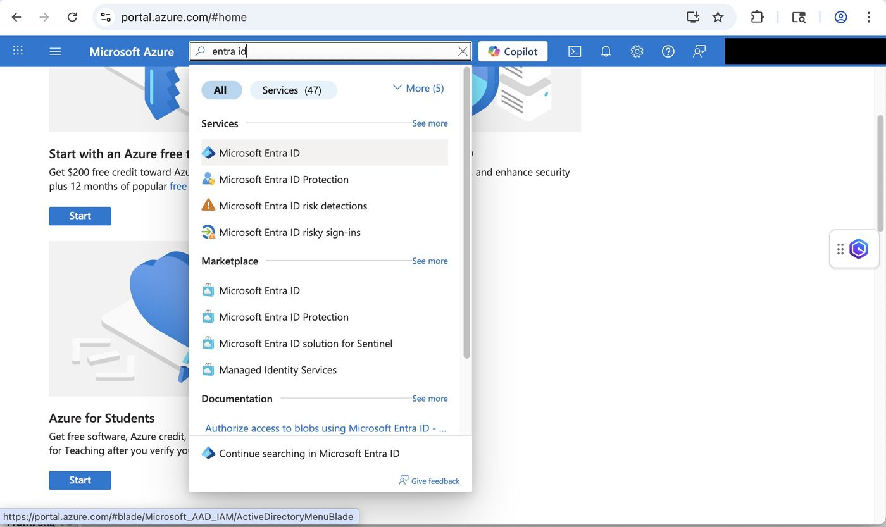
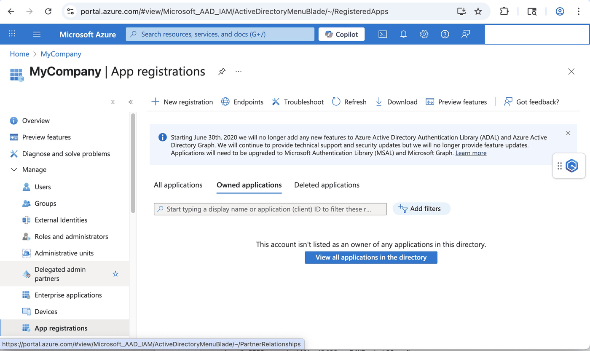
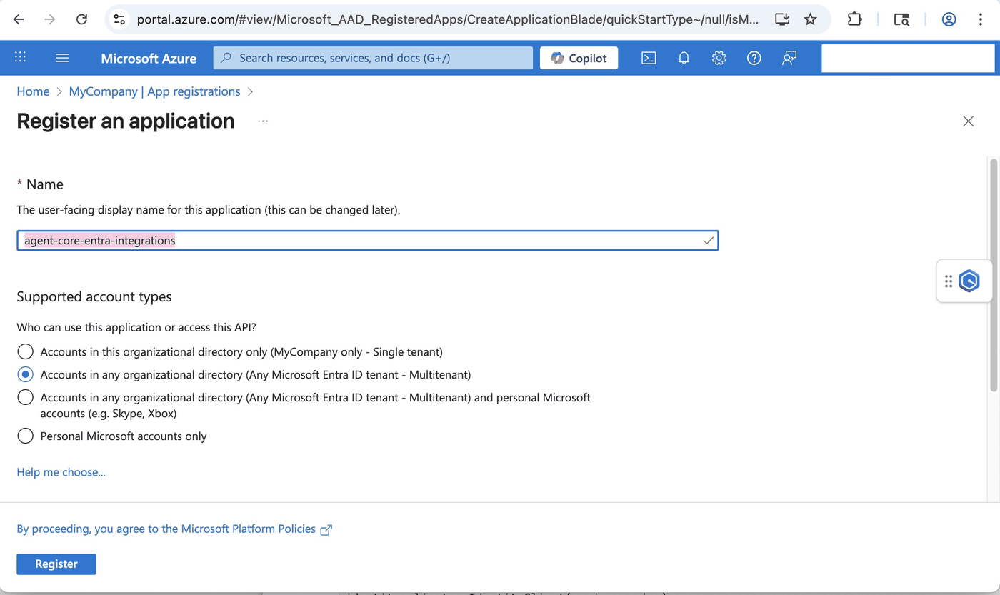
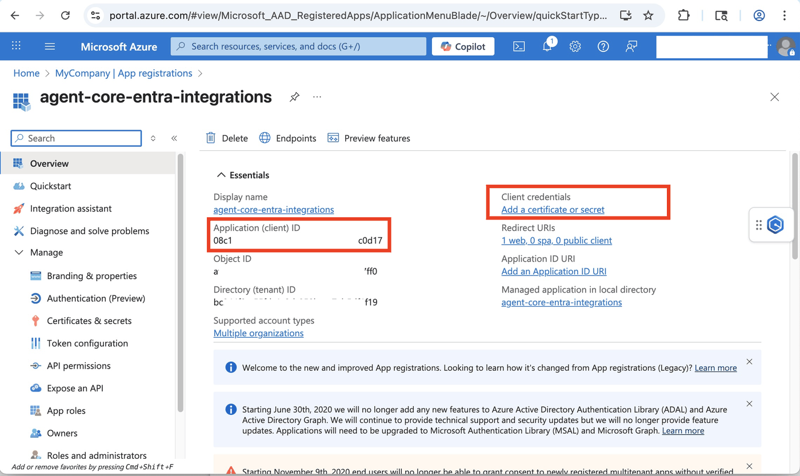
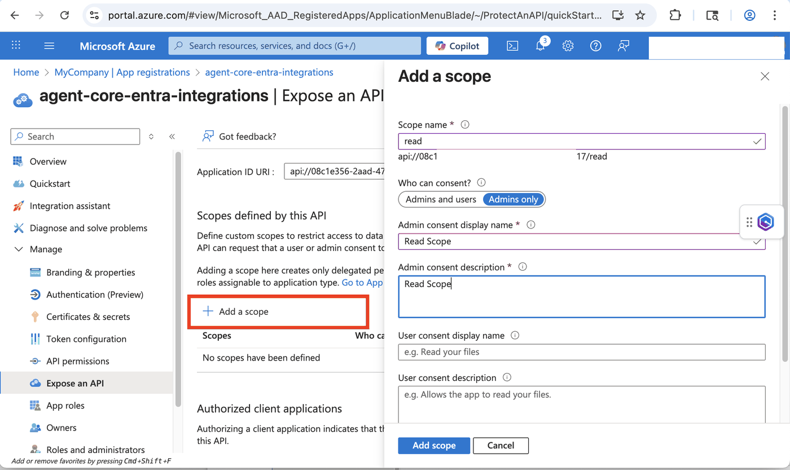

## Microsoft Entra ID Overview

Microsoft Entra ID (formerly Azure Active Directory) is Microsoft's cloud-based identity and access management service. It serves as the central identity provider for Microsoft 365, Azure, and thousands of other SaaS applications.

Key Features:
* **Single Sign-On (SSO)** - Users authenticate once to access multiple applications.
* **Multi-Factor Authentication (MFA)** - Enhanced security through additional verification methods.
* **Conditional Access** - Policy-based access control based on user, device, location, and risk.
* **Application Integration** - Supports modern authentication protocols like OAuth 2.0, OpenID Connect, and SAML.

## Learning Objective

Microsoft Entra ID can be used as an identity provider on AgentCore Identity and used to authenticate users and have them authorize the agent to acccess protected resources on their behalf. In this notebook, we will explore the use of Entra ID for inbound authentication. 

- Authenticate users before they can invoke an agent.

## Authorization Code Flow
The OAuth 2.0 authorization code flow is the recommended approach for web applications to securely authenticate users and obtain access tokens. 

This flow involves:

1. Redirecting users to Entra ID for authentication
2. Receiving an authorization code after successful login
3. Exchanging the code for access and refresh tokens
4. Using tokens to access protected resources

This integration pattern allows AgentCore to leverage Entra ID's robust identity management capabilities while maintaining secure, standards-based authentication for your applications.

## Learning Objective 1: Setup Entra ID for use with AgentCore Identity

### Step 1: Setup Entra ID Tenant

An Entra ID tenant is a dedicated instance of Microsoft Entra ID that represents your organization. Think of it as your organization's isolated directory in Microsoft's cloud.

Key Characteristics:

* **Unique Identity** - Each tenant has a unique domain (e.g., yourcompany.onmicrosoft.com)
* **Isolated Boundary** - Users, groups, and applications in one tenant are separate from others
* **Administrative Control** - Tenant admins manage users, security policies, and application registrations
* **Multi-Domain Support** - Can include custom domains alongside the default .onmicrosoft.com domain

In Practice:

When you register an application with Entra ID for OAuth 2.0 integration, you're registering it within a specific tenant. Users from that tenant can then authenticate against your application using their organizational credentials.

For AgentCore integration, you'll need:

* **Tenant ID** - Unique identifier for the Entra ID instance
* **Application Registration** - Your app registered within the tenant
* **Appropriate Permissions** - Configured access rights for your application

This tenant-based model ensures that authentication and authorization remain within your organization's security boundary.

Steps to create a tenant can be found at https://learn.microsoft.com/en-us/entra/fundamentals/create-new-tenant.

Note:
1. Microsoft Entra ID is NOT an AWS service. Please refer to Microsoft Entra ID documentation for costs related information.
2. Screen prints used in the following steps may change. We encourage you to refer to Microsoft Entra ID documentation for latest guidance on setting up an Entra ID application.

### Step 2: Setup Application

1. Go to https://portal.azure.com and search for "Entra ID" in the search bar at the top of the screen


2. Go to `Manage` &rarr; `App Registrations`


3. Click `New Registration` and fill in the details. Make sure you select the multi tenant option


4. Create a client secret. Copy the clientId and client secret for usage in AgentCore Identity.


5. Create Scopes for OAuth. Go to Expose an API &rarr; `Add Scope`. Copy and save full scope. 


## Learning Objective 2 - Setup a simple agent with Entra ID for inbound authentication

#### Prerequisites

* Python 3.10+
* AWS Credentials
* Amazon Bedrock AgentCore SDK
* Strands Agents
* Set AWS region to "us-west-2" or any region that supports Bedrock AgentCore. Refer to https://docs.aws.amazon.com/bedrock-agentcore/latest/devguide/agentcore-regions.html for supported regions.
* Docker, Finch or Podman installed

```python
!pip install --force-reinstall -U -r requirements.txt --quiet # in quite mode to reduce output to the console/notebook
```

```python
import os
import uuid
import boto3
from boto3.session import Session
from bedrock_agentcore_starter_toolkit import Runtime

boto_session = Session()
sts = boto3.client("sts")
account_id = sts.get_caller_identity().get("Account")
region = boto_session.region_name or "us-west-2"

print(f"AWS Region: {region}")
print(f"AWS Account: {account_id}")
```

#### Setting environment variables for some key information we will need throughout this notebook. 
Please note that the audience will be same as the "Application ID URI" from Step 2.5 above.

retrieve:
- Tenant ID from "App registration" --> "All Applications" --> Select client you just created --> "Overview" --> "Directory (tenant) ID"
- Client ID from "App registration" --> "All Applications" --> Select client you just created --> "Overview" --> "Application (client) ID"
- Secret saved from earlier step
- Scope will be "Application ID URI" from "App registration" --> "All Applications" --> Select client you just created --> "Expose a API". Will be suffixed with "/.default"
- Audience will be Application ID URI" from "App registration" --> "All Applications" --> Select client you just created --> "Expose a API".

```python
# REPLACE WITH YOUR client_id
os.environ["client_id"] = "REPLACE_ME"

# REPLACE WITH YOUR secret
os.environ["secret"] = "REPLACE_ME"

# REPLACE WITH YOUR scopes
os.environ["scopes"] = "REPLACE_ME"

# REPLACE WITH YOUR tenant_id
os.environ["tenant_id"] = "REPLACE_ME"

# REPLACE WITH YOUR audience
os.environ["audience"] = "REPLACE_ME"
```

#### Agent Code
Keeping the agent simple since the key learning objective for this notebook is to learn inbound authentication using EntraID

```python
%%writefile strands_wo_memory.py
import asyncio

from bedrock_agentcore.runtime import BedrockAgentCoreApp
from strands import Agent

app = BedrockAgentCoreApp()
agent = Agent()

class StreamingQueue:
    def __init__(self):
        self.finished = False
        self.queue = asyncio.Queue()
        
    async def put(self, item):
        await self.queue.put(item)

    async def finish(self):
        self.finished = True
        await self.queue.put(None)

    async def stream(self):
        while True:
            item = await self.queue.get()
            if item is None and self.finished:
                break
            yield item

queue = StreamingQueue()

async def agent_task(user_message: str):
    try:
        await queue.put("Agent execution begins....")
        
        response = agent(user_message)
        # ... process agent response here ...
        await queue.put(response.message)
    except Exception as e:
        await queue.put(f"Failed with error: {repr(e)}")
    finally:
        await queue.put("Agent excecution finished")
        await queue.finish()

@app.entrypoint
async def strands_agent_bedrock(payload, context):
    print("Context object is ....", context)
    prompt = payload.get("prompt", "hello")
    
    task = asyncio.create_task(agent_task(prompt))
    
    async def stream_with_task():
        async for item in queue.stream():
            yield item
        await task
    
    return stream_with_task()

if __name__ == "__main__":
    app.run()
```

#### Configure your runtime with `authorizer_configuration` to enforce inbound authentication. 
You will use a `customJWTAuthorizer` for inbound authentication using EntraID. Note how the discovery_url is building using Tenant ID

```python
agentcore_runtime = Runtime()

discovery_url = f"https://login.microsoftonline.com/{os.environ['tenant_id']}/.well-known/openid-configuration"

response = agentcore_runtime.configure(
    entrypoint="strands_wo_memory.py",
    auto_create_execution_role=True,
    auto_create_ecr=True,
    requirements_file="requirements.txt",
    region=region,
    agent_name="strands_wo_memory_entra_inbound",
    authorizer_configuration={
        "customJWTAuthorizer": {
            "discoveryUrl": discovery_url,
            "allowedAudience": os.environ["audience"].split(" "),
            # More JWT authorization can be added, refer to:
            # https://docs.aws.amazon.com/bedrock-agentcore-control/latest/APIReference/API_CustomJWTAuthorizerConfiguration.html
        }
    },
)

print(f"Runtime Agent: {response}")
```

## Learning Objective 3 - Deploy agent and invoke using bearer token received earlier

#### Deploy Runtime Agent
Local Docker needs to be running since local_build is enabled. As an alternate, you can have `local_build=False` to use CloudBuild.

```python
strands_wo_memory_launch_response = agentcore_runtime.launch(
    local_build=False,
    auto_update_on_conflict=True,
)
```

#### Use MSAL SDK to get an authorization code from Entra ID

```python
import msal

REDIRECT_URI = f"https://bedrock-agentcore.{region}.amazonaws.com/identities/oauth2/callback"
AUTHORITY = f"https://login.microsoftonline.com/{os.environ['tenant_id']}"

app = msal.ConfidentialClientApplication(
    os.environ["client_id"],
    authority=AUTHORITY,
    client_credential=os.environ["secret"],
)

result = app.acquire_token_for_client(scopes=[os.environ["scopes"]])  # Note that scope expects a list and not string
bearer_token_entra = result["access_token"]
```

```python
import urllib.parse
import requests
import json

if not strands_wo_memory_launch_response.agent_arn:
    raise Exception(
        "Missing Runtime Agent ARN. Verify that the Runtime Agent was created successfully in the previous step."
    )

escaped_agent_arn = urllib.parse.quote(strands_wo_memory_launch_response.agent_arn, safe="")
url = f"https://bedrock-agentcore.{region}.amazonaws.com/runtimes/{escaped_agent_arn}/invocations?qualifier=DEFAULT"

session_id = str(uuid.uuid1())
headers = {
    "Authorization": f"Bearer {bearer_token_entra}",
    "Content-Type": "application/json",
    "X-Amzn-Bedrock-AgentCore-Runtime-Session-Id": session_id,
    "X-Amzn-Trace-Id": f"entra_id_inbound_sample_{session_id}",
}

http_response = requests.post(
    url,
    data=json.dumps({"prompt": "Hello! I am John Doe. I like brick oven pizza!", "user_id": "user1"}),
    headers=headers,
)
http_response.raise_for_status()


print(f"Agent Response: {http_response.text}")
```

#### Ealier interactions in this session are available through agents.messages. AgentCore memory is not used. Agent will not recollect earlier interaction if a new session ID is used.

```python
http_response = requests.post(url, data=json.dumps({"prompt": "Who am I?", "user_id": "user1"}), headers=headers)
http_response.raise_for_status()

print(f"Agent Response: {http_response.text}")
```

#### As an alternate, you can use the AgentCore Runtime object to invoke the agent. Pass the bearer token and same session sesssion ID to continue with the earlier session.

```python
invoke_response = agentcore_runtime.invoke(
    {"prompt": "Who am I?", "user_id": "user1"},
    bearer_token=bearer_token_entra,
    session_id=session_id,
)

print(f"Agent Invoke Response: {invoke_response}")
```

## Conclusion and Cleanup

In this notebook we learnt how to:

- Setup Entra ID API and Application to provide OAuth 2.0 Authorization Code flow
- Create an AgentCore Runtime and Deployed an agent with inbound authentication using Entra ID
- Obtained a token in order to access the protected Agent

#### Resource(s) created

```python
print(f"Runtime Agent Arn: {strands_wo_memory_launch_response.agent_id}")
```

#### Delete AgentCore Runtime Agent

```python
agentcore_control_client = boto3.client("bedrock-agentcore-control", region_name=region)

agentcore_control_client.delete_agent_runtime(agentRuntimeId=strands_wo_memory_launch_response.agent_id)
```
