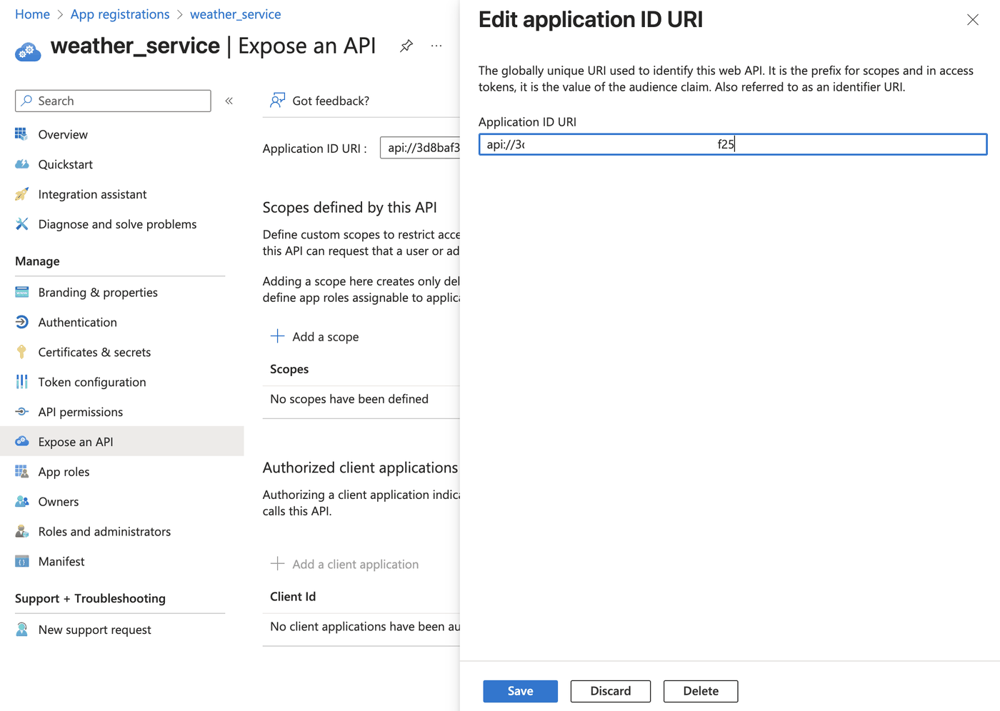
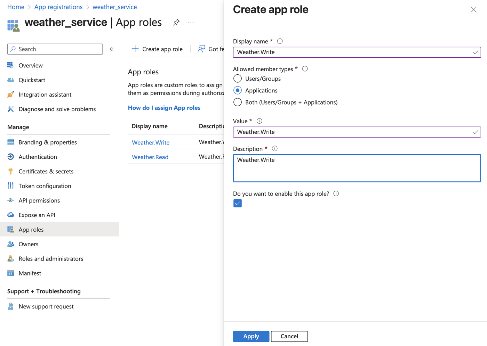
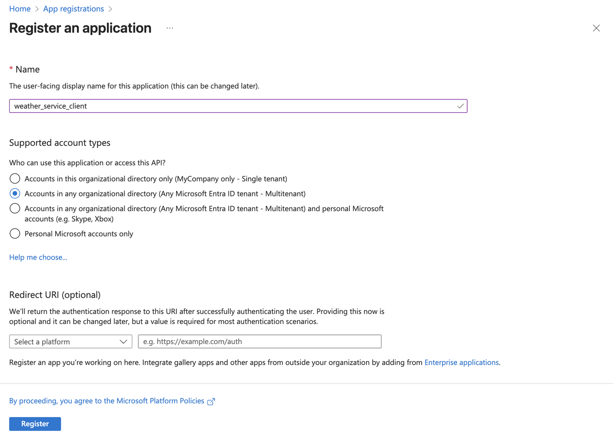
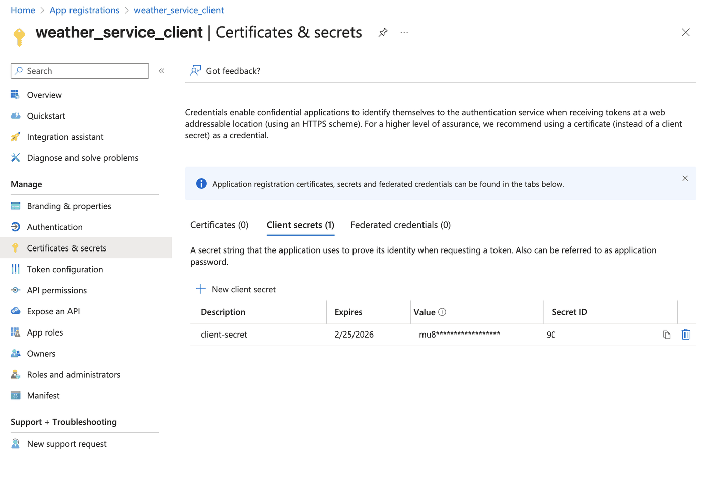
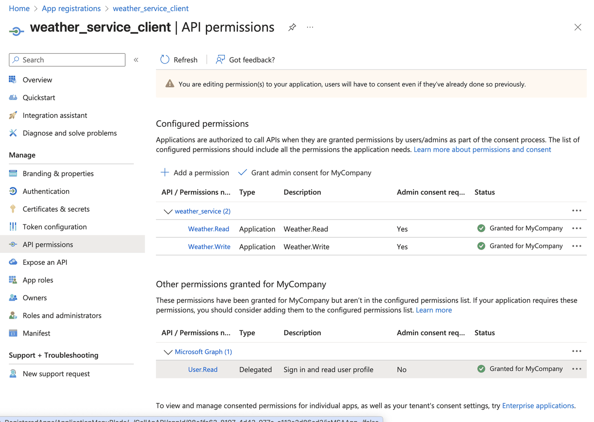
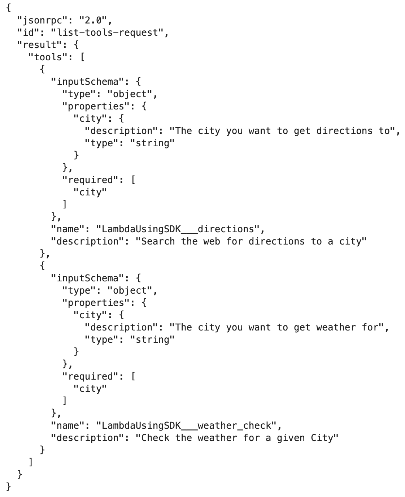

## Microsoft Entra ID Overview

Microsoft Entra ID (formerly Azure Active Directory) is Microsoft's cloud-based identity and access management service. It serves as the central 
identity provider for Microsoft 365, Azure, and thousands of other SaaS applications.

Key Features:
* **Single Sign-On (SSO)** - Users authenticate once to access multiple applications
* **Multi-Factor Authentication (MFA)** - Enhanced security through additional verification methods
* **Conditional Access** - Policy-based access control based on user, device, location, and risk
* **Application Integration** - Supports modern authentication protocols like OAuth 2.0, OpenID Connect, and SAML

## Amazon Bedrock Gateway Overview

Bedrock AgentCore Gateway provides customers a way to turn their existing APIs and Lambda functions into fully-managed MCP servers without needing to manage infra or hosting. Customers can bring OpenAPI spec or Smithy models for their existing APIs, or add Lambda functions that front their tools. Gateway will provide a uniform Model Context Protocol (MCP) interface across all these tools. Gateway employs a dual authentication model to ensure secure access control for both incoming requests and outbound connections to target resources. The framework consists of two key components: Inbound Auth, which validates and authorizes users attempting to access gateway targets, and Outbound Auth, which enables the gateway to securely connect to backend resources on behalf of authenticated users. Together, these authentication mechanisms create a secure bridge between users and their target resources, supporting both IAM credentials and OAuth-based authentication flows. Gateway supports MCP's Streamable HTTP transport connection.

More details on Amazon Bedrock AgentCore Gateway can be found at:
- https://github.com/awslabs/amazon-bedrock-agentcore-samples/tree/main/06-workshops/02-AgentCore-gateway
- https://docs.aws.amazon.com/bedrock-agentcore/latest/devguide/gateway.html

## Learning Objective
Microsoft EntraID can be used as an identity provider on AgentCore Identity to authorize consuming application's access to protected Amazon AgentCore Gateway resources . In this notebook we will explore the use of EntraID for inbound authentication with Amazon Bedrock Gateway.

## Learning Objective 1: Setup Entra ID for use with AgentCore Gateway

### Step 1: Setup Entra ID Tenant
An Entra ID tenant is a dedicated instance of Microsoft Entra ID that represents your organization. Think of it as your organization's isolated directory in Microsoft's cloud.

Key Characteristics:
* **Unique Identity** - Each tenant has a unique domain (e.g., yourcompany.onmicrosoft.com)
* **Isolated Boundary** - Users, groups, and applications in one tenant are separate from others
* **Administrative Control** - Tenant admins manage users, security policies, and application registrations
* **Multi-Domain Support** - Can include custom domains alongside the default .onmicrosoft.com domain

In Practice:
When you register an application with Entra ID for OAuth integration, you're registering it within a specific tenant. Users from that tenant can then authenticate against your application using their organizational credentials.

For AgentCore integration, you'll need:
* **Tenant ID** - Unique identifier for the Entra ID instance
* **Application Registration** - Your app registered within the tenant
* **Appropriate Permissions** - Configured access rights for your application

This tenant-based model ensures that authentication and authorization remain within your organization's security boundary.

Steps to create a tenant can be found at https://learn.microsoft.com/en-us/entra/fundamentals/create-new-tenant

Note:
1. MS EntraID is not a AWS service. Please refer to Microsoft EntraID documentation for costs related to EntraID.
2. Screen prints used in the following steps may change. We encourage you to refer to Microsoft Entra ID documentation for latest guidance on setting up EntraID application.

```python
import os

os.environ["tenant_id"] = "REPLACE_ME"  # Replace with Tenant ID from EntraID
```

### Step 2: Define the API you want to use
1. Go to portal.azure.com and search for "Entra ID" in the serch bar at the top of the screen

2. Go to manage --> App Registrations

3. Click "New Registration" and fill in the details. Select the multi tenant option
- Do not set any redirect URL.   

4. Expose an API through Manage --> Expose an API

5. Create app roles for the API. We are not adding scopes since this is a M2M setup.


```python
# app_id_url will be "Application ID URI" from "App registration" --> "All Applications" --> Select client you just created --> "Expose a API".
os.environ["app_id_uri"] = (
    "api://3dXXXXXX-CCCC-VVVV-BBBB-NNNNNN885f25"  # This is the API URL you set up for "weather_service"
)
```

### Step 3: Create a Entra Client application 
1. Go to portal.azure.com and search for "Entra ID" in the search bar at the top of the screen


2. Go to manage --> App Registrations


3. Click "New Registration" and fill in the details. Select the multi tenant option
- Do not set any redirect URL.



4. Create a client secret. Copy the client secret and client ID for use in AgentCore.



5. Go to API permissions and request permissions for the API you created earlier. "API Permissions" --> "Add a Permission" --> "APIs my organziation uses" and search for the API you created in step 1



6. Grant admin consent to use the APIs.

7. Set up environment variables using the info from EntraID

```python
import os

# Tenant ID from "App registration" --> "All Applications" --> Select client you just created --> "Overview" --> "Directory (tenant) ID"
os.environ["tenant_id"] = "bc24XXXX-CCCC-VVVV-BBBB-NNNNb5df1f19"

# Client ID from "App registration" --> "All Applications" --> Select client you just created --> "Overview" --> "Application (client) ID"
os.environ["client_id"] = (
    "08XXXXXX-CCCC-VVVV-BBBB-NNNNNNd86cd2"  # Replace with Client ID of the "weather_service_client"
)

# Secret saved from earlier step
os.environ["client_secret"] = (
    "muCCCCCVVVVVBBBBBNNNNN3dY6qdlL"  # Replace with Client secret of the "weather_service_client"
)
```

## Learning Objectvie 2: Setup AgentCore Gatway and Lambda Target

### Step 1: Create a Lambda Function to sue with Entra ID
1. Create a python file that we will use as lambda function code. Note how the tool name being called us used retrieved from the `context` object and used in the lambda function.

```python
import boto3
import zipfile
from boto3.session import Session
import time

boto_session = Session()
sts = boto3.client("sts")
region = boto_session.region_name
account_id = sts.get_caller_identity().get("Account")
```

```python
%%writefile lambda_function.py
def lambda_handler(event, context):
    print(f"Event: {event}")
    print(f"Context: {context}")
    extended_tool_name = context.client_context.custom["bedrockAgentCoreToolName"]
    resource = extended_tool_name.split("___")[1]

    print(resource)
    city = event.get("city")
    print(city)
    if resource == "weather_check":
        return f"Weather in {city} is bright and sunny!"
    elif resource == "directions":
        return f"Take I5 south all the way to {city} downtown"
```

2. Create the lambda funtion

```python
lambda_client = boto3.client("lambda", region_name=region)
with zipfile.ZipFile("lambda_function.zip", "w") as zip_file:
    zip_file.write("lambda_function.py", "lambda_function.py")

with open("lambda_function.zip", "rb") as zip_file:
    zip_content = zip_file.read()
```

```python
iam_client = boto3.client("iam", region_name=region)

trust_policy = """{
    "Version": "2012-10-17",
    "Statement": [
        {
            "Effect": "Allow",
            "Principal": {
                "Service": "lambda.amazonaws.com"
            },
            "Action": "sts:AssumeRole"
        }
    ]
}
"""

policy = """{
    "Version": "2012-10-17",
    "Statement": [
        {
            "Effect": "Allow",
            "Action": [
                "logs:CreateLogGroup",
                "logs:CreateLogStream",
                "logs:PutLogEvents"
            ],
            "Resource": "arn:aws:logs:*:*:*"
        }
    ]
}
"""

response = iam_client.create_role(RoleName="lambda-role", AssumeRolePolicyDocument=trust_policy)

iam_client.put_role_policy(PolicyDocument=policy, PolicyName="lambda-policy", RoleName="lambda-role")

lambda_role_arn = response["Role"]["Arn"]

# Wait for role to propagate
time.sleep(10)

response = lambda_client.create_function(
    FunctionName="m2m-entra-lambda",
    Runtime="python3.12",
    Role=lambda_role_arn,
    Handler="lambda_function.lambda_handler",
    Code={"ZipFile": zip_content},
)
```

```python
lambda_arn = response["FunctionArn"]
```

```python
lambda_arn
```

### Step 2: Create Amazon Bedrock AgentCore Gateway with inbound security

```python
iam_client = boto3.client("iam")

trust_policy = """{
    "Version": "2012-10-17",
    "Statement": [
        {
            "Effect": "Allow",
            "Principal": {
                "Service": "bedrock-agentcore.amazonaws.com"
            },
            "Action": "sts:AssumeRole"
        }
    ]
}
"""

# Create role with trust policy
response = iam_client.create_role(RoleName="bedrock-agent-lambda-role", AssumeRolePolicyDocument=trust_policy)

permission = (
    """{
    "Version": "2012-10-17",
    "Statement": [
        {
            "Action": [
                "lambda:InvokeFunction"
            ],
            "Resource": [
                "%s"
            ],
            "Effect": "Allow",
            "Sid": "InvokeFunction"
        }
    ]
}
"""
    % lambda_arn
)


# Add Lambda invoke policy
iam_client.put_role_policy(
    RoleName="bedrock-agent-lambda-role",
    PolicyName="lambda-invoke-policy",
    PolicyDocument=permission,
)

role_arn = response["Role"]["Arn"]
print(f"Role ARN: {role_arn}")
```

```python
gateway_client = boto3.client(
    "bedrock-agentcore-control",
    region_name=region,
)

gateway_name = "m2m-entra-gateway"
auth_config = {
    "customJWTAuthorizer": {
        "allowedAudience": [os.environ["app_id_uri"]],
        "discoveryUrl": f"https://login.microsoftonline.com/{os.environ['tenant_id']}/.well-known/openid-configuration",
    }
}
```

```python
create_response = gateway_client.create_gateway(
    name=gateway_name,
    roleArn=role_arn,
    protocolType="MCP",
    authorizerType="CUSTOM_JWT",
    authorizerConfiguration=auth_config,
    description="Customer Support AgentCore Gateway",
)
```

```python
gateway_url = create_response["gatewayUrl"]
gateway_id = create_response["gatewayId"]
```

### Step 3: Add lambda target to the AgentCore Gateway we just created

1. API Specification for the actual tools we are creating through the lambda function.

```python
api_spec = [
    {
        "name": "weather_check",
        "description": "Check the weather for a given City",
        "inputSchema": {
            "type": "object",
            "properties": {
                "city": {
                    "type": "string",
                    "description": "The city you want to get weather for",
                }
            },
            "required": ["city"],
        },
    },
    {
        "name": "directions",
        "description": "Search the web for directions to a city",
        "inputSchema": {
            "type": "object",
            "properties": {
                "city": {
                    "type": "string",
                    "description": "The city you want to get directions to",
                }
            },
            "required": ["city"],
        },
    },
]
```

```python
lambda_target_config = {
    "mcp": {
        "lambda": {
            "lambdaArn": lambda_arn,
            "toolSchema": {"inlinePayload": api_spec},
        }
    }
}

# Create gateway target
credential_config = [{"credentialProviderType": "GATEWAY_IAM_ROLE"}]

create_target_response = gateway_client.create_gateway_target(
    gatewayIdentifier=gateway_id,
    name="LambdaUsingSDK",
    description="Lambda Target using SDK",
    targetConfiguration=lambda_target_config,
    credentialProviderConfigurations=credential_config,
)
```

## Learning Objective 3: Use the tools made available through AgentCore Gateway in your agent

### Step 1: Get a token and review the payload and header
1. Get an access token and use it to access AgentCore Gateway.

```python
import requests
import json

TOKEN_URL = f"https://login.microsoftonline.com/{os.environ['tenant_id']}/oauth2/v2.0/token"
SCOPE = f"{os.environ['app_id_uri']}/.default"


def fetch_access_token(client_id, client_secret, token_url, scope):
    data = {
        "grant_type": "client_credentials",
        "client_id": client_id,
        "client_secret": client_secret,
        "scope": scope,
    }

    response = requests.post(
        token_url,
        data=data,
        headers={"Content-Type": "application/x-www-form-urlencoded"},
    )
    # print(response.text)
    return response.json()["access_token"]


access_token = fetch_access_token(os.environ["client_id"], os.environ["client_secret"], TOKEN_URL, SCOPE)
```

2. Decode it and see the contents. Make sure that "aud", "appid" and "roles" match to the one you have setup earlier.

```python
import base64


def decode_jwt_token(token):
    # Split the JWT into parts
    parts = token.split(".")

    # Decode header
    header = json.loads(base64.b64decode(parts[0] + "==").decode("utf-8"))

    # Decode payload
    payload = json.loads(base64.b64decode(parts[1] + "==").decode("utf-8"))

    return header, payload


# Usage
header, payload = decode_jwt_token(access_token)

print("Header:", json.dumps(header, indent=2))
print("Payload:", json.dumps(payload, indent=2))

# Check specific claims
print(f"Audience: {payload.get('aud')}")
print(f"Issuer: {payload.get('iss')}")
print(f"Expires: {payload.get('exp')}")
print(f"Scopes: {payload.get('scp')}")
print(f"Roles: {payload.get('roles')}")
```

### Step 2: Use the access token to get the list of available tools from AgentCore Gateway
You should see a tool specification similar to the one below.   



```python
def list_tools(gateway_url, access_token):
    headers = {
        "Content-Type": "application/json",
        "Authorization": f"Bearer {access_token}",
    }

    payload = {"jsonrpc": "2.0", "id": "list-tools-request", "method": "tools/list"}

    response = requests.post(gateway_url, headers=headers, json=payload)
    return response.json()


tools = list_tools(gateway_url, access_token)
print(json.dumps(tools, indent=2))
```

### Step 3: Create an mcp client, get tool list and use it in a Strands agent.

```python
from mcp.client.streamable_http import streamablehttp_client
from strands.tools.mcp import MCPClient

# Set up MCP client
mcp_client = MCPClient(
    lambda: streamablehttp_client(
        gateway_url,
        headers={"Authorization": f"Bearer {access_token}"},
    )
)
```

```python
mcp_client.start()
```

```python
mcp_client.list_tools_sync()
```

```python
from strands import Agent

agent = Agent(tools=mcp_client.list_tools_sync())
```

#### Note: Response from Lambda function defined earlier is static. As a result, the response from this agent will be very similar irrespective of the city you name in the prompt.

```python
agent("What is the weather in San Diego?")
```

```python
agent("Give me directions to San Diego?")
```

## Conclusion and Cleanup
In this notebook we learnt how to:
- Setup Entra ID API and Application to provide OAuth Client Credential (M2M) flow
- Create an AgentCore Gateway
- Create a lambda function and add it as a target on the AgentCore Gateway we created. Lambda funtions will be available as a MCP tools through AgentCore Gateway.
- Use MCP client to access tools provided through Gateway, bind the tools to a Strands Agent, and use it to address user queries.

#### Resources created

```python
lambda_arn, role_arn, gateway_id, lambda_role_arn, create_response["gatewayArn"]
```

```python
create_target_response["targetId"]
```

#### Delete lambda target on your Gateway.

```python
gateway_client.delete_gateway_target(gatewayIdentifier=gateway_id, targetId=create_target_response["targetId"])
```

#### Delete gateway

```python
gateway_client.delete_gateway(gatewayIdentifier=gateway_id)
```

#### Delete lambda funtion you created.

```python
function_name = lambda_arn.split(":")[-1]
lambda_client.delete_function(FunctionName=function_name)
```

#### Delete created roles

```python
role_name = lambda_role_arn.split("/")[-1]
inline = iam_client.list_role_policies(RoleName=role_name)
for policy_name in inline["PolicyNames"]:
    iam_client.delete_role_policy(RoleName=role_name, PolicyName=policy_name)
iam_client.delete_role(RoleName=role_name)
```

```python
role_name = role_arn.split("/")[-1]
inline = iam_client.list_role_policies(RoleName=role_name)
for policy_name in inline["PolicyNames"]:
    iam_client.delete_role_policy(RoleName=role_name, PolicyName=policy_name)
iam_client.delete_role(RoleName=role_name)
```
