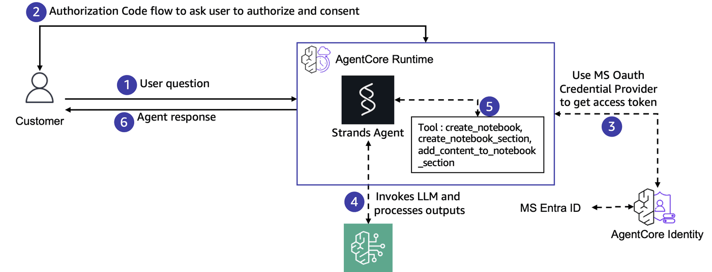
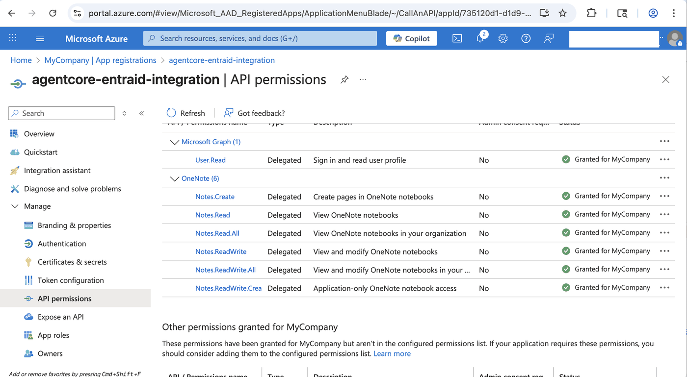
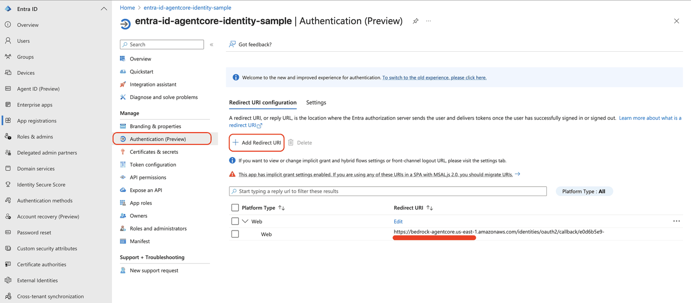
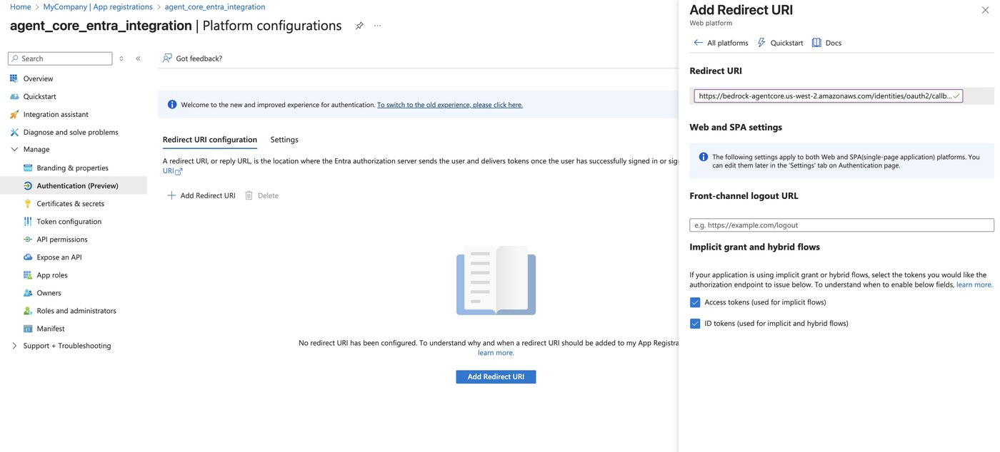
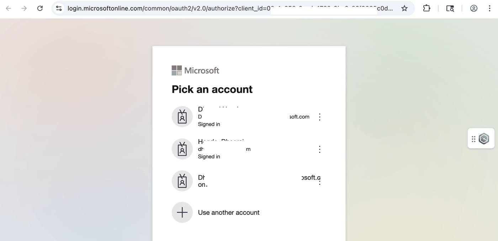
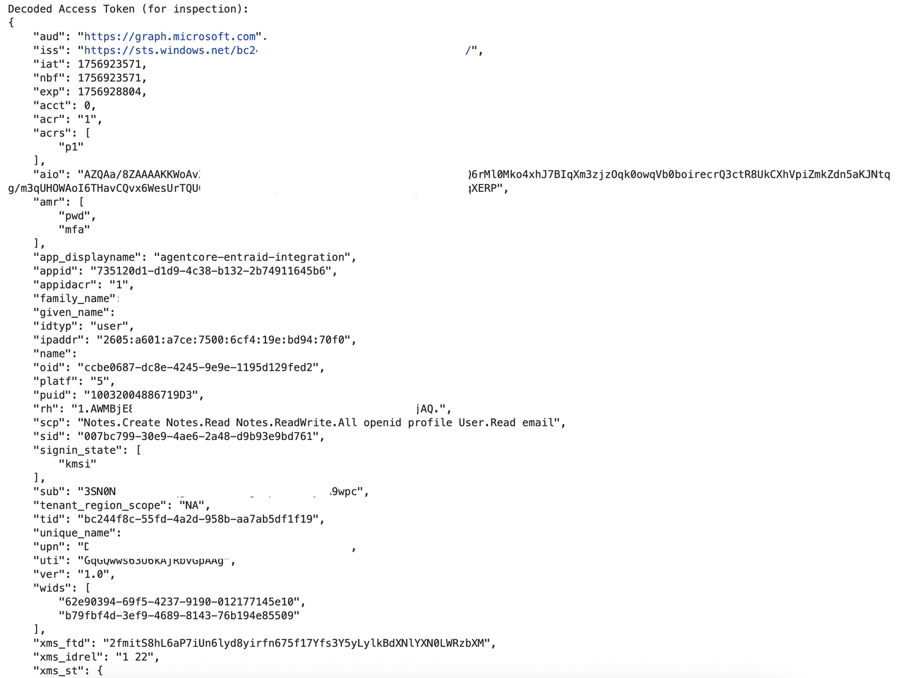
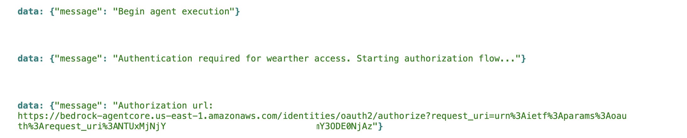
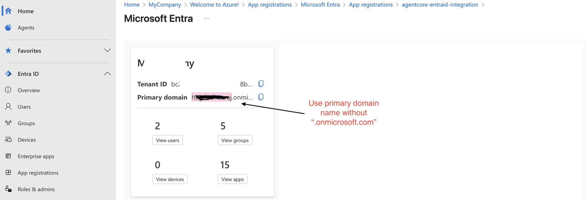
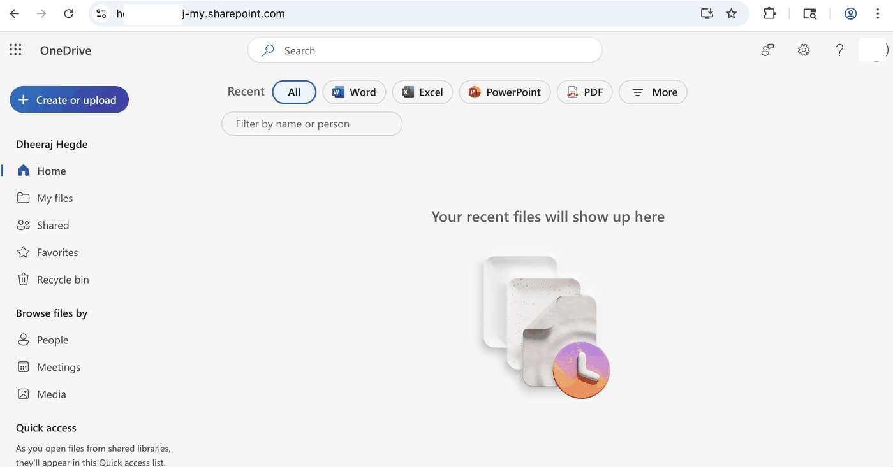
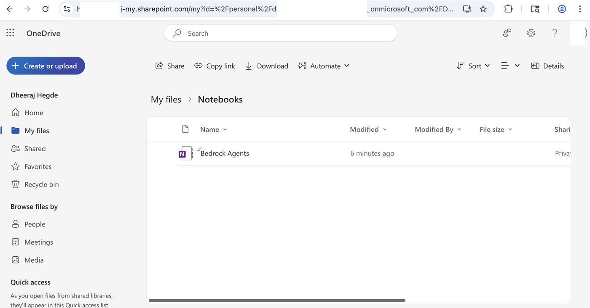

## Microsoft Entra ID Overview

Microsoft Entra ID (formerly Azure Active Directory) is Microsoft's cloud-based identity and access management service. It serves as the central 
identity provider for Microsoft 365, Azure, and thousands of other SaaS applications.

Key Features:
* **Single Sign-On (SSO)** - Users authenticate once to access multiple applications
* **Multi-Factor Authentication (MFA)** - Enhanced security through additional verification methods
* **Conditional Access** - Policy-based access control based on user, device, location, and risk
* **Application Integration** - Supports modern authentication protocols like OAuth 2.0, OpenID Connect, and SAML

## Learning Objective
Microsoft Entra ID can be used as an identity provider on AgentCore Identity and used to authenticate users and have them authorize the agent to acccess protected resources on their behalf. 



## Prerequisites

To execute this tutorial you will need:

* Python 3.10+
* AWS Credentials
* Strands Agents
* Docker, Finch or Podman installed
* Set AWS region to "us-west-2" or any region that supports Bedrock AgentCore. Refer to https://docs.aws.amazon.com/bedrock-agentcore/latest/devguide/agentcore-regions.html for supported regions.

```python
!pip install --force-reinstall -U -r requirements.txt --quiet
```

## Step 1: Setup Entra ID Tenant

## Authorization Code Flow
The OAuth 2.0 authorization code flow is the recommended approach for web applications to securely authenticate users and obtain access tokens. This 
flow involves:
1. Redirecting users to Entra ID for authentication
2. Receiving an authorization code after successful login
3. Exchanging the code for access and refresh tokens
4. Using tokens to access protected resources

This integration pattern allows AgentCore to leverage Entra ID's robust identity management capabilities while maintaining secure, standards-based authentication for your applications.

An Entra ID tenant is a dedicated instance of Microsoft Entra ID that represents your organization. Think of it as your organization's isolated directory in Microsoft's cloud.

Key Characteristics:
* **Unique Identity** - Each tenant has a unique domain (e.g., yourcompany.onmicrosoft.com)
* **Isolated Boundary** - Users, groups, and applications in one tenant are separate from others
* **Administrative Control** - Tenant admins manage users, security policies, and application registrations
* **Multi-Domain Support** - Can include custom domains alongside the default .onmicrosoft.com domain

In Practice:

When you register an application with Entra ID for OAuth integration, you're registering it within a specific tenant. Users from that tenant can then authenticate against your application using their organizational credentials.

For AgentCore integration, you'll need:
* **Tenant ID** - Unique identifier for the Entra ID instance
* **Application Registration** - Your app registered within the tenant
* **Appropriate Permissions** - Configured access rights for your application

This tenant-based model ensures that authentication and authorization remain within your organization's security boundary.

Steps to create a tenant can be found at https://learn.microsoft.com/en-us/entra/fundamentals/create-new-tenant

Note:
1. Microsoft Entra ID is not a AWS service. Please refer to Microsoft Entra ID documentation for costs related details.
2. Screen prints used in the following steps may change. We encourage you to refer to Microsoft Entra ID documentation for latest guidance on setting up an Entra ID application.

## Step 2: Setup Application

1. Go to https://portal.azure.com and search for "Entra ID" in the search bar at the top of the screen


2. Go to `Manage` &rarr; `App Registrations`


3. Click `New Registration` and fill in the details. Make sure you select the multi tenant option


4. Create a client secret. Copy the clientId and client secret for usage in AgentCore Identity.


5. Create Scopes for OAuth. Go to Expose an API &rarr; `Add Scope`. Copy and save full scope. 


6. Add API permissions to allow access to OneNote. "API Permissions" --> "Add a permission" --> "Microsoft API" --> "OneNote" --> "Delegated Permissions"


## Step 2 - Create a Bedrock AgentCore Identity Provider

Update the environment variables below using the details from the tenant and application you in Step 1.

retrieve:
- Tenant ID from "App registration" --> "All Applications" --> Select client you just created --> "Overview" --> "Directory (tenant) ID"
- Client ID from "App registration" --> "All Applications" --> Select client you just created --> "Overview" --> "Application (client) ID"
- Secret saved from earlier step
- Scope will be "openid profile https://graph.microsoft.com/Notes.ReadWrite.All https://graph.microsoft.com/Notes.Create"
- Audience will be "https://graph.microsoft.com"

```python
import os

# REPLACE WITH YOUR client_id
os.environ["client_id"] = "REPLACE_ME"

# REPLACE WITH YOUR secret
os.environ["secret"] = "REPLACE_ME"

# REPLACE WITH YOUR tenant_id
os.environ["tenant_id"] = "REPLACE_ME"

##########

# REPLACE WITH YOUR scopes, if needed
os.environ["scopes"] = (
    "openid profile https://graph.microsoft.com/Notes.ReadWrite.All https://graph.microsoft.com/Notes.Create"
)

# REPLACE WITH YOUR audience, if needed
os.environ["audience"] = "https://graph.microsoft.com"
```

Amazon Bedrock AgentCore Identity provides managed OAuth 2.0 supported providers for both inbound and outbound authentication. 

Create an identity provider for use with your agent. A provider abstracts away the complexity of different OAuth 2.0 implementations, API authentication schemes, and token formats, presenting a unified interface to agents while handling the underlying protocol variations and edge cases.

```python
from bedrock_agentcore.services.identity import IdentityClient
from boto3.session import Session


boto_session = Session()
region = boto_session.region_name

if not region:
    import warnings

    warnings.warn("There is no configured Region in the AWS session. Defaulting to us-east-1")
    region = "us-east-1"

identity_client = IdentityClient(region=region)

ms_provider = identity_client.create_oauth2_credential_provider(
    req={
        "name": "microsoft_entra_oauth_provider",
        "credentialProviderVendor": "MicrosoftOauth2",
        "oauth2ProviderConfigInput": {
            "microsoftOauth2ProviderConfig": {
                "clientId": os.environ["client_id"],
                "clientSecret": os.environ["secret"],
                "tenantId": os.environ["tenant_id"],
            }
        },
    }
)
print(f"Microsoft Credential Provider: {ms_provider}")
print()
print(f"Callback URL: {ms_provider['callbackUrl']}")
```

## Step 2.5: Update Microsoft Entra with the Callback URL from the Credential Provider



Select Token to issue.



## Step 3: Validate locally

AgentCore Identity enables developers to obtain OAuth tokens for either user-delegated access or machine-to-machine authentication based on the configured OAuth 2.0 credential providers. 

The service will orchestrate the authentication process between the user or application to the downstream authorization server, and it will retrieve and store the resulting token. Once the token is available in the AgentCore Identity vault, authorized agents can retrieve it and use it to authorize calls to resource servers. 

##### In the code below, we are are using Entra ID for a user-delegated flow.

```python
from bedrock_agentcore.identity.auth import requires_access_token
from oauth2_callback_server import get_oauth2_callback_url


@requires_access_token(
    provider_name="microsoft_entra_oauth_provider",
    auth_flow="USER_FEDERATION",
    scopes=os.environ["scopes"].split(" "),
    on_auth_url=lambda x: print("\nPlease copy and paste this URL in your browser:\n" + x),
    force_authentication=True,
    callback_url=get_oauth2_callback_url(),
)
def need_access_token(*, access_token: str):
    return access_token
```

##### `need_access_token(access_token="")` will present a URL that you use to authenticate into Entra ID and get an authorization token for application to use. Once you have authenticated and shared your consent, the authorization code will be available to you. 



```python
import sys
import subprocess

from oauth2_callback_server import wait_for_oauth2_server_to_be_ready

oauth2_callback_server_cmd = [
    sys.executable,
    "oauth2_callback_server.py",
    "--region",
    region,
]
oauth2_callback_server_process = subprocess.Popen(oauth2_callback_server_cmd)

id_token = ""
try:
    successfully_started_oauth2_server = wait_for_oauth2_server_to_be_ready()
    if not successfully_started_oauth2_server:
        print(
            "Failed to start OAuth2 callback server to handle session binding "
            "(https://docs.aws.amazon.com/bedrock-agentcore/latest/devguide/oauth2-authorization-url-session-binding.html)"
        )
    else:
        id_token = need_access_token(access_token="")
        print(f"Bearer Token Received: {id_token[:10]}...")
finally:
    oauth2_callback_server_process.terminate()
```

##### You can decode the token and validate it locally.

```python
import json
import jwt  # PyJWT library

# Decode the token (without verification for inspection purposes only)
# For production, always verify the token's signature and claims
decoded_token = jwt.decode(id_token, options={"verify_signature": False})

print(f"Decoded Bearer Token (for inspection): \n{json.dumps(decoded_token, indent=4)}")
```

##### Your decoded token from Entra ID should look similar to below.


## Step 4 - Put it all together as an AgentCore Runtime Agent

### OneNote Integration Agent

This code creates an AI agent that helps users create and manage Microsoft OneNote notebooks through natural language commands. The agent uses EntraID authentication to access the OneNote API and provides three main functions:

1. Create Notebook - Creates a new OneNote notebook (`create_notebook` tool)
2. Create Section - Adds sections to existing notebooks (`create_notebook_section` tool)
3. Add Content - Creates pages with content in notebook sections (`add_content_to_notebook_section` tool)

The agent handles OAuth2 authentication automatically, prompting users to authorize when needed, then processes their requests to organize meeting notes
or other content into structured OneNote notebooks.

```python
%%writefile strands_entraid_onenote.py
import os
import json
import asyncio
import requests

from strands import Agent
from strands import tool
from bedrock_agentcore.runtime import BedrockAgentCoreApp
from bedrock_agentcore.identity.auth import requires_access_token
from strands.models.bedrock import BedrockModel
from oauth2_callback_server import get_oauth2_callback_url

os.environ["STRANDS_OTEL_ENABLE_CONSOLE_EXPORT"] = "true"
os.environ["OTEL_PYTHON_EXCLUDED_URLS"] = "/ping,/invocations"

entra_access_token = None  # Global variable to store the access token
tool_name = None

@tool
def create_notebook(name: str) -> str:
    """
    Create a new Microsoft OneNote notebook for the user. Needed before you can create a section or add content.
    
    Args:
        name (str): The display name for the new notebook
        
    Returns:
        str: The ID of the created notebook
    """
    global entra_access_token
    global tool_name 
    tool_name = "create_notebook"
    # Check if we already have a token
    if not entra_access_token:
        return json.dumps({"auth_required": True, "message": f"Entra ID authentication is required for {tool_name}. Please wait while we set up the authorization.", "events": []})

    headers = {
        'Authorization': f'Bearer {entra_access_token}',
        'Content-Type': 'application/json'
    }
    # Create new notebook
    notebook_data = {'displayName': name}
    notebook = requests.post(
        'https://graph.microsoft.com/v1.0/me/onenote/notebooks', 
        headers=headers, 
        json=notebook_data
    )
    notebook.raise_for_status()
    return json.dumps({"notebook_id": notebook.json()['id']})

@tool
def create_notebook_section(notebook_id: str, section_name: str) -> str:
    """
    Create a new section in an existing OneNote notebook. Section is created for a specific notebook. 
    
    Args:
        notebook_id (str): The ID of the OneNote notebook to create the section in
        section_name (str): The display name for the new section
        
    Returns:
        str: The ID of the created section
    """
    global entra_access_token
    global tool_name 
    tool_name = "create_notebook_section"
    # Check if we already have a token
    if not entra_access_token:
        return json.dumps({"auth_required": True, "message": f"Entra ID authentication is required for {tool_name}. Please wait while we set up the authorization.", "events": []})

    headers = {
        'Authorization': f'Bearer {entra_access_token}',
        'Content-Type': 'application/json'
    }
    # Create new section
    section_data = {'displayName': section_name}
    section = requests.post(
        f'https://graph.microsoft.com/v1.0/me/onenote/notebooks/{notebook_id}/sections',
        headers=headers, 
        json=section_data
    )
    section.raise_for_status()
    
    section_id = section.json()['id']
    return json.dumps({"section_id": section_id})

@tool
def add_content_to_notebook_section(section_id: str, page_content) -> str:
    """
    Add content to a OneNote notebook section by creating a new page.
    
    Args:
        section_id (str): The ID of the OneNote section to add content to
        page_content: The HTML content to add as a new page
        
    Returns:
        str: URL to the created notebook page
    """
    global entra_access_token
    global tool_name 
    tool_name = "add_content_to_notebook_section"
    
    # Check if we already have a token
    if not entra_access_token:
        return json.dumps({"auth_required": True, "message": f"Entra ID authentication is required for {tool_name}. Please wait while we set up the authorization.", "events": []})

    headers = {
        'Authorization': f'Bearer {entra_access_token}',
        'Content-Type': 'text/html'
    }
    page = requests.post(
        f'https://graph.microsoft.com/v1.0/me/onenote/sections/{section_id}/pages',
        headers=headers, 
        data=page_content
    )
    page.raise_for_status()
    url = json.loads(page.text)["links"]["oneNoteWebUrl"]["href"]
    return json.dumps({"oneNoteWebUrl": url})
    
    
# Initialize the agent with tools
model = BedrockModel(model_id="global.anthropic.claude-haiku-4-5-20251001-v1:0")
system_prompt = """You are an Agent who helps user put in their meeting into OneNote notebooks. 
    Identify the notebook name, section name and content based on what the user has provided. 
    Return notebook URL once created."""
agent = Agent(model=model, system_prompt=system_prompt, tools=[create_notebook, create_notebook_section, add_content_to_notebook_section])

# Initialize app and streaming queue
app = BedrockAgentCoreApp()

class StreamingQueue:
    def __init__(self):
        self.finished = False
        self.queue = asyncio.Queue()
        
    async def put(self, item):
        await self.queue.put(item)

    async def finish(self):
        self.finished = True
        await self.queue.put(None)

    async def stream(self):
        while True:
            item = await self.queue.get()
            if item is None and self.finished:
                break
            yield item

queue = StreamingQueue()

async def on_auth_url(url: str):
    print(f"Authorization url: {url}")
    await queue.put(f"Authorization url: {url}")


async def agent_task(user_message: str):
    global tool_name
    try:
        await queue.put("Begin agent execution")
        
        # Call the agent first to see if it needs authentication
        response = agent(user_message)
        
        # Extract text content from the response structure
        response_text = ""
        if isinstance(response.message, dict):
            content = response.message.get('content', [])
            if isinstance(content, list):
                for item in content:
                    if isinstance(item, dict) and 'text' in item:
                        response_text += item['text']
        else:
            response_text = str(response.message)
        
        # Check if the response indicates authentication is required
        # Look for various keywords that indicate authentication issues
        auth_keywords = [
            "authentication", "authorize", "authorization", "auth", 
            "sign in", "login", "access", "permission", "credential",
            "need authentication", "requires authentication"
        ]
        needs_auth = any(keyword.lower() in response_text.lower() for keyword in auth_keywords)
       
        if needs_auth:
            await queue.put(f"Authentication required for {tool_name} access. Starting authorization flow...")
            
            # Trigger the 3LO authentication flow
            try:
                global entra_access_token
                entra_access_token = await need_token_3LO_async(access_token=None)
                await queue.put(f"Authentication successful! Retrying {tool_name}...")
                
                # Retry the agent call now that we have authentication
                response = agent(user_message)
            except Exception as auth_error:
                print(f"auth_error: ", repr(auth_error))
                await queue.put(f"Authentication failed: {repr(auth_error)}")
        
        await queue.put(response.message)
        await queue.put("End agent execution")
    except Exception as e:
        await queue.put(f"Error: {repr(e)}")
    finally:
        await queue.finish()

@requires_access_token(
    provider_name="microsoft_entra_oauth_provider",
    scopes=os.environ["scopes"].split(' '),
    auth_flow='USER_FEDERATION',
    on_auth_url=on_auth_url,
    force_authentication=True,
    callback_url=get_oauth2_callback_url(),
)
async def need_token_3LO_async(*, access_token: str):
    global entra_access_token
    entra_access_token = access_token  # Update the global access token
    print("Got access token....", access_token)
    return access_token


@app.entrypoint
async def agent_invocation(payload):
    user_message = payload.get("prompt", "No prompt found in input, please guide customer to create a json payload with prompt key")
    
    # Create and start the agent task
    task = asyncio.create_task(agent_task(user_message))

    # Return the stream, but ensure the task runs concurrently
    async def stream_with_task():
        # Stream results as they come
        async for item in queue.stream():
            yield item
        
        # Ensure the task completes
        await task
    
    return stream_with_task()
    
if __name__ == "__main__":
    app.run()
```

##### Configure your AgentCore Runtime

```python
from bedrock_agentcore_starter_toolkit import Runtime

agentcore_runtime = Runtime()

response = agentcore_runtime.configure(
    entrypoint="strands_entraid_onenote.py",
    auto_create_execution_role=True,
    auto_create_ecr=True,
    requirements_file="requirements.txt",
    region=region,
    agent_name="strands_entraid_onenote_3lo",
)

print(f"Agent Configure Response: {response}")
```

##### Launch your Agent. Once launched, agent would be available for use in your application

```python
launch_response = agentcore_runtime.launch(
    local_build=False,
    auto_update_on_conflict=True,
    env_vars={
        "scopes": os.environ["scopes"],
    },
)

print(f"Launch Response: {launch_response}")
```

#### Below code cell will give you and URL. Copy the URL you get (not the one in the image below), to authenticate  using browser window.


#### You will be asked to authenticate. Complete the authentication.


#### Make sure you delete notebook with name "Bedrock Agents" if it already exists.

```python
import sys
import uuid
import subprocess

from typing import Final
from oauth2_callback_server import (
    store_user_id_in_oauth2_callback_server,
    wait_for_oauth2_server_to_be_ready,
)


prompt = """
Put these notes into onenote notebook named "Bedrock Agents".

Amazon Bedrock AgentCore enables you to deploy and operate 
highly capable AI agents securely, at scale. It offers 
infrastructure purpose-built for dynamic agent workloads, 
powerful tools to enhance agents, and essential controls for 
real-world deployment. AgentCore services can be used 
 together or independently and work with any framework including 
CrewAI, LangGraph, LlamaIndex, and Strands Agents, as well as 
any foundation model in or outside of Amazon Bedrock, giving you 
ultimate flexibility. AgentCore eliminates the undifferentiated 
heavy lifting of building specialized agent infrastructure, so 
you can accelerate agents to production. Provide link to 
the created OneNote Notebook and provide error message from the API 
in case of failure.
"""
session_id = str(uuid.uuid1())
user_id: Final[str] = "user"

oauth2_callback_server_cmd = [
    sys.executable,
    "oauth2_callback_server.py",
    "--region",
    region,
]
oauth2_callback_server_process = subprocess.Popen(oauth2_callback_server_cmd)

try:
    successfully_started_oauth2_server = wait_for_oauth2_server_to_be_ready()
    if not successfully_started_oauth2_server:
        print(
            "Failed to start OAuth2 callback server to handle session binding "
            "(https://docs.aws.amazon.com/bedrock-agentcore/latest/devguide/oauth2-authorization-url-session-binding.html)"
        )
    else:
        store_user_id_in_oauth2_callback_server(user_id)
        st = agentcore_runtime.invoke(payload={"prompt": prompt}, session_id=session_id, user_id=user_id)
finally:
    oauth2_callback_server_process.terminate()
```

## Step 4 - Validate the created OneNote notebook
- Agent invoke funtion above will create a Notebook, a Section within, and add some content ot the section.
- User can access the created notebook by logging into https://your-domain-name-my.sharepoint.com/

You can get domain name from



After logging in you will reach you sharepoint home page. 



From there navigate to My Files --> Notebooks



## Conclusion and cleanup

In this notebook we learnt how to:
- Setup Entra ID API and Application to provide OAuth Authorization Code flow
- Create an AgentCore Runtime and deployed agent with tools that acted on user's behalf to create OneNote notebooks

#### Resource(s) created

```python
print(f"Runtime Agent: {launch_response.agent_id}")
```

#### Delete AgentCore Runtime

```python
import os
import boto3

agentcore_control_client = boto3.client("bedrock-agentcore-control", region_name=region)

delete_agent_response = agentcore_control_client.delete_agent_runtime(agentRuntimeId=launch_response.agent_id)
print(delete_agent_response)
print()

try:
    os.remove(".bedrock_agentcore.yaml")
    print("Successfully deleted local Runtime Agent config")
except Exception as e:
    print(f"Failed to delete local Agent config: {repr(e)}")
```

#### Delete OAuth2 credential provider

```python
delete_credential_provider = agentcore_control_client.delete_oauth2_credential_provider(name=ms_provider["name"])
print(delete_credential_provider)
```
