# Gateway Auth Okta Integration

AgentCore Identity lets you validate inbound access (Inbound Auth) for users and applications calling agents or tools in an AgentCore Runtime or validate access to AgentCore Gateway targets. It also provide secure outbound access (Outbound Auth) from an agent to external services or a Gateway target. It integrates with your existing identity providers (such as Amazon Cognito) while enforcing permission boundaries for agents acting independently or on behalf of users (via OAuth).

Inbound Auth validates callers attempting to invoke agents or tools, whether they're hosted in AgentCore Runtime, AgentCore Gateway, or in other environments. Inbound Auth works with IAM (SigV4 credentials) or with OAuth authorization.

By default, Amazon Bedrock AgentCore uses IAM credentials, meaning user requests to the agent are authenticated with the user's IAM credentials. In this tutorial we will be using OAuth with an Okta IDP, so you will need to specify the following when configuring your AgentCore Runtime resources or AgentCore Gateway endpoints:

- OAuth discovery server Url — A string that must match the pattern ^.+/.well-known/openid-configuration$ for OpenID Connect discovery URLs

- Allowed audiences — List of allowed audiences for JWT token

- Allowed clients — List of allowed client identifiers

If you use the AgentCore CLI, you can specify the type of authorization (and OAuth discovery server) for an AgentCore Runtime when you use the configure command. You can also use the CreateAgentRuntime operation and Amazon Bedrock AgentCore console. If you are creating a Gateway, you use the CreateGateway operation, or the console.

Before the user can use the agent, the client application must have the user authenticate with the OAuth authorizer. Your client receives a bearer token which it then passes to the agent in an invocation request. Upon receipt the agent validates the token with the authorization server before allowing access.

## Overview

In this tutorial we will configure Inbound Auth using Okta as the Identity provider. You will set up a Okta tenant with one user and an app client. You will learn how to host your existing agent, using Amazon Bedrock AgentCore Runtime with Inbound Auth using the Okta app client. You will also setup an Amazon Bedrock AgentCore Gateway that uses Okta for Inbound Auth that your agent will interact with.

### Tutorial Architecture

<figure>
    
</figure>

### Tutorial Details

| Information         | Details                                                                          |
|:--------------------|:---------------------------------------------------------------------------------|
| Tutorial type       | Conversational                                                                   |
| Agent type          | Single                                                                           |
| Agentic Framework   | Strands Agents                                                                   |
| LLM model           | Anthropic Claude Sonnet 4                                                        |
| Tutorial components | Hosting agent on AgentCore Runtime. Using Strands Agent and Amazon Bedrock Model |
| Tutorial vertical   | Cross-vertical                                                                   |
| Example complexity  | Easy                                                                             |
| Inbound Auth        | Okta                                                                             |
| SDK used            | Amazon BedrockAgentCore Python SDK and boto3                                     |


### Key Features

* Hosting Agents on Amazon Bedrock AgentCore Runtime with Inbound and Outbound Auth using Okta
* Hosting an Amazon Bedrock AgentCore Gateway with Inbound Auth using Okta
* Using Amazon Bedrock models
* Using Strands Agents

## Prerequisites

To execute this tutorial you will need:
* Python 3.10+
* IAM rights to create new IAM roles, policies, and users
* IAM rights to create a new AgentCore Agent
* An Okta account
* Amazon Bedrock AgentCore SDK
* Strands Agents
* Docker running

## Setting up Okta's IDP

Let's setup a Okta demo tenant with an App client and one test user. We'll use Okta to provide JWT tokens for invoking an agent we'll deploy later in this tutorial. If you already have an Okta account, login to it.

Browse to https://developer.okta.com/signup/, select "Sign up for Integrator Free Plan" to sign up.

1. Login to your account.<br><br>
2. Select **Directory**, then **People** and click **Add person**.
    <figure>
        
    </figure><br><br>
3. Fill in the form.
    <ol type="1">
        <li>For <b>Activation</b>, select <b>Activate now</b>.</li>
        <li>Check the <b>I will set password</b> box and set a password for the user.</li>
        <li>Uncheck the <b>User must change password on first login</b> box.</li>
        <li>Click <b>Save</b>.</li>
    </ol>

    <figure>
        
    </figure>
    <br><br>
4. Select **Applications**, then click **Create App Integration**.
    <figure>
        
    </figure>
    <br><br>

5. For the sign-in method, select **OIDC - OpenID Connect**, then select **Web Application** for the application type and click **Next**.

    <figure>
        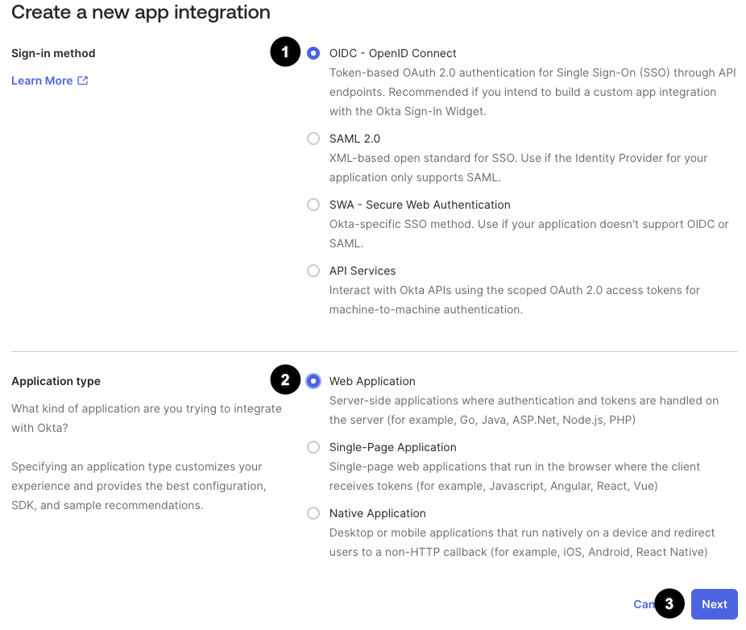
    </figure><br><br>
    <ol type="a">
        <li>For the App integration name enter <b>Travel Assistant</b>, next leave <b>Proof of possession</b> unchecked and select <b>Authorization Code</b> for the grant type. 
        <br><br>
        <figure>
            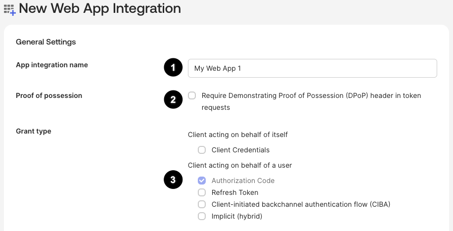
        </figure>
        <br><br>
        </li>
        <li>Update the sign-in URI to include <b>http://127.0.0.1:5000/callback</b> and <b>https://bedrock-agentcore.us-west-2.amazonaws.com/identities/oauth2/callback</b>. Leave the sign-out redirect URI as is.
        <br><br>
        <figure>
            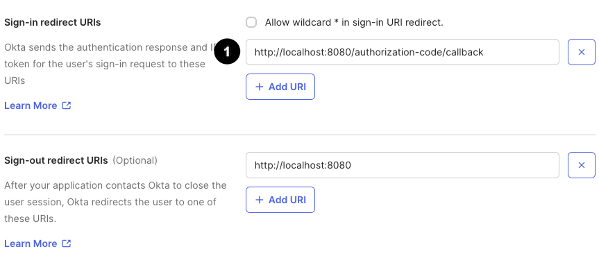
        </figure>
        <br><br>
        </li>
        <li>Under assignments, <b>Allow everyone in your organization to access</b>, then leave <b>Enable immediate access</b> checked. Next, click <b>Save</b>.
        <br><br>
        <figure>
            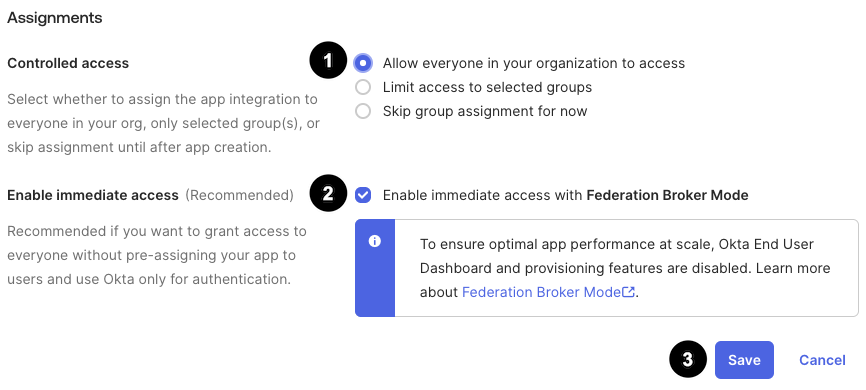
        </figure>
        <br><br>
        </li>
        <li>Copy the <b>Client ID</b> and <b>Secret</b> for later use.</li>
        <br><br>
        <figure>
            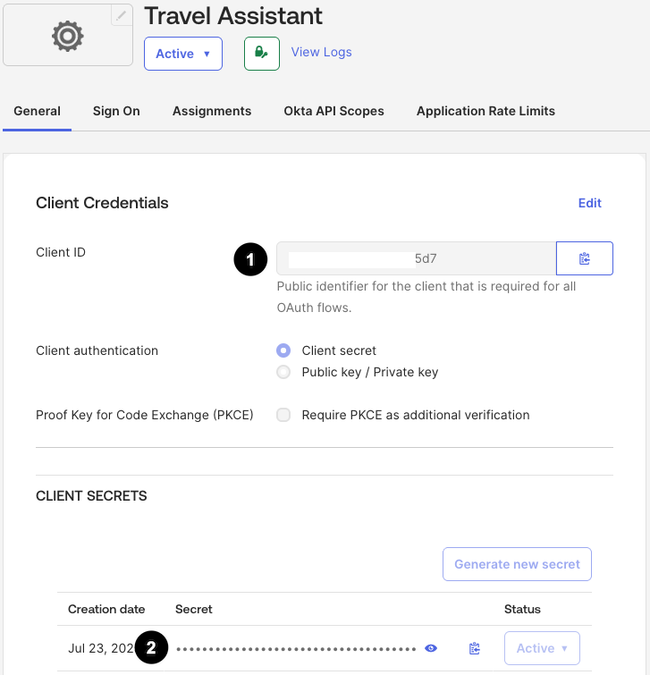
        </figure>
        <br><br>
    </ol><br>

6. In left-hand side menu, select **Security**, then **API**, and click the name of your authorization server.
    <figure>
        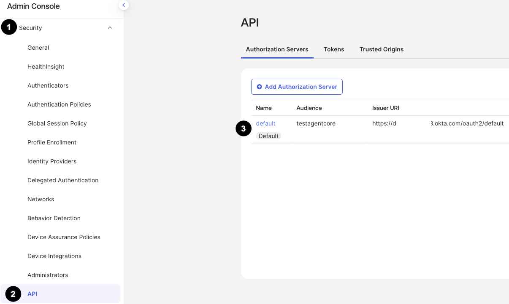
    </figure><br><br>
    <ol type="a">
        <li>Copy the <b>Audience</b> and save it for later use.</li>
            <ul>
                <li><b>Note</b>: The default <b>Audience</b> was changed in this example. It is recommended to add a new authorization server if you plan to change the audience so that other apps are not affected.</li><br>
            </ul>
        <figure>
            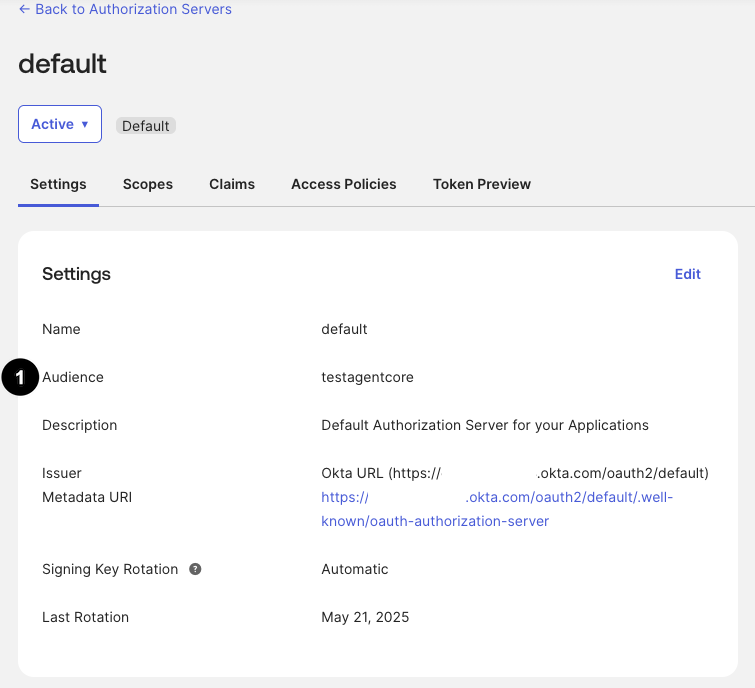
        </figure>
        <br><br>
        <li>Click <b>Scopes</b>, then <b>Add Scope</b>.</li><br>
        <figure>
            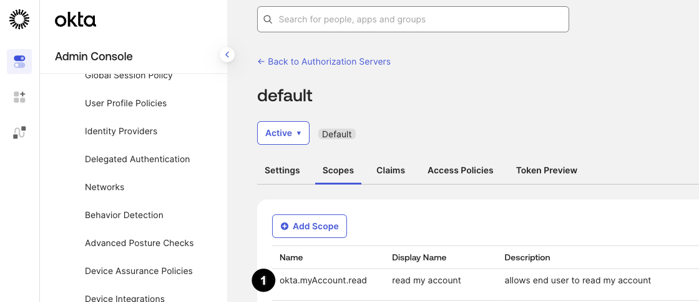
        </figure>
        <br><br>
        <li>Use <b>okta.myAccount.read</b> for the name and give it a <b>Display Phrase</b> and a <b>Description</b>.</li>
        <li>Set <b>User Consent</b> to <b>implicit</b>.</li>
        <li>Leave <b>Block services</b>, <b>Default scope</b> and <b>Metadata</b> at default.</li>
        <li>Click <b>Save</b>.
        <figure>
            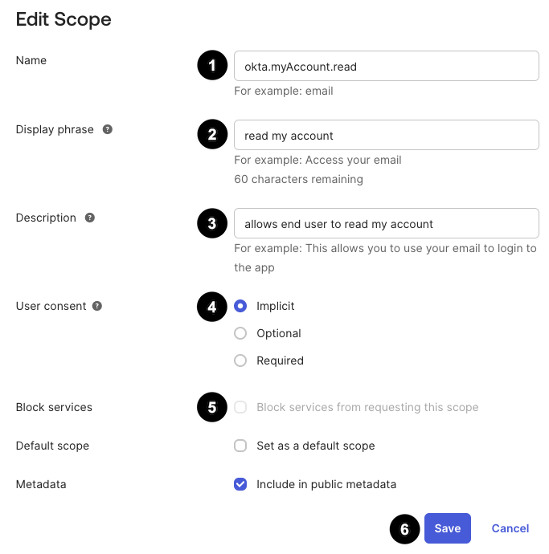
        </figure><br>
        <li>Click <b>Claims</b> and add the following <b>client_id</b> and <b>scope</b> claims.</li><br>
        <figure>
            
        </figure><br>
        <li>Click <b>Access Policies</b> and then click <b>Add New Access Policy</b></li><br>
        <figure>
            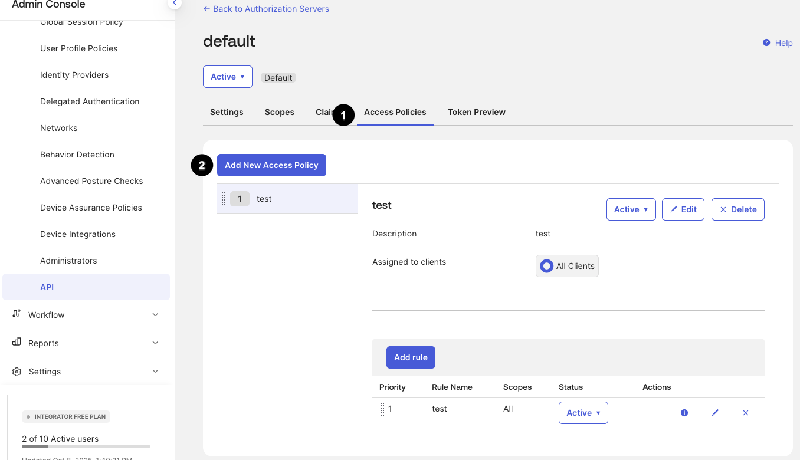
        </figure><br>
        <li>Enter a <b>Name</b>, <b>Description</b> and click <b>Create Policy</b></li><br>
        <figure>
            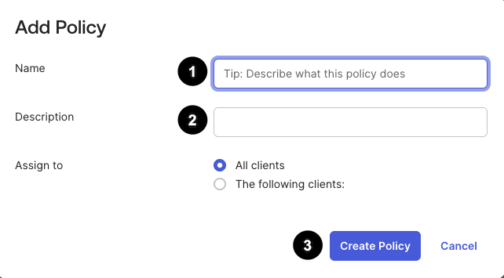
        </figure><br>
        <li>Click <b>Add rule</b></li><br>
        <figure>
            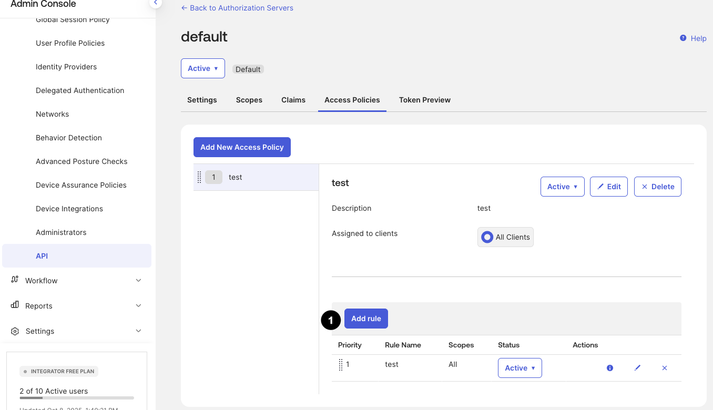
        </figure><br>
        <li>Give the rule a <b>Rule Name</b> and click <b>Create Rule</b></li><br>
        <figure>
            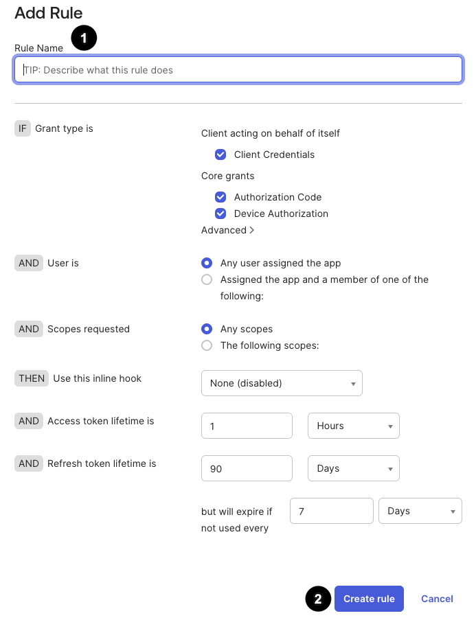
        </figure><br>
    </ol>

## Creating the API Gateway

This CloudFormation template creates a serverless API with JWT authentication:
* Amazon API Gateway with a JWT authorizer that validates tokens from Okta
* Protected endpoint at **GET /travel-plans** that requires valid JWT authentication
* AWS Lambda function that is executed by calling the **GET /travel-plans** endpoint

The AgentCore Gateway would transform this Amazon API Gateway into an MCP (Model Context Protocol) server by acting as a protocol adapter that translates MCP requests into HTTP calls to the underlying API Gateway endpoints.

Execute the code cell below to save the CloudFormation template as template.yaml to your local filesystem.

```python
%%writefile template.yaml
AWSTemplateFormatVersion: '2010-09-09'
Parameters:
  JwtIssuerUrl:
    Type: String
    Description: The URL of the JWT issuer (e.g., Cognito user pool URL).
    MinLength: 10 # Optional: You can add constraints like minimum length
    MaxLength: 200 # Optional: Maximum length
    # You can also add a Default value if you want

  JwtAudienceList:
    Type: CommaDelimitedList # <-- Using CommaDelimitedList for multiple audiences
    Description: A comma-separated list of expected audience(s) for the JWT (e.g.,
      "my-api-audience-1,my-api-audience-2").
    # Optional: You can add Default or other constraints if needed
    # Default: "my-default-audience"

Resources:
  MyHttpApi:
    Type: AWS::ApiGatewayV2::Api
    Properties:
      Name: MyHttpApi
      ProtocolType: HTTP

  MyJwtAuthorizer:
    Type: AWS::ApiGatewayV2::Authorizer
    Properties:
      ApiId: !Ref MyHttpApi
      AuthorizerType: JWT
      IdentitySource:
        - $request.header.Authorization
      JwtConfiguration:
        Audience: !Ref JwtAudienceList
        Issuer: !Ref JwtIssuerUrl
      Name: MyJwtAuthorizer

  MyLambdaFunction:
    Type: AWS::Lambda::Function
    Properties:
      FunctionName: MyLambdaFunction
      Handler: lambda_function.lambda_handler
      Runtime: python3.12
      Code:
        ZipFile: |
          exports.handler = async (event) => {
              // In non-proxy integration, the Lambda function receives the mapped input
              // from API Gateway, NOT the full HTTP request.
              console.log('Received event:', JSON.stringify(event, null, 2));

              const name = event.name || "World";
              const message = `Hello, ${name}! (from non-proxy integration)`;

              // In non-proxy integration, you can return a simple string, object, etc.
              // API Gateway then formats this into a proper HTTP response using mapping templates.
              return { "message": message }; // Example of a simple JSON response
          };
      MemorySize: 128
      Timeout: 30
      Role: !GetAtt MyLambdaExecutionRole.Arn

  MyLambdaExecutionRole:
    Type: AWS::IAM::Role
    Properties:
      AssumeRolePolicyDocument:
        Version: '2012-10-17'
        Statement:
          - Effect: Allow
            Principal:
              Service:
                - lambda.amazonaws.com
            Action:
              - sts:AssumeRole
      Policies:
        - PolicyName: MyLambdaPolicy
          PolicyDocument:
            Version: '2012-10-17'
            Statement:
              - Effect: Allow
                Action:
                  - logs:CreateLogGroup
                  - logs:CreateLogStream
                  - logs:PutLogEvents
                Resource: arn:aws:logs:*:*:*

  MyApiIntegration:
    Type: AWS::ApiGatewayV2::Integration
    Properties:
      PayloadFormatVersion: "2.0"
      ApiId: !Ref MyHttpApi
      IntegrationType: AWS_PROXY
      IntegrationUri: !Join
        - ''
        - - 'arn:'
          - !Ref 'AWS::Partition'
          - ':apigateway:'
          - !Ref 'AWS::Region'
          - ':lambda:path/2015-03-31/functions/'
          - !GetAtt MyLambdaFunction.Arn
          - /invocations
      IntegrationMethod: POST # Lambda invocations are typically POST
      # You'll also need to define mapping templates with AWS integration type
      # as shown in the IntegrationRequest and IntegrationResponse sections

  MyApiRoute:
    Type: AWS::ApiGatewayV2::Route
    Properties:
      ApiId: !Ref MyHttpApi
      RouteKey: GET /travel-plans # Changed to POST to match IntegrationMethod
      Target: !Join
        - /
        - - integrations
          - !Ref MyApiIntegration
      AuthorizationType: JWT
      AuthorizerId: !Ref MyJwtAuthorizer
```

1. Browse to CloudFormation in us-west-2 region and click, Create stack.
2. Select **With new resources(standard)**.
<figure>
    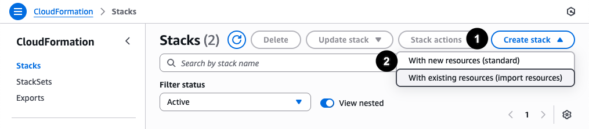
</figure>

3. For the prerequisite, select **Choose an existing template**.
4. For specify template, select **Upload a template file** and choose the **template.yaml** file saved in the previous step.
5. Click **Next**.

<figure>
    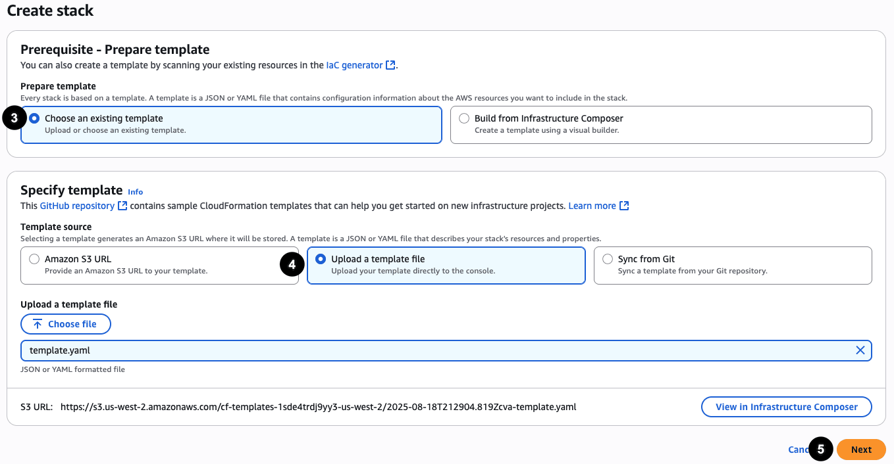
</figure>

6. Provide a **stack name** (e.g. test-deployment-stack)
7. Enter the **Audience** for the JwtAudienceList parameter. 
8. Enter the **Issuer URL** for the JwtIssueURL (e.g., https://{yoursubdomain}.okta.com/oauth2/default).

<figure>
    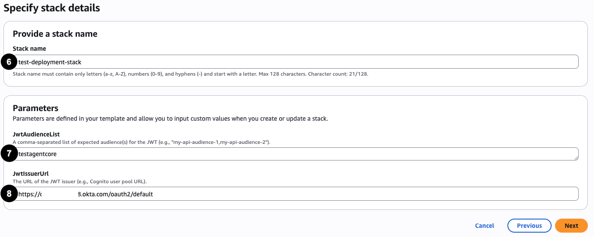
</figure>

9. Check the box **I acknowledge that AWS CloudFormation might create IAM resources**.
10. Click **Next**.
<figure>
    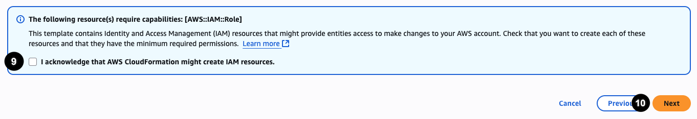
</figure>

11. Click **Submit**.

<figure>
    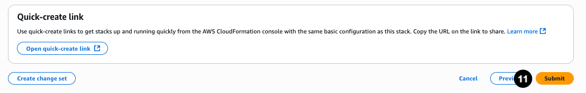
</figure>

## Updating the Lambda Function

1. Browse to **Lambda** > **Functions**, then **click** on **MyLambdaFunction**.
<figure>
    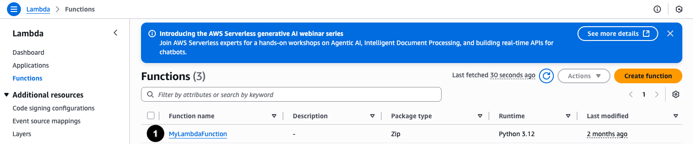
</figure>

2. Copy the source code below into the **Code** section.
3. Rename the <b>index.js</b> file to <b>lambda_function.py</b>
4. Click **Deploy**. 
<figure>
    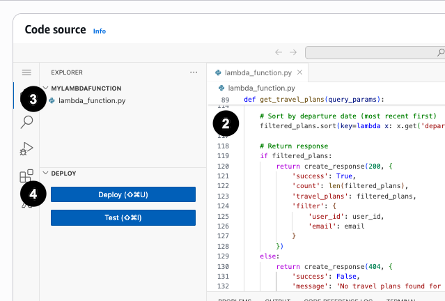
</figure>

5. Browse to **API Gateway** > **Integrations** and click **Manage integrations**.
<figure>
    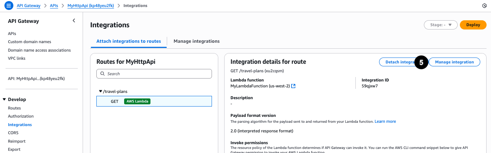
</figure>

6. Click on **Edit** under **Integration details**.
<figure>
    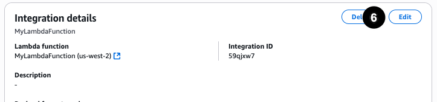
</figure>

7. Update to the latest **Lambda function** ARN and click **Save**.
<figure>
    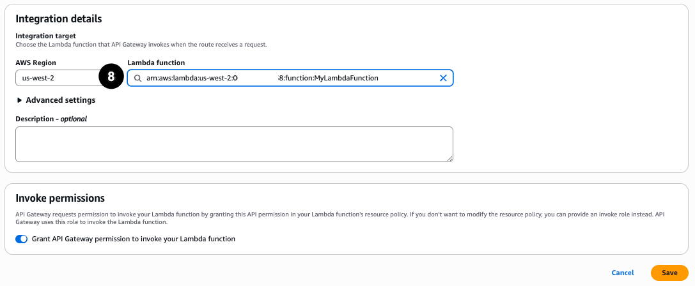
</figure>

AWS Lambda Code:

```python
import json

# Mock data storage (in production, this would be a database)
MOCK_TRAVEL_PLANS = [
    {
        "id": "plan-001",
        "user_id": "user-123",
        "email": "john.doe@example.com",
        "destination": "Paris, France",
        "departure_date": "2024-03-15",
        "return_date": "2024-03-22",
        "accommodation": "Hotel Le Marais",
        "activities": ["Eiffel Tower", "Louvre Museum", "Seine River Cruise"],
        "budget": 2500.00,
        "status": "confirmed",
    },
    {
        "id": "plan-002",
        "user_id": "user-123",
        "email": "john.doe@example.com",
        "destination": "Tokyo, Japan",
        "departure_date": "2024-05-10",
        "return_date": "2024-05-20",
        "accommodation": "Tokyo Grand Hotel",
        "activities": ["Mount Fuji", "Sensoji Temple", "Shibuya Crossing"],
        "budget": 3500.00,
        "status": "planned",
    },
    {
        "id": "plan-003",
        "user_id": "user-456",
        "email": "jane.smith@example.com",
        "destination": "New York, USA",
        "departure_date": "2024-04-01",
        "return_date": "2024-04-07",
        "accommodation": "Manhattan Plaza Hotel",
        "activities": ["Statue of Liberty", "Central Park", "Broadway Show"],
        "budget": 2000.00,
        "status": "confirmed",
    },
    {
        "id": "plan-004",
        "user_id": "user-456",
        "email": "jane.smith@example.com",
        "destination": "Barcelona, Spain",
        "departure_date": "2024-06-15",
        "return_date": "2024-06-25",
        "accommodation": "Barcelona Beach Resort",
        "activities": ["Sagrada Familia", "Park Güell", "Las Ramblas"],
        "budget": 2800.00,
        "status": "planned",
    },
    {
        "id": "plan-005",
        "user_id": "user-789",
        "email": "bob.wilson@example.com",
        "destination": "Sydney, Australia",
        "departure_date": "2024-07-20",
        "return_date": "2024-08-03",
        "accommodation": "Sydney Harbour Hotel",
        "activities": ["Opera House", "Harbour Bridge", "Bondi Beach"],
        "budget": 4500.00,
        "status": "tentative",
    },
]


def lambda_handler(event, context):
    """
    Main Lambda handler for travel plans API
    """
    query_parameters = event.get("queryStringParameters", {})
    try:
        # Route based on HTTP method and path
        return get_travel_plans(query_parameters)
    except Exception as e:
        return create_response(500, {"error": "Internal Server Error", "message": str(e)})


def create_response(status_code, body):
    """
    Create API Gateway Lambda response
    """
    return {"statusCode": status_code, "body": json.dumps(body)}


def get_travel_plans(query_params):
    """
    Get travel plans by user_id or email
    Query parameters:
    - user_id: Filter by user ID
    - email: Filter by email address
    """
    user_id = query_params.get("user_id") if query_params else None
    email = query_params.get("email") if query_params else None

    # Validate that at least one parameter is provided
    if not user_id and not email:
        return create_response(
            400,
            {
                "error": "Either user_id or email must be provided",
                "message": "Please provide user_id or email as query parameter",
            },
        )

    # Filter travel plans based on the provided parameter
    filtered_plans = []

    for plan in MOCK_TRAVEL_PLANS:
        if user_id and plan["user_id"] == user_id:
            filtered_plans.append(plan)
        elif email and plan["email"].lower() == email.lower():
            filtered_plans.append(plan)

    # Sort by departure date (most recent first)
    filtered_plans.sort(key=lambda x: x.get("departure_date", ""), reverse=True)

    # Return response
    if filtered_plans:
        return create_response(
            200,
            {
                "success": True,
                "count": len(filtered_plans),
                "travel_plans": filtered_plans,
                "filter": {"user_id": user_id, "email": email},
            },
        )
    else:
        return create_response(
            404,
            {
                "success": False,
                "message": "No travel plans found for the specified user",
                "filter": {"user_id": user_id, "email": email},
                "travel_plans": [],
            },
        )
```

## Creating the Amazon Bedrock AgentCore Gateway

The code below will write an **demo_openapi.yaml** file to your hard drive. This file will be used to create the Amazon Bedrock AgentCore Gateway that will proxy requests to the API Gateway we created in previous steps.
<ol type="1">
<li>Browse to <b>API Gateway</b> > <b>APIs</b> > <b>Stages</b> and click <b>Create</b>.</li>
<figure>
    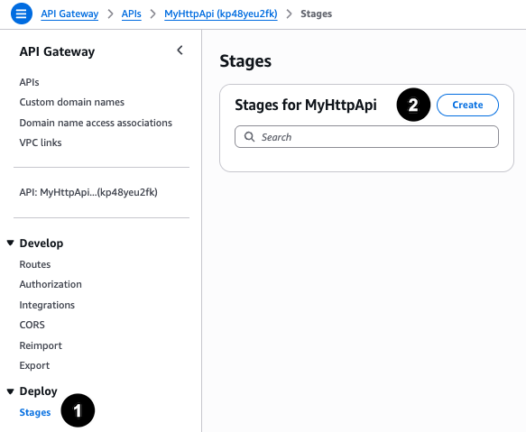
</figure>
<li>Set the stage <b>Name</b> to <b>default</b>.</li>
<li>Click to <b>Enable automatic deployment</b>.</li>
<li>Click <b>Create</b>.</li>
<figure>
    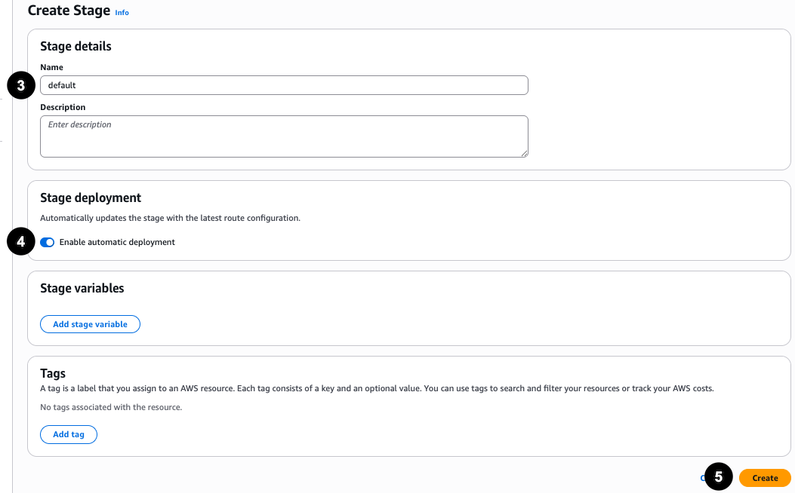
</figure>
<li>Write down the <b>Default endpoint</b>.</li>
<figure>
    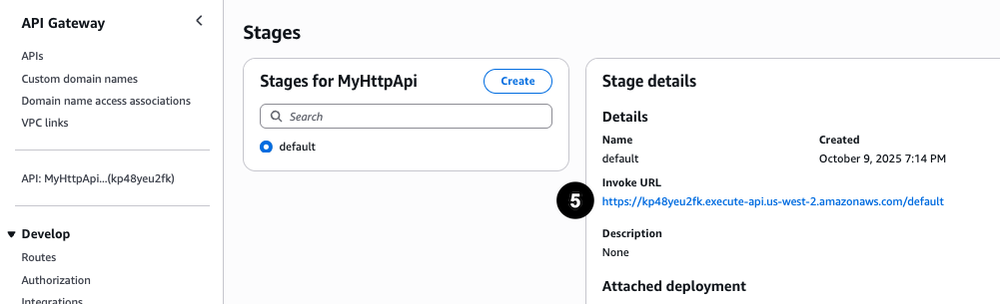
</figure>
<li>Click the code cell below to save the <b>demo_openapi.yaml</b> file to your hard drive.</li>
    <ol type="a">
            <li>Open <b>demo_oepnapi.yaml</b> and edit the <b>{yoursubdomain}</b> of the <b>server URL</b> to match the <b>Invoke ULR</b> from the last step.</li>
            <li>Edit the <b>{yoursubdomain}</b> of the <b>authorization URL</b> and the <b>token URL</b> to match your Okta tenant, then save the file (located in the URL used to sign into your Okta tenant).</li>
    </ol>
</ol>

```python
%%writefile demo_openapi.yaml
openapi: 3.0.0
info:
  title: Travel Plans API
  description: API for retrieving user travel plans with secure authentication
  version: 1.0.0
  contact:
    name: Travel Plans Developer
    email: developer@example.com
  license:
    name: Apache 2.0
    url: http://www.apache.org/licenses/LICENSE-2.0.html

servers:
  - url: https://{yoursubdomain}.execute-api.us-west-2.amazonaws.com/default
    description: Production server

paths:
  /travel-plans:
    get:
      summary: Retrieve Travel Plans
      description: Fetch travel plans by user ID or email
      operationId: getTravelPlans
      security:
        - OAuth2:
          - read:travel-plans
        - ApiKeyAuth: []
      parameters:
        - in: query
          name: user_id
          schema:
            type: string
          required: false
          description: Unique identifier of the user
          example: "user-123"
        
        - in: query
          name: email
          schema:
            type: string
            format: email
          required: false
          description: Email address of the user
          example: "john.doe@example.com"
      
      responses:
        '200':
          description: Successful retrieval of travel plans
          content:
            application/json:
              schema:
                type: object
                properties:
                  success:
                    type: boolean
                  count:
                    type: integer
                  travel_plans:
                    type: array
                    items:
                      $ref: '#/components/schemas/TravelPlan'
                  filter:
                    type: object
                    properties:
                      user_id:
                        type: string
                      email:
                        type: string
        
        '400':
          description: Bad Request - Missing query parameters
          content:
            application/json:
              schema:
                $ref: '#/components/schemas/ErrorResponse'
        
        '401':
          description: Unauthorized - Invalid or missing authentication
          content:
            application/json:
              schema:
                $ref: '#/components/schemas/ErrorResponse'
        
        '403':
          description: Forbidden - Insufficient permissions
          content:
            application/json:
              schema:
                $ref: '#/components/schemas/ErrorResponse'
        
        '404':
          description: No travel plans found
          content:
            application/json:
              schema:
                type: object
                properties:
                  success:
                    type: boolean
                  message:
                    type: string
                  filter:
                    type: object
                    properties:
                      user_id:
                        type: string
                      email:
                        type: string
                  travel_plans:
                    type: array
                    items: {}
        
        '500':
          description: Internal Server Error
          content:
            application/json:
              schema:
                $ref: '#/components/schemas/ErrorResponse'

components:
  securitySchemes:
    OAuth2:
      type: oauth2
      flows:
        authorizationCode:
          authorizationUrl: https://{yoursubdomain}.okta.com/oauth2/default/v1/authorize
          tokenUrl: https://{yoursubdomain}.okta.com/oauth2/default/v1/token
          scopes:
            read:travel-plans: Read access to travel plans
            write:travel-plans: Write access to travel plans
            delete:travel-plans: Delete access to travel plans
  
    ApiKeyAuth:
      type: apiKey
      in: header
      name: X-API-Key

    BearerAuth:
      type: http
      scheme: bearer
      bearerFormat: JWT

  schemas:
    TravelPlan:
      type: object
      required:
        - id
        - user_id
        - email
        - destination
        - departure_date
        - return_date
        - status
      properties:
        id:
          type: string
          description: Unique identifier for the travel plan
          example: "plan-001"
        user_id:
          type: string
          description: Unique identifier of the user
          example: "user-123"
        email:
          type: string
          format: email
          description: Users email address
          example: "john.doe@example.com"
        destination:
          type: string
          description: Travel destination
          example: "Paris, France"
        departure_date:
          type: string
          format: date
          description: Date of departure
          example: "2024-03-15"
        return_date:
          type: string
          format: date
          description: Date of return
          example: "2024-03-22"
        accommodation:
          type: string
          description: Name of accommodation
          example: "Hotel Le Marais"
        activities:
          type: array
          items:
            type: string
          description: List of planned activities
          example: ["Eiffel Tower", "Louvre Museum"]
        budget:
          type: number
          format: float
          description: Estimated travel budget
          example: 2500.00
        status:
          type: string
          description: Status of the travel plan
          enum:
            - confirmed
            - planned
            - tentative
          example: "confirmed"

    ErrorResponse:
      type: object
      properties:
        error:
          type: string
        message:
          type: string
        error_code:
          type: string
        timestamp:
          type: string
          format: date-time

    OAuthToken:
      type: object
      properties:
        access_token:
          type: string
          description: JWT access token
        token_type:
          type: string
          enum:
            - Bearer
        expires_in:
          type: integer
          description: Token expiration time in seconds
        refresh_token:
          type: string
          description: Token to obtain a new access token

tags:
  - name: Travel Plans
    description: Operations related to travel plan retrieval
  - name: Authentication
    description: OAuth2 and API Key authentication methods

x-security-definitions:
  - name: OAuth2
    description: >
      OAuth 2.0 Authentication:
      - Authorization Code Flow
  - name: API Key
    description: >
      API Key authentication for service-to-service communication

x-rate-limiting:
  limit: 100
  period: 1 minute
  
x-error-handling:
  generic-errors:
    - 400: Bad Request
    - 401: Unauthorized
    - 403: Forbidden
    - 404: Not Found
    - 500: Internal Server Error
```

2. Upload **demo_openapi.yaml** to an S3 bucket. You may choose which bucket to upload it to.
<figure>
    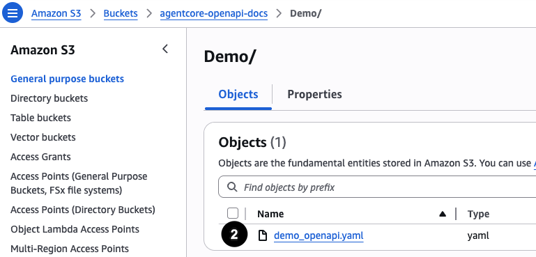
</figure>

3. Browse to **Amazon Bedrock AgentCore**. 
4. In the left-hand side menu, select **Identity**
5. Click **Add OAuth client / API key**, then **Add Oauth client**.
<figure>
    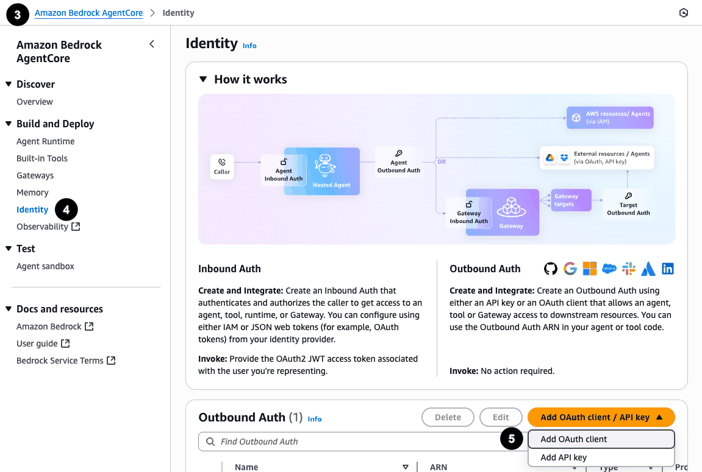
</figure>

6. Under Provider, select **Custom provider**.
7. Select **Discovery URL** and enter the **Client ID**, **Client secret** and the **Discovery URL** (https://{yoursubdomain}.okta.com/oauth2/default/.well-known/openid-configuration), then save the name of the resource provider for future use.
8. Click **Add OAuth Client**.
<figure>
    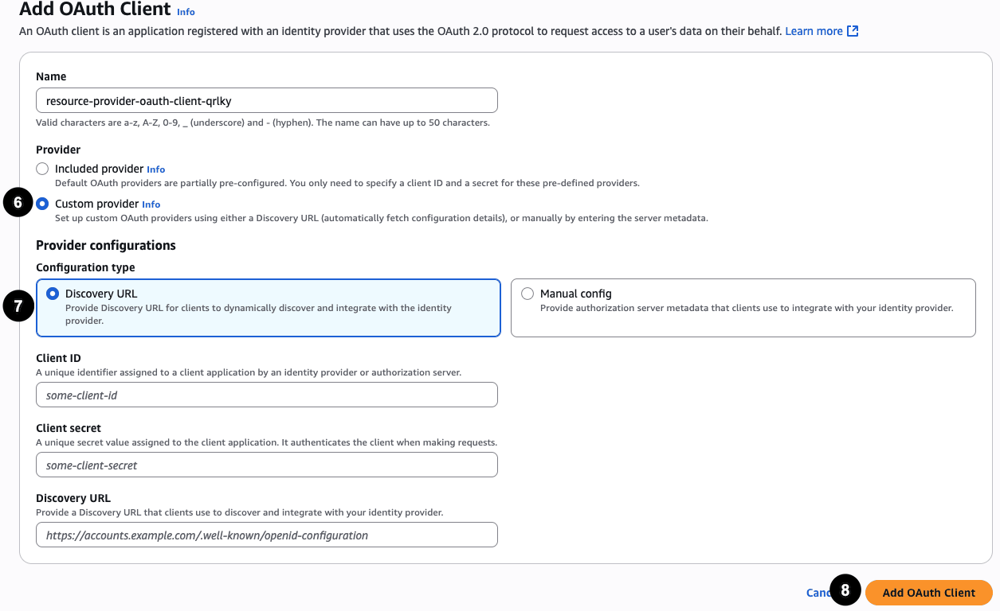
</figure>


9. In the left-hand side menu, select **Gateways**, then click **Create Gateway**.
<figure>
    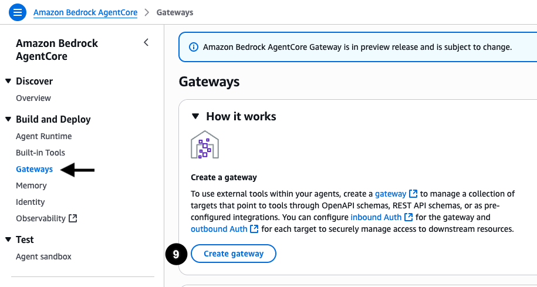
</figure>

10. Set a **Gateway name** or use the default name.
<figure>
    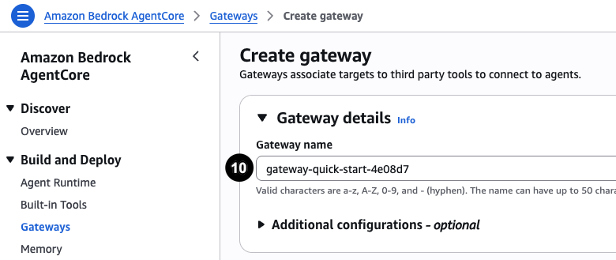
</figure>

11. Select **Use existing Identity provider configurations** under **Inbound Auth configurations**.
12. Enter the **Discovery URL** (https://{yoursubdomain}.okta.com/oauth2/default/.well-known/openid-configuration), **Allowed audiences** and **Allowed clients** (audience and Client ID for your Okta tenant).
<figure>
    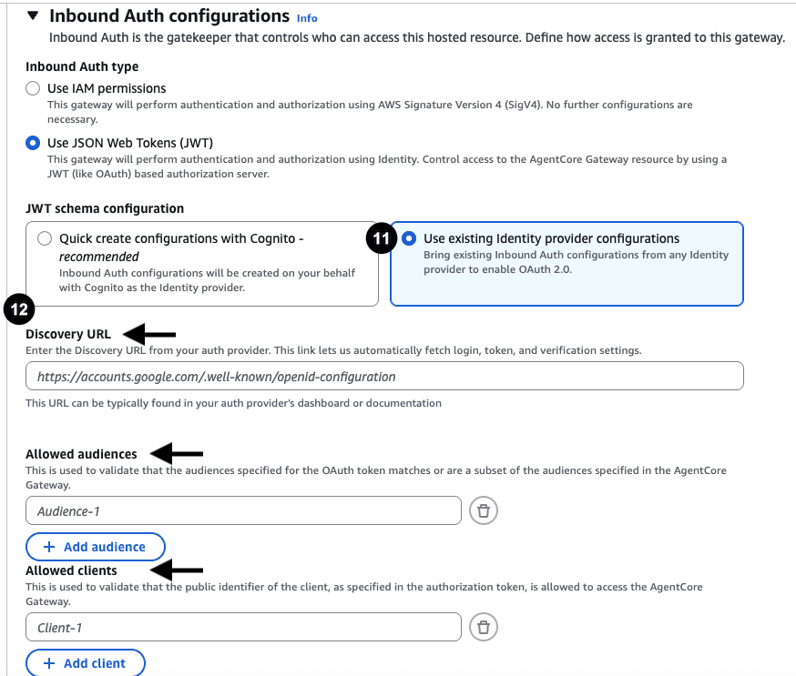
</figure>

13. Under Target:{target name}, select **REST API** for target type.
14. For REST API type, select **OpenAPI schema**.
15. For OpenAPI schema, select **Define with an S3 resource**.
16. Browse to the location of the openapi doc in **step 2** and select it.
17. For the Outbound Auth configurations, select **OAuth client**.
18. Under OAuth client, select the Amazon Bedrock AgentCore Identity created in **steps 3 through 5**.
<figure>
    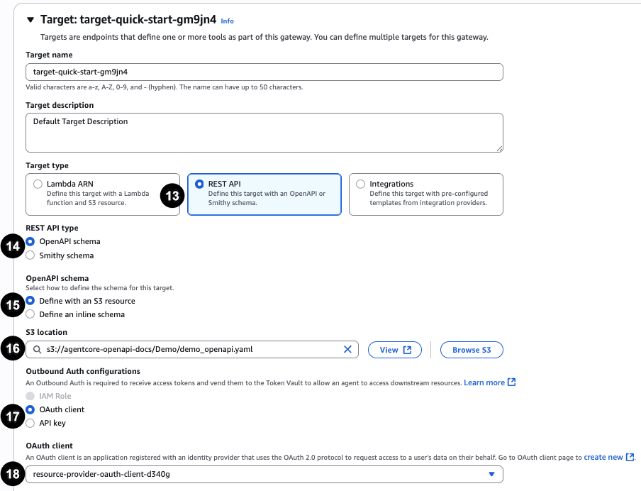
</figure>

19. Under Scopes, add <b>okta.myAccount.read</b>.
20. Click **Save**.
<figure>
    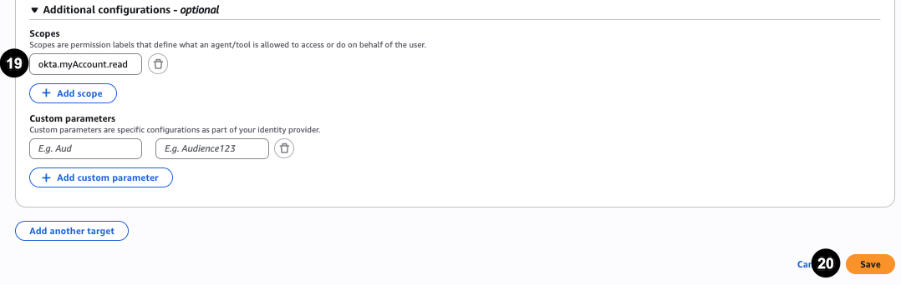
</figure>

 
## Preparing the agent for deployment to AgentCore Runtime

This code defines a **Travel Assistant chatbot** using the Strands framework and Bedrock AgentCore SDK.

It sets up a travel assistant agent that can fetch existing travel plans using customer ID or email via an Amazon Bedrock AgentCore Gateway. The @requires_access_token() decorator handles OAuth 2.0 authentication by automatically managing the process of obtaining and injecting an access token into the decorated function. It configures the authentication flow with Okta using the outbound OAuth client we created in the previous steps, requests the necessary scopes ("okta.myAccount.read"), and when authentication is needed, it prints the authorization URL to the console for the user to visit and authorize the application. Once the user completes the OAuth flow, the decorator automatically injects the obtained access token as a parameter into the need_token_3LO_async function, and stores the token in the token vault to avoid repeated authentication requests.

1. Execute the cell below to save the agent code as **my_agent_mcp.py** onto your local file system.
2. Browse to <b>Amazon AgentCore Gateway</b> > <b>Gateways</b> and click on your gateway (e.g., gateway-quick-start-234a1).
<figure>
    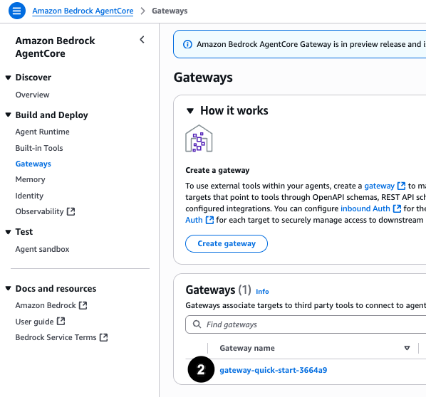
</figure>

3. Locate the file and replace **{yoursubdomain}** for the gateway_url to match the **Gateway resource URL**.
<figure>
    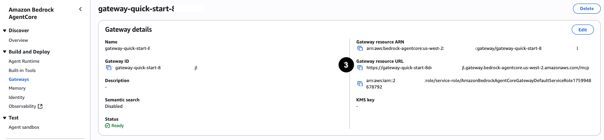
</figure>

4. For the provider_name, replace **{yourprovidername}** with the name of your outbound OAuth client (e.g., resource-provider-oauth-client-1wbak).
5. Save the file.

```python
%%writefile my_agent_mcp.py
import json
import requests
from mcp.client.streamable_http import streamablehttp_client
from strands import Agent, tool
from strands.tools.mcp import MCPClient
from strands_tools import calculator, current_time

# Import the AgentCore SDK
from bedrock_agentcore.runtime import BedrockAgentCoreApp
from bedrock_agentcore.identity.auth import requires_access_token

WELCOME_MESSAGE = """
Welcome to the Travel Assistant! How can I help you today?
"""

SYSTEM_PROMPT = """
You are an helpful travel support assistant.
When provided with a customer email, gather all necessary info and prepare the response.
When asked about existing travel plans, look for it and customize the summary based on the prompt.
Don't mention the customer ID in your reply.
"""

# Global token storage
okta_access_token = None

def create_streamable_http_transport(mcp_url: str, access_token: str):
       return streamablehttp_client(mcp_url, headers={"Authorization": f"Bearer {access_token}"})

# Create an AgentCore app
app = BedrockAgentCoreApp()

async def agent_task(user_message: str) -> None:

    global okta_access_token
    okta_access_token = await need_token_3LO_async(access_token='')
    response = ''

    gateway_url = "https://{yoursubdomain}.gateway.bedrock-agentcore.us-west-2.amazonaws.com/mcp"
    mcp_client = MCPClient(lambda: create_streamable_http_transport(gateway_url , okta_access_token))

    with mcp_client:
        #tools = await get_full_tools_list(mcp_client)
        #print(f"Found the following tools: {[tool.tool_name for tool in tools]}")
    
        agent = Agent(tools=mcp_client.list_tools_sync())
        response = agent(user_message)
        print(response)
    
    return response.message['content'][0]['text']

# Injects Okta Access Token
@requires_access_token(# Uses the same credential provider name created above
    provider_name= "{yourprovidername}",
    # Requires Okta OAuth2 scope to access MCP Server
    scopes= ["okta.myAccount.read"],
    # Sets to OAuth 2.0 Authorization Code flow
    auth_flow= "USER_FEDERATION",
    # Prints authorization URL to console
    on_auth_url= lambda x: print("\nPlease copy and paste this URL in your browser:\n" + x),
    # If false, caches obtained access token
    force_authentication= False,) 
async def need_token_3LO_async(*, access_token: str) -> str:
    """Handle OAuth authentication flow."""
    global okta_access_token
    okta_access_token = access_token
    return access_token


# Specify the entry point function invoking the agent
@app.entrypoint
async def invoke(payload):
    """Handler for agent invocation"""
    user_message = payload.get(
        "prompt", "No prompt found in input, please guide customer to create a json payload with prompt key"
    )

    result = await agent_task(user_message)
    return result

if __name__ == "__main__":
    app.run()
```

For this code to run, the Strands Agents modules need to be installed in the Python environment.

To install dependencies, create and activate a virtual environment:

```python
!python -m venv .venv 
!source .venv/bin/activate
```

Add the Strands Agents modules, AgentCore SDK, and AgentCore starter toolkit to the dependency file and save it as, **requirements.txt**:

```python
%%writefile requirements.txt
strands-agents
strands-agents-tools
bedrock-agentcore
bedrock-agentcore-starter-toolkit
```

Then install all the requirements in the virtual environment:

```python
%pip install -r requirements.txt
```

## Deploying the agent to AgentCore Runtime
The `CreateAgentRuntime` operation supports comprehensive configuration options, letting you specify container images, environment variables and encryption settings. You can also configure protocol settings (HTTP, MCP) and authorization mechanisms to control how your clients communicate with the agent.

Note: Operations best practice is to package code as container and push to ECR using CI/CD pipelines and IaC

In this tutorial can will the Amazon Bedrock AgentCode Python SDK to easily package your artifacts and deploy them to AgentCore runtime.

### Configure agent for AgentCore Runtime deployment
Next we will use our starter toolkit to configure the AgentCore Runtime deployment with an entrypoint, the execution role we just created and a requirements file. We will also configure the starter kit to auto create the Amazon ECR repository on launch.

During the configure step, your docker file will be generated based on your application code

```python
from bedrock_agentcore_starter_toolkit import Runtime
from boto3.session import Session

boto_session = Session()
region = boto_session.region_name

discovery_url = input("Enter your discovery URL: ")

client_id = input("Enter your client ID: ")

audience = input("Enter your audience: ")

agentcore_runtime = Runtime()

response = agentcore_runtime.configure(
    entrypoint="my_agent_mcp.py",
    auto_create_execution_role=True,
    auto_create_ecr=True,
    requirements_file="requirements.txt",
    region=region,
    agent_name="strands_agent_inbound_identity_okta",
    authorizer_configuration={
        "customJWTAuthorizer": {
            "discoveryUrl": discovery_url,
            "allowedClients": [client_id],
            "allowedAudience": [audience],
        }
    },
)
response
```

### Review the AgentCore configuration

```python
!cat .bedrock_agentcore.yaml
```

#### Launching agent to AgentCore Runtime

Now that we've got a docker file, let's launch the agent to the AgentCore Runtime. This will create the Amazon ECR repository and the AgentCore Runtime.

<figure>
    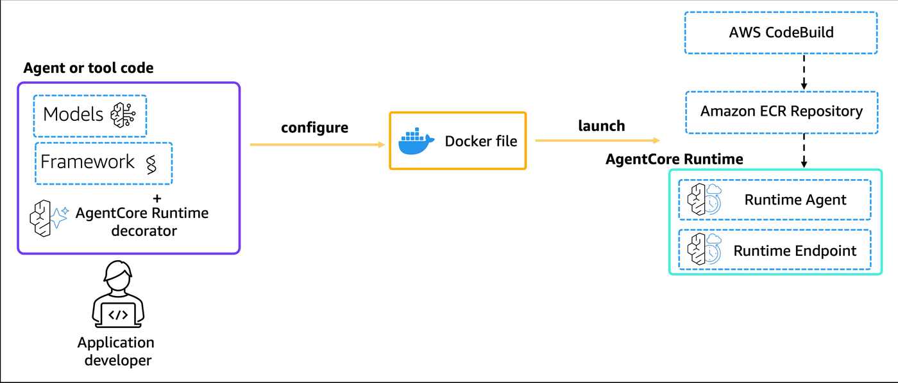
</figure>

```python
launch_result = agentcore_runtime.launch()
launch_result
```

#### Checking for the AgentCore Runtime Status

Now that we've deployed the AgentCore Runtime, let's check for it's deployment status.

```python
status_response = agentcore_runtime.status()
status = status_response.endpoint["status"]
end_status = ["READY", "CREATE_FAILED", "DELETE_FAILED", "UPDATE_FAILED"]
while status not in end_status:
    time.sleep(10)
    status_response = agentcore_runtime.status()
    status = status_response.endpoint["status"]
    print(status)
status
```

### Give the Execution Role Permission to Read OAuth Token

1. Browse to <b>Amazon Bedrock AgentCore<b>.
2. Click on <b>Agent Runtime</b> on the left-hand side menu.
3. Click on your agent (e.g., strands_agent_inbound_identity_okta).
<figure>
    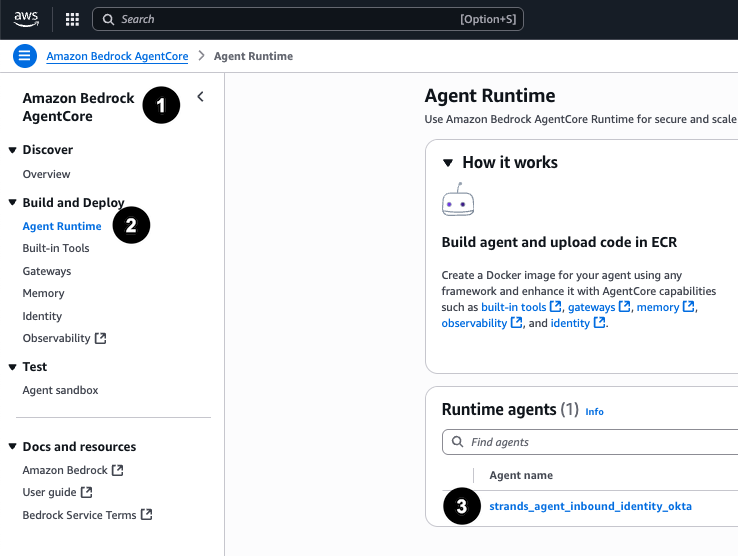
</figure>

4. Click on the latest version.
<figure>
    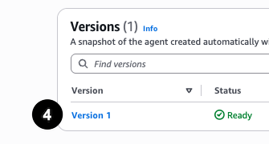
</figure>

5. Click on the <b>IAM service role</b>.
<figure>
    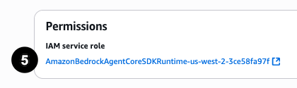
</figure>

6. Click on the <b>Policy name</b> under <b>Permissions policies</b>.
<figure>
    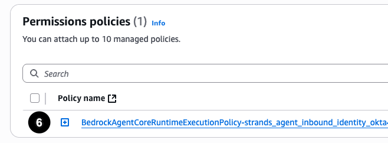
</figure>

7. Add the following statement to give your agent access to the token vault.

		{
			"Sid": "GetResourceOauth2Token",
			"Effect": "Allow",
			"Action": [
				"bedrock-agentcore:GetResourceOauth2Token",
				"secretsmanager:GetSecretValue"
			],
			"Resource": "*"
		}

8. Click <b>Next</b>.
<figure>
    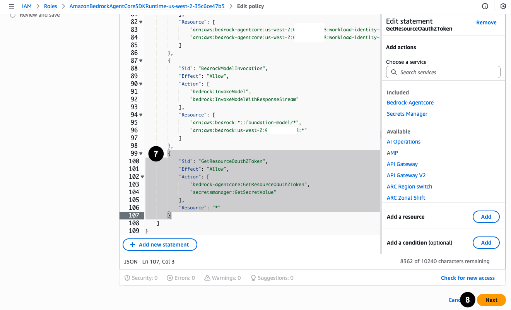
</figure>

### Grant your Agent Amazon Bedrock Model Access
1. Browse to <b>Amazon Bedrock</b> > <b>Model access</b> and click on <b>Modify model access</b>.
<figure>
    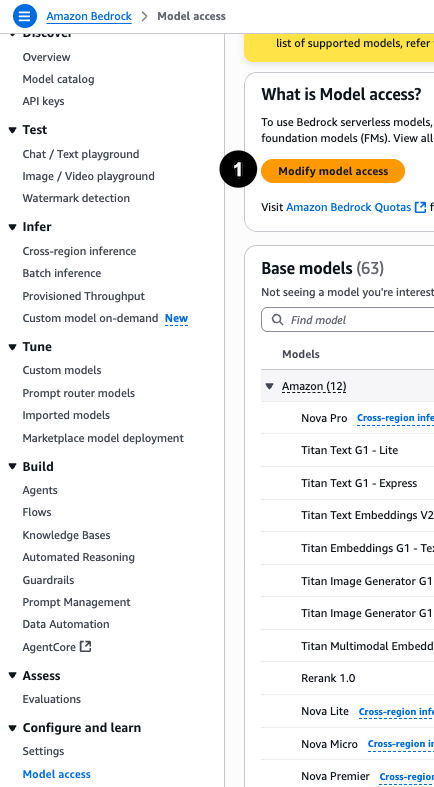
</figure>

2. Check <b>Claude Sonnet 4</b> and click <b>Next</b> (Note: default model used by strands can change). 
<figure>
    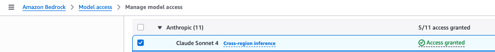
</figure>

#### Invoking AgentCore Runtime without 

Finally, we can invoke our AgentCore Runtime with a payload. Try running the following cell and you will see an error that says **"AccessDeniedException: An error occurred (AccessDeniedException) when calling the InvokeAgentRuntime operation: Agent is configured for a different authorization token type".**

<figure>
    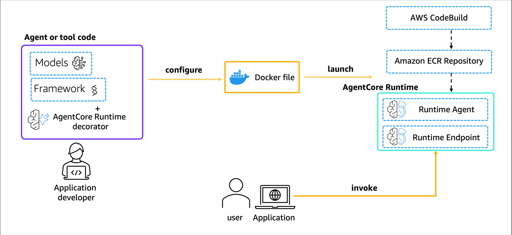
</figure>

```python
invoke_response = agentcore_runtime.invoke({"prompt": "What are the travel plans for customer 123?"})
invoke_response
```

#### Invoking AgentCore Runtime with authorization

Lets invoke the agent with the right authorization token type. In our case, it will be the Okta access token.

The following command installs the **Requests** library from the **Flask** framework needed for the OAuth server in the next step.

```python
%pip install flask requests
```

The following code will stand up a server so that you are able to retrieve the access token. Once started, click the link or browse to http://127.0.0.1:5000 to complete the OAuth flow. After you retrieve the access token, stop the server the same way it was started.

The following code:
1. Creates a small web server with Flask to handle OAuth authentication.
2. When the user visits ```/login```, they are redirected to Okta to log in.
3. After login, the server receives an authorization code via the /callback route.
4. The code is then exchanged for an access token via a POST request to the token endpoint.
5. If successful, the access token is saved in the session and printed to the console.

**Note**: You can find the authorization and token URLs from your discovery URL (https://{yoursubdomain}.okta.com/oauth2/default/.well-known/openid-configuration).

```python
import os
import requests
import secrets
from flask import Flask, redirect, request, session

app = Flask(__name__)
app.secret_key = os.urandom(24)

# === Configuration ===
CLIENT_ID = input("Enter your Client ID: ")
CLIENT_SECRET = input("Enter your Client Secret: ")
AUTHORIZATION_BASE_URL = input("Enter your authorization URL: ")
TOKEN_URL = input("Enter your token URL: ")
REDIRECT_URI = "http://127.0.0.1:5000/callback"
SCOPE = "openid email"  # Adjust according to the provider


# === Step 1: Redirect to Authorization Server ===
@app.route("/")
def home():
    return '<a href="/login">Login with OAuth</a>'


@app.route("/login")
def login():
    state = secrets.token_urlsafe(16)
    session["oauth_state"] = state

    auth_url = (
        f"{AUTHORIZATION_BASE_URL}?response_type=code&client_id={CLIENT_ID}"
        f"&redirect_uri={REDIRECT_URI}&scope={SCOPE}&state={state}"
    )
    return redirect(auth_url)


# === Step 2: Handle Callback and Exchange Code for Token ===
@app.route("/callback")
def callback():
    error = request.args.get("error")
    if error:
        return f"Error: {error}"

    code = request.args.get("code")
    if not code:
        return "No code found"

    token_data = {
        "grant_type": "authorization_code",
        "code": code,
        "redirect_uri": REDIRECT_URI,
        "client_id": CLIENT_ID,
        "client_secret": CLIENT_SECRET,
    }

    token_response = requests.post(TOKEN_URL, data=token_data)
    token_json = token_response.json()

    if "access_token" in token_json:
        session["access_token"] = token_json["access_token"]
        print("Access Token: " + token_json["access_token"])

        return "Login successful! Access token in logs."
    else:
        return f"Failed to get token: {token_json}"


if __name__ == "__main__":
    app.run(host="127.0.0.1", port=5000)
```

Copy the access token and enter it when asked in the next section of code.

```python
bearer_token = input("Enter your bearer token: ")
invoke_response = agentcore_runtime.invoke(
    {"prompt": "What flights does customer with user id user-123 have scheduled?"},
    bearer_token=bearer_token,
)
invoke_response
```

1. In the AWS Console, browse to Amazon Bedrock AgentCore and click on Agent Runtime under Build and Deploy
2. Click on your agent (e.g., my_agent_mcp).
<figure>
    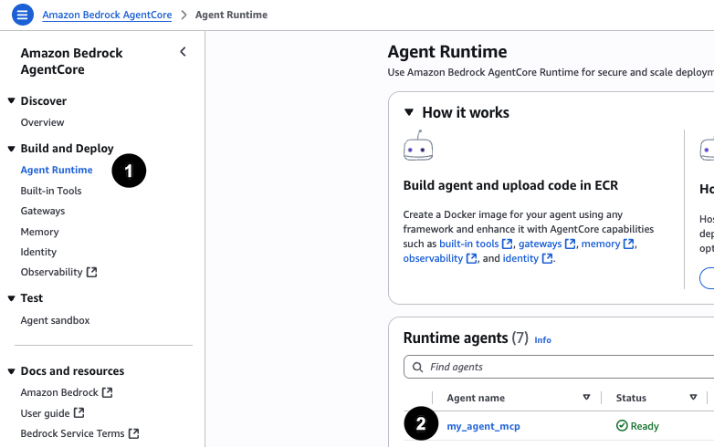
</figure>

3. Copy the **Runtime ID**.
<figure>
    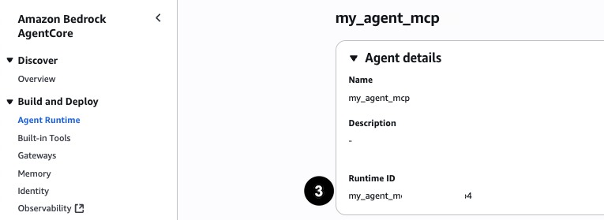
</figure>

4. Run the following command in a terminal to retrieve logs from the agent. Replace **{myagentruntimeid}** with the **Runtime ID** of your agent.

```aws logs tail /aws/bedrock-agentcore/runtimes/{myagentruntimeid} --follow```

5. Capture the authorization request URL and paste it in a browser to complete the OAuth handshake.

<figure>
    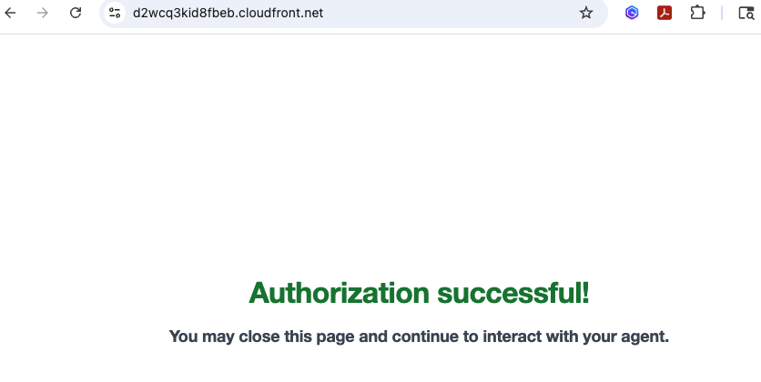
</figure>

## Congratulations!
