## Okta Overview

Okta is a cloud-based identity and access management service that provides secure identity solutions for enterprises, enabling seamless authentication and authorization across applications and services.

Key Features:
* **Single Sign-On (SSO)** - Users authenticate once to access multiple applications
* **Multi-Factor Authentication (MFA)** - Enhanced security through additional verification methods
* **Adaptive Authentication** - Risk-based authentication policies based on user behavior and context
* **Universal Directory** - Centralized user management and profile synchronization
* **API Access Management** - OAuth 2.0 and OpenID Connect support for API security

## Learning Objective
Okta can be used as an identity provider on AgentCore Identity and used to authenticate users and have them authorize the agent to access protected resources on their behalf. In this notebook we will explore the use of Okta for inbound authentication - Authenticate users before they can invoke an agent.

## Authorization Code Flow
The OAuth 2.0 authorization code flow is the recommended approach for web applications to securely authenticate users and obtain access tokens. This flow involves:
1. Redirecting users to Okta for authentication
2. Receiving an authorization code after successful login
3. Exchanging the code for access and refresh tokens
4. Using tokens to access protected resources

This integration pattern allows AgentCore to leverage Okta's robust identity management capabilities while maintaining secure, standards-based authentication for your applications.

## Tutorial Architecture

```
┌──────────┐  1. Credentials  ┌──────────┐  2. JWT Token  ┌──────────┐
│  Client  │ ───────────────► │   Okta   │ ─────────────► │  Client  │
└──────────┘                  └──────────┘                └──────────┘
                                                                 │
                                                                 │ 3. Bearer JWT
                                                                 ▼
┌──────────┐                  ┌──────────┐                ┌──────────┐
│  Client  │ ◄─────────────── │ Bedrock  │ ─────────────► │  Agent   │
└──────────┘  6. Response     │AgentCore │  4. Invoke     └──────────┘
                              └──────────┘                      │
                                    ▲                           │
                                    └─────── 5. Response ───────┘
```

<figure>
    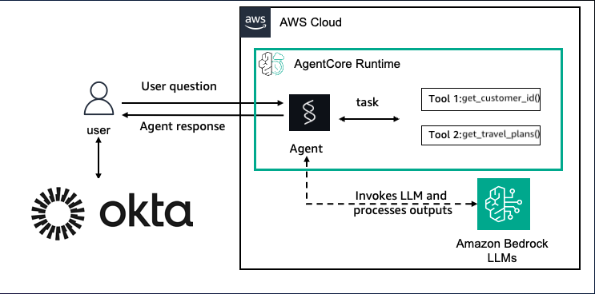
</figure>

## Tutorial Details

| Information         | Details                                                                          |
|:--------------------|:---------------------------------------------------------------------------------|
| Tutorial type       | Conversational                                                                   |
| Agent type          | Single                                                                           |
| Agentic Framework   | Strands Agents                                                                   |
| LLM model           | Anthropic Claude Sonnet 3.5                                                     |
| Tutorial components | Hosting agent on AgentCore Runtime. Using Strands Agent and Amazon Bedrock Model |
| Tutorial vertical   | Cross-vertical                                                                   |
| Example complexity  | Easy                                                                             |
| Inbound Auth        | Okta                                                                             |
| SDK used            | Amazon BedrockAgentCore Python SDK and boto3                                    |

### Key Features

* Hosting Agents on Amazon Bedrock AgentCore Runtime with Inbound Auth using Okta
* Using Amazon Bedrock models
* Using Strands Agents

## Prerequisites

To execute this tutorial you will need:
* Python 3.10+
* IAM rights to create new IAM roles, policies, and users
* IAM rights to create a new AgentCore Agent
* An Okta account
* Amazon Bedrock AgentCore SDK
* Strands Agents
* Docker running

## Learning Objective 1: Setup Okta for use with AgentCore

## Step 1: Setting up Okta's IDP

Before we can configure our AgentCore Runtime with Okta authentication, we need to set up Okta as our Identity Provider. This section will guide you through creating an Okta tenant, configuring an application, and setting up the necessary users and claims.

### 1.1 Create Okta Developer Account

If you don't already have an Okta account, browse to https://developer.okta.com/signup/ and select "Sign up for Integrator Free Plan" to sign up.

### 1.2 Add a Test User

1. Login to your Okta account.
2. Select **Directory**, then **People** and click **Add person**.

   <figure>
       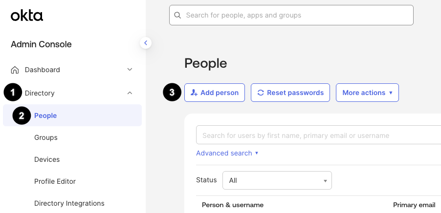
   </figure>

3. Fill in the form:
   - For **Activation**, select **Activate now**.
   - Check **I will set password** and set a password for the user.
   - Uncheck **User must change password on first login**.
   - Click **Save**.

   <figure>
       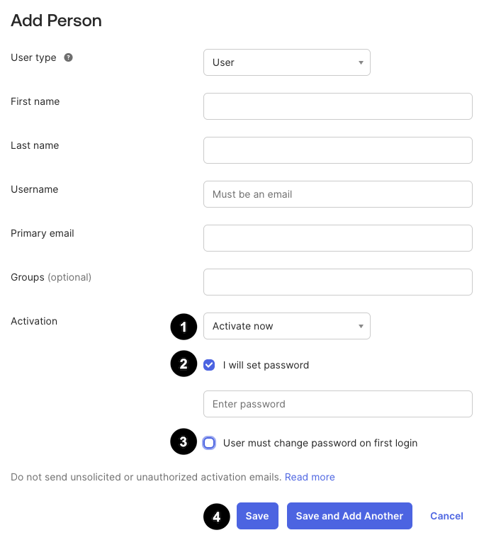
   </figure>

### 1.3 Create Application Integration

4. Select **Applications**, then click **Create App Integration**.

   <figure>
       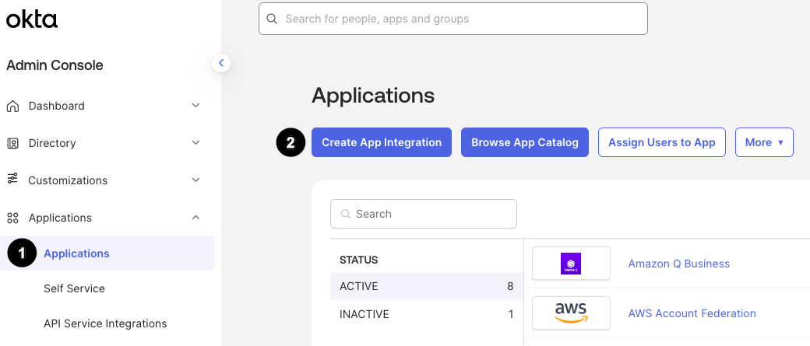
   </figure>

5. For the sign-in method, select **OIDC - OpenID Connect**, then select **Web Application** for the application type.

   <figure>
       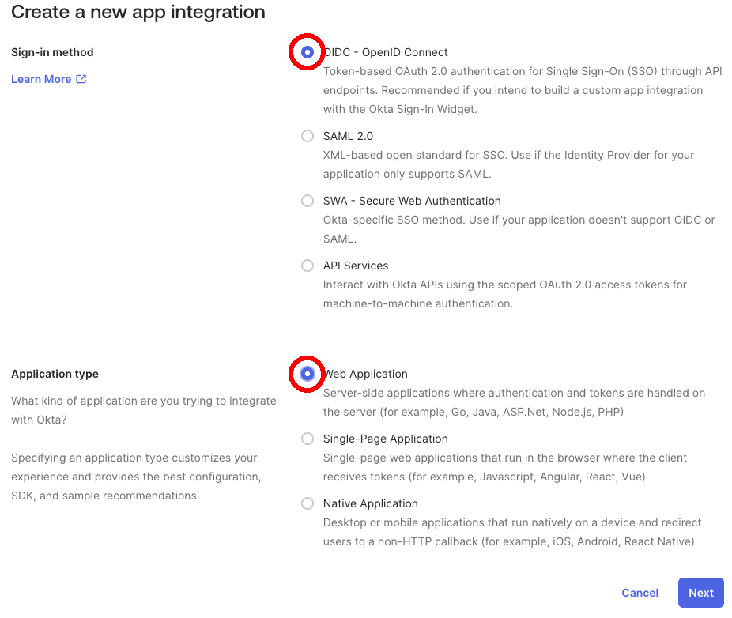
   </figure>

6. Configure the application:
   - For the App integration name enter **AgentCore Inbound Auth**
   - Select **Authorization Code** for the grant type.
   - Use "https://bedrock-agentcore.us-west-2.amazonaws.com/identities/oauth2/callback" or "https://bedrock-agentcore.us-east-1.amazonaws.com/identities/oauth2/callback" as the redirect URL depending on which region you will have your agent running.

   <figure>
       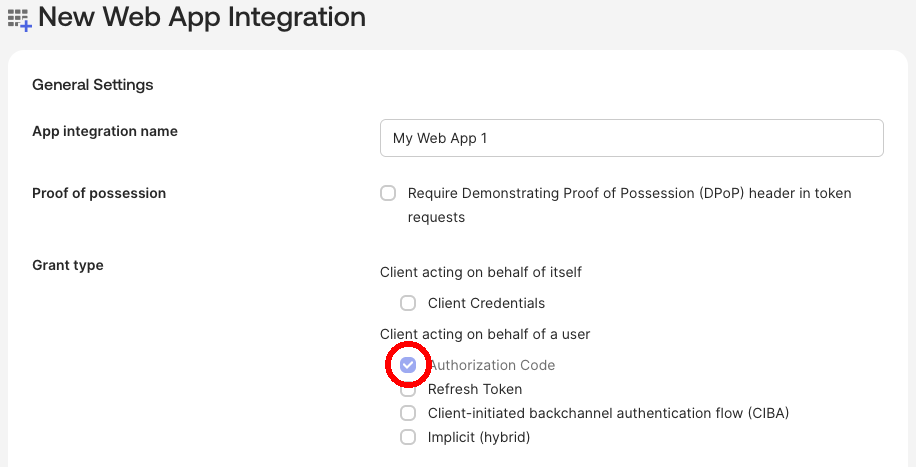
   </figure>

   - Under assignments, select **Allow everyone in your organization to access**, then leave **Enable immediate access** checked. Click **Save**.

   <figure>
       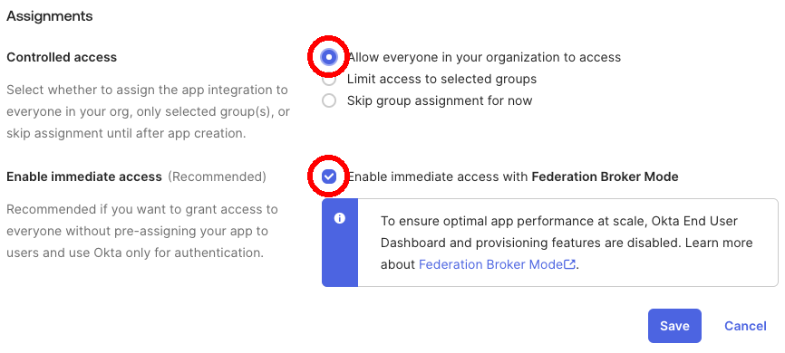
   </figure>

   - Copy the **Client ID** and **Secret** for later use.

   <figure>
       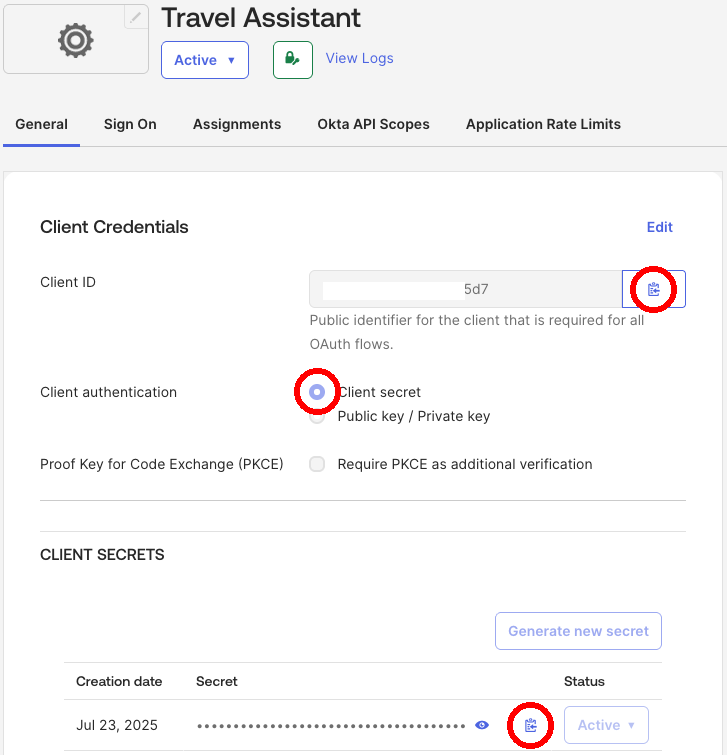
   </figure>

### 1.4 Configure Authorization Server

7. In the left-hand side menu, select **Security**, then **API**, and click the name of your authorization server.

   <figure>
       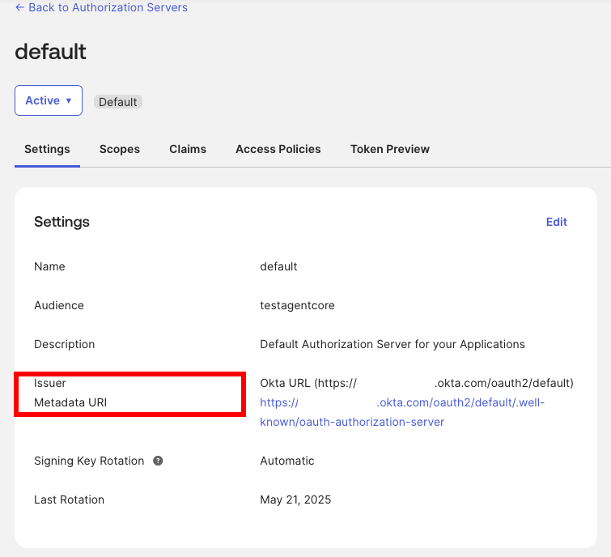
   </figure>

   - Copy the **Audience** and save it for later use.
     > **Note**: The default **Audience** was changed in this example. It is recommended to add a new authorization server if you plan to change the audience so that other apps are not affected.
   
   - Click **Scopes** and add a new scope called **agentcore**.

   <figure>
       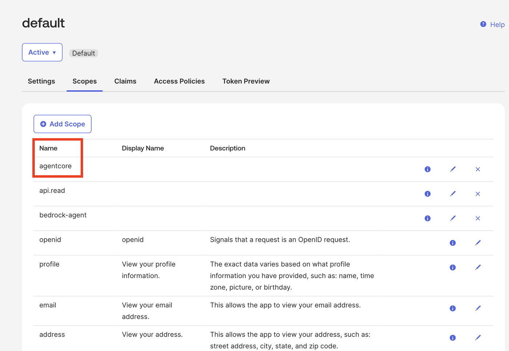
   </figure>

   - Click **Claims** and add the following **client_id** and **scope** claims.

   <figure>
       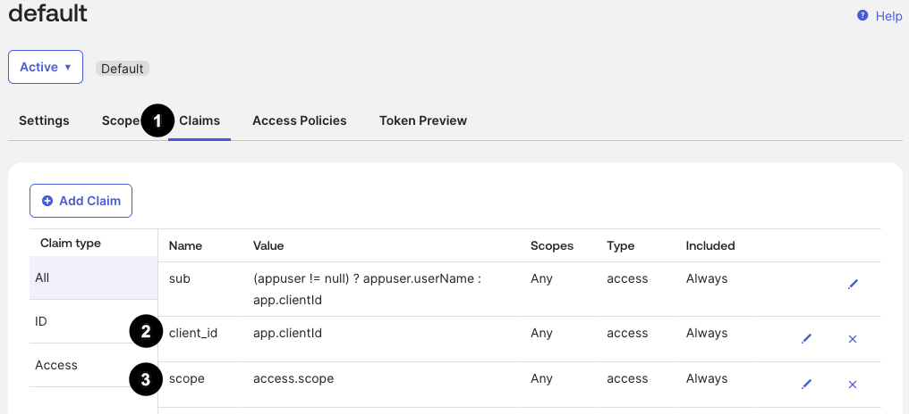
   </figure>

### 1.5 Collect Configuration Values

After completing the Okta setup, you should have the following values:

- **OKTA_CLIENT_ID**: Application's Client ID from General tab
- **OKTA_CLIENT_SECRET**: Application's Client Secret from General tab  
- **OKTA_AUDIENCE**: Audience (e.g., `testagentcore`)
- **OKTA_TOKEN_URL**: Your Okta domain + `/oauth2/default/v1/token`
- **OKTA_DISCOVERY_URL**: Your Okta domain + `/oauth2/default/.well-known/openid-configuration`

Keep these values handy as you'll need them in the next steps.

Note:
1. Okta is not an AWS service. Please refer to Okta documentation for costs related to Okta.
2. Screen prints used in the following steps may change. We encourage you to refer to Okta documentation for latest guidance on setting up Okta application.

## Learning Objective 2 - Setup a simple agent with Okta for inbound authentication

#### Prerequisites
1. Install required packages
2. Import packages
3. Get account ID to use throughout the notebook
4. Set AWS region to "us-west-2". You can use any region that supports Bedrock AgentCore. Refer https://docs.aws.amazon.com/bedrock-agentcore/latest/devguide/agentcore-regions.html

## Step 2: Environment Setup

First, let's set up the development environment and install required dependencies.

```python
# Create and activate virtual environment
!python -m venv .venv
!source .venv/bin/activate
```

For this code to run, the Strands Agents modules need to be installed in the Python environment.

Add the Strands Agents modules, AgentCore SDK, and AgentCore starter toolkit to the dependency file and save it as **requirements.txt**:

```python
%%writefile requirements.txt
strands-agents
strands-agents-tools
bedrock-agentcore
bedrock-agentcore-starter-toolkit
PyJWT
```

```python
# Install required packages from requirements.txt
!pip install --force-reinstall -U -r requirements.txt --quiet
```

```python
# Verify that all required packages are installed correctly
try:
    import bedrock_agentcore
    import strands

    print("✅ All packages installed successfully")
    print("✅ bedrock-agentcore: imported")
    print("✅ strands: imported")
except ImportError as e:
    print(f"❌ Import error: {e}")
    print("Please ensure all packages are installed correctly")
```

## Step 3: Configure Environment Variables


Setting environment variables for some key information we will need throughout this notebook.

```python
# Okta Configuration - Replace with your values
import os

os.environ["OKTA_CLIENT_ID"] = "YOUR_CLIENT_ID_VALUE"
os.environ["OKTA_CLIENT_SECRET"] = "YOUR_CLIENT_SECRET_VALUE"
os.environ["OKTA_AUDIENCE"] = "YOUR_OKTA_AUDIENCE"
os.environ["OKTA_TOKEN_URL"] = "https://your.okta.com/oauth2/default/v1/token"
os.environ["OKTA_DISCOVERY_URL"] = "https://your.okta.com/oauth2/default/.well-known/openid-configuration"
```

## Step 4: Agent Code
Keeping the agent simple since the key learning objective for this notebook is to learn inbound authentication using Okta

```python
%%writefile simple_agent.py
import argparse, json
from strands import Agent, tool
from bedrock_agentcore.runtime import BedrockAgentCoreApp

app = BedrockAgentCoreApp()
agent = Agent()

@app.entrypoint
def invoke(payload):
    """Simple agent function for inbound auth demo"""
    user_message = payload.get("prompt", "Hello! How can I help you today?")
    
    # Get session information if available
    session_id = payload.get("session_id", "no-session")
    
    # Simple response with session awareness
    response = f"Hello! I'm a simple agent with session ID: {session_id}. You asked: {user_message}"
    
    result = agent(response)
    return {"result": result.message}

if __name__ == "__main__":
    app.run()
```

## Step 5: Configure AgentCore Runtime with Okta Authentication

Configure the AgentCore Runtime with Okta OAuth authentication.

```python
import boto3
from bedrock_agentcore_starter_toolkit import Runtime

# Get account ID and region
sts = boto3.client("sts")
account_id = sts.get_caller_identity()["Account"]
region = "us-west-2"

print(f"Account ID: {account_id}")
print(f"Region: {region}")

# Use environment variables
discovery_url = os.getenv("OKTA_DISCOVERY_URL")
client_id = os.getenv("OKTA_CLIENT_ID")
audience = os.getenv("OKTA_AUDIENCE")

print(f"Discovery URL: {discovery_url}")
print(f"Client ID: {client_id[:4]}****{client_id[-4:] if client_id else 'None'}")  # Masked
print(f"Audience: {audience}")

agentcore_runtime = Runtime()

# Try with OAuth configuration
try:
    response = agentcore_runtime.configure(
        entrypoint="simple_agent.py",
        auto_create_execution_role=True,
        auto_create_ecr=True,
        requirements_file="requirements.txt",
        region=region,
        agent_name="okta_inbound_auth_agent",
        authorizer_configuration={
            "customJWTAuthorizer": {
                "discoveryUrl": discovery_url,
                "allowedClients": [client_id],
                "allowedAudience": [audience],
            }
        },
    )
    print("✅ OAuth configuration successful")
except Exception as e:
    print(f"❌ OAuth configuration failed: {e}")

response
```

## Step 6: Launching agent to AgentCore Runtime

Now that we've configured the agent, let's launch it to the AgentCore Runtime.

```python
launch_result = agentcore_runtime.launch()
launch_result
```

## Step 7: Checking for the AgentCore Runtime Status

Monitor the deployment status until the agent is ready.

```python
import time

status_response = agentcore_runtime.status()
status = status_response.endpoint["status"]
end_status = ["READY", "CREATE_FAILED", "DELETE_FAILED", "UPDATE_FAILED"]
while status not in end_status:
    time.sleep(10)
    status_response = agentcore_runtime.status()
    status = status_response.endpoint["status"]
    print(status)
status
```

## Step 8: Save Agent ARN for Testing

Extract and save the Agent ARN for testing purposes.

Extract and save agent ARN for testing purposes

```python
# Extract ARN from launch_result
if hasattr(launch_result, "agent_arn") and launch_result.agent_arn:
    agent_arn = launch_result.agent_arn
    os.environ["AGENT_ARN"] = agent_arn
    print(f"📝 Agent ARN: {agent_arn}")
    print(f"📝 Agent ID: {launch_result.agent_id}")
    print(f"📝 ECR URI: {launch_result.ecr_uri}")
else:
    print("⚠️  Could not extract Agent ARN from launch result")
    print("Launch result:", launch_result)

# Check deployment status
if status == "READY":
    print("✅ Agent deployed successfully and ready for testing!")
elif status in ["CREATE_FAILED", "DELETE_FAILED", "UPDATE_FAILED"]:
    print(f"❌ Agent deployment failed with status: {status}")
else:
    print(f"⚠️  Unexpected status: {status}")
```

## Step 9: Create Test Client

Create a test client to validate the Okta OAuth flow and agent invocation with session support.

```python
import requests
import json
import time
import urllib.parse
import logging
import uuid

# Configure logging
logging.basicConfig(level=logging.INFO, format="%(asctime)s - %(levelname)s - %(message)s")
logger = logging.getLogger(__name__)

# Configuration
client_id = os.getenv("OKTA_CLIENT_ID")
client_secret = os.getenv("OKTA_CLIENT_SECRET")
audience = os.getenv("OKTA_AUDIENCE")
token_url = os.getenv("OKTA_TOKEN_URL")
AGENT_ARN = os.getenv("AGENT_ARN")

print("✅ Configuration loaded successfully")
```

Define function to obtain OAuth access token from Okta

```python
def get_oauth_token():
    """Get OAuth token from Okta"""
    data = {"grant_type": "client_credentials", "scope": "agentcore"}

    logger.info("🔐 Getting OAuth token...")

    response = requests.post(token_url, data=data, auth=(client_id, client_secret))

    response.raise_for_status()
    token_data = response.json()
    logger.info("✅ OAuth token obtained")
    return token_data["access_token"]
```

Define function to invoke agent with authentication and session support

```python
def invoke_agent(access_token, query, session_id=None):
    """Invoke agent with session ID support"""
    escaped_agent_arn = urllib.parse.quote(AGENT_ARN, safe="")
    url = f"https://bedrock-agentcore.{region}.amazonaws.com/runtimes/{escaped_agent_arn}/invocations?qualifier=DEFAULT"

    # Generate session ID if not provided
    if not session_id:
        session_id = f"okta-inbound-session-{int(time.time())}-{uuid.uuid4().hex[:8]}"

    headers = {
        "Authorization": f"Bearer {access_token}",
        "Content-Type": "application/json",
        "X-Amzn-Bedrock-AgentCore-Runtime-Session-Id": session_id,
    }

    payload = {"prompt": query, "session_id": session_id}

    logger.info(f"🚀 Invoking agent with query: {query}")
    logger.info(f"📋 Session ID: {session_id}")

    response = requests.post(url, headers=headers, json=payload, timeout=300)
    response.raise_for_status()

    result = response.json()
    logger.info("✅ Agent response received")
    return result, session_id
```

### Test Unauthenticated Request (Should Fail)

First, let's verify that our agent properly rejects unauthenticated requests:

```python
# Test unauthenticated request - this should fail
print("=" * 50)
print("TEST: Unauthenticated Request (Should Fail)")
print("=" * 50)

try:
    escaped_agent_arn = urllib.parse.quote(AGENT_ARN, safe="")
    url = f"https://bedrock-agentcore.{region}.amazonaws.com/runtimes/{escaped_agent_arn}/invocations?qualifier=DEFAULT"

    headers = {
        "Content-Type": "application/json"
        # Note: No Authorization header
    }

    payload = {"prompt": "Hello without authentication"}

    response = requests.post(url, headers=headers, json=payload, timeout=30)
    print(f"❌ Unexpected success! Status: {response.status_code}")
    print(f"Response: {response.text}")

except requests.exceptions.HTTPError as e:
    print(f"✅ Expected authentication failure: {e.response.status_code}")
    print(f"Error message: {e.response.text}")
except Exception as e:
    print(f"✅ Expected authentication error: {e}")

print("\n🔒 This confirms that authentication is required!")
```

Obtain OAuth access token from Okta for authenticated requests

```python
# Get OAuth token
access_token = get_oauth_token()
print("✅ OAuth token obtained successfully")
```

Test authenticated agent invocation with session ID tracking

```python
# Test 1: Simple query with session ID
print("=" * 50)
print("TEST 1: Simple Query with Session ID")
print("=" * 50)

result1, session_id1 = invoke_agent(
    access_token,
    "Hello can you guide me about AWS security best practices for authentication?",
)
print(f"Session ID used: {session_id1}")
print(json.dumps(result1, indent=2))
```

Test session continuity by reusing the same session ID

```python
# Test 2: Continue conversation with same session ID
print("=" * 50)
print("TEST 2: Continue Conversation with Same Session")
print("=" * 50)

result2, session_id2 = invoke_agent(access_token, "What was my previous question?", session_id1)
print(f"Session ID used: {session_id2}")
print(json.dumps(result2, indent=2))
```

Test scope validation for unauthorized access with wrong scope name

Scopes define what permissions an application has - they provide fine-grained access control for OAuth2 authorization

```python
import jwt


def check_token_scopes(access_token, required_scope="agentcore"):
    """Check if token has required scope"""
    try:
        # Decode token without verification for demo (in production, verify signature)
        decoded = jwt.decode(access_token, options={"verify_signature": False})
        token_scopes = decoded.get("scp", [])

        # Check if token has required scope
        has_access = required_scope in token_scopes

        return {
            "has_access": has_access,
            "token_scopes": token_scopes,
            "required_scope": required_scope,
        }
    except Exception as e:
        return {"error": str(e), "has_access": False}


# Test 3: Scope validation - Negative scenario
print("=" * 50)
print("TEST 3: Scope Validation - Negative Scenario")
print("=" * 50)

# Check for wrong scope name - 'admin' scope would grant administrative privileges
wrong_scope_check = check_token_scopes(access_token, "admin")
print(f"Wrong scope check result: {json.dumps(wrong_scope_check, indent=2)}")

if wrong_scope_check.get("has_access"):
    print("✅ Token has required scope")
else:
    print("❌ Access denied: Token does not have required scope")
    print(f"Token has scopes: {wrong_scope_check['token_scopes']}")
    print(f"Required scope: {wrong_scope_check['required_scope']}")
    print("Agent invocation would be blocked at application level")
```

Test scope validation for authorized access with correct scope name

Scopes enable secure API access by limiting what actions an authenticated application can perform

```python
# Test 4: Scope validation - Positive scenario
print("=" * 50)
print("TEST 4: Scope Validation - Positive Scenario")
print("=" * 50)

# Check for correct scope - 'agentcore' scope grants access to invoke AgentCore agents
scope_check = check_token_scopes(access_token, "agentcore")
print(f"Scope check result: {json.dumps(scope_check, indent=2)}")

if scope_check.get("has_access"):
    print("✅ Token has required scope - proceeding with agent call")
    result4, session_id4 = invoke_agent(access_token, "I have the right scope! Tell me about AWS security.")
    print(f"Agent response: {result4}")
else:
    print("❌ Token lacks required scope - access denied")
```

## Conclusion and Cleanup
In this notebook we learnt how to:
- Setup Okta API and Application to provide OAuth Authorization Code flow
- Create an AgentCore Runtime and Deployed an agent with inbound authentication using Okta
- Got a token and used it to access the protected Agent
- Demonstrated session management and continuity

#### Resource(s) created

```python
# Display the created agent ID
if hasattr(launch_result, "agent_id"):
    print(f"Agent ID: {launch_result.agent_id}")
    print(f"Agent ARN: {launch_result.agent_arn}")
else:
    print("Agent information not available")
```

#### Delete AgentCore Runtime

Clean up the resources created during this tutorial:

```python
# Delete the AgentCore Runtime
try:
    if hasattr(launch_result, "agent_id"):
        agentcore_control_client = boto3.client("bedrock-agentcore-control", region_name=region)
        agentcore_control_client.delete_agent_runtime(agentRuntimeId=launch_result.agent_id)
        print(f"✅ Agent {launch_result.agent_id} deleted successfully")
    else:
        print("⚠️  No agent ID found to delete")
except Exception as e:
    print(f"❌ Error deleting agent: {e}")
    print("You may need to delete the agent manually from the AWS console")
```

## Conclusion

This notebook demonstrated how to:

1. **Setup Okta IDP** - Configure Okta tenant, application, and authorization server
2. **Create Simple Agent** - Build a basic agent with session awareness
3. **Configure OAuth Authentication** - Set up AgentCore Runtime with Okta JWT validation
4. **Deploy with Authentication** - Deploy agent with inbound authentication
5. **Test Authentication Flow** - Verify OAuth token flow and session management

### Key Learnings:

- **Inbound Authentication**: Okta protects agent endpoints, ensuring only authenticated users can invoke agents
- **Session Management**: Agents can access session information for personalized responses
- **JWT Token Validation**: AgentCore automatically validates Okta JWT tokens
- **Security**: Unauthenticated requests are automatically rejected

### Next Steps:

- Implement user-based authentication flows
- Add more sophisticated agent logic with user context
- Explore outbound authentication for accessing external APIs
- Integrate with AgentCore Gateway for additional security layers
