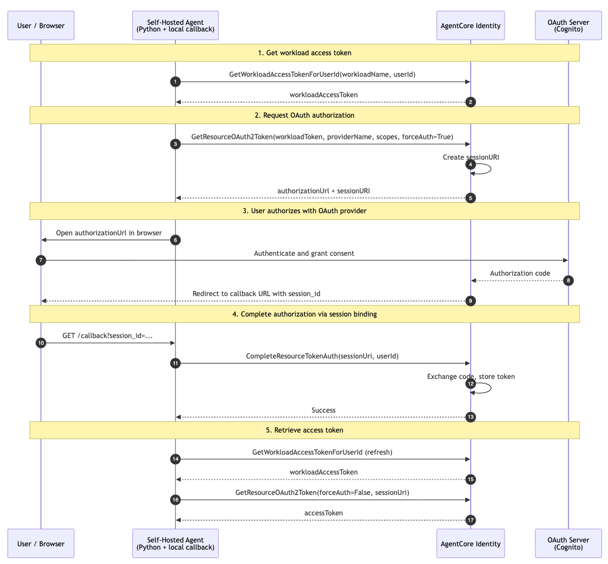

# Self-Hosted Agent with AgentCore Identity OAuth Token Management

This sample demonstrates how to build a self-hosted Python agent that uses [Amazon Bedrock AgentCore Identity](https://docs.aws.amazon.com/bedrock-agentcore/latest/devguide/identity-getting-started.html) to manage OAuth 2.0 token flows. Instead of building OAuth authorization flows, token storage, refresh logic, and secret management yourself, AgentCore Identity handles all of that for you.

## Overview

You'll create a local Python agent that uses AgentCore Identity to obtain an OAuth 2.0 access token on behalf of a user. The agent never touches the OAuth provider directly - AgentCore Identity handles the authorization code exchange, token storage, and refresh behind the scenes.

### Tutorial Details

| Information         | Details                                                                              |
|:--------------------|:-------------------------------------------------------------------------------------|
| Tutorial type       | Step-by-step                                                                         |
| Agent type          | Single (self-hosted)                                                                 |
| Agentic Framework   | None (standalone Python)                                                             |
| Tutorial components | AgentCore Identity, Cognito user pool, local callback server                         |
| Tutorial vertical   | Cross-vertical                                                                       |
| Example complexity  | Beginner                                                                             |
| SDK used            | boto3                                                                                |
| Credential Provider | Type: OAuth2 - Custom provider (Cognito)                                             |

### Key Features

* Outbound Auth with a custom OAuth2 credential provider
* Workload identity and workload token management
* OAuth2 session binding via a local callback server
* No agent framework dependency - pure boto3

## Architecture

<div style="text-align:center">
    
</div>

The OAuth flow between the four components works as follows:

1. The agent requests a **workload access token** from AgentCore Identity, identifying itself and the user.
2. The agent requests an OAuth2 token. Since no cached token exists, AgentCore Identity returns an **authorization URL** and a **session URI**.
3. The agent opens the authorization URL in the user's browser.
4. The user authenticates with the OAuth server (Cognito) and grants consent.
5. The OAuth server redirects the browser to the agent's local callback server (`http://127.0.0.1:8080/callback`) with a `session_id`.
6. The callback handler calls **`CompleteResourceTokenAuth`** to bind the OAuth session to the user.
7. The agent retrieves the **access token** from AgentCore Identity - no OAuth code required.

## Key Concepts

- **Credential provider**: Tells AgentCore Identity how to talk to your OAuth server (discovery URL, client ID/secret).
- **Workload identity**: Represents your agent. AgentCore issues workload tokens that your agent uses to request OAuth tokens.
- **Session binding**: After the user authorizes in the browser, your app calls `completeResourceTokenAuth` to bind the OAuth session to the user - so the agent can retrieve the token.
- **Workload access token**: A short-lived token that identifies both the agent workload and the user it is acting on behalf of.
- **Session URI**: Tracks the authorization flow state across multiple requests during the OAuth2 process.

For more details on session binding, see [OAuth 2.0 authorization URL session binding](https://docs.aws.amazon.com/bedrock-agentcore/latest/devguide/oauth2-authorization-url-session-binding.html).

## Prerequisites

Before you begin, ensure you have:

- An AWS account with appropriate permissions (IAM, Cognito, and Bedrock AgentCore access)
- [Python 3.10+](https://www.python.org/downloads/)
- [AWS CLI](https://docs.aws.amazon.com/cli/latest/userguide/getting-started-install.html) v2 installed
- [`jq`](https://jqlang.github.io/jq/download/) installed

Authenticate with AWS:
```bash
# If you have AWS IAM Identity Center (SSO) configured:
aws sso login

# If you use the AWS console login:
aws login
```

Verify your credentials are working:
```bash
aws sts get-caller-identity
```

Set your region (if not already configured):
```bash
export AWS_REGION="us-east-1"
```

> **Note:** All commands in this guide assume `us-east-1`. Replace with your preferred region if needed.

## Install the SDK and Dependencies

```python
!pip install -r requirements.txt --quiet
```

```python
from boto3.session import Session

boto_session = Session()
region = boto_session.region_name or "us-east-1"

print(f"Region: {region}")

identity_client = boto_session.client("bedrock-agentcore-control", region_name=region)
cognito_client = boto_session.client("cognito-idp", region_name=region)
```

## Step 1: Create a Cognito User Pool

This quickstart requires an OAuth authorization server. If you already have one with a client ID, client secret, and a test user configured, skip to Step 2 and set the `ISSUER_URL`, `CLIENT_ID`, and `CLIENT_SECRET` variables in the next cell.

If you do not have one, run the provided script to create an Amazon Cognito user pool:

> **Note:** The script defaults to `us-east-1`. To use a different region, set `export AWS_REGION="your-region"` before running it.

```python
!bash create_cognito.sh
```

Copy the values printed by the script above and paste them into the cell below:

```python
# Paste the values from the create_cognito.sh output
USER_POOL_ID = ""  # e.g. "us-east-1_aBcDeFgHi"
CLIENT_ID = ""  # e.g. "1a2b3c4d5e6f7g8h9i0j"
CLIENT_SECRET = ""  # e.g. "abcdef123456..."
ISSUER_URL = ""  # e.g. "https://cognito-idp.us-east-1.amazonaws.com/<pool-id>/.well-known/openid-configuration"
COGNITO_USERNAME = ""  # e.g. "AgentCoreTestUser1234"
COGNITO_PASSWORD = ""  # e.g. "xYz...Aa1!"
```

## Step 2: Create a Credential Provider

Credential providers tell AgentCore Identity how to interact with your OAuth authorization server on behalf of your agent.

If you are using your own authorization server, set `ISSUER_URL`, `CLIENT_ID`, and `CLIENT_SECRET` with your values. If you used the Cognito script from Step 1, the values are already set above.

```python
import random
import string

CREDENTIAL_PROVIDER_NAME = "AgentCoreIdentityStandaloneProvider"

try:
    credential_provider_response = identity_client.create_oauth2_credential_provider(
        name=CREDENTIAL_PROVIDER_NAME,
        credentialProviderVendor="CustomOauth2",
        oauth2ProviderConfigInput={
            "customOauth2ProviderConfig": {
                "oauthDiscovery": {"discoveryUrl": ISSUER_URL},
                "clientId": CLIENT_ID,
                "clientSecret": CLIENT_SECRET,
            }
        },
    )
except identity_client.exceptions.ValidationException:
    # Name already taken - append a random suffix
    suffix = "".join(random.choices(string.ascii_lowercase + string.digits, k=5))
    CREDENTIAL_PROVIDER_NAME = f"{CREDENTIAL_PROVIDER_NAME}-tutorial-{suffix}"
    print(f"Name taken, using: {CREDENTIAL_PROVIDER_NAME}")
    credential_provider_response = identity_client.create_oauth2_credential_provider(
        name=CREDENTIAL_PROVIDER_NAME,
        credentialProviderVendor="CustomOauth2",
        oauth2ProviderConfigInput={
            "customOauth2ProviderConfig": {
                "oauthDiscovery": {"discoveryUrl": ISSUER_URL},
                "clientId": CLIENT_ID,
                "clientSecret": CLIENT_SECRET,
            }
        },
    )

oauth2_callback_url = credential_provider_response["callbackUrl"]
print(f"Credential provider '{CREDENTIAL_PROVIDER_NAME}' created ✓")
print(f"OAuth2 Callback URL: {oauth2_callback_url}")
```

Update the Cognito user pool client with the credential provider's callback URL:

```python
cognito_client.update_user_pool_client(
    UserPoolId=USER_POOL_ID,
    ClientId=CLIENT_ID,
    CallbackURLs=[
        f"https://bedrock-agentcore.{region}.amazonaws.com/identities/oauth2/callback",
        oauth2_callback_url,
    ],
    AllowedOAuthFlows=["code"],
    AllowedOAuthScopes=["openid", "profile", "email"],
    AllowedOAuthFlowsUserPoolClient=True,
    SupportedIdentityProviders=["COGNITO"],
)
print("Cognito user pool client updated ✓")
```

## Step 3: Create a Workload Identity

A workload identity tells AgentCore Identity who is requesting tokens. For local development, register `http://127.0.0.1:8080/callback` as the allowed return URL.

```python
WORKLOAD_NAME = "standalone-agent-identity"
CALLBACK_URL = "http://127.0.0.1:8080/callback"

try:
    identity_client.create_workload_identity(name=WORKLOAD_NAME)
    print(f"Workload identity '{WORKLOAD_NAME}' created.")
except identity_client.exceptions.ValidationException:
    # Name already taken - append a random suffix
    suffix = "".join(random.choices(string.ascii_lowercase + string.digits, k=5))
    WORKLOAD_NAME = f"{WORKLOAD_NAME}-tutorial-{suffix}"
    print(f"Name taken, using: {WORKLOAD_NAME}")
    identity_client.create_workload_identity(name=WORKLOAD_NAME)
    print(f"Workload identity '{WORKLOAD_NAME}' created.")

identity_client.update_workload_identity(
    name=WORKLOAD_NAME,
    allowedResourceOauth2ReturnUrls=[CALLBACK_URL],
)
print(f"Workload identity updated with callback URL: {CALLBACK_URL} ✓")
```

## Step 4: Create the Sample Agent

The sample agent ([`agent.py`](agent.py)) contains both the agent and a minimal web application. The agent uses AgentCore Identity to initiate an OAuth 2.0 grant. The web application handles the session binding callback - in production, this would be your user-facing web app (e.g., `https://myagentapp.com`) and your web application would likely be separate from your agent.

For local development, the web app listens on `http://127.0.0.1:8080`.

## Step 5: Run the Agent

Set the required environment variables and run:

```bash
export CREDENTIAL_PROVIDER_NAME="AgentCoreIdentityStandaloneProvider"
export AWS_REGION="us-east-1"
export AGENT_USER_ID="quickstart-user"

python3 agent.py
```

> **Note:** The agent starts a local HTTP server and opens a browser window, so it's best run from a terminal rather than inside this notebook.

## Step 6: Test the OAuth Flow

1. The agent automatically opens the OAuth authorization URL in your default browser.
2. Log in with the Cognito test user credentials (`COGNITO_USERNAME` / `COGNITO_PASSWORD` from Step 1).
3. Your browser redirects to `http://127.0.0.1:8080/callback`. You should see "Authorization Complete!".
4. The agent automatically detects the callback and retrieves the access token.

> **Note:** If your browser doesn't open automatically, copy the URL printed in the terminal and open it manually. If you interrupt the agent without completing authorization, re-run it to get a new authorization URL.

### Expected Output

```
============================================================
  AgentCore Identity - Local Agent
============================================================
[INFO]  App server listening on http://127.0.0.1:8080/callback
[INFO]  Workload identity 'standalone-agent-identity' exists - reusing.

  Opening your browser to authorize...

  https://bedrock-agentcore.us-east-1.amazonaws.com/identities/oauth2/authorize?...

  Waiting for you to complete authorization in the browser...
[INFO]  Session bound for session_id=ZGQxN2ZlYjEtODcy...
[INFO]  Authorization callback received.

============================================================
  Access token retrieved!

  Your agent now has consent to act on behalf of the user.
  AgentCore Identity handled the entire OAuth flow for you -
  no OAuth code required.
============================================================

  Token preview: eyJraWQiOiJxT0x0VGFhcVwiLCJhbGciOiJSUzI1...QuickStart

{
  "sub": "xxxxxxxx-xxxx-xxxx-xxxx-xxxxxxxxxxxx",
  "cognito:username": "AgentCoreTestUser1234",
  "token_use": "access",
  "auth_time": 1234567890,
  "exp": 1234571490
}

[INFO]  Done. The OAuth flow completed successfully.
```

## Clean Up

Run the following to delete all resources created in this tutorial:

```python
# Delete workload identity
identity_client.delete_workload_identity(name=WORKLOAD_NAME)
print("Workload identity deleted ✓")

# Delete credential provider
identity_client.delete_oauth2_credential_provider(name=CREDENTIAL_PROVIDER_NAME)
print("Credential provider deleted ✓")

# Delete Cognito domain first (required before deleting the user pool)
pool_info = cognito_client.describe_user_pool(UserPoolId=USER_POOL_ID)
domain = pool_info["UserPool"].get("Domain", "")
if domain:
    cognito_client.delete_user_pool_domain(UserPoolId=USER_POOL_ID, Domain=domain)
    print(f"Cognito domain '{domain}' deleted ✓")

# Delete Cognito user pool
cognito_client.delete_user_pool(UserPoolId=USER_POOL_ID)
print("Cognito user pool deleted ✓")
```

## Security Best Practices

1. **Never hardcode credentials** in your agent code.
2. **Use `aws sso login` or environment variables** for AWS credentials.
3. **Apply least-privilege IAM policies** scoped to specific resources.
4. **Use a proper TLS certificate** from a trusted CA in production.
5. **Rotate OAuth client secrets** periodically.
6. **Audit access logs** via CloudTrail.
7. **In production**, the application server should validate user sessions before calling `CompleteResourceTokenAuth`.

## Troubleshooting

### `NoCredentialProviders` or `ExpiredToken`
**Cause**: AWS credentials are missing or expired.
**Fix**: Re-run `aws sso login` or `aws login` and try again.

### `ResourceNotFoundException` on workload identity
**Cause**: The workload identity was deleted or never created.
**Fix**: Re-run the Step 3 cell to recreate it.

### Browser shows `error=redirect_mismatch`
**Cause**: The Cognito callback URLs don't include the AgentCore credential provider's callback URL.
**Fix**: Re-run the `update_user_pool_client` cell from Step 2.

### No access token received
**Cause**: You closed the browser before completing authorization.
**Fix**: Re-run `python3 agent.py` to get a fresh authorization URL.

### Port 8080 already in use
**Cause**: Another process is using port 8080.
**Fix**: Either stop that process, or set `export CALLBACK_PORT=9090` and update the workload identity's allowed return URLs to match.

### `InvalidParameterException` on `create-user-pool-domain`
**Cause**: The domain name is already taken.
**Fix**: Re-run the `create_cognito.sh` script - it generates a random suffix each time.
