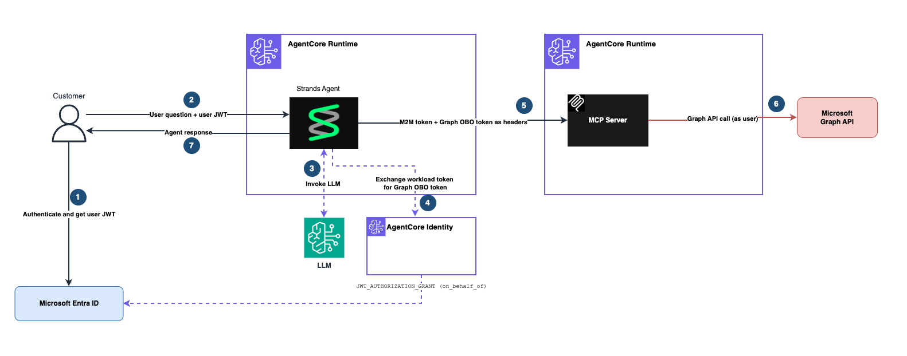

# Microsoft Entra ID On-Behalf-Of (OBO) with Amazon Bedrock AgentCore

This notebook demonstrates the **On-Behalf-Of (OBO) token exchange pattern** for an agent on Amazon Bedrock AgentCore Runtime that calls a downstream resource (Microsoft Graph) through a dedicated MCP server - while preserving the end-user's identity end-to-end.

## Use Case

**Personal-productivity assistant that reads a user's own SaaS data (e.g., Microsoft Graph) on their behalf, without the agent forwarding the raw user JWT across service boundaries.**

*Example: an executive assistant copilot. Alex signs in with her Microsoft account and asks "who am I and what's on my profile?" The agent calls Microsoft Graph as Alex (not a shared service account) so it returns Alex's profile, not someone else's. The agent asks AgentCore Identity to exchange Alex's inbound JWT for a Graph-scoped delegation token and hands that token to the MCP tool to call Graph. Bob running the same prompt would get Bob's profile back.*

**When to pick this pattern:**
- You've built (or plan to build) your own MCP server on AgentCore Runtime.
- The MCP server calls third-party APIs that accept user-delegated OAuth 2.0 tokens (Microsoft Graph, Salesforce, Google, etc.).
- You want the user to consent once at sign-in, not via a mid-conversation authorization URL.
- You want the downstream call to carry both the user's identity and the agent's identity, so the resource server can audit "agent A acting on behalf of user U."

**Not this pattern if:**
- Your MCP server calls internal systems your company owns and you don't need user identity at the tool layer. Pure M2M is simpler.
- You want the tool itself to negotiate user consent via an authorization URL returned in-band. 3LO with USER_FEDERATION fits better.
- You're exposing an existing OpenAPI as tools without writing an MCP server. Use AgentCore Gateway.
- Your IdP doesn't support OAuth 2.0 token exchange. See the compatibility matrix in the Architecture section.

## Microsoft Entra ID Overview

Microsoft Entra ID (formerly Azure Active Directory) is Microsoft's cloud-based identity and access management service. It serves as the central identity provider for Microsoft 365, Azure, and thousands of other SaaS applications.

**Key Features:**
- **Single Sign-On (SSO)** - Users authenticate once to access multiple applications.
- **OAuth 2.0 On-Behalf-Of flow** - Middle-tier services can exchange an inbound user token for a downstream token, preserving the user's identity across service hops.
- **Application Integration** - Supports OAuth 2.0, OpenID Connect, and SAML.

**Note:** Microsoft Entra ID is NOT an AWS service. Please refer to [Microsoft Entra ID documentation](https://learn.microsoft.com/en-us/entra/) for costs and licensing.

## Learning Objectives

1. Understand the difference between **client_credentials (M2M)**, **USER_FEDERATION (3LO)**, and **On-Behalf-Of (OBO)** patterns, and when to pick each.
2. Set up two Entra ID app registrations - an Agent app (middle-tier) and an MCP Server app (protected resource).
3. Create an AgentCore Identity OAuth2 credential provider configured for OBO token exchange.
4. Use `GetResourceOauth2Token(ON_BEHALF_OF_TOKEN_EXCHANGE)` inside the agent to exchange the inbound user JWT for a Graph-scoped delegation token, so the user JWT itself never crosses the agent-to-MCP boundary.
5. Invoke the agent with a user-authenticated JWT and observe the delegation flow end-to-end.

## Tutorial Details

| Information | Details |
|:------------|:--------|
| Tutorial type | Step-by-step |
| Components | Agent on AgentCore Runtime + MCP Server on AgentCore Runtime + Microsoft Graph |
| Agentic Framework | Strands Agents |
| LLM model | Anthropic Claude Sonnet 4.5 |
| Example complexity | Medium |
| SDK used | Amazon Bedrock AgentCore SDK, Bedrock AgentCore Starter Toolkit, boto3, MSAL |
| Inbound Auth | User JWT via Entra ID Device Code Flow |
| Outbound Auth (Agent→MCP) | Entra ID M2M (client_credentials) |
| Outbound Auth (Agent→Graph) | **Entra ID On-Behalf-Of (OBO)** via AgentCore Identity |

## Architecture

The diagram below shows how a user's prompt becomes a Microsoft Graph call made on their behalf. Each numbered step in the diagram is explained in the Flow section that follows.

<div style="text-align:center">
    
</div>

### Flow

1. User authenticates with Microsoft Entra ID (device code flow) and receives a user JWT with `aud = <Agent app client_id>`.
2. User invokes the Agent with `Authorization: Bearer <user_jwt>`. AgentCore Runtime validates the JWT against the Agent app (`customJWTAuthorizer`) and hands the request to the agent.
3. Agent invokes the LLM on Amazon Bedrock with the user's prompt; the LLM decides whether a tool call is needed.
4. Agent calls `GetResourceOauth2Token(oauth2Flow=ON_BEHALF_OF_TOKEN_EXCHANGE)` on AgentCore Identity. AgentCore Identity brokers the OBO exchange with Entra using the Agent app's client credentials, and returns a Graph-scoped delegation token that represents the user with the agent as the acting service.
5. Agent calls the MCP server with two HTTP headers: `Authorization: Bearer <m2m_token>` (identifies the agent to the MCP server's JWT authorizer) and `X-Amzn-Bedrock-AgentCore-Runtime-Custom-Graph-Token: <graph_obo_token>` (carries the user delegation). See **Security considerations** below for the separation-of-concerns mapping. Neither token enters the LLM context.
6. MCP tool reads the Graph OBO token from the request context and calls Microsoft Graph with it as the Bearer credential. Graph validates the token, sees the user identity, and returns the user's data.
7. Response flows back up: MCP → Agent → User.

### Why OBO over simpler patterns

| Pattern | What crosses Agent → MCP | User identity preserved? | Consent UX |
|---|---|---|---|
| Pure M2M | Agent's M2M token only | No, agent acts as itself | None per-request (admin consent once) |
| Forward user JWT | M2M token + inbound user JWT | Yes, but token `aud` does not match MCP | Per-tool authorization URL |
| OBO (this sample) | M2M token + Graph-scoped delegation token | Yes, agent is recorded as acting on the user's behalf | Consent once at sign-in |

### IdP compatibility

This OBO pattern requires an IdP that supports OAuth 2.0 token exchange. At the time of writing:

| IdP | OBO support | AgentCore provider |
|---|---|---|
| Microsoft Entra ID | Supported via Microsoft's OBO flow | `MicrosoftOauth2` (pre-configured) |
| Okta | Supported via OAuth 2.0 Token Exchange | `OktaOauth2` or `CustomOauth2` |
| Auth0 | Supported via Custom Token Exchange | `CustomOauth2` |
| Google OAuth | Not supported for OBO; use domain-wide delegation or Google STS | N/A for OBO |
| Amazon Cognito | Not supported for OBO; use IAM Identity Center Trusted Identity Propagation | N/A for OBO |
| GitHub / Slack / Salesforce / Atlassian / LinkedIn / X | Not wired for OBO in AgentCore today | Use 3LO instead |

See each IdP's documentation for how token exchange works on their platform.

See the [AgentCore OBO devguide](https://docs.aws.amazon.com/bedrock-agentcore/latest/devguide/on-behalf-of-token-exchange.html) for the current provider list and grant-type options.

## Prerequisites

### Entra ID setup

This sample uses **two Entra app registrations**, each with a distinct role in the trust architecture.

**`AgentCore - Agent`** is the middle-tier service.

- Users sign in to this app. Inbound user JWTs have `aud = <AgentCore-Agent client_id>`.
- This app performs OBO token exchange. Entra issues Graph delegation tokens based on this app's client credentials.
- This app calls the MCP server. M2M tokens presented to MCP are audienced to the MCP Server app's client_id.

One app, three responsibilities. Microsoft's OBO documentation explicitly endorses collapsing these roles into a single app (see [*"Use of a single application"*](https://learn.microsoft.com/en-us/entra/identity-platform/v2-oauth2-on-behalf-of-flow#use-of-a-single-application)). Separating the sign-in role from the middle-tier role would break the OBO requirement that the inbound JWT's `aud` match the middle-tier app's client_id and fail with `AADSTS500131`.

**`AgentCore - MCP Server`** is the protected resource.

- Its Application ID URI is the **audience** value the MCP server's `customJWTAuthorizer` validates against.
- Its `mcp_invoke` app role is the **authorization boundary** for which callers are allowed to invoke MCP.
- It has no users, no secrets, and no API permissions of its own.

For a **detailed portal walkthrough** with per-step rationale and a troubleshooting matrix for the common `AADSTS*` errors, see **[ENTRA_SETUP.md](./ENTRA_SETUP.md)**. The checklist below is the quick version.

**On the `AgentCore - Agent` app:**

- **Authentication**: add platform **Mobile and desktop applications**, tick `https://login.microsoftonline.com/common/oauth2/nativeclient`, and set **Allow public client flows** to **Yes**.
- **Certificates & secrets**: create a client secret. Copy the Value immediately - this is `ENTRA_AGENT_CLIENT_SECRET`.
- **Expose an API**: set Application ID URI to `api://<client-id>`, then add a scope named `user_delegation` (Admins and users can consent, State = Enabled).
- **API permissions**: add Microsoft Graph **Delegated** permission `User.Read`, then click **Grant admin consent**.

**On the `AgentCore - MCP Server` app:**

- **Expose an API**: set Application ID URI to `api://<client-id>`. Do not add a scope.
- **App roles**: create an app role with Value `mcp_invoke`, Display name `Invoke MCP Server`, Allowed member types = **Applications**, Enabled.

**Back on the `AgentCore - Agent` app:**

- **API permissions**: add a permission from **APIs my organization uses**, pick `AgentCore - MCP Server`, choose **Application permissions**, tick `mcp_invoke`, click **Grant admin consent**.

### Collect these values

| Variable | Source |
|----------|--------|
| `ENTRA_TENANT_ID` | Entra admin center → Overview → Tenant ID |
| `ENTRA_AGENT_CLIENT_ID` | AgentCore - Agent → Overview → Application (client) ID |
| `ENTRA_AGENT_CLIENT_SECRET` | The secret value copied when created |
| `ENTRA_MCP_CLIENT_ID` | AgentCore - MCP Server → Overview → Application (client) ID |

```python
!pip install -r requirements.txt -q
```

## Step 1: Setup AWS Session and Imports

```python
import uuid
import urllib.parse
import os
import boto3
from boto3.session import Session


boto_session = Session()
sts = boto3.client("sts")
account_id = sts.get_caller_identity().get("Account")
region = boto_session.region_name or "us-west-2"
print(f"Account: {account_id}, Region: {region}")
```

## Step 2: Configure Environment Variables

Replace the placeholder values with your actual Entra ID app registration details.

```python
# Entra ID Tenant
os.environ["ENTRA_TENANT_ID"] = "your-tenant-id"  # Replace

# Agent app - single app that users sign in to AND that performs OBO AND that authenticates
# to the MCP server with M2M. Confidential client with a secret; also has "Allow public
# client flows" enabled so device code flow sign-ins work.
os.environ["ENTRA_AGENT_CLIENT_ID"] = "your-agent-app-client-id"  # Replace
os.environ["ENTRA_AGENT_CLIENT_SECRET"] = "your-agent-app-client-secret"  # Replace

# MCP Server app - the app whose Application ID URI is the audience of the M2M token
# that the agent uses to call the MCP server. Holds no secrets. Exposes the
# mcp_invoke app role that the MCP server's authorizer validates.
os.environ["ENTRA_MCP_CLIENT_ID"] = "your-mcp-audience-client-id"  # Replace
```

## Step 3: Create MCP server code

To keep the MCP server's build artifacts (`Dockerfile`, `.bedrock_agentcore.yaml`) isolated from the agent's, we deploy each from its own subdirectory: `mcp/` for the MCP server and `agent/` for the agent. `requirements.txt` is copied into each subdir so the toolkit's `configure()` picks up the right dependencies when it builds the container.

The MCP server is auth-agnostic at the application layer. It does not manage Token Vault, workload tokens, or authorization URLs. The agent forwards a Graph OBO token in a custom request header and the MCP tool reads it from request context, so tool signatures contain no auth parameters.

The MCP transport is protected by AgentCore's `customJWTAuthorizer` validating the agent's M2M token. That keeps unauthorized callers out of the MCP surface. The agent is responsible for fetching and forwarding whatever Graph token the tool needs for a given invocation - the MCP tools themselves don't handle auth.

```python
%%writefile mcp/mcp_server_obo.py
"""MCP Server that exposes Microsoft Graph tools.

Auth model:
- MCP transport:   authorized via AgentCore customJWTAuthorizer on the MCP Server app's M2M tokens.
- Graph calls:     the agent sends the Graph-scoped OBO token in a custom request header
                   (X-Amzn-Bedrock-AgentCore-Runtime-Custom-Graph-Token). The MCP server reads
                   it from the request context and uses it as the Bearer credential to Microsoft Graph.

Why the Graph token travels via a header, not a tool argument:
- The LLM must never see or handle credentials (RFC 9700 §4.9; OWASP LLM06).
- Tool signatures therefore contain only business-layer parameters.
- The header is TLS-protected in transit and visible only to the agent and the MCP server, both
  within the same trust boundary as the user's inbound JWT.
"""
import httpx
from mcp.server.fastmcp import FastMCP
from typing import Dict, Any

mcp = FastMCP(host='0.0.0.0', stateless_http=True)

GRAPH_BASE = 'https://graph.microsoft.com/v1.0'
# AgentCore only forwards request headers that are explicitly allowlisted on the runtime and
# either named 'Authorization' or prefixed with 'X-Amzn-Bedrock-AgentCore-Runtime-Custom-'.
# The allowlist is set on the MCP runtime in Step 4. See:
# https://docs.aws.amazon.com/bedrock-agentcore/latest/devguide/runtime-header-allowlist.html
GRAPH_TOKEN_HEADER = 'x-amzn-bedrock-agentcore-runtime-custom-graph-token'


def _get_graph_token() -> str:
    """Read the Graph OBO token the agent attached to this request."""
    ctx = mcp.get_context()
    headers = dict(ctx.request_context.request.headers)
    token = headers.get(GRAPH_TOKEN_HEADER, '').strip()
    if not token:
        raise RuntimeError(
            f"Missing Graph OBO token. Expected request header '{GRAPH_TOKEN_HEADER}' "
            "to carry the delegation token. Check that the header is allowlisted on the "
            "MCP runtime's requestHeaderConfiguration."
        )
    return token


@mcp.tool()
async def get_my_profile() -> Dict[str, Any]:
    """Return the signed-in user's Microsoft Graph profile."""
    access_token = _get_graph_token()
    async with httpx.AsyncClient() as client:
        r = await client.get(f'{GRAPH_BASE}/me',
                             headers={'Authorization': f'Bearer {access_token}'})
    if r.status_code != 200:
        return {'error': f'Graph returned {r.status_code}', 'body': r.text}
    p = r.json()
    return {
        'displayName': p.get('displayName'),
        'email': p.get('mail') or p.get('userPrincipalName'),
        'jobTitle': p.get('jobTitle'),
        'id': p.get('id'),
    }


if __name__ == '__main__':
    mcp.run(transport='streamable-http')
```

## Step 4: Deploy MCP server to AgentCore Runtime

The starter toolkit generates `Dockerfile` and `.bedrock_agentcore.yaml` in the current working directory. To keep the MCP and agent artifacts separate, we `os.chdir()` into `mcp/` before configuring and launching. The `finally` block changes back to the original directory so later cells continue to work.

Two runtime configuration pieces matter here:

**1. `authorizerConfiguration` protects the MCP transport.** `customJWTAuthorizer` validates the Agent app's M2M token and enforces that it carries the `mcp_invoke` app role. OBO happens earlier, in the agent. MCP's only job here is to reject unauthorized callers.

**2. `requestHeaderConfiguration` lets the Graph OBO token reach the MCP tools.** AgentCore Runtime strips request headers by default, forwarding only the ones on the runtime's allowlist. Two rules apply ([docs](https://docs.aws.amazon.com/bedrock-agentcore/latest/devguide/runtime-header-allowlist.html)): header names must either be `Authorization` or start with `X-Amzn-Bedrock-AgentCore-Runtime-Custom-`, and the runtime must list them in `requestHeaderAllowlist`. Without the allowlist entry, the MCP container sees the header vanish, tools raise "missing token" errors, and the LLM apologises without being able to call Graph. We allowlist `Authorization` (for the M2M transport token) and `X-Amzn-Bedrock-AgentCore-Runtime-Custom-Graph-Token` (for the Graph delegation token).

```python
from bedrock_agentcore_starter_toolkit import Runtime

# Remember the notebook's root directory so later cells still resolve paths correctly.
NOTEBOOK_DIR = os.getcwd()

mcp_runtime = Runtime()
mcp_discovery_url = (
    f"https://login.microsoftonline.com/{os.environ['ENTRA_TENANT_ID']}/.well-known/openid-configuration"
)
mcp_audience = f"api://{os.environ['ENTRA_MCP_CLIENT_ID']}"

# Header name the agent uses to forward the Graph OBO token. Must start with
# 'X-Amzn-Bedrock-AgentCore-Runtime-Custom-' for AgentCore to allow it through
# (see Step 4 markdown above).
GRAPH_TOKEN_HEADER = "X-Amzn-Bedrock-AgentCore-Runtime-Custom-Graph-Token"

try:
    os.chdir("mcp")  # toolkit writes Dockerfile and .bedrock_agentcore.yaml into the cwd
    mcp_config = mcp_runtime.configure(
        entrypoint="mcp_server_obo.py",
        auto_create_execution_role=True,
        auto_create_ecr=True,
        requirements_file="requirements.txt",
        region=region,
        agent_name="entra_obo_mcp",
        protocol="MCP",
        authorizer_configuration={
            "customJWTAuthorizer": {
                "discoveryUrl": mcp_discovery_url,
                "allowedAudience": [mcp_audience],
                "customClaims": [
                    {
                        "inboundTokenClaimName": "roles",
                        "inboundTokenClaimValueType": "STRING_ARRAY",
                        "authorizingClaimMatchValue": {
                            "claimMatchValue": {"matchValueString": "mcp_invoke"},
                            "claimMatchOperator": "CONTAINS",
                        },
                    }
                ],
            }
        },
        request_header_configuration={
            "requestHeaderAllowlist": [
                "Authorization",
                GRAPH_TOKEN_HEADER,
            ]
        },
    )
finally:
    os.chdir(NOTEBOOK_DIR)
print("MCP Runtime configured")
```

```python
# Deploy MCP server
try:
    os.chdir("mcp")
    mcp_launch = (
        mcp_runtime.launch()
    )  # CodeBuild (no local Docker needed). Use local_build=True if you have Docker/Finch/Podman.
finally:
    os.chdir(NOTEBOOK_DIR)
print(f"MCP Server deployed: {mcp_launch.agent_id}")
```

## Step 5: Create Credential Provider

Create a single `MicrosoftOauth2` credential provider backed by the Agent app's clientId/secret. We'll reuse this **same provider** for two different OAuth flows at runtime:

- `oauth2Flow=M2M` → client_credentials grant, used by the agent to get an M2M token for authorizing the MCP transport.
- `oauth2Flow=ON_BEHALF_OF_TOKEN_EXCHANGE` → OBO exchange, used by the agent to get a Graph-scoped delegation token on behalf of the user.

One provider handles both because `get_resource_oauth2_token` takes the flow as a per-call parameter; the provider itself just stores the client credentials and vendor config.

The `MicrosoftOauth2` vendor comes with OBO support pre-wired - see the [AgentCore OBO devguide](https://docs.aws.amazon.com/bedrock-agentcore/latest/devguide/on-behalf-of-token-exchange.html) for the grant-type mode it uses by default.

```python
agentcore_control = boto3.client("bedrock-agentcore-control", region_name=region)

CREDENTIAL_PROVIDER_NAME = "entra-agent-provider"

try:
    cp_response = agentcore_control.create_oauth2_credential_provider(
        name=CREDENTIAL_PROVIDER_NAME,
        credentialProviderVendor="MicrosoftOauth2",
        oauth2ProviderConfigInput={
            "microsoftOauth2ProviderConfig": {
                "clientId": os.environ["ENTRA_AGENT_CLIENT_ID"],
                "clientSecret": os.environ["ENTRA_AGENT_CLIENT_SECRET"],
                "tenantId": os.environ["ENTRA_TENANT_ID"],
            }
        },
    )
    credential_provider_arn = cp_response["credentialProviderArn"]
    print(f"Created credential provider: {credential_provider_arn}")
except agentcore_control.exceptions.ConflictException:
    print("Credential provider already exists, reusing it")
    cp_response = agentcore_control.get_oauth2_credential_provider(name=CREDENTIAL_PROVIDER_NAME)
    credential_provider_arn = cp_response["credentialProviderArn"]
    print(f"Using existing: {credential_provider_arn}")
```

## Step 6: Create agent code

The agent runs from its own `agent/` subdirectory so its `Dockerfile` and `.bedrock_agentcore.yaml` don't collide with the MCP's.

Internally the agent does the following on each invocation (this is the system-flow step 3 to 5 from the Architecture section, zoomed in):

- Receives a user JWT via the `Authorization: Bearer …` header on the inbound request.
- Reads the workload access token from `BedrockAgentCoreContext`. AgentCore Runtime automatically derives this from the inbound JWT and makes it available to the agent. This is the "user subject" input to the OBO exchange.
- Calls `GetResourceOauth2Token(oauth2Flow=ON_BEHALF_OF_TOKEN_EXCHANGE)` on AgentCore Identity with the workload token and the Graph scopes it needs. AgentCore Identity brokers the OBO call with Entra and returns a Graph-scoped delegation token.
- Obtains an M2M token (via the `@requires_access_token` decorator with `auth_flow='M2M'`) for authorizing the MCP transport.
- Calls the MCP server with two HTTP headers: the M2M token in `Authorization`, and the Graph OBO token in `X-Amzn-Bedrock-AgentCore-Runtime-Custom-Graph-Token`. Both headers are allowlisted on the MCP runtime (Step 4); without that, AgentCore strips them before forwarding to the container. Tool arguments contain no auth data. The LLM never sees any token.

> **Note on `@requires_access_token`**: the Bedrock AgentCore SDK decorator does not yet have an `auth_flow="OBO"` mode, so we call `GetResourceOauth2Token` directly via boto3. See the [OBO devguide](https://docs.aws.amazon.com/bedrock-agentcore/latest/devguide/on-behalf-of-token-exchange.html).

```python
# Compute MCP URL for the agent to call
escaped_mcp_arn = urllib.parse.quote(mcp_launch.agent_arn, safe="")
mcp_url = f"https://bedrock-agentcore.{region}.amazonaws.com/runtimes/{escaped_mcp_arn}/invocations?qualifier=DEFAULT"
print(f"MCP URL: {mcp_url}")
```

```python
%%writefile agent/agent_obo.py
"""Agent that performs Entra ID OBO token exchange to call Microsoft Graph via an MCP tool."""
import os
import boto3
from strands import Agent
from strands.models import BedrockModel
from strands.tools.mcp import MCPClient
from mcp.client.streamable_http import streamablehttp_client
from bedrock_agentcore.runtime import BedrockAgentCoreApp, BedrockAgentCoreContext
from bedrock_agentcore.identity.auth import requires_access_token

app = BedrockAgentCoreApp()

MCP_URL = os.environ['MCP_URL']
MCP_CLIENT_ID = os.environ['ENTRA_MCP_CLIENT_ID']
CREDENTIAL_PROVIDER_NAME = os.environ.get('CREDENTIAL_PROVIDER_NAME', 'entra-agent-provider')
REGION = os.environ.get('AWS_REGION', 'us-west-2')

# Must match the header name allowlisted on the MCP runtime (Step 4).
# AgentCore Runtime only forwards headers whose names start with
# 'X-Amzn-Bedrock-AgentCore-Runtime-Custom-' AND are in the runtime's requestHeaderAllowlist.
GRAPH_TOKEN_HEADER = 'X-Amzn-Bedrock-AgentCore-Runtime-Custom-Graph-Token'

# Graph scopes we request in the OBO exchange. These must be delegated permissions
# granted to the Agent app in Entra (and admin-consented).
GRAPH_SCOPES = ['User.Read']

bedrock_model = BedrockModel(
    model_id='us.anthropic.claude-sonnet-4-5-20250929-v1:0',
    temperature=0.1,
)


def exchange_for_graph_token() -> str:
    """Exchange the inbound user JWT for a Graph-scoped OBO delegation token.

    Uses the workload access token populated on BedrockAgentCoreContext by the runtime,
    then calls GetResourceOauth2Token with oauth2Flow=ON_BEHALF_OF_TOKEN_EXCHANGE.
    The returned token has aud=Microsoft Graph and carries sub=user. Microsoft records the
    acting middle-tier service in the xms_act.sub claim.

    See: https://docs.aws.amazon.com/bedrock-agentcore/latest/devguide/on-behalf-of-token-exchange.html
    """
    workload_token = BedrockAgentCoreContext.get_workload_access_token()
    if not workload_token:
        raise RuntimeError("No workload access token on context; did Runtime deliver it?")

    client = boto3.client('bedrock-agentcore', region_name=REGION)
    response = client.get_resource_oauth2_token(
        workloadIdentityToken=workload_token,
        resourceCredentialProviderName=CREDENTIAL_PROVIDER_NAME,
        scopes=GRAPH_SCOPES,
        oauth2Flow='ON_BEHALF_OF_TOKEN_EXCHANGE',
    )
    return response['accessToken']


# The @requires_access_token decorator fetches an M2M token (client_credentials grant)
# for the MCP transport. Same credential provider is used for both flows.
@requires_access_token(
    provider_name='entra-agent-provider',
    scopes=[f'api://{MCP_CLIENT_ID}/.default'],
    auth_flow='M2M',
    into='m2m_token',
)
def invoke_agent(prompt: str, *, m2m_token: str) -> str:
    """invoke_agent with two tokens:
    - M2M token in the Authorization header (identifies the agent, authorizes transport).
    - Graph OBO token in a custom request header (used by MCP tools as the Bearer credential
      when calling Microsoft Graph).

    The LLM never sees either token. Tool signatures expose no auth parameters.
    """
    # 1. OBO exchange: user JWT -> Graph-scoped delegation token.
    graph_token = exchange_for_graph_token()

    # 2. Both tokens travel as HTTP headers. Neither reaches the LLM context.
    headers = {
        'authorization': f'Bearer {m2m_token}',
        GRAPH_TOKEN_HEADER: graph_token,
    }
    mcp_client = MCPClient(lambda: streamablehttp_client(MCP_URL, headers))

    with mcp_client:
        tools = mcp_client.list_tools_sync()
        agent = Agent(
            model=bedrock_model,
            tools=tools,
            system_prompt="You are a helpful assistant. Use the available tools to answer user questions.",
        )
        return str(agent(prompt))


@app.entrypoint
def handler(payload, context):
    prompt = payload.get('prompt', 'hello')
    return invoke_agent(prompt)


if __name__ == '__main__':
    app.run()
```

## Step 7: Deploy agent to AgentCore Runtime

Same pattern as the MCP deploy: `os.chdir('agent')` before configuring and launching, then change back.

The agent's authorizer accepts JWTs whose audience is the Agent app's client ID. We use the bare-GUID scope `<AGENT_CLIENT_ID>/.default` (not `api://<AGENT_CLIENT_ID>/.default`) at sign-in because Entra requires the bare-GUID form when an app requests a token for itself (error `AADSTS90009` otherwise). The resulting token has `aud = <AGENT_CLIENT_ID>`, which is what the authorizer matches. See [ENTRA_SETUP.md](./ENTRA_SETUP.md) for the full set of `AADSTS*` errors and their fixes.

```python
agent_runtime = Runtime()
agent_discovery_url = (
    f"https://login.microsoftonline.com/{os.environ['ENTRA_TENANT_ID']}/.well-known/openid-configuration"
)

try:
    os.chdir("agent")
    agent_config = agent_runtime.configure(
        entrypoint="agent_obo.py",
        auto_create_execution_role=True,
        auto_create_ecr=True,
        requirements_file="requirements.txt",
        region=region,
        agent_name="entra_obo_agent",
        authorizer_configuration={
            "customJWTAuthorizer": {
                "discoveryUrl": agent_discovery_url,
                "allowedAudience": [os.environ["ENTRA_AGENT_CLIENT_ID"]],
            }
        },
    )
finally:
    os.chdir(NOTEBOOK_DIR)
print("Agent configured")
```

```python
try:
    os.chdir("agent")
    agent_launch = agent_runtime.launch(  # CodeBuild (no local Docker needed). Add local_build=True if you have Docker/Finch/Podman.
        env_vars={
            "MCP_URL": mcp_url,
            "ENTRA_MCP_CLIENT_ID": os.environ["ENTRA_MCP_CLIENT_ID"],
            "CREDENTIAL_PROVIDER_NAME": CREDENTIAL_PROVIDER_NAME,
        }
    )
finally:
    os.chdir(NOTEBOOK_DIR)
print(f"Agent deployed: {agent_launch.agent_id}")
```

## Step 8: Get User Token via MSAL Device Code Flow

Sign in as a real Entra user so the OBO exchange has a real user JWT to act on behalf of.

The sign-in uses the bare-GUID `.default` scope on the Agent app. Entra resolves `.default` to every permission the Agent app has been granted (here: `user_delegation` on itself plus `User.Read` on Microsoft Graph) and shows a single consent prompt covering all of them. Because we admin-consented during setup, most users see no prompt at all. Later OBO exchanges reuse this consent silently.

See [ENTRA_SETUP.md](./ENTRA_SETUP.md) for the portal steps that make this work, and the troubleshooting matrix at the end if the sign-in fails.

```python
import msal
import webbrowser

authority = f"https://login.microsoftonline.com/{os.environ['ENTRA_TENANT_ID']}"
scopes = [f"{os.environ['ENTRA_AGENT_CLIENT_ID']}/.default"]

msal_app = msal.PublicClientApplication(
    client_id=os.environ["ENTRA_AGENT_CLIENT_ID"],
    authority=authority,
)

result = msal_app.acquire_token_silent(scopes, account=None)

if not result:
    flow = msal_app.initiate_device_flow(scopes=scopes)
    if "error" in flow:
        print(f"Error: {flow.get('error_description')}")
    else:
        print("=" * 50)
        print(f"Go to: {flow['verification_uri']}")
        print(f"Enter code: {flow['user_code']}")
        print("=" * 50)
        webbrowser.open(flow["verification_uri"])
        result = msal_app.acquire_token_by_device_flow(flow)

if result and "access_token" in result:
    bearer_token = result["access_token"]
    print(f"\nBearer Token Received: {bearer_token[:50]}...")
else:
    print(f"Error: {result.get('error_description') if result else 'No result'}")
```

## Step 9: Invoke the Agent

```python
import requests
import json

escaped_agent_arn = urllib.parse.quote(agent_launch.agent_arn, safe="")
agent_url = (
    f"https://bedrock-agentcore.{region}.amazonaws.com/runtimes/{escaped_agent_arn}/invocations?qualifier=DEFAULT"
)

session_id = str(uuid.uuid4())
headers = {
    "Authorization": f"Bearer {bearer_token}",
    "Content-Type": "application/json",
    "X-Amzn-Bedrock-AgentCore-Runtime-Session-Id": session_id,
}

print(f"Invoking agent at: {agent_url[:80]}...")
response = requests.post(
    agent_url,
    data=json.dumps({"prompt": "What's my display name and email address?"}),
    headers=headers,
)
print(f"Status: {response.status_code}")
print(response.text)
```

## Cleanup

```python
agentcore_control.delete_agent_runtime(agentRuntimeId=agent_launch.agent_id)
print(f"Deleted agent: {agent_launch.agent_id}")

agentcore_control.delete_agent_runtime(agentRuntimeId=mcp_launch.agent_id)
print(f"Deleted MCP server: {mcp_launch.agent_id}")

agentcore_control.delete_oauth2_credential_provider(name=CREDENTIAL_PROVIDER_NAME)
print(f"Deleted credential provider: {CREDENTIAL_PROVIDER_NAME}")
```

## Security considerations

Three tokens move through this sample. Only the Graph OBO token crosses the agent → MCP boundary, and it is audience-restricted to Microsoft Graph and scoped to `User.Read`.

| Token | `aud` | Where it travels |
|---|---|---|
| User JWT | Agent app | user → agent `Authorization` header |
| M2M token | MCP Server app | agent → MCP `Authorization` header |
| Graph OBO token | Microsoft Graph | agent → MCP `X-Amzn-Bedrock-AgentCore-Runtime-Custom-Graph-Token` header, then MCP → Graph `Authorization` header |

No token appears in prompts, tool signatures, tool arguments, or tool return values. The MCP tool reads the Graph token directly from the request context. This follows [Microsoft's OBO guidance](https://learn.microsoft.com/en-us/entra/identity-platform/v2-oauth2-on-behalf-of-flow) that the delegation token is sent only toward its intended audience.

### Separation of concerns at each hop

```
Agent → MCP Server:
    Authorization: Bearer <M2M token>                          # authenticates the agent
    X-Amzn-Bedrock-AgentCore-Runtime-Custom-Graph-Token: <OBO token> # carries user delegation

MCP Server → Graph API:
    Authorization: Bearer <OBO token>                          # acts as user
```

The MCP server validates the M2M token to decide "do I trust this caller," then extracts the OBO token from the custom header and forwards it to Graph. The user delegation (`sub = user`, `xms_act.sub = agent`) travels on the OBO token only.

## Conclusion

You've deployed an agent that performs Microsoft Entra ID On-Behalf-Of token exchange via AgentCore Identity and calls Microsoft Graph from a tool on a separate AgentCore Runtime MCP server. The user JWT stayed on the agent. What crossed the agent to MCP boundary was a Graph-scoped delegation token that carries the user's identity and records the agent as the acting service.
