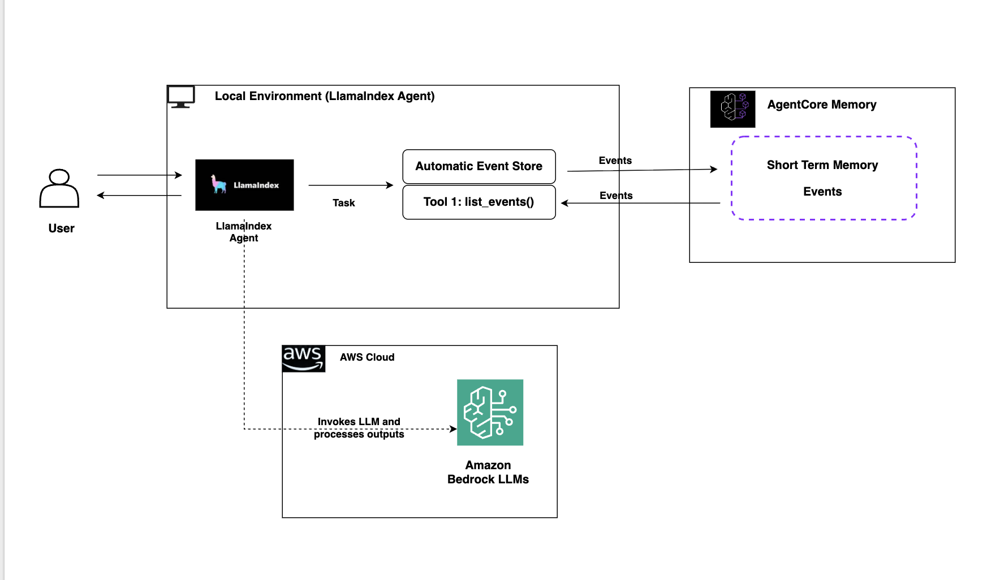

# LlamaIndex with AgentCore Memory - Academic Research Assistant (Short-term Memory)

## Introduction

This notebook demonstrates how to integrate Amazon Bedrock AgentCore Memory capabilities with LlamaIndex to create an Academic Research Assistant. We'll focus on **short-term memory** persistence within a single research session - allowing the assistant to remember papers, findings, and research context throughout a conversation.

## Tutorial Details

| Information         | Details                                                                          |
|:--------------------|:---------------------------------------------------------------------------------|
| Tutorial type       | Short-term Conversational Memory                                                |
| Agent usecase       | Academic Research Assistant                                                      |
| Agentic Framework   | LlamaIndex                                                                       |
| LLM model           | Anthropic Claude 3.7 Sonnet                                                  |
| Tutorial components | AgentCore Short-term Memory, LlamaIndex Agent, Research Tools                   |
| Example complexity  | Beginner                                                                         |

You'll learn to:
- Create AgentCore Memory for research data persistence
- Use LlamaIndex native memory integration
- Build research-specific tools for paper analysis
- Maintain research context within a single session
- Test memory boundaries and session isolation

## Scenario Context

In this example, we'll create an "Academic Research Assistant" that helps researchers track papers, findings, and research topics within a single research session. The assistant uses AgentCore Memory to maintain context about papers reviewed, key findings discovered, and research progress throughout the conversation.

## Architecture Overview



## Prerequisites

- Python 3.10+
- AWS account with appropriate permissions
- AWS IAM role with AgentCore Memory permissions:
  - `bedrock-agentcore:CreateMemory`
  - `bedrock-agentcore:CreateEvent`
  - `bedrock-agentcore:ListEvents`
  - `bedrock-agentcore:RetrieveMemories`
- Access to Amazon Bedrock models

## Step 1: Install Dependencies and Setup

```python
# Install necessary libraries
%pip install llama-index-memory-bedrock-agentcore llama-index-llms-bedrock-converse boto3
```

```python
# Import required components
from bedrock_agentcore.memory import MemoryClient
from llama_index.memory.bedrock_agentcore import AgentCoreMemory, AgentCoreMemoryContext
from llama_index.llms.bedrock_converse import BedrockConverse
from llama_index.core.agent.workflow import FunctionAgent
from llama_index.core.tools import FunctionTool
from datetime import datetime
import os
```

## Step 2: AgentCore Memory Configuration

Create or get the AgentCore Memory resource for our research assistant:

```python
# Create AgentCore Memory resource
region = os.getenv("AWS_REGION", "us-east-1")
client = MemoryClient(region_name=region)

try:
    response = client.create_memory_and_wait(
        name=f"AcademicResearchShortTerm_{int(datetime.now().timestamp())}",
        description="Academic research assistant short-term memory for single session context",
        strategies=[],
        event_expiry_days=7,
        max_wait=300,
        poll_interval=10,
    )
    memory_id = response["id"]
    print(f"✅ Created AgentCore Memory: {memory_id}")
except Exception as e:
    print(f"❌ Error creating memory: {e}")
    memory_id = "your-memory-id-here"  # Replace with existing memory ID
```

## Step 3: Research Tools Implementation

Define specialized tools for academic research tasks:

```python
def save_paper_summary(title: str, authors: str, key_findings: str) -> str:
    """Save a research paper summary with title, authors, and key findings"""
    print(f"📄 Saved paper: {title} by {authors}")
    return f"Successfully saved paper summary for '{title}'"


def track_research_topic(topic: str, status: str) -> str:
    """Track research topic progress with current status"""
    print(f"🔬 Tracking research topic: {topic} (Status: {status})")
    return f"Now tracking research topic: {topic} with status {status}"


def save_research_finding(finding: str, confidence: str) -> str:
    """Save a research finding with confidence level"""
    print(f"💡 Research finding saved with {confidence} confidence")
    return f"Saved research finding with {confidence} confidence level"


# Create tool objects for the agent
research_tools = [
    FunctionTool.from_defaults(fn=save_paper_summary),
    FunctionTool.from_defaults(fn=track_research_topic),
    FunctionTool.from_defaults(fn=save_research_finding),
]
```

## Step 4: LlamaIndex Agent Implementation

Create the research assistant agent with short-term memory context:

```python
# Configuration for SHORT-TERM memory (single session)
MODEL_ID = "us.anthropic.claude-3-7-sonnet-20250219-v1:0"

# Create memory context for single session
context = AgentCoreMemoryContext(
    actor_id="academic-researcher",
    memory_id=memory_id,
    session_id="research-session-today",  # Same session throughout
    namespace="/academic-research/",
)

# Initialize AgentCore Memory and LLM
agentcore_memory = AgentCoreMemory(context=context)
llm = BedrockConverse(model=MODEL_ID)

# Create the research assistant agent
research_agent = FunctionAgent(tools=research_tools, llm=llm, verbose=True)

print("✅ Academic Research Assistant with short-term memory is ready!")
```

## Step 5: Testing Short-Term Memory Capabilities

Let's test our research assistant's short-term memory through a comprehensive research session.

### Test 1: Session Initialization

```python
# Initialize research session with detailed context
response = await research_agent.run(
    "I'm Dr. Sarah Smith from MIT's Computer Science Department, starting research on 'Machine Learning in Healthcare Applications'. "
    "Track this topic with status 'Literature Review'.",
    memory=agentcore_memory,
)

print("🎯 Session Initialization:")
print(response)
```

### Test 2: Adding Research Papers

```python
# Add first paper with detailed metrics
response = await research_agent.run(
    "Save paper: 'Deep Learning for Medical Image Analysis' by Zhang et al. "
    "Key findings: CNNs achieve 95.2% accuracy in chest X-ray diagnosis, 12% improvement over radiologists, "
    "trained on 100,000 images with 0.03 false positive rate.",
    memory=agentcore_memory,
)

print("📄 Paper 1 Added:")
print(response)
```

```python
# Add second paper with contrasting findings
response = await research_agent.run(
    "Save paper: 'Transformers in Medical NLP' by Johnson et al. "
    "Key findings: BERT models achieve 89.1% F1-score in clinical note classification, "
    "struggle with rare diseases (<70% accuracy), excel at symptom extraction (94% precision).",
    memory=agentcore_memory,
)

print("📄 Paper 2 Added:")
print(response)
```

### Test 3: Identity and Context Recall

```python
# Test identity and research context recall
response = await research_agent.run("What's my name, institution, and current research focus?", memory=agentcore_memory)

print("🧠 Identity Recall Test:")
print(response)
print("\n✅ Expected: Dr. Sarah Smith, MIT, Machine Learning in Healthcare")
```

### Test 4: Detailed Metrics Recall

```python
# Test specific metric recall
response = await research_agent.run(
    "What were the exact accuracy percentages mentioned in the papers I reviewed? "
    "Which authors wrote about CNNs vs Transformers?",
    memory=agentcore_memory,
)

print("📊 Detailed Metrics Recall:")
print(response)
print("\n✅ Expected: Zhang et al - CNNs 95.2%, Johnson et al - BERT 89.1%")
```

### Test 5: Contextual Reasoning

```python
# Test contextual understanding and reasoning
response = await research_agent.run(
    "Based on the papers I've reviewed, which approach would be better for analyzing "
    "chest X-rays vs clinical notes? Explain your reasoning.",
    memory=agentcore_memory,
)

print("🤔 Contextual Reasoning Test:")
print(response)
print("\n✅ Expected: CNNs for X-rays (Zhang paper), Transformers for clinical notes (Johnson paper)")
```

### Test 6: Research Finding Synthesis

```python
# Add synthesized research finding
response = await research_agent.run(
    "Based on Zhang's CNN results (95.2% accuracy) and Johnson's Transformer results (89.1% F1-score), "
    "I conclude that deep learning models consistently achieve >85% accuracy in healthcare tasks. "
    "This finding has high confidence. Save it.",
    memory=agentcore_memory,
)

print("🔬 Research Finding Synthesis:")
print(response)
```

### Test 7: Cross-Reference Capability

```python
# Test cross-referencing between findings and papers
response = await research_agent.run(
    "How does my research finding about >85% accuracy relate to the specific results "
    "from Zhang and Johnson? What evidence supports this conclusion?",
    memory=agentcore_memory,
)

print("🔗 Cross-Reference Test:")
print(response)
print("\n✅ Expected: Reference to Zhang 95.2% and Johnson 89.1% as supporting evidence")
```

### Test 8: Practical Application Scenario

```python
# Test practical application of accumulated knowledge
response = await research_agent.run(
    "I'm writing a grant proposal for healthcare AI research. What evidence can I cite "
    "about deep learning effectiveness? Include specific numbers and authors.",
    memory=agentcore_memory,
)

print("📝 Grant Proposal Support:")
print(response)
print("\n✅ Expected: Comprehensive summary with Zhang 95.2%, Johnson 89.1%, synthesis finding")
```

## Step 6: Testing Session Boundaries

Let's test the boundaries of short-term memory by creating a different session:

```python
# Create a different session context
new_session_context = AgentCoreMemoryContext(
    actor_id="academic-researcher",
    memory_id=memory_id,
    session_id="different-research-session",  # Different session ID
    namespace="/academic-research/",
)

new_session_memory = AgentCoreMemory(context=new_session_context)

# Test memory isolation
response = await research_agent.run(
    "What research have I been working on? What specific accuracy numbers did I find?",
    memory=new_session_memory,
)

print("🚧 Session Boundary Test (Different Session):")
print(response)
print("\n✅ Expected: Limited or no recall from previous session (short-term memory boundary)")
```

```python
# Return to original session to verify persistence
response = await research_agent.run(
    "Now back in my original session - what were the accuracy numbers from Zhang and Johnson again?",
    memory=agentcore_memory,  # Original session memory
)

print("🔄 Original Session Return:")
print(response)
print("\n✅ Expected: Full recall of Zhang 95.2%, Johnson 89.1%")
```

## 🧪 Automated Test Validation
Run these cells to validate that memory integration is working correctly:

```python
# Define validation functions inline
class TestValidator:
    def __init__(self):
        self.results = {}

    def validate_memory_recall(self, response):
        """Check if agent can recall information from earlier in the session"""
        # Check for substantive response (not just "I don't know")
        has_content = len(response) > 50
        # Check for memory indicators
        has_memory_indicators = any(
            word in response.lower()
            for word in [
                "earlier",
                "mentioned",
                "discussed",
                "previously",
                "you",
                "we",
                "our",
            ]
        )
        return "✅ PASS" if (has_content and has_memory_indicators) else "❌ FAIL"

    def validate_session_memory(self, response):
        """Check if agent maintains context within session"""
        has_memory_content = len(response) > 100 and any(
            word in response.lower()
            for word in [
                "previous",
                "earlier",
                "mentioned",
                "discussed",
                "before",
                "already",
            ]
        )
        return "✅ PASS" if has_memory_content else "❌ FAIL"

    def validate_cross_reference(self, response):
        """Check if agent can connect current query to previous context"""
        # Look for connecting language
        connecting_words = [
            "relate",
            "connection",
            "previous",
            "earlier",
            "discussed",
            "mentioned",
            "context",
            "based on",
            "as we",
            "as i",
        ]
        has_connection = any(word in response.lower() for word in connecting_words)
        has_substance = len(response) > 80
        return "✅ PASS" if (has_connection and has_substance) else "❌ FAIL"

    def run_validation_summary(self, test_results):
        print("🧪 COMPREHENSIVE TEST VALIDATION SUMMARY")
        print("=" * 60)

        total_tests = len(test_results)
        passed_tests = sum(1 for result in test_results.values() if "PASS" in result)
        pass_rate = (passed_tests / total_tests * 100) if total_tests > 0 else 0

        for test_name, result in test_results.items():
            print(f"{test_name}: {result}")

        print("=" * 60)
        print(f"📊 Overall Pass Rate: {passed_tests}/{total_tests} ({pass_rate:.1f}%)")

        if pass_rate >= 80:
            print("✅ EXCELLENT: Memory integration working correctly!")
        elif pass_rate >= 60:
            print("⚠️  GOOD: Most memory features working, some issues to investigate")
        else:
            print("❌ NEEDS ATTENTION: Memory integration has significant issues")

        return pass_rate


validator = TestValidator()
print("✅ Validation functions loaded!")
```

```python
# Run all validation tests
test_results = {}

# Test 1: Memory recall - can the agent recall what was discussed?
response1 = await research_agent.run("What have we discussed so far in this session?", memory=agentcore_memory)
test_results["Memory Recall"] = validator.validate_memory_recall(str(response1))
print(f"Response 1 length: {len(str(response1))} chars")

# Test 2: Session memory - does the agent maintain context?
response2 = await research_agent.run("What did we talk about earlier?", memory=agentcore_memory)
test_results["Session Memory"] = validator.validate_session_memory(str(response2))
print(f"Response 2 length: {len(str(response2))} chars")

# Test 3: Cross-reference capability - can it connect to previous context?
response3 = await research_agent.run("How does this relate to what we discussed before?", memory=agentcore_memory)
test_results["Cross Reference"] = validator.validate_cross_reference(str(response3))
print(f"Response 3 length: {len(str(response3))} chars")

# Display results
validator.run_validation_summary(test_results)
```

## Summary

In this notebook, we've demonstrated:

✅ **Short-term Memory Integration**: Using AgentCore Memory with LlamaIndex for session-scoped persistence

✅ **Research-Specific Tools**: Paper summaries, topic tracking, and findings storage

✅ **Contextual Conversations**: Assistant remembers detailed information within the session

✅ **Cross-Reference Capability**: Connecting findings across multiple papers and interactions

✅ **Session Boundaries**: Memory isolation between different conversation sessions

✅ **Practical Applications**: Grant proposal support and research synthesis

The Academic Research Assistant showcases how short-term memory enables natural, contextual conversations within a single research session while maintaining clear boundaries between different conversation threads.

## Clean Up

Let's delete the memory to clean up the resources used in this notebook:

```python
# Clean up AgentCore Memory resource
try:
    client.delete_memory(memory_id)
    print(f"✅ Successfully deleted memory: {memory_id}")
except Exception as e:
    print(f"❌ Error deleting memory: {e}")
```
