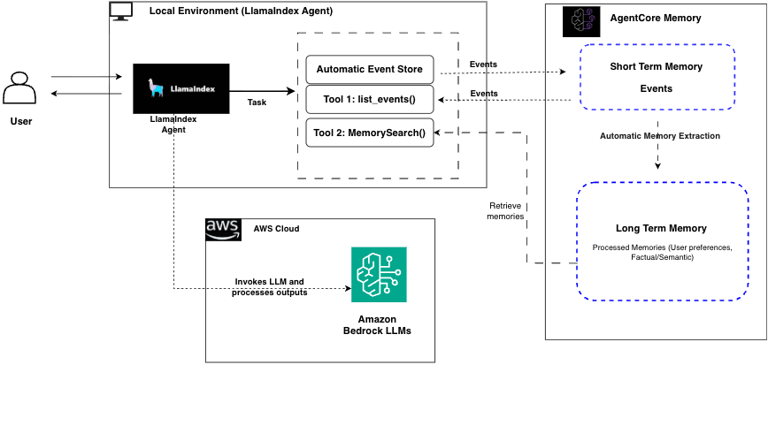

# LlamaIndex with AgentCore Memory - Academic Research Assistant (Long-term Memory)

## Introduction

This notebook demonstrates how to integrate Amazon Bedrock AgentCore Memory capabilities with LlamaIndex to create an Academic Research Assistant with **long-term memory** persistence across multiple research sessions - allowing the assistant to build cumulative knowledge over weeks and months of research work.

## Architecture Overview



## Tutorial Details

**Tutorial Details:**
- **Tutorial type**: Long-term Cross-Session Memory
- **Agent usecase**: Academic Research Assistant
- **Agentic Framework**: LlamaIndex
- **LLM model**: Anthropic Claude 3.7 Sonnet
- **Tutorial components**: AgentCore Long-term Memory, LlamaIndex Agent, Research Tools
- **Example complexity**: Advanced

## Business Value

**Enterprise Research Intelligence**: Transform your research workflow with persistent AI memory that accumulates institutional knowledge, tracks research evolution, and maintains comprehensive academic context across projects and time periods.

**Key Professional Advantages:**
- **Research Continuity**: Seamless knowledge transfer between research phases and team members
- **Institutional Memory**: Preserve critical research insights, methodologies, and findings permanently
- **Cross-Project Intelligence**: Identify patterns and connections across multiple research initiatives
- **Grant Proposal Excellence**: Leverage historical research data for compelling funding applications
- **Academic Collaboration**: Maintain detailed context for multi-year collaborative research projects
- **Publication Strategy**: Track research themes and citation networks for strategic publication planning

## Long-Term Memory Configuration

**Technical Setup**: This tutorial uses AgentCore Memory with Semantic Strategy for 12-month retention:
- **Memory Type**: Semantic strategy with automatic insight extraction
- **Retention**: 365-day event expiry for research continuity
- **Cross-Session**: Same actor_id + memory_id, different session_id per research period
- **Search Capability**: Built-in memory retrieval tool for semantic search across research history

## Technical Overview

**Key Long-Term Memory Components:**
1. **Semantic Strategy Configuration**: Uses SemanticStrategy for automatic insight extraction with 365-day retention
2. **Cross-Session Persistence**: Same actor_id + memory_id, different session_id per period enables knowledge continuity
3. **Custom Memory Search Tool**: Wraps AgentCore's native search_long_term_memories() in LlamaIndex FunctionTool
4. **Semantic Processing Pipeline**: 90-second wait for conversational events → semantic memories conversion
5. **Dynamic Session Management**: Uses memory.context.session_id for flexible session handling

**You'll learn to:**

- Create persistent AgentCore Memory across multiple research sessions
- Build cumulative research knowledge over time
- Implement semantic search across research history
- Track research evolution and expertise development
- Test cross-session memory persistence and retrieval

## Prerequisites

- Python 3.10+
- AWS account with appropriate permissions
- AWS IAM role with AgentCore Memory permissions:
  - `bedrock-agentcore:CreateMemory`
  - `bedrock-agentcore:CreateEvent`
  - `bedrock-agentcore:ListEvents`
  - `bedrock-agentcore:RetrieveMemories`
- Access to Amazon Bedrock models

## Step 1: Install Dependencies and Setup

```python
# Install necessary libraries including semantic strategy toolkit
%pip install llama-index-memory-bedrock-agentcore llama-index-llms-bedrock-converse boto3 bedrock-agentcore-starter-toolkit
```

```python
# Import required components
from bedrock_agentcore.memory import MemoryClient
from bedrock_agentcore_starter_toolkit.operations.memory.manager import MemoryManager
from bedrock_agentcore_starter_toolkit.operations.memory.models.strategies.semantic import (
    SemanticStrategy,
)
from llama_index.memory.bedrock_agentcore import AgentCoreMemory, AgentCoreMemoryContext
from llama_index.llms.bedrock_converse import BedrockConverse
from llama_index.core.agent.workflow import FunctionAgent
from llama_index.core.tools import FunctionTool
from datetime import datetime
import os

print("✅ All dependencies imported successfully!")
```

## Step 2: AgentCore Memory Configuration

Create or get the AgentCore Memory resource for long-term research knowledge:

```python
# Create AgentCore Memory with Semantic Strategy for long-term persistence
region = os.getenv("AWS_REGION", "us-east-1")
memory_manager = MemoryManager(region_name=region)

try:
    # Create memory with semantic strategy for automatic insight extraction
    memory = memory_manager.get_or_create_memory(
        name=f"AcademicResearchSemantic_{int(datetime.now().timestamp())}",
        strategies=[SemanticStrategy(name="researchLongTermMemory")],
        event_expiry_days=365,  # 12-month retention for research records
    )
    memory_id = memory.get("id")
    print(f"✅ Created Semantic Memory: {memory_id}")
    print(f"   Status: {memory.get('status')}")
    print(f"   Strategies: {[s.get('name') if isinstance(s, dict) else str(s) for s in memory.get('strategies', [])]}")

    # Wait for memory to become ACTIVE
    if memory.get("status") != "ACTIVE":
        print(f"\n⏳ Waiting for memory to become ACTIVE (currently {memory.get('status')})...")
        import time

        max_wait = 300  # 5 minutes max
        waited = 0
        while waited < max_wait:
            time.sleep(10)
            waited += 10
            # Check status
            current_memory = memory_manager.get_memory(memory_id)
            status = current_memory.get("status")
            print(f"   [{waited}s] Status: {status}")
            if status == "ACTIVE":
                print(f"✅ Memory is now ACTIVE! (took {waited} seconds)")
                break
        else:
            print(f"⚠️  Memory still not ACTIVE after {max_wait}s. Proceeding anyway...")

except Exception as e:
    print(f"❌ Error creating memory: {e}")
    memory_id = "your-memory-id-here"  # Replace with existing memory ID
```

## Step 3: Research Tools Implementation

Define specialized tools for academic research tasks:

```python
def save_paper_summary(title: str, authors: str, key_findings: str) -> str:
    """Save a research paper summary with title, authors, and key findings"""
    print(f"📄 Saved paper: {title} by {authors}")
    return f"Successfully saved paper summary for '{title}'"


def track_research_topic(topic: str, status: str) -> str:
    """Track research topic progress with current status"""
    print(f"🔬 Tracking research topic: {topic} (Status: {status})")
    return f"Now tracking research topic: {topic} with status {status}"


def save_research_finding(finding: str, confidence: str) -> str:
    """Save a research finding with confidence level"""
    print(f"💡 Research finding saved with {confidence} confidence")
    return f"Saved research finding with {confidence} confidence level"


def update_research_status(topic: str, new_status: str, notes: str) -> str:
    """Update research topic status with notes"""
    print(f"📊 Updated {topic} status to: {new_status}")
    return f"Updated research status for {topic}"


def log_research_milestone(period: str, milestone: str, details: str) -> str:
    """Log a research milestone with period and detailed progress"""
    print(f"🎯 {period} milestone: {milestone}")
    return f"Logged milestone for {period}: {milestone} - {details}"


def track_research_metrics(metric_type: str, value: str, source: str, period: str) -> str:
    """Track specific research metrics with source and timeline"""
    print(f"📊 {period}: {metric_type} = {value} (from {source})")
    return f"Tracked {metric_type}: {value} from {source} in {period}"


def save_research_insight(insight: str, period: str, connections: str) -> str:
    """Save research insights with connections to previous work"""
    print(f"💡 {period} insight: {insight[:50]}...")
    return f"Saved {period} insight with connections: {connections}"


# Create tool objects for the agent
research_tools = [
    FunctionTool.from_defaults(fn=save_paper_summary),
    FunctionTool.from_defaults(fn=track_research_topic),
    FunctionTool.from_defaults(fn=save_research_finding),
    FunctionTool.from_defaults(fn=update_research_status),
    FunctionTool.from_defaults(fn=log_research_milestone),
    FunctionTool.from_defaults(fn=track_research_metrics),
    FunctionTool.from_defaults(fn=save_research_insight),
]

print("✅ Research tools created!")
```

## Step 3b: Add Memory Retrieval Tool

Create a tool that allows the agent to search its long-term memory:

```python
def create_memory_retrieval_tool(memory_id: str, actor_id: str, region: str):
    """Create a tool for the agent to search its own long-term memory"""

    def search_long_term_memory(query: str) -> str:
        """Search long-term memory for relevant research information.

        Use this tool when you need to recall:
        - Previous research papers and findings
        - Research topics and their status
        - Metrics and insights from past work
        - Research milestones and progress

        Args:
            query: Search query describing what information you need

        Returns:
            Relevant information from long-term memory
        """
        try:
            from bedrock_agentcore.memory.session import MemorySessionManager

            # Create session manager
            session_manager = MemorySessionManager(memory_id=memory_id, region_name=region)

            # Search long-term memories in the semantic strategy namespace
            results = session_manager.search_long_term_memories(
                query=query,
                namespace_prefix="/strategies/",  # Search in semantic strategy namespace
                top_k=5,
                max_results=10,
            )

            if not results:
                return "No relevant information found in long-term memory. This might be new information or the memory extraction may still be processing."

            # Format results for the agent
            output = "📚 Retrieved from long-term memory:\\n\\n"
            for i, result in enumerate(results, 1):
                # MemoryRecord object - access content attribute
                content = getattr(result, "content", str(result))
                # Truncate very long content
                if len(content) > 300:
                    content = content[:300] + "..."
                output += f"{i}. {content}\\n\\n"

            return output

        except Exception as e:
            return f"⚠️ Error searching memory: {str(e)}. Proceeding without historical context."

    return FunctionTool.from_defaults(fn=search_long_term_memory)


# Create the memory retrieval tool
memory_search_tool = create_memory_retrieval_tool(memory_id, "academic-researcher", region)

# Add memory search to the tools list
research_tools_with_memory = research_tools + [memory_search_tool]

print(f"✅ Memory retrieval tool created! Total tools: {len(research_tools_with_memory)}")
print("   Using namespace: /strategies/ (for semantic strategy compatibility)")
```

## Step 3c: Verify Memory Configuration

Check that semantic strategy is properly configured:

```python
# Check memory configuration
memory_info = memory_manager.get_memory(memory_id)
print(f"Strategies: {memory_info.get('strategies')}")
print(f"Status: {memory_info.get('status')}")
print(f"Name: {memory_info.get('name')}")

# Show strategy details
strategies = memory_info.get("strategies", [])
for strategy in strategies:
    print("\nStrategy Details:")
    print(f"  Name: {strategy.get('name')}")
    print(f"  Type: {strategy.get('type')}")
    print(f"  Status: {strategy.get('status')}")
    print(f"  ID: {strategy.get('strategyId')}")
```

## Step 4: Multi-Session Agent Implementation

Create helper function to simulate different research sessions:

```python
# Configuration for LONG-TERM memory (cross-session)
MODEL_ID = "us.anthropic.claude-3-7-sonnet-20250219-v1:0"
RESEARCHER_ID = "academic-researcher"  # Same researcher across all sessions


def create_research_session(session_name: str):
    """Create a new research session with long-term memory persistence"""
    context = AgentCoreMemoryContext(
        actor_id=RESEARCHER_ID,  # Same researcher
        memory_id=memory_id,  # Same memory store (enables long-term memory)
        session_id=f"research-{session_name}",  # Different session per period
        namespace="/academic-research/",
    )

    memory = AgentCoreMemory(context=context)
    llm = BedrockConverse(model=MODEL_ID)
    agent = FunctionAgent(
        tools=research_tools_with_memory,  # Use tools with memory search capability
        llm=llm,
        verbose=True,  # Enable verbose to see when memory is searched
        system_prompt="""You are a senior research assistant with access to long-term memory.
        
CRITICAL: When asked about previous research, papers, findings, or historical information, 
you MUST use the search_long_term_memory tool FIRST before responding.

For example:
- "What research am I working on?" → Use search_long_term_memory("research topics")
- "What papers have I reviewed?" → Use search_long_term_memory("papers authors")
- "What findings do I have?" → Use search_long_term_memory("research findings")

Always provide conclusive, complete responses without asking follow-up questions.\n
Execute all requested actions immediately and completely. Provide detailed, professional responses.""",
    )

    return agent, memory


print("✅ Multi-session Academic Research Assistant setup complete!")
```

## Step 5: Week 1 Research Session - Foundation Building

Start the first research session and establish foundational knowledge:

```python
# === WEEK 1 RESEARCH SESSION ===
print("🗓️ === WEEK 1: FOUNDATION RESEARCH ===")

agent_week1, memory_week1 = create_research_session("week1")

# Establish research foundation
response = await agent_week1.run(
    "I'm Dr. Sarah Smith from MIT starting comprehensive research on 'Machine Learning in Healthcare Applications'. "
    "Track this with status 'Literature Review'. My goal is to publish a systematic review by year-end.",
    memory=memory_week1,
)

print("🎯 Week 1 Foundation:")
print(response)
```

```python
# Add foundational papers with detailed metrics
response = await agent_week1.run(
    "Save paper: 'Deep Learning for Medical Image Analysis' by Zhang et al (2023). "
    "Key findings: CNNs achieve 95.2% accuracy in chest X-ray diagnosis, 12% improvement over radiologists, "
    "trained on 100,000 images, 0.03 false positive rate.",
    memory=memory_week1,
)
print("📄 Week 1 Paper 1:", response)

response = await agent_week1.run(
    "Save paper: 'Transformers in Medical NLP' by Johnson et al (2023). "
    "Key findings: BERT achieves 89.1% F1-score in clinical note classification, "
    "struggles with rare diseases (<70% accuracy), excels at symptom extraction (94% precision).",
    memory=memory_week1,
)
print("📄 Week 1 Paper 2:", response)
# Explicitly track the accuracy metrics
await agent_week1.run(
    "Track research metrics: metric_type 'CNN Accuracy', value '95.2%', source 'Zhang et al 2023', period 'Week 1'.",
    memory=memory_week1,
)
await agent_week1.run(
    "Track research metrics: metric_type 'Radiologist Improvement', value '12%', source 'Zhang et al 2023', period 'Week 1'.",
    memory=memory_week1,
)
```

```python
# Allow time for semantic memory processing
import asyncio

print("\n⏳ Waiting for semantic memory extraction and indexing...")
print("   (AgentCore processes conversational events in the background)")
await asyncio.sleep(90)  # Increased wait time for memory extraction
print("✅ Memory processing complete - memories should now be searchable")
```

## Step 6: Week 2 Research Session - Cross-Session Memory Test

Test long-term memory retrieval and add new research:

```python
# === WEEK 2 RESEARCH SESSION ===
print("\n🗓️ === WEEK 2: EXPANSION (NEW SESSION) ===")

agent_week2, memory_week2 = create_research_session("week2")

# Test cross-session memory recall
response = await agent_week2.run(
    "What research am I working on? What specific accuracy metrics have I found so far? Who are the key authors?",
    memory=memory_week2,
)

print("🧠 Week 2 Memory Test:")
print(response)
print("\n✅ Expected: ML in Healthcare, Zhang 95.2%, Johnson 89.1% F1-score")
```

```python
# Add new research building on previous knowledge
response = await agent_week2.run(
    "Save paper: 'Federated Learning in Healthcare' by Brown et al (2023). "
    "Key findings: Privacy-preserving ML enables multi-hospital collaboration, 87.3% accuracy across 15 hospitals, "
    "23% improvement in rare disease detection when hospitals collaborate.",
    memory=memory_week2,
)
print("📄 Week 2 New Paper:", response)

# Test comparative analysis across sessions
response = await agent_week2.run(
    "Compare the accuracy results: Zhang's CNNs vs Johnson's BERT vs Brown's federated learning. "
    "Which performs best and in what contexts?",
    memory=memory_week2,
)
print("📊 Week 2 Comparative Analysis:")
print(response)
print("\n✅ Expected: Zhang 95.2% (imaging), Johnson 89.1% (NLP), Brown 87.3% (federated)")
```

## Step 7: Week 3 Research Session - Analysis Phase

Progress research and test detailed cross-session recall:

```python
# === WEEK 3 RESEARCH SESSION ===
print("\n🗓️ === WEEK 3: ANALYSIS PHASE ===")

agent_week3, memory_week3 = create_research_session("week3")

# Update research status
response = await agent_week3.run(
    "Update my 'Machine Learning in Healthcare Applications' research status to 'Analysis Phase' "
    "with notes: 'Reviewed 3 key papers, identified performance patterns: imaging>NLP>federated learning'.",
    memory=memory_week3,
)
print("📊 Week 3 Status Update:", response)

# Test detailed cross-session recall
response = await agent_week3.run(
    "What evidence do I have for the claim that imaging tasks show highest ML performance in healthcare? "
    "Include specific numbers and authors.",
    memory=memory_week3,
)
print("🔍 Week 3 Evidence Query:")
print(response)
print("\n✅ Expected: Zhang et al CNNs 95.2% vs Johnson BERT 89.1% vs Brown federated 87.3%")
```

## Step 8: Month 1 Research Session - Synthesis Phase

Test comprehensive knowledge synthesis and research consolidation:

```python
# === MONTH 1 RESEARCH SESSION ===
print("\n🗓️ === MONTH 1: SYNTHESIS PHASE ===")

agent_month1, memory_month1 = create_research_session("month1")

# Update research status to synthesis phase
response = await agent_month1.run(
    "Update my 'Machine Learning in Healthcare Applications' research status to 'Synthesis Phase' "
    "with notes: 'Completed 3-week literature review, ready to synthesize findings into coherent framework'.",
    memory=memory_month1,
)
print("📊 Month 1 Status Update:", response)

# Test comprehensive synthesis across all weeks
response = await agent_month1.run(
    "Based on all my research so far, what is the overall performance ranking of ML approaches in healthcare? "
    "Include all specific metrics and create a comprehensive comparison.",
    memory=memory_month1,
)
print("🔍 Month 1 Comprehensive Synthesis:")
print(response)
print("\n✅ Expected: Ranking with Zhang 95.2% > Johnson 89.1% > Brown 87.3%, domain analysis")
```

## Step 9: Month 2 Research Session - Writing Phase

Test comprehensive recall and semantic search capabilities:

```python
# === MONTH 2 RESEARCH SESSION ===
print("\n🗓️ === MONTH 2: WRITING PHASE ===")

agent_month2, memory_month2 = create_research_session("month2")

# Test comprehensive recall for writing
response = await agent_month2.run(
    "I'm writing my systematic review paper. What are ALL the papers I've reviewed with their exact accuracy metrics? "
    "I need this for my results table.",
    memory=memory_month2,
)
print("📝 Month 2 Comprehensive Recall:")
print(response)
print("\n✅ Expected: Zhang 95.2%, Johnson 89.1%, Brown 87.3% with full details")
```

```python
# Test semantic search across research history
response = await agent_month2.run(
    "What do I know about rare disease detection in my research? Which papers and what specific results?",
    memory=memory_month2,
)
print("🔍 Month 2 Semantic Search:")
print(response)
print("\n✅ Expected: Johnson <70% for rare diseases, Brown 23% improvement with collaboration")
```

## Step 10: Month 3 Research Session - Grant Proposal Scenario

Test practical application of accumulated knowledge:

```python
# === MONTH 3 RESEARCH SESSION ===
print("\n🗓️ === MONTH 3: GRANT PROPOSAL ===")

agent_month3, memory_month3 = create_research_session("month3")

# Grant proposal evidence gathering
response = await agent_month3.run(
    "I'm writing an NIH grant proposal for $2M funding. What evidence can I cite about ML effectiveness in healthcare? "
    "I need specific numbers, authors, years, and sample sizes.",
    memory=memory_month3,
)
print("💰 Month 3 Grant Evidence:")
print(response)
print("\n✅ Expected: Comprehensive citation with Zhang 95.2% (100K images), Johnson 89.1%, Brown 87.3% (15 hospitals)")
```

```python
# Test research evolution tracking with detailed milestones
response = await agent_month3.run(
    "Provide a detailed timeline of my research evolution from Week 1 to now. What specific milestones, "
    "metrics, and insights did I achieve each period? How did my research questions evolve?",
    memory=memory_month3,
)
print("📈 Month 3 Research Evolution:")
print(response)
print("\n✅ Expected: Week-by-week progression with specific milestones, metrics (95.2%, 89.1%, 87.3%), and insights")
```

## Step 11: Final Portfolio Assessment

Comprehensive test of long-term memory capabilities:

```python
# Final comprehensive portfolio query
response = await agent_month3.run(
    "Provide my complete research portfolio: all topics I'm working on, all papers with metrics, "
    "all findings, current status of each project, and how they interconnect.",
    memory=memory_month3,
)
print("📋 Complete Research Portfolio:")
print(response)
print("\n✅ Expected: Full research history with all metrics, connections between ML healthcare topics")
```

## 🧪 Automated Test Validation
Run these cells to validate that memory integration is working correctly:

```python
# Define validation functions inline
class TestValidator:
    def __init__(self):
        self.results = {}

    def validate_memory_recall(self, response):
        """Check if agent can recall information from earlier in the session"""
        # Check for substantive response (not just "I don't know")
        has_content = len(response) > 50
        # Check for memory indicators
        has_memory_indicators = any(
            word in response.lower()
            for word in [
                "earlier",
                "mentioned",
                "discussed",
                "previously",
                "you",
                "we",
                "our",
            ]
        )
        return "✅ PASS" if (has_content and has_memory_indicators) else "❌ FAIL"

    def validate_session_memory(self, response):
        """Check if agent maintains context within session"""
        has_memory_content = len(response) > 100 and any(
            word in response.lower()
            for word in [
                "previous",
                "earlier",
                "mentioned",
                "discussed",
                "before",
                "already",
            ]
        )
        return "✅ PASS" if has_memory_content else "❌ FAIL"

    def validate_cross_reference(self, response):
        """Check if agent can connect current query to previous context"""
        # Look for connecting language
        connecting_words = [
            "relate",
            "connection",
            "previous",
            "earlier",
            "discussed",
            "mentioned",
            "context",
            "based on",
            "as we",
            "as i",
        ]
        has_connection = any(word in response.lower() for word in connecting_words)
        has_substance = len(response) > 80
        return "✅ PASS" if (has_connection and has_substance) else "❌ FAIL"

    def run_validation_summary(self, test_results):
        print("🧪 COMPREHENSIVE TEST VALIDATION SUMMARY")
        print("=" * 60)

        total_tests = len(test_results)
        passed_tests = sum(1 for result in test_results.values() if "PASS" in result)
        pass_rate = (passed_tests / total_tests * 100) if total_tests > 0 else 0

        for test_name, result in test_results.items():
            print(f"{test_name}: {result}")

        print("=" * 60)
        print(f"📊 Overall Pass Rate: {passed_tests}/{total_tests} ({pass_rate:.1f}%)")

        if pass_rate >= 80:
            print("✅ EXCELLENT: Memory integration working correctly!")
        elif pass_rate >= 60:
            print("⚠️  GOOD: Most memory features working, some issues to investigate")
        else:
            print("❌ NEEDS ATTENTION: Memory integration has significant issues")

        return pass_rate


validator = TestValidator()
print("✅ Validation functions loaded!")
```

```python
# Run all validation tests
test_results = {}

# Test 1: Memory recall - can the agent recall what was discussed?
response1 = await agent_month3.run("What have we discussed so far in this session?", memory=memory_month3)
test_results["Memory Recall"] = validator.validate_memory_recall(str(response1))
print(f"Response 1 length: {len(str(response1))} chars")

# Test 2: Session memory - does the agent maintain context?
response2 = await agent_month3.run("What did we talk about earlier?", memory=memory_month3)
test_results["Session Memory"] = validator.validate_session_memory(str(response2))
print(f"Response 2 length: {len(str(response2))} chars")

# Test 3: Cross-reference capability - can it connect to previous context?
response3 = await agent_month3.run("How does this relate to what we discussed before?", memory=memory_month3)
test_results["Cross Reference"] = validator.validate_cross_reference(str(response3))
print(f"Response 3 length: {len(str(response3))} chars")

# Display results
validator.run_validation_summary(test_results)
```

## Summary

In this notebook, we've demonstrated:

✅ **Long-term Memory Integration**: Using AgentCore Memory with LlamaIndex for cross-session persistence

✅ **Cumulative Knowledge Building**: Research knowledge accumulates over weeks and months

✅ **Semantic Retrieval**: Assistant can find related information based on concepts across sessions

✅ **Research Evolution Tracking**: Natural progression from literature review to analysis to writing

✅ **Cross-Session Synthesis**: Connecting findings and insights across multiple research sessions

✅ **Practical Applications**: Grant proposal support and comprehensive portfolio management

The Academic Research Assistant showcases how long-term memory transforms the assistant into a persistent research companion that grows smarter over time, maintaining complete research history and enabling sophisticated knowledge retrieval across extended research projects.

## Clean Up

Let's delete the memory to clean up the resources used in this notebook:

**Note**: Only run this if you want to permanently delete the memory. The memory_id variable should contain the ID from the memory created earlier in this notebook.

```python
# Clean up AgentCore Memory resource
try:
    from bedrock_agentcore.memory import MemoryClient

    client = MemoryClient(region_name=region)
    client.delete_memory(memory_id)
    print(f"✅ Successfully deleted memory: {memory_id}")

except NameError as e:
    print(f"⚠️  Variable not defined: {e}")
    print("Run the notebook from the beginning or set variables manually:")
    print("# memory_id = 'your-memory-id-here'")
    print("# region = 'us-east-1'")
except Exception as e:
    print(f"❌ Error deleting memory: {e}")
```
