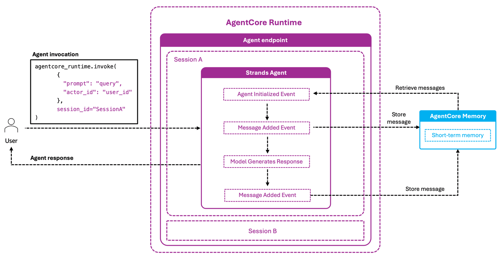

# Amazon Bedrock AgentCore Runtime and AgentCore Memory Agent

## Overview

This tutorial demonstrates how to create your first memory-enabled agent using AgentCore Runtime and AgentCore Memory. You'll build a simple "Hello World" conversational agent that remembers previous interactions within a session.

### Tutorial Details


| Information         | Details                                                          |
|:--------------------|:-----------------------------------------------------------------|
| Tutorial type       | Hello World / Introduction                                       |
| Agent type          | Single Conversational Agent                                      |
| Agentic Framework   | Strands Agents                                                   |
| LLM model           | Anthropic Claude Haiku 4.5                                      |
| Key features        | AgentCore Runtime, Memory Integration                            |
| Example complexity  | Beginner                                                         |
| SDK used            | boto3, bedrock-agentcore, bedrock-agentcore-starter-toolkit      |

### What You'll Learn

In this tutorial, you'll learn:
1. How to create a memory resource for your agent
2. How to use AgentCoreMemorySessionManager for automatic conversation persistence
3. How to deploy your agent to AgentCore Runtime
4. How to test your agent with session management


### Architecture

This Hello World example demonstrates a simple conversational agent deployed to AgentCore runtime with memory integration:

<div style="text-align:left">
    
</div>

## 0. Prerequisites

To execute this tutorial you will need:
* Python 3.10+
* AWS credentials configured
* Amazon Bedrock model access (Claude Haiku 4.5)
* Amazon Bedrock AgentCore SDK

First, let's install the required libraries:

```python
!pip3 install -qr requirements.txt
```

### Setting Up Environment

Let's import the required libraries and configure our environment:

```python
# Imports
import os
import boto3
import uuid
import logging
from bedrock_agentcore.memory import MemoryClient, MemorySessionManager

# Configuration
logging.basicConfig(level=logging.INFO, format="%(asctime)s [%(levelname)s] %(name)s: %(message)s")
logger = logging.getLogger("runtime-memory-agent")
REGION = os.getenv("AWS_REGION", "us-west-2")  # AWS region for the agent
memory_client = MemoryClient(region_name=REGION)
```

## 1. Creating Memory Resource

In this section, we'll create a memory resource for our agent to store conversation history. Memory allows the agent to recall past interactions, maintain context, and provide more coherent responses over time.

For this example, we'll create a simple short-term memory resource without any additional long-term strategies. The memory will store all conversation messages, helping our agent remember previous interactions when continuing a session after it has been terminated in AgentCore Runtime.

```python
from botocore.exceptions import ClientError

# Create unique identifier for this resource
unique_id = str(uuid.uuid4())[:8]
memory_name = f"RuntimeMemoryAgent_{unique_id}"

try:
    # Create memory resource without strategies (short-term memory only)
    memory = memory_client.create_memory_and_wait(
        name=memory_name,
        strategies=[],  # No strategies for short-term memory
        description="Short-term memory for AgentCore Runtime agent",
        event_expiry_days=7,  # Retention period for short-term memory
    )
    memory_id = memory["id"]
    logger.info(f"✅ Created memory: {memory_id}")
except ClientError as e:
    logger.info(f"❌ ERROR: {e}")
    if e.response["Error"]["Code"] == "ValidationException" and "already exists" in str(e):
        # If memory already exists, retrieve its ID
        memories = memory_client.list_memories()
        memory_id = next((m["id"] for m in memories if m["id"].startswith(memory_name)), None)
        logger.info(f"Memory already exists. Using existing memory ID: {memory_id}")
except Exception as e:
    # Show any errors during memory creation
    logger.error(f"❌ ERROR: {e}")
    import traceback

    traceback.print_exc()
    # Cleanup on error - delete the memory if it was partially created
    if "memory_id" in locals() and memory_id:
        try:
            memory_client.delete_memory_and_wait(memory_id=memory_id)
            logger.info(f"Cleaned up memory: {memory_id}")
        except Exception as cleanup_error:
            logger.error(f"Failed to clean up memory: {cleanup_error}")
```

## 2. Creating Your Memory-Enabled Agent

In this section, we'll build our memory-enabled agent using Strands Agents framework with the built-in AgentCoreMemorySessionManager for memory integration.

> **Why Memory Matters**: Sessions in AgentCore runtime expire after a certain time, which deletes the conversation context. By storing conversations in memory, we ensure previous information persists between sessions, creating a seamless experience for users even after long breaks.

### Agent Capabilities

Our agent will:
1. Store each user and assistant message in memory automatically
2. Retrieve past conversation history when continuing an existing session
3. Maintain context across multiple interactions with the same user

### Key Components of Our Implementation

#### 1. AgentCoreMemorySessionManager (Recommended)
The built-in Strands integration that automatically handles:
- Storing each user and assistant message in memory
- Retrieving past conversation history when continuing an existing session
- Managing session and actor context

#### 2. Agent Initialization
The `initialize_agent` function:
- Configures memory using `AgentCoreMemoryConfig` with memory_id, session_id, and actor_id
- Creates an `AgentCoreMemorySessionManager` instance
- Sets up the agent with the session_manager

#### 3. Entry Point Handler
The runtime_memory_agent function:
- Parses input payload and extracts user message
- Manages agent initialization and session tracking
- Handles invocation of the agent with proper context
- Returns formatted responses to the runtime environment

Let's create our agent file:

```python
%%writefile runtime_memory_agent.py
import os
import json
import logging
from typing import Dict, Any
from strands import Agent
from strands.models import BedrockModel
from bedrock_agentcore.runtime import BedrockAgentCoreApp
from bedrock_agentcore.memory.integrations.strands.config import AgentCoreMemoryConfig
from bedrock_agentcore.memory.integrations.strands.session_manager import AgentCoreMemorySessionManager
# Configure detailed logging
logging.basicConfig(
    level=logging.INFO,
    format='%(asctime)s [%(levelname)s] %(name)s: %(message)s'
)
logger = logging.getLogger("runtime-memory-agent")

# Initialize the agent core app
app = BedrockAgentCoreApp()

MODEL_ID = os.getenv('MODEL_ID')
MEMORY_ID = os.getenv('MEMORY_ID')
REGION = os.getenv('AWS_REGION')

# Global agent instance - will be initialized with first request
agent = None
session_manager = None
 
   
    
def initialize_agent(actor_id, session_id):
    """Initialize the agent with memory session manager"""
    global agent, session_manager

    logger.info(f"Initializing agent for actor_id={actor_id}, session_id={session_id}")

    # Create model
    logger.info(f"Creating model with ID: {MODEL_ID}")
    model = BedrockModel(model_id=MODEL_ID)

    # Configure memory using AgentCoreMemoryConfig (recommended)
    logger.info(f"Creating memory config with region: {REGION}")
    config = AgentCoreMemoryConfig(
        memory_id=MEMORY_ID,
        session_id=session_id,
        actor_id=actor_id
    )

    # Create session manager - handles all memory operations automatically!
    session_manager = AgentCoreMemorySessionManager(config, region_name=REGION)

    # Create agent with session_manager (replaces custom hooks)
    logger.info("Creating agent with AgentCoreMemorySessionManager")
    agent = Agent(
        model=model,
        session_manager=session_manager,  # ✅ Built-in memory integration
        system_prompt="You're a helpful, memory-enabled agent deployed on AgentCore Runtime. You can remember previous interactions within the same session. Be friendly and concise in your responses."
    )
    logger.info("✅ Agent initialized with memory session manager")

@app.entrypoint
def runtime_memory_agent(payload, context):
    """
    Main entry point for the memory-enabled agent
    
    Args:
        payload: The input payload containing user data
        context: The runtime context object containing session information
    """
    global agent, session_manager
    
    # Log both payload and context info
    logger.info(f"Received payload: {payload}")
    logger.info(f"Context session_id: {context.session_id}")
    
    # Extract and validate required values
    user_input = payload.get("prompt")
    actor_id = payload.get("actor_id", "default_user")  # Provide default for demo
    session_id = context.session_id  # Get session_id from context
    
    # Validate required fields
    if user_input is None:
        error_msg = "❌ ERROR: Missing 'prompt' field in payload"
        logger.error(error_msg)
        return error_msg
    
    # Initialize agent on first request
    if agent is None:
        logger.info("First request - initializing agent")
        initialize_agent(actor_id, session_id)
    else:
        
        # Check if session or actor changed - need to reinitialize
        current_session = getattr(session_manager, '_session_id', None) if session_manager else None
        if current_session != session_id:
            logger.info(f"Session changed from {current_session} to {session_id} - reinitializing agent")
            initialize_agent(actor_id, session_id)
    
    # Invoke the agent with the user's input
    logger.info(f"Invoking agent with input: {user_input}")
    response = agent(user_input)
    response_text = response.message['content'][0]['text']
    logger.info(f"✅ Agent response: {response_text[:50]}...")
    
    return response_text

if __name__ == "__main__":
    logger.info("Starting AgentCore application")
    app.run()
```

## 3. Deploying to AgentCore Runtime

In this section, we'll deploy our agent to Amazon Bedrock AgentCore Runtime, a managed agent runtime environment that provides scalability and simplified operations. AgentCore Runtime handles the infrastructure complexity, allowing you to focus on your agent's logic rather than deployment concerns.

Unlike traditional deployment methods that require manual server setup and management, AgentCore Runtime automatically packages your code into containers, deploys them to AWS infrastructure, and provides secure HTTPS endpoints for invocation. This approach ensures your agent can scale with demand and operate reliably in production environments.

### What You Need to Know

- **AgentCore Runtime** packages your agent into a Docker container and deploys it to managed AWS infrastructure
- **Environment Variables** will configure our agent:
  - `MEMORY_ID`: The memory resource we created earlier
  - `MODEL_ID`: Claude Haiku 4.5 model ID
  - `AWS_REGION`: AWS region for deployment

> 💡 **Tip**: The AgentCore starter toolkit handles all the complex deployment steps for us, including IAM roles, ECR repositories, and container builds.

### Configure the Deployment

Let's set up our deployment configuration:

```python
from bedrock_agentcore_starter_toolkit import Runtime
import time

agentcore_runtime = Runtime()
agent_name = f"runtime_memory_agent_{unique_id}"

response = agentcore_runtime.configure(
    entrypoint="runtime_memory_agent.py",
    auto_create_execution_role=True,
    auto_create_ecr=True,
    requirements_file="requirements.txt",
    region=REGION,
    agent_name=agent_name,
    memory_mode="STM_ONLY",
)
response
```


### Registering Your Memory Resource

In Step 1, we manually created a memory resource to understand the underlying components of AgentCore Memory. Since we're managing our own memory resource, we need to update the starter toolkit's local configuration to use it during deployment. This prevents the toolkit from provisioning a new memory resource on launch.

The following cell writes our memory resource ID into the `.bedrock_agentcore.yaml` configuration file that was generated by `configure()`.

> **Note**: When using Agentcore Starter Toolkit, you don't need to manage memory resources manually. The AgentCore Starter Toolkit handles memory provisioning, configuration, and lifecycle management automatically when you set `memory_mode` during `configure()`. This tutorial creates the resource explicitly so you can see how each component works end to end.

```python
import yaml

config_path = ".bedrock_agentcore.yaml"
with open(config_path, "r") as f:
    config = yaml.safe_load(f)

# Inject your existing memory_id into the agent's config
config["agents"][agent_name]["memory"]["memory_id"] = memory_id

with open(config_path, "w") as f:
    yaml.dump(config, f, default_flow_style=False)

print(f"✅ Injected memory_id: {memory_id} into {agent_name} config")
```

### Launch the agent

Now let's launch our agent to AgentCore Runtime. This step takes our configured agent and deploys it to AgentCore's managed infrastructure. During this process, we're also passing in the essential environment variables our agent needs: the memory ID we created earlier and the model ID to use. Once deployed, our agent will be accessible through a secure endpoint that we can invoke with user messages.

```python
launch_result = agentcore_runtime.launch(
    env_vars={
        "MEMORY_ID": memory_id,
        "MODEL_ID": "global.anthropic.claude-haiku-4-5-20251001-v1:0",
    }
)
```

### Check deployment status

Let's check the deployment status of our agent:

```python
status_response = agentcore_runtime.status()
status = status_response.endpoint["status"]
end_status = ["READY", "CREATE_FAILED", "DELETE_FAILED", "UPDATE_FAILED"]

while status not in end_status:
    time.sleep(10)
    status_response = agentcore_runtime.status()
    status = status_response.endpoint["status"]
    print(f"Current status: {status}")

if status == "READY":
    print("✅ Agent successfully deployed!")
else:
    print(f"❌ Deployment ended with status: {status}")
```

## Testing Your Agent

Now that our agent is deployed, let's test it by sending a message.

**Important Notes on Actor ID and Session Management**

- Actor ID: In production applications, the actor_id would typically come from your authentication system when a user logs in. This identifier helps the agent maintain separate conversation histories for different users. In our example, we're using a hardcoded value (test_user_123), but in real-world scenarios, you would pass the authenticated user's unique identifier.

- Session Management: While AgentCore Runtime will automatically generate a session ID if one isn't provided, it's recommended to explicitly manage session IDs in your application. This gives you better control over:
  - Continuing conversations after session timeouts
  - Creating new sessions when appropriate (e.g., user starts a new conversation)
  - Handling multiple parallel conversations with the same user
  - Implementing session expiration policies based on your application's needs

```python
# Generate a test session ID
test_session_id = "agent-runtime-memory-session-123456789"  # Min length is 33

# Send our first message
invoke_response = agentcore_runtime.invoke(
    {"prompt": "Hello! My name is John. What can you do?", "actor_id": "test_user_123"},
    session_id=test_session_id,
)

invoke_response
```

### Display the agent's response

Let's display the response in a more readable format:

```python
from IPython.display import Markdown, display

response_text = invoke_response["response"][0]
display(Markdown(response_text))
```

### Test persistence

Now let's test if our agent remembers the previous interaction by sending a follow-up message in the same session:

```python
# Send a follow-up message using the same session ID
follow_up_response = agentcore_runtime.invoke(
    {"prompt": "What is my name?", "actor_id": "test_user_123"},
    session_id=test_session_id,
)

# Display the response
follow_up_text = follow_up_response["response"][0]
display(Markdown(follow_up_text))
```

### Verify memory content

Let's check what's stored in our memory to confirm our messages were properly saved:

```python
# Use MemorySessionManager for session operations
manager = MemorySessionManager(memory_id=memory_id, region_name=REGION)
session = manager.create_memory_session(actor_id="test_user_123", session_id=test_session_id)

# Get conversation history using session-scoped method
stored_turns = session.get_last_k_turns(k=10)

print(f"Found {len(stored_turns)} conversation turns in memory (shown in chronological order):")
for idx, turn in enumerate(stored_turns):
    print(f"\nTurn {idx + 1}:")
    for message in turn:
        role = message["role"]
        text = message["content"]["text"]
        print(f"- {role}: {text[:100]}...")
```

## Key Concepts

1. **Memory Integration**: How to use Amazon Bedrock Memory to store conversation history
2. **Session Management**: How to use session IDs to maintain conversation context
3. **AgentCore Deployment**: How to deploy your agent to a production runtime environment
4. **AgentCoreMemorySessionManager**: How to use the built-in Strands integration for automatic memory handling

These concepts provide a foundation for building more complex agents with persistent memory.

## Cleanup (Optional)

If you no longer need the resources created in this tutorial, you can clean them up:

```python
# Get resource identifiers
if "launch_result" in locals():
    print(f"Agent ID: {launch_result.agent_id}")
    print(f"ECR Repository: {launch_result.ecr_uri.split('/')[1]}")
else:
    print("Launch results not available")
```

```python
# Only run this cell if you want to delete the resources

# Delete the AgentCore Runtime
agentcore_control_client = boto3.client("bedrock-agentcore-control", region_name=REGION)

runtime_delete_response = agentcore_control_client.delete_agent_runtime(
    agentRuntimeId=launch_result.agent_id,
)
print(f"Deleted AgentCore Runtime: {launch_result.agent_id}")

# Delete the ECR repository
ecr_client = boto3.client("ecr", region_name=REGION)

response = ecr_client.delete_repository(repositoryName=launch_result.ecr_uri.split("/")[1].split(":")[0], force=True)
print(f"Deleted ECR repository: {launch_result.ecr_uri.split('/')[1].split(':')[0]}")

# Delete the memory resource
memory_client = MemoryClient(region_name=REGION)
memory_client.delete_memory_and_wait(memory_id=memory_id)
print(f"Deleted memory resource: {memory_id}")
```

## Congratulations!

You've successfully built and deployed your first memory-enabled agent with Amazon Bedrock AgentCore Runtime and AgentCore Memory!

### Next Steps

Now that you understand the basics, you can:

1. **Add Tools**: Enhance your agent with tools like calculators, database connectors, or API calls
2. **Improve Memory**: Implement more sophisticated memory strategies with long-term memory
3. **Build a UI**: Create a web or mobile interface for your agent
