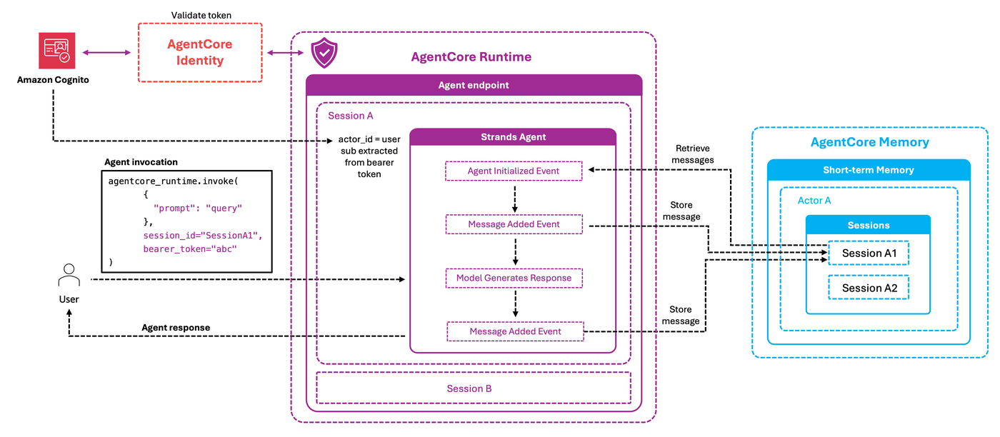

# Amazon Bedrock AgentCore Runtime and AgentCore Memory Agent with Identity isolation

## Overview

This tutorial demonstrates how to create your first memory-enabled agent with user isolation using AgentCore Runtime and AgentCore Memory. You'll build a simple "Hello World" conversational agent that remembers previous interactions within a session, enabling more natural and contextual conversations with users across interactions.

Memory is a critical component for creating effective conversational agents, as it allows them to maintain context, recall user preferences, and provide consistent responses over time. Without memory, your agent would have to start from scratch with each interaction, leading to a disjointed user experience.

The implementation leverages Amazon Bedrock AgentCore Memory with user identity propagation to automatically partition memory based on authenticated user credentials, creating secure, isolated memory spaces for each individual user.

### Tutorial Details


| Information         | Details                                                          |
|:--------------------|:-----------------------------------------------------------------|
| Tutorial type       | Hello World / Introduction                                       |
| Agent type          | Single Conversational Agent                                      |
| Agentic Framework   | Strands Agents                                                   |
| LLM model           | Anthropic Claude Haiku 3.5                                      |
| Key features        | AgentCore Runtime, Memory Integration                            |
| Example complexity  | Intermediate                                                         |
| SDK used            | boto3, bedrock-agentcore, bedrock-agentcore-starter-toolkit      |

### What You'll Learn

In this tutorial, you'll learn:
1. How to create a memory resource for your agent using AgentCore Memory
2. How to implement memory hooks to store and retrieve conversation history
3. How to deploy your agent to AgentCore Runtime for scalable production use
4. How to test your agent with session management and verify memory persistence
5. How to handle user identity and ensure memory isolation between different users


### Architecture

This Hello World example demonstrates a simple conversational agent deployed to AgentCore runtime with memory integration:

<div style="text-align:left">
    
</div>

## 0. Prerequisites

To execute this tutorial you will need:
* Python 3.10 or newer
* AWS credentials configured with appropriate permissions for Bedrock, ECR, IAM, and Cognito
* Amazon Bedrock model access (Claude 3.5 Haiku)
* Amazon Bedrock AgentCore SDK and dependencies

First, let's install the required libraries.

```python
!pip install -qUr requirements.txt
```

### Setting Up Environment

Let's import the required libraries and configure our environment. We'll be using:
- `boto3` for AWS service interactions
- `bedrock_agentcore.memory` for managing agent memory
- Various utility functions for setting up authentication

```python
# Imports
import os
import time
import boto3
import uuid
import logging
from bedrock_agentcore.memory import MemoryClient
from utils import setup_cognito_user_pool

# Configuration
logging.basicConfig(level=logging.INFO, format="%(asctime)s [%(levelname)s] %(name)s: %(message)s")
logger = logging.getLogger("runtime-memory-agent")
REGION = os.getenv("AWS_REGION", "us-west-2")
memory_client = MemoryClient(region_name=REGION)
```

## 1. Creating the Amazon Cognito User Pool

In this section, we'll create an Amazon Cognito User Pool and users. Cognito provides user authentication and identity management for our agent, ensuring that each user's conversation history is accessible only to that user.

The `setup_cognito_user_pool` function will:
1. Create a Cognito User Pool if it doesn't exist
2. Set up app clients for authentication
3. Create 2 test users with temporary passwords
4. Generate access tokens for testing

```python
print("Setting up Amazon Cognito user pool and users...")
cognito_config = setup_cognito_user_pool(region=REGION)
print("Cognito setup completed ✓")
```

## 2. Creating Memory Resource

In this section, we'll create a memory resource for our agent to store conversation history. Memory allows the agent to recall past interactions, maintain context, and provide more coherent responses over time.

For this example, we'll create a simple short-term memory resource without any additional long-term strategies. The memory will store all conversation messages, helping our agent remember previous interactions when continuing a session after it has been terminated in AgentCore Runtime.

```python
from botocore.exceptions import ClientError

# Create unique identifier for this resource
unique_id = str(uuid.uuid4())[:8]
memory_name = f"RuntimeIdentityMemoryAgent_{unique_id}"

try:
    # Create memory resource without strategies (short-term memory only)
    memory = memory_client.create_memory_and_wait(
        name=memory_name,
        strategies=[],  # No strategies for short-term memory
        description="Short-term memory for AgentCore Runtime agent authenticated with AgentCore Identity",
        event_expiry_days=7,  # Retention period for short-term memory
    )
    memory_id = memory["id"]
    logger.info(f"✅ Created memory: {memory_id}")
except ClientError as e:
    logger.info(f"❌ ERROR: {e}")
    if e.response["Error"]["Code"] == "ValidationException" and "already exists" in str(e):
        # If memory already exists, retrieve its ID
        memories = memory_client.list_memories()
        memory_id = next((m["id"] for m in memories if m["id"].startswith(memory_name)), None)
        logger.info(f"Memory already exists. Using existing memory ID: {memory_id}")
except Exception as e:
    # Show any errors during memory creation
    logger.error(f"❌ ERROR: {e}")
    import traceback

    traceback.print_exc()
    # Cleanup on error - delete the memory if it was partially created
    if "memory_id" in locals() and memory_id:
        try:
            memory_client.delete_memory_and_wait(memory_id=memory_id)
            logger.info(f"Cleaned up memory: {memory_id}")
        except Exception as cleanup_error:
            logger.error(f"Failed to clean up memory: {cleanup_error}")
```

## 3. Creating Your Memory-Enabled Agent

In this section, we'll build our memory-enabled agent using Strands Agents framework with custom hooks for memory integration. This agent will maintain conversation context by storing and retrieving messages from AgentCore Memory.

> **Why Memory Matters**: Sessions in AgentCore runtime expire after a certain time, which deletes the conversation context. By storing conversations in memory, we ensure previous information persists between sessions, creating a seamless experience for users even after long breaks.

### Agent Capabilities

Our agent will:
1. Store each user and assistant message in memory automatically
2. Retrieve past conversation history when continuing an existing session
3. Maintain context across multiple interactions with the same user
4. Isolate conversations between different users through user identity verification

### Key Components of Our Implementation

#### 1. Memory Hook Provider
Our custom hook provider implements:
- `on_agent_initialized`: Triggered when the agent starts, retrieves conversation history from AgentCore Memory
- `on_message_added`: Triggered when a new message is added to the conversation, stores it in AgentCore Memory

#### 2. Agent Initialization
The `initialize_agent` function:
- Configures the memory hook with the correct region
- Sets up the agent with proper state variables (memory_id, actor_id, session_id)
- Configures the system prompt for the LLM

#### 3. User verification
The `get_user_sub` function:
- Verifies a Cognito access token against JWKS and returns the user's sub (unique ID).

#### 4. Entry Point Handler
The runtime_memory_agent function:
- Parses input payload and extracts user message
- Verifies user identity using JWT tokens from Cognito
- Manages agent initialization and session tracking
- Handles invocation of the agent with proper context
- Returns formatted responses to the runtime environment

Let's create our agent file:

```python
%%writefile runtime_identity_memory_agent.py
import os
import jwt
import json
import logging
from strands import Agent
from jwt import PyJWKClient
from typing import Dict, Any
from strands.models import BedrockModel
from bedrock_agentcore.memory import MemoryClient
from bedrock_agentcore.runtime import BedrockAgentCoreApp
from strands.hooks import AgentInitializedEvent, HookProvider, HookRegistry, MessageAddedEvent

# Configure detailed logging
logging.basicConfig(
    level=logging.INFO,
    format='%(asctime)s [%(levelname)s] %(name)s: %(message)s'
)
logger = logging.getLogger("runtime-memory-agent")

# Initialize the agent core app
app = BedrockAgentCoreApp()

MODEL_ID = os.getenv('MODEL_ID')
MEMORY_ID = os.getenv('MEMORY_ID')
COGNITO_USER_POOL = os.getenv('COGNITO_USER_POOL')
REGION = os.getenv('AWS_REGION')

# Global agent instance - will be initialized with first request
agent = None

class MemoryHookProvider(HookProvider):
    """Custom hook provider to integrate with Bedrock Memory"""
    
    def __init__(self, region_name):
        logger.info(f"Initializing MemoryHookProvider with region {region_name}")
        self.memory_client = MemoryClient(region_name=region_name)
    
    def on_agent_initialized(self, event: AgentInitializedEvent):
        """Load recent conversation history when agent starts"""
        logger.info("Agent initialization hook triggered")
        
        memory_id = event.agent.state.get("memory_id")
        actor_id = event.agent.state.get("actor_id")
        session_id = event.agent.state.get("session_id")
        
        logger.info(f"State values - memory_id: {memory_id}, actor_id: {actor_id}, session_id: {session_id}")
        
        missing_values = []
        if not memory_id:
            missing_values.append("memory_id")
        if not actor_id:
            missing_values.append("actor_id")
        if not session_id:
            missing_values.append("session_id")
            
        if missing_values:
            logger.warning(f"Missing required values: {', '.join(missing_values)}")
            return
        
        try:
            # First, check if the session exists by listing events with a limit of 1
            logger.info(f"Checking if session {session_id} exists...")
            session_exists = False
            try:
                events = self.memory_client.list_events(
                    memory_id=memory_id,
                    actor_id=actor_id,
                    session_id=session_id,
                    max_results=1
                )
                session_exists = len(events) > 0
                logger.info(f"Session exists: {session_exists} (found {len(events)} events)")
            except Exception as e:
                logger.warning(f"Error checking session existence: {e}")
                # Assume no events exist and continue
                session_exists = False
            
            # If session doesn't exist, no need to load conversation history
            if not session_exists:
                logger.info(f"No existing conversation found for session {session_id}")
                return
            
            # Session exists, load the conversation history
            logger.info(f"Loading conversation history for existing session {session_id}")
            recent_turns = self.memory_client.get_last_k_turns(
                memory_id=memory_id,
                actor_id=actor_id,
                session_id=session_id,
                k=5
            )
            
            if recent_turns:
                logger.info(f"✅ Loaded {len(recent_turns)} conversation turns from memory")
                context_messages = []
                for turn in recent_turns:
                    for message in turn:
                        role = message['role']
                        content = message['content']['text']
                        context_messages.append(f"{role}: {content}")
                
                context = "\n".join(context_messages)
                event.agent.system_prompt += f"\n\nRecent conversation:\n{context}"
                logger.info("✅ Added conversation context to system prompt")
            else:
                logger.info("No recent turns found for this session")
                
        except Exception as e:
            logger.error(f"❌ Memory load error: {e}", exc_info=True)
    
    def on_message_added(self, event: MessageAddedEvent):
        """Store messages in memory"""
        logger.info("Message added hook triggered")
        
        memory_id = event.agent.state.get("memory_id")
        actor_id = event.agent.state.get("actor_id")
        session_id = event.agent.state.get("session_id")
        
        logger.info(f"State values - memory_id: {memory_id}, actor_id: {actor_id}, session_id: {session_id}")
        
        missing_values = []
        if not memory_id:
            missing_values.append("memory_id")
        if not actor_id:
            missing_values.append("actor_id")
        if not session_id:
            missing_values.append("session_id")
            
        if missing_values:
            logger.warning(f"❌ Cannot save message - missing values: {', '.join(missing_values)}")
            return
            
        messages = event.agent.messages
        try:
            last_message = messages[-1]
            message_content = str(last_message.get("content", ""))
            message_role = last_message["role"]
            
            logger.info(f"Saving {message_role} message to memory: {message_content[:30]}...")
            
            self.memory_client.create_event(
                memory_id=memory_id,
                actor_id=actor_id,
                session_id=session_id,
                messages=[(message_content, message_role)]
            )
            logger.info("✅ Message saved to memory successfully")
        except Exception as e:
            logger.error(f"❌ Memory save error: {e}", exc_info=True)
    
    def register_hooks(self, registry: HookRegistry):
        logger.info("Registering memory hooks")
        registry.add_callback(MessageAddedEvent, self.on_message_added)
        registry.add_callback(AgentInitializedEvent, self.on_agent_initialized)

def initialize_agent(actor_id, session_id):
    """Initialize the agent for first use"""
    global agent
    
    logger.info(f"Initializing agent for actor_id={actor_id}, session_id={session_id}")
    
    # Create model and memory hook
    logger.info(f"Creating model with ID: {MODEL_ID}")
    model = BedrockModel(model_id=MODEL_ID)
    logger.info(f"Creating memory hook with region: {REGION}")
    memory_hook = MemoryHookProvider(region_name=REGION)
    
    # Create agent with proper initial state
    logger.info("Creating agent with memory hook")
    agent = Agent(
        model=model,
        hooks=[memory_hook],
        system_prompt="You're a helpful, memory-enabled agent deployed on AgentCore Runtime. You can remember previous interactions within the same session. Be friendly and concise in your responses.",
        state={
            "memory_id": MEMORY_ID,
            "actor_id": actor_id,
            "session_id": session_id
        }
    )
    logger.info(f"✅ Agent initialized with state: {agent.state.get()}")

def get_user_sub(access_token: str, region: str, user_pool_id: str) -> str:
    """
    Verifies a Cognito access token against JWKS and returns the user's sub (unique ID).

    :param access_token: The JWT access token string
    :param region: AWS region of the Cognito User Pool
    :param user_pool_id: The Cognito User Pool ID
    :return: The user's 'sub' claim if the token is valid
    :raises jwt.InvalidTokenError: If verification fails
    """
    access_token = access_token[7:]
    jwks_url = f"https://cognito-idp.{region}.amazonaws.com/{user_pool_id}/.well-known/jwks.json"
    jwks_client = PyJWKClient(jwks_url)
    signing_key = jwks_client.get_signing_key_from_jwt(access_token)

    decoded = jwt.decode(
        access_token,
        signing_key.key,
        algorithms=["RS256"],
        issuer=f"https://cognito-idp.{region}.amazonaws.com/{user_pool_id}",
        options={"require": ["exp", "iat", "iss", "token_use"]}
    )

    if decoded.get("token_use") != "access":
        raise jwt.InvalidTokenError("Token is not an access token")

    return decoded["sub"]

@app.entrypoint
def runtime_memory_agent(payload, context):
    """
    Main entry point for the memory-enabled agent
    
    Args:
        payload: The input payload containing user data
        context: The runtime context object containing session information
    """
    global agent
    
    # Log both payload and context info
    logger.info(f"Received payload: {payload}")
    logger.info(f"Context: {context}")
    logger.info(f"Context Auth: {context.request_headers.get('Authorization')}")
    logger.info(f"User Sub: {get_user_sub(context.request_headers.get('Authorization'), REGION, COGNITO_USER_POOL)}")
    logger.info(f"Context session_id: {context.session_id}")
    
    # Extract and validate required values
    user_input = payload.get("prompt")
    actor_id = get_user_sub(context.request_headers.get('Authorization'), REGION, COGNITO_USER_POOL)
    session_id = context.session_id  # Get session_id from context
    
    # Validate required fields
    if user_input is None:
        error_msg = "❌ ERROR: Missing 'prompt' field in payload"
        logger.error(error_msg)
        return error_msg
    
    # Initialize agent on first request
    if agent is None:
        logger.info("First request - initializing agent")
        initialize_agent(actor_id, session_id)
    else:
        logger.info("Using existing agent instance")
        # Update the session ID in case it changed
        if agent.state.get("session_id") != session_id:
            logger.info(f"Updating session ID to {session_id}")
            agent.state.set("session_id", session_id)
        if agent.state.get("actor_id") != actor_id:
            logger.info(f"Updating actor ID to {actor_id}")
            agent.state.set("actor_id", actor_id)
    
    # Invoke the agent with the user's input
    logger.info(f"Invoking agent with input: {user_input}")
    response = agent(user_input)
    response_text = response.message['content'][0]['text']
    logger.info(f"✅ Agent response: {response_text[:50]}...")
    
    return response_text

if __name__ == "__main__":
    logger.info("Starting AgentCore application")
    app.run()
```

## 4. Deploying to AgentCore Runtime

In this section, we'll deploy our agent to Amazon Bedrock AgentCore Runtime, a managed agent runtime environment that provides scalability and simplified operations. AgentCore Runtime handles the infrastructure complexity, allowing you to focus on your agent's logic rather than deployment concerns.

Unlike traditional deployment methods that require manual server setup and management, AgentCore Runtime automatically packages your code into containers, deploys them to AWS infrastructure, and provides secure HTTPS endpoints for invocation. This approach ensures your agent can scale with demand and operate reliably in production environments.

### Behind the Scenes

When you deploy to AgentCore Runtime, several things happen automatically:
1. Your code is packaged into a Docker container image
2. The container image is pushed to Amazon ECR (Elastic Container Registry)
3. An AWS Lambda function or container service is provisioned to run your agent
4. API Gateway endpoints are created for secure access
5. IAM roles and permissions are configured for secure operation

### What You Need to Know

- **AgentCore Runtime** packages your agent into a Docker container and deploys it to managed AWS infrastructure
- **Environment Variables** will configure our agent:
  - `MEMORY_ID`: The memory resource we created earlier
  - `MODEL_ID`: Claude 3.5 Haiku model ID
  - `AWS_REGION`: AWS region for deployment
  - `COGNITO_USER_POOL`: The Cognito user pool for authentication

> 💡 **Tip**: The AgentCore starter toolkit handles all the complex deployment steps for us, including IAM roles, ECR repositories, and container builds.

### Configure the Deployment

Let's set up our deployment configuration:

```python
from bedrock_agentcore_starter_toolkit import Runtime

agentcore_runtime = Runtime()
agent_name = f"runtime_memory_agent_{unique_id}"

response = agentcore_runtime.configure(
    entrypoint="runtime_identity_memory_agent.py",
    auto_create_execution_role=True,
    auto_create_ecr=True,
    requirements_file="requirements.txt",
    region=REGION,
    agent_name=agent_name,
    non_interactive=True,
    memory_mode="NO_MEMORY",
    request_header_configuration={"requestHeaderAllowlist": ["Authorization"]},
    authorizer_configuration={
        "customJWTAuthorizer": {
            "discoveryUrl": cognito_config.get("discovery_url"),
            "allowedClients": [cognito_config.get("client_id")],
        }
    },
)
response
```

### Launch the agent

Now let's launch our agent to AgentCore Runtime. This step takes our configured agent and deploys it to AgentCore's managed infrastructure. During this process, we're also passing in the essential environment variables our agent needs: the memory ID we created earlier, the model ID to use, the AWS region, and the Cognito user pool ID for authentication.

Once deployed, our agent will be accessible through a secure endpoint that we can invoke with user messages. The endpoint will be protected by Cognito authentication, ensuring only authorized users can access our agent.

```python
launch_result = agentcore_runtime.launch(
    env_vars={
        "MEMORY_ID": memory_id,
        "MODEL_ID": "global.anthropic.claude-haiku-4-5-20251001-v1:0",
        "AWS_REGION": REGION,
        "COGNITO_USER_POOL": cognito_config["pool_id"],
    }
)
```

### Check deployment status

Let's check the deployment status of our agent. This can take a few minutes as AgentCore Runtime builds your container, provisions the necessary resources, and deploys your agent to AWS infrastructure. We'll poll the status every 10 seconds until the deployment completes.

```python
status_response = agentcore_runtime.status()
status = status_response.endpoint["status"]
end_status = ["READY", "CREATE_FAILED", "DELETE_FAILED", "UPDATE_FAILED"]

while status not in end_status:
    time.sleep(10)
    status_response = agentcore_runtime.status()
    status = status_response.endpoint["status"]
    print(f"Current status: {status}")

if status == "READY":
    print("✅ Agent successfully deployed!")
else:
    print(f"❌ Deployment ended with status: {status}")
```

## 5. Testing Your Agent

Now that our agent is deployed, let's test it by sending messages and verifying that it can remember previous interactions. We'll also test that different users have isolated memory contexts, ensuring that one user's conversation isn't visible to another user.

**Important Notes on Session Management**

- **Session Management**: While AgentCore Runtime will automatically generate a session ID if one isn't provided, it's recommended to explicitly manage session IDs in your application. This gives you better control over:
  - Continuing conversations after session timeouts
  - Creating new sessions when appropriate (e.g., user starts a new conversation)
  - Handling multiple parallel conversations with the same user
  - Implementing session expiration policies based on your application's needs

- **Memory Persistence**: Even if a session expires in AgentCore Runtime, our agent can retrieve previous conversations from AgentCore Memory when a new session starts with the same user.

Let's first define a helper function to validate JWT tokens:

```python
def test_user_memory_isolation():
    """
    Test that each user has isolated memory in AgentCore.

    This test verifies that:
    1. Each user's conversation is stored separately
    2. The agent remembers previous interactions with each user
    3. User data is not shared between different users
    """
    print("\n" + "=" * 50)
    print("USER MEMORY ISOLATION TEST")
    print("=" * 50)

    # Create session IDs for testuser1 and testuser2
    testuser1_session_id = f"agent-session-testuser1-{int(time.time())}"
    testuser2_session_id = f"agent-session-testuser2-{int(time.time())}"

    testuser1_token = cognito_config["bearer_tokens"]["testuser1"]
    testuser2_token = cognito_config["bearer_tokens"]["testuser2"]

    # Step 1: testuser1 shares her favorite color
    print("\n" + "-" * 50)
    print("STEP 1: First user shares personal information")
    print("-" * 50)
    print('testuser1: "My favorite color is purple."')

    response1 = agentcore_runtime.invoke(
        {"prompt": "My favorite color is purple."},
        session_id=testuser1_session_id,
        bearer_token=testuser1_token,
    )
    print(f'Agent: "{response1["response"]}"')

    # Step 2: testuser2 shares his favorite food
    print("\n" + "-" * 50)
    print("STEP 2: Second user shares different information")
    print("-" * 50)
    print('testuser2: "My favorite food is pizza."')

    response2 = agentcore_runtime.invoke(
        {"prompt": "My favorite food is pizza."},
        session_id=testuser2_session_id,
        bearer_token=testuser2_token,
    )
    print(f'Agent: "{response2["response"]}"')

    # Step 3: testuser1 asks about her color
    print("\n" + "-" * 50)
    print("STEP 3: First user tests agent's memory")
    print("-" * 50)
    print('testuser1: "What did I say my favorite color was?"')

    response3 = agentcore_runtime.invoke(
        {"prompt": "What did I say my favorite color was?"},
        session_id=testuser1_session_id,
        bearer_token=testuser1_token,
    )
    print(f'Agent: "{response3["response"]}"')

    # Step 4: testuser2 asks about his food
    print("\n" + "-" * 50)
    print("STEP 4: Second user tests agent's memory")
    print("-" * 50)
    print('testuser2: "What\'s my favorite food?"')

    response4 = agentcore_runtime.invoke(
        {"prompt": "What's my favorite food?"},
        session_id=testuser2_session_id,
        bearer_token=testuser2_token,
    )
    print(f'Agent: "{response4["response"]}"')

    # Step 5: testuser1 asks about food (shouldn't know)
    print("\n" + "-" * 50)
    print("STEP 5: Testing memory isolation (first user)")
    print("-" * 50)
    print('testuser1: "What\'s my favorite food?"')

    response5 = agentcore_runtime.invoke(
        {"prompt": "What's my favorite food?"},
        session_id=testuser1_session_id,
        bearer_token=testuser1_token,
    )
    print(f'Agent: "{response5["response"]}"')

    # Step 6: testuser2 asks about color (shouldn't know)
    print("\n" + "-" * 50)
    print("STEP 6: Testing memory isolation (second user)")
    print("-" * 50)
    print('testuser2: "What\'s my favorite color?"')

    response6 = agentcore_runtime.invoke(
        {"prompt": "What's my favorite color?"},
        session_id=testuser2_session_id,
        bearer_token=testuser2_token,
    )
    print(f'Agent: "{response6["response"]}"')
```

```python
test_user_memory_isolation()
```

## Key Concepts

In this tutorial, you've learned several important concepts for building memory-enabled agents with AgentCore:

1. **Memory Integration**: How to use Amazon Bedrock Memory to store conversation history across sessions, enabling your agent to maintain context over time even when sessions expire.

2. **Session Management**: How to use session IDs to organize conversations and retrieve relevant history when a user returns, creating a seamless experience.

3. **AgentCore Deployment**: How to deploy your agent to a production runtime environment that handles scaling, security, and infrastructure management automatically.

4. **Memory Hooks**: How to implement custom hooks that integrate with memory services, allowing you to store and retrieve conversation history at specific points in the agent lifecycle.

5. **User Identity and Privacy**: How to use authentication to ensure that each user's conversation history is private and isolated from other users.

These concepts provide a foundation for building more complex agents with persistent memory and sophisticated conversation management capabilities.

## Cleanup (Optional)

If you no longer need the resources created in this tutorial, you can clean them up to avoid unnecessary AWS charges. This includes:

1. The AgentCore Runtime agent
2. The ECR repository containing the agent container image
3. The memory resource storing conversation history

Let's first identify our resources:

```python
# Get resource identifiers
if "launch_result" in locals():
    print(f"Agent ID: {launch_result.agent_id}")
    print(f"ECR Repository: {launch_result.ecr_uri.split('/')[1]}")
else:
    print("Launch results not available")
```

```python
# Only run this cell if you want to delete all resources

# 1. Delete the AgentCore Runtime
if "launch_result" in locals() and hasattr(launch_result, "agent_id"):
    try:
        agentcore_control_client = boto3.client("bedrock-agentcore-control", region_name=REGION)

        runtime_delete_response = agentcore_control_client.delete_agent_runtime(
            agentRuntimeId=launch_result.agent_id,
        )
        print(f"✅ Deleted AgentCore Runtime: {launch_result.agent_id}")
    except Exception as e:
        print(f"❌ Error deleting AgentCore Runtime: {e}")
else:
    print("No AgentCore Runtime to delete")

# 2. Delete the ECR repository
if "launch_result" in locals() and hasattr(launch_result, "ecr_uri"):
    try:
        ecr_client = boto3.client("ecr", region_name=REGION)

        repository_name = launch_result.ecr_uri.split("/")[1]
        response = ecr_client.delete_repository(
            repositoryName=repository_name,
            force=True,  # Force deletion even if it contains images
        )
        print(f"✅ Deleted ECR repository: {repository_name}")
    except Exception as e:
        print(f"❌ Error deleting ECR repository: {e}")
else:
    print("No ECR repository to delete")

# 3. Delete the memory resource
if "memory_id" in locals() and memory_id:
    try:
        memory_client = MemoryClient(region_name=REGION)
        memory_client.delete_memory_and_wait(memory_id=memory_id)
        print(f"✅ Deleted memory resource: {memory_id}")
    except Exception as e:
        print(f"❌ Error deleting memory resource: {e}")
else:
    print("No memory resource to delete")

# 4. Delete the Cognito User Pool and associated resources
if "cognito_config" in locals() and cognito_config and "pool_id" in cognito_config:
    try:
        cognito_client = boto3.client("cognito-idp", region_name=REGION)

        # Get the user pool ID
        pool_id = cognito_config["pool_id"]

        # List and delete all user pool clients
        clients_response = cognito_client.list_user_pool_clients(UserPoolId=pool_id, MaxResults=60)

        for client in clients_response.get("UserPoolClients", []):
            client_id = client["ClientId"]
            cognito_client.delete_user_pool_client(UserPoolId=pool_id, ClientId=client_id)
            print(f"✅ Deleted User Pool Client: {client_id}")

        # Delete the user pool itself
        cognito_client.delete_user_pool(UserPoolId=pool_id)
        print(f"✅ Deleted Cognito User Pool: {pool_id}")

    except Exception as e:
        print(f"❌ Error deleting Cognito resources: {e}")
else:
    print("No Cognito resources to delete")

print("\n✅ Cleanup complete")
```

## Congratulations!

You've successfully built and deployed your first memory-enabled agent with Amazon Bedrock AgentCore Runtime, AgentCore Identity and AgentCore Memory! This agent demonstrates several important capabilities:

1. **Memory Persistence**: Your agent can remember previous conversations.
2. **User Identity**: Your agent maintains separate conversation histories for different users
3. **Managed Infrastructure**: Your agent runs on AWS-managed infrastructure, scaling automatically as needed

### Next Steps

Now that you understand the basics, you can enhance your agent in several ways:

1. **Add Tools**: Enhance your agent with tools like calculators, database connectors, or API calls to let it take actions beyond conversation
2. **Improve Memory**: Implement more sophisticated memory strategies with long-term memory
3. **Build a UI**: Create a web or mobile interface for your agent using frameworks like React, Flutter, or Swift
4. **Add Business Logic**: Integrate your agent with business systems like CRMs, knowledge bases, or internal tools
