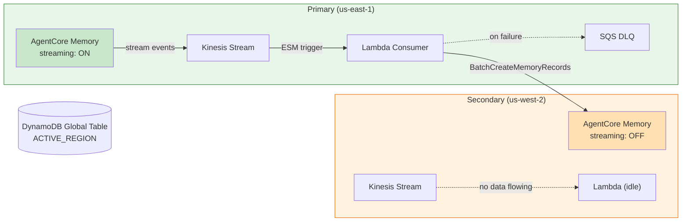
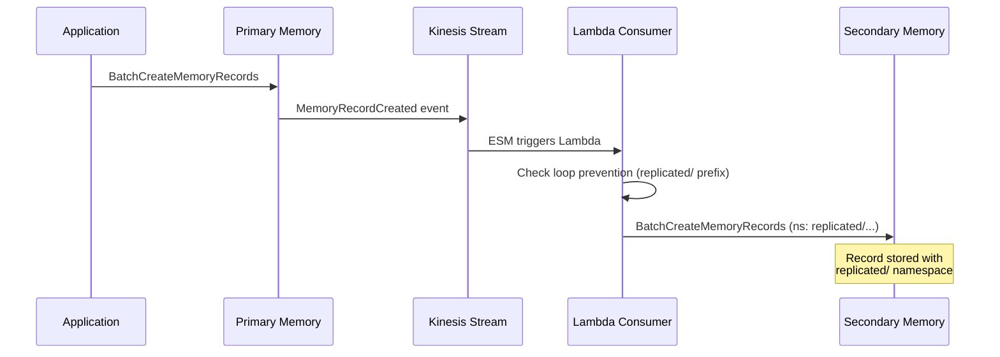
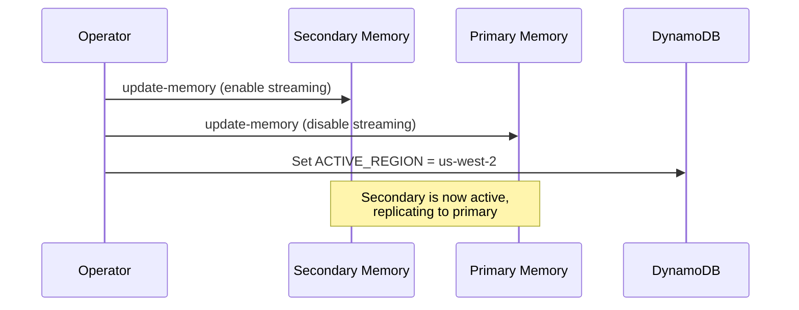

# Cross-Region Replication for Amazon Bedrock AgentCore Memory

## Overview

This tutorial demonstrates how to build **active-passive cross-region replication** for Amazon Bedrock AgentCore Memory using the [memory record streaming](https://docs.aws.amazon.com/bedrock-agentcore/latest/devguide/memory-record-streaming.html) feature. When the primary region streams a memory record event, a Lambda consumer replicates it to the secondary region in near real-time.

### Tutorial Details

| Information | Details |
|:-----------|:--------|
| Tutorial type | Cross-Region Replication |
| Feature | Memory Record Streaming + Lambda Consumer |
| Key features | Kinesis, Lambda ESM, CloudFormation, DynamoDB Global Table |
| Example complexity | Advanced |
| SDK used | boto3, AWS CLI |

### What You'll Learn

1. Deploy replication infrastructure across two regions using CloudFormation
2. Create AgentCore Memory instances with streaming enabled
3. Verify records replicate from primary to secondary in near real-time
4. Perform a failover by toggling streaming between regions
5. Clean up all resources

### Architecture



### Replication Flow



### Failover Flow



**Key design decisions:**
- Streaming is **OFF** on the secondary — zero cost from loopback events
- Lambda ESM stays enabled in both regions — when streaming is off, it sits idle
- Failover = toggle streaming (two API calls, takes seconds)
- Loop prevention via `replicated/` namespace prefix

### Prerequisites

- **Python 3.10+**
- **AWS CLI v2.34+** — AgentCore Memory APIs require a recent CLI version. Update with `brew upgrade awscli` (macOS) or `pip install --upgrade awscli`
- **boto3 >= 1.42.63** — installed automatically by the first cell
- **Amazon Bedrock AgentCore** access enabled in both `us-east-1` and `us-west-2`

### Required IAM Permissions

Your AWS credentials need permissions across the following services.

| Service | Key Actions | Why |
|:--------|:-----------|:----|
| **Bedrock AgentCore** | `CreateMemory`, `DeleteMemory`, `GetMemory`, `ListMemories`, `UpdateMemory`, `BatchCreateMemoryRecords`, `ListMemoryRecords` | Create/manage Memory instances, read/write records, configure streaming |
| **CloudFormation** | `CreateStack`, `UpdateStack`, `DeleteStack`, `DescribeStacks`, `CreateChangeSet`, `ExecuteChangeSet` | Deploy and tear down infrastructure stacks |
| **Kinesis** | `CreateStream`, `DeleteStream`, `DescribeStream`, `GetShardIterator`, `GetRecords` | Create streams, read events (Step 4) |
| **Lambda** | `CreateFunction`, `UpdateFunctionCode`, `UpdateFunctionConfiguration`, `DeleteFunction`, `CreateEventSourceMapping`, `DeleteEventSourceMapping` | Deploy the replication consumer and ESM |
| **IAM** | `CreateRole`, `PutRolePolicy`, `PassRole`, `DeleteRole`, `DeleteRolePolicy` | Create execution roles for Lambda and Memory streaming |
| **SQS** | `CreateQueue`, `DeleteQueue`, `SendMessage`, `GetQueueAttributes` | Create/manage the Dead Letter Queue |
| **DynamoDB** | `CreateTable`, `DeleteTable`, `PutItem`, `GetItem`, `DescribeTable` | Create Global Table, read/write active region config |
| **S3** | `CreateBucket`, `PutObject`, `GetObject`, `DeleteObject`, `DeleteBucket`, `ListBucket` | Store Lambda deployment packages |
| **STS** | `GetCallerIdentity` | Detect account ID |
| **CloudWatch** | `PutMetricAlarm`, `DeleteAlarms`, `PutDashboard`, `DeleteDashboards` | Create monitoring alarms and dashboard |

## Step 0: Environment Setup

We start by installing the required SDK and configuring our two target regions. The notebook uses `us-east-1` as the primary and `us-west-2` as the secondary by default — you can override these with environment variables `PRIMARY_REGION` and `SECONDARY_REGION`.

```python
!pip install -qr requirements.txt
```

```python
import os
import json
import time
import base64
import logging
import boto3
from datetime import datetime, timezone

logging.basicConfig(level=logging.INFO, format="%(asctime)s [%(levelname)s] %(message)s")

# Configure regions — override with environment variables if needed
PRIMARY_REGION = os.getenv("PRIMARY_REGION", "us-east-1")
SECONDARY_REGION = os.getenv("SECONDARY_REGION", "us-west-2")
ACCOUNT_ID = boto3.client("sts").get_caller_identity()["Account"]

# Used by the cleanup cells to find CloudFormation stacks and S3 buckets
STACK_PREFIX = "agentcore-replication"

print(f"Account: {ACCOUNT_ID}")
print(f"Primary: {PRIMARY_REGION}  Secondary: {SECONDARY_REGION}")
```

## Step 1: Deploy Infrastructure

The `scripts/deploy.sh` script orchestrates the full deployment across both regions. Here's what it does:

1. **Package Lambda** — Bundles `scripts/handler.py` with its dependencies into a zip and uploads to S3 in both regions
2. **Deploy DynamoDB Global Table** — A single-record table (`scripts/global-stack.yaml`) replicated to both regions, used to track which region is currently active
3. **Deploy per-region stacks** — Each region gets a Kinesis Data Stream, Lambda consumer, SQS Dead Letter Queue, IAM roles, and CloudWatch alarms (`scripts/regional-stack.yaml`)
4. **Create AgentCore Memory instances** — Primary with streaming ON (events flow to Kinesis), secondary without streaming (infrastructure ready but idle)
5. **Wire cross-region IDs** — Updates each region's Lambda environment variables with the remote Memory ID so it knows where to replicate
6. **Seed config** — Writes `ACTIVE_REGION = us-east-1` to DynamoDB

This takes ~5 minutes. You'll see progress output from each step below.

```python
!bash scripts/deploy.sh {PRIMARY_REGION} {SECONDARY_REGION}
```

## Step 2: Verify Deployment

The `deploy.sh` script stores both memory IDs in the DynamoDB config table. Here we read them back and confirm both memories are `ACTIVE`.

The memory IDs captured here (`primary_memory_id` and `secondary_memory_id`) are used throughout the rest of the notebook.

```python
def get_memory_id(key):
    """Look up a memory ID from the DynamoDB config table."""
    ddb = boto3.client("dynamodb", region_name=PRIMARY_REGION)
    item = ddb.get_item(TableName="AgentCoreMemoryReplicationConfig", Key={"PK": {"S": key}}).get("Item", {})
    return item.get("memory_id", {}).get("S")


# The deploy script stores memory IDs in the config table
print("Reading memory IDs from config table...")
primary_memory_id = get_memory_id("MEMORY_ID_PRIMARY")
secondary_memory_id = get_memory_id("MEMORY_ID_SECONDARY")

# Verify both memories are ACTIVE
for label, mid, region in [
    ("Primary", primary_memory_id, PRIMARY_REGION),
    ("Secondary", secondary_memory_id, SECONDARY_REGION),
]:
    if mid:
        client = boto3.client("bedrock-agentcore-control", region_name=region)
        status = client.get_memory(memoryId=mid)["memory"]["status"]
        print(f"{label} Memory: {mid} ({status})")
    else:
        print(f"{label} Memory: NOT FOUND")

assert primary_memory_id and secondary_memory_id, "Deployment incomplete — run scripts/deploy.sh first"
```

```python
# Verify active region tracking
ddb = boto3.client("dynamodb", region_name=PRIMARY_REGION)
item = ddb.get_item(TableName="AgentCoreMemoryReplicationConfig", Key={"PK": {"S": "ACTIVE_REGION"}}).get("Item", {})

print(f"Active region: {item.get('region', {}).get('S', 'NOT SET')}")
```

## Step 3: Test Replication

This is the core test. We'll create memory records in the **primary** region and verify they automatically appear in the **secondary** region.

The replication pipeline works like this:
1. We call `BatchCreateMemoryRecords` on the primary Memory
2. Because streaming is ON, each record triggers a `MemoryRecordCreated` event on the primary's Kinesis stream
3. The Lambda consumer (connected via Event Source Mapping) picks up the event
4. Lambda calls `BatchCreateMemoryRecords` on the secondary Memory, prefixing the namespace with `replicated/` to prevent loops
5. The record appears in the secondary under the `replicated/` namespace

### 3a. Create test records in the primary

We'll create 3 records with different namespaces to simulate real agent memory — user preferences and evaluations.

```python
# Create a client for the primary region's AgentCore Memory data plane
primary_client = boto3.client("bedrock-agentcore", region_name=PRIMARY_REGION)

# Test records simulating real agent memory — preferences and evaluations
test_records = [
    {"text": "User prefers Python for backend services", "ns": "user/alice"},
    {"text": "User likes event-driven architectures with Lambda", "ns": "user/alice"},
    {"text": "User is evaluating multi-region disaster recovery", "ns": "user/bob"},
]

created_ids = []
for i, rec in enumerate(test_records):
    resp = primary_client.batch_create_memory_records(
        memoryId=primary_memory_id,
        records=[
            {
                "requestIdentifier": f"test-{i}-{int(time.time())}",  # unique ID for idempotency
                "content": {"text": rec["text"]},
                "namespaces": [rec["ns"]],  # e.g. user/alice
                "timestamp": str(int(time.time())),  # epoch seconds as string
            }
        ],
    )
    rid = resp["successfulRecords"][0]["memoryRecordId"]
    created_ids.append(rid)
    print(f"Created: {rid} — {rec['text'][:60]}")

print(f"\n✅ Created {len(created_ids)} records in {PRIMARY_REGION}")
```

### 3b. Wait for replication and verify in secondary

The replication pipeline (Memory → Kinesis → Lambda → remote Memory) typically takes 10–30 seconds end-to-end. We poll the secondary's `replicated/` namespace until all 3 records appear.

If replication is working, you'll see the same record text from the primary, now stored in the secondary with `replicated/` prefixed namespaces (e.g., `replicated/user/alice`).

```python
# Create a client for the secondary region's AgentCore Memory data plane
secondary_client = boto3.client("bedrock-agentcore", region_name=SECONDARY_REGION)

# Poll the secondary for records in the 'replicated/' namespace
# The Lambda consumer prefixes namespaces with 'replicated/' when writing to the remote region
# So 'user/alice' in primary becomes 'replicated/user/alice' in secondary
print("Waiting for replication (polling every 10s, up to 120s)...\n")
start = time.time()
replicated = []

while time.time() - start < 120:
    try:
        resp = secondary_client.list_memory_records(
            memoryId=secondary_memory_id,
            namespacePath="replicated/",  # hierarchical match — finds replicated/user/alice, replicated/user/bob, etc.
        )
        replicated = resp.get("memoryRecordSummaries", [])
        if len(replicated) >= len(test_records):
            break
    except Exception:
        pass
    time.sleep(10)

elapsed = time.time() - start
print(f"Found {len(replicated)} replicated record(s) in {elapsed:.0f}s:\n")
for r in replicated:
    text = r.get("content", {}).get("text", "N/A")[:80]
    print(f"  {r['memoryRecordId']} — {text}")

if len(replicated) >= len(test_records):
    print(f"\n✅ All {len(test_records)} records replicated successfully!")
else:
    print(f"\n⚠️  Only {len(replicated)}/{len(test_records)} replicated. Check Lambda logs for errors.")
```

## Step 4: Read Kinesis Stream Events

For visibility into what's happening under the hood, let's read directly from the primary's Kinesis stream. These are the raw events that AgentCore Memory publishes when records change — the same events the Lambda consumer processes.

You should see:
- A `StreamingEnabled` event (published when streaming was first configured)
- `MemoryRecordCreated` events for each record we created in Step 3

Each event includes the event type, memory record ID, namespaces, and (with `FULL_CONTENT` level) the actual record text.

```python
# Read raw events from the primary's Kinesis stream
# These are the same events the Lambda consumer processes
kinesis = boto3.client("kinesis", region_name=PRIMARY_REGION)
stream_info = kinesis.describe_stream(StreamName="agentcore-memory-stream")
shard_id = stream_info["StreamDescription"]["Shards"][0]["ShardId"]

# Start from the oldest available record (TRIM_HORIZON)
iterator = kinesis.get_shard_iterator(
    StreamName="agentcore-memory-stream",
    ShardId=shard_id,
    ShardIteratorType="TRIM_HORIZON",
)["ShardIterator"]

events = []
for _ in range(5):  # poll up to 5 times
    resp = kinesis.get_records(ShardIterator=iterator, Limit=100)
    for rec in resp["Records"]:
        data = base64.b64decode(rec["Data"]) if isinstance(rec["Data"], str) else rec["Data"]
        events.append(json.loads(data))
    iterator = resp["NextShardIterator"]
    if not resp["Records"]:
        time.sleep(2)

print(f"Read {len(events)} event(s) from Kinesis:\n")
for i, evt in enumerate(events[:10]):
    se = evt.get("memoryStreamEvent", {})
    print(f"  [{se.get('eventType', '?')}] {se.get('memoryRecordId', 'N/A')[:40]}  ns={se.get('namespaces', [])}")
```

## Step 5: Test Failover

Now we simulate a regional failure by switching the active region from primary to secondary. The failover process is:

1. **Enable streaming on secondary** — the secondary's Kinesis stream starts receiving events, and its Lambda begins replicating to the primary
2. **Disable streaming on primary** — the primary stops publishing events
3. **Update DynamoDB** — set `ACTIVE_REGION` to the secondary so your application layer knows where to point

The order matters: enable the new path **before** disabling the old one. This ensures zero replication gap. If both regions briefly have streaming on, the `replicated/` namespace prefix prevents infinite loops.

### 5a. Toggle streaming

```python
# Enable secondary FIRST — this starts the reverse replication path
# before we cut off the forward path. No replication gap.
!bash scripts/toggle-streaming.sh enable {SECONDARY_REGION}

# Then disable primary — it stops publishing events to Kinesis
!bash scripts/toggle-streaming.sh disable {PRIMARY_REGION}
```

```python
# Update active region in DynamoDB
ddb.put_item(
    TableName="AgentCoreMemoryReplicationConfig",
    Item={
        "PK": {"S": "ACTIVE_REGION"},
        "region": {"S": SECONDARY_REGION},
        "updated_at": {"S": datetime.now(timezone.utc).strftime("%Y-%m-%dT%H:%M:%SZ")},
        "updated_by": {"S": "notebook-failover"},
    },
)
print(f"Active region updated to: {SECONDARY_REGION}")
```

### 5b. Verify failover — write to secondary, check replication to primary

With the secondary now active, let's prove replication works in the reverse direction. We'll create a record in the secondary and verify it appears in the primary's `replicated/` namespace.

This confirms the full failover: the secondary is now the source of truth, and the primary is receiving replicated data.

```python
# Write a record to the secondary (now the active region)
resp = secondary_client.batch_create_memory_records(
    memoryId=secondary_memory_id,
    records=[
        {
            "requestIdentifier": f"failover-test-{int(time.time())}",
            "content": {"text": "Record created during failover in secondary region"},
            "namespaces": ["user/failover-test"],
            "timestamp": str(int(time.time())),
        }
    ],
)
failover_id = resp["successfulRecords"][0]["memoryRecordId"]
print(f"Created in secondary: {failover_id}")

# Poll the primary for the replicated record
# The secondary's Lambda is now replicating to the primary
print("Waiting for replication to primary (polling every 10s, up to 120s)...\n")
start = time.time()
recs = []
while time.time() - start < 120:
    try:
        recs = primary_client.list_memory_records(memoryId=primary_memory_id, namespacePath="replicated/").get(
            "memoryRecordSummaries", []
        )
        if recs:
            break
    except Exception:
        pass
    time.sleep(10)

if recs:
    for r in recs:
        print(f"  {r['memoryRecordId']} — {r.get('content', {}).get('text', '')[:80]}")
    print(f"\n✅ Failover replication working! ({time.time() - start:.0f}s)")
else:
    print("⚠️  No replicated records yet — check Lambda logs in secondary region")
```

### 5c. Failback — restore primary as active

Failback is the same process in reverse: enable primary streaming, disable secondary, update DynamoDB. After this, the system is back to its original configuration.

```python
# Failback: restore original configuration
# Same process in reverse — enable primary, disable secondary
!bash scripts/toggle-streaming.sh enable {PRIMARY_REGION}
!bash scripts/toggle-streaming.sh disable {SECONDARY_REGION}

# Update the config table so the application layer knows primary is active again
ddb.put_item(
    TableName="AgentCoreMemoryReplicationConfig",
    Item={
        "PK": {"S": "ACTIVE_REGION"},
        "region": {"S": PRIMARY_REGION},
        "updated_at": {"S": datetime.now(timezone.utc).strftime("%Y-%m-%dT%H:%M:%SZ")},
        "updated_by": {"S": "notebook-failback"},
    },
)
print(f"\n✅ Failback complete. Active region: {PRIMARY_REGION}")
```

## Step 6: Cleanup

Delete all resources created by this tutorial. This removes:
- AgentCore Memory instances in both regions (waits for deletion to complete)
- CloudFormation stacks (Kinesis, Lambda, SQS, IAM, CloudWatch) in both regions
- DynamoDB Global Table
- S3 buckets used for Lambda deployment packages

> **Cost note:** Kinesis Data Streams incur hourly charges per shard (~$11/month each). Be sure to run cleanup when you're done to avoid ongoing costs.

```python
# Delete AgentCore Memory instances
for region, mid in [
    (PRIMARY_REGION, primary_memory_id),
    (SECONDARY_REGION, secondary_memory_id),
]:
    try:
        client = boto3.client("bedrock-agentcore-control", region_name=region)
        client.delete_memory(memoryId=mid)
        print(f"Deleting memory {mid} in {region}...")
        # Wait for deletion
        for _ in range(30):
            try:
                status = client.get_memory(memoryId=mid)["memory"]["status"]
                if status == "DELETING":
                    time.sleep(5)
                else:
                    break
            except client.exceptions.ResourceNotFoundException:
                print("  ✅ Deleted")
                break
    except Exception as e:
        print(f"  Error: {e}")
```

```python
# Delete CloudFormation stacks
for region in [PRIMARY_REGION, SECONDARY_REGION]:
    cf = boto3.client("cloudformation", region_name=region)
    try:
        cf.delete_stack(StackName=f"{STACK_PREFIX}-regional")
        print(f"Deleting regional stack in {region}...")
    except Exception as e:
        print(f"  Error: {e}")

# Global stack (only in primary)
try:
    cf_primary = boto3.client("cloudformation", region_name=PRIMARY_REGION)
    cf_primary.delete_stack(StackName=f"{STACK_PREFIX}-global")
    print("Deleting global stack...")
except Exception as e:
    print(f"  Error: {e}")

# Clean up S3 buckets
for region in [PRIMARY_REGION, SECONDARY_REGION]:
    bucket = f"{STACK_PREFIX}-artifacts-{ACCOUNT_ID}-{region}"
    try:
        s3 = boto3.client("s3", region_name=region)
        objs = s3.list_objects_v2(Bucket=bucket).get("Contents", [])
        for obj in objs:
            s3.delete_object(Bucket=bucket, Key=obj["Key"])
        s3.delete_bucket(Bucket=bucket)
        print(f"Deleted S3 bucket: {bucket}")
    except Exception as e:
        print(f"  S3 cleanup ({bucket}): {e}")

print("\n✅ Cleanup complete")
```

## Conclusion

In this tutorial you built end-to-end cross-region replication for AgentCore Memory:

1. **Deployed infrastructure** — Kinesis streams, Lambda consumers, SQS DLQs, IAM roles, and CloudWatch alarms in two regions
2. **Created Memory instances** — primary with streaming ON, secondary with streaming OFF
3. **Verified replication** — records created in primary appeared in secondary's `replicated/` namespace
4. **Tested failover/failback** — toggled streaming between regions in seconds

### Key Takeaways

| Metric | Value |
|:-------|:------|
| RPO (Recovery Point Objective) | 5–15 seconds |
| RTO (Recovery Time Objective) | 15–30 seconds |
| Failover mechanism | Toggle streaming via `update-memory` API |
| Loop prevention | `replicated/` namespace prefix |
| Conflict resolution | AgentCore Memory native consolidation |

### Next Steps

- Add CloudWatch alarms for automated failover detection
- Integrate with Route 53 health checks for DNS-level failover
- Extend to 3+ region topologies
- Add cross-account replication support
