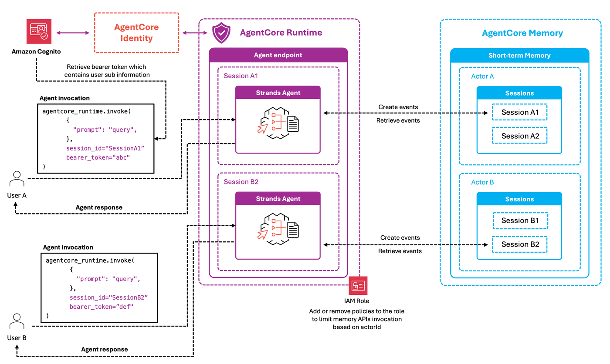

# Amazon Bedrock AgentCore Runtime and AgentCore Memory Agent with Identity Isolation using IAM

## Overview

This tutorial demonstrates how to implement secure memory isolation in conversational agents using Amazon Bedrock AgentCore Memory with IAM-based identity propagation. You'll build a memory-enabled agent that automatically partitions and isolates conversation history based on authenticated user credentials, ensuring data privacy and security in multi-tenant environments.

Memory isolation is a critical security requirement for production conversational agents. Without proper isolation, users could potentially access conversation history from other users, leading to privacy violations and data leakage. This tutorial focuses on leveraging IAM policies to create secure, isolated memory spaces for each individual user.

The implementation demonstrates how AgentCore Memory integrates with AWS IAM to automatically enforce memory boundaries based on authenticated user credentials.

### Tutorial Details

| Information         | Details                                                          |
|---------------------|------------------------------------------------------------------|
| Tutorial type       | Security & Identity Management                                   |
| Agent type          | Single Conversational Agent                                      |
| Agentic Framework   | Strands Agents                                                   |
| LLM model           | Anthropic Claude Haiku 4.5                                      |
| Key features        | Memory Isolation, IAM, User Context         |
| SDK used            | boto3, bedrock-agentcore, bedrock-agentcore-starter-toolkit      |

### What You'll Learn

In this tutorial, you'll learn:
1. How to configure IAM policies for memory isolation in AgentCore Memory
2. How to propagate user identity through the agent invocation
3. How to deploy and test multi-user agents with isolated memory spaces
4. How to verify memory isolation between different users using IAM policies


### Architecture

This example demonstrates a conversational agent deployed to AgentCore Runtime with IAM-based memory isolation:

<div style="text-align:left">
    
</div>

## 0. Prerequisites

To execute this tutorial you will need:
* Python 3.10 or newer
* AWS credentials configured with appropriate permissions for Bedrock, ECR, IAM, and Cognito
* Amazon Bedrock AgentCore SDK and dependencies

First, let's install the required libraries.

```python
!pip install -qUr requirements.txt
```

### Setting Up Environment

Let's import the required libraries and configure our environment. We'll be using:
- `boto3` for AWS service interactions
- `bedrock_agentcore.memory` for managing agent memory
- Various utility functions for setting up authentication

```python
# Imports
import os
import uuid
import logging
from bedrock_agentcore_starter_toolkit.operations.memory.manager import MemoryManager
from utils import (
    setup_cognito_user_pool,
    reauthenticate_users,
    get_user_sub,
    create_agentcore_role,
)

# Configuration
logging.basicConfig(level=logging.INFO, format="%(asctime)s [%(levelname)s] %(name)s: %(message)s")
logger = logging.getLogger("runtime-memory-agent")
REGION = os.getenv("AWS_REGION", "us-west-2")
```

## 1. Creating the Amazon Cognito User Pool

In this section, we'll create an Amazon Cognito User Pool and users. Cognito provides user authentication and identity management for our agent, ensuring that each user's conversation history is accessible only to that user.

The `setup_cognito_user_pool` function will:
1. Create a Cognito User Pool if it doesn't exist
2. Set up app clients for authentication
3. Create 2 test users with temporary passwords
4. Generate access tokens for testing

```python
print("Setting up Amazon Cognito user pool and users...")
cognito_config = setup_cognito_user_pool(region=REGION)
print("Cognito setup completed ✓")
```

## 2. Creating Memory Resource

In this section, we'll create a memory resource for our agent to store conversation history. Memory allows the agent to recall past interactions, maintain context, and provide more coherent responses over time.

For this example, we'll create a simple short-term memory resource without any additional long-term strategies. The memory will store all conversation messages, helping our agent remember previous interactions when continuing a session after it has been terminated in AgentCore Runtime.

```python
# Create unique identifier for this resource
unique_id = str(uuid.uuid4())[:8]
memory_name = f"RuntimeIdentityMemoryAgent_{unique_id}"

# Initialize Memory Manager
memory_manager = MemoryManager(region_name=REGION)

# Create memory
print("\n🧠 Creating memory...")
print("   This takes 2-3 minutes...\n")

memory = memory_manager.get_or_create_memory(
    name=memory_name,
    strategies=[],
    description="Memory isolation with IAM example.",
    event_expiry_days=30,  # Optional: adjust as needed
)

MEMORY_ID = memory.get("id")
print("\n✅ Memory created successfully!")
print(f"   Memory ID: {MEMORY_ID}")
print(f"   Status: {memory.get('status')}")
```

## 3. Creating Your Memory-Enabled Agent

In this section, we'll build our memory-enabled agent using Strands Agents framework with custom hooks for memory integration. This agent will maintain conversation context by storing and retrieving messages from AgentCore Memory.

> **Why Memory Matters**: Sessions in AgentCore runtime expire after a certain time, which deletes the conversation context. By storing conversations in memory, we ensure previous information persists between sessions, creating a seamless experience for users even after long breaks.

### Agent Capabilities

Our agent will:
1. Store each user and assistant message in memory automatically
2. Retrieve past conversation history when continuing an existing session
3. Maintain context across multiple interactions with the same user
4. Isolate conversations between different users through user identity verification

### Key Components of Our Implementation

#### 1. Memory Hook Provider
Our custom hook provider implements:
- `on_agent_initialized`: Triggered when the agent starts, retrieves conversation history from AgentCore Memory
- `on_message_added`: Triggered when a new message is added to the conversation, stores it in AgentCore Memory

#### 2. Agent Initialization
The `initialize_agent` function:
- Configures the memory hook with the correct region
- Sets up the agent with proper state variables (memory_id, actor_id, session_id)
- Configures the system prompt for the LLM

#### 3. User verification
The `get_user_sub` function:
- Verifies a Cognito access token against JWKS and returns the user's sub (unique ID).

#### 4. Entry Point Handler
The runtime_memory_agent function:
- Parses input payload and extracts user message
- Verifies user identity using JWT tokens from Cognito
- Manages agent initialization and session tracking
- Handles invocation of the agent with proper context
- Returns formatted responses to the runtime environment

Let's create our agent file:

```python
%%writefile runtime_identity_memory_agent.py
import os
import jwt
import ast
import json
import logging
from strands import Agent
from jwt import PyJWKClient
from typing import Dict, Any
from strands.models import BedrockModel
from bedrock_agentcore.memory.session import MemorySessionManager
from bedrock_agentcore.runtime import BedrockAgentCoreApp
from strands.hooks import AgentInitializedEvent, HookProvider, HookRegistry, MessageAddedEvent
from bedrock_agentcore.memory.constants import StrategyType, ConversationalMessage, MessageRole

# Configure detailed logging
logging.basicConfig(
    level=logging.INFO,
    format='%(asctime)s [%(levelname)s] %(name)s: %(message)s'
)
logger = logging.getLogger("runtime-memory-agent")

# Initialize the agent core app
app = BedrockAgentCoreApp()

MODEL_ID = os.getenv('MODEL_ID')
MEMORY_ID = os.getenv('MEMORY_ID')
COGNITO_USER_POOL = os.getenv('COGNITO_USER_POOL')
REGION = os.getenv('AWS_REGION')

# Global agent instance - will be initialized with first request
agent = None

class MemoryHookProvider(HookProvider):

    def __init__(self):
        logger.info(f"Initializing MemoryHookProvider")
        self.memory_session_manager = MemorySessionManager(MEMORY_ID, REGION)
    
    def on_agent_initialized(self, event: AgentInitializedEvent):
        """Load recent conversation history when agent starts"""
        logger.info("Agent initialization hook triggered")
        
        actor_id = event.agent.state.get("actor_id")
        session_id = event.agent.state.get("session_id")
        
        logger.info(f"State values - actor_id: {actor_id}, session_id: {session_id}")
        
        if not all([actor_id, session_id]):
            logger.warning("Missing required state values")
            return
        
        try:
            # Check if the session exists
            logger.info(f"Checking if session {session_id} exists...")
            session_exists = False
            try:
                events = self.memory_session_manager.list_events(
                    actor_id=actor_id,
                    session_id=session_id,
                    max_results=1
                )
                session_exists = len(events) > 0
                logger.info(f"Session exists: {session_exists}")
            except Exception as e:
                logger.warning(f"Error checking session existence: {e}")
                session_exists = False
            
            if not session_exists:
                logger.info(f"No existing conversation found for session {session_id}")
                return
            
            # Load conversation history
            logger.info(f"Loading conversation history for existing session {session_id}")
            recent_turns = self.memory_session_manager.get_last_k_turns(
                actor_id=actor_id,
                session_id=session_id,
                k=5
            )            

            if recent_turns:
                logger.info(f"✅ Loaded {len(recent_turns)} conversation turns from memory")
                
                # Add messages to agent's conversation history
                for turn in reversed(recent_turns):
                    for message in turn:
                        role = message['role'].lower()  # 'user' or 'assistant'
                        parsed = ast.literal_eval(message['content']['text'])
                        content = parsed[0]['text']
                        
                        # Add to agent's message history
                        event.agent.messages.append({
                            "role": role,
                            "content": [{"text": content}]
                        })
                        logger.info(f"Added {role} message to history: {content[:50]}...")
                
                logger.info(f"✅ Added {len(event.agent.messages)} messages to conversation history")
            else:
                logger.info("No recent turns found for this session")
                    
        except Exception as e:
            logger.error(f"❌ Memory load error: {e}", exc_info=True)
    
    def on_message_added(self, event: MessageAddedEvent):
        """Store messages in memory"""
        logger.info("💬 Message added - storing in memory")
        
        actor_id = event.agent.state.get("actor_id")
        session_id = event.agent.state.get("session_id")
        
        if not all([actor_id, session_id]):
            logger.warning("Missing required state values")
            return
        
        try:
            messages = event.agent.messages
            last_message = messages[-1]
            message_content = str(last_message.get("content", ""))
            if last_message["role"] == "user":
                message_role = MessageRole.USER
            elif last_message["role"] == "assistant":
                message_role = MessageRole.ASSISTANT
            
            self.memory_session_manager.add_turns(
                actor_id=actor_id,
                session_id=session_id,
                messages=[ConversationalMessage(message_content, message_role)]
            )
            logger.info("✅ Message stored")
            
        except Exception as e:
            logger.error(f"❌ Error storing message: {e}")
    
    def register_hooks(self, registry: HookRegistry):
        logger.info("Registering memory hooks")
        registry.add_callback(MessageAddedEvent, self.on_message_added)
        registry.add_callback(AgentInitializedEvent, self.on_agent_initialized)

def initialize_agent(actor_id, session_id):
    """Initialize the agent for first use"""
    global agent
    
    logger.info(f"Initializing agent for actor_id={actor_id}, session_id={session_id}")
    
    # Create model and memory hook
    logger.info(f"Setting model ID: {MODEL_ID}")
    model = BedrockModel(model_id=MODEL_ID)
    logger.info(f"Creating memory hook")
    memory_hook = MemoryHookProvider()
    
    # Create agent with proper initial state
    logger.info("Creating agent with memory hook")
    agent = Agent(
        model=model,
        hooks=[memory_hook],
        system_prompt="You're a helpful, memory-enabled agent deployed on AgentCore Runtime. You can remember previous interactions within the same session. Be friendly and concise in your responses.",
        state={
            "actor_id": actor_id,
            "session_id": session_id
        }
    )
    logger.info(f"✅ Agent initialized with state: {agent.state.get()}")

def get_user_sub(access_token: str, region: str, user_pool_id: str) -> str:
    """
    Verifies a Cognito access token against JWKS and returns the user's sub (unique ID).

    :param access_token: The JWT access token string
    :param region: AWS region of the Cognito User Pool
    :param user_pool_id: The Cognito User Pool ID
    :return: The user's 'sub' claim if the token is valid
    :raises jwt.InvalidTokenError: If verification fails
    """
    access_token = access_token[7:]
    jwks_url = f"https://cognito-idp.{region}.amazonaws.com/{user_pool_id}/.well-known/jwks.json"
    jwks_client = PyJWKClient(jwks_url)
    signing_key = jwks_client.get_signing_key_from_jwt(access_token)

    decoded = jwt.decode(
        access_token,
        signing_key.key,
        algorithms=["RS256"],
        issuer=f"https://cognito-idp.{region}.amazonaws.com/{user_pool_id}",
        options={"require": ["exp", "iat", "iss", "token_use"]}
    )

    if decoded.get("token_use") != "access":
        raise jwt.InvalidTokenError("Token is not an access token")

    return decoded["sub"]

@app.entrypoint
def runtime_memory_agent(payload, context):
    """
    Main entry point for the memory-enabled agent
    
    Args:
        payload: The input payload containing user data
        context: The runtime context object containing session information
    """
    global agent
    
    # Log both payload and context info
    logger.info(f"Received payload: {payload}")
    logger.info(f"Context: {context}")
    logger.info(f"User Sub: {get_user_sub(context.request_headers.get('Authorization'), REGION, COGNITO_USER_POOL)}")
    
    # Extract and validate required values
    user_input = payload.get("prompt")
    actor_id = get_user_sub(context.request_headers.get('Authorization'), REGION, COGNITO_USER_POOL)
    session_id = context.session_id  # Get session_id from context
    
    # Validate required fields
    if user_input is None:
        error_msg = "❌ ERROR: Missing 'prompt' field in payload"
        logger.error(error_msg)
        return error_msg
    
    # Initialize agent on first request
    if agent is None:
        logger.info("First request - initializing agent")
        initialize_agent(actor_id, session_id)
    else:
        logger.info("Using existing agent instance")
        # Update the session ID in case it changed
        if agent.state.get("session_id") != session_id:
            logger.info(f"Updating session ID to {session_id}")
            agent.state.set("session_id", session_id)
        if agent.state.get("actor_id") != actor_id:
            logger.info(f"Updating actor ID to {actor_id}")
            agent.state.set("actor_id", actor_id)
    
    logger.info(f"Agent System Prompt: {agent.system_prompt}")
    # Invoke the agent with the user's input
    logger.info(f"Invoking agent with input: {user_input}")
    response = agent(user_input)
    response_text = response.message['content'][0]['text']
    logger.info(f"✅ Agent response: {response_text[:50]}...")
    
    return response_text

if __name__ == "__main__":
    logger.info("Starting AgentCore application")
    app.run()
```

## 4. Deploying to AgentCore Runtime

In this section, we'll deploy our agent to Amazon Bedrock AgentCore Runtime, a managed agent runtime environment that provides scalability and simplified operations. AgentCore Runtime handles the infrastructure complexity, allowing you to focus on your agent's logic rather than deployment concerns.

Unlike traditional deployment methods that require manual server setup and management, AgentCore Runtime deploys your agent containers to AWS infrastructure, and provides secure HTTPS endpoints for invocation. This approach ensures your agent can scale with demand and operate reliably in production environments.

> 💡 **Tip**: The AgentCore starter toolkit handles all the complex deployment steps for us, including IAM roles, ECR repositories, and container builds.

### Configure the Deployment

Let's set up our deployment configuration:

```python
iam_role = create_agentcore_role(agent_name=f"runtime_memory_agent_{unique_id}", region=REGION)
```

```python
from bedrock_agentcore_starter_toolkit import Runtime
import time

agentcore_runtime = Runtime()
agent_name = f"runtime_memory_agent_{unique_id}"

response = agentcore_runtime.configure(
    entrypoint="runtime_identity_memory_agent.py",
    execution_role=iam_role["Role"]["RoleName"],
    auto_create_ecr=True,
    requirements_file="requirements.txt",
    region=REGION,
    agent_name=agent_name,
    non_interactive=True,
    memory_mode="NO_MEMORY",
    idle_timeout=60,
    request_header_configuration={"requestHeaderAllowlist": ["Authorization"]},
    authorizer_configuration={
        "customJWTAuthorizer": {
            "discoveryUrl": cognito_config.get("discovery_url"),
            "allowedClients": [cognito_config.get("client_id")],
        }
    },
)
response
```

### Launch the agent

Now let's launch our agent to AgentCore Runtime. This step takes our configured agent and deploys it to AgentCore's managed infrastructure. During this process, we're also passing in the essential environment variables our agent needs: the memory ID we created earlier, the model ID to use, the AWS region, and the Cognito user pool ID for authentication.

Once deployed, our agent will be accessible through a secure endpoint that we can invoke with user messages. The endpoint will be protected by Cognito authentication, ensuring only authorized users can access our agent.

```python
launch_result = agentcore_runtime.launch(
    env_vars={
        "MEMORY_ID": MEMORY_ID,
        "MODEL_ID": "us.anthropic.claude-haiku-4-5-20251001-v1:0",
        "AWS_REGION": REGION,
        "COGNITO_USER_POOL": cognito_config["pool_id"],
    }
)
```

```python
status_response = agentcore_runtime.status()
status = status_response.endpoint["status"]
end_status = ["READY", "CREATE_FAILED", "DELETE_FAILED", "UPDATE_FAILED"]

while status not in end_status:
    time.sleep(10)
    status_response = agentcore_runtime.status()
    status = status_response.endpoint["status"]
    print(f"Current status: {status}")

if status == "READY":
    print("✅ Agent successfully deployed!")
else:
    print(f"❌ Deployment ended with status: {status}")

account_id = status_response.config.account
role_arn = status_response.config.execution_role
role_name = role_arn.split("/")[-1]
print(f"Account ID is {account_id}")
print(f"Agent role is {role_arn}")
print(f"Role name is {role_name}")
```

## 5. Testing Your Agent

Now that our agent is deployed, let's test it by sending messages and verifying that it can remember previous interactions. We'll also test that different users have isolated memory contexts, ensuring that one user's conversation isn't visible to another user.

**Important Notes on Session Management**

- **Session Management**: While AgentCore Runtime will automatically generate a session ID if one isn't provided, it's recommended to explicitly manage session IDs in your application. This gives you better control over:
  - Continuing conversations after session timeouts
  - Creating new sessions when appropriate (e.g., user starts a new conversation)
  - Handling multiple parallel conversations with the same user
  - Implementing session expiration policies based on your application's needs

- **Memory Persistence**: Even if a session expires in AgentCore Runtime, our agent can retrieve previous conversations from AgentCore Memory when a new session starts with the same user.

```python
# Re-authenticate if needed
tokens = reauthenticate_users(cognito_config["client_id"], REGION)
cognito_config["bearer_tokens"]["testuser1"] = tokens["testuser1"]
cognito_config["bearer_tokens"]["testuser2"] = tokens["testuser2"]
```

```python
import time
import boto3
import json


def test_user_memory_isolation_with_iam():
    """
    Test user memory isolation with dynamic IAM policy controls using Cognito subject IDs.
    """
    print("\n" + "=" * 50)
    print("USER MEMORY ISOLATION WITH IAM POLICY TEST")
    print("=" * 50)

    # Setup IAM client
    iam_client = boto3.client("iam")

    # Extract bearer tokens
    testuser1_token = cognito_config["bearer_tokens"]["testuser1"]
    testuser2_token = cognito_config["bearer_tokens"]["testuser2"]

    user_pool_id = cognito_config["pool_id"]

    # Get Cognito subs (these will be our actor IDs)
    testuser1_actor_id = get_user_sub(testuser1_token, REGION, user_pool_id)
    testuser2_actor_id = get_user_sub(testuser2_token, REGION, user_pool_id)

    print(f"TestUser1 Cognito Sub (actor ID): {testuser1_actor_id}")
    print(f"TestUser2 Cognito Sub (actor ID): {testuser2_actor_id}")

    # Define the dynamic policy template
    def create_actor_policy(actor_id, policy_name):
        policy_document = {
            "Version": "2012-10-17",
            "Statement": [
                {
                    "Sid": "DynamicActorIdRestriction",
                    "Effect": "Allow",
                    "Action": [
                        "bedrock-agentcore:CreateEvent",
                        "bedrock-agentcore:GetEvent",
                        "bedrock-agentcore:GetMemory",
                        "bedrock-agentcore:GetMemoryRecord",
                        "bedrock-agentcore:ListActors",
                        "bedrock-agentcore:ListEvents",
                        "bedrock-agentcore:ListMemoryRecords",
                        "bedrock-agentcore:ListSessions",
                        "bedrock-agentcore:DeleteEvent",
                        "bedrock-agentcore:DeleteMemoryRecord",
                        "bedrock-agentcore:RetrieveMemoryRecords",
                    ],
                    "Resource": [f"arn:aws:bedrock-agentcore:{REGION}:{account_id}:memory/*"],
                    "Condition": {"StringEquals": {"bedrock-agentcore:actorId": actor_id}},
                }
            ],
        }

        try:
            # Create or update the policy
            try:
                response = iam_client.create_policy(
                    PolicyName=policy_name,
                    PolicyDocument=json.dumps(policy_document),
                    Description=f"Dynamic actor restriction policy for {actor_id}",
                )
                policy_arn = response["Policy"]["Arn"]
            except iam_client.exceptions.EntityAlreadyExistsException:
                # Update existing policy
                policy_arn = f"arn:aws:iam::{account_id}:policy/{policy_name}"
                iam_client.create_policy_version(
                    PolicyArn=policy_arn,
                    PolicyDocument=json.dumps(policy_document),
                    SetAsDefault=True,
                )

            # Attach policy to role
            iam_client.attach_role_policy(RoleName=role_name, PolicyArn=policy_arn)

            print(f"Policy updated for Cognito sub (actor ID): {actor_id}")
            return policy_arn

        except Exception as e:
            print(f"Error updating policy: {e}")
            raise

    # Define function to reset policy
    def detach_policy(policy_arn):
        try:
            iam_client.detach_role_policy(RoleName=role_name, PolicyArn=policy_arn)
            print(f"Policy {policy_arn} detached")
        except Exception as e:
            print(f"Error detaching policy: {e}")

    # Create unique session IDs for each test phase
    user1_session_id = f"memory-agent-session-user1-{int(time.time())}"
    user2_session_id = f"memory-agent-session-user2-{int(time.time())}"

    # Create policy for this test
    policy_name = f"actor-restriction-{int(time.time())}"

    try:
        # PHASE 1: Test with user1's memory persistence with correct policy
        print("\n" + "=" * 50)
        print("PHASE 1: USER 1 MEMORY PERSISTENCE TEST")
        print("=" * 50)

        # Create policy for user 1
        policy_arn = create_actor_policy(testuser1_actor_id, policy_name)

        # Wait for policy to propagate
        print("Waiting for IAM policy to propagate...")
        time.sleep(10)

        # Step 1: User 1 shares initial information
        print("\n" + "-" * 50)
        print("STEP 1: User 1 shares information")
        print("-" * 50)

        user1_prompt1 = "My name is John and my favorite color is purple."
        response1 = agentcore_runtime.invoke(
            {"prompt": user1_prompt1},
            session_id=user1_session_id,
            bearer_token=testuser1_token,
        )
        print(f'User 1 prompt: "{user1_prompt1}"')
        print(f'User 1 response: "{response1["response"]}"')

        # Wait for session to terminate (75 seconds)
        print("\nWaiting 75 seconds for session to terminate...")
        time.sleep(75)

        # Step 2: User 1 asks to recall information (should work with policy)
        print("\n" + "-" * 50)
        print("STEP 2: User 1 recalls information (should succeed)")
        print("-" * 50)

        user1_prompt2 = "What is my name and favorite color?"
        response2 = agentcore_runtime.invoke(
            {"prompt": user1_prompt2},
            session_id=user1_session_id,
            bearer_token=testuser1_token,
        )
        print(f'User 1 prompt: "{user1_prompt2}"')
        print(f'User 1 response: "{response2["response"]}"')

        # PHASE 2: Test user2 memory isolation with policy control
        print("\n" + "=" * 50)
        print("PHASE 2: USER 2 MEMORY ISOLATION TEST")
        print("=" * 50)

        # Step 3: User 2 shares information (will create memory but should work as API call)
        print("\n" + "-" * 50)
        print("STEP 3: User 2 shares information")
        print("-" * 50)

        # Temporarily change policy to user 2 to allow initial interaction
        detach_policy(policy_arn)
        policy_arn = create_actor_policy(testuser2_actor_id, policy_name)

        # Wait for policy update to propagate
        print("Waiting for updated IAM policy to propagate...")
        time.sleep(10)

        user2_prompt1 = "My name is Mary and my favorite food is pasta."
        response3 = agentcore_runtime.invoke(
            {"prompt": user2_prompt1},
            session_id=user2_session_id,
            bearer_token=testuser2_token,
        )
        print(f'User 2 prompt: "{user2_prompt1}"')
        print(f'User 2 response: "{response3["response"]}"')

        # Wait for session to terminate
        print("\nWaiting 75 seconds for session to terminate...")
        time.sleep(75)

        # Step 4: Change policy back to user 1, then user 2 tries to recall (should fail)
        print("\n" + "-" * 50)
        print("STEP 4: Change policy to User 1, User 2 tries to recall (should fail)")
        print("-" * 50)

        # Change policy back to user 1
        detach_policy(policy_arn)
        policy_arn = create_actor_policy(testuser1_actor_id, policy_name)

        # Wait for policy update to propagate
        print("Waiting for updated IAM policy to propagate…")
        time.sleep(10)

        user2_prompt2 = "What is my name and favorite food?"
        response4 = agentcore_runtime.invoke(
            {"prompt": user2_prompt2},
            session_id=user2_session_id,
            bearer_token=testuser2_token,
        )
        print(f'User 2 prompt: "{user2_prompt2}"')
        print(f'User 2 response: "{response4["response"]}"')
        print("\n Agent should not have access to User 2 Memory as the policy is giving access only to User 1 events")

    finally:
        # Clean up - remove the policy
        detach_policy(policy_arn)
```

```python
test_user_memory_isolation_with_iam()
```

## Key Concepts

In this tutorial, you've learned several important concepts for building memory-enabled agents with Bedrock AgentCore:

1. **Memory Integration**: How to use AgentCore Memory to store conversation history across sessions, enabling your agent to maintain context over time even when sessions expire.

2. **Session Management**: How to use session IDs to organize conversations and retrieve relevant history when a user returns, creating a seamless experience.

3. **AgentCore Deployment**: How to deploy your agent to a production runtime environment that handles scaling, security, and infrastructure management automatically.

4. **Memory Hooks**: How to implement custom hooks that integrate with memory services, allowing you to store and retrieve conversation history at specific points in the agent lifecycle.

5. **User Identity and Privacy**: How to use authentication to ensure that each user's conversation history is private and isolated from other users.

These concepts provide a foundation for building more complex agents with persistent memory and sophisticated conversation management capabilities.

## Cleanup (Optional)

If you no longer need the resources created in this tutorial, you can clean them up to avoid unnecessary AWS charges.

```python
# Only run this cell if you want to delete all resources

# 1. Delete the AgentCore Runtime
if "launch_result" in locals() and hasattr(launch_result, "agent_id"):
    try:
        agentcore_control_client = boto3.client("bedrock-agentcore-control", region_name=REGION)

        runtime_delete_response = agentcore_control_client.delete_agent_runtime(
            agentRuntimeId=launch_result.agent_id,
        )
        print(f"✅ Deleted AgentCore Runtime: {launch_result.agent_id}")
    except Exception as e:
        print(f"❌ Error deleting AgentCore Runtime: {e}")
else:
    print("No AgentCore Runtime to delete")

# 2. Delete the ECR repository
if "launch_result" in locals() and hasattr(launch_result, "ecr_uri"):
    try:
        ecr_client = boto3.client("ecr", region_name=REGION)

        repository_name = launch_result.ecr_uri.split("/")[1]
        response = ecr_client.delete_repository(
            repositoryName=repository_name,
            force=True,  # Force deletion even if it contains images
        )
        print(f"✅ Deleted ECR repository: {repository_name}")
    except Exception as e:
        print(f"❌ Error deleting ECR repository: {e}")
else:
    print("No ECR repository to delete")

# 3. Delete the memory resource
try:
    memory_manager.delete_memory(memory_id=MEMORY_ID)
    print(f"✅ Deleted memory resource: {MEMORY_ID}")
except Exception as e:
    print(f"❌ Error deleting memory resource: {e}")

# 4. Delete the Cognito User Pool and associated resources
if "cognito_config" in locals() and cognito_config and "pool_id" in cognito_config:
    try:
        cognito_client = boto3.client("cognito-idp", region_name=REGION)

        # Get the user pool ID
        pool_id = cognito_config["pool_id"]

        # List and delete all user pool clients
        clients_response = cognito_client.list_user_pool_clients(UserPoolId=pool_id, MaxResults=60)

        for client in clients_response.get("UserPoolClients", []):
            client_id = client["ClientId"]
            cognito_client.delete_user_pool_client(UserPoolId=pool_id, ClientId=client_id)
            print(f"✅ Deleted User Pool Client: {client_id}")

        # Delete the user pool itself
        cognito_client.delete_user_pool(UserPoolId=pool_id)
        print(f"✅ Deleted Cognito User Pool: {pool_id}")

    except Exception as e:
        print(f"❌ Error deleting Cognito resources: {e}")
else:
    print("No Cognito resources to delete")


# 5. Function to delete IAM role and all its versions
def delete_iam_role(role_identifier, region=REGION):
    """
    Deletes an IAM role including all attached policies and versions

    Args:
        role_identifier (str): The ARN or name of the IAM role
        region (str): AWS region
    """
    try:
        iam_client = boto3.client("iam", region_name=region)

        # Determine if the identifier is an ARN or a role name
        if role_identifier.startswith("arn:aws:iam::"):
            # Extract role name from ARN
            role_name = role_identifier.split("/")[-1]
        else:
            role_name = role_identifier

        print(f"Attempting to delete IAM role: {role_name}")

        # 1. Detach all managed policies
        attached_policies = iam_client.list_attached_role_policies(RoleName=role_name)
        for policy in attached_policies.get("AttachedPolicies", []):
            iam_client.detach_role_policy(RoleName=role_name, PolicyArn=policy["PolicyArn"])
            print(f"✅ Detached managed policy: {policy['PolicyArn']}")

        # 2. Delete all inline policies
        inline_policies = iam_client.list_role_policies(RoleName=role_name)
        for policy_name in inline_policies.get("PolicyNames", []):
            iam_client.delete_role_policy(RoleName=role_name, PolicyName=policy_name)
            print(f"✅ Deleted inline policy: {policy_name}")

        # 3. Delete any instance profiles associated with the role
        instance_profiles = iam_client.list_instance_profiles_for_role(RoleName=role_name)
        for profile in instance_profiles.get("InstanceProfiles", []):
            iam_client.remove_role_from_instance_profile(
                InstanceProfileName=profile["InstanceProfileName"], RoleName=role_name
            )
            print(f"✅ Removed role from instance profile: {profile['InstanceProfileName']}")

        # 4. Finally delete the role
        iam_client.delete_role(RoleName=role_name)
        print(f"✅ Successfully deleted IAM role: {role_name}")

    except Exception as e:
        print(f"❌ Error deleting IAM role: {e}")


delete_iam_role(role_arn)

print("\n✅ Cleanup complete")
```
