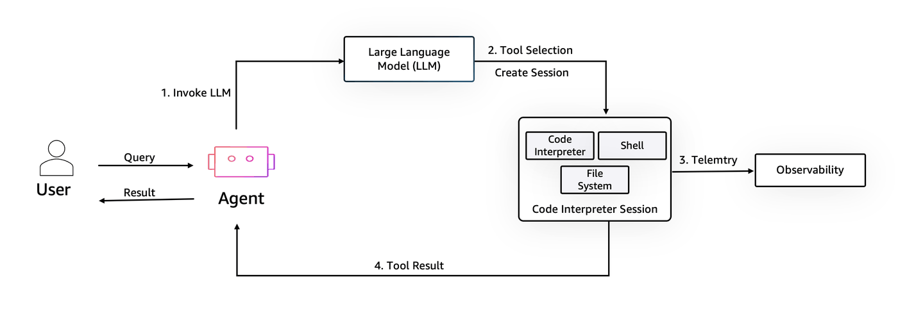

## Amazon AgentCore Bedrock Code Interpreter Tutorial

This tutorial demonstrates how to use AgentCore Bedrock Code Interpreter to:
1. Set up a sandbox environment
2. Load and analyze data
3. Execute code in a sandbox environment
4. Process and retrieve results

## Prerequisites
- AWS account with Bedrock AgentCore Code Interpreter access
- You have the necessary IAM permissions to create and manage code interpreter resources
- Required Python packages installed(including boto3 & bedrock-agentcore)
- Sample data file (data.csv)
- Analysis script (stats.py)


## Your IAM execution role should have the following IAM policy attached

~~~ {
    "Version": "2012-10-17",
    "Statement": [
        {
            "Effect": "Allow",
            "Action": [
                "bedrock-agentcore:CreateCodeInterpreter",
                "bedrock-agentcore:StartCodeInterpreterSession",
                "bedrock-agentcore:InvokeCodeInterpreter",
                "bedrock-agentcore:StopCodeInterpreterSession",
                "bedrock-agentcore:DeleteCodeInterpreter",
                "bedrock-agentcore:ListCodeInterpreters",
                "bedrock-agentcore:GetCodeInterpreter"
            ],
            "Resource": "*"
        },
        {
            "Effect": "Allow",
            "Action": [
                "logs:CreateLogGroup",
                "logs:CreateLogStream",
                "logs:PutLogEvents"
            ],
            "Resource": "arn:aws:logs:*:*:log-group:/aws/bedrock-agentcore/code-interpreter*"
        }
    ]
}

## How it works

The code execution sandbox enables agents to safely process user queries by creating an isolated environment with a code interpreter, shell, and file system. After a Large Language Model helps with tool selection, code is executed within this session, before being returned to the user or agent for synthesis.



## 1. Setting Up the Environment

First, let's import the necessary libraries and initialize our Code Interpreter client.

```python
!pip install --upgrade -r requirements.txt
```

```python
from bedrock_agentcore.tools.code_interpreter_client import CodeInterpreter
import json
from typing import Dict, Any

# Initialize the Code Interpreter with your AWS region
code_client = CodeInterpreter("us-west-2")
code_client.start()
```

## 2. Reading Local Files

Now we'll read the contents of our sample data file and analysis script.

```python
def read_file(file_path: str) -> str:
    """Helper function to read file content with error handling"""
    try:
        with open(file_path, "r", encoding="utf-8") as file:
            return file.read()
    except FileNotFoundError:
        print(f"Error: The file '{file_path}' was not found.")
        return ""
    except Exception as e:
        print(f"An error occurred: {e}")
        return ""


# Read both files
data_file_content = read_file("samples/data.csv")
code_file_content = read_file("samples/stats.py")
```

## 3. Preparing Files for Sandbox Environment

We'll create a structure that defines the files we want to create in the sandbox environment.

```python
files_to_create = [
    {"path": "data.csv", "text": data_file_content},
    {"path": "stats.py", "text": code_file_content},
]
```

## 4. Creating Helper Function for Tool Invocation

This helper function will make it easier to call sandbox tools and handle their responses. Within an active session, you can execute code in supported languages (Python, JavaScript), access libraries based on your dependencies configuration, generate visualizations, and maintain state between executions.

```python
def call_tool(tool_name: str, arguments: Dict[str, Any]) -> Dict[str, Any]:
    """Helper function to invoke sandbox tools

    Args:
        tool_name (str): Name of the tool to invoke
        arguments (Dict[str, Any]): Arguments to pass to the tool

    Returns:
        Dict[str, Any]: JSON formatted result
    """
    response = code_client.invoke(tool_name, arguments)
    for event in response["stream"]:
        return json.dumps(event["result"])
```

## 5. Writing Files to Sandbox

Now we'll write our files into the sandbox environment and verify they were created successfully.

```python
# Write files to sandbox
writing_files = call_tool("writeFiles", {"content": files_to_create})
print("Writing files result:")
print(writing_files)

# Verify files were created
listing_files = call_tool("listFiles", {"path": ""})
print("\nFiles in sandbox:")
print(listing_files)
```

## 6. Executing Analysis

Now we'll execute our analysis script in the sandbox environment and process the results.

```python
import pprint

# Execute the analysis script
code_execute_result = call_tool(
    "executeCode",
    {"code": files_to_create[1]["text"], "language": "python", "clearContext": True},
)

# Parse and display results
analysis_results = json.loads(code_execute_result)
print("Full analysis results:")
pprint.pprint(analysis_results)

print("\nStandard output from analysis:")
print(analysis_results["structuredContent"]["stdout"])
```

## 7. Cleanup

Finally, we'll clean up by stopping the Code Interpreter session. Once finished using a session, the session should be shopped to release resources and avoid unnecessary charges.

```python
# Stop the Code Interpreter session
code_client.stop()
print("Code Interpreter session stopped successfully!")
```

## Conclusion

In this tutorial, we've learned how to:
- Initialize a Code Interpreter session
- Read and prepare files for analysis
- Execute code in a sandbox environment
- Process and display results
- Clean up resources
