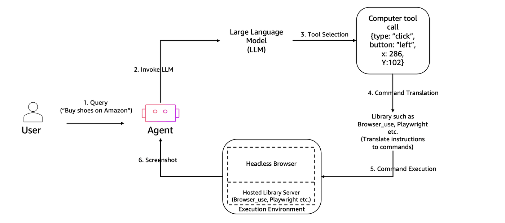

# Live-view browser tool with Browser-Use SDK

## Overview

In this tutorial we will learn how to use Browser-Use to interact with Amazon Bedrock Agentcore Browser tool and view the browser live.


### Tutorial Details


| Information         | Details                                                                          |
|:--------------------|:---------------------------------------------------------------------------------|
| Tutorial type       | Conversational                                                                   |
| Agent type          | Single                                                                           |
| Agentic Framework   | Browser-Use                                                                      |
| LLM model           | Anthropic Claude 3.7 Sonnet                                                      |
| Tutorial components | Using Browser-Use to interact with browser tool and view it live                 |
| Tutorial vertical   | vertical                                                                         |
| Example complexity  | Easy                                                                             |
| SDK used            | Amazon BedrockAgentCore Python SDK, Browser-Use                                  |

### Tutorial Architecture

In this tutorial we will describe how to use Browser-Use with browser tool and view the browser live.  

In our example we will send natural language instructions to the Browse-Use agent to perform tasks on the Bedrock Agentcore browser and view the browser live.

<div style="text-align:left">
    
</div>

### Tutorial Key Features

* Using browser tool and view it live 
* Using Browser-Use with browser tool

## Prerequisites

### To execute this tutorial you will need:
* Python 3.11+
* AWS credentials. Your IAM role/user should have these permissions https://docs.aws.amazon.com/bedrock-agentcore/latest/devguide/browser-onboarding.html#browser-credentials-config
* Amazon Bedrock AgentCore SDK
* Browser-Use SDK

```python
!pip install --force-reinstall -U -r requirements.txt --quiet
```

### Run the patch script below to fix the browser-use issue

```python
%%writefile patch_browser_use.py

#!/usr/bin/env python3
"""Auto-detect and patch browser_use session.py"""

import os
import shutil
import sys
from pathlib import Path

def find_browser_use_path():
    """Automatically find the browser_use installation path"""
    try:
        import browser_use
        browser_use_path = Path(browser_use.__file__).parent
        session_file = browser_use_path / "browser" / "session.py"
        return str(session_file)
    except ImportError:
        print("❌ browser_use not installed. Install with: pip install browser-use")
        return None

def patch_browser_use():
    # Auto-detect file path
    file_path = find_browser_use_path()
    if not file_path:
        return False
    
    if not os.path.exists(file_path):
        print(f"❌ File not found: {file_path}")
        return False
    
    print(f"📁 Found browser_use at: {file_path}")
    
    # Create backup
    backup_path = file_path + ".backup"
    if not os.path.exists(backup_path):
        shutil.copy2(file_path, backup_path)
        print(f"💾 Created backup: {backup_path}")
    else:
        print(f"📋 Backup already exists: {backup_path}")
    
    # Read file
    with open(file_path, 'r') as f:
        content = f.read()
    
    # Replacement 1: Add headers check after cdp_url check
    old1 = "if not cdp_url:\n\t\t\tprofile_kwargs['is_local'] = True"
    new1 = "if not cdp_url:\n\t\t\tprofile_kwargs['is_local'] = True\n\n\t\tif headers:\n\t\t\tprofile_kwargs['headers'] = headers"
    
    if old1 in content and "if headers:\n\t\t\tprofile_kwargs['headers'] = headers" not in content:
        content = content.replace(old1, new1)
        print("✅ Added headers check")
    elif "if headers:\n\t\t\tprofile_kwargs['headers'] = headers" in content:
        print("✅ Headers check already exists")
    else:
        print("⚠️ Headers check pattern not found")
    
    # Replacement 2: Add headers to CDPClient
    old2 = "self._cdp_client_root = CDPClient(self.cdp_url)"
    new2 = "self._cdp_client_root = CDPClient(self.cdp_url,  additional_headers=self.browser_profile.headers)"
    
    if old2 in content:
        content = content.replace(old2, new2)
        print("✅ Added headers to CDPClient")
    elif "additional_headers=self.browser_profile.headers" in content:
        print("✅ CDPClient headers already exists")
    else:
        print("⚠️ CDPClient pattern not found")
    
    # Write back
    with open(file_path, 'w') as f:
        f.write(content)
    
    print("🎉 Patching complete!")
    return True

if __name__ == "__main__":
    success = patch_browser_use()
    sys.exit(0 if success else 1)
```

```python
# Run the python script to apply the patch for browser-use
!python patch_browser_use.py
```

```python
# Restart the Kernal
import IPython

IPython.Application.instance().kernel.do_shutdown(True)
```

## Using Browser-Use with Bedrock Agentcore Browser tool with live view

Here, we will use a helper class `BrowserViewerServer` to connect via the Amazon DCV SDK to the Bedrock Agentcore browser tool.

```python
%%writefile live_view_with_browser_use.py
from browser_use import Agent
# from browser_use.browser.session import BrowserSession
from browser_use import Browser, BrowserProfile
from bedrock_agentcore.tools.browser_client import BrowserClient
# from browser_use.browser import BrowserProfile
# from langchain_aws import ChatBedrockConverse
from browser_use.llm import ChatAnthropicBedrock, ChatAWSBedrock
from rich.console import Console
from rich.panel import Panel
from contextlib import suppress
import argparse
import sys
sys.path.append("../interactive_tools")
from browser_viewer import BrowserViewerServer
import asyncio
from boto3.session import Session

console = Console()

boto_session = Session()
region = boto_session.region_name


async def run_browser_task(
    browser_session: Browser, bedrock_chat: ChatAnthropicBedrock, task: str
) -> None:
    """
    Run a browser automation task using browser_use

    Args:
        browser_session: Existing browser session to reuse
        bedrock_chat: Bedrock chat model instance
        task: Natural language task for the agent
    """
    try:
        # Show task execution
        console.print(f"\n[bold blue]🤖 Executing task:[/bold blue] {task}")

        # Create and run the agent
        agent = Agent(task=task, llm=bedrock_chat, browser_session=browser_session)

        # Run with progress indicator
        with console.status(
            "[bold green]Running browser automation...[/bold green]", spinner="dots"
        ):
            await agent.run()

        console.print("[bold green]✅ Task completed successfully![/bold green]")

    except Exception as e:
        console.print(f"[bold red]❌ Error during task execution:[/bold red] {str(e)}")
        import traceback

        if console.is_terminal:
            traceback.print_exc()


async def live_view_with_browser_use(prompt, region="us-west-2"):
    """
    Main function that demonstrates live browser viewing with Agent automation.

    Workflow:
    1. Creates Amazon Bedrock AgentCore browser client in us-west-2 region
    2. Waits for browser initialization (10-second required delay)
    3. Starts DCV-based live viewer server on port 8000 with browser control
    4. Configures multiple display size options (720p to 1440p)
    5. Establishes browser session for AI agent automation via CDP WebSocket
    6. Executes AI-driven tasks using Claude 3.7 Sonnet model
    7. Properly closes all sessions and stops browser client

    Features:
    - Real-time browser viewing through web interface
    - Manual take/release control functionality
    - AI automation with browser-use library
    - Configurable display layouts and sizes
    """
    console.print(
        Panel(
            "[bold cyan]Browser Live Viewer[/bold cyan]\n\n"
            "This demonstrates:\n"
            "• Live browser viewing with DCV\n"
            "• Configurable display sizes (not limited to 900×800)\n"
            "• Proper display layout callbacks\n\n"
            "[yellow]Note: Requires Amazon DCV SDK files[/yellow]",
            title="Browser Live Viewer",
            border_style="blue",
        )
    )

    try:
        # Step 1: Create browser session
        client = BrowserClient(region)
        client.start()
        
        ws_url, headers = client.generate_ws_headers()

        # Step 2: Start viewer server
        console.print("\n[cyan]Step 3: Starting viewer server...[/cyan]")
        viewer = BrowserViewerServer(client, port=8000)
        viewer_url = viewer.start(open_browser=True)

        # Step 3: Show features
        console.print("\n[bold green]Viewer Features:[/bold green]")
        console.print(
            "• Default display: 1600×900 (configured via displayLayout callback)"
        )
        console.print("• Size options: 720p, 900p, 1080p, 1440p")
        console.print("• Real-time display updates")
        console.print("• Take/Release control functionality")

        console.print("\n[yellow]Press Ctrl+C to stop[/yellow]")

        # Step 4: Use browser-use to interact with browser
        # Create persistent browser session and model
        browser_session = None
        bedrock_chat = None

        try:
            # Create browser profile with headers
            browser_profile = BrowserProfile(
                headers=headers,
                timeout=1500000,  # 150 seconds timeout
            )

            # Create a browser session with CDP URL and keep_alive=True for persistence
            browser_session = Browser(
                cdp_url=ws_url,
                browser_profile=browser_profile,
                keep_alive=True,  # Keep browser alive between tasks
            )

            # Initialize the browser session
            console.print("[cyan]🔄 Initializing browser session...[/cyan]")
            await browser_session.start()

            # Create ChatBedrockConverse once
            bedrock_chat = ChatAnthropicBedrock(
                model="global.anthropic.claude-haiku-4-5-20251001-v1:0",
                aws_region=region,
            )

            console.print(
                "[green]✅ Browser session initialized and ready for tasks[/green]\n"
            )

            task = prompt

            await run_browser_task(browser_session, bedrock_chat, task)

        finally:
            # Close the browser session
            if browser_session:
                console.print("\n[yellow]🔌 Closing browser session...[/yellow]")
                with suppress(Exception):
                    await browser_session.close()
                console.print("[green]✅ Browser session closed[/green]")
   
    except Exception as e:
        console.print(f"\n[red]Error: {e}[/red]")
        import traceback
        traceback.print_exc()
    finally:
        console.print("\n\n[yellow]Shutting down...[/yellow]")
        if "client" in locals():
            client.stop()
            console.print("✅ Browser session terminated")


if __name__ == "__main__":
    parser = argparse.ArgumentParser()
    parser.add_argument("--prompt", required=True, help="Browser Search instruction")
    parser.add_argument("--region", default="us-west-2", help="AWS region")
    args = parser.parse_args()

    asyncio.run(live_view_with_browser_use(
        args.prompt, args.region
    ))
```

#### Running the script
Run the script below. After the script runs (will take sometime depending on the complexity of the prompt), scroll through the output to see the result of the actions taken.

```python
!python live_view_with_browser_use.py --prompt "Search for macbooks on amazon.com and extract the details of the first one"
```

## What happened behind the scenes? 
* You instantiated a Browser client and started a session
* Then you used the `BrowserViewerServer` to connect to the browser session to view the session locally
* Then you created a Browser-Use Agent and passed the details of the browser session to it
* You then sent natural language instructions to the Browser-Use agent and saw the actions live

# Congratulations!
