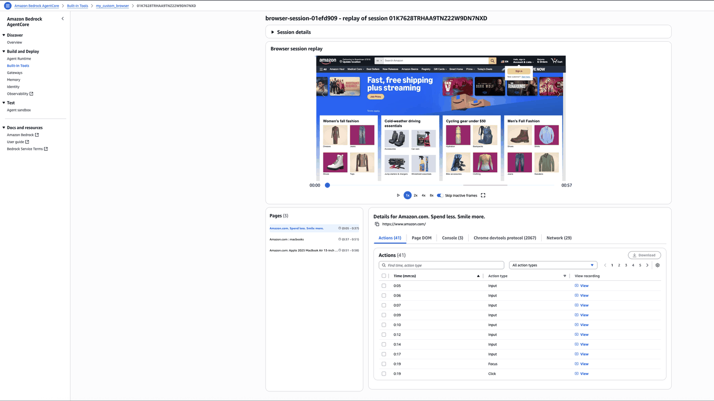

# Browser observability and session replay 

## Overview

In this tutorial we will learn how to add observability to an Agentcore Browser session and view browser console logs, network logs, CDP commands sent and agent actions taken on the browser. 


### Tutorial Details


| Information         | Details                                                                          |
|:--------------------|:---------------------------------------------------------------------------------|
| Tutorial type       | Conversational                                                                   |
| Agent type          | Single                                                                           |
| Agentic Framework   | Nova Act                                                                         |
| LLM model           | Amazon Nova Act model                                                            |
| Tutorial components | Observe browser logs on Agentocre Browser console                                |
| Tutorial vertical   | vertical                                                                         |
| Example complexity  | Easy                                                                             |
| SDK used            | Amazon Bedrock AgentCore Python SDK, boto3 SDK, Nova Act                          |

### Tutorial Architecture

In this tutorial we will walk through how to observe browser console logs, netwrok logs, CDP commands and agent actions taken on the browser.   


### Tutorial Key Features

* Enable session recording for browser tool 
* Using Nova Act with browser tool
* Observe the logs and session replay

## Prerequisites

To execute this tutorial you will need:
* Python 3.10+
* AWS credentials
* Amazon Bedrock AgentCore SDK
* Amazon Boto3 SDK
* Nova Act SDK and API key - Navigate to https://nova.amazon.com/act to generate an API key

```python
!pip install  -r requirements.txt --quiet
```

## Create a custom AgentCore Browser resource with recording enabled
We will first need to create a browser tool resource with recording enabled since the default browser tool does not have recording turned on. We will then start a browser session using this browser resource.

```python
## Create an S3 bucket to store browser recordings
## If you want to use an existing bucket, skip this step and update the bucket name in the next step.
import boto3
import uuid
from boto3.session import Session

boto_session = Session()

region = boto_session.region_name
s3_client = boto3.client("s3", region_name=region)

bucket_name = f"agentcore-browser-recordings-{str(uuid.uuid4())[:8]}"
s3_client.create_bucket(Bucket=bucket_name, CreateBucketConfiguration={"LocationConstraint": region})
print(f"Created S3 bucket: {bucket_name}")
```

### Create the execution role with necessary permissions for creating browser tool resource

Let's create a helper utility to create the execution role with the right permissions.

```python
## Create execution role with permisions to create browser
def create_agentcore_role(agent_name):
    iam_client = boto3.client("iam")
    agentcore_role_name = f"agentcore-{agent_name}-role"
    boto_session = Session()
    region = boto_session.region_name
    account_id = boto3.client("sts").get_caller_identity()["Account"]

    role_policy = {
        "Version": "2012-10-17",
        "Statement": [
            {
                "Sid": "BrowserPermissions",
                "Effect": "Allow",
                "Action": [
                    "bedrock-agentcore:ConnectBrowserAutomationStream",
                    "bedrock-agentcore:ListBrowsers",
                    "bedrock-agentcore:GetBrowserSession",
                    "bedrock-agentcore:ListBrowserSessions",
                    "bedrock-agentcore:CreateBrowser",
                    "bedrock-agentcore:StartBrowserSession",
                    "bedrock-agentcore:StopBrowserSession",
                    "bedrock-agentcore:ConnectBrowserLiveViewStream",
                    "bedrock-agentcore:UpdateBrowserStream",
                    "bedrock-agentcore:DeleteBrowser",
                    "bedrock-agentcore:GetBrowser",
                ],
                "Resource": "*",
            },
            {
                "Sid": "S3Permissions",
                "Effect": "Allow",
                "Action": ["s3:PutObject", "s3:GetObject", "s3:ListBucket"],
                "Resource": [
                    f"arn:aws:s3:::{bucket_name}",
                    f"arn:aws:s3:::{bucket_name}/*",
                ],
            },
            {
                "Sid": "CloudWatchLogsPermissions",
                "Effect": "Allow",
                "Action": [
                    "logs:CreateLogGroup",
                    "logs:CreateLogStream",
                    "logs:PutLogEvents",
                    "logs:DescribeLogStreams",
                ],
                "Resource": "*",
            },
        ],
    }
    assume_role_policy_document = {
        "Version": "2012-10-17",
        "Statement": [
            {
                "Sid": "AssumeRolePolicy",
                "Effect": "Allow",
                "Principal": {"Service": "bedrock-agentcore.amazonaws.com"},
                "Action": "sts:AssumeRole",
                "Condition": {
                    "StringEquals": {"aws:SourceAccount": f"{account_id}"},
                    "ArnLike": {"aws:SourceArn": f"arn:aws:bedrock-agentcore:{region}:{account_id}:*"},
                },
            }
        ],
    }

    assume_role_policy_document_json = json.dumps(assume_role_policy_document)
    role_policy_document = json.dumps(role_policy)

    try:
        # Create IAM Role with the trust policy
        agentcore_iam_role = iam_client.create_role(
            RoleName=agentcore_role_name,
            AssumeRolePolicyDocument=assume_role_policy_document_json,
        )
        print(f"Role {agentcore_role_name} created successfully.")

        # Attach the inline permissions policy to the role
        iam_client.put_role_policy(
            RoleName=agentcore_role_name,
            PolicyName=f"{agentcore_role_name}-inline-policy",
            PolicyDocument=role_policy_document,
        )
        print(f"Inline policy attached to role {agentcore_role_name}.")

    except iam_client.exceptions.EntityAlreadyExistsException:
        print("Role already exists -- deleting and creating it again")

        # Detach and delete any existing inline policies
        policies = iam_client.list_role_policies(RoleName=agentcore_role_name)
        for policy_name in policies["PolicyNames"]:
            iam_client.delete_role_policy(RoleName=agentcore_role_name, PolicyName=policy_name)

        # Delete and re-create the role
        print(f"Deleting role {agentcore_role_name}...")
        iam_client.delete_role(RoleName=agentcore_role_name)
        print(f"Recreating role {agentcore_role_name}...")

        agentcore_iam_role = iam_client.create_role(
            RoleName=agentcore_role_name,
            AssumeRolePolicyDocument=assume_role_policy_document_json,
        )
        print(f"Role {agentcore_role_name} recreated successfully.")

        # Re-attach the inline permissions policy to the re-created role
        iam_client.put_role_policy(
            RoleName=agentcore_role_name,
            PolicyName=f"{agentcore_role_name}-inline-policy",
            PolicyDocument=role_policy_document,
        )
        print(f"Inline policy re-attached to role {agentcore_role_name}.")

    # Pause to make sure changes propagate
    time.sleep(10)

    return agentcore_iam_role
```

### Create the browser tool resource with recording enabled

```python
## Use boto3 to create a custom browser tool resource with recording enabled
import boto3
import time
import json
from boto3.session import Session

boto_session = Session()
region = boto_session.region_name

cp_client = boto3.client("bedrock-agentcore-control", region_name=region)

# Define parameters for the Browser Tool
browser_name = "my_custom_browser"
browser_description = "Test browser for observability and session replay"
execution_role = create_agentcore_role(browser_name)
execution_role_arn = execution_role["Role"]["Arn"]  # Todo: Replace with your IAM role ARN
s3_bucket_name = bucket_name  # Replace with your S3 bucket name if you have an existing bucket
s3_prefix = "replay-data"

try:
    response = cp_client.create_browser(
        name=browser_name,
        description=browser_description,
        networkConfiguration={
            "networkMode": "PUBLIC"  # Or "VPC" if you need VPC integration
        },
        executionRoleArn=execution_role_arn,
        clientToken=str(uuid.uuid4()),  # Unique token for idempotency
        recording={
            "enabled": True,
            "s3Location": {"bucket": s3_bucket_name, "prefix": s3_prefix},
        },
    )
    print(response)
    print(f"Successfully created Browser Tool: {response['browserId']}")
    browserId = response["browserId"]
except cp_client.exceptions.ConflictException:
    print("Browser Tool with this name already exists. Please choose a different name.")
```

## Create the Nova Act script
Nova Act will start a browser session using the browser tool resource we created in the previous step and run the browser actions on it.

```python
%%writefile basic_browser_with_nova_act.py
"""Browser automation script using Amazon Bedrock AgentCore and Nova Act.

This script demonstrates AI-powered web automation by:
- Initializing a browser session through Amazon Bedrock AgentCore
- Connecting to Nova Act for natural language web interactions
- Performing automated searches and data extraction using browser
"""

from bedrock_agentcore.tools.browser_client import browser_session , BrowserClient
from nova_act import NovaAct
from rich.console import Console
import argparse
import json

console = Console()

from boto3.session import Session

boto_session = Session()
region = boto_session.region_name
print("using region", region)

def browser_with_nova_act(prompt, starting_page, nova_act_key,  browserId, region="us-west-2"):
    result = None
    
    browser_client = BrowserClient(region)
    browser_client.start(identifier=browserId) # Use the created browser tool ID here
    
    ws_url, headers = browser_client.generate_ws_headers()
    try:
        with NovaAct(
            cdp_endpoint_url=ws_url,
            cdp_headers=headers,
            nova_act_api_key=nova_act_key,
            starting_page=starting_page,
        ) as nova_act:
            result = nova_act.act(prompt)
    except Exception as e:
        console.print(f"NovaAct error: {e}")

    finally:
        browser_client.stop()
        return result


if __name__ == "__main__":
    parser = argparse.ArgumentParser()
    parser.add_argument("--prompt", required=True, help="Browser Search instruction")
    parser.add_argument("--starting-page", required=True, help="Starting URL")
    parser.add_argument("--nova-act-key", required=True, help="Nova Act API key")
    parser.add_argument("--region", default="us-west-2", help="AWS region")
    parser.add_argument("--browserID", required=True, help="Browser Tool ID to use")
    args = parser.parse_args()

    result = browser_with_nova_act(
        args.prompt, args.starting_page, args.nova_act_key, args.browserID, args.region
    )
    console.print(f"\n[cyan] Response[/cyan] {result.response}")
    console.print(f"\n[bold green]Nova Act Result:[/bold green] {result}")
```

#### Running the script
Paste your Nova Act API key below before running the script.

```python
NOVA_ACT_KEY = ""  ### Paste your Nova Act Key here
```

```python
!python basic_browser_with_nova_act.py --prompt "Search for macbooks and extract the details of the first one" --starting-page "https://www.amazon.com/" --browserID {browserId} --nova-act-key {NOVA_ACT_KEY}
```

## Observability on Agentcore Browser Console
* While the script is running, you can head to the AWS console :https://us-west-2.console.aws.amazon.com/bedrock-agentcore/builtInTools
and click on the "Browser use tools" tab. If you're running in a different region - replace the region in this URL.
* Click on the "my-custom-browser".  You will see a link to the view live view if the session is still running or a link to view recording. 
* Wait for the session to terminate if its running and then click on view recording. 
You will see a page similar to this



* #### You can now replay the recorded browser session 
* #### Inspect each page visited during the session 
* #### View the actions taken by the agent in the Action tab 
* #### View the Page DOM details, Console logs, CDP commands sent to the browser and the Network logs 
* #### You can download each of the logs for further debugging
* #### You can click on "View" in the Actions tab for each action to view the exact action taken in the browser 
* #### For example: View any of the "Click" action type and notice the red circle on the browser. This indicates the exact locaiton where the click action happened.

# Congratulations and happy exploring!
