# 🌐 Strands + AgentCore Browser Integration 

## Overview

In this tutorial we will learn how to use Strands agents with Amazon Bedrock AgentCore Browser tool for intelligent web automation and financial analysis. We will demonstrate how to create a Strands agent that can browse websites, extract financial data, and provide AI-powered insights using the official `strands_tools.browser.AgentCoreBrowser` integration.

### Tutorial Details

| Information         | Details                                                                          |
|:--------------------|:---------------------------------------------------------------------------------|
| Tutorial type       | Conversational                                                                   |
| Agent type          | Single                                                                           |
| Agentic Framework   | Strands                                                                          |
| LLM model           | Claude 3 Haiku                                                                   |
| Tutorial components | Browser automation, Financial analysis, Error recovery                           |
| Tutorial vertical   | Financial Technology                                                             |
| Example complexity  | Intermediate                                                                     |
| SDK used            | Amazon BedrockAgentCore Python SDK, Strands Agents, Strands Agent Tools         |

### Tutorial Architecture

In this tutorial we will describe how to use Strands agents with the browser tool for intelligent financial website analysis. Our implementation uses the official `strands_tools.browser.AgentCoreBrowser` which provides seamless integration between Strands and AWS Bedrock AgentCore.

In our example we will send natural language instructions to the Strands agent to perform financial analysis tasks on websites like MarketWatch, extracting stock data, market metrics, and providing AI-powered insights.

### Tutorial Key Features

* Using browser tool in a headless way with Strands agents
* AgentCoreBrowser integration using strands_tools.browser
* Intelligent financial website analysis with context-aware AI responses
* Error handling and response parsing with fallback strategies
* Structured invoke pattern for reliable agent implementations
* Claude Haiku model for fast and efficient analysis

## Prerequisites

To execute this tutorial you will need:
* Python 3.10+
* AWS credentials configured
* Amazon Bedrock AgentCore SDK
* Strands agents and strands-agents-tools packages
* Access to Claude 3 Haiku model in Amazon Bedrock

**Implementation**: Using the official `strands_tools.browser.AgentCoreBrowser` for seamless browser automation with intelligent financial analysis.

## 🎯 What This Does
- **AgentCoreBrowser Integration** using `strands_tools.browser`
- **MarketWatch Financial Analysis** with context-aware AI responses
- **Structured Invoke Pattern** for implementations
- **Claude Haiku Model** for fast and efficient analysis

## 🏗️ Architecture

```mermaid
graph TD
    A[👤 User Request] --> B[📋 Invoke Function]
    B --> C[🤖 Strands Agent]
    C --> D[🔧 AgentCoreBrowser Tool]
    D --> E[🌐 AWS Bedrock AgentCore]
    E --> F[🎭 Browser Automation]
    F --> G[📊 MarketWatch.com]
    G --> H[📈 Stock Data Extraction]
    H --> I[🧠 Claude Analysis]
    I --> J[📋 Financial Insights]
    
    style A fill:#1a1a2e
    style C fill:#16213e
    style D fill:#0f3460
    style E fill:#e94560
    style I fill:#f39c12
```



## 📦 Step 1: Install Dependencies

```python
# Install required packages with strands-agents-tools for AgentCoreBrowser
!pip install --force-reinstall -U -r requirements.txt 

print("✅ Dependencies installed successfully!")
```

## 📚 Step 2: Import Libraries

```python
from strands import Agent
from strands_tools.browser import AgentCoreBrowser
import time

print("✅ Libraries imported successfully!")
```

## 🤖 Step 3: Create Agent with Optimized Settings

```python
def create_agent():
    """Create and configure the Strands agent with AgentCoreBrowser"""
    # Initialize the official AgentCoreBrowser tool
    agent_core_browser = AgentCoreBrowser(region="us-west-2")

    # Create agent with Claude Haiku model and optimized settings
    agent = Agent(
        tools=[agent_core_browser.browser],
        model="global.anthropic.claude-haiku-4-5-20251001-v1:0",
        system_prompt="""You are an intelligent financial analyst that specializes in analyzing stock and financial websites. When asked to analyze a financial website:

1. Use the browser tool to visit and interact with the website EFFICIENTLY
2. Focus on extracting key financial information QUICKLY:

**For Financial/Stock Websites (MarketWatch, Bloomberg, etc.):**
- Current stock prices and market data
- Price movements and trends (daily, weekly, monthly changes)
- Key financial metrics and ratios (P/E, Market Cap, etc.)
- Trading volume and market activity
- Recent news and market sentiment
- Analyst recommendations and price targets
- Company fundamentals and performance indicators

IMPORTANT: Work efficiently and complete your analysis within 2-3 browser interactions. Always provide specific, actionable financial insights with actual numbers and data points. Be concise but comprehensive in your analysis, focusing on the most important financial metrics for investors.""",
    )
    return agent


# Initialize agent globally
strands_agent = create_agent()

print("✅ Strands agent created with AgentCoreBrowser integration!")
```

## 🔧 Step 4: Create Invoke Function

```python
def invoke(payload):
    """Structured invoke function for agent interaction"""
    user_message = payload.get("prompt", "")

    try:
        print("🚀 Starting analysis...")
        start_time = time.time()

        response = strands_agent(user_message)

        elapsed_time = time.time() - start_time
        print(f"✅ Analysis completed in {elapsed_time:.2f} seconds")

        return response.message["content"][0]["text"] if response.message.get("content") else str(response)

    except Exception as e:
        print(f"❌ Error during analysis: {str(e)}")
        return f"Error occurred: {str(e)}"


print("✅ Invoke function created!")

# 📝 Note: If you access slow websites that cause timeouts, you may need to
# implement timeout handling in your code to prevent hanging operations.
```

## 📊 Step 5: Test MarketWatch Financial Analysis

```python
# Test with MarketWatch Tesla page
financial_test = {
    "prompt": "Please analyze the Tesla stock page at https://www.marketwatch.com/investing/stock/tsla and provide key financial insights"
}

print("📊 Testing MarketWatch Financial Analysis")
print("=" * 50)

result = invoke(financial_test)
print(result)

print("\n✅ MarketWatch analysis test completed!")
```

## 🎯 Step 6: Interactive Analysis Function

```python
def analyze_website(url, question=None):
    """Convenient function for interactive website analysis"""
    if question:
        prompt = f"Visit {url} and answer this question: {question}"
    else:
        prompt = f"Please analyze the website at {url} and provide comprehensive financial insights"

    payload = {"prompt": prompt}
    return invoke(payload)


# Example usage
print("🎯 Interactive Analysis Function Ready!")
print("\nExample usage:")
print(
    'analyze_website("https://www.marketwatch.com/investing/stock/aapl", "What is Apple\'s current stock performance?")'
)
print("\n✅ Interactive analysis function ready!")
```

## 🔄 Step 7: Main Function

```python
if __name__ == "__main__":
    # Example with MarketWatch
    print("🎯 Production Example - Tesla Stock Analysis on MarketWatch:")
    print("=" * 60)

    response = invoke(
        {
            "prompt": "Analyze the Tesla stock at https://www.marketwatch.com/investing/stock/tsla and provide detailed financial insights"
        }
    )

    print(response)

    print("\n✅ All tests completed successfully!")
    print("\n🚀 Ready for production use with the invoke() function pattern!")
    print("\n📝 Usage Examples:")
    print('invoke({"prompt": "Analyze Tesla stock at https://www.marketwatch.com/investing/stock/tsla"})')
    print('invoke({"prompt": "Get Apple stock data from https://www.marketwatch.com/investing/stock/aapl"})')
    print(
        'analyze_website("https://www.marketwatch.com/investing/stock/nvda", "What is NVIDIA\'s market performance?")'
    )
```

## 🎭 What Happened Behind the Scene

When you execute this notebook, the Strands Agent initializes with Claude Haiku model and connects to AWS Bedrock's AgentCore browser automation service. Upon receiving your financial analysis request, the agent intelligently navigates to MarketWatch.com, extracts real-time stock data including prices, market cap, P/E ratios, and trading volumes, then processes this information through Claude's AI to generate comprehensive financial insights.

Performance tracking measures execution speed (typically 14-16 seconds), and error handling gracefully manages any network issues or website blocking. The entire process is orchestrated through the invoke() function pattern, which provides a clean interface while managing complex browser automation and AI processing behind the scenes.

The result is what appears to be a simple function call that actually coordinates multiple AWS services, AI models, and web scraping to deliver reliable financial analysis.

### 📝 **Usage Examples:**
```python
# Direct invoke pattern (production)
result = invoke({"prompt": "Analyze Tesla stock at https://www.marketwatch.com/investing/stock/tsla"})

# Interactive helper function
result = analyze_website("https://www.marketwatch.com/investing/stock/aapl", "What is Apple's current valuation?")
```
