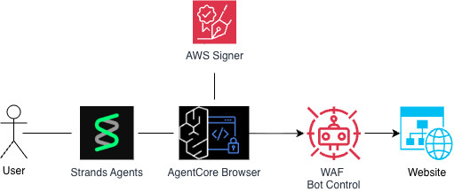

# 🌐 AgentCore Browser with Web Auth Signing 

## Overview

In this tutorial we will learn how to enable Web Bot Auth signing with Amazon Bedrock AgentCore Browser tool. 

### Tutorial Details

| Information         | Details                                                                          |
|:--------------------|:---------------------------------------------------------------------------------|
| Tutorial type       | Conversational                                                                   |
| Agent type          | Single                                                                           |
| Agentic Framework   | Strands                                                                          |
| LLM model           | Claude 4.5 Haiku                                                                 |
| Tutorial components | Browser automation, *Web Bot Auth* signing of browser Requests                   |
| Tutorial vertical   |                                                                                  |
| Example complexity  | Intermediate                                                                     |
| SDK used            | Amazon Bedrock AgentCore Python SDK, Strands Agents, Strands Agent Tools         |
 
### Tutorial Architecture



### Tutorial Key Features

* Using browser tool in a headless way with Strands agents
* Using strands_tools AgentCoreBrowser tool
* Claude 4.5 Haiku model for fast and efficient analysis

## Prerequisites

To execute this tutorial you will need:
* Python 3.10+
* AWS credentials configured
* Amazon Bedrock AgentCore SDK
* Strands agents and strands-agents-tools packages
* Access to Claude 4.5 Haiku model in Amazon Bedrock

**Implementation**: Using the official `strands_tools.browser.AgentCoreBrowser` for browser automation from an agent.

## 🔧 AgentCore Browser Configuration

Before using the AgentCore Browser tool, you can optionally create a custom browser configuration with specific settings like recording capabilities, network configuration, and execution roles. This section shows how to create a custom browser configuration using the AWS SDK.

### Create Custom Browser Configuration

The following code demonstrates how to create a custom AgentCore Browser with recording enabled and a specific execution role.

#### 📚 Create the Browser Configuration with Web Bot Auth Signing

**What is Browser Signing?**

Browser signing (`browserSigning.enabled = True`) configures the AgentCore Browser to automatically sign all outgoing HTTP requests. This is essential for:

- **Authenticated API access**: Sign requests to protected APIs
- **AWS service integration**: Automatically sign requests with AWS credentials
- **Security compliance**: Ensure all browser requests are authenticated
- **Request integrity**: Cryptographically sign request headers

When enabled, the browser will:
1. Intercept all HTTP/HTTPS requests
2. Add cryptographic signatures to request headers
3. Include authentication tokens automatically
4. Maintain session integrity across requests

### 📦 Import Libraries

```python
import boto3
import uuid
import os
import sys
from strands import Agent
from strands_tools.browser import AgentCoreBrowser

tutorials_path = os.path.abspath(os.path.join(os.getcwd(), "../../../"))
if tutorials_path not in sys.path:
    sys.path.insert(0, tutorials_path)

from utils import create_agentcore_role

cp_client = boto3.client("bedrock-agentcore-control", region_name="us-west-2")


accountId = boto3.client("sts").get_caller_identity()["Account"]
region = boto3.Session().region_name

print(f"Account ID: {accountId}")
print(f"Region: {region}")
```

### 🔧 Setup and Role Creation

```python
## Create the execution role.
execution_role_arn = create_agentcore_role("web-bot-auth")["Role"]["Arn"]

print(f"\n✅ Role Created Successfully : {execution_role_arn}")

## Create new browser instance with custom configurations
response = cp_client.create_browser(
    name="web_bot_auth_browser_" + str(uuid.uuid4())[:6],
    description="Browser configured to sign web bot auth",
    networkConfiguration={"networkMode": "PUBLIC"},
    executionRoleArn=execution_role_arn,
    browserSigning={"enabled": True},
)

browserId = response["browserId"]
browserArn = response["browserArn"]
print("\n✅ Browser Created Successfully!")
print(f"   Browser ID: {browserId}")
print(f"   Browser ARN: {browserArn}")
print("\n🔐 Browser signing is ENABLED - all requests will be automatically signed")
```

### 🔧 Create Strands Agent with AgentCoreBrowser Tool

```python
# Create and configure the Strands agent with AgentCoreBrowser
# Initialize the official AgentCoreBrowser tool with the custom browser ID that
# was created in the previous step
agent_core_browser = AgentCoreBrowser(identifier=browserId, region="us-west-2")
agent_core_default_browser = AgentCoreBrowser(region="us-west-2")

# Import the SequentialToolExecutor to prevent concurrent browser operations
from strands.tools.executors import SequentialToolExecutor

# Create SIGNED agent with Claude 4.5 Haiku model and SEQUENTIAL tool execution
strands_agent = Agent(
    tools=[agent_core_browser.browser],  # Uses the custom browser with signing enabled
    tool_executor=SequentialToolExecutor(),  # This prevents concurrent browser operations
    model="global.anthropic.claude-haiku-4-5-20251001-v1:0",
    system_prompt="""You are a website analyst with browser signing capabilities.
1. Use the browser tool to visit and interact with the website EFFICIENTLY
2. Focus on extracting key information QUICKLY and within 2-3 browser interactions.
3. Review browser requests for signatures related to Web Bot Auth's Signature and Signature-Agent http headers, 
   to verify if browser signing is configured.""",
)

# Create UNSIGNED agent with Claude 4.5 Haiku model and SEQUENTIAL tool execution
strands_agent_unsigned = Agent(
    tools=[agent_core_default_browser.browser],  # Uses the default browser without signing
    tool_executor=SequentialToolExecutor(),  # This prevents concurrent browser operations
    model="global.anthropic.claude-haiku-4-5-20251001-v1:0",
    system_prompt="""You are a website analyst with browser signing capabilities.
1. Use the browser tool to visit and interact with the website EFFICIENTLY
2. Focus on extracting key information QUICKLY and within 2-3 browser interactions.
3. Review browser requests for signatures related to Web Bot Auth's Signature and Signature-Agent http headers, 
   to verify if browser signing is configured.""",
)
```

```python
# Define async function with sequential execution (no more concurrent conflicts)
async def analyze_website(agent, prompt):
    """Async wrapper for agent invocation with sequential tool execution"""
    try:
        # With SequentialToolExecutor, browser operations won't conflict
        result = await agent.invoke_async(prompt)
        return result
    except Exception as e:
        print(f"❌ Error: {str(e)}")
        import traceback

        traceback.print_exc()
        return None
```

### 🚀 Start Analysis with Browser Signing Enabled

```python
print("\n🚀 Validate browser signing against CloudFlare's crawltest site.")
print("=" * 100)

result_signed = await analyze_website(
    strands_agent,
    "Review the output and status code at https://crawltest.com/cdn-cgi/web-bot-auth and provide 3 to 4 concise key insights, based on https://developers.cloudflare.com/bots/reference/bot-verification/web-bot-auth/",
)

if result_signed:
    print("\n\n✅ Analysis completed, with Web Bot Auth browser signing enabled")
    print("-" * 100)
    print(result_signed)
    print("-" * 100)
```

### Re-run the experiment without browser signing

To validate that our test is valid, lets run the same prompt, but with the agent that is configured without browser signing.

```python
print("\n🚀 Validate browser signing against CloudFlare's crawltest site - without Web Bot Auth browser signing.")
print("=" * 100)

result_unsigned = await analyze_website(
    strands_agent_unsigned,
    "Review the output and status code at https://crawltest.com/cdn-cgi/web-bot-auth and provide 3 to 4 concise key insights, based on https://developers.cloudflare.com/bots/reference/bot-verification/web-bot-auth/",
)

if result_unsigned:
    print("\n\n✅ Analysis completed - without Web Bot Auth browser signing")
    print("-" * 100)
    print(result_unsigned)
    print("-" * 100)
```

Lets compare our results:

```python
# Compare result_unsigned and result_signed using Strands Agent
comparison_prompt = f"""
Please analyze and compare these two agent outputs side by side:

**Unsigned Agent Output:**
{result_unsigned}

**Signed Agent Output:**
{result_signed}

Please provide:
* A side-by-side comparison highlighting key differences
* Validation of the Signed Agent using Signatures correctly
* Validation of the Unsigned Agent NOT using Signatures
* Summary of which aspects differ most significantly

Format your response clearly with headers and bullet points for easy reading.
"""

# Make Strands Agent call to compare the results
comparison_agent = Agent(
    system_prompt="""You are an expert data analyst evaluating different AI agent outputs.""",
    callback_handler=None,
)

comparison_response = comparison_agent(comparison_prompt)

print("=== COMPARISON OF AGENT OUTPUTS ===")
print(comparison_response)
```

## 🎭 What Happened Behind the Scene

When you execute this notebook with **browser signing enabled**, the following process occurs:

### 1. **Browser Configuration Creation**
```python
browserSigning={
    "enabled": True
}
```
This tells the AgentCore Browser service to automatically sign all HTTP requests made by the browser.

### 2. **Agent Initialization**
The Strands agent is initialized with:
- A browser configuration identifier with signing enabled. *Note* this is not the default browser identifier.
- Claude 4.5 Haiku model
- Browser tool integration

### 3. **Request Signing Flow**
When the agent navigates to websites:

```text
┌─────────────────┐    ┌───────────────────┐    ┌──────────────────────┐    ┌──────────────┐
│  Agent Request  │ ──→│ AgentCore Browser │ ──→│ Sign Request Headers │ ──→│Target Website│
└─────────────────┘    └───────────────────┘    └──────────────────────┘    └──────────────┘
                                                          │
                                                          ▼
                                                Add Web Bot Auth headers:
                                                • Signature-Input header
                                                • Signature-Agent header
                                                • Signature header

```

## 🔒 Security Benefits

With browser signing enabled:

✅ **Automatic Authentication** - No manual header management  
✅ **Request Integrity** - Cryptographic signatures prevent tampering  
✅ **AWS Integration** - Seamless IAM credential integration for agents to use the browser tool 
✅ **Session Management** - Secure session token handling with each session getting its own browser sessions 
✅ **Audit Trail** - All signed requests are able to be logged  

## 🛠️ Troubleshooting

### Error: "Browser session not found"
**Solution**: The browser ID might have expired. Re-run the browser creation cell (cell-3)

### RuntimeError: "Leaving task does not match the current task"
**Solution**: This asyncio error occurs when browser operations run concurrently. The notebook uses `SequentialToolExecutor()` to prevent this issue by ensuring browser operations execute one at a time.

**Why this happens**: If your agent asks the AgentCore Browser tool performs multiple async operations (get_html, get_text, screenshot, etc.) in parallel, Strands may execute them concurrently, creating conflicting asyncio tasks.

**The fix**: Use `SequentialToolExecutor()` to ensure all tool calls execute sequentially, eliminating the async task conflicts while maintaining the same functionality.

## 📚 Further Reading

To learn more about Web Bot Auth and how it reduces CAPTCHAs for AI agents, check out these resources:

### AWS Blog Posts
- **[Reduce CAPTCHAs for AI agents browsing the web with Web Bot Auth (Preview) in Amazon Bedrock AgentCore Browser](https://aws.amazon.com/blogs/machine-learning/reduce-captchas-for-ai-agents-browsing-the-web-with-web-bot-auth-preview-in-amazon-bedrock-agentcore-browser/)** - Comprehensive guide on Web Bot Auth implementation and benefits

### Documentation
- **[Cloudflare Web Bot Auth Documentation](https://developers.cloudflare.com/bots/reference/bot-verification/web-bot-auth/)** - Technical specification and implementation details
- **[Amazon Bedrock AgentCore Browser Documentation](https://docs.aws.amazon.com/bedrock-agentcore/latest/devguide/browser-onboarding.html)** - Complete guide to AgentCore Browser features

### Related Topics
- **[HTTP Message Signatures (RFC 9421)](https://datatracker.ietf.org/doc/rfc9421/)** - The underlying cryptographic standard used by Web Bot Auth
- **[Web Bot Auth Architecture (IETF Draft)](https://datatracker.ietf.org/doc/html/draft-meunier-web-bot-auth-architecture)** - The IETF draft specification for Web Bot Auth architecture
