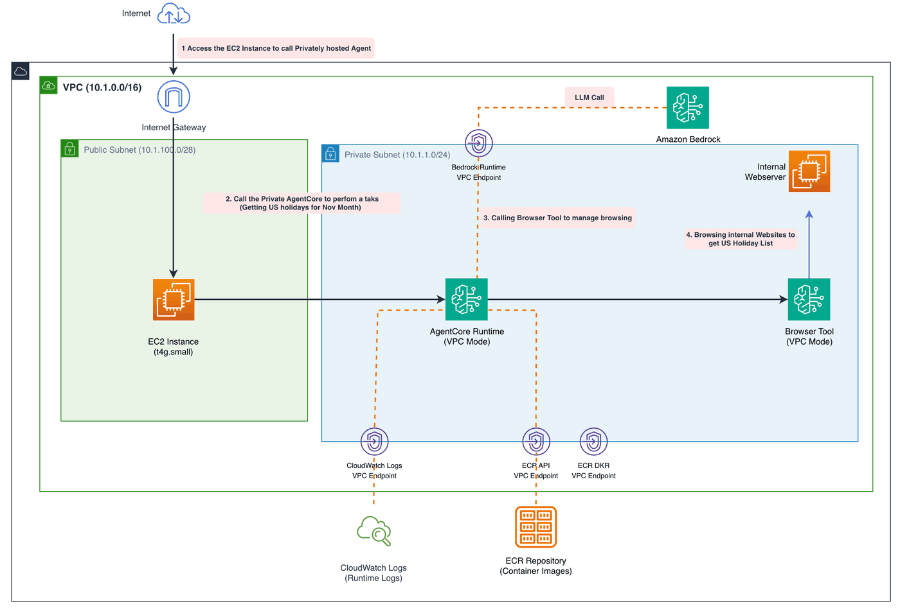

## Use Case: Hybrid Deployment Architecture

### Scenario: Secure Data Processing with Internet Access

In this deployment pattern, we separate the AgentCore components to balance security and functionality:

**AgentCore Browser (Public Mode)**
- Deployed in public subnets with internet access
- Enables web browsing of publicly accessible websites and services
- Manages external integrations and real-time data retrieval
- Benefits from direct internet connectivity for real-time operations

**AgentCore Runtime (VPC Mode)**
- Deployed in private subnets within a secure VPC
- Processes sensitive data and business logic
- Maintains strict network isolation
- Communicates with browser component through secure internal channels

### Benefits

- **Security**: Sensitive processing remains isolated in private network
- **Performance**: Browser operations get direct internet access without NAT overhead
- **Compliance**: Meets regulatory requirements for data isolation
- **Scalability**: Each component can scale independently based on workload demands

### Architecture Flow



# CloudFormation Stack Execution Instructions

## Prerequisites
- AWS CLI configured with appropriate permissions
- CloudFormation template file ready

## Execution Steps

### 1. Run the step below to launch CFN (~13 Mins)

```python
import boto3

# Configuration variables
region = "us-east-1"  # Change this to your desired region
template_path = "cfn-vpc-browser.yaml"
stack_name = "vpc-browser-stack-new"

# Initialize CloudFormation client with configurable region
cf_client = boto3.client("cloudformation", region_name=region)

# Read the CloudFormation template
with open(template_path, "r") as template_file:
    template_body = template_file.read()

try:
    # Create the CloudFormation stack
    response = cf_client.create_stack(
        StackName=stack_name,
        TemplateBody=template_body,
        Capabilities=["CAPABILITY_IAM", "CAPABILITY_NAMED_IAM"],
    )

    print(f"Stack creation initiated in region: {region}")
    print(f"Stack ID: {response['StackId']}")

    # Wait for stack creation to complete
    waiter = cf_client.get_waiter("stack_create_complete")
    print("Waiting for stack creation to complete...")
    waiter.wait(StackName=stack_name)

    print(f"Stack '{stack_name}' created successfully in {region}!")

except Exception as e:
    print(f"Error creating stack: {str(e)}")
```

### 2. Instructions for Testing

````python
import boto3
from IPython.display import Markdown


# Fetch AgentRuntime ARN from CloudFormation output
def get_cfn_output(stack_name, output_key, region="us-east-1"):
    """Fetch CloudFormation stack output value"""
    cfn = boto3.client("cloudformation", region_name=region)
    try:
        response = cfn.describe_stacks(StackName=stack_name)
        outputs = response["Stacks"][0]["Outputs"]
        for output in outputs:
            if output["OutputKey"] == output_key:
                return output["OutputValue"]
    except Exception as e:
        print(f"Error fetching CFN output: {e}")
    return None


# Get the AgentRuntime ARN (using stack_name from previous cell)
agent_runtime_arn = get_cfn_output(stack_name, "AgentRuntimeArn")
agent_runtime_id = get_cfn_output(stack_name, "AgentRuntimeId")
development_instance = get_cfn_output(stack_name, "DevelopmentInstanceId")
web_server_ip = get_cfn_output(stack_name, "WebServerPrivateIp")


# Generate complete testing instructions
instructions = f"""# Testing Instructions for Bedrock Agent Runtime

## Prerequisites
- CloudFormation stack has been completed successfully

## Step-by-Step Testing Process

### 1. Connect to EC2 Instance
Connect to EC2 instance `{development_instance}` via Browser Connector or SSH

### 2. Setup Environment
Run the following commands on the EC2 instance:

```bash
sudo yum update -y

# Install development tools
sudo dnf install git -y && \\
curl -LsSf https://astral.sh/uv/install.sh | sh && \\
echo 'export PATH="$HOME/.cargo/bin:$PATH"' >> ~/.bashrc && \\
source ~/.bashrc && \\
echo 'Install Python Venv'

uv init vpc-browser --python 3.13 && cd vpc-browser
uv venv --python 3.13
source .venv/bin/activate
uv pip install boto3

cat > call-agent.py << 'EOF'
import boto3
import json

client = boto3.client('bedrock-agentcore', region_name='us-east-1')

payload = json.dumps({{
    "prompt": "Access {web_server_ip} over http at port 8080 to check what are holidays in November"
}})

response = client.invoke_agent_runtime(
    agentRuntimeArn="{agent_runtime_arn}",
    runtimeSessionId='dfmeoagmreaklgmrkleafremoigrmtesogmtrskhmtkrlshmt',  # Must be 33+ chars
    payload=payload,
    qualifier="DEFAULT"  # Optional
)

response_body = response['response'].read()
response_data = json.loads(response_body)
print("Agent Response:", response_data)
EOF


```

### 3 Run the agent test
```
python call-agent.py
```

### 4. Monitor logs in CloudWatch:
- Navigate to CloudWatch Logs in the AWS Console
- Look for log group: /aws/bedrock-agentcore/runtimes/{agent_runtime_id}
- To view live browsing go to console -> Amazon Bedrock AgentCore -> Built-in Tools -> Browser tools -> browser_stack_browser -> View live session
- Monitor real-time execution logs and any errors

"""

Markdown(instructions)
````

### 3. Clean Up

```python
import boto3

# Delete the stack
cfn = boto3.client("cloudformation", region_name=region)
cfn.delete_stack(StackName=stack_name)

print(f"Stack '{stack_name}' deletion initiated in region '{region}'")

# Wait for deletion to complete
waiter = cfn.get_waiter("stack_delete_complete")
print("Waiting for stack deletion to complete...")
waiter.wait(StackName=stack_name)

print(f"Stack '{stack_name}' deleted successfully!")
```
