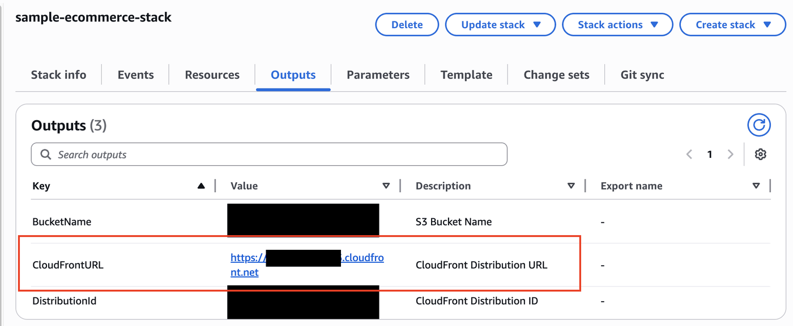

## AgentCore Browser Tool with Browser Profiles

In this example, you will learn how to use browser profiles inside AgentCore Browser. 
This feature enable you to persist and reuse browser profile data across multiple browser sessions. A browser profile stores session information including cookies and local storage.

**Before start, it's important that your cloudformation stack has been executed, to deploy our fake simple e-commerce that will be used in this tutorial.**

From Cloud Formation outputs, get the name of Cloud Front distribution:



Or from [deploy.sh](sample-ecommerce/deploy.sh) script output, get the name of Cloud Front distribution and populate in next cell:

```python
CFN_URL = "<your-cloud-front-url>"
```

To getting started, install dependencies and **restart your kernel**:

```python
!pip install -qU -r requirements.txt
```

### 1. Create a custom browser

In this step, you will declare global variables that will be used troughout this notebook.

```python
import boto3
import json
import sys
from botocore.exceptions import ClientError


sys.path.append("../helpers/")

iam_boto3 = boto3.client("iam")
s3 = boto3.client("s3")
browser_boto3 = boto3.client("bedrock-agentcore-control")
browser_cli = boto3.client("bedrock-agentcore")

session = boto3.Session()
ACCOUNT_ID = boto3.client("sts").get_caller_identity()["Account"]
REGION = session.region_name

BROWSER_NAME = "browser_with_profiles"
BROWSER_PROFILE_NAME = "profile_sample"
BUCKET_NAME = f"ac-browser-demos-{ACCOUNT_ID}-{REGION}"
AC_ROLE_NAME = "ac-browser-execution-role"
```

#### 1.1 Create a S3 Bucket

You need to create a S3 Bucket, if it doesn't exist, to store browser recordings that we will download later.

```python
try:
    # check if bucket exists
    s3.head_bucket(Bucket=BUCKET_NAME)
    print(f"Bucket {BUCKET_NAME} already exists")
except ClientError:
    # create bucket
    create_params = {"Bucket": BUCKET_NAME}
    if REGION != "us-east-1":
        create_params["CreateBucketConfiguration"] = {"LocationConstraint": REGION}
    s3.create_bucket(**create_params)
    print(f"Bucket {BUCKET_NAME} created in {REGION}")
```

#### 1.2 Create IAM role

Then, you will create a custom IAM role that will be attached into the AgentCore Browser:

```python
try:
    # Trust policy
    trust_policy = {
        "Version": "2012-10-17",
        "Statement": [
            {
                "Effect": "Allow",
                "Principal": {"Service": "bedrock-agentcore.amazonaws.com"},
                "Action": "sts:AssumeRole",
            }
        ],
    }

    # Create the role
    browser_role = iam_boto3.create_role(RoleName=AC_ROLE_NAME, AssumeRolePolicyDocument=json.dumps(trust_policy))

    browser_role_arn = browser_role["Role"]["Arn"]

    print(f"Role ARN: {browser_role_arn}")

    # S3 policy for recordings
    ac_browser_policies = {
        "Version": "2012-10-17",
        "Statement": [
            {
                "Effect": "Allow",
                "Action": [
                    "s3:PutObject",
                    "s3:GetObject",
                    "s3:ListBucket",
                    "s3:ListMultipartUploadParts",
                    "s3:AbortMultipartUpload",
                ],
                "Resource": [
                    f"arn:aws:s3:::{BUCKET_NAME}",
                    f"arn:aws:s3:::{BUCKET_NAME}/*",
                ],
            },
            {
                "Sid": "BedrockAgentCoreBrowserProfileUsageAccess",
                "Effect": "Allow",
                "Action": [
                    "bedrock-agentcore:StartBrowserSession",
                    "bedrock-agentcore:SaveBrowserSessionProfile",
                ],
                "Resource": [
                    f"arn:aws:bedrock-agentcore:{REGION}:{ACCOUNT_ID}:browser-profile/{BROWSER_PROFILE_NAME}",
                    f"arn:aws:bedrock-agentcore:{REGION}:{ACCOUNT_ID}:browser-custom/{BROWSER_NAME}",
                ],
            },
        ],
    }

    # add S3 inline policy
    iam_boto3.put_role_policy(
        RoleName=AC_ROLE_NAME,
        PolicyName="ac_custom_policies",
        PolicyDocument=json.dumps(ac_browser_policies),
    )

    # Attach managed policy Bedrock
    iam_boto3.attach_role_policy(
        RoleName=AC_ROLE_NAME,
        PolicyArn="arn:aws:iam::aws:policy/AmazonBedrockFullAccess",
    )

except ClientError as e:
    print(f"Exception: {e}")
    if e.response["Error"]["Code"] == "EntityAlreadyExists":
        browser_role_arn = iam_boto3.get_role(RoleName=AC_ROLE_NAME)["Role"]["Arn"]
        print(f"Arn captured: {browser_role_arn}")
```

Sleep 10 seconds to make sure IAM role is propagated

```python
import time

time.sleep(10)
```

#### 1.3 Create the AgentCore custom Browser

You are creating a custom browser for this example, but Browser Profile feature works for managed browser (aws.browser.v1) as well.

```python
created_browser = browser_boto3.create_browser(
    name=BROWSER_NAME,
    executionRoleArn=browser_role_arn,
    networkConfiguration={"networkMode": "PUBLIC"},
    recording={
        "enabled": True,
        "s3Location": {"bucket": BUCKET_NAME, "prefix": "browser_recordings/"},
    },
)

browser_id = created_browser["browserId"]
print(f"Browser ID: {browser_id}")
```

#### 1.4 Create the browser profile

```python
created_profile = browser_boto3.create_browser_profile(name=BROWSER_PROFILE_NAME, description="Example profile")

profile_id = created_profile["profileId"]
print(f"Created profile: {profile_id}")
```

### 2. Testing

To start our test, let's start a new browser session:

```python
response = browser_cli.start_browser_session(browserIdentifier=browser_id)

session_id = response["sessionId"]
print(f"Session ID: {session_id}")
```

On following cell, we are signing our request with Sigv4, to add IAM credentials on it.

```python
import browser_helper as helper

url = helper.get_url(browser_id, session_id)
headers = helper.get_signed_headers(url)
headers
```

#### 2.1 Testing in one session

Now, let's use playwright to simulate a navigation into our sample e-commerce.
[Playwright](https://playwright.dev/docs/intro) is a framework for Web Testing and Automation that is supported for AgentCore Browser.
So, to get started: 
1. Let's navigate trough the *cart* page to check that our cart is empty
1. Let's add an echo dot into our cart
1. Let's check cart again to see the product was added.

```python
from playwright.async_api import async_playwright

async with async_playwright() as p:
    browser = await p.chromium.connect_over_cdp(url, headers=headers)
    page = browser.contexts[0].pages[0] if browser.contexts else await browser.new_context().new_page()

    try:
        # 1. Navigate to Home page
        await page.goto(f"{CFN_URL}/#home", wait_until="domcontentloaded")

        await page.wait_for_timeout(2000)

        # 2. Add first item
        button = page.locator('button[onclick="addToCart(2)"]')
        await button.wait_for(state="visible")
        await button.click()

        await page.wait_for_timeout(2000)

        # 3. Add second item
        button = page.locator('button[onclick="addToCart(4)"]')
        await button.wait_for(state="visible")
        await button.click()

        # 4. Check the cart
        view_cart_button = page.locator("#viewCart")
        await view_cart_button.wait_for(state="visible")
        await view_cart_button.click()
        await page.wait_for_timeout(2000)

        # 5. return to Home page
        view_cart_button = page.locator("#backToProducts")
        await view_cart_button.wait_for(state="visible")
        await view_cart_button.click()

        # 6. Ensuring that cart state will be saved locally
        await page.evaluate("localStorage.setItem('cart', JSON.stringify(cart))")
        await page.wait_for_timeout(500)

    except Exception as error:
        print(f"Error during navigation: {error}")
        raise
```

#### 2.2 Save session into the profile

Now, let's save this session into the profile that you've created.

```python
response = browser_cli.save_browser_session_profile(
    profileIdentifier=profile_id, browserIdentifier=browser_id, sessionId=session_id
)

print("Profile saved successfully")
```

#### 2.3 Stop session

Finally, let's stop our session.

```python
stoped_session = browser_cli.stop_browser_session(browserIdentifier=browser_id, sessionId=session_id)
stoped_session
```

#### 2.4 Start a new session

Now, let's start a new session and add our browser profile, which has our cart saved.

```python
response = browser_cli.start_browser_session(
    browserIdentifier=browser_id, profileConfiguration={"profileIdentifier": profile_id}
)

session_id = response["sessionId"]
print(f"Session ID: {session_id}")
```

```python
import browser_helper as helper

url = helper.get_url(browser_id, session_id)
headers = helper.get_signed_headers(url)
headers
```

#### 2.5 Check our cart

Finally, let's see that our product is already selected into our cart.

```python
from playwright.async_api import async_playwright

async with async_playwright() as p:
    browser = await p.chromium.connect_over_cdp(url, headers=headers)
    page = browser.contexts[0].pages[0] if browser.contexts else await browser.new_context().new_page()

    try:
        # 1. Navigate to Home page
        await page.goto(f"{CFN_URL}/#home", wait_until="domcontentloaded")

        await page.wait_for_timeout(5000)

        # 2. Check the cart
        view_cart_button = page.locator("#viewCart")
        await view_cart_button.wait_for(state="visible")
        await view_cart_button.click()
        await page.wait_for_timeout(2000)

    except Exception as error:
        print(f"Error during navigation: {error}")
        raise
```

Let's end our session

```python
stoped_session = browser_cli.stop_browser_session(browserIdentifier=browser_id, sessionId=session_id)
stoped_session
```

### 3. Download session recording (Optional)

Because you had added a bucket configuration into the browser, you have the metadata that can be downloaded and reproduced from the browser navigation.

So, let's list our files from S3 bucket and key (S3 key will be the session ID):

```python
response = s3.list_objects_v2(Bucket=BUCKET_NAME, Prefix=f"browser_recordings/{session_id}")

for obj in response.get("Contents", []):
    key = obj["Key"]
    if key.endswith(".gz"):
        filename = key.split("/")[-1]  # Get just the filename
        s3.download_file(BUCKET_NAME, key, filename)
        print(f"Downloaded: {filename}")
```

Then, let's open zip file and convert it to a reproducible format.

```python
import gzip

# Decompress and read events
events = []
with gzip.open(filename, "rt") as f:
    for line in f:
        line = line.strip()
        if line:  # Skip empty lines
            events.append(json.loads(line))

# Save as JSON for rrweb
with open("events.json", "w") as f:
    json.dump(events, f)
```

Finally, let's reproduce it:

```python
from IPython.display import HTML
import json

# Load events
with open("events.json", "r") as f:
    events = json.load(f)

# Create HTML with inline events
html = f"""
<link rel="stylesheet" href="https://cdn.jsdelivr.net/npm/rrweb-player@latest/dist/style.css"/>
<div id="player"></div>
<script src="https://cdn.jsdelivr.net/npm/rrweb-player@latest/dist/index.js"></script>
<script>
    new rrwebPlayer({{
        target: document.getElementById('player'),
        props: {{ events: {json.dumps(events)} }}
    }});
</script>
"""

HTML(html)
```

### 4. Clean Up (Optional)

Delete custom AgentCore browser and Profile

```python
browser_boto3.delete_browser(browserId=browser_id)
```

```python
browser_boto3.delete_browser_profile(profileId=profile_id)
```
