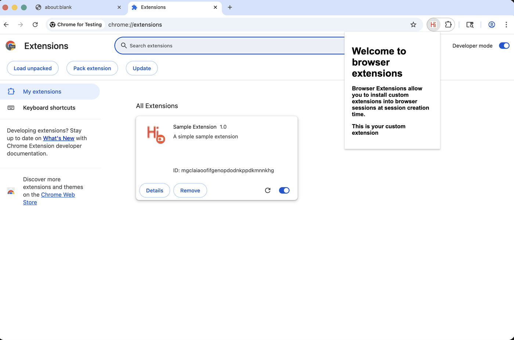
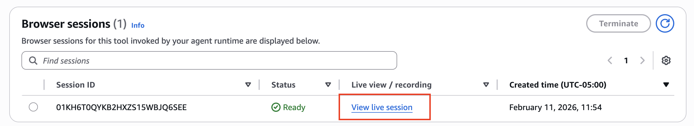
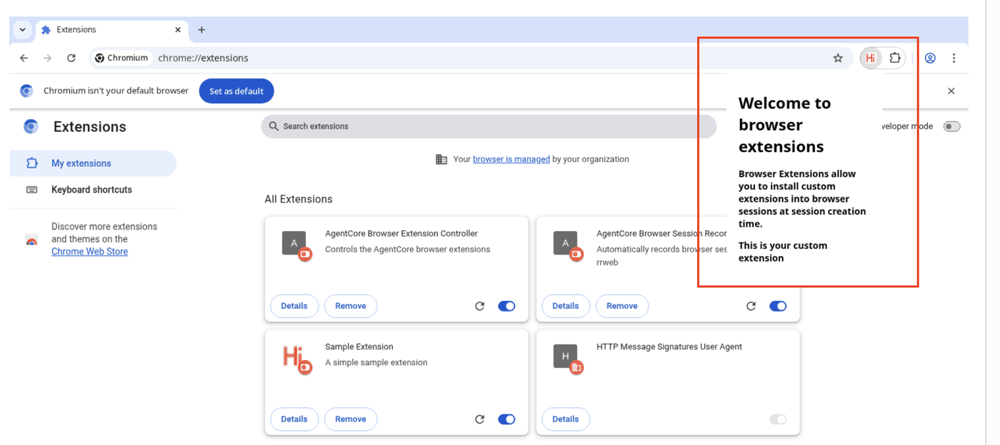

## AgentCore Browser Tool with Browser Extensions

In this example, you will learn how to use [browser extensions](https://docs.aws.amazon.com/bedrock-agentcore/latest/devguide/browser-extensions.html) inside AgentCore Browser. 

Browser Extensions allow you to install custom extensions into browser sessions at session creation time. This enables you to customize browser behavior with your own extensions for automation tasks, web scraping, testing, and more.

```python
!pip install -qU -r requirements.txt
```

Declaring global variables

```python
import boto3
import json
import sys
from botocore.exceptions import ClientError

sys.path.append("../helpers/")

iam_boto3 = boto3.client("iam")
s3 = boto3.client("s3")
browser_boto3 = boto3.client("bedrock-agentcore-control")
browser_cli = boto3.client("bedrock-agentcore")

session = boto3.Session()
ACCOUNT_ID = boto3.client("sts").get_caller_identity()["Account"]
REGION = session.region_name

BROWSER_NAME = "browser_with_extensions"
BUCKET_NAME = f"ac-browser-demos-{ACCOUNT_ID}-{REGION}"
AC_ROLE_NAME = "ac-browser-ext-execution-role"
```

### 1. Local test with Playwright

You can check that on folder extension, we have a pre-made extension. 

In this step, we will launch a local session to test that extension is working with Playwright.

As soon as browser launches, click on extension on chrome to see it working locally:



```python
from playwright.async_api import async_playwright

extension_path = "./extension"

async with async_playwright() as p:
    context = await p.chromium.launch_persistent_context(
        user_data_dir="./user-data",
        headless=False,
        args=[
            f"--disable-extensions-except={extension_path}",
            f"--load-extension={extension_path}",
        ],
    )

    page = await context.new_page()
    await page.goto("chrome://extensions/")
    await page.wait_for_timeout(2000)

    input("Press Enter to close...")
    await context.close()
```

#### 1.1 Create a S3 Bucket

You need to create a S3 Bucket, if it doesn't exist, to store browser recordings that we will download later.

```python
try:
    # check if bucket exists
    s3.head_bucket(Bucket=BUCKET_NAME)
    print(f"Bucket {BUCKET_NAME} already exists")
except ClientError:
    # create bucket
    create_params = {"Bucket": BUCKET_NAME}
    if REGION != "us-east-1":
        create_params["CreateBucketConfiguration"] = {"LocationConstraint": REGION}
    s3.create_bucket(**create_params)
    print(f"Bucket {BUCKET_NAME} created in {REGION}")
```

#### 1.2 Create IAM role

Then, you will create a custom IAM role that will be attached into the AgentCore Browser:

```python
try:
    # Trust policy
    trust_policy = {
        "Version": "2012-10-17",
        "Statement": [
            {
                "Effect": "Allow",
                "Principal": {"Service": "bedrock-agentcore.amazonaws.com"},
                "Action": "sts:AssumeRole",
            }
        ],
    }

    # Create the role
    browser_role = iam_boto3.create_role(RoleName=AC_ROLE_NAME, AssumeRolePolicyDocument=json.dumps(trust_policy))

    browser_role_arn = browser_role["Role"]["Arn"]

    print(f"Role ARN: {browser_role_arn}")

    # S3 policy for recordings
    ac_browser_policies = {
        "Version": "2012-10-17",
        "Statement": [
            {
                "Effect": "Allow",
                "Action": [
                    "s3:PutObject",
                    "s3:GetObject",
                    "s3:GetObjectVersion",
                    "s3:ListBucket",
                    "s3:ListMultipartUploadParts",
                    "s3:AbortMultipartUpload",
                ],
                "Resource": [
                    f"arn:aws:s3:::{BUCKET_NAME}",
                    f"arn:aws:s3:::{BUCKET_NAME}/*",
                ],
            }
        ],
    }

    # add S3 inline policy
    iam_boto3.put_role_policy(
        RoleName=AC_ROLE_NAME,
        PolicyName="ac_custom_policies",
        PolicyDocument=json.dumps(ac_browser_policies),
    )

    # Attach managed policy Bedrock
    iam_boto3.attach_role_policy(
        RoleName=AC_ROLE_NAME,
        PolicyArn="arn:aws:iam::aws:policy/AmazonBedrockFullAccess",
    )

except ClientError as e:
    print(f"Exception: {e}")
    if e.response["Error"]["Code"] == "EntityAlreadyExists":
        browser_role_arn = iam_boto3.get_role(RoleName=AC_ROLE_NAME)["Role"]["Arn"]
        print(f"Arn captured: {browser_role_arn}")
```

Sleep 10 seconds to make sure IAM role is propagated

```python
import time

time.sleep(10)
```

#### 1.3 Create the AgentCore custom Browser

Let's zip our extension and upload it to S3 Bucket:

```python
![ -f sample-extension.zip ] && rm sample-extension.zip
!cd extension && zip -r ../sample_extension.zip .
!cd ..
```

Upload to S3

```python
s3.upload_file(
    "sample_extension.zip",
    BUCKET_NAME,
    "extensions/sample_extension.zip",
    ExtraArgs={"ContentType": "application/zip"},
)
```

You are creating a custom browser for this example, but the feature works for managed browser (aws.browser.v1) as well.

```python
created_browser = browser_boto3.create_browser(
    name=BROWSER_NAME,
    executionRoleArn=browser_role_arn,
    networkConfiguration={"networkMode": "PUBLIC"},
    recording={
        "enabled": True,
        "s3Location": {"bucket": BUCKET_NAME, "prefix": "browser_recordings/"},
    },
)

browser_id = created_browser["browserId"]
print(f"Browser ID: {browser_id}")
```

### 2. Testing

To start our test, let's start a new browser session:

```python
response = browser_cli.start_browser_session(
    browserIdentifier=browser_id,
    extensions=[
        {
            "location": {
                "s3": {
                    "bucket": BUCKET_NAME,
                    "prefix": "extensions/sample_extension.zip",
                }
            }
        }
    ],
)

session_id = response["sessionId"]
print(f"Session ID: {session_id}")
```

On following cell, we are signing our request with Sigv4, to add IAM credentials on it.

```python
import browser_helper as helper

url = helper.get_url(browser_id, session_id)
headers = helper.get_signed_headers(url)
headers
```

#### 2.1 Testing in AgentCore Browser

Now, let's use playwright to check and test our extension.
[Playwright](https://playwright.dev/docs/intro) is a framework for Web Testing and Automation that is supported for AgentCore Browser.

Before run playwright code, go to your Browser in AWS console and click on *view live session* button:



```python
from playwright.async_api import async_playwright

async with async_playwright() as p:
    browser = await p.chromium.connect_over_cdp(url, headers=headers)
    page = browser.contexts[0].pages[0] if browser.contexts else await browser.new_context().new_page()

    await page.goto("chrome://extensions/")
    await page.wait_for_timeout(2000)
```

After your code ran, you can open the browser and click on the extension, to see it's working in AgentCore Browser:



#### 2.3 Stop session

Finally, let's stop our session.

```python
stoped_session = browser_cli.stop_browser_session(browserIdentifier=browser_id, sessionId=session_id)
stoped_session
```

### 3. Clean Up (Optional)

Delete custom AgentCore browser and Profile

```python
browser_boto3.delete_browser(browserId=browser_id)
```
