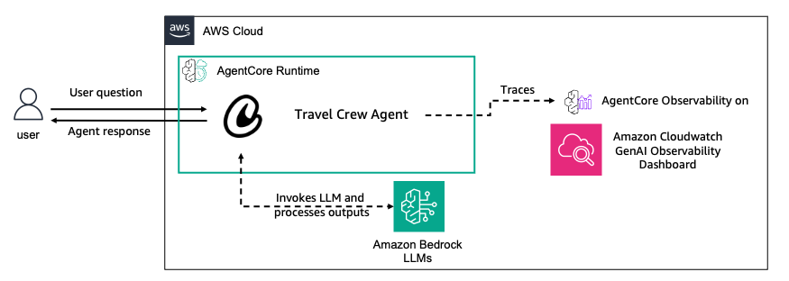
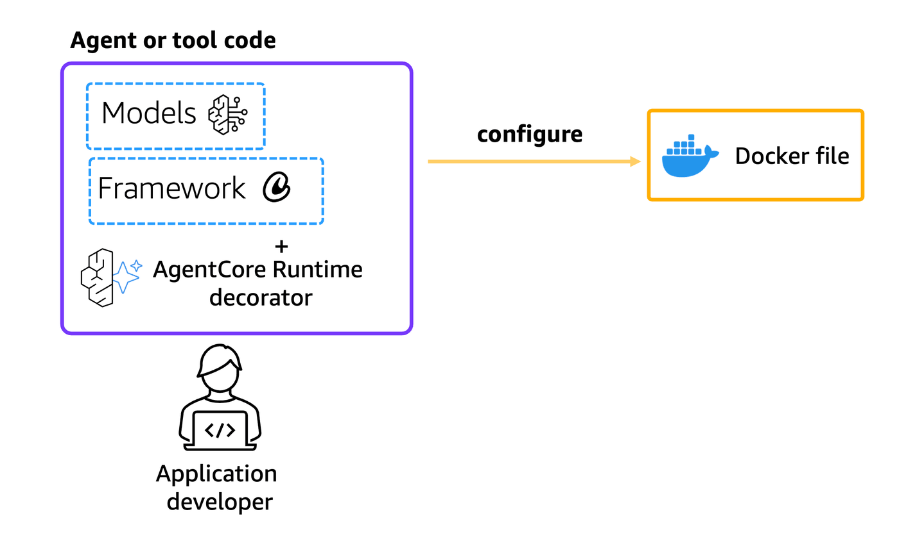
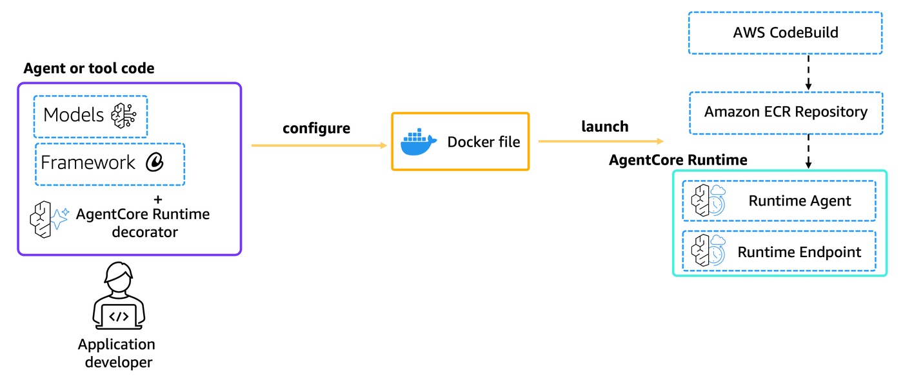
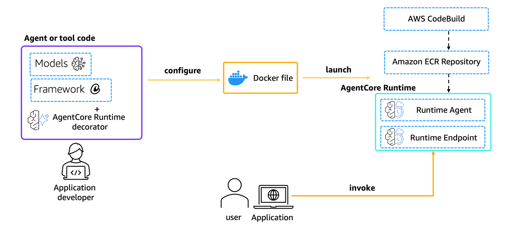
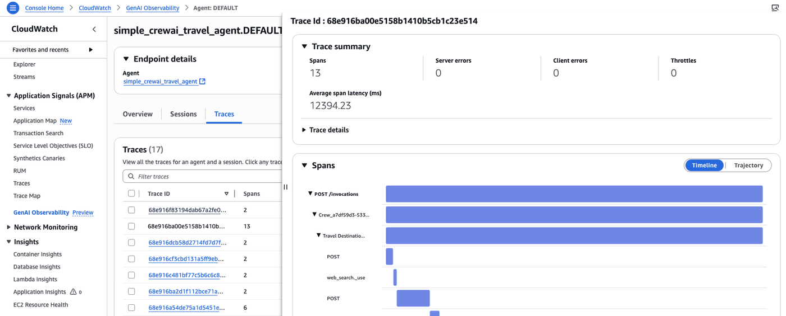
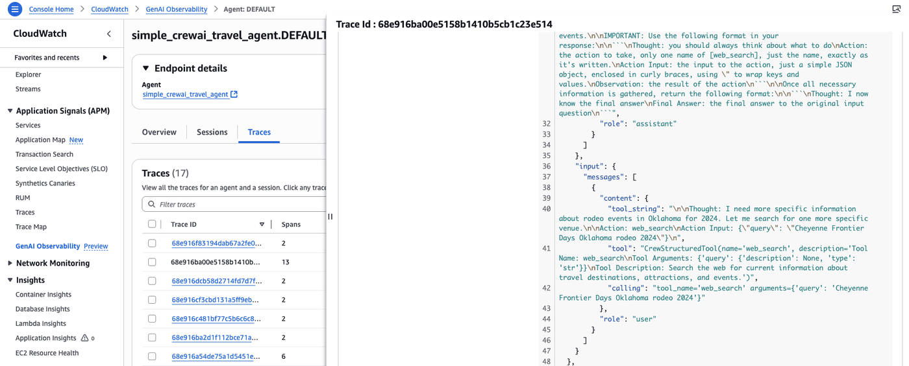

# Hosting Simple CrewAI Agent with Amazon Bedrock models in Amazon Bedrock AgentCore Runtime

## Overview

In this tutorial we will learn how to host a simple CrewAI agent using Amazon Bedrock AgentCore Runtime. We will be using Opentelemetry instrumentation and AWS Opentelemetry python library to add observability to this agent and monitor it's performance on Amazon CloudWatch GenAI Observability Dashboard.

### Tutorial Details

| Information         | Details                                                                          |
|:--------------------|:---------------------------------------------------------------------------------|
| Tutorial type       | Conversational                                                                   |
| Agent type          | Single                                                                           |
| Agentic Framework   | CrewAI                                                                           |
| LLM model           | Anthropic Claude Haiku 4.5                                                     |
| Tutorial components | Hosting agent on AgentCore Runtime. Using CrewAI and Amazon Bedrock Model       |
| Tutorial vertical   | Cross-vertical                                                                   |
| Example complexity  | Easy                                                                             |
| SDK used            | Amazon BedrockAgentCore Python SDK and boto3                                    |

### Tutorial Key Features

* Hosting Agents on Amazon Bedrock AgentCore Runtime
* Using Amazon Bedrock models
* Using CrewAI
* Amazon CloudWatch GenAI Observability


### Tutorial Architecture

In this tutorial we will describe how to deploy an existing multi-agent crew to AgentCore runtime. 

For demonstration purposes, we will use a CrewAI crew using Amazon Bedrock models

In our example we will use a travel agent with web search capabilities.
<div style="text-align:left">
    
</div>

## Prerequisites

To execute this tutorial you will need:
* Python 3.10+
* AWS credentials with appropriate permissions
* Amazon Bedrock AgentCore SDK
* CrewAI
* Amazon CloudWatch Access
* Enable [transaction search](https://docs.aws.amazon.com/AmazonCloudWatch/latest/monitoring/Enable-TransactionSearch.html) on Amazon CloudWatch.

```python
!pip install --force-reinstall -U -r requirements.txt --quiet
```

## Preparing your agent for deployment on AgentCore Runtime

Let's now deploy our agent to AgentCore Runtime. To do so we need to:
* Import the Runtime App with `from bedrock_agentcore.runtime import BedrockAgentCoreApp`
* Initialize the App in our code with `app = BedrockAgentCoreApp()`
* Decorate the invocation function with the `@app.entrypoint` decorator
* Let AgentCoreRuntime control the running of the agent with `app.run()`

### CrewAI Agent with Amazon Bedrock model
Let's create our runtime-ready CrewAI Agent using Amazon Bedrock model.

```python
%%writefile crewai_runtime_agent.py
import os

from crewai import Agent, Task, Crew, LLM
from crewai.tools import tool
from ddgs import DDGS
import logging
from bedrock_agentcore.runtime import BedrockAgentCoreApp
from opentelemetry.instrumentation.crewai import CrewAIInstrumentor

# Instrument CrewAI with Opentelemetry
# Note: The AWS OpenTelemetry distro will automatically handle tracer provider setup
# when using opentelemetry-instrument command
CrewAIInstrumentor().instrument()

app = BedrockAgentCoreApp()

# Set up logging
logging.basicConfig(level=logging.INFO)
logger = logging.getLogger(__name__)

@tool("web_search")
def web_search(query: str) -> str:
    """Search the web for current information about travel destinations, attractions, and events."""
    try:
        ddgs = DDGS()
        results = ddgs.text(query, max_results=3)
        
        formatted_results = []
        for i, result in enumerate(results, 1):
            formatted_results.append(
                f"{i}. {result.get('title', 'No title')}\n"
                f"   {result.get('body', 'No summary')}\n"
                f"   Source: {result.get('href', 'No URL')}\n"
            )
        
        return "\n".join(formatted_results) if formatted_results else "No results found."
        
    except Exception as e:
        return f"Search error: {str(e)}"

def get_llm():
    model_id = os.getenv("BEDROCK_MODEL_ID", "global.anthropic.claude-haiku-4-5-20251001-v1:0")
    region = os.getenv("AWS_DEFAULT_REGION", "us-west-2")
    
    try:
        llm = LLM(
            model=f"bedrock/{model_id}",
            temperature=0.7,
            max_tokens=512,
            aws_region_name=region
        )
        logger.info(f"Successfully initialized Bedrock LLM with model: {model_id} in region: {region}")
        return llm
    except Exception as e:
        logger.error(f"Failed to initialize Bedrock LLM: {str(e)}")
        logger.error("Please ensure you have proper AWS credentials configured and access to the Bedrock model")
        raise

@app.entrypoint
def crewai_agent_bedrock(payload, context):
    """
    Invoke the agent with a payload
    """
    print(f'Payload: {payload}')
    try:
        user_input = payload.get("prompt", "What are some interesting places to visit?")
        print(f"Processing request: {user_input}")
        
        llm = get_llm()

        travel_agent = Agent(
            role='Travel Destination Researcher',
            goal='Find dream destinations matching user preferences using web search for current information',
            backstory="You are an experienced travel agent specializing in personalized travel recommendations with access to real-time web information.",
            verbose=True,
            allow_delegation=False,
            llm=llm,
            max_iter=3,
            tools=[web_search]
        )

        task = Task(
            description=f"Research and provide travel recommendations based on this request: {user_input}. Use web search to find current information about venues, events, and attractions.",
            expected_output="A comprehensive list of recommended destinations with current information, brief descriptions, and practical travel details.",
            agent=travel_agent
        )

        crew = Crew(
            agents=[travel_agent],
            tasks=[task],
            verbose=True
        )

        result = crew.kickoff()
        
        print("Context:\n-------\n", context)
        print("Result Raw:\n*******\n", result.raw)
        
        return {"result": result.raw}
        
    except Exception as e:
        print(f'Exception occurred: {e}')
        return {"error": f"An error occurred: {str(e)}"}

if __name__ == "__main__":
    app.run()
```

## What happens behind the scenes?

When you use `BedrockAgentCoreApp`, it automatically:

* Creates an HTTP server that listens on the port 8080
* Implements the required `/invocations` endpoint for processing the agent's requirements
* Implements the `/ping` endpoint for health checks (very important for asynchronous agents)
* Handles proper content types and response formats
* Manages error handling according to the AWS standards

## Deploying the agent to AgentCore Runtime

The `CreateAgentRuntime` operation supports comprehensive configuration options, letting you specify container images, environment variables and encryption settings. You can also configure protocol settings (HTTP, MCP) and authorization mechanisms to control how your clients communicate with the agent. 

**Note:** Operations best practice is to package code as container and push to ECR using CI/CD pipelines and IaC

In this tutorial we will use the Amazon Bedrock AgentCore Python SDK to easily package your artifacts and deploy them to AgentCore runtime.

### Configure AgentCore Runtime deployment

Next we will use our starter toolkit to configure the AgentCore Runtime deployment with an entrypoint, the execution role we just created and a requirements file. We will also configure the starter kit to auto create the Amazon ECR repository on launch.

During the configure step, your docker file will be generated based on your application code. 

<div style="text-align:left">
    
</div>

Please note that when using the `bedrock_agentcore_starter_toolkit` to configure your agent, it takes care of the opentelemetry instrumentation. 

When configuring for containerized environment (such as docker) add the following command, an example is given below:

`CMD ["opentelemetry-instrument", "python", "runtime_agent_main.py"]`

```python
from bedrock_agentcore_starter_toolkit import Runtime
from boto3.session import Session

boto_session = Session()
region = boto_session.region_name

agentcore_runtime = Runtime()
agent_name = "simple_crewai_travel_agent"
response = agentcore_runtime.configure(
    entrypoint="crewai_runtime_agent.py",
    auto_create_execution_role=True,
    auto_create_ecr=True,
    requirements_file="requirements.txt",
    region=region,
    agent_name=agent_name,
    memory_mode="NO_MEMORY",
)
response
```

### Launching agent to AgentCore Runtime

Now that we've got a docker file, let's launch the agent to the AgentCore Runtime. This will create the Amazon ECR repository and the AgentCore Runtime

<div style="text-align:left">
    
</div>

```python
# Disable CrewAI's built-in telemetry to avoid conflicts
launch_result = agentcore_runtime.launch(
    env_vars={
        "CREWAI_DISABLE_TELEMETRY": "true",
        "OTEL_PYTHON_EXCLUDED_URLS": "https://api.scarf.sh/",
    }
)
launch_result
```

### Checking for the AgentCore Runtime Status
Now that we've deployed the AgentCore Runtime, let's check for it's deployment status

```python
import time

status_response = agentcore_runtime.status()
status = status_response.endpoint["status"]
end_status = ["READY", "CREATE_FAILED", "DELETE_FAILED", "UPDATE_FAILED"]
while status not in end_status:
    time.sleep(10)
    status_response = agentcore_runtime.status()
    status = status_response.endpoint["status"]
    print(status)
status
```

### Invoking AgentCore Runtime

Finally, we can invoke our AgentCore Runtime with a payload

<div style="text-align:left">
    
</div>

```python
invoke_response = agentcore_runtime.invoke({"prompt": "What are some cowboy-themed attractions and museums in Texas?"})
invoke_response
```

### Processing invocation results

We can now process our invocation results to include it in an application

```python
from IPython.display import Markdown, display
import json

response_text = invoke_response["response"][0]
display(Markdown(response_text))
```

### Invoking AgentCore Runtime with boto3

Now that your AgentCore Runtime was created you can invoke it with any AWS SDK. For instance, you can use the boto3 `invoke_agent_runtime` method for it.

```python
import boto3

agent_arn = launch_result.agent_arn
agentcore_client = boto3.client("bedrock-agentcore", region_name=region)

boto3_response = agentcore_client.invoke_agent_runtime(
    agentRuntimeArn=agent_arn,
    qualifier="DEFAULT",
    payload=json.dumps({"prompt": "What are some rodeo events happening in Oklahoma?"}),
)

response_body = boto3_response["response"].read()
response_data = json.loads(response_body)
display(Markdown(response_data.get("result", "No result found")))
```

### AgentCore Observability on Amazon CloudWatch 

To summarize, please follow the below steps to enable observability from AgentCore runtime hosted agents : 

- Enable Transaction Search on Amazon CloudWatch 
- The agent emits traces and is instrumented using opentelemtry command : `opentelemetry-instrument python any_runtime_agent.py`
- The requirements.txt file contains `aws-opentelemetry-distro` listed while deploying the agent on Bedrock Agentcore Runtime.

## Bedrock AgentCore Overview on GenAI Observability dashboard 

You are able to view all your Agents that have observability in them and filter the data based on time frames.

In the main dashboard you are able to view runtime metrics across all agents.

Now, if you click on the agent you just deployed you will be taken to a dashboard for the runtime metrics specific to this agent, you can also filter the data by a custom time frame.

In the Sessions View tab, you can navigate to all the sessions associated with this agent.

In the Trace View tab, you can look into the traces and span information for this agent on runtime.


<div style="text-align:left">
    
</div>


Please click through the various features of GenAI observability dashboard to get more detailed information on traces.

<div style="text-align:left">
    
</div>

## Cleanup (Optional)

Let's now clean up the AgentCore Runtime created

```python
launch_result.ecr_uri, launch_result.agent_id, launch_result.ecr_uri.split("/")[1]
```

```python
agentcore_control_client = boto3.client("bedrock-agentcore-control", region_name=region)
ecr_client = boto3.client("ecr", region_name=region)

runtime_delete_response = agentcore_control_client.delete_agent_runtime(
    agentRuntimeId=launch_result.agent_id,
)

response = ecr_client.delete_repository(repositoryName=launch_result.ecr_uri.split("/")[1], force=True)
```

# Congratulations!

You have successfully created and deployed a simple CrewAI agent to Amazon Bedrock AgentCore Runtime with observability enabled. This example demonstrates how to:

- Create a simple CrewAI travel agent with web search capabilities
- Enable observability through Amazon CloudWatch
- Invoke the agent using both the SDK and boto3

The agent can now be used with full observability and monitoring capabilities.
