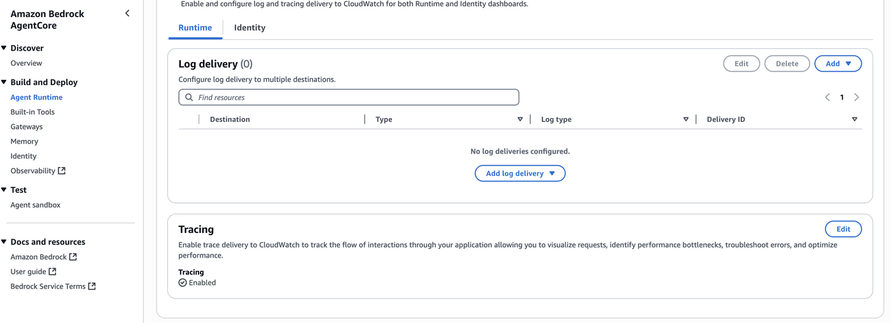
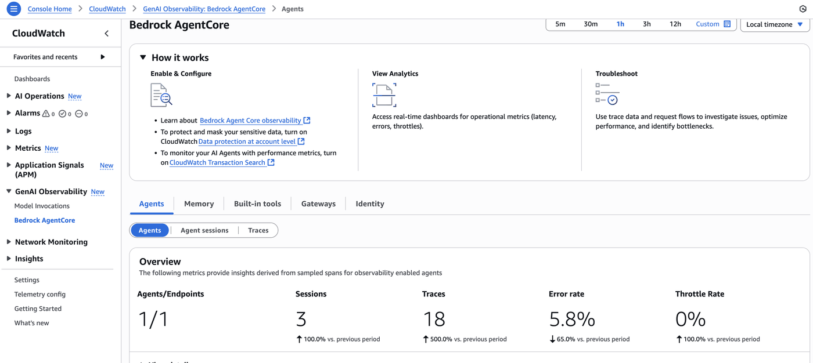
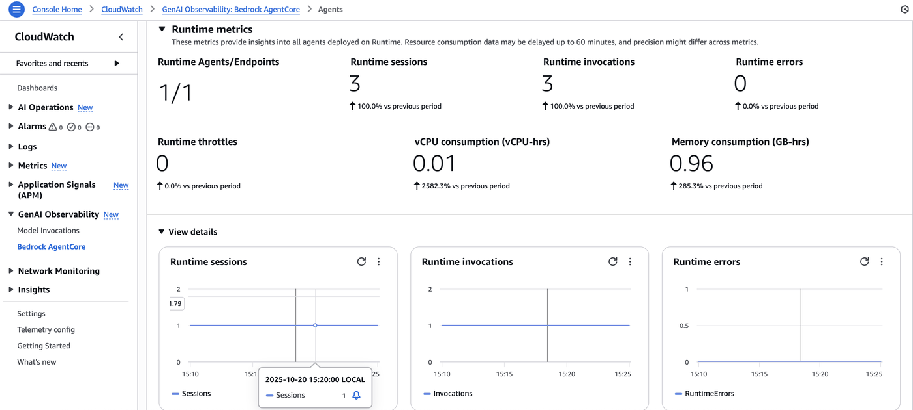
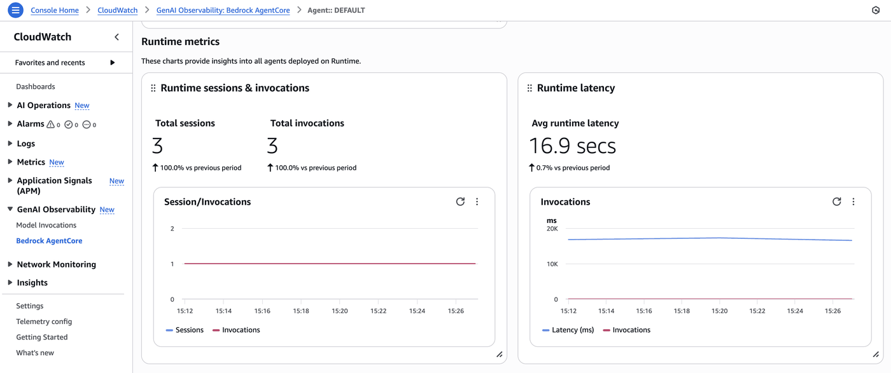
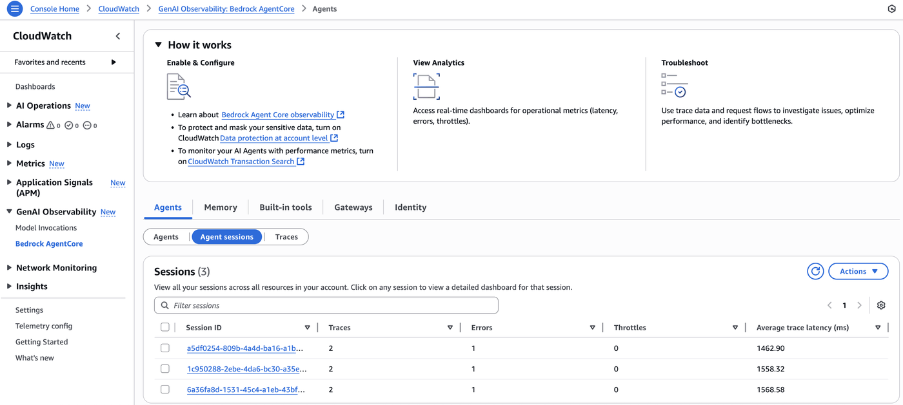
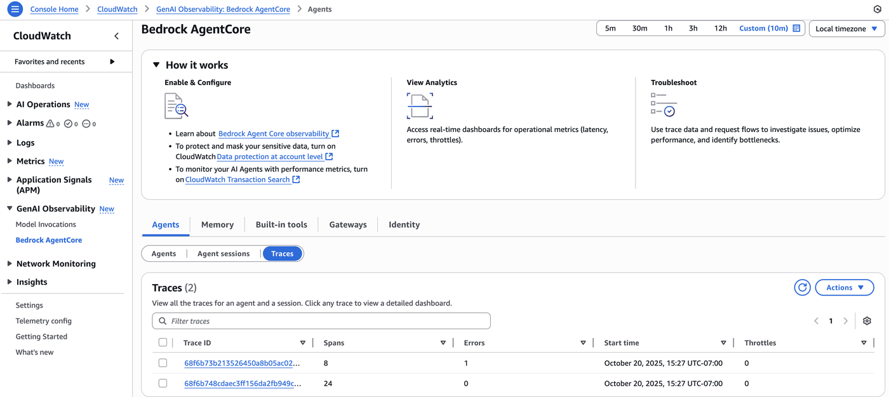

# Hosting LlamaIndex Agents with Amazon Bedrock models in Amazon Bedrock AgentCore Runtime with Observability

## Overview

In this tutorial we will learn how to host your LlamaIndex agent using Amazon Bedrock AgentCore Runtime with built-in observability. This tutorial demonstrates how to deploy a LlamaIndex agent to AgentCore Runtime and automatically capture telemetry data for monitoring and analysis.

### Tutorial Details

| Information         | Details                                                                          |
|:--------------------|:---------------------------------------------------------------------------------|
| Tutorial type       | Conversational                                                                   |
| Agent type          | Single                                                                           |
| Agentic Framework   | LlamaIndex                                                                       |
| LLM model           | Anthropic Claude Haiku                                                           |
| Tutorial components | Hosting agent on AgentCore Runtime with Observability                           |
| Tutorial vertical   | Cross-vertical                                                                   |
| Example complexity  | Easy                                                                             |
| SDK used            | Amazon BedrockAgentCore Python SDK and boto3                                    |

### Tutorial Architecture

In this tutorial we will describe how to deploy a LlamaIndex agent to AgentCore runtime with automatic observability.

For demonstration purposes, we will use a LlamaIndex FunctionAgent using Amazon Bedrock models with arithmetic tools.

### Tutorial Key Features

* Hosting LlamaIndex Agents on Amazon Bedrock AgentCore Runtime
* Using Amazon Bedrock models
* Automatic observability and tracing
* Built-in telemetry collection

## Prerequisites

To execute this tutorial you will need:
* Python 3.10+
* AWS credentials
* Amazon Bedrock AgentCore SDK
* LlamaIndex
* Amazon Bedrock Model access to Claude Haiku

### In Your Terminal:

`cd 06-workshops/06-AgentCore-observability/01-Agentcore-runtime-hosted/LlamaIndex`

`python -m venv venv`

`source venv/bin/activate`

### In Your Notebook:

Select your venv as your kernel

```python
!pip install -q --force-reinstall -U -r requirements.txt
```

## Creating your LlamaIndex agent and experimenting locally

Before we deploy our agent to AgentCore Runtime, let's develop and run it locally for experimentation purposes.

For production agentic applications we will need to decouple the agent creation process from the agent invocation one. With AgentCore Runtime, we will decorate the invocation part of our agent with the `@app.entrypoint` decorator and have it as the entry point for our runtime.

```python
%%writefile llamaindex_agent.py

import warnings
warnings.filterwarnings("ignore", message=".*validate_default.*", category=UserWarning)
import os
import json
import argparse
import boto3
from llama_index.llms.bedrock_converse import BedrockConverse
from llama_index.core.agent.workflow import FunctionAgent
from llama_index.observability.otel import LlamaIndexOpenTelemetry


# Initialize OpenTelemetry instrumentation for LlamaIndex
instrumentor = LlamaIndexOpenTelemetry()
# Start listening
instrumentor.start_registering()

def multiply(a: int, b: int) -> int:
    """Multiple two integers and returns the result integer"""
    return a * b

def add(a: int, b: int) -> int:
    """Add two integers and returns the result integer"""
    return a + b

def get_bedrock_model():
    model_id = "anthropic.claude-3-5-haiku-20241022-v1:0"
    region = boto3.Session().region_name
    
    bedrock_model = BedrockConverse(
        model=model_id,
        region_name=region,
    )
    return bedrock_model

# Initialize the model
bedrock_model = get_bedrock_model()

# Create the arithmetic agent
agent = FunctionAgent(
    tools=[add, multiply],
    llm=bedrock_model,
)

async def llamaindex_agent_bedrock(payload):
    """
    Invoke the agent with a payload
    """
    user_input = payload.get("prompt")
    response = await agent.run(user_input)
    return str(response)

if __name__ == "__main__":
    import asyncio
    parser = argparse.ArgumentParser()
    parser.add_argument("payload", type=str)
    args = parser.parse_args()
    response = asyncio.run(llamaindex_agent_bedrock(json.loads(args.payload)))
    print(response)
```

#### Invoking local agent

```python
!python llamaindex_agent.py '{"prompt": "What is (121 + 2) * 5?"}'
```

## Preparing your agent for deployment on AgentCore Runtime

Let's now deploy our agent to AgentCore Runtime. To do so we need to:
* Import the Runtime App with `from bedrock_agentcore.runtime import BedrockAgentCoreApp`
* Initialize the App in our code with `app = BedrockAgentCoreApp()`
* Decorate the invocation function with the `@app.entrypoint` decorator
* Let AgentCoreRuntime control the running of the agent with `app.run()`

### LlamaIndex Agent with Amazon Bedrock model
Let's prepare our LlamaIndex Agent for AgentCore Runtime deployment.

```python
%%writefile llamaindex_agent.py

import warnings
warnings.filterwarnings("ignore", message=".*validate_default.*", category=UserWarning)
import os
import json
import boto3
from bedrock_agentcore.runtime import BedrockAgentCoreApp
from llama_index.llms.bedrock_converse import BedrockConverse
from llama_index.core.agent.workflow import FunctionAgent
from llama_index.observability.otel import LlamaIndexOpenTelemetry


app = BedrockAgentCoreApp()

# Initialize OpenTelemetry instrumentation for LlamaIndex
instrumentor = LlamaIndexOpenTelemetry(debug=True)
# Start listening
instrumentor.start_registering()

def multiply(a: int, b: int) -> int:
    """Multiple two integers and returns the result integer"""
    return a * b

def add(a: int, b: int) -> int:
    """Add two integers and returns the result integer"""
    return a + b

def get_bedrock_model():
    model_id = "anthropic.claude-3-5-haiku-20241022-v1:0"
    region = boto3.Session().region_name
    
    bedrock_model = BedrockConverse(
        model=model_id,
        region_name=region,
    )
    return bedrock_model

# Initialize the model
bedrock_model = get_bedrock_model()

# Create the arithmetic agent
agent = FunctionAgent(
    tools=[add, multiply],
    llm=bedrock_model,
)

@app.entrypoint
async def llamaindex_agent_bedrock(payload):
    """
    Invoke the agent with a payload
    """
    user_input = payload.get("prompt")
    print("User input:", user_input)
    response = await agent.run(user_input)
    return str(response)

if __name__ == "__main__":
    app.run()
```

## What happens behind the scenes?

When you use `BedrockAgentCoreApp`, it automatically:

* Creates an HTTP server that listens on the port 8080
* Implements the required `/invocations` endpoint for processing the agent's requirements
* Implements the `/ping` endpoint for health checks
* Handles proper content types and response formats
* Manages error handling according to the AWS standards
* **Automatically enables observability and telemetry collection**

## Deploying the agent to AgentCore Runtime

The `CreateAgentRuntime` operation supports comprehensive configuration options, letting you specify container images, environment variables and encryption settings. You can also configure protocol settings (HTTP, MCP) and authorization mechanisms to control how your clients communicate with the agent.

**Note:** Operations best practice is to package code as container and push to ECR using CI/CD pipelines and IaC

In this tutorial we will use the Amazon Bedrock AgentCore Python SDK to easily package your artifacts and deploy them to AgentCore runtime.

### Configure AgentCore Runtime deployment

First we will use our starter toolkit to configure the AgentCore Runtime deployment with an entrypoint, the execution role we just created and a requirements file. We will also configure the starter kit to auto create the Amazon ECR repository on launch.

During the configure step, your docker file will be generated based on your application code

```python
from bedrock_agentcore_starter_toolkit.notebook.runtime.bedrock_agentcore import Runtime
from boto3.session import Session

boto_session = Session()
region = boto_session.region_name

agentcore_runtime = Runtime()
agent_name = "llamaindex_bedrock_getting_started10"
response = agentcore_runtime.configure(
    entrypoint="llamaindex_agent.py",
    auto_create_execution_role=True,
    auto_create_ecr=True,
    requirements_file="requirements.txt",
    region=region,
    agent_name=agent_name,
)
response
```

### Launching agent to AgentCore Runtime

Now that we've got a docker file, let's launch the agent to the AgentCore Runtime. This will create the Amazon ECR repository and the AgentCore Runtime with observability automatically enabled. You can add libraries to the environment variable below to exclude unnecessary traces from specific libraries.

```python
launch_result = agentcore_runtime.launch(
    env_vars={
        # Minimal set - only disable truly noisy instrumentations
        "OTEL_PYTHON_DISABLED_INSTRUMENTATIONS": (
            "jinja2,urllib3,requests,httpx,redis,aiohttp-client"
            # Add "starlette" to this list to get rid of the POST /invocations trace. Note: this will disable session tracking.
        )
    }
)
```

### Checking for the AgentCore Runtime Status
Now that we've deployed the AgentCore Runtime, let's check for its deployment status

```python
import time

status_response = agentcore_runtime.status()
status = status_response.endpoint["status"]
end_status = ["READY", "CREATE_FAILED", "DELETE_FAILED", "UPDATE_FAILED"]
while status not in end_status:
    time.sleep(10)
    status_response = agentcore_runtime.status()
    status = status_response.endpoint["status"]
    print(status)
status
```

## Enable Tracing for your AgentCore Runtime

In your AWS console, navigate to Amazon Bedrock AgentCore. Click on Agent Runtime under Build and Deploy and select your agent.

For your agent, scroll until you see the Tracing section. Enable this to allow for trace delivery to CloudWatch:



### Invoking AgentCore Runtime

Finally, we can invoke our AgentCore Runtime with a payload. This will automatically generate telemetry data that can be viewed in the observability dashboard.

```python
invoke_response = agentcore_runtime.invoke({"prompt": "What is (121 + 2) * 5?"})
invoke_response
```

### Processing invocation results

We can now process our invocation results to include it in an application

```python
from IPython.display import Markdown, display
import json

response_text = invoke_response["response"][0]
display(Markdown(response_text))
```

### Invoking AgentCore Runtime with boto3

Now that your AgentCore Runtime was created you can invoke it with any AWS SDK. For instance, you can use the boto3 `invoke_agent_runtime` method for it.

```python
import boto3

agent_arn = launch_result.agent_arn
agentcore_client = boto3.client("bedrock-agentcore", region_name=region)

boto3_response = agentcore_client.invoke_agent_runtime(
    agentRuntimeArn=agent_arn,
    qualifier="DEFAULT",
    payload=json.dumps({"prompt": "What is 15 * 8?"}),
)
if "text/event-stream" in boto3_response.get("contentType", ""):
    content = []
    for line in boto3_response["response"].iter_lines(chunk_size=1):
        if line:
            line = line.decode("utf-8")
            if line.startswith("data: "):
                line = line[6:]
                print(line)
                content.append(line)
    display(Markdown("\n".join(content)))
else:
    try:
        events = []
        for event in boto3_response.get("response", []):
            events.append(event)
    except Exception as e:
        events = [f"Error reading EventStream: {e}"]
    display(Markdown(json.loads(events[0].decode("utf-8"))))
```

## Observability Dashboard

### Automatic Telemetry Collection

When your LlamaIndex agent runs on AgentCore Runtime, telemetry data is automatically collected and sent to Amazon CloudWatch. This includes:

- **Agent execution traces**: Complete workflow of your agent's decision-making process
- **LLM calls**: Bedrock model invocations with input/output tokens
- **Tool usage**: Function calls and their results
- **Performance metrics**: Latency, token usage, and error rates

### Viewing Traces in CloudWatch

To view your agent's observability data:

1. Navigate to the AWS CloudWatch console
2. Go to **GenAI Observability** dashboard
3. Select your agent runtime to view traces and metrics

### Key Observability Features

- **Session tracking**: Correlate multiple interactions
- **Error monitoring**: Identify and debug issues
- **Performance analysis**: Optimize agent response times

### AgentCore Observability on Amazon CloudWatch

To summarize, please follow the below steps to enable observability from AgentCore runtime hosted agents:

- Enable Transaction Search on Amazon CloudWatch
- The requirements.txt file contains `aws-opentelemetry-distro` listed while deploying the agent on Bedrock AgentCore Runtime.

## Bedrock AgentCore Overview on GenAI Observability dashboard

You are able to view all your Agents that have observability in them and filter the data based on time frames, some examples are provided below:



In the main dashboard you are able to view runtime metrics across all agents as shown below:



Now, if you click on the agent you just deployed you will be taken to a dashboard for the runtime metrics specific to this agent, you can also filter the data by a custom time frame:



In the Sessions View tab, you can navigate to all the sessions associated with this agent:



In the Trace View tab, you can look into the traces and span information for this agent on runtime:



Please click through the various features of GenAI observability dashboard to get more detailed information on traces.

## Cleanup (Optional)

Let's now clean up the AgentCore Runtime created

```python
launch_result.ecr_uri, launch_result.agent_id, launch_result.ecr_uri.split("/")[1]
```

```python
import boto3

agentcore_control_client = boto3.client("bedrock-agentcore-control", region_name=region)
ecr_client = boto3.client("ecr", region_name=region)

runtime_delete_response = agentcore_control_client.delete_agent_runtime(
    agentRuntimeId=launch_result.agent_id,
)

response = ecr_client.delete_repository(repositoryName=launch_result.ecr_uri.split("/")[1], force=True)
```

# Congratulations!

You have successfully:

- Created a LlamaIndex agent with arithmetic tools
- Deployed it to Amazon Bedrock AgentCore Runtime
- Enabled automatic observability and telemetry collection
- Invoked the agent and generated trace data

Your agent is now running with full observability capabilities, allowing you to monitor performance, debug issues, and optimize your agentic applications.
