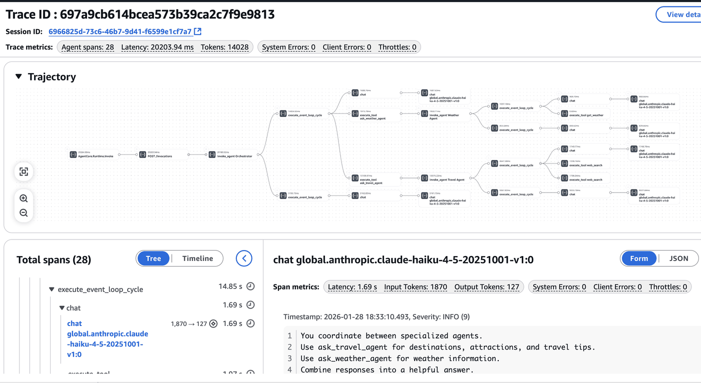
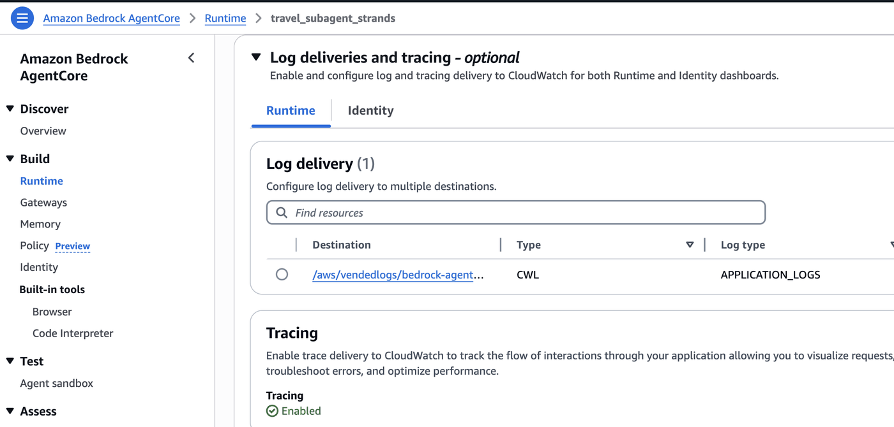
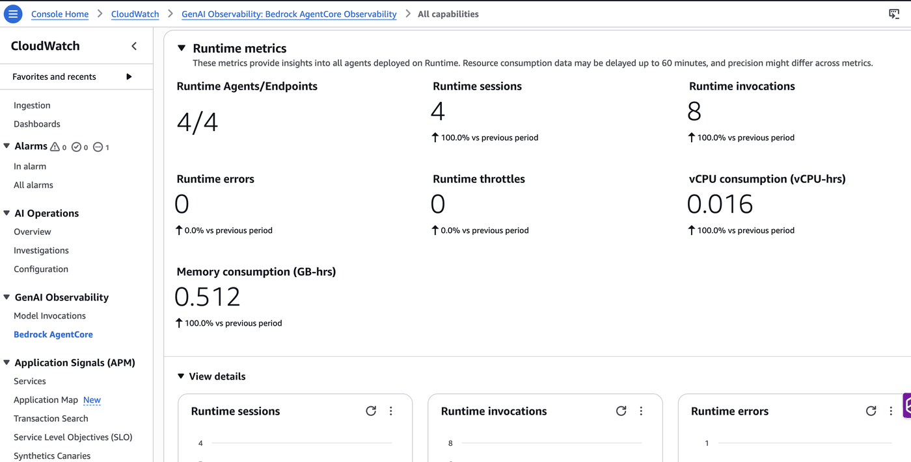
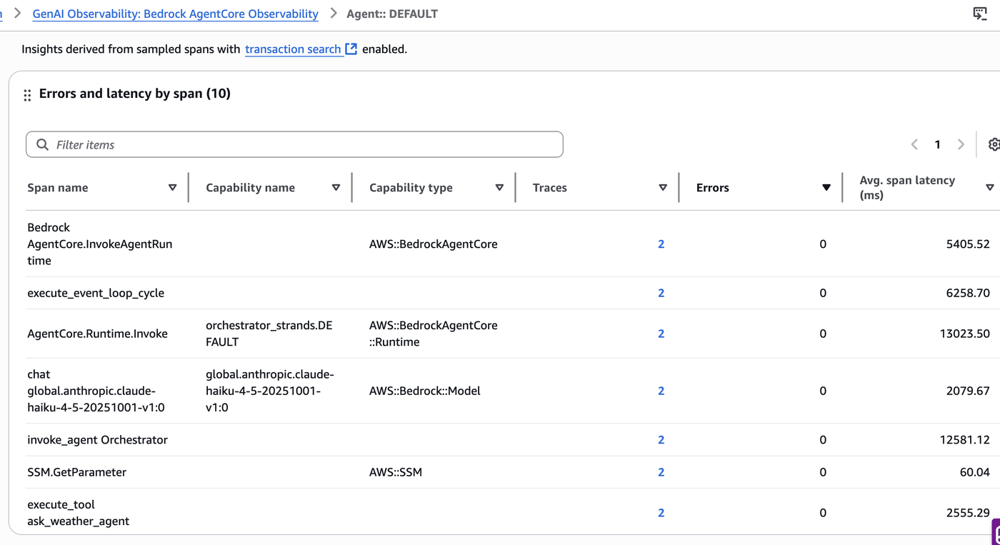
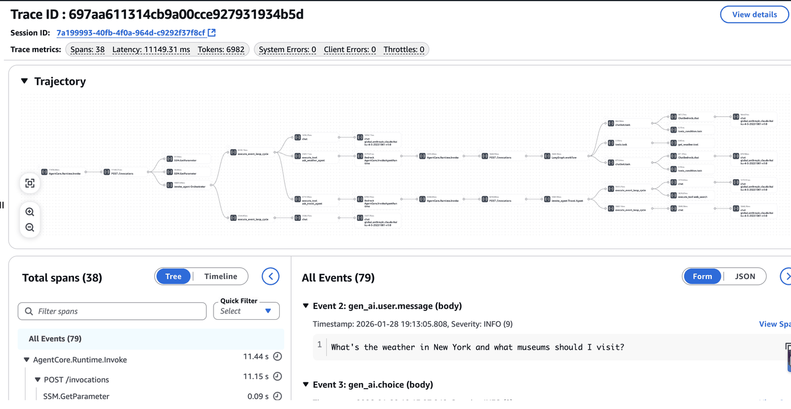

# Multi-Agent Observability with Amazon Bedrock AgentCore

## Overview

This tutorial demonstrates how to build multi-agent systems with full observability using Amazon Bedrock AgentCore Runtimes and CloudWatch GenAI Observability.

We'll explore two architectures:
1. **Part 1: Single Runtime** - All agents in one runtime (simpler, unified traces)
2. **Part 2: Multi-Runtime** -  Agents in seperate runtimes with mixed frameworks ( linked traces)

### Tutorial Details

| Information | Details |
|:------------|:--------|
| Tutorial type | Conversational |
| Agent type | Multi-Agent (Supervisor pattern) |
| Agentic Frameworks | Strands Agents & LangGraph |
| LLM model | Anthropic Claude Haiku 4.5 |
| Key Features | Multi-agent coordination, OTEL observability |
| SDK used | Amazon BedrockAgentCore Python SDK, boto3, Strands Agents, LangGraph |

### What You'll Learn

- How to build multi-agent systems with Strands and LangGraph
- How observability works with `Strands Agents` and `LangGraph`
- How to use OpenTelemetry baggage for session propagation
- How to correlate traces across multiple runtimes 
- How to view and analyze traces in GenAI Observability dashboard

---
**Two architectures:**
1. **Part 1: Single Runtime** - All agents in one runtime (unified traces)
2. **Part 2: Multi-Runtime with multi framework** - Distributed agents (linked traces via session correlation)

### Comparison

| Aspect | Single Runtime | Multi-Runtime  |
|--------|----------------|---------------------|
| **Architecture** | 1 runtime, all agents | 3 separate runtimes |
| **Frameworks** | All Strands | Strands Agents + LangGraph |
| **Communication** | Direct function calls | Runtime invocations with `runtimeSessionId` |
| **Session Propagation** | Automatic within runtime | OpenTelemetry baggage |
| **IAM** | Single role | Separate roles per agent |
| **Trace View** | Single unified trace tree | Correlated traces via session ID |
| **Complexity** | Simpler | More complex |
| **Use Case** | Single team, tight integration | Different teams, different frameworks |

> **Note:** This is a tutorial demonstrating **multi-agent architecture patterns** and **observability setup** for educational purpose.

---

## Architecture Overview

```
                                USER REQUEST
                                     │
                 ┌───────────────────┴───────────────────┐
                 │                                       │
                 ▼                                       ▼
┌────────────────────────────────────┐  ┌────────────────────────────────────┐
│     PART 1: SINGLE RUNTIME         │  │     PART 2: MULTI-RUNTIME          │
│     (Simple & Unified)             │  │     (Distributed & Scalable)       │
└────────────────────────────────────┘  └────────────────────────────────────┘

        SINGLE RUNTIME                          MULTI-RUNTIME 
┌──────────────────────────────┐       ┌──────────────────────────────┐
│   SINGLE AGENTCORE RUNTIME   │       │   ORCHESTRATOR (Strands)     │
│                              │       │   AgentCore Runtime #1       │
│  ┌────────────────────────┐  │       │   [OTel Baggage: session.id] │
│  │  ORCHESTRATOR (Strands)│  │       └──────────────┬───────────────┘
│  │         │              │  │                      │
│  │    ┌────┴────┐         │  │                      |
│  │    ▼         ▼         │  │              ┌───────┴───────┐
│  │ TRAVEL    WEATHER      │  │              │               │
│  │(Strands) (Strands)     │  │              ▼               ▼
│  │web_search get_weather  │  │       ┌─────────────┐ ┌─────────────┐
│  └────────────────────────┘  │       │TRAVEL AGENT │ │WEATHER AGENT│
│                              │       │ (Strands)   │ │ (LangGraph) │
│  → Single unified trace      │       │ Runtime #2  │ │ Runtime #3  │
└──────────────────────────────┘       │ web_search  │ │ get_weather │
                                       └─────────────┘ └─────────────┘

        OBSERVABILITY                          OBSERVABILITY
┌──────────────────────────────┐       ┌──────────────────────────────┐
│  Single Unified Trace Tree   │       │  Session-Correlated Traces   │
│                              │       │                              │
│  Orchestrator                │       │                              │
│       │                      │       │                              │
│       ├── Travel Agent       │       │  Orchestrator Trace          │
│       │    └── web_search    │       │  Travel Agent Trace          │
│       └── Weather Agent      │       │  Weather Agent Trace         │
│            └── get_weather   │       │                              │
└──────────────────────────────┘       └──────────────────────────────┘
                 │                                       │
                 └───────────────────┬───────────────────┘
                                     ▼
                    ┌────────────────────────────────────┐
                    │  CloudWatch GenAI Observability    │
                    └────────────────────────────────────┘
```

## Prerequisites

1. AWS CLI configured (`aws configure`) with minimum set of permissions needed.
2. Amazon Bedrock model access for `global.anthropic.claude-haiku-4-5-20251001-v1:0` 
3. CloudWatch Transaction Search (enabled)[https://docs.aws.amazon.com/AmazonCloudWatch/latest/monitoring/Enable-TransactionSearch.html]

## Setup

```python
!pip install -r requirements.txt --quiet
```

```python
import os
import boto3
import time
from pathlib import Path
from boto3.session import Session
from bedrock_agentcore_starter_toolkit import Runtime

# Set BASE_DIR as an absolute path that won't change
BASE_DIR = Path(os.getcwd()).resolve()
print(f"Base directory: {BASE_DIR}")

# Import utilities
import sys

sys.path.insert(0, str(BASE_DIR))
from utils import (
    update_orchestrator_permissions,
    cleanup_runtime,
    cleanup_ssm_parameters,
)

region = Session().region_name
print(f"Using region: {region}")
```

Helper to poll runtime status until deployment completes.

```python
def wait_for_ready(runtime):
    """Wait for runtime to be ready."""
    status = runtime.status().endpoint["status"]
    print(status)
    while status not in ["READY", "CREATE_FAILED", "UPDATE_FAILED"]:
        time.sleep(10)
        status = runtime.status().endpoint["status"]
        print(f"Status: {status}")
    return status
```

---
# Part 1: Single Runtime Multi-Agent

All agents (Orchestrator, Travel, Weather) run in **one runtime** with direct function calls.

In this section, we deploy all agents (Orchestrator, Travel, Weather) in a **single AgentCore Runtime**.

**Architecture:**
```
┌─────────────────────────────────────┐
│     Single AgentCore Runtime        │
│  ┌─────────────────────────────┐    │
│  │    ORCHESTRATOR (Strands)   │    │
│  │         │                   │    │
│  │    ┌────┴────┐              │    │
│  │    ▼         ▼              │    │
│  │ TRAVEL    WEATHER           │    │
│  │ (Strands) (Strands)         │    │
│  │ web_search get_weather      │    │
│  └─────────────────────────────┘    │
│                                     │
│                                     │
│  → Single unified trace tree        │
└─────────────────────────────────────┘
```

- **Benefit**: Simple setup, single unified trace tree in CloudWatch

Deploy the single runtime. The starter toolkit handles:
- Building Docker image and pushing to ECR
- Creating IAM execution role with required permissions
- Deploying to AgentCore Runtime

```python
# Change to single_runtime directory
os.chdir(BASE_DIR / "single_runtime")

single_runtime = Runtime()
single_runtime.configure(
    entrypoint="multi_agent.py",
    auto_create_execution_role=True,
    auto_create_ecr=True,
    requirements_file="requirements.txt",
    region=region,
    agent_name="single_runtime_demo",
)

single_launch = single_runtime.launch()
print(f"Agent ARN: {single_launch.agent_arn}")

# Change back to base directory
os.chdir(BASE_DIR)
```

```python
wait_for_ready(single_runtime)
```

### Test Single Runtime

```python
# Invocation 1
print("=== Invocation 1 ===")
response = single_runtime.invoke({"prompt": "What's the weather in Paris and what should I visit?"})
print(response)
```

```python
# Invocation 2
print("=== Invocation 2 ===")
response = single_runtime.invoke({"prompt": "What's the weather in Tokyo and recommend some local food?"})
print(response)
```

### View the traces on Cloudwatch GenAI Observability Dashboard 

<div style="text-align:left">
    
</div>

---
# Part 2: Multi-Runtime

Three separate runtimes communicating via `invoke_agent_runtime()`.

```
┌───────────────────────────────────────────────────────────┐
│                  ORCHESTRATOR (Strands)                   │
│                  AgentCore Runtime #1                     │
└─────────────────────────┬─────────────────────────────────┘
                          │ invoke_agent_runtime()
          ┌───────────────┴───────────────┐
          ▼                               ▼
┌───────────────────────┐     ┌───────────────────────┐
│   TRAVEL (Strands)    │     │  WEATHER (LangGraph)  │
│   Runtime #2          │     │  Runtime #3           │
│   web_search          │     │                       │
└───────────────────────┘     └───────────────────────┘
```

### 2.1 Deploy Travel Agent (Strands) on AgentCore Runtime

```python
# Change to travel_agent directory
os.chdir(BASE_DIR / "travel_agent")
```

Store agent ARN in SSM for orchestrator discovery for secure storage

```python
travel_runtime = Runtime()
travel_runtime.configure(
    entrypoint="main.py",
    auto_create_execution_role=True,
    auto_create_ecr=True,
    requirements_file="requirements.txt",
    region=region,
    agent_name="travel_subagent_strands",
)

travel_launch = travel_runtime.launch()
travel_arn = travel_launch.agent_arn
print(f"Travel Agent ARN: {travel_arn}")
```

```python
ssm = boto3.client("ssm")
ssm.put_parameter(Name="/agents/travel_agent_arn", Value=travel_arn, Type="String", Overwrite=True)
ssm.put_parameter(
    Name="/agents/travel_agent_provider",
    Value="travel_agent_strands",
    Type="String",
    Overwrite=True,
)
print("Travel Agent metadata saved to SSM")
```

```python
wait_for_ready(travel_runtime)

print("\n" + "=" * 80)
print("📊 ENABLE OBSERVABILITY FOR TRAVEL AGENT RUNTIME")
print("=" * 80)
print("""
To enable vended logs and tracing for this runtime, follow these steps in the AWS Console and ensure you have Transaction Search enabled in your account:

🔹 CONFIGURE LOG DELIVERY:
1. Open the Agent Runtime page in the AgentCore console
2. In the Runtime agents pane, select the runtime: 'travel_subagent_strands'
3. Scroll down to the Log delivery pane and from Add drop-down, choose:
   - Amazon CloudWatch Logs (recommended)
4. Configure log delivery details:
   - Log type: APPLICATION_LOGS
   - Destination log group: /aws/vendedlogs/bedrock-agentcore/travel_subagent_strands
5. Choose Add
6. Verify that log delivery status shows "Delivery active"

🔹 CONFIGURE TRACING:
1. In the same runtime agent details page
2. In the Tracing pane, choose Edit
3. Toggle the widget to Enable
4. Choose Save
""")

# Change back to base directory
os.chdir(BASE_DIR)
```

<div style="text-align:left">
    
</div>

### 2.2 Deploy Weather Agent (LangGraph) on AgentCore Runtime

```python
# Change to weather_agent directory
os.chdir(BASE_DIR / "weather_agent")

weather_runtime = Runtime()
weather_runtime.configure(
    entrypoint="main.py",
    auto_create_execution_role=True,
    auto_create_ecr=True,
    requirements_file="requirements.txt",
    region=region,
    agent_name="weather_subagent_lang",
)

weather_launch = weather_runtime.launch()
weather_arn = weather_launch.agent_arn
print(f"Weather Agent ARN: {weather_arn}")
```

```python
ssm.put_parameter(Name="/agents/weather_agent_arn", Value=weather_arn, Type="String", Overwrite=True)
ssm.put_parameter(
    Name="/agents/weather_agent_provider",
    Value="weather_agent_lang",
    Type="String",
    Overwrite=True,
)
print("Weather Agent metadata saved to SSM")
```

```python
wait_for_ready(weather_runtime)

print("\n" + "=" * 80)
print("📊 ENABLE OBSERVABILITY FOR WEATHER AGENT RUNTIME")
print("=" * 80)
print("""
To enable vended logs and tracing for this runtime, follow these steps in the AWS Console:

🔹 CONFIGURE LOG DELIVERY:
1. Open the Agent Runtime page in the AgentCore console
2. In the Runtime agents pane, select the runtime: 'weather_agent_lang'
3. Scroll down to the Log delivery pane and from Add drop-down, choose:
   - Amazon CloudWatch Logs (recommended)
4. Configure log delivery details:
   - Log type: APPLICATION_LOGS
   - Destination log group: /aws/vendedlogs/bedrock-agentcore/weather_agent_lang
5. Choose Add
6. Verify that log delivery status shows "Delivery active"

🔹 CONFIGURE TRACING:
1. In the same runtime agent details page
2. In the Tracing pane, choose Edit
3. Toggle the widget to Enable
4. Choose Save

""")

# Change back to base directory
os.chdir(BASE_DIR)
```

### 2.3 Deploy Orchestrator Agent

Routes queries to sub-agents via `invoke_agent_runtime()` with session ID propagation.

```python
# Change to orchestrator_agent directory
os.chdir(BASE_DIR / "orchestrator_agent")

orchestrator_runtime = Runtime()
orchestrator_runtime.configure(
    entrypoint="main.py",
    auto_create_execution_role=True,
    auto_create_ecr=True,
    requirements_file="requirements.txt",
    region=region,
    agent_name="orchestrator_strands",
)

orchestrator_launch = orchestrator_runtime.launch()
print(f"Orchestrator ARN: {orchestrator_launch.agent_arn}")
```

```python
# Verify these values first
print(f"Travel ARN: {travel_arn}")
print(f"Weather ARN: {weather_arn}")
print(f"Orchestrator ID: {orchestrator_launch.agent_id}")
```

Add IAM permissions for orchestrator to invoke sub-agents.

**Important**: After updating IAM permissions, we wait 60 seconds for the changes to propagate across AWS services. This prevents "AccessDeniedException" errors when the orchestrator tries to access SSM parameters or invoke sub-agents.

```python
# Import utils from the base directory
import sys

sys.path.insert(0, str(BASE_DIR))

update_orchestrator_permissions(
    sub_agent_arns=[travel_arn, weather_arn],
    orchestrator_agent_id=orchestrator_launch.agent_id,
    region=region,
)

# Wait for IAM propagation
print("⏳ Waiting 60 seconds for IAM permissions to propagate...")
print("   This ensures the orchestrator can access SSM parameters and invoke sub-agents.")
time.sleep(60)
print("✅ IAM propagation wait complete")
```

```python
wait_for_ready(orchestrator_runtime)

print("\n" + "=" * 80)
print("📊 ENABLE OBSERVABILITY FOR ORCHESTRATOR RUNTIME")
print("=" * 80)
print("""
To enable vended logs and tracing for this runtime, follow these steps in the AWS Console:

🔹 CONFIGURE LOG DELIVERY:
1. Open the Agent Runtime page in the AgentCore console
2. In the Runtime agents pane, select the runtime: 'orchestrator_strands'
3. Scroll down to the Log delivery pane and from Add drop-down, choose:
   - Amazon CloudWatch Logs (recommended)
4. Configure log delivery details:
   - Log type: APPLICATION_LOGS
   - Destination log group: /aws/vendedlogs/bedrock-agentcore/orchestrator_strands
5. Choose Add
6. Verify that log delivery status shows "Delivery active"

🔹 CONFIGURE TRACING:
1. In the same runtime agent details page
2. In the Tracing pane, choose Edit
3. Toggle the widget to Enable
4. Choose Save

""")

# Change back to base directory
os.chdir(BASE_DIR)
```

### Test Multi-Runtime, Multi Framework setup

```python
# Pause to enable observability settings
print("⏸️  IMPORTANT: Before testing the multi-runtime system:")
print("1. Enable vended logs and tracing for all three runtimes in the AWS Console")
print("2. Follow the instructions printed above for each runtime")
print("3. Wait 1-2 minutes for settings to propagate")
print("\n✅ Once you've enabled observability for all runtimes, proceed to test the system")
```

### 📊 AgentCore Observability Configuration Summary 

After enabling vended logs and tracing for all three runtimes along with Agent Observability, you'll have visibility into the system heath alongside your agent behaviour :

| Runtime | Log Group | Tracing |
|---------|-----------|---------|
| Travel Agent | `/aws/vendedlogs/bedrock-agentcore/travel_subagent_strands` | Enabled |
| Weather Agent | `/aws/vendedlogs/bedrock-agentcore/weather_subagent_lang` | Enabled |
| Orchestrator | `/aws/vendedlogs/bedrock-agentcore/orchestrator_strands` | Enabled |

**Key Benefits:**
- **Vended Logs**: Application logs from each runtime are automatically delivered to CloudWatch
- **Distributed Tracing**: Traces are correlated across runtimes
- **GenAI Observability**: Full visibility into multi-agent interactions

```python
# Invocation 1
print("=== Invocation 1 ===")
response = orchestrator_runtime.invoke({"prompt": "What's the weather in New York and what museums should I visit?"})
print(response)

print("\n" + "=" * 50 + "\n")

# Invocation 2
print("=== Invocation 2 ===")
response = orchestrator_runtime.invoke(
    {"prompt": "What's the weather in Seattle and what are the best parks to visit?"}
)
print(response)
```

### View Traces

To view the traces and observability data for your multi-agent system:

## AgentCore Observability on Amazon CloudWatch

Once you've enabled vended logs and tracing for all runtimes, follow these steps to view your observability data:


- Vended logs and tracing are enabled for all three runtimes
- Wait 2-3 minutes for traces to appear after invocations

### Viewing Your Multi-Agent System in GenAI Observability Dashboard

#### 1. **Bedrock AgentCore Overview**
Navigate to **AWS Console** → **CloudWatch** → **GenAI Observability**

You'll see all your agents:
- `orchestrator_strands`
- `travel_subagent_strands`
- `weather_agent_lang`

Filter the data based on time frames to focus on your recent test invocations.

#### 2. **Runtime Metrics (All Agents)**
In the main dashboard, view runtime metrics across all agents:

<div style="text-align:left">
    
</div>


#### 3. **Per-Agent View**
Click on any specific agent (e.g., `orchestrator_strands`) to see:
- Agent-specific runtime metrics
- Request/response patterns
- Performance changes
- Custom time frame filtering

<div style="text-align:left">
    
</div>

#### 4. **Sessions View**
Navigate to the **Sessions View** tab to see:
- All sessions associated with each agent
- Session IDs that link requests across multiple runtimes
- Request flow from orchestrator to sub-agents

#### 5. **Trace View**
In the **Trace View** tab, examine:
- Detailed traces and span information for each runtime in timelines
- The complete trajectory view 
  ```
  Orchestrator (receives request)
  ├── Invoke Travel Agent (with runtimeSessionId)
  │   └── Web Search Tool calls
  ├── Invoke Weather Agent (with runtimeSessionId)
  │   └── Weather Tool calls
  └── Response aggregation
  ```
- Span attributes showing:
  - Model invocations
  - Tool executions
  - Latency breakdown


<div style="text-align:left">
    
</div>


#### 6. **Correlated Traces Across Runtimes**
To view the complete multi-agent interaction:
1. Find a trace from the orchestrator
2. You'll see correlated traces from all three runtimes showing the complete distributed execution and you are able to view it for the subagents as well.

### Key Observability Features for Multi-Agent Systems

| Feature | Description | Use Case |
|---------|-------------|----------|
| **Vended Logs** | Application logs automatically delivered to CloudWatch | Debug agent logic and errors |
| **Distributed Tracing** | Traces correlated  | Track requests across agents |
| **Session Correlation** | Link all spans from a single user request | Full request flow visibility |
| **Tool Execution Spans** | See individual tool calls (web_search, get_weather) | Performance transparency |
| **Model Invocation Metrics** | Token usage and latency per model call | Cost and performance monitoring |

### Vended Logs and Tracing for AgentCore Runtime along with the agent

Click through the various features of the GenAI observability dashboard to explore detailed trace information, performance metrics, and system behavior.

---
# Cleanup

Please also clean up the all the associated resources to avoid additional costs like ECR, logs etc.

```python
# Clean up all resources
cleanup_runtime(single_launch, "single_runtime_demo", region)
cleanup_runtime(travel_launch, "travel_agent_strands", region)
cleanup_runtime(weather_launch, "weather_agent_lang", region)
cleanup_runtime(orchestrator_launch, "orchestrator_strands", region)

cleanup_ssm_parameters(
    [
        "/agents/travel_agent_arn",
        "/agents/travel_agent_provider",
        "/agents/weather_agent_arn",
        "/agents/weather_agent_provider",
    ]
)

print("Cleanup complete!")
```
