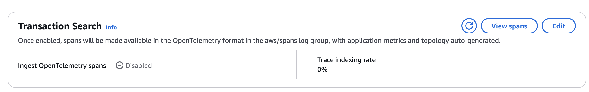
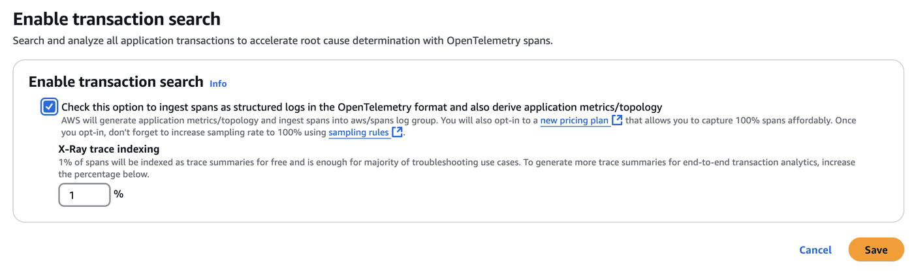
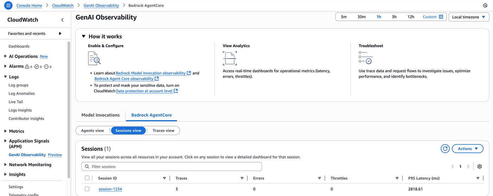
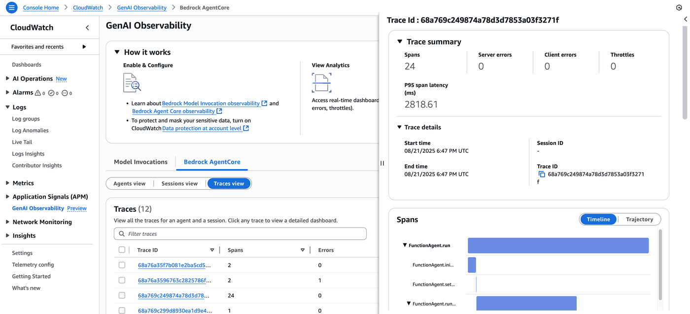
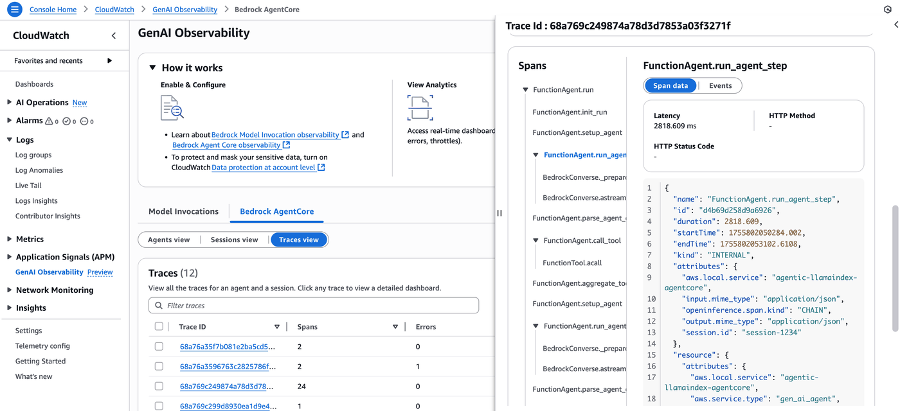

# Amazon Bedrock AgentCore Observability with LlamaIndex hosted outside of AgentCore Runtime

This notebook demonstrates how to use setup observability for a [Llama Index Agent](https://docs.llamaindex.ai/en/stable/use_cases/agents/)  agent hosted outside of Amazon Bedrock AgentCore Runtime. Once you have completed the setup, you will be able to view the internal decision making process of the LlamaIndex agent in GenAI Observability dashboard in Amazon CloudWatch.

## What you'll learn
- How to set up LlamaIndex agent with Amazon OpenTelemetry Python Instrumentation
- How to visualize and analyze agent traces in Amazon CloudWatch GenAI Observability


## Prerequisites
- Enable transaction search on Amazon CloudWatch. First-time users must enable CloudWatch Transaction Search to view Bedrock AgentCore spans and traces. To enable transaction search, please refer to the our [documentation](https://docs.aws.amazon.com/AmazonCloudWatch/latest/monitoring/Enable-TransactionSearch.html).
- Log group and Log stream configured on Amazon Cloudwatch to be added to the environment variables.
- AWS account with Amazon Bedrock Model access to Claude Haiku 4.5 with Model ID: global.anthropic.claude-haiku-4-5-20251001-v1:0
- AWS credentials configured using `aws configure` 
- .env file updated with environment variables variables. An example is provided in `.env.example`

## 1. Setup and Installation

Before running this notebook, ensure you already setup your virtual environment by following the steps below:

1. Change to the LlamaIndex directory in your terminal

2. Create and activate a virtual environment:
   ```bash
   # Create a virtual environment
   python -m venv venv

   # Activate the virtual environment
   # On Windows
   venv\Scripts\activate
   # On macOS/Linux
   source venv/bin/activate
   ```

3. Install dependencies:
   ```bash
   pip install -r requirements.txt
   ```

4. When opening the notebook in Jupyter or VS Code:
   - Select the "venv" kernel from the kernel selector
   - If the kernel doesn't appear in the list, restart Jupyter or VS Code

#### Deploying pre-requisites

Before starting let's create a log group and a log stream for AgentCore observability

```python
import boto3

cloudwatch_client = boto3.client("logs", region_name="us-west-2")
response = cloudwatch_client.create_log_group(
    logGroupName="agents/llama-index-agent-logs",
)
response
```

```python
response = cloudwatch_client.create_log_stream(logGroupName="agents/llama-index-agent-logs", logStreamName="default")
response
```

#### Enabling transactional search

To run this example you first need to enable transactional search. You can do so in the AWS console following this [link](https://console.aws.amazon.com/cloudwatch/home#xray:settings/transaction-search).

Once in this page, click on edit and set the option to ingest spans as structured logs in the OpenTelemetry format




## 2. Environment Configuration
To enable observability for your LlamaIndex agent and send telemetry data to Amazon CloudWatch, you'll need to configure the following environment variables. We use a `.env` file to manage these settings securely, keeping sensitive AWS credentials separate from your code while making it easy to switch between different environments.

**Ensure your AWS credentials are configured**

We will create a `.env` file for configuring the environment variables. Use `env.example` as a template.

Required Environment Variables:

| Variable | Value | Purpose |
|----------|-------|---------|
| `OTEL_PYTHON_DISTRO` | `aws_distro` | Use AWS Distro for OpenTelemetry (ADOT) |
| `OTEL_PYTHON_CONFIGURATOR` | `aws_configurator` | Set AWS configurator for ADOT SDK |
| `OTEL_EXPORTER_OTLP_PROTOCOL` | `http/protobuf` | Configure export protocol |
| `OTEL_EXPORTER_OTLP_LOGS_HEADERS` | `x-aws-log-group=<YOUR-LOG-GROUP>,x-aws-log-stream=<YOUR-LOG-STREAM>,x-aws-metric-namespace=<YOUR-NAMESPACE>` | Direct logs to CloudWatch groups |
| `OTEL_RESOURCE_ATTRIBUTES` | `service.name=<YOUR-AGENT-NAME>` | Identify your agent in observability data |
| `AGENT_OBSERVABILITY_ENABLED` | `true` | Activate ADOT pipeline |
| `AWS_REGION` | `<YOUR-REGION>` | AWS Region |

```python
%%writefile .env
# AWS OpenTelemetry Distribution
OTEL_PYTHON_DISTRO=aws_distro
OTEL_PYTHON_CONFIGURATOR=aws_configurator

# Export Protocol
OTEL_EXPORTER_OTLP_PROTOCOL=http/protobuf
OTEL_TRACES_EXPORTER=otlp

# CloudWatch Integration (uncomment and configure as needed)
OTEL_EXPORTER_OTLP_LOGS_HEADERS=x-aws-log-group=agents/llama-index-agent-logs10,x-aws-log-stream=default,x-aws-metric-namespace=bedrock-agentcore

# Service Identification
OTEL_RESOURCE_ATTRIBUTES=service.name=agentic-llamaindex-agentcore
# Enable Agent Observability
AGENT_OBSERVABILITY_ENABLED=true

# Disable instrumentations to get rid of span noise (OPTIONAL)
OTEL_PYTHON_DISABLED_INSTRUMENTATIONS=jinja2
```

## 3. Load Environment Variables

Let's load the environment variables from the `.env` file:

```python
import os
from dotenv import load_dotenv

# Load environment variables from .env file
load_dotenv()

# Display the OTEL-related environment variables
otel_vars = [
    "OTEL_PYTHON_DISTRO",
    "OTEL_PYTHON_CONFIGURATOR",
    "OTEL_EXPORTER_OTLP_PROTOCOL",
    "OTEL_EXPORTER_OTLP_LOGS_HEADERS",
    "OTEL_RESOURCE_ATTRIBUTES",
    "AGENT_OBSERVABILITY_ENABLED",
    "OTEL_TRACES_EXPORTER",
    "OTEL_PYTHON_DISABLED_INSTRUMENTATIONS",
]

print("OpenTelemetry Configuration:")
for var in otel_vars:
    value = os.getenv(var)
    if value:
        print(f"{var}={value}")
```

## 4. Create a LlamaIndex Agent in a python file

LlamaIndex arithmetic agent implementation is provided in `llama_index_agent.py`. It is a simple arithmetic agent set up with a Claude 3 Haiku model from Amazon Bedrock. The AWS OpenTelemetry distro will automatically handle tracer provider setup when using `opentelemetry-instrument` command.

The agent is a simple arithmetic agent that:

- Creates a FunctionAgent using AWS Bedrock's Claude Haiku model
- Defines basic arithmetic tools for addition and multiplication
- Gives the agent a task to calculate a simple mathematical expression: (121 + 2) * 5
- Runs the agent and returns the calculated result

The Agent is Configured with the following:

- Two arithmetic function tools: add and multiply
- Amazon Bedrock's Claude Haiku model as its Large Language Model
- OpenTelemetry instrumentation for tracing and observability

The agent is executed asynchronously using the agent's run method, which processes the math query and returns the result.

```python
%%writefile llama_index_agent.py
###########################
#### Agent Code below: ####
###########################
import os
import asyncio
import logging
from llama_index.observability.otel import LlamaIndexOpenTelemetry
from llama_index.llms.bedrock_converse import BedrockConverse
from llama_index.core.agent.workflow import FunctionAgent

# Initialize OpenTelemetry instrumentation for LlamaIndex
instrumentor = LlamaIndexOpenTelemetry(debug=True)

# Set up logging
logging.basicConfig(level=logging.INFO)
logger = logging.getLogger(__name__)

# Configure LlamaIndex logging
logging.getLogger("llamaindex").setLevel(logging.INFO)

def multiply(a: int, b: int) -> int:
    """Multiple two integers and returns the result integer"""
    return a * b


def add(a: int, b: int) -> int:
    """Add two integers and returns the result integer"""
    return a + b


def get_bedrock_model():
    model_id = os.getenv("BEDROCK_MODEL_ID", "global.anthropic.claude-haiku-4-5-20251001-v1:0")
    region = os.getenv("AWS_DEFAULT_REGION", "us-west-2")
    
    try:
        # Let boto3 handle credential resolution automatically
        bedrock_model = BedrockConverse(
            model=model_id,
            region_name=region,
            # No explicit credentials - boto3 will find them automatically
        )
        logger.info(f"Successfully initialized Bedrock model: {model_id} in region: {region}")
        return bedrock_model
    except Exception as e:
        logger.error(f"Failed to initialize Bedrock model: {str(e)}")
        logger.error("Please ensure you have proper AWS credentials configured and access to the Bedrock model")
        raise

# Initialize the model
bedrock_model = get_bedrock_model()

# Create the arithmetic agent
agent = FunctionAgent(
    tools=[add, multiply],
    llm=bedrock_model,
)

# Start listening
instrumentor.start_registering()

# Execute the arithmetic task
query = """What is (121 + 2) * 5?"""

async def main():
    result = await agent.run(query)
    print("Result:", str(result))

asyncio.run(main())
```

## 5. AWS OpenTelemetry Python Distro

Now that your environment is configured, let's understand how the observability happens. The [AWS OpenTelemetry Python Distro](https://pypi.org/project/aws-opentelemetry-distro/) automatically instruments your LlamaIndex agent to capture telemetry data without requiring code changes.

This distribution provides:
- **Auto-instrumentation** for your Strands Agent hosted outside of AgentCore Runtime (i.e. EC2, Lambda etc..)
- **AWS-optimized configuration** for seamless CloudWatch integration  

### Running Your Instrumented Agent

To capture traces from your LlamaIndex agent, use the `opentelemetry-instrument` command instead of running Python directly. This automatically applies instrumentation using the environment variables from your `.env` file:

```bash
opentelemetry-instrument python llama_index_agent.py
```

This command will:

- Load your OTEL configuration from the .env file
- Automatically instrument LlamaIndex, Amazon Bedrock calls, agent tool and databases, and other requests made by agent
- Send traces to CloudWatch
- Enable you to visualize the agent's decision-making process in the GenAI Observability dashboard

```python
!opentelemetry-instrument python llama_index_agent.py
```

## 6. Adding Session Tracking

To correlate traces across multiple agent runs, you can associate a session ID with your telemetry data using OpenTelemetry baggage:

```python
from opentelemetry import baggage, context
ctx = baggage.set_baggage("session.id", session_id)
```

Run the session-enabled version:
```bash
opentelemetry-instrument python llama_indedx_agent_with_session.py --session-id "user-session-123"
```

## 7. Custom Metadata for Analysis
Add custom attributes to enable filtering, offline evaluations, and performance analysis. You would need to modify your agent code to accept additional parameters:
```python
ctx = baggage.set_baggage("user.type", "premium")
ctx = baggage.set_baggage("experiment.id", "llama-agent")
ctx = baggage.set_baggage("conversation.topic", "arithmetic")
```

Example commands with custom metadata:

```bash
# A/B testing different experiments
opentelemetry-instrument python agent.py --session-id "session-123" --experiment-id "model-a"
opentelemetry-instrument python agent.py --session-id "session-124" --experiment-id "model-b"

# Tracking different user types
opentelemetry-instrument python agent.py --session-id "session-125" --user-type "premium"
opentelemetry-instrument python agent.py --session-id "session-126" --user-type "free"

# Offline evaluation runs
opentelemetry-instrument python agent.py --session-id "eval-001" --dataset "golden-set-v1"
```
These attributes appear in CloudWatch traces for advanced filtering and analysis.

```python
%%writefile llama_index_agent_with_session.py
import os
import logging
import argparse
import asyncio
from opentelemetry import baggage, context
from llama_index.observability.otel import LlamaIndexOpenTelemetry
from llama_index.llms.bedrock_converse import BedrockConverse
from llama_index.core.agent.workflow import FunctionAgent

def parse_arguments():
    parser = argparse.ArgumentParser(description='LlamaIndex Arithmetic Agent with Session Tracking')
    parser.add_argument('--session-id', 
                       type=str, 
                       required=True,
                       help='Session ID to associate with this agent run')
    return parser.parse_args()

def set_session_context(session_id):
    """Set the session ID in OpenTelemetry baggage for trace correlation"""
    ctx = baggage.set_baggage("session.id", session_id)
    token = context.attach(ctx)
    logging.info(f"Session ID '{session_id}' attached to telemetry context")
    return token

###########################
#### Agent Code below: ####
###########################

# Initialize OpenTelemetry instrumentation for LlamaIndex
instrumentor = LlamaIndexOpenTelemetry(debug=True)

# Set up logging
logging.basicConfig(level=logging.INFO)
logger = logging.getLogger(__name__)

# Configure LlamaIndex logging
logging.getLogger("llamaindex").setLevel(logging.INFO)

def multiply(a: int, b: int) -> int:
    """Multiple two integers and returns the result integer"""
    return a * b

def add(a: int, b: int) -> int:
    """Add two integers and returns the result integer"""
    return a + b

def get_bedrock_model():
    model_id = os.getenv("BEDROCK_MODEL_ID", "global.anthropic.claude-haiku-4-5-20251001-v1:0")
    region = os.getenv("AWS_DEFAULT_REGION", "us-west-2")

    try:
        # Let boto3 handle credential resolution automatically
        bedrock_model = BedrockConverse(
            model=model_id,
            region_name=region,
            # No explicit credentials - boto3 will find them automatically
        )
        logger.info(f"Successfully initialized Bedrock model: {model_id} in region: {region}")
        return bedrock_model
    except Exception as e:
        logger.error(f"Failed to initialize Bedrock model: {str(e)}")
        logger.error("Please ensure you have proper AWS credentials configured and access to the Bedrock model")
        raise

async def run_agent(query):
    # Initialize the model
    bedrock_model = get_bedrock_model()

    # Create the arithmetic agent
    agent = FunctionAgent(
        tools=[add, multiply],
        llm=bedrock_model,
    )

    # Start listening
    instrumentor.start_registering()

    # Execute the arithmetic task
    result = await agent.run(query)
    print("Result:", str(result))
    return result

def main():
    # Parse command line arguments
    args = parse_arguments()

    # Set session context for telemetry
    context_token = set_session_context(args.session_id)

    try:
        # Execute the arithmetic task
        query = """What is (121 + 2) * 5?"""

        # Run the async function in the event loop
        result = asyncio.run(run_agent(query))

    finally:
        # Detach context when done
        try:
            context.detach(context_token)
            logger.info(f"Session context for '{args.session_id}' detached")
        except ValueError as e:
            # Handle the context detachment error that might occur
            logger.error(f"Error detaching context: {str(e)}")

if __name__ == "__main__":
    main()
```

```python
!opentelemetry-instrument python llama_index_agent_with_session.py --session-id "session-1234"
```

## 8. Gen AI Observability Dashboard Understanding the Traces in AWS CloudWatch

Once your LlamaIndex agent runs with OpenTelemetry instrumentation, you can visualize and analyze the traces in AWS CloudWatch's GenAI Observability dashboard. Navigate to Bedrock Agentcore and click on the Agent you just created.

#### Sessions View Page:




#### Trace View Page:
Trace View:




Trace details:



## 9. Troubleshooting

If you're not seeing traces in Amazon CloudWatch or X-Ray, check the following:

1. **AWS Credentials**: Ensure your AWS credentials are properly configured
2. **IAM Permissions**: Make sure your IAM user/role has permissions for CloudWatch
3. **Region**: Confirm you're looking in the correct AWS region
4. **Environment Variables**: Verify all OTEL_* environment variables are set correctly

## 10. Conclusion 

Congratulations you implemented and instrumented a LlamaIndex Agent with Amazon Bedrock Model which has observability through Amazon CloudWatch.

- LlamaIndex arithmetic agent.
- Full OpenTelemetry tracing
- Traces for Amazon Bedrock calls, LlamaIndex operations, etc.
- Service name: agentic-llamaindex-agentcore

## 11. Next Steps

Now that you have LlamaIndex with OpenTelemetry set up, you can:

1. **Add More Agents**: Create a multi-agent architectures with different patterns
2. **Add Tools to your agent**: Integrate search tools, API tools, or custom tools
3. **[Set Up Alarms](https://docs.aws.amazon.com/AmazonCloudWatch/latest/monitoring/AlarmThatSendsEmail.html)**: Create alarms on the metrics that are important to your business like `latency`, `token input`, and `token output` etc..
