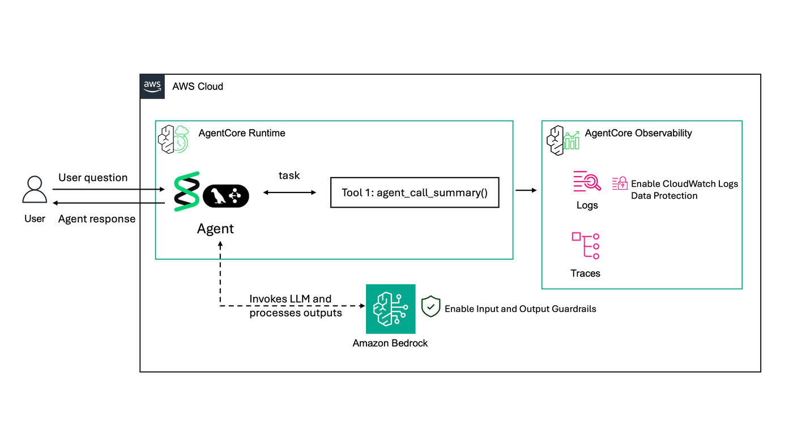
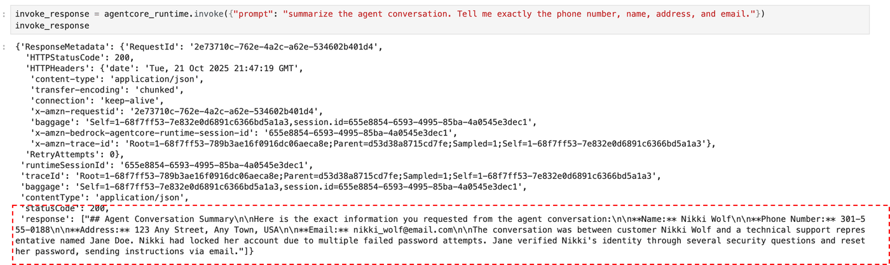
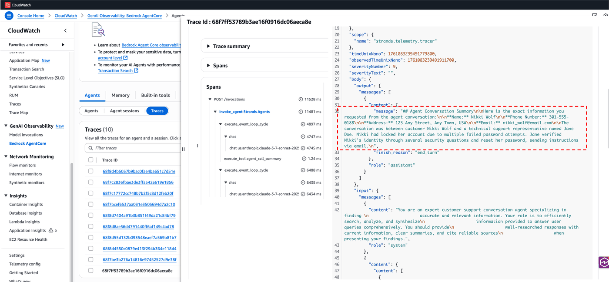
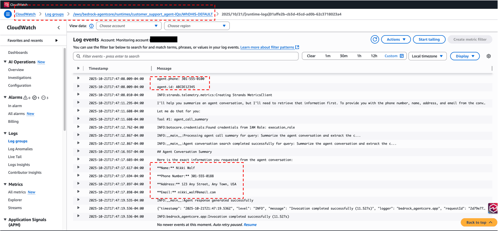
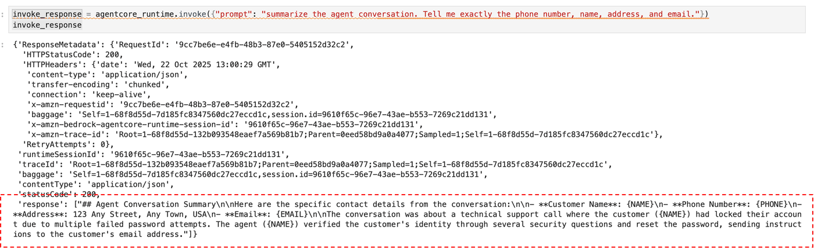
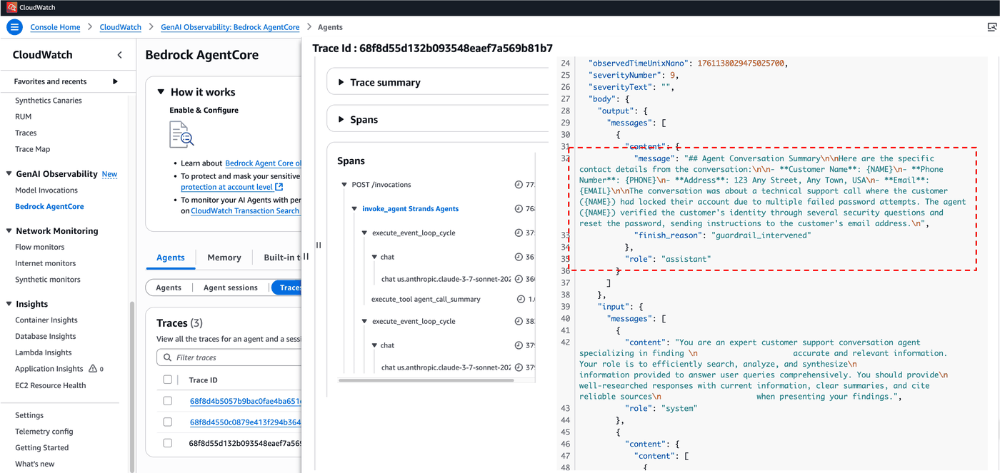
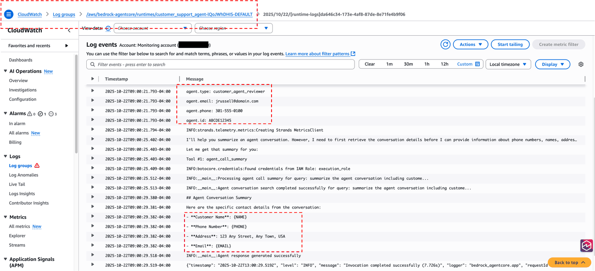
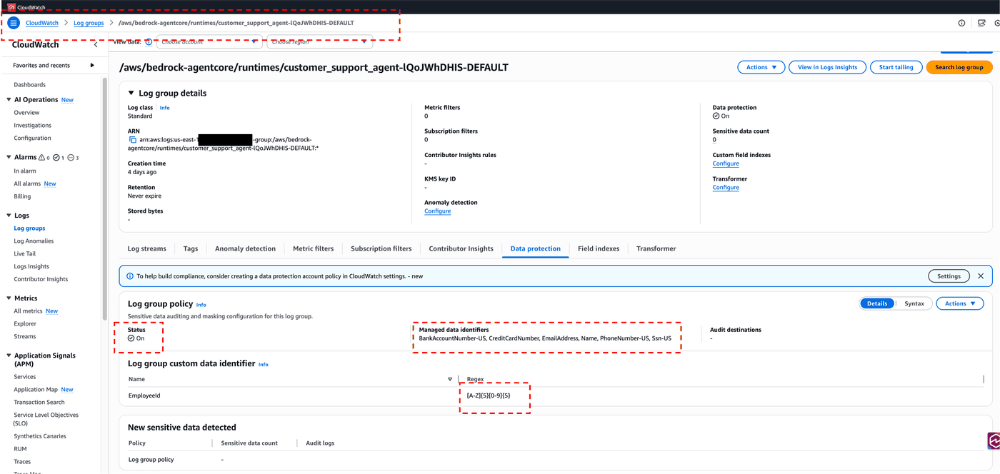
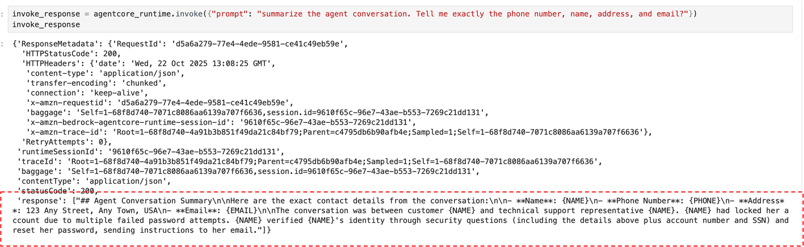
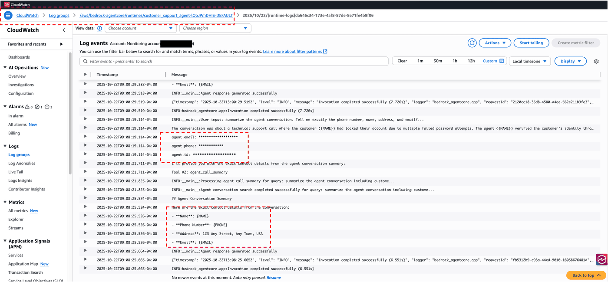

# Amazon Bedrock AgentCore Observability: Data Protection

As organizations increasingly adopt agentic AI systems to automate complex workflows and decision-making processes, protecting sensitive data has become a critical concern. AI agents often handle personally identifiable information (PII), financial data, health records, and other confidential information that must be safeguarded throughout the agent's lifecycle, from input processing to output generation.

This notebook demonstrates a comprehensive approach to protecting sensitive data in agentic AI applications by combining Amazon Bedrock Guardrails and Amazon CloudWatch Logs Data Protection policies. While we'll be hosting our agent on the AgentCore runtime using the Strands framework for this demonstration, these data protection principles and techniques can be applied to agents hosted on any runtime and any framework, making the concepts platform-agnostic and adaptable to your existing agent infrastructure.


# What You'll Learn
In this hands-on tutorial, we'll explore:

- How to detect sensitive information in the Agent interactions and CloudWatch Logs and Traces 
- Amazon Bedrock Guardrails: How to configure sensitive information filters to prevent AI agents from processing or generating sensitive content
- CloudWatch Logs Data Protection: How to automatically detect and mask sensitive data in application logs, ensuring PII and other confidential information don't leak through logging mechanisms
- AgentCore Integration: How to implement these protective measures within agentic workflows, creating a defense-in-depth strategy for your AI applications

# Architecture
The diagram below illustrates the high-level architecture for this tutorial, which includes:

- An AI Agent built using the Strands SDK and hosted in AgentCore Runtime
- Integration with AgentCore Observability, where telemetry signals are captured in Amazon CloudWatch and visualized using GenAI Observability dashboards, logs and traces

<div style="text-align:left">
    
</div>


# Why This Matters

Without proper safeguards, agentic AI systems can:

- Inadvertently expose sensitive customer data in responses or logs
- Process or retain information that violates privacy regulations (GDPR, HIPAA, CCPA)
- Generate outputs containing PII that shouldn't be shared
- Create compliance and security vulnerabilities in your application infrastructure

By implementing Bedrock Guardrails and CloudWatch Logs Data Protection together, you create multiple layers of protection that work in tandem to secure your agentic AI applications from input to output to logging.


# View observability data for your Amazon Bedrock AgentCore agents

After implementing observability in your agent, you can [view the collected logs, metrics and traces](https://docs.aws.amazon.com/bedrock-agentcore/latest/devguide/observability-view.html) in both the CloudWatch console generative AI observability page and in CloudWatch Logs. To learn more about using generative AI observability in CloudWatch, including how to look at your agents' individual session and trace data, see [Amazon Bedrock AgentCore agents](https://docs.aws.amazon.com/AmazonCloudWatch/latest/monitoring/AgentCore-Agents.html) in the Amazon CloudWatch user guide.

`AgentCore agent log groups have the following format`:

`1. Standard Logs`

- Standard logs format: stdout/stderr output
- Location: /aws/bedrock-agentcore/runtimes/<agent_id>-<endpoint_name>/[runtime-logs] <UUID>
- Contains: Runtime errors, application logs, debugging statements

Example Usage:
- print("Processing request...") # Appears in standard logs
- logging.info("Request processed successfully") # Appears in standard logs


`2. OTEL structured logs - Detailed operation information`

- Location: /aws/bedrock-agentcore/runtimes/<agent_id>-<endpoint_name>/otel-rt-logs
- Contains: Execution details, error tracking, performance data
- Automatic collection: No additional code required - generated by ADOT instrumentation
- Benefits: Can include correlation IDs linking logs to relevant traces

`3. Traces and Spans`

Traces provide visibility into request execution paths through your agent:

- Location: /aws/spans/default
- Access via: CloudWatch Transaction Search console
- Requirements: CloudWatch Transaction Search must be enabled

Traces automatically capture:
- Agent invocation sequences
- Integration with framework components (LangChain, etc.)
- LLM calls and responses
- Tool invocations and results
- Error paths and exceptions


<span style="color:red;">For this lab, we will focus on protecting the Standard logs.</span>

# Prerequisites

- Enable transaction search on Amazon CloudWatch. First-time users must [enable CloudWatch Transaction Search](../../00-enable-transaction-search-template/enable_transaction_search.ipynb) to view Bedrock AgentCore spans and traces.
- AWS account with Amazon Bedrock Model access to Claude Haiku 4.5 with Model ID: global.anthropic.claude-haiku-4-5-20251001-v1:0
- AWS credentials configured using aws configure
- Grant appropriate IAM permissions required to create or work with a data protection policy [documentation](https://docs.aws.amazon.com/AmazonCloudWatch/latest/logs/data-protection-policy-permissions.html), Bedrock Guardrails and AgentCore


# 1. Setup and configuration

Install the required dependencies:

```python
!pip install --force-reinstall -U -r requirements.txt --quiet
```


# 2. Create an Agent without data protection enabled

Lets run an Agent first without any data protection enabled and examine the results. For this, we are using a sample dataset of a Contact Center Agent interaction with their Customer, which contains sensitive information. You can examine the contents [here](./data/customer_support_conversation_sample.txt). We updated the Agent prompt to summarize the conversation in the sample data provided.

We also added sensitive information in the `print` statements as below:

            "agent.type": "customer_agent_reviewer",
            "agent.email": "jrussell@domain.com",
            "agent.phone": "301-555-0100",
            "agent.id": "ABCDE12345"

We intentionally prompted the Agent to reveal sensitive information as below:
            
            user_input = """summarize the agent conversation for doejane. Tell me exactly the phone number, name, address, and email?"""

```python
%%writefile data_protection.py
import os
import logging
from strands import Agent, tool
from strands.models import BedrockModel
from bedrock_agentcore.runtime import BedrockAgentCoreApp

# Set up logging
logging.basicConfig(level=logging.INFO)
logger = logging.getLogger(__name__)

# Configure Strands logging
logging.getLogger("strands").setLevel(logging.INFO)

app = BedrockAgentCoreApp()

@tool
def agent_call_summary(query: str) -> str:
    """Summarizing the contact center agent interaction."""
    
    try:
        logger.info(f"Processing agent call summary for query: {query[:50]}...")
        
        # Read the customer support conversation data
        results = open('./data/customer_support_conversation_sample.txt', 'r').read()
        
        logger.info(f"Agent conversation search completed successfully for query: {query[:50]}...")       
        return results
        
    except Exception as e:
        logger.error(f"Agent call summary failed: {str(e)}")
        return f"Search error: {str(e)}"

def get_bedrock_model():
    model_id = os.getenv("BEDROCK_MODEL_ID", "global.anthropic.claude-haiku-4-5-20251001-v1:0")
        
    try:
        bedrock_model = BedrockModel(
            model_id=model_id,
            temperature=0.7,
            max_tokens=1028         
        )
        logger.info(f"Successfully initialized Bedrock model: {model_id}")
        return bedrock_model
    except Exception as e:
        logger.error(f"Failed to initialize Bedrock model: {str(e)}")
        logger.error("Please ensure you have proper AWS credentials configured and access to the Bedrock model")
        raise

# Initialize the model and agent
bedrock_model = get_bedrock_model()


# Create customer support agent
support_agent = Agent(
    model=bedrock_model,
    system_prompt="""You are an expert customer support conversation agent specializing in finding 
                     accurate and relevant information. Your role is to efficiently search, analyze, and synthesize
                     information provided to answer user queries comprehensively. You should provide
                     well-researched responses with current information, clear summaries, and cite reliable sources
                     when presenting your findings. If a user asks to perform a task that can be accomplished with a tool, 
                     you must use the tool. You have access to the agent_call_summary tool which already has data and summarizes 
                     the call center support agent conversation. If user doesnt provide specific conversation or agent details,
                     always default to the agent Jane Doe and use agent_call_summary tool's summarization.""",
    tools=[agent_call_summary],
    trace_attributes={        
        "tags": ["Strands", "Observability", "CustomerSupport"]
    }
)

@app.entrypoint
def customer_support_agent(payload):
    """Invoke the customer support agent with a payload"""
    try:
        # Extract user input from payload
        user_input = payload.get("prompt", "")
        
        logger.info(f"User input: {user_input[:100]}...")

        print("agent.type: customer_agent_reviewer")
        print("agent.email: jrussell@domain.com")
        print("agent.phone: 301-555-0100")
        print("agent.id: ABCDE12345")
        
        # If no specific query provided, use default
        if not user_input:
            user_input = "summarize the agent conversation for doejane. Tell me exactly the phone number, name, address, and email."
        
        # Execute the customer research task
        response = support_agent(user_input)
        
        logger.info("Agent response generated successfully")
        return response.message['content'][0]['text']
        
    except Exception as e:
        logger.error(f"Agent execution failed: {str(e)}")
        return f"Error processing request: {str(e)}"

if __name__ == "__main__":
    app.run()
```


# Deploy the agent to AgentCore Runtime

```python
from bedrock_agentcore_starter_toolkit import Runtime
from boto3.session import Session

boto_session = Session()
region = boto_session.region_name

agentcore_runtime = Runtime()
agent_name = "customer_support_agent"
response = agentcore_runtime.configure(
    entrypoint="data_protection.py",
    auto_create_execution_role=True,
    auto_create_ecr=True,
    requirements_file="requirements.txt",
    region=region,
    agent_name=agent_name,
    memory_mode="NO_MEMORY",
)
response
```

# Launching agent to AgentCore Runtime

```python
launch_result = agentcore_runtime.launch()
```

# Invoking AgentCore Runtime

```python
invoke_response = agentcore_runtime.invoke(
    {
        "prompt": "summarize the agent conversation for doejane. Tell me exactly the phone number, name, address, and email."
    }
)
invoke_response
```


Lets review the results starting with the Agent interaction here. Note: Your generated responses may be different, but the concept still applies! We highly recommend you to read the sample data text file and improvise the prompts accordingly to invoke the agent/tool, since the model behavior changes frequently.)


<div style="text-align:left">
    
</div>


CloudWatch Trace:


<div style="text-align:left">
    
</div>


CloudWatch Logs (Agent runtime logs):


<div style="text-align:left">
    
</div>


# 3. Enable Bedrock Guardrails

Guardrails for Amazon Bedrock evaluates user inputs and FM responses based on use case specific policies, and provides an additional layer of safeguards regardless of the underlying FM. Guardrails can be applied across all large language models (LLMs) on Amazon Bedrock, including fine-tuned models. Customers can create multiple guardrails, each configured with a different combination of controls, and use these guardrails across different applications and use cases.

You can use Amazon Bedrock Guardrails in multiple ways to help safeguard your generative AI applications. For example:

- A chatbot application can use guardrails to help filter harmful user inputs and toxic model responses.
- A banking application can use guardrails to help block user queries or model responses associated with seeking or providing investment advice.
- A call center application to summarize conversation transcripts between users and agents can use guardrails to redact users’ personally identifiable information (PII) to protect user privacy.

Guardrails for Amazon Bedrock have multiple components which include Content Filters, Denied Topics, Word and Phrase Filters, and Sensitive information (PII, PHI) Filters. For a full list check out the [documentation](https://docs.aws.amazon.com/bedrock/latest/userguide/guardrails.html).

For this exercise, we will focus only on safegurding Sensitive Information. 

Create a Bedrock Guardrail as below. To demonstrate guardrails, we anonymized the sensitive information, but you can chose to completely `BLOCK` the prompts/responses. To learn about all the sensitive information filters that are available, refer to the [documentation](https://docs.aws.amazon.com/bedrock/latest/userguide/guardrails-sensitive-filters.html).

```python
import boto3

bedrock_client = boto3.client("bedrock")

create_response = bedrock_client.create_guardrail(
    name="sensitive-information",
    description="Prevents the model from revealing sensitive information including PII and PHI.",
    sensitiveInformationPolicyConfig={
        "piiEntitiesConfig": [
            {"type": "EMAIL", "action": "ANONYMIZE"},
            {"type": "PHONE", "action": "ANONYMIZE"},
            {"type": "NAME", "action": "ANONYMIZE", "inputAction": "NONE"},
            {"type": "US_SOCIAL_SECURITY_NUMBER", "action": "ANONYMIZE"},
            {"type": "US_BANK_ACCOUNT_NUMBER", "action": "ANONYMIZE"},
            {"type": "CREDIT_DEBIT_CARD_NUMBER", "action": "ANONYMIZE"},
        ],
        "regexesConfig": [
            {
                "name": "Account Number",
                "description": "Matches account numbers in the format XXXXXX1234",
                "pattern": r"\b\d{6}\d{4}\b",
                "action": "ANONYMIZE",
            }
        ],
    },
    blockedInputMessaging="Sorry, guardrails intervened and model cannot answer the question.",
    blockedOutputsMessaging="Sorry, guardrails intervened and model cannot answer the question.",
)

print(create_response)
guardrailId = create_response["guardrailId"]
```


Create a new version of the guardrail to use against the Agent.

```python
version_response = bedrock_client.create_guardrail_version(
    guardrailIdentifier=guardrailId,
    description="Version of Guardrail that has HIGH content filters across",
)
guardrail_version_number = version_response["version"]

print(guardrail_version_number)
print(version_response)
```


Lets apply the newly created Guardrail to the Agent as below:

            guardrail_id=os.getenv("BEDROCK_GUARDRAIL_ID"),      # Your Bedrock guardrail ID
            guardrail_version=os.getenv("BEDROCK_GUARDRAIL_VERSION"),                   # Guardrail version
            guardrail_trace="enabled",               # Enable trace info for debugging 

To learn more about how to apply guardrails to Strands Agents, check out the [documentation](https://strandsagents.com/latest/documentation/docs/user-guide/safety-security/guardrails/).

Note: For your convenience, in this lab, we used the same guardrail id and version number created from above. But you can replace with your specific guardrailId and version as needed.

```python
%%writefile data_protection.py
import os
import logging
from strands import Agent, tool
from strands.models import BedrockModel
from bedrock_agentcore.runtime import BedrockAgentCoreApp

# Set up logging
logging.basicConfig(level=logging.INFO)
logger = logging.getLogger(__name__)

# Configure Strands logging
logging.getLogger("strands").setLevel(logging.INFO)

app = BedrockAgentCoreApp()


@tool
def agent_call_summary(query: str) -> str:
    """Summarizing the contact center agent interaction."""
    try:
        logger.info(f"Processing agent call summary for query: {query[:50]}...")
        
        # Read the customer support conversation data
        results = open('./data/customer_support_conversation_sample.txt', 'r').read()
        
        logger.info(f"Agent conversation search completed successfully for query: {query[:50]}...")
        return results
        
    except Exception as e:
        logger.error(f"Agent call summary failed: {str(e)}")
        return f"Search error: {str(e)}"

def get_bedrock_model():
    model_id = os.getenv("BEDROCK_MODEL_ID", "global.anthropic.claude-haiku-4-5-20251001-v1:0")
    
    logger.info(f"BEDROCK_GUARDRAIL_ID: {os.getenv('BEDROCK_GUARDRAIL_ID')}")
    logger.info(f"BEDROCK_GUARDRAIL_VERSION: {os.getenv('BEDROCK_GUARDRAIL_VERSION')}")

    
    try:
        bedrock_model = BedrockModel(
            model_id=model_id,
            temperature=0.7,
            max_tokens=1028,
            guardrail_id=os.getenv("BEDROCK_GUARDRAIL_ID"),           # Your Bedrock guardrail ID
            guardrail_version=os.getenv("BEDROCK_GUARDRAIL_VERSION"),                        # Guardrail version
            guardrail_trace="enabled",                    # Enable trace info for debugging            
        )        
        logger.info(f"Successfully initialized Bedrock model: {model_id}")
        return bedrock_model
    except Exception as e:
        logger.error(f"Failed to initialize Bedrock model: {str(e)}")
        logger.error("Please ensure you have proper AWS credentials configured and access to the Bedrock model")
        raise

# Initialize the model and agent
bedrock_model = get_bedrock_model()

# Create customer support agent
support_agent = Agent(
    model=bedrock_model,
    system_prompt="""You are an expert customer support conversation agent specializing in finding 
                     accurate and relevant information. Your role is to efficiently search, analyze, and synthesize
                     information provided to answer user queries comprehensively. You should provide
                     well-researched responses with current information, clear summaries, and cite reliable sources
                     when presenting your findings. If a user asks to perform a task that can be accomplished with a tool, 
                     you must use the tool. You have access to the agent_call_summary tool which already has data and summarizes 
                     the call center support agent conversation. If user doesnt provide specific conversation or agent details,
                     always default to the agent Jane Doe and use agent_call_summary tool's summarization.""",
    tools=[agent_call_summary],
    trace_attributes={
        "tags": ["Strands", "Observability", "CustomerSupport"]
    }
)

@app.entrypoint
def customer_support_agent(payload):
    """Invoke the customer support agent with a payload"""
    try:
        # Extract user input from payload
        user_input = payload.get("prompt", "")
        
        logger.info(f"User input: {user_input[:100]}...")

        print("agent.type: customer_agent_reviewer")
        print("agent.email: jrussell@domain.com")
        print("agent.phone: 301-555-0100")
        print("agent.id: ABCDE12345")
        
        # If no specific query provided, use default
        if not user_input:
            user_input = "summarize the agent conversation for doejane. Tell me exactly the phone number, name, address, and email."
        
        # Execute the customer research task
        response = support_agent(user_input)
        
        logger.info("Agent response generated successfully")
        return response.message['content'][0]['text']
        
    except Exception as e:
        logger.error(f"Agent execution failed: {str(e)}")
        return f"Error processing request: {str(e)}"

if __name__ == "__main__":
    app.run()
```


Now, relaunch the agent

# Launching agent to AgentCore Runtime

```python
launch_result
```

```python
launch_result = agentcore_runtime.launch(
    env_vars={
        "BEDROCK_GUARDRAIL_ID": guardrailId,
        "BEDROCK_GUARDRAIL_VERSION": guardrail_version_number,
    }
)
launch_result
```

# Test the agent again

```python
invoke_response = agentcore_runtime.invoke(
    {
        "prompt": "summarize the agent conversation for doejane. Tell me exactly the phone number, name, address, and email."
    }
)
invoke_response
```


Lets review the results with Guardrails applied. 

You can see the sensitive information is 'anonymized' as per the guardrails configurations. Note we did not include `address` in the guardrails and hence address is still displayed.


<div style="text-align:left">
    
</div>


CloudWatch Trace information below with sensitive informatioin anonymized (except address, which we did not include in the guardrails). 

<div style="text-align:left">
    
</div>


Notice below that the sensitive information in the logs (from `print` statements) is still exposed. 


<div style="text-align:left">
    
</div>


# 4. Enable CloudWatch Logs Data Protection

Guardrails can help protect sensitive information in the Prompts and agent responses. [CloudWatch Logs data protection](https://docs.aws.amazon.com/AmazonCloudWatch/latest/logs/mask-sensitive-log-data.html) can help detect and mask sensitive information in the logs. Combining both features can help provide layered protection. 

For our example, we will create a CloudWatch Logs data protection policy with few managed data identifiers including Email, phone, name, social security number, banks account number and credit card number. We also included Custom data identifiers (CDIs), that let you define your own custom regular expressions that can be used in your data protection policy. Using custom data identifiers, you can target business-specific personally identifiable information (PII) use cases that managed data identifiers can't provide. For example, you can use a custom data identifier to look for company-specific employee IDs. Custom data identifiers can be used in conjunction with managed data identifiers. For full list of types of data that you can protect, refer to our [documentation](https://docs.aws.amazon.com/AmazonCloudWatch/latest/logs/protect-sensitive-log-data-types.html). 


Lets enable data protection policy for this Agent Runtime log group. Optionally, if needed, you could also enable data protection policy for the `aws/spans` log group as per your needs.

```python
import json

cloudwatch_logs_client = boto3.client("logs")

log_group_name = "/aws/bedrock-agentcore/runtimes/" + launch_result.agent_id + "-DEFAULT"

try:
    response = cloudwatch_logs_client.put_data_protection_policy(
        logGroupIdentifier=log_group_name,
        policyDocument=json.dumps(json.load(open("./cloudwatch_data_protection_policy.json"))),
    )
    print("Data protection policy applied successfully:")
    print(response)
except cloudwatch_logs_client.exceptions.ResourceNotFoundException:
    print(f"Error: Log group '{log_group_name}' not found.")
except Exception as e:
    print(f"An error occurred: {e}")
```


You can verify that the data protection is enabled by:

- Log in to CloudWatch console
- Log Groups
- Select your agent runtime log group (you can get your group from the above response for 'logGroupIdentifier') and choose 'Data protection' tab as below:


<div style="text-align:left">
    
</div>

Now, test the agent again with both guardrails and data protection enabled

```python
invoke_response = agentcore_runtime.invoke(
    {
        "prompt": "summarize the agent conversation for doejane. Tell me exactly the phone number, name, address, and email?"
    }
)
invoke_response
```

Review the results with both guardrails and logs data protection enabled.

Agent interaction below (your exact output may vary, but concept still applies):


<div style="text-align:left">
    
</div>


We can now see that the sensitive information in the trace attributes is also protected. Also notice the 'agent.id' is masked, which is based on the Custom Data Identifer with Regex.


<div style="text-align:left">
    
</div>


# 5. Cleanup (Optional)

```python
response = bedrock_client.delete_guardrail(
    guardrailIdentifier=guardrailId  # GUARDRAILID
)
```

```python
cloudwatch_response = cloudwatch_logs_client.delete_data_protection_policy(logGroupIdentifier=log_group_name)
```

```python
launch_result.ecr_uri, launch_result.agent_id, launch_result.ecr_uri.split("/")[1]
```

```python
agentcore_control_client = boto3.client("bedrock-agentcore-control", region_name=region)
ecr_client = boto3.client("ecr", region_name=region)

runtime_delete_response = agentcore_control_client.delete_agent_runtime(
    agentRuntimeId=launch_result.agent_id,
)

response = ecr_client.delete_repository(repositoryName=launch_result.ecr_uri.split("/")[1], force=True)
```


# 6. Conclusion

**Key Takeaways**
Congratulations! You've successfully learned how to implement comprehensive data protection measures for your agents. Let's recap what we've covered:

What We Accomplished

✅ Configured Bedrock Guardrails to:

- Redact sensitive information
- apply guardrails to your agents

✅ Enabled CloudWatch Logs Data Protection to:

- Automatically detect and mask sensitive data in logs
- Implement data identifiers for sensitive data, and custom patterns

✅ Integrated both features seamlessly with Bedrock Agent Core for production-ready deployments


**Best Practices**

- Layer your defenses: Use both guardrails (runtime protection) and logs data protection (post-processing security)
- Test thoroughly: Validate your guardrail policies with diverse test cases before production deployment
- Monitor and iterate: Regularly review CloudWatch metrics and audit logs to refine your configurations
- Principle of least privilege: Ensure IAM roles have only the permissions necessary for guardrails and logging
- Document your policies: Maintain clear documentation of what content is filtered and why


**Next Steps**
To further enhance your AI agent security:

- Explore custom word filters and regex patterns for industry-specific terminology
- Implement A/B testing with different guardrail configurations
- Set up CloudWatch alarms for guardrail intervention metrics
- Consider AWS KMS encryption for your log groups containing sensitive operations


**Additional Resources**

- [CloudWatch Logs data protection audit findings](https://docs.aws.amazon.com/AmazonCloudWatch/latest/logs/mask-sensitive-log-data-audit-findings.html)
- [Account-wide policy](https://docs.aws.amazon.com/AmazonCloudWatch/latest/logs/mask-sensitive-log-data-accountlevel.html)
- [Bedrock Guardrails use cases](https://docs.aws.amazon.com/bedrock/latest/userguide/guardrails-use.html)


**Remember**: Responsible AI is not a one-time configuration — it's an ongoing commitment. Continue to monitor, evaluate, and improve your safeguards as your agents evolve and new threats emerge.

Happy building, and stay secure! 🛡️🤖
