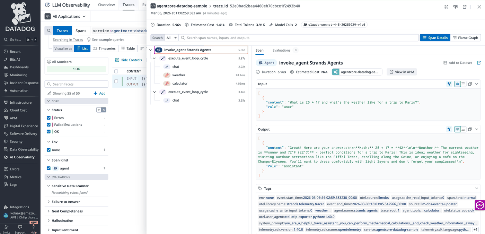

# Strands Agent with Datadog LLM Observability on Amazon Bedrock AgentCore Runtime

## Overview

This notebook demonstrates deploying a Strands agent to Amazon Bedrock AgentCore Runtime with Datadog LLM Observability integration. The implementation uses Amazon Bedrock Claude models and sends telemetry data to Datadog through OpenTelemetry (OTEL).

## Key Components

- **Strands Agents**: Python framework for building LLM-powered agents with built-in telemetry support
- **Amazon Bedrock AgentCore Runtime**: Managed runtime service for hosting and scaling agents on AWS
- **Datadog LLM Observability**: Monitoring platform for LLM applications with GenAI-aware trace views
- **OpenTelemetry**: Industry-standard protocol for collecting and exporting telemetry data

## Architecture

The agent is containerized and deployed to AgentCore Runtime, which provides HTTP endpoints for invocation. Telemetry data flows from the Strands agent through an OTLP exporter directly to Datadog's trace endpoint for monitoring and debugging. The implementation disables AgentCore's default ADOT observability to use Datadog instead.

## Prerequisites

- Python 3.10+
- AWS credentials configured with Bedrock and AgentCore permissions
- [Datadog](https://www.datadoghq.com/) account with API key
- Docker installed locally
- Access to Amazon Bedrock Claude models in your configured region

```python
!pip install --force-reinstall -U -r requirements.txt
```

## Configure AWS Credentials

## Agent Implementation

The agent file (`strands_claude.py`) implements a travel assistant with calculator and weather tools. Key configuration includes:
- **`DISABLE_ADOT_OBSERVABILITY=true`**: Disables AgentCore's built-in ADOT pipeline so we can set our own TracerProvider ([docs](https://docs.aws.amazon.com/bedrock-agentcore/latest/devguide/observability-configure.html))
- **Direct OTLP export**: Configures an OpenTelemetry TracerProvider that exports traces to Datadog's OTLP endpoint
- **`dd-otlp-source=llmobs`**: Routes traces to [Datadog LLM Observability](https://docs.datadoghq.com/llm_observability/) for GenAI-specific views
- **`OTEL_SEMCONV_STABILITY_OPT_IN=gen_ai_latest_experimental`**: Enables OpenTelemetry v1.37+ GenAI semantic conventions required by Strands Agents ([docs](https://docs.datadoghq.com/llm_observability/instrumentation/otel_instrumentation/))
- **Automatic trace export**: All agent invocations, tool calls, and LLM interactions are automatically traced and sent to Datadog

```python
%%writefile strands_claude.py
import os
import logging

logging.basicConfig(level=logging.ERROR, format="[%(levelname)s] %(message)s")
logger = logging.getLogger(__name__)
logger.setLevel(os.getenv("AGENT_RUNTIME_LOG_LEVEL", "INFO").upper())

# =============================================================================
# Datadog LLM Observability - OpenTelemetry Configuration
# Must be configured BEFORE any other OpenTelemetry imports
# =============================================================================

# Disable AgentCore's built-in ADOT so we can set our own TracerProvider
# See: https://docs.aws.amazon.com/bedrock-agentcore/latest/devguide/observability-configure.html
os.environ["DISABLE_ADOT_OBSERVABILITY"] = "true"

# Required for strands-agents GenAI semantic conventions (v1.37+)
os.environ["OTEL_SEMCONV_STABILITY_OPT_IN"] = "gen_ai_latest_experimental"

dd_api_key = os.environ.get("DD_API_KEY", "")
dd_site = os.environ.get("DD_SITE", "datadoghq.com")
service_name = os.environ.get("OTEL_SERVICE_NAME", "agentcore-datadog-sample")

if dd_api_key:
    from opentelemetry import trace
    from opentelemetry.exporter.otlp.proto.http.trace_exporter import OTLPSpanExporter
    from opentelemetry.sdk.trace import TracerProvider
    from opentelemetry.sdk.trace.export import SimpleSpanProcessor
    from opentelemetry.sdk.resources import Resource

    resource = Resource.create({"service.name": service_name})
    exporter = OTLPSpanExporter(
        endpoint=f"https://trace.agent.{dd_site}/v1/traces",
        headers={"dd-api-key": dd_api_key, "dd-otlp-source": "llmobs"},
    )
    provider = TracerProvider(resource=resource)
    provider.add_span_processor(SimpleSpanProcessor(exporter))
    trace.set_tracer_provider(provider)
    logger.info("Datadog LLM Observability configured (service: %s)", service_name)
else:
    logger.warning("DD_API_KEY not set. Traces will not be sent to Datadog.")

# =============================================================================
# Agent
# =============================================================================

from bedrock_agentcore.runtime import BedrockAgentCoreApp
from strands import Agent, tool
from strands.models import BedrockModel
from strands_tools import calculator


def get_bedrock_model():
    region = os.getenv("AWS_DEFAULT_REGION", "us-east-1")
    model_id = os.getenv("BEDROCK_MODEL_ID", "us.anthropic.claude-sonnet-4-5-20250929-v1:0")
    return BedrockModel(
        model_id=model_id,
        region_name=region,
        max_tokens=1024,
    )


bedrock_model = get_bedrock_model()

system_prompt = """You are a helpful travel assistant. You can perform mathematical calculations 
and check weather information. Always provide helpful, accurate responses and use tools when appropriate."""


@tool
def weather():
    """Get current weather."""
    return "sunny and 72F"


app = BedrockAgentCoreApp()


def initialize_agent():
    """Initialize the agent (telemetry is already configured at module level)."""
    return Agent(
        model=bedrock_model,
        system_prompt=system_prompt,
        tools=[calculator, weather],
    )


@app.entrypoint
def strands_agent_bedrock(payload, context=None):
    """Invoke the agent with a payload."""
    user_input = payload.get("prompt", payload.get("text", payload.get("message", "Hello")))
    logger.info("[%s] User input: %s", getattr(context, 'session_id', 'local'), user_input)

    agent = initialize_agent()
    response = agent(user_input)
    return response.message['content'][0]['text']


if __name__ == "__main__":
    app.run()
```

### Configure AgentCore Runtime deployment

Next we will use our starter toolkit to configure the AgentCore Runtime deployment with an entrypoint, the execution role we just created and a requirements file. We will also configure the starter kit to auto create the Amazon ECR repository on launch.

During the configure step, your docker file will be generated based on your application code. Please note that when using the `bedrock_agentcore_starter_toolkit` to configure your agent, it configures AgentCore Observability by default so, to use Datadog, you need to remove configuration for AgentCore Observability as explained below:

<div style="text-align:left">
    
</div>

```python
from bedrock_agentcore_starter_toolkit import Runtime
from boto3.session import Session

boto_session = Session()
region = boto_session.region_name

agentcore_runtime = Runtime()
agent_name = "strands_datadog_llm_observability"
response = agentcore_runtime.configure(
    entrypoint="strands_claude.py",
    auto_create_execution_role=True,
    auto_create_ecr=True,
    requirements_file="requirements.txt",
    region=region,
    agent_name=agent_name,
    memory_mode="NO_MEMORY",
    disable_otel=True,
)
response
```

## Deploy to AgentCore Runtime

Now that we've got a docker file, let's launch the agent to the AgentCore Runtime. This will create the Amazon ECR repository and the AgentCore Runtime.

### Datadog Configuration

To send traces to Datadog LLM Observability, you need:
- **Datadog API Key**: Get this from your Datadog account at Organization Settings → API Keys

The agent code (`strands_claude.py`) automatically configures all OTLP settings when `DD_API_KEY` is provided:
- **Endpoint**: `https://trace.agent.{DD_SITE}/v1/traces`
- **Headers**: `dd-api-key={key},dd-otlp-source=llmobs`
- **Semantic Conventions**: `gen_ai_latest_experimental` (for LLM Observability)

**For other Datadog regions**, set `DD_SITE` in the launch env_vars:
- US1: `datadoghq.com` (default)
- US3: `us3.datadoghq.com`
- US5: `us5.datadoghq.com`
- EU1: `datadoghq.eu`
- AP1: `ap1.datadoghq.com`

<div style="text-align:left">
    
</div>

```python
# Datadog configuration
datadog_api_key = "<datadog-api-key>"  # Replace with your Datadog API key

launch_result = agentcore_runtime.launch(
    env_vars={
        "DD_API_KEY": datadog_api_key,
        "DD_SITE": "datadoghq.com",  # Change for other Datadog regions
        "OTEL_SERVICE_NAME": "agentcore-datadog-sample",
        "DISABLE_ADOT_OBSERVABILITY": "true",  # Disable AgentCore's default observability
    }
)
launch_result
```

## Check Deployment Status

Wait for the runtime to be ready before invoking:

```python
import time

status_response = agentcore_runtime.status()
status = status_response.endpoint["status"]
end_status = ["READY", "CREATE_FAILED", "DELETE_FAILED", "UPDATE_FAILED"]
while status not in end_status:
    time.sleep(10)
    status_response = agentcore_runtime.status()
    status = status_response.endpoint["status"]
    print(status)
status
```

### Invoking AgentCore Runtime

Finally, we can invoke our AgentCore Runtime with a payload

<div style="text-align:left">
    
</div>

```python
invoke_response = agentcore_runtime.invoke(
    {"prompt": "What is 25 + 17 and what's the weather like for a trip to Paris?"}
)
```

```python
from IPython.display import Markdown, display

display(Markdown("".join(invoke_response["response"])))
```

## View Traces in Datadog LLM Observability

After invoking the agent, traces appear in Datadog within a few minutes:

1. Go to [Datadog LLM Observability](https://app.datadoghq.com/llm/traces)
2. Search for `ml_app:agentcore-datadog-sample`

The traces will include:
- Agent invocation details with full request/response context
- Tool calls (calculator, weather) with execution time
- Model interactions with latency and token usage
- Prompt and completion content

<div style="text-align:left">
    
</div>

### Datadog LLM Observability Features

Datadog LLM Observability provides purpose-built views for GenAI applications:

- **Trace Explorer**: View end-to-end agent traces with prompt/response content, tool calls, and model interactions in a single timeline
- **Token Usage Tracking**: Monitor input and output token consumption across models to optimize costs and performance
- **Latency Analysis**: Track time-to-first-token and total response time for each model invocation
- **Error Monitoring**: Identify failed model calls, tool errors, and agent exceptions with full context
- **Evaluations**: Attach quality scores and custom evaluations to traces for continuous improvement

For more information, see the [Datadog LLM Observability documentation](https://docs.datadoghq.com/llm_observability/).

## Cleanup (Optional)

Clean up the deployed resources:

```python
import boto3

agentcore_control_client = boto3.client("bedrock-agentcore-control", region_name=region)

ecr_client = boto3.client("ecr", region_name=region)

runtime_delete_response = agentcore_control_client.delete_agent_runtime(
    agentRuntimeId=launch_result.agent_id,
)

response = ecr_client.delete_repository(repositoryName=launch_result.ecr_uri.split("/")[1], force=True)
```

## Summary

You have successfully deployed a Strands agent to Amazon Bedrock AgentCore Runtime with Datadog LLM Observability. The implementation demonstrates:
- Disabling AgentCore's built-in ADOT to use a custom observability provider
- Configuring an OpenTelemetry TracerProvider to export traces directly to Datadog
- Using `dd-otlp-source=llmobs` to route traces to Datadog LLM Observability
- Enabling GenAI semantic conventions for LLM-specific trace views
- Invocation through the AgentCore starter toolkit SDK

### Resources

- [AgentCore Observability docs](https://docs.aws.amazon.com/bedrock-agentcore/latest/devguide/observability-configure.html)
- [Datadog LLM Observability OTEL Instrumentation](https://docs.datadoghq.com/llm_observability/instrumentation/otel_instrumentation/)
- [Strands Agents Observability](https://strandsagents.com/latest/documentation/docs/user-guide/observability-evaluation/observability/)
- [OpenTelemetry GenAI Semantic Conventions](https://opentelemetry.io/docs/specs/semconv/gen-ai/)
