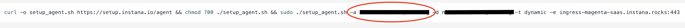

# Strands Agent with Instana Observability on Amazon Bedrock AgentCore Runtime

## Overview

This notebook demonstrates deploying a Strands agent to Amazon Bedrock AgentCore Runtime with Instana observability integration. The implementation uses Amazon Bedrock models and sends telemetry data to Instana through OpenTelemetry (OTEL).

## Key Components

- **Strands Agents**: Python framework for building LLM-powered agents with built-in telemetry support
- **Amazon Bedrock AgentCore Runtime**: Managed runtime service for hosting and scaling agents on AWS
- **Instana**: Real-time observability and performance monitoring for applications that receives traces via OTEL
- **OpenTelemetry**: Industry-standard protocol for collecting and exporting telemetry data

## Architecture

The agent is containerized and deployed to AgentCore Runtime, which provides HTTP endpoints for invocation. Telemetry data flows from the Strands agent through OTEL exporters to Instana for monitoring and debugging. The implementation disables AgentCore's default observability to use Instana instead.

## Prerequisites

- Python 3.10+
- [Get started with Amazon Bedrock AgentCore](https://docs.aws.amazon.com/bedrock-agentcore/latest/devguide/agentcore-get-started-toolkit.html#agentcore-get-started-prerequisites)
- AWS credentials configured with Bedrock and [AgentCore permissions](https://docs.aws.amazon.com/aws-managed-policy/latest/reference/BedrockAgentCoreFullAccess.html)
- [Instana](https://www.ibm.com/products/instana) account
- Docker installed locally
- Access to Amazon Bedrock models

### Finding the Correct Instana Endpoint

To find the correct OTLP endpoint for your Instana instance:

1. Open the **sidebar** in Instana.
2. Scroll to the bottom and select **About Instana**.
3. Note the **Instance Region** displayed there.
4. Based on this region, choose the appropriate **HTTP OTLP endpoint (4318)** using the endpoint [documentation](https://www.ibm.com/docs/en/instana-observability/1.0.309?topic=instana-backend)


### Retrieving Your Instana Key

To obtain your Instana key:

1. From the sidebar, click **Agents & Collectors**.
2. Select **Linux – Automatic Installation (One-liner)**.
3. Copy the key that appears after the `-a` flag — this is your **Agent Key**, which is used as the **Instana Key**.

Refer to the image below for guidance.

<div style="text-align:left">
    
</div>

### Create a new file named `.env` in the root directory of your project and add the following environment variables:

Run the cell below to automatically generate a .env file in the root of your project. After the file is created, update the placeholder values with your actual Instana OTLP endpoint and API key.

The `.env` file is used to securely store your configuration details (like API keys and endpoints) so they can be easily loaded into your application without hardcoding them.

**Note**: Never commit the `.env` file to GitHub or share your Instana key publicly. Add `.env` to your `.gitignore` file to keep credentials secure.

### Example .env file content:

```python
%%writefile .env

# Instana OTLP endpoint (e.g., https://otlp-blue-saas.instana.io:4318)
OTEL_EXPORTER_OTLP_ENDPOINT="<instana_endpoint>"

# Note: This example uses StrandsTelemetry() for exporting, which supports only the HTTP OTLP endpoint.
# Make sure to use the HTTP endpoint when working with Strands Telemetry.

# Instana key
INSTANA_KEY="<agent_key>"
```

Install the dependencies by running the cell below:

```python
!pip install --force-reinstall -U -r requirements.txt --quiet
```

## Configure AWS Credentials

Configure your AWS credentials by following the links provided in the `Prerequisites` section before running the notebook.

## Agent Implementation

The agent file (`strands_nova.py`) implements a travel agent with web search capabilities. Key configuration includes:
- Initializing Strands telemetry

```python
%%writefile strands_nova.py
import os
import logging
from bedrock_agentcore.runtime import BedrockAgentCoreApp
from strands import Agent, tool
from strands.models import BedrockModel
from strands.telemetry import StrandsTelemetry
from ddgs import DDGS

logging.basicConfig(level=logging.ERROR, format="[%(levelname)s] %(message)s")
logger = logging.getLogger(__name__)
logger.setLevel(os.getenv("AGENT_RUNTIME_LOG_LEVEL", "INFO").upper())


@tool
def web_search(query: str) -> str:
    """
    Search the web for information using DuckDuckGo.

    Args:
        query: The search query

    Returns:
        A string containing the search results
    """
    try:
        ddgs = DDGS()
        results = ddgs.text(query, max_results=5)

        formatted_results = []
        for i, result in enumerate(results, 1):
            formatted_results.append(
                f"{i}. {result.get('title', 'No title')}\n"
                f"   {result.get('body', 'No summary')}\n"
                f"   Source: {result.get('href', 'No URL')}\n"
            )

        return "\n".join(formatted_results) if formatted_results else "No results found."

    except Exception as e:
        return f"Error searching the web: {str(e)}"

# Function to initialize Bedrock model
def get_bedrock_model():
    region = os.getenv("AWS_DEFAULT_REGION", "us-east-1")
    model_id = os.getenv("BEDROCK_MODEL_ID", "amazon.nova-lite-v1:0")

    bedrock_model = BedrockModel(
        model_id=model_id,
        region_name=region,
        temperature=0.0,
        max_tokens=1024
    )
    return bedrock_model

# Initialize the Bedrock model
bedrock_model = get_bedrock_model()

# Define the agent's system prompt
system_prompt = """You are an experienced travel agent specializing in personalized travel recommendations 
with access to real-time web information. Your role is to find dream destinations matching user preferences 
using web search for current information. You should provide comprehensive recommendations with current 
information, brief descriptions, and practical travel details."""

app = BedrockAgentCoreApp()

def initialize_agent():
    """Initialize the agent with proper telemetry configuration."""

    # Initialize Strands telemetry with 3P configuration
    strands_telemetry = StrandsTelemetry()
    strands_telemetry.setup_otlp_exporter()
    
    # Create and cache the agent
    agent = Agent(
        model=bedrock_model,
        system_prompt=system_prompt,
        tools=[web_search]
    )
    
    return agent

@app.entrypoint
def strands_agent_bedrock(payload, context=None):
    """
    Invoke the agent with a payload
    """
    user_input = payload.get("prompt")
    logger.info("[%s] User input: %s", context.session_id, user_input)
    
    # Initialize agent with proper configuration
    agent = initialize_agent()
    
    response = agent(user_input)
    return response.message['content'][0]['text']

if __name__ == "__main__":
    app.run()
```

### Configure AgentCore Runtime deployment

Next, we’ll use the starter toolkit to configure the AgentCore Runtime deployment.
During this step, you’ll set up the entrypoint, the execution role you created earlier, and the requirements file.
You’ll also configure the starter kit to automatically create the Amazon ECR repository when it launches.

When you run the configuration command, a Dockerfile will be automatically generated based on your application code.

**Note:**
The bedrock_agentcore_starter_toolkit enables AgentCore Observability by default.
If you plan to use Instana for observability, you’ll need to remove the default AgentCore Observability configuration, as described in the next section.

<div style="text-align:left">
    
</div>

```python
from bedrock_agentcore_starter_toolkit import Runtime
from boto3.session import Session

boto_session = Session()
region = boto_session.region_name

agentcore_runtime = Runtime()
agent_name = "strands_instana_observability"
response = agentcore_runtime.configure(
    entrypoint="strands_nova.py",
    auto_create_execution_role=True,
    auto_create_ecr=True,
    requirements_file="requirements.txt",
    region=region,
    agent_name=agent_name,
    disable_otel=True,
)
response
```

### Alternative Configuration (Using a Pre-Created IAM Role)

If your AWS account **does not allow automatic role creation** or if you want **more control over permissions**, you can use a **pre-created IAM role** instead of letting the toolkit create one automatically.

In this case:
- Set `auto_create_execution_role=False`
- Provide your existing IAM role ARN via the `execution_role` parameter.

This approach is useful when:
- Your organization enforces **least-privilege IAM policies**.
- You want to **reuse a common execution role** across multiple AgentCore deployments.
- You are working in a **restricted environment** (for example, enterprise or shared AWS accounts) where creating new roles is not permitted.

Refer to the sample below to see how to configure the runtime with a manually managed IAM role.

```python
# Alternative Configuration (Optional)

from bedrock_agentcore_starter_toolkit import Runtime
from boto3.session import Session

ROLE_ARN = "your_IAM_role"

boto_session = Session()
region = boto_session.region_name

agentcore_runtime = Runtime()
agent_name = "strands_instana_observability"
response = agentcore_runtime.configure(
    entrypoint="strands_nova.py",
    auto_create_execution_role=False,  # This disables the auto-create role
    execution_role=ROLE_ARN,
    auto_create_ecr=True,
    requirements_file="requirements.txt",
    region=region,
    agent_name="strands_instana_observability",
    disable_otel=True,
)
response
```

## Deploy to AgentCore Runtime

Now that your Dockerfile has been generated, it’s time to launch your agent to the AgentCore Runtime.

This step will automatically:
- Create the Amazon ECR repository (if it doesn’t already exist)
- Deploy your containerized agent to the AgentCore Runtime environment
- Load your environment variables (like the Instana endpoint and API key) from the `.env` file you created earlier

**NOTE:** Make sure your `.env` file is correctly configured before running this cell — otherwise, the telemetry data will not be exported to Instana.

<div style="text-align:left">
    
</div>

```python
from dotenv import load_dotenv
import os

# Load environment variables from .env file
load_dotenv()

# Fetch configuration
otel_endpoint = os.getenv("OTEL_EXPORTER_OTLP_ENDPOINT")
instana_key = os.getenv("INSTANA_KEY")

# Format Instana header
otel_auth_header = f"x-instana-key={instana_key}"

# Launch the AgentCore runtime
launch_result = agentcore_runtime.launch(
    env_vars={
        "BEDROCK_MODEL_ID": "amazon.nova-lite-v1:0",
        "OTEL_EXPORTER_OTLP_ENDPOINT": otel_endpoint,
        "OTEL_EXPORTER_OTLP_HEADERS": otel_auth_header,
        "OTEL_SERVICE_NAME": "AWS-APP",
        "OTEL_EXPORTER_OTLP_INSECURE": "false",
        "DISABLE_ADOT_OBSERVABILITY": "true",
    }
)

launch_result
```

## Check Deployment Status

Once the deployment is launched, it may take a few minutes for the AgentCore Runtime to finish setting up.
You can use the following code to monitor the deployment status in real time.

This snippet continuously checks the status of your AgentCore endpoint every few seconds until it reaches a final state — such as:
- READY → Deployment completed successfully
- CREATE_FAILED, UPDATE_FAILED, or DELETE_FAILED → Deployment encountered an error

```python
import time

status_response = agentcore_runtime.status()
status = status_response.endpoint["status"]
end_status = ["READY", "CREATE_FAILED", "DELETE_FAILED", "UPDATE_FAILED"]
while status not in end_status:
    time.sleep(10)
    status_response = agentcore_runtime.status()
    status = status_response.endpoint["status"]
    print(status)
status
```

### Invoking AgentCore Runtime

Finally, we can invoke the deployed agent with a sample prompt to test its response and verify that it’s working as expected.

<div style="text-align:left">
    
</div>

```python
invoke_response = agentcore_runtime.invoke(
    {"prompt": "I'm planning a weekend trip to london. What are the must-visit places and local food I should try?"}
)
```

Use the code below to neatly display the agent’s output.

```python
from IPython.display import Markdown, display

display(Markdown("".join(invoke_response["response"])))
```

## View Traces in Instana

To view the traces:
1. Go to your Instana dashboard
2. Click on `Analytics` from the sidebar.
3. Check the box labeled `Show internal calls` under the `Hidden calls` tab.
4. Click on `Add Filter` and select `Service Name`
5. Search for "strands-agents" in the search bar.
6. Click to view and analyze the list of associated calls. Each call represents a user interaction.
7. Click on any call to see the full trace data.

The traces will include:
- Agent invocation details
- Tool calls (web search)
- Model interactions with latency and token usage
- Request/response payloads

## Cleanup (Optional)

Once you’ve finished testing, use the code below to delete the AgentCore Runtime and the associated Amazon ECR repository to avoid unnecessary resource usage and costs.

```python
import boto3

agentcore_control_client = boto3.client("bedrock-agentcore-control", region_name=region)

ecr_client = boto3.client("ecr", region_name=region)

runtime_delete_response = agentcore_control_client.delete_agent_runtime(
    agentRuntimeId=launch_result.agent_id,
)

response = ecr_client.delete_repository(repositoryName=launch_result.ecr_uri.split("/")[1], force=True)
```

## Summary

You have successfully deployed a Strands agent to Amazon Bedrock AgentCore Runtime with Instana observability. The implementation demonstrates:
- Integration of Strands agents with AgentCore Runtime
- Configuration of OpenTelemetry to send traces to Instana
- Proper initialization order to ensure telemetry configuration

The agent is now running in a managed, scalable environment with full observability through Instana.
