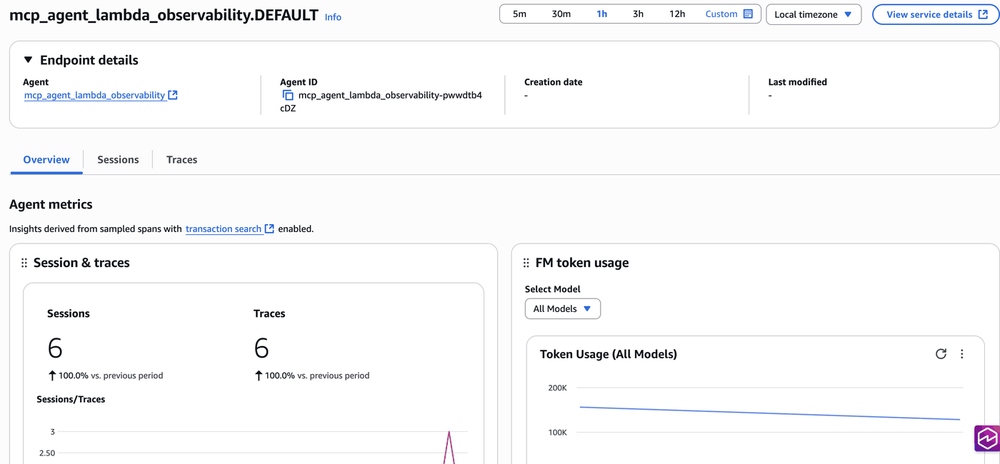
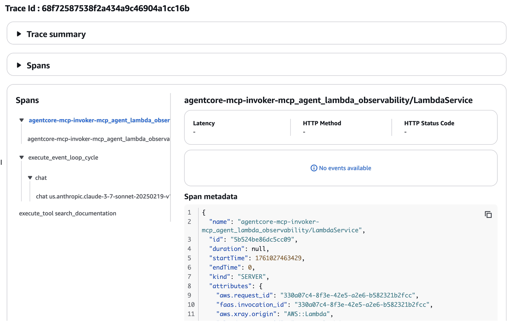

# Invoking Amazon Bedrock AgentCore Runtime from AWS Lambda with CloudWatch Observability

## Overview

This tutorial demonstrates how to invoke a Strands agent with Model Context Protocol (MCP) servers hosted in Amazon Bedrock AgentCore Runtime from an AWS Lambda function, with CloudWatch observability enabled.

### Tutorial Details

| Information         | Details                                                                          |
|:-------------------|:----------------------------------------------------------------------------------|
| Tutorial type      | Conversational                                                                   |
| Agent type         | Single                                                                           |
| Agentic Framework  | Strands Agents                                                                   |
| LLM model          | Anthropic Claude Haiku 4.5                                                      |
| Tutorial components| Lambda invocation, AgentCore Runtime, MCP servers, CloudWatch Observability     |
| Example complexity | Advanced                                                                         |
| SDK used           | Amazon BedrockAgentCore Python SDK, boto3, AWS Lambda                           |

### Architecture
```
┌─────────┐      ┌────────────────┐      ┌──────────────────┐      ┌─────────────────┐
│   API   │─────>│  AWS Lambda    │─────>│  AgentCore       │─────>│  Strands Agent  │
│  /User  │      │  (Invoker)     │      │  Runtime         │      │  + MCP Servers  │
└─────────┘      └────────────────┘      └──────────────────┘      └─────────────────┘
                        │                         │                          │
                        ▼                         ▼                          ▼
                 ┌────────────────────────────────────────────────────────────┐
                 │            CloudWatch Observability                        │
                 │       • Gen AI Traces     • Metrics     • Logs             │
                 └────────────────────────────────────────────────────────────┘
```

### Key Features

* Integrating multiple MCP servers (AWS Documentation + AWS CDK) with Strands Agents
* Hosting agents on Amazon Bedrock AgentCore Runtime
* Invoking hosted agents from AWS Lambda functions
* Monitoring agent execution with CloudWatch Gen AI Observability
* End-to-end trace propagation with AWS Lambda Layer for OpenTelemetry

### What You'll Learn

1. How to deploy an MCP-enabled agent to AgentCore Runtime
2. How to create a Lambda function that invokes the runtime agent
3. How to enable CloudWatch Gen AI Observability for your agents
4. How to configure ADOT Lambda Layer for trace propagation
5. How to view traces and logs in CloudWatch console

## Prerequisites

### Required Software
* Python 3.10+
* AWS credentials configured with appropriate permissions
* Amazon Bedrock AgentCore SDK
* Permissions to create Lambda functions and IAM roles

### Enable CloudWatch Transaction Search (One-Time Setup)

**Before starting this tutorial, you must enable Transaction Search in CloudWatch.** This is a one-time setup per AWS account and region.

#### Steps to Enable Transaction Search:

1. **Navigate to CloudWatch Console**
   - Go to: https://console.aws.amazon.com/cloudwatch/
   - Select your region (top-right corner)

2. **Open Gen AI Observability**
   - In the left navigation, scroll down to **Application Signals**
   - Click on **Gen AI Observability**

3. **Enable Transaction Search**
   - If not already enabled, you'll see a banner to enable Transaction Search
   - Click **Enable Transaction Search**
   - Confirm the action

4. **Wait for Setup to Complete**
   - Transaction Search takes approximately **10 minutes** to be fully operational
   - You can continue with the tutorial while it's being set up

**Important Notes:**
- Transaction Search is required for Gen AI Observability features
- Free tier includes 1% sampling of spans
- Once enabled, it applies to all AI workloads in the account/region

### Install Required Packages

```python
!pip install --upgrade "strands-agents[otel]" strands-agents-tools boto3 bedrock-agentcore bedrock-agentcore-starter-toolkit uv
```

## Step 1: Initialize AWS Session and Get Account Information

```python
import boto3
import json
import time
from boto3.session import Session

# Initialize session and get account details
boto_session = Session()
region = boto_session.region_name
sts_client = boto3.client("sts")
account_id = sts_client.get_caller_identity()["Account"]

print(f"AWS Account ID: {account_id}")
print(f"Region: {region}")
```

## Step 2: Create MCP Agent with Multiple Servers

We'll create an agent that uses two MCP servers:
1. AWS Documentation MCP Server - for accessing AWS documentation
2. AWS CDK MCP Server - for CDK best practices and guidance

```python
%%writefile mcp_agent_multi_server.py
from strands import Agent
from strands.models import BedrockModel
from mcp import StdioServerParameters, stdio_client
from strands.tools.mcp import MCPClient
from bedrock_agentcore.runtime import BedrockAgentCoreApp

# Initialize the BedrockAgentCoreApp
app = BedrockAgentCoreApp()

# Connect to AWS Documentation MCP server
def create_aws_docs_client():
    return MCPClient(
        lambda: stdio_client(
            StdioServerParameters(
                command="uvx", 
                args=["awslabs.aws-documentation-mcp-server@latest"]
            )
        )
    )

# Connect to AWS CDK MCP server
def create_cdk_client():
    return MCPClient(
        lambda: stdio_client(
            StdioServerParameters(
                command="uvx", 
                args=["awslabs.cdk-mcp-server@latest"]
            )
        )
    )

# Function to create agent with tools from both MCP servers
def create_agent():
    model_id = "global.anthropic.claude-haiku-4-5-20251001-v1:0"
    model = BedrockModel(model_id=model_id)
    
    aws_docs_client = create_aws_docs_client()
    cdk_client = create_cdk_client()
    
    with aws_docs_client, cdk_client:
        # Get tools from both MCP servers
        tools = aws_docs_client.list_tools_sync() + cdk_client.list_tools_sync()
        
        # Create agent with these tools
        agent = Agent(
            model=model,
            tools=tools,
            system_prompt="""You are a helpful AWS assistant with access to AWS Documentation 
            and CDK best practices. Provide concise and accurate information about AWS services 
            and infrastructure as code patterns. When asked about pricing or CDK, use your tools 
            to search for the most current information."""
        )
    
    return agent, aws_docs_client, cdk_client

@app.entrypoint
def invoke_agent(payload):
    """Process the input payload and return the agent's response"""
    agent, aws_docs_client, cdk_client = create_agent()
    
    with aws_docs_client, cdk_client:
        user_input = payload.get("prompt")
        print(f"Processing request: {user_input}")
        response = agent(user_input)
        return response.message['content'][0]['text']

if __name__ == "__main__":
    app.run()
```

```python
%%writefile requirements.txt
strands-agents[otel]
strands-agents-tools
uv
boto3
bedrock-agentcore
aws-opentelemetry-distro==0.12.1
```

## Step 3: Deploy Agent to AgentCore Runtime

We'll deploy the MCP agent to AgentCore Runtime. The runtime automatically instruments the agent with OpenTelemetry for CloudWatch observability.

```python
from bedrock_agentcore_starter_toolkit import Runtime

# Configure the runtime
agentcore_runtime = Runtime()
agent_name = "mcp_agent_lambda_observability"

# Check if agent already exists
bedrock_agentcore_client = boto3.client("bedrock-agentcore", region_name=region)

try:
    # Try to list existing agents to check if ours exists
    print("Checking for existing agent...")

    # Configure will handle existing agents gracefully
    config_response = agentcore_runtime.configure(
        entrypoint="mcp_agent_multi_server.py",
        auto_create_ecr=True,
        auto_create_execution_role=True,
        requirements_file="requirements.txt",
        region=region,
        agent_name=agent_name,
    )

    print(f"✅ Agent configured: {agent_name}")

except Exception as e:
    print(f"Configuration note: {e}")
    print("Continuing with existing configuration...")
```

```python
# Launch or update the agent to AgentCore Runtime
print("🚀 Deploying/Updating agent to AgentCore Runtime (this may take several minutes)...")

try:
    # Use auto_update_on_conflict=True for idempotent deployments
    launch_result = agentcore_runtime.launch(auto_update_on_conflict=True)

    print("\n✅ Agent deployed successfully!")
    print(f"Agent ARN: {launch_result.agent_arn}")
    print(f"Agent ID: {launch_result.agent_id}")

    # Save agent details
    agent_arn = launch_result.agent_arn
    agent_id = launch_result.agent_id

except Exception as e:
    # Fallback: if launch fails, try to get status of existing agent
    if "already exists" in str(e).lower() or "conflict" in str(e).lower():
        print("Agent already exists, retrieving existing agent details...")
        try:
            status_response = agentcore_runtime.status()

            # Safely extract agent information
            if status_response and hasattr(status_response, "endpoint") and status_response.endpoint:
                agent_arn = status_response.endpoint.get("agentArn", "")
                if not agent_arn:
                    # Try alternative field names
                    agent_arn = status_response.endpoint.get("agentRuntimeArn", "")
                agent_id = agent_name
                print(f"✅ Using existing agent: {agent_arn}")
            else:
                # If status doesn't have endpoint info, use agent_name
                print("⚠️ Could not retrieve full agent details, using agent name")
                agent_id = agent_name
                agent_arn = ""  # Will be populated in next step

        except Exception as status_error:
            print(f"Status retrieval error: {status_error}")
            print("Using agent name as fallback")
            agent_id = agent_name
            agent_arn = ""
    else:
        print(f"Deployment error: {e}")
        raise e
```

```python
# Wait for agent to be ready
print("⏳ Waiting for agent endpoint to be ready...")
status_response = agentcore_runtime.status()
status = status_response.endpoint.get("status", "UNKNOWN")
end_statuses = ["READY", "CREATE_FAILED", "DELETE_FAILED", "UPDATE_FAILED"]

max_attempts = 60
attempt = 0

while status not in end_statuses and attempt < max_attempts:
    time.sleep(10)
    try:
        status_response = agentcore_runtime.status()
        status = status_response.endpoint.get("status", "UNKNOWN")
        print(f"Status: {status}")
    except Exception as e:
        print(f"Status check error: {e}")
        break
    attempt += 1

if status == "READY":
    print("\n✅ Agent is ready to accept invocations!")
else:
    print(f"\n⚠️ Agent status: {status}")

# Get the runtime ARN (this is what Lambda needs)
agent_runtime_arn = status_response.endpoint.get("agentRuntimeArn", "")
if not agent_runtime_arn:
    agent_runtime_arn = status_response.endpoint.get("endpointArn", "")

print(f"Runtime ARN: {agent_runtime_arn}")
```

## Step 4: Test Direct Invocation

Let's first test the agent directly to ensure it's working correctly.

```python
# Test direct invocation
test_payload = {"prompt": "What is Amazon Bedrock's pricing model?"}

print(f"Testing agent with prompt: {test_payload['prompt']}\n")

try:
    invoke_response = agentcore_runtime.invoke(test_payload)

    # Display response
    from IPython.display import Markdown, display

    response_text = invoke_response["response"][0]
    display(Markdown(response_text))
except Exception as e:
    print(f"Direct invocation test error: {e}")
    print("This may be normal if the agent is still initializing. Continue to next step.")
```

## Step 5: Create Lambda Execution Role

The Lambda function needs permissions to:
1. Invoke the AgentCore Runtime agent
2. Write logs to CloudWatch
3. Send traces to X-Ray
4. Use Application Signals for enhanced observability

```python
iam_client = boto3.client("iam")

# Define Lambda execution role name
lambda_role_name = f"AgentCoreLambdaExecutionRole-{agent_name}"

# Trust policy for Lambda
lambda_trust_policy = {
    "Version": "2012-10-17",
    "Statement": [
        {
            "Effect": "Allow",
            "Principal": {"Service": "lambda.amazonaws.com"},
            "Action": "sts:AssumeRole",
        }
    ],
}

# Create or get the role
try:
    role_response = iam_client.create_role(
        RoleName=lambda_role_name,
        AssumeRolePolicyDocument=json.dumps(lambda_trust_policy),
        Description="Execution role for Lambda to invoke AgentCore Runtime with observability",
    )
    lambda_role_arn = role_response["Role"]["Arn"]
    print(f"✅ Created new Lambda execution role: {lambda_role_arn}")
    time.sleep(10)  # Wait for role to propagate
except iam_client.exceptions.EntityAlreadyExistsException:
    role_response = iam_client.get_role(RoleName=lambda_role_name)
    lambda_role_arn = role_response["Role"]["Arn"]
    print(f"✅ Using existing Lambda execution role: {lambda_role_arn}")

# Attach AWS managed policies
managed_policies = [
    "arn:aws:iam::aws:policy/service-role/AWSLambdaBasicExecutionRole",  # CloudWatch Logs
    "arn:aws:iam::aws:policy/AWSXRayDaemonWriteAccess",  # X-Ray tracing
    "arn:aws:iam::aws:policy/CloudWatchLambdaApplicationSignalsExecutionRolePolicy",  # Application Signals
]

for policy_arn in managed_policies:
    try:
        iam_client.attach_role_policy(RoleName=lambda_role_name, PolicyArn=policy_arn)
        print(f"✅ Attached policy: {policy_arn.split('/')[-1]}")
    except iam_client.exceptions.InvalidInputException:
        print(f"⚠️ Policy already attached: {policy_arn.split('/')[-1]}")
    except Exception as e:
        if "already attached" in str(e).lower():
            print(f"⚠️ Policy already attached: {policy_arn.split('/')[-1]}")
        else:
            print(f"⚠️ Policy attachment note: {e}")
```

```python
# Create custom policy for AgentCore Runtime invocation
agentcore_policy_name = f"AgentCoreRuntimeInvokePolicy-{agent_name}"

# Scoped-down policy - only for this specific agent
agentcore_policy_document = {
    "Version": "2012-10-17",
    "Statement": [
        {
            "Sid": "AgentCoreRuntimeAccess",
            "Effect": "Allow",
            "Action": ["bedrock-agentcore:InvokeAgentRuntime"],
            "Resource": agent_runtime_arn,  # Only this specific runtime
        },
        {
            "Sid": "BedrockModelAccess",
            "Effect": "Allow",
            "Action": ["bedrock:InvokeModel"],
            "Resource": f"arn:aws:bedrock:{region}::foundation-model/*",  # Bedrock models
        },
    ],
}

try:
    policy_response = iam_client.create_policy(
        PolicyName=agentcore_policy_name,
        PolicyDocument=json.dumps(agentcore_policy_document),
        Description="Scoped policy to allow Lambda to invoke specific AgentCore Runtime",
    )
    agentcore_policy_arn = policy_response["Policy"]["Arn"]
    print(f"✅ Created AgentCore invocation policy: {agentcore_policy_arn}")
except iam_client.exceptions.EntityAlreadyExistsException:
    agentcore_policy_arn = f"arn:aws:iam::{account_id}:policy/{agentcore_policy_name}"
    print(f"✅ Using existing AgentCore invocation policy: {agentcore_policy_arn}")

    # Update policy document if it exists
    try:
        # Get existing policy versions
        versions = iam_client.list_policy_versions(PolicyArn=agentcore_policy_arn)["Versions"]

        # Delete oldest non-default version if we have 5 versions
        if len(versions) >= 5:
            oldest_version = sorted(
                [v for v in versions if not v["IsDefaultVersion"]],
                key=lambda x: x["CreateDate"],
            )[0]
            iam_client.delete_policy_version(PolicyArn=agentcore_policy_arn, VersionId=oldest_version["VersionId"])

        # Create new version
        iam_client.create_policy_version(
            PolicyArn=agentcore_policy_arn,
            PolicyDocument=json.dumps(agentcore_policy_document),
            SetAsDefault=True,
        )
        print("  ✅ Updated policy to latest runtime ARN")
    except Exception as e:
        print(f"  ℹ️ Policy update note: {e}")

# Attach custom policy to role
try:
    iam_client.attach_role_policy(RoleName=lambda_role_name, PolicyArn=agentcore_policy_arn)
    print("✅ Attached AgentCore invocation policy to Lambda role")
except Exception as e:
    if "already attached" in str(e).lower():
        print("⚠️ Policy already attached")
    else:
        print(f"⚠️ Policy attachment note: {e}")

print("\n✅ Lambda role configured with minimal required permissions")
```

## Step 6: Configure AWS Lambda Layer for OpenTelemetry

To enable complete trace propagation from Lambda to AgentCore Runtime, we need to add the AWS Lambda Layer for OpenTelemetry (ADOT). This layer:

- Automatically instruments the Lambda function with OpenTelemetry
- Propagates trace context to downstream services (AgentCore Runtime)
- Enables end-to-end visibility in CloudWatch traces

**Without this layer, traces would be disconnected between Lambda and AgentCore Runtime.**

```python
# ADOT Lambda Layer ARNs by region (Python)
# For latest ARNs, see: https://aws-otel.github.io/docs/getting-started/lambda/lambda-python
adot_layer_arns = {
    "us-east-1": "arn:aws:lambda:us-east-1:615299751070:layer:AWSOpenTelemetryDistroPython:18",
    "us-east-2": "arn:aws:lambda:us-east-2:615299751070:layer:AWSOpenTelemetryDistroPython:15",
    "us-west-1": "arn:aws:lambda:us-west-1:615299751070:layer:AWSOpenTelemetryDistroPython:22",
    "us-west-2": "arn:aws:lambda:us-west-2:615299751070:layer:AWSOpenTelemetryDistroPython:22",
    "ap-south-1": "arn:aws:lambda:ap-south-1:615299751070:layer:AWSOpenTelemetryDistroPython:15",
    "ap-northeast-2": "arn:aws:lambda:ap-northeast-2:615299751070:layer:AWSOpenTelemetryDistroPython:15",
    "ap-southeast-1": "arn:aws:lambda:ap-southeast-1:615299751070:layer:AWSOpenTelemetryDistroPython:14",
    "ap-southeast-2": "arn:aws:lambda:ap-southeast-2:615299751070:layer:AWSOpenTelemetryDistroPython:15",
    "ap-northeast-1": "arn:aws:lambda:ap-northeast-1:615299751070:layer:AWSOpenTelemetryDistroPython:15",
    "eu-central-1": "arn:aws:lambda:eu-central-1:615299751070:layer:AWSOpenTelemetryDistroPython:15",
    "eu-west-1": "arn:aws:lambda:eu-west-1:615299751070:layer:AWSOpenTelemetryDistroPython:15",
    "eu-west-2": "arn:aws:lambda:eu-west-2:615299751070:layer:AWSOpenTelemetryDistroPython:15",
}

adot_layer_arn = adot_layer_arns.get(region)
if not adot_layer_arn:
    print(f"⚠️ Warning: ADOT Layer ARN not defined for region {region}")
    print("Please check https://aws-otel.github.io/docs/getting-started/lambda/lambda-python for the latest ARN")
    print("Continuing without ADOT Layer - trace propagation may be limited")
else:
    print(f"✅ Using ADOT Layer for region {region}:")
    print(f"   {adot_layer_arn}")
```

## Step 7: Create Lambda Function

This Lambda function will invoke the AgentCore Runtime agent with X-Ray tracing and ADOT instrumentation enabled.

```python
%%writefile lambda_agentcore_invoker.py
import json
import boto3
import os
import traceback
from botocore.exceptions import ClientError

def lambda_handler(event, context):
    """
    Lambda function to invoke AgentCore Runtime agent.
    
    Expected event format:
    {
        "prompt": "Your question here",
        "sessionId": "optional-session-id"
    }
    """
    
    # Initialize boto3 client
    bedrock_agentcore_client = boto3.client('bedrock-agentcore')
    
    try:
        # Get environment variables
        runtime_arn = os.environ.get('RUNTIME_ARN')
        
        print(f"Lambda function started")
        print(f"Runtime ARN: {runtime_arn}")
        
        if not runtime_arn:
            return {
                'statusCode': 500,
                'body': json.dumps({
                    'error': 'Configuration Error',
                    'message': 'Missing RUNTIME_ARN environment variable'
                })
            }
        
        # Parse input
        if isinstance(event, str):
            event = json.loads(event)
        
        prompt = event.get('prompt', '')
        session_id = event.get('sessionId', context.aws_request_id)
        
        if not prompt:
            return {
                'statusCode': 400,
                'body': json.dumps({
                    'error': 'Bad Request',
                    'message': 'Missing prompt in request'
                })
            }
        
        print(f"Processing prompt: {prompt}")
        print(f"Session ID: {session_id}")
        
        # Prepare payload for AgentCore
        payload = json.dumps({"prompt": prompt})
        
        # Invoke AgentCore Runtime
        print("Invoking AgentCore Runtime...")
        response = bedrock_agentcore_client.invoke_agent_runtime(
            agentRuntimeArn=runtime_arn,
            runtimeSessionId=session_id,
            payload=payload
        )
        
        print("Response received from AgentCore")
        
        # Parse response - handle StreamingBody
        agent_response = None
        
        if 'response' in response:
            response_body = response['response']
            
            # Handle StreamingBody
            if hasattr(response_body, 'read'):
                raw_data = response_body.read()
                if isinstance(raw_data, bytes):
                    agent_response = raw_data.decode('utf-8')
                else:
                    agent_response = str(raw_data)
            elif isinstance(response_body, list) and len(response_body) > 0:
                if isinstance(response_body[0], bytes):
                    agent_response = response_body[0].decode('utf-8')
                else:
                    agent_response = str(response_body[0])
            elif isinstance(response_body, bytes):
                agent_response = response_body.decode('utf-8')
            elif isinstance(response_body, str):
                agent_response = response_body
            else:
                agent_response = str(response_body)
        
        if not agent_response:
            agent_response = "No response from agent"
            print("Warning: No response extracted from AgentCore")
        
        print(f"Agent response received (length: {len(agent_response)} chars)")
        
        return {
            'statusCode': 200,
            'body': json.dumps({
                'response': agent_response,
                'sessionId': session_id
            }),
            'headers': {
                'Content-Type': 'application/json'
            }
        }
        
    except ClientError as e:
        error_code = e.response['Error']['Code']
        error_message = e.response['Error']['Message']
        print(f"AWS ClientError: {error_code}")
        print(f"Error message: {error_message}")
        traceback.print_exc()
        
        return {
            'statusCode': 500,
            'body': json.dumps({
                'error': error_code,
                'message': error_message
            })
        }
    
    except Exception as e:
        print(f"Unexpected error: {str(e)}")
        print(f"Error type: {type(e).__name__}")
        traceback.print_exc()
        
        return {
            'statusCode': 500,
            'body': json.dumps({
                'error': 'InternalError',
                'message': str(e),
                'type': type(e).__name__
            })
        }
```

```python
# Create deployment package
import zipfile
from pathlib import Path

zip_filename = "lambda_agentcore_invoker.zip"
lambda_file = "lambda_agentcore_invoker.py"

print("Creating Lambda deployment package...")

# Ensure the file exists
if not Path(lambda_file).exists():
    raise FileNotFoundError(f"{lambda_file} not found. Run the previous cell first.")

# Remove old zip if exists
if Path(zip_filename).exists():
    Path(zip_filename).unlink()
    print(f"Removed old {zip_filename}")

# Create new zip file
with zipfile.ZipFile(zip_filename, "w", zipfile.ZIP_DEFLATED) as zipf:
    zipf.write(lambda_file, arcname=lambda_file)

print(f"✅ Created Lambda deployment package: {zip_filename}")

# Read the zip file as bytes
with open(zip_filename, "rb") as f:
    lambda_zip_content = f.read()

print(f"Package size: {len(lambda_zip_content):,} bytes")
```

```python
# Create or update Lambda function with ADOT Layer and X-Ray tracing
lambda_client = boto3.client("lambda", region_name=region)
lambda_function_name = f"agentcore-mcp-invoker-{agent_name}"

print("📋 Lambda Configuration:")
print(f"  Function Name: {lambda_function_name}")
print(f"  Runtime ARN:   {agent_runtime_arn}")
print(f"  ADOT Layer:    {adot_layer_arn if adot_layer_arn else 'Not configured'}")
print(f"  AWS Region:    {region}")
print()

lambda_config = {
    "FunctionName": lambda_function_name,
    "Runtime": "python3.12",
    "Role": lambda_role_arn,
    "Handler": "lambda_agentcore_invoker.lambda_handler",
    "Code": {"ZipFile": lambda_zip_content},
    "Description": "Lambda function to invoke AgentCore Runtime with MCP servers and ADOT instrumentation",
    "Timeout": 300,
    "MemorySize": 512,
    "Environment": {
        "Variables": {
            "RUNTIME_ARN": agent_runtime_arn,
            "AWS_LAMBDA_EXEC_WRAPPER": "/opt/otel-instrument",  # Enable ADOT auto-instrumentation
        }
    },
    "TracingConfig": {
        "Mode": "Active"  # Enable X-Ray tracing
    },
}

# Add ADOT Layer if available
if adot_layer_arn:
    lambda_config["Layers"] = [adot_layer_arn]

try:
    lambda_response = lambda_client.create_function(**lambda_config)
    lambda_function_arn = lambda_response["FunctionArn"]
    print(f"✅ Created Lambda function: {lambda_function_name}")
    print(f"Function ARN: {lambda_function_arn}")
except lambda_client.exceptions.ResourceConflictException:
    print("⚠️  Function exists, updating...")

    # Update code
    lambda_client.update_function_code(FunctionName=lambda_function_name, ZipFile=lambda_zip_content)
    print("  ✅ Code updated")

    # Wait a moment for code update to process
    time.sleep(2)

    # Update configuration
    update_config = {
        "FunctionName": lambda_function_name,
        "Environment": lambda_config["Environment"],
        "TracingConfig": lambda_config["TracingConfig"],
        "Timeout": lambda_config["Timeout"],
        "MemorySize": lambda_config["MemorySize"],
    }

    # Add layers if available
    if adot_layer_arn:
        update_config["Layers"] = [adot_layer_arn]

    lambda_client.update_function_configuration(**update_config)
    print("  ✅ Configuration updated")

    lambda_function_arn = lambda_client.get_function(FunctionName=lambda_function_name)["Configuration"]["FunctionArn"]
    print(f"✅ Updated existing Lambda function: {lambda_function_name}")
except Exception as e:
    print(f"Lambda creation/update error: {e}")
    raise e

# Wait for function to be ready
print("\n⏳ Waiting for Lambda function to be active...")
try:
    waiter = lambda_client.get_waiter("function_active_v2")
    waiter.wait(FunctionName=lambda_function_name)
    print("✅ Lambda function is active and ready!")
except Exception as e:
    print(f"Waiter note: {e}")
    print("Continuing...")

print("\n✅ X-Ray Active Tracing is ENABLED")
if adot_layer_arn:
    print("✅ ADOT Layer is ENABLED - Trace context will propagate to AgentCore Runtime")
else:
    print("⚠️ ADOT Layer is NOT enabled - Trace propagation may be limited")
```

## Step 8: Invoke Lambda Function and Test

Let's invoke the Lambda function to test the integration.

```python
# Test payloads
test_payloads = [
    {"prompt": "What is AWS Lambda? Answer in one sentence."},
    {"prompt": "Name 2 AWS compute services."},
    {"prompt": "What is Amazon S3 used for? Be brief."},
]

print("🚀 Invoking Lambda function with test payloads...\n")

for i, payload in enumerate(test_payloads, 1):
    print(f"\n{'=' * 80}")
    print(f"Test {i}: {payload['prompt']}")
    print("=" * 80)

    try:
        response = lambda_client.invoke(
            FunctionName=lambda_function_name,
            InvocationType="RequestResponse",
            Payload=json.dumps(payload),
        )

        response_payload = json.loads(response["Payload"].read())

        if "FunctionError" in response:
            print("\n❌ Lambda Function Error!")
            print(f"Error Type: {response_payload.get('errorType', 'Unknown')}")
            print(f"Error Message: {response_payload.get('errorMessage', 'Unknown')}")
            continue

        if response_payload["statusCode"] == 200:
            body = json.loads(response_payload["body"])
            print("\n✅ Success!")
            print(f"Session ID: {body.get('sessionId', 'N/A')}")

            response_text = body.get("response", "")
            print(f"\nAgent Response:\n{response_text[:300]}...") if len(response_text) > 300 else print(
                f"\nAgent Response:\n{response_text}"
            )
        else:
            print(f"\n❌ Error Response (Status: {response_payload['statusCode']})")
            body = json.loads(response_payload["body"])
            print(f"Error: {body.get('error', 'Unknown')}")
            print(f"Message: {body.get('message', 'Unknown')}")

    except Exception as e:
        print(f"\n❌ Unexpected error: {e}")
        import traceback

        traceback.print_exc()

    time.sleep(2)

print("\n" + "=" * 80)
print("✅ All test invocations completed!")
print("\n⏰ Traces are being processed and will be available in CloudWatch within 1-2 minutes.")
```

## Step 9: View Observability Data in CloudWatch

Now that we've generated traces with ADOT instrumentation, you can view the complete end-to-end trace from Lambda to AgentCore Runtime in the CloudWatch console.

### CloudWatch Observability Dashboards

#### 1. CloudWatch Gen AI Observability Dashboard

Your primary dashboard for viewing agent performance:
- **Features**: Agents View, Sessions View, Traces with span timelines
- **Metrics**: Token usage, duration, error rates, tool invocations
- **Trace Continuity**: With ADOT Layer, you'll see connected traces from Lambda → AgentCore Runtime



#### 2. CloudWatch Logs
Raw execution logs:
- **Lambda Logs**: Function execution details
- **AgentCore Logs**: Agent processing steps and MCP server communications

### Direct Console Links

```python
# Generate CloudWatch console URLs
base_url = f"https://{region}.console.aws.amazon.com/cloudwatch"

urls = {
    "Gen AI Observability Dashboard": f"{base_url}/home?region={region}#/gen-ai-observability/agent-core/agents",
    "Lambda Function Logs": f"{base_url}/home?region={region}#logsV2:log-groups/log-group/$252Faws$252Flambda$252F{lambda_function_name}",
    "AgentCore Runtime Logs": f"{base_url}/home?region={region}#logsV2:log-groups/log-group/$252Faws$252Fbedrock-agentcore$252Fruntimes$252F{agent_id}-DEFAULT",
}

print("📊 CloudWatch Observability Links\n")
for name, url in urls.items():
    print(f"{name}:")
    print(f"  {url}\n")

print("\n📊 Key Observability Features:")
print("\n1. Gen AI Observability Dashboard:")
print("   • Session duration, count, and conversation flow")
print("   • Token usage (input/output) and costs")
print("   • MCP tool invocation traces")
print("   • Error rates and latency metrics")
print("   • End-to-end trace from Lambda to AgentCore (with ADOT Layer)")
print("\n2. CloudWatch Logs:")
print("   • Lambda execution logs with request/response data")
print("   • Agent processing steps and decision-making")
print("   • MCP server communication logs")
print("   • OpenTelemetry instrumentation data")

print("\n💡 How to view logs in CloudWatch Console:")
print("\n  Lambda Logs:")
print("   1. Click the 'Lambda Function Logs' link above")
print("   2. Select the most recent log stream")
print("   3. View execution details including:")
print("      • START/END RequestId markers")
print("      • Processing prompt messages")
print("      • Response received confirmations")
print("      • Duration and memory usage in REPORT")
print("\n  AgentCore Logs:")
print("   1. Click the 'AgentCore Runtime Logs' link above")
print("   2. Look for 'runtime-logs' log stream")
print("   3. View agent execution including:")
print("      • MCP tool invocations")
print("      • Agent reasoning steps")
print("      • OpenTelemetry trace data")

if adot_layer_arn:
    print("\n✅ ADOT Layer Enabled - Trace Context Propagation:")
    print("   • Traces will show Lambda → AgentCore Runtime connection")
    print("   • View complete request flow in CloudWatch X-Ray trace map")
    print("   • Session IDs and trace IDs are propagated across services")
else:
    print("\n⚠️ ADOT Layer Not Enabled:")
    print("   • Traces may be disconnected between Lambda and AgentCore")
    print("   • Consider adding ADOT Layer for complete observability")
```

## Summary and Best Practices

### What We Accomplished

✅ **Agent Deployment**: Created an MCP agent with AWS Docs + CDK servers and deployed to AgentCore Runtime

✅ **Lambda Integration**: Built a Lambda function to invoke the hosted agent

✅ **ADOT Instrumentation**: Added AWS Lambda Layer for OpenTelemetry for trace propagation

✅ **CloudWatch Observability**: Enabled Gen AI Observability for monitoring

✅ **End-to-End Testing**: Generated traces showing Lambda → AgentCore → MCP flow

### Key Observability Components

1. **ADOT Lambda Layer**: Enables trace context propagation from Lambda to downstream services
2. **X-Ray Active Tracing**: Provides request path visualization
3. **Gen AI Traces**: Complete span timelines with tool invocations
4. **CloudWatch Logs**: Detailed execution logs with timestamps
5. **Performance Metrics**: Duration, token usage, error rates

### Best Practices

1. **Always Use ADOT Layer**: Ensures trace continuity across service boundaries
2. **Session IDs**: Use consistent session IDs to track conversations
3. **Monitor Metrics**: Track duration, token usage, and error rates
4. **Set Alarms**: Create CloudWatch alarms for thresholds
5. **Log Retention**: Configure appropriate retention periods
6. **Regular Reviews**: Analyze traces to identify bottlenecks

### Next Steps

1. **Explore Dashboards**: Visit CloudWatch Gen AI Observability
2. **Analyze Traces**: Review individual trace timelines and verify Lambda → AgentCore connection
3. **Create Alarms**: Set up error rate and latency alerts
4. **Optimize**: Use trace data to improve performance
5. **Scale**: Monitor and adjust as traffic grows

### Cleanup Resources

```python
# # Uncomment to delete resources

# # Delete Lambda function
# try:
#     lambda_client.delete_function(FunctionName=lambda_function_name)
#     print(f"✅ Deleted Lambda function: {lambda_function_name}")
# except Exception as e:
#     print(f"Lambda deletion note: {e}")

# # Detach and delete IAM policies
# for policy_arn in managed_policies + [agentcore_policy_arn]:
#     try:
#         iam_client.detach_role_policy(RoleName=lambda_role_name, PolicyArn=policy_arn)
#     except Exception as e:
#         print(f"Policy detach note: {e}")

# # Delete IAM role
# try:
#     iam_client.delete_role(RoleName=lambda_role_name)
#     print(f"✅ Deleted IAM role: {lambda_role_name}")
# except Exception as e:
#     print(f"Role deletion note: {e}")

# # Delete custom policy
# try:
#     iam_client.delete_policy(PolicyArn=agentcore_policy_arn)
#     print(f"✅ Deleted custom policy: {agentcore_policy_name}")
# except Exception as e:
#     print(f"Policy deletion note: {e}")

# # Delete AgentCore Runtime
# try:
#     agentcore_runtime.delete()
#     print(f"✅ Deleted AgentCore Runtime agent: {agent_name}")
# except Exception as e:
#     print(f"AgentCore deletion note: {e}")

print("To delete resources, uncomment the code above and run this cell.")
```

## Congratulations! 🎉

You have successfully:
- Deployed an MCP-enabled agent to Amazon Bedrock AgentCore Runtime
- Created a Lambda function with ADOT Layer for trace propagation
- Configured CloudWatch Gen AI Observability
- Generated and viewed end-to-end traces in CloudWatch console

You can now build production-ready AI agents with complete observability!

### Additional Resources

- [Amazon Bedrock AgentCore Documentation](https://docs.aws.amazon.com/bedrock-agentcore/latest/devguide/what-is-bedrock-agentcore.html)
- [CloudWatch Gen AI Observability Guide](https://docs.aws.amazon.com/AmazonCloudWatch/latest/monitoring/GenAI-observability.html)
- [AWS Lambda Layer for OpenTelemetry](https://aws-otel.github.io/docs/getting-started/lambda)
- [AWS X-Ray Documentation](https://docs.aws.amazon.com/xray/latest/devguide/)
- [Model Context Protocol (MCP)](https://modelcontextprotocol.io/)
