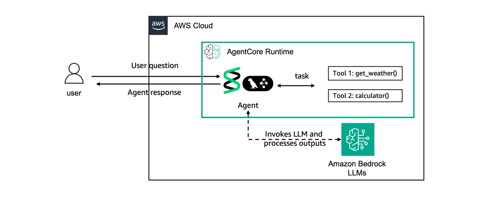

# Prerequisites: Creating Sample Agents

## Overview

Let's first start by creating agents to be evaluated. This tutorial creates two sample agents for evaluation using different frameworks:
- [Strands Agents SDK](https://strandsagents.com/)
- [LangGraph](https://www.langchain.com/langgraph)

Both agents uses Anthropic Claude Haiku 4.5 from Amazon Bedrock as the LLM model but you can use any model of your preference and they have identical capabilities:
- **Math Tool**: Tool to perform basic math operations
- **Weather Tool**: Dummy implementation for weather tool


The architecture looks as following:



## Prerequisites
- Python 3.10+
- AWS credentials

```python
!pip install -r ../requirements.txt
```

## Setup

Import required packages and configure AWS session:

```python
from bedrock_agentcore_starter_toolkit import Runtime
from boto3.session import Session
import uuid
import time

boto_session = Session()
region = boto_session.region_name
print(f"Using region: {region}")
```

## Deploy Strands Agent
Let's deploy our Strands Agents to AgentCore Runtime

```python
agentcore_runtime = Runtime()

agent_name = "ac_eval_strands2"
response = agentcore_runtime.configure(
    entrypoint="eval_agent_strands.py",
    auto_create_execution_role=True,
    auto_create_ecr=True,
    requirements_file="requirements_strands.txt",
    region=region,
    agent_name=agent_name,
    idle_timeout=120,
)
launch_result_strands = agentcore_runtime.launch()
print(f"Strands agent deployment started: {launch_result_strands}")
```

### Check status for deployment on AgentCore Runtime
Wait for deployment to be in ACTIVE status..

```python
def wait_for_deployment(runtime, name):
    end_statuses = ["READY", "CREATE_FAILED", "DELETE_FAILED", "UPDATE_FAILED"]
    while True:
        status_response = runtime.status()
        status = status_response.endpoint["status"]
        print(f"{name} status: {status}")
        if status in end_statuses:
            print(f"{name} deployment completed with status: {status}")
            return status
        time.sleep(10)


strands_status = wait_for_deployment(agentcore_runtime, "Strands")
```

### Invoke the Strands Agents on Runtime
Let's test the Strands agent by invoking the AgentCore Runtime endpoint with a payload.

```python
session_id_strands = str(uuid.uuid4())
print(f"Session ID: {session_id_strands}")
```

```python
invoke_response = agentcore_runtime.invoke(payload={"prompt": "How much is 2+2?"}, session_id=session_id_strands)
invoke_response
```

```python
invoke_response = agentcore_runtime.invoke(payload={"prompt": "How is the weather now?"}, session_id=session_id_strands)
invoke_response
```

```python
invoke_response = agentcore_runtime.invoke(
    payload={"prompt": "Can you tell me the capital of the US?"},
    session_id=session_id_strands,
)
invoke_response
```

## Deploy LangGraph Agent to AgentCore Runtime

Let's also deploy our LangGraph agent to AgentCore Runtime.

```python
langgraph_agentcore_runtime = Runtime()
agent_name = "ac_eval_langgraph2"
response = langgraph_agentcore_runtime.configure(
    entrypoint="eval_agent_langgraph.py",
    auto_create_execution_role=True,
    auto_create_ecr=True,
    requirements_file="requirements_langgraph.txt",
    region=region,
    agent_name=agent_name,
    idle_timeout=120,
)
launch_result_langgraph = langgraph_agentcore_runtime.launch()
print(f"LangGraph agent deployment started: {launch_result_langgraph}")
```

### Check the status of LangGraph agent
Now that we've deployed the LangGraph agent to AgentCore Runtime, let's check for it's deployment status

```python
langgraph_status = wait_for_deployment(langgraph_agentcore_runtime, "LangGraph")
```

### Invoke the Langgraph Agent on Runtime
Test the LangGraph agent endpoint on AgentCore Runtime with a payload:

```python
session_id_langgraph = str(uuid.uuid4())
print(f"Session ID: {session_id_langgraph}")
```

```python
response = langgraph_agentcore_runtime.invoke(payload={"prompt": "What is 2+2?"}, session_id=session_id_langgraph)
print(response)
```

```python
invoke_response = agentcore_runtime.invoke(
    payload={"prompt": "What is the weather now?"}, session_id=session_id_langgraph
)
invoke_response
```

```python
invoke_response = agentcore_runtime.invoke(
    payload={"prompt": "Can you tell me the capital of the US?"},
    session_id=session_id_langgraph,
)
invoke_response
```

```python
print(f"Strands: {launch_result_strands}, Session: {session_id_strands}")
print(f"LangGraph: {launch_result_langgraph}, Session: {session_id_langgraph}")
```

```python
%store launch_result_strands
%store session_id_strands
%store launch_result_langgraph
%store session_id_langgraph
```

## Next Steps

Now that you have all the required pre-requisites, let's go through the individual evaluation tutorials:
Continue with the evaluation tutorials:
- [01-creating-custom-evaluators](../01-creating-custom-evaluators/): Create custom evaluators
- [02-running-evaluations](../02-running-evaluations/): Run on-demand and online evaluations
- [03-advanced](../03-advanced/): : Advanced techniques and dashboards
