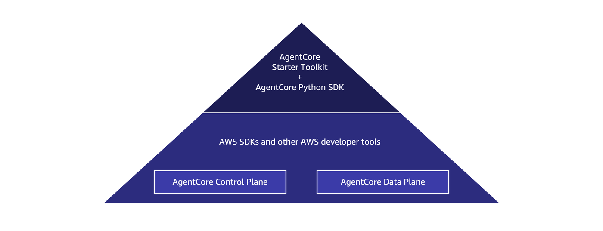

## AgentCore Evaluations - creating evaluators

In this tutorial you will learn about AgentCore Evaluations built-in and custom metrics.
You'll learn when to use each type and how to create custom evaluators tailored to your specific needs.

### What You'll Learn
- Understanding built-in evaluators and their use cases
- Creating custom evaluators for specialized requirements
- Selecting the right evaluation approach for your agents

### Tutorial Details

| Information         | Details                                                                        |
|:--------------------|:-------------------------------------------------------------------------------|
| Tutorial type       | Create custom evaluatior metric                                                |
| LLM model           | Anthropic Claude Haiku 4.5                                                     |
| Tutorial components | Listing built-in evaluators, creating a custom evaluator metric                |
| Tutorial vertical   | Cross-vertical                                                                 |
| Example complexity  | Easy                                                                           |
| SDK used            | Amazon Bedrock AgentCore Starter toolkit                                       |

## Evaluators Types

### Built-in evaluators

AgentCore provides 13 pre-configured evaluators that use Large Language Models (LLMs) as judges to assess agent performance. These evaluators come with their carefully crafted prompt templates and pre-selected evaluator models, standardizing the evaluation criteria across different use cases. They are ready to use and you don't need to add any additional configuration to get started.

These evaluators are divided into 4 different groups:

- **Response quality**: evaluators that help you deciding if your agent is working as expected at each turn. They work on a trace-basis and evaluate each user-agent interaction.
- **Task completion**: this category has one evaluator (Goal success) that will evaluate the session as a whole. In a multi-turn conversation, this evaluator helps you deciding if the user goal (or goals) were completed and if the final outcome was achieved. In situations where the agent asks follow up questions, this evaluator is essential to understand if the tasks requested were actually completed.
- **Tool level**: evaluators that help you understand how sucessful your tool calling is. It measures the accuracy of the tool and parameter selection for the agent at a tool level. If an agent is calling two or more different tools in a single turn, each one of them will have its own metric in the trace.
- **Safety**: evaluators that detect if your agent is being harmful or is making steriotyping generalizations about individuals or groups.

When using built-in metrics everything is handled for you from prompt to model. That means that your evaluator cannot be modified, in order to maintain the evaluation consistent and reliable across all users. You can however create your own metrics using a built-in metric as basis. To do so, we provide you with the **Prompt Templates** for our built-in evaluators.

### Custom evaluators

Custom evaluators provide maximum flexibility by allowing you to define every aspect of your evaluation process while leveraging LLMs as underlying judges. You can customize the following in your custom evaluator:

- **Evaluator model**: Choose the LLM that best fits your evaluation needs
- **Evaluation prompts**: Craft evaluation instructions specific to your use case
- **Scoring schema**: Design scoring systems that align with your organization's metrics

### Generating traces on AgentCore Observability from an agent

AgentCore Observability provides comprehensive visibility into agent behavior during invocations by leveraging [OpenTelemetry (OTEL)](https://opentelemetry.io/) traces as the foundation for capturing and structuring detailed execution data. AgentCore relies on [AWS Distro for OpenTelemetry (ADOT)](https://aws-otel.github.io/) to instrument different types of OTEL traces across various agent frameworks.

When your agent is hosted on AgentCore Runtime (like our agent in this tutorial), the AgentCore Observability instrumentation is automatic, with minimal configuration. All you need to do is include `aws-opentelemetry-distro` in `requirements.txt` and AgentCore Runtime handles OTEL configuration automatically. When your agent is not running in AgentCore Runtime, you will need to instrument it with ADOT to have it available in AgentCore Observability. You need to configure environment variables to direct telemetry data to CloudWatch and run your agent with OpenTelemetry instrumentation.

The process looks as following:


Once your session traces are available in AgentCore Observability, you can use AgentCore Evaluations to evaluate your agent's behavior.

### Evaluation levels
AgentCore Evaluations operate in different levels of the agent interaction. You can analyse the back and forward conversation as a whole using the session information. You can also evaluate the agent's response to a user question in an individual turn of the conversation using the trace information. Or you can evaluate information inside of a turn, which includes the tool calling and parameter selection, using the span data.

You can create custom metrics for the different levels. The built-in metrics operate in the following scope:


In this tutorial, we will create a metric at trace level.

### Tutorial outcomes

By the end of this tutorial you will have learned about the AgentCore Evaluation built-in and custom metrics. You will also have created a custom metric to measure the response quality of your agents.

### Prerequisites
To execute this tutorial you will need:
* Python 3.10+
* AWS credentials
* Amazon Bedrock AgentCore Starter toolkit

### Using AgentCore Evaluations

Amazon Bedrock AgentCore supports various interfaces for developing, deploying and monitoring your agents and tools.

For full control, you can use the [control plane](https://docs.aws.amazon.com/bedrock-agentcore-control/latest/APIReference/Welcome.html) and [data plane](https://docs.aws.amazon.com/bedrock-agentcore/latest/APIReference/Welcome.html) APIs. Those APIs are exposed via AWS SDKs ([boto3](https://boto3.amazonaws.com/v1/documentation/api/latest/guide/quickstart.html), [AWS SDK for Java](https://docs.aws.amazon.com/sdk-for-java/latest/developer-guide/home.html), [AWS SDK for JavaScript](https://docs.aws.amazon.com/sdk-for-javascript/v3/developer-guide/welcome.html)) and other AWS developer tools, such as the AWS Command Line Interface ([AWS CLI](https://aws.amazon.com/cli/)).

For a simplified approach, you can also use the [AgentCore Python SDK](https://github.com/aws/bedrock-agentcore-sdk-python) and the [AgentCore Starter Toolkit](https://github.com/aws/bedrock-agentcore-starter-toolkit). The AgentCore Python SDK provides Python primitives for agent development and the AgentCore Starter Toolkit provides CLI tools and higher-level abstractions for AgentCore functionalities.



For this tutorial, we will use the AgentCore Starter Toolkit for a simplified experience. In the `03-advanced` folder you can find an example of working with boto3 directly

```python
from bedrock_agentcore_starter_toolkit import Evaluation
import json
from boto3.session import Session
```

```python
boto_session = Session()
region = boto_session.region_name
print(region)
```

### Initiating the AgentCore evaluation client

Let's now initiate our evaluation client. For this tutorial we will use the [AgentCore Starter Toolkit](https://github.com/aws/bedrock-agentcore-starter-toolkit), an abstraction SDK that simplifies your interaction with the AgentCore components to speed up your getting started process.

```python
eval_client = Evaluation(region=region)
```

### Retrieving built-in evaluators

Let's now retrieve the available built-in evaluators to understand where they can be used. The `list_evaluators()` function can help with it.

```python
available_evaluators = eval_client.list_evaluators()
available_evaluators
```

We can also retrieve the information as a dictionary to use in on-demand and online evaluations later on:

```python
print(
    available_evaluators["evaluators"][0]["evaluatorId"],
    available_evaluators["evaluators"][0]["description"],
)
```

As we can see, the `Builtin.Correctness` metric help us evaluate a response quality. Let's deep-dive into this metric to undersand its details. For that we can use the `get_evaluator` method

```python
eval_client.get_evaluator(evaluator_id="Builtin.Correctness")
```

In this case we can see that our evaluator is classifying the response into 3 levels: Incorrect, Partially Correct and Correct. For our use case, we would like to be a bit more detailed and use a 5 levels scale. To help with that, we can create a custom evaluator.

### Create custom evaluator

Let's now create a custom metric for response quality that will allow us to have the 5 levels scale. To do so we need to select an evaluator model, provide instructions to the evaluation and set the rating scale. In this case our scale will go from Very Good to Very Poor. Let's retrieve the evaluation configuration from the JSON file

```python
with open("metric.json") as f:
    print("Reading custom metric details")
    eval_config = json.load(f)
eval_config
```

We can then use the `create_evaluator` method to create the evaluator. We will create the `response_Quality` evaluator at `TRACE` level. 

When creating your custom evaluator you can chose to apply it at a tool call level, trace level or session level. 

* **A tool call** is a span that represents an agent’s invocation of an external function, API, or capability. Tool-call spans typically capture information such as the tool name, input parameters, execution time, and output. Tool-call details are used to evaluate whether the agent selected and used tools correctly and efficiently.

* **A trace** is a complete record of a single agent execution or request. A trace contains one or more spans, which represent the individual operations performed during that execution. Traces provide end-to-end visibility into agent decisions and tool usage.

* **A session** represents a logical grouping of related interactions from a single user or workflow. A session may contain one or more traces. Sessions help you view and evaluate agent behavior across multi-step interactions, rather than focusing on individual requests.

```python
custom_evaluator = eval_client.create_evaluator(
    name="response_quality_for_scope",
    level="TRACE",
    description="Response quality evaluator",
    config=eval_config,
)
```

### Saving evaluator information for next tutorials

We will now save the evaluatorId for usage in the next tutorials. We will save the `evaluator_id` variable for it.

```python
evaluator_id = custom_evaluator["evaluatorId"]
```

```python
%store evaluator_id
```

#### Congratulations

You have now created a custom evaluator that we will use in the next tutorials.
