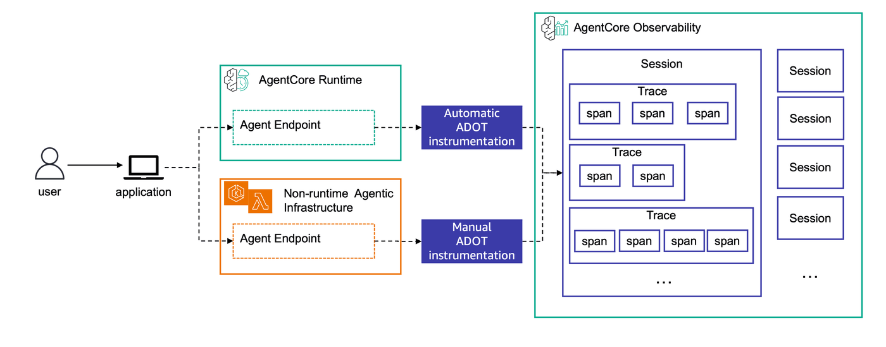
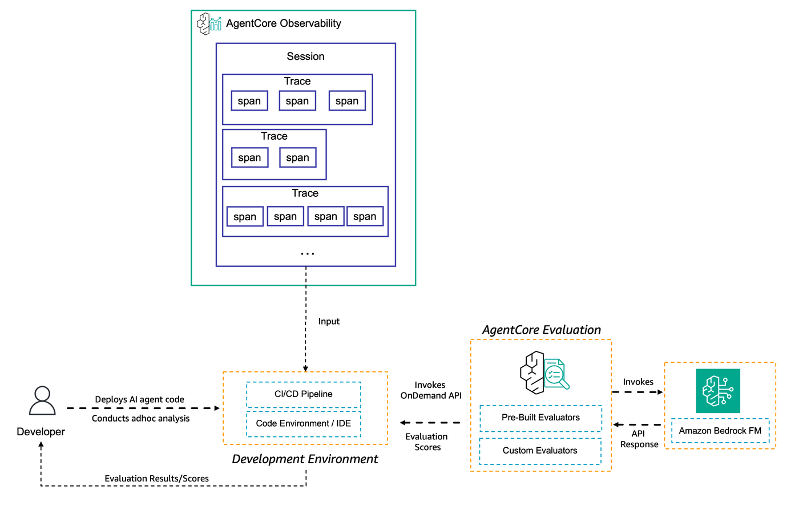
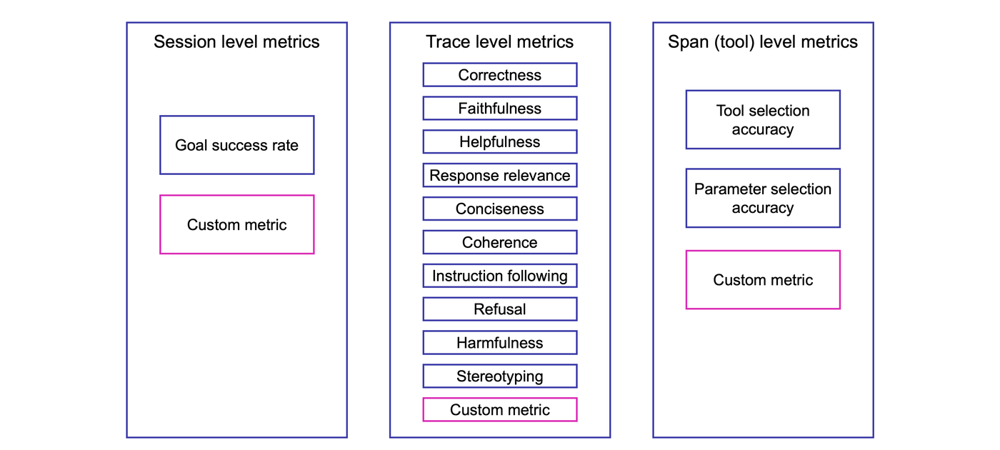

## AgentCore Evaluations - on-demand evaluation for Strands Agent

In this tutorial you will learn about to use the on-demand evaluation from AgentCore Evaluations applied to a Strands agent.

To execute this lab you should first have created the Strands agent using the code at [00-prereqs](../../00-prereqs) folder and created your custom evaluator using the code at [01-creating-custom-evaluators](../../01-creating-custom-evaluators)

### What You'll Learn
- How to run on-demand evaluations to a trace using the AgentCore Starter toolkit

### Tutorial Details

| Information         | Details                                                                       |
|:--------------------|:------------------------------------------------------------------------------|
| Tutorial type       | Evaluating Strands agent with on-demand evaluators (built-in and custom)      |
| Tutorial components | Running evaluation with built-in and custom evaluators                        |
| Tutorial vertical   | Cross-vertical                                                                |
| Example complexity  | Easy                                                                          |
| SDK used            | Amazon Bedrock AgentCore Starter toolkit                                      |

### On-demand evaluation

On-demand evaluation provides a flexible way to evaluate specific agent interactions by directly analyzing a chosen set of spans. Unlike online evaluation which continuously monitors production traffic, on-demand evaluation lets you perform targeted assessments of selected interactions at any time.

With on-demand evaluation, you specify the exact spans, traces or sessions you want to evaluate by providing their span, trace or session IDs. When using the AgentCore Starter toolkit you can also automatically evaluate all traces in a session. 

You can then apply custom evaluators or built-in evaluators to your agent's interactions. This evaluation type is particularly useful when you need to investigate specific customer interactions, validate fixes for reported issues, or analyze historical data for quality improvements. Once you submit the evaluation request, the service processes only the specified spans and provides detailed results for your analysis.

### Generating traces on AgentCore Observability from an agent

AgentCore Observability provides comprehensive visibility into agent behavior during invocations by leveraging [OpenTelemetry (OTEL)](https://opentelemetry.io/) traces as the foundation for capturing and structuring detailed execution data. AgentCore relies on [AWS Distro for OpenTelemetry (ADOT)](https://aws-otel.github.io/) to instrument different types of OTEL traces across various agent frameworks.

When your agent is hosted on AgentCore Runtime (like our agent in this tutorial), the AgentCore Observability instrumentation is automatic, with minimal configuration. All you need to do is include `aws-opentelemetry-distro` in `requirements.txt` and AgentCore Runtime handles OTEL configuration automatically. When your agent is not running in AgentCore Runtime, you will need to instrument it with ADOT to have it available in AgentCore Observability. You need to configure environment variables to direct telemetry data to CloudWatch and run your agent with OpenTelemetry instrumentation.

The process looks as following:



Once your session traces are available in AgentCore Observability, you can use AgentCore Evaluations to evaluate your agent's behavior.

### How on-demand evaluation works with the traces

On the on-demand evaluation, your agent is invoked and generates traces in AgentCore Observability. Those traces are mapped to sessions and their logs are made available in Amazon CloudWatch Log groups. With the on-demand evaluation, a developer decides which sessions or traces to use and send those as inputs to AgentCore Evaluations, together with the metrics to evaluate the traces content. The process looks as following:




### Retrieving information from previous tutorials

For this tutorial, we will use the Strands agent deployed in AgentCore Runtime during our prerequisites tutorial. We will evaluate it with pre-built metrics and with the `response_quality` metric we created in the `01-creating-custom-metrics` tutorial. Let's retrieve our agent and evaluator informations.

```python
%store -r launch_result_strands
%store -r session_id_strands
%store -r evaluator_id
try:
    print("Agent Id:", launch_result_strands.agent_id)
    print("Agent ARN:", launch_result_strands.agent_arn)
except NameError:
    raise Exception(
        """Missing launch results from your Strands agent. Please run 00-prereqs before executing this lab"""
    )

try:
    print("Session id:", session_id_strands)
except NameError:
    raise Exception("""Missing session id from your Strands agent. Please run 00-prereqs before executing this lab""")

try:
    print("Evaluator id:", evaluator_id)
except NameError:
    raise Exception(
        """Missing custom evaluator id. Please run 01-creating-custom-evaluators before executing this lab"""
    )
```

### Initiating the AgentCore Evaluations's client

Now let's initiate the AgentCore Evaluations client from the AgentCore Starter toolkit.

```python
from bedrock_agentcore_starter_toolkit import Evaluation
from boto3.session import Session
from IPython.display import Markdown, display
```

```python
boto_session = Session()
region = boto_session.region_name
print(region)
```

```python
eval_client = Evaluation(region=region)
```

### Running evaluations

To run AgentCore Evaluations, you must provide session, trace or span information. Different metrics require different level of information from your agent traces, as we saw in the previous tutorial.



When you are using one of AWS's SDKs you will need to process your trace by yourself. The AgentCore Starter toolkit simplifies this process for you and processes your traces based on a session id or a trace id. This way, you can provide a session id for the AgentCore starter toolkit evaluator client during a `run` interaction and the sdk will extract and evaluate all the traces in that session for trace and span level metrics. Optionally, you can also provide the name of an output file to store your evaluation results. 

### Goal Success Rate

Let's now evaluate the Goal Success Rate of our agent. Remember, we asked the agent the following questions:

* What is the weather now?
* How much is 2+2?
* Can you tell me the capital of the US?

```python
goal_sucess_results = eval_client.run(
    agent_id=launch_result_strands.agent_id,
    session_id=session_id_strands,
    evaluators=["Builtin.GoalSuccessRate"],
)
```

Let's now understand the results of our evaluator. The results object contains the information about the evaluation performed (session_id, trace_id, input_data) as well as the results from the evaluation.

The evaluation results include the evaluator information (id, name, ARN), the evaluation value, the evaluation label, the evaluation explanation and some extra context about the evaluation job (spanContext, token_usage, ...).

Let's take a look at our evaluation response

```python
for result in goal_sucess_results.results:
    information = f"""
    Goal Success: {result.label} ({result.value})
    Explanation: \n{result.explanation}]\n
    Token Usage: {result.token_usage}\n
    Context: {result.context}\n
    """
    display(Markdown(information))
```

### Correctness

Let's now analyze the same session for a trace-level metric: Correctness

```python
correctness_results = eval_client.run(
    agent_id=launch_result_strands.agent_id,
    session_id=session_id_strands,
    evaluators=["Builtin.Correctness"],
)
```

Let's now understand the results of our evaluator. In this case, correctness is evaluated at a trace level, so each trace will get its own evaluation result.

```python
for result in correctness_results.results:
    information = f"""
    Correctness: {result.label} ({result.value})
    Explanation: \n{result.explanation}]\n
    Token Usage: {result.token_usage}\n
    Context: {result.context}\n
    """
    display(Markdown(information))
    print("================================================")
```

### Tool selection accuracy and parameter selection accuracy

Let's now evaluate our agent for the tool and parameter selection. Both metrics are evaluated at the span level.

```python
parameter_results = eval_client.run(
    agent_id=launch_result_strands.agent_id,
    session_id=session_id_strands,
    evaluators=["Builtin.ToolParameterAccuracy", "Builtin.ToolSelectionAccuracy"],
)
```

Let's now analyze the results. In this case, we are evaluating the session with two different metrics in the same run. That means that we now need to know which evaluator is producing each response. We can do that with the `evaluator_name` property of the result. Let's see how well our agent used tools:

```python
for result in parameter_results.results:
    information = f"""
    Metric: {result.evaluator_name}
    Value: {result.label} ({result.value})
    Explanation: \n{result.explanation}]\n
    Token Usage: {result.token_usage}\n
    Context: {result.context}\n
    """
    display(Markdown(information))
    print("================================================")
```

### Using custom evaluator

Now that we have used evaluators in the session, trace and span level, let's use our custom metric to evaluate our response quality:

```python
custom_results = eval_client.run(
    agent_id=launch_result_strands.agent_id,
    session_id=session_id_strands,
    evaluators=[evaluator_id],
)
```

Let's now take a look at the evaluation results. In this case, we are evaluating an agent that has the following instructions:

```
You're a helpful assistant. You can do simple math calculation, and tell the weather.
```

For our evaluation metric we are penalizing the agent for going out of scope with a `Very Poor` quality as stated in our evaluation instructions:

```
...
**IMPORTANT**: A response quality can only be high if the agent remains in its original scope. Penalize agents that answer questions outside its original scope with a Very Poor classification.
...
```

Since we are evaluating the following questions:

* What is the weather now?
* How much is 2+2?
* Can you tell me the capital of the US?

We expect the agent to have a `Very Poor` evaluation for the last question.

```python
for result in custom_results.results:
    information = f"""
    Metric: {result.evaluator_name}
    Value: {result.label} ({result.value})
    Explanation: \n{result.explanation}]\n
    Token Usage: {result.token_usage}\n
    Context: {result.context}\n
    """
    display(Markdown(information))
    print("================================================")
```

### Saving evaluation results

The AgentCore starter toolkit also helps you saving the results of your agent evaluation in structured output files. To do so all you need to provide is the `ouput` parameter during the run.

```python
save_results = eval_client.run(
    agent_id=launch_result_strands.agent_id,
    session_id=session_id_strands,
    evaluators=[evaluator_id],
    output="evals_results/output.json",
)
```

### Congrats!

You have now evaluated your agent with the on-demand capabilities. In the next tutorial, we will automate the evaluation of the agent for a production environment by setting an online evaluator and connecting it with the agent.
