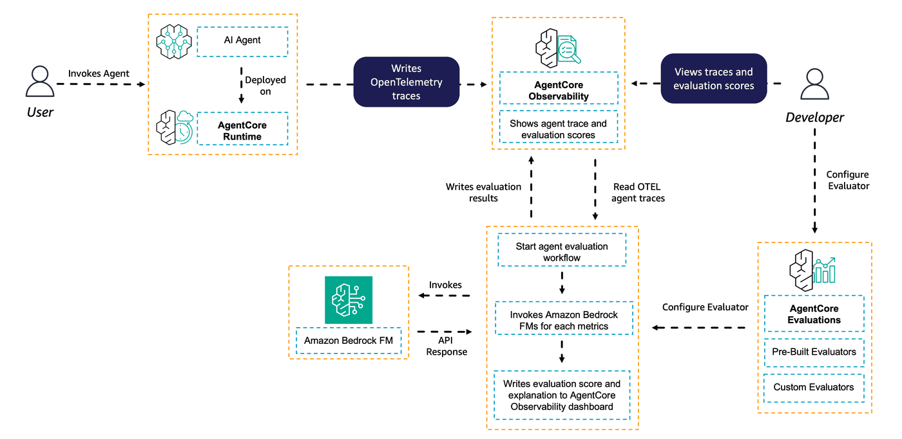
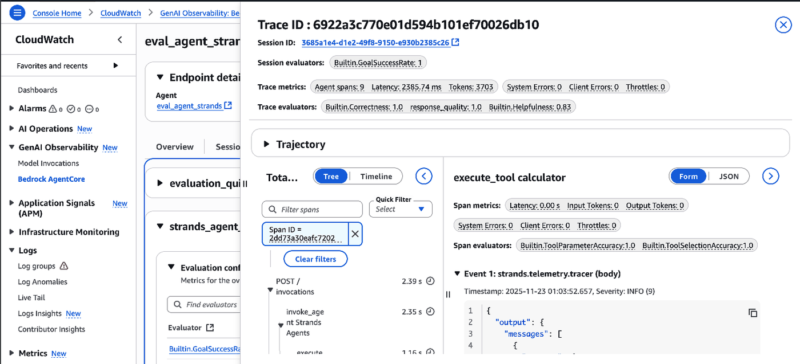

## AgentCore Evaluations - online evaluation for Strands Agent

In this tutorial you will learn about to use the online evaluation from AgentCore Evaluations applied to a Strands agent.

To execute this lab you should first have created the Strands agent using the code at [00-prereqs](../../00-prereqs) folder and created your custom evaluator using the code at [01-creating-custom-evaluators](../../01-creating-custom-evaluators)

### What You'll Learn
- How to run online evaluations to a trace using the AgentCore Starter toolkit

### Tutorial Details

| Information         | Details                                                                       |
|:--------------------|:------------------------------------------------------------------------------|
| Tutorial type       | Evaluating Strands agent with online evaluators (built-in and custom)         |
| Tutorial components | Setting automated evaluation with built-in and custom evaluators              |
| Tutorial vertical   | Cross-vertical                                                                |
| Example complexity  | Easy                                                                          |
| SDK used            | Amazon Bedrock AgentCore Starter toolkit                                      |

### Online evaluation

Online evaluation enables live-traffic quality monitoring of deployed agents. Unlike on-demand evaluation which analyzes specific selected interactions, online evaluation continuously evaluates your agent's performance in production environments based on real-time traffic.

Online evaluation consists of three main components. First, **session sampling and filtering** allows you to configure specific rules to evaluate agent interactions. You can set percentage-based sampling to evaluate a portion of all sessions (for example, 10%) or define conditional filters for more targeted evaluation. Second, you can choose from **multiple evaluation methods** including creating new custom evaluators, using existing custom evaluators, or selecting from built-in evaluators. Finally, the **monitoring and analysis** capabilities let you view aggregated scores in dashboards, track quality trends over time, investigate low-scoring sessions, and analyze complete interaction flows from input to output.

With online evaluation, you configure the system to automatically monitor specific data sources—either CloudWatch log groups containing agent traces or AgentCore Runtime endpoints. The service continuously processes incoming traces based on your sampling and filtering rules, applies your chosen evaluators in real-time, and outputs detailed results to CloudWatch for analysis. This evaluation type is particularly useful for production monitoring, catching quality regressions early, identifying patterns in user interactions, and maintaining consistent agent performance at scale.

Once you create and enable an online evaluation configuration, the service runs continuously in the background, evaluating sessions as they occur and providing ongoing visibility into your agent's quality metrics. You can pause, modify, or delete configurations at any time to adapt your evaluation strategy as your needs evolve.

### Generating traces on AgentCore Observability from an agent

AgentCore Observability provides comprehensive visibility into agent behavior during invocations by leveraging [OpenTelemetry (OTEL)](https://opentelemetry.io/) traces as the foundation for capturing and structuring detailed execution data. AgentCore relies on [AWS Distro for OpenTelemetry (ADOT)](https://aws-otel.github.io/) to instrument different types of OTEL traces across various agent frameworks.

When your agent is hosted on AgentCore Runtime (like our agent in this tutorial), the AgentCore Observability instrumentation is automatic, with minimal configuration. All you need to do is include `aws-opentelemetry-distro` in `requirements.txt` and AgentCore Runtime handles OTEL configuration automatically. When your agent is not running in AgentCore Runtime, you will need to instrument it with ADOT to have it available in AgentCore Observability. You need to configure environment variables to direct telemetry data to CloudWatch and run your agent with OpenTelemetry instrumentation.

The process looks as following:


Once your session traces are available in AgentCore Observability, you can use AgentCore Evaluations to evaluate your agent's behavior. For online evaluations, you don't need to do anything extra. Just monitor your agent's performance from the live dashboards.

### How online evaluation works with the traces

On the online evaluation, your agent is invoked and generates traces in AgentCore Observability. Those traces are mapped to sessions and their logs are made available in Amazon CloudWatch Log groups. With the online evaluation, a developer creates an online evaluation configuration for a certain agent and defines a sample rate and the evaluators to be applied for this configuration. AgentCore Evaluations will then automatically evaluate the agent in production, analyzing the produced traces according to the set sampling rate. The developer can then use the AgentCore Observability dashboards to visualize the traces and evaluation scores from the agent to continuously update the agent according to the evaluations results.




### Retrieving information from previous tutorials

For this tutorial, we will use the Strands agent deployed in AgentCore Runtime during our prerequisites tutorial. We will evaluate it with pre-built metrics and with the `response_quality` metric we created in the `01-creating-custom-metrics` tutorial. Let's retrieve our agent and evaluator informations.

```python
%store -r launch_result_strands
%store -r evaluator_id
try:
    print("Agent Id:", launch_result_strands.agent_id)
    print("Agent ARN:", launch_result_strands.agent_arn)
except NameError:
    raise Exception(
        """Missing launch results from your Strands agent. Please run 00-prereqs before executing this lab"""
    )

try:
    print("Evaluator id:", evaluator_id)
except NameError:
    raise Exception(
        """Missing custom evaluator id. Please run 01-creating-custom-evaluators before executing this lab"""
    )
```

### Initiating the AgentCore Evaluations's client

Now let's initiate the AgentCore Evaluations client from the AgentCore Starter toolkit.

```python
from bedrock_agentcore_starter_toolkit import Evaluation
import json
from boto3.session import Session
from IPython.display import Markdown, display
```

```python
boto_session = Session()
region = boto_session.region_name
print(region)
```

```python
eval_client = Evaluation(region=region)
```

### Setting online evaluation configuration

Let's now set the online evaluation configuration. In this case, we will evaluate every trace produced as we are only using our agent for demonstration purposes. In real-life applications, you want to set the sample rate accordingly to your agent's utilization.

We will create an evaluation configuration with the 5 metrics we explored in the on-demand evaluation:
* Builtin.GoalSuccessRate
* Builtin.Correctness
* Builtin.ToolParameterAccuracy
* Builtin.ToolSelectionAccuracy and
* our custom metric: response_Quality

```python
response = eval_client.create_online_config(
    agent_id=launch_result_strands.agent_id,
    config_name="strands_agent_eval2",
    sampling_rate=100,
    evaluator_list=[
        "Builtin.GoalSuccessRate",
        "Builtin.Correctness",
        "Builtin.ToolParameterAccuracy",
        "Builtin.ToolSelectionAccuracy",
        evaluator_id,
    ],
    config_description="Strands agent online evaluation test",
    auto_create_execution_role=True,
)
```

### Analyzing the evaluation configuration

Let's see the configuration ID from our online evaluation configuration:

```python
print("Online Evaluation Configuration Id:", response["onlineEvaluationConfigId"])
```

We can also see the details of the configuration created to confirm it is already enabled:

```python
eval_client.get_online_config(config_id=response["onlineEvaluationConfigId"])
```

### Invoking agent to trigger evaluation

Let's now invoke our agent with a couple new queries to trigger our online evaluation. This time we will invoke our agent with boto3 as once the endpoint is available you can invoke it from any interface.

```python
import boto3

agentcore_client = boto3.client("bedrock-agentcore", region_name=region)


def invoke_agent_runtime(agent_arn, prompt):
    boto3_response = agentcore_client.invoke_agent_runtime(
        agentRuntimeArn=agent_arn,
        qualifier="DEFAULT",
        payload=json.dumps({"prompt": prompt}),
    )
    if "text/event-stream" in boto3_response.get("contentType", ""):
        content = []
        for line in boto3_response["response"].iter_lines(chunk_size=1):
            if line:
                line = line.decode("utf-8")
                if line.startswith("data: "):
                    line = line[6:]
                    print(line)
                    content.append(line)
        display(Markdown("\n".join(content)))
    else:
        try:
            events = []
            for event in boto3_response.get("response", []):
                events.append(event)
        except Exception as e:
            events = [f"Error reading EventStream: {e}"]
        display(Markdown(json.loads(events[0].decode("utf-8"))))
    return boto3_response
```

```python
response = invoke_agent_runtime(launch_result_strands.agent_arn, "How much is 7+9+10*2?")
```

```python
response = invoke_agent_runtime(launch_result_strands.agent_arn, "Is it raining?")
```

```python
response = invoke_agent_runtime(launch_result_strands.agent_arn, "how much is 20% of 300?")
```

```python
response = invoke_agent_runtime(launch_result_strands.agent_arn, "What can you do?")
```

```python
response = invoke_agent_runtime(launch_result_strands.agent_arn, "What is the capital of NY State?")
```

### Visualizing Online Evaluation

Once you create enought interactions with your agent you can use the [AgentCore Observability console ](https://console.aws.amazon.com/cloudwatch/home#gen-ai-observability/agent-core/agents) to visualize how it is performing according to your online evaluation configuration. 

Navigate to your agent `DEFAULT` endpoint to see the current evaluations

**Important**: The evaluation results might take a while to appear in your dashboard. If you evaluation dashboard is empty, please wait a couple of minutes to check it again.

Once available you will be able to see your metrics directly in the agent's traces:


### Congratulations!

You have created your first Online Evaluation Configuration! You can now create custom metrics and evaluate your agent on-demand and online with AgentCore Evaluations!
