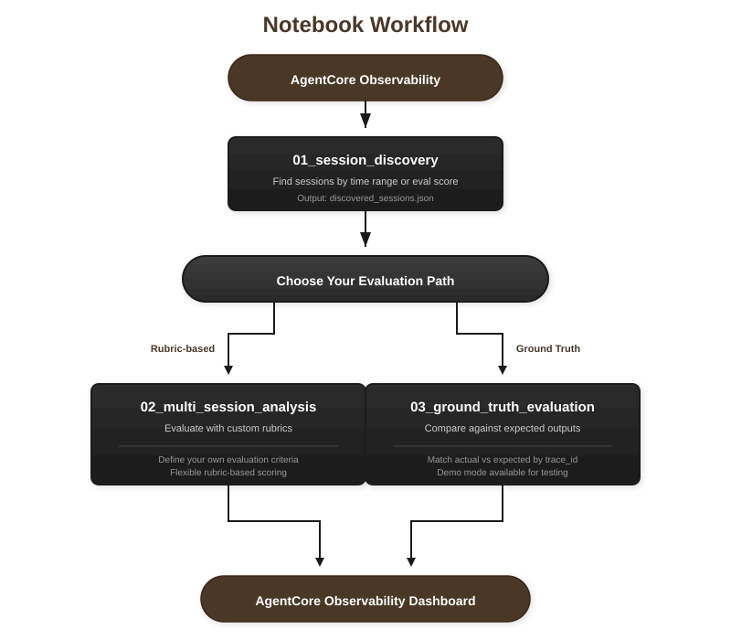

# Session Discovery

This notebook discovers agent sessions from AgentCore Observability for offline evaluation. It queries your agent's trace log group to find sessions, then saves them to a JSON file for processing in the analysis notebook.

**Two Discovery Methods:**

1. **Time-based**: Find all sessions within a time window. Use this for bulk evaluation of recent agent activity.

2. **Score-based**: Find sessions by existing evaluation score from AgentCore. Use this to re-evaluate low-scoring sessions with updated rubrics.

**Output:** `discovered_sessions.json` containing session IDs and metadata for the analysis notebook.

## Where This Fits

This is **Notebook 1** in the evaluation workflow. After discovering sessions here, you'll choose one of two evaluation paths.



## Setup

Import required modules and load configuration from `config.py`. All configuration values can be overridden via environment variables before running this cell.

```python
import logging
import sys
from datetime import datetime, timedelta, timezone

sys.path.insert(0, ".")

from config import (
    AWS_REGION,
    SOURCE_LOG_GROUP,
    EVAL_RESULTS_LOG_GROUP_FULL,
    LOOKBACK_HOURS,
    MAX_SESSIONS,
    MIN_SCORE,
    MAX_SCORE,
    DISCOVERED_SESSIONS_PATH,
    EVALUATOR_NAME,
)

from utils import (
    ObservabilityClient,
    SessionDiscoveryResult,
    # SessionInfo,
)

logging.basicConfig(
    level=logging.INFO,
    format="%(asctime)s - %(name)s - %(levelname)s - %(message)s",
)
logger = logging.getLogger(__name__)
```

## Configuration

The `EVALUATOR_NAME` used for score-based discovery is loaded from `config.py`. This must match the evaluator name in your existing evaluation results. Modify `config.py` to change settings like `LOOKBACK_HOURS`, `MAX_SESSIONS`, or score thresholds.

```python
# EVALUATOR_NAME is loaded from config.py
print(f"Using evaluator: {EVALUATOR_NAME}")
```

## Initialize Client

Create the `ObservabilityClient` which handles CloudWatch Logs Insights queries. The time range is calculated from `LOOKBACK_HOURS` in config.

```python
obs_client = ObservabilityClient(
    region_name=AWS_REGION,
    log_group=SOURCE_LOG_GROUP,
)

end_time = datetime.now(timezone.utc)
start_time = end_time - timedelta(hours=LOOKBACK_HOURS)
start_time_ms = int(start_time.timestamp() * 1000)
end_time_ms = int(end_time.timestamp() * 1000)
```

## Time-Based Discovery

Query the AgentCore Observability log group for all unique session IDs within the time window. Returns sessions with span counts and timestamps, sorted by most recent activity. Use this method when you want to evaluate all recent agent interactions.

```python
time_based_sessions = obs_client.discover_sessions(
    start_time_ms=start_time_ms,
    end_time_ms=end_time_ms,
    limit=MAX_SESSIONS,
)

print(f"Discovered {len(time_based_sessions)} sessions")
```

## Score-Based Discovery

Query the AgentCore evaluation results log group to find sessions by their existing evaluation scores. Filters sessions where the specified evaluator scored between `MIN_SCORE` and `MAX_SCORE`. Use this method to find poorly-performing sessions for re-evaluation with updated rubrics.

```python
score_based_sessions = obs_client.discover_sessions_by_score(
    evaluation_log_group=EVAL_RESULTS_LOG_GROUP_FULL,
    evaluator_name=EVALUATOR_NAME,
    start_time_ms=start_time_ms,
    end_time_ms=end_time_ms,
    min_score=MIN_SCORE,
    max_score=MAX_SCORE,
    limit=MAX_SESSIONS,
)

print(f"Discovered {len(score_based_sessions)} sessions by score")
```

## Select Discovery Method

Choose which set of discovered sessions to use. Set `USE_TIME_BASED = True` for time-based results, or `False` for score-based results. The selected sessions are packaged into a `SessionDiscoveryResult` with metadata about how they were discovered.

```python
# Set to False to use score-based discovery instead
USE_TIME_BASED = True

if USE_TIME_BASED:
    selected_sessions = time_based_sessions
    discovery_method = "time_based"
    log_group = SOURCE_LOG_GROUP
    filter_criteria = None
else:
    selected_sessions = score_based_sessions
    discovery_method = "score_based"
    log_group = EVAL_RESULTS_LOG_GROUP_FULL
    filter_criteria = {
        "evaluator_name": EVALUATOR_NAME,
        "min_score": MIN_SCORE,
        "max_score": MAX_SCORE,
    }

discovery_result = SessionDiscoveryResult(
    sessions=selected_sessions,
    discovery_time=datetime.now(timezone.utc),
    log_group=log_group,
    time_range_start=start_time,
    time_range_end=end_time,
    discovery_method=discovery_method,
    filter_criteria=filter_criteria,
)

print(f"Selected {len(selected_sessions)} sessions via {discovery_method}")
```

## Preview Sessions

View the first 10 discovered sessions. For time-based discovery, this shows session ID and span count. For score-based discovery, this shows session ID and average evaluation score.

```python
for i, session in enumerate(selected_sessions[:10]):
    meta = session.metadata or {}
    if discovery_method == "time_based":
        print(f"{i + 1}. {session.session_id} - {session.span_count} spans")
    else:
        print(f"{i + 1}. {session.session_id} - avg_score: {meta.get('avg_score', 0):.2f}")
```

## Save Results

Save the discovery result to JSON. This file will be loaded by the analysis notebook to process each session. The output path is configured in `config.py` as `DISCOVERED_SESSIONS_PATH`.

```python
discovery_result.save_to_json(DISCOVERED_SESSIONS_PATH)
print(f"Saved {len(selected_sessions)} sessions to {DISCOVERED_SESSIONS_PATH}")
```

## Verify Output

Confirm the JSON file was saved correctly. After verification, proceed to the multi-session analysis notebook to evaluate these sessions.

```python
import json

with open(DISCOVERED_SESSIONS_PATH, "r") as f:
    saved_data = json.load(f)

print(f"Sessions: {len(saved_data['sessions'])}")
print(f"Method: {saved_data['discovery_method']}")
print(f"Time range: {saved_data['time_range_start']} to {saved_data['time_range_end']}")
```
