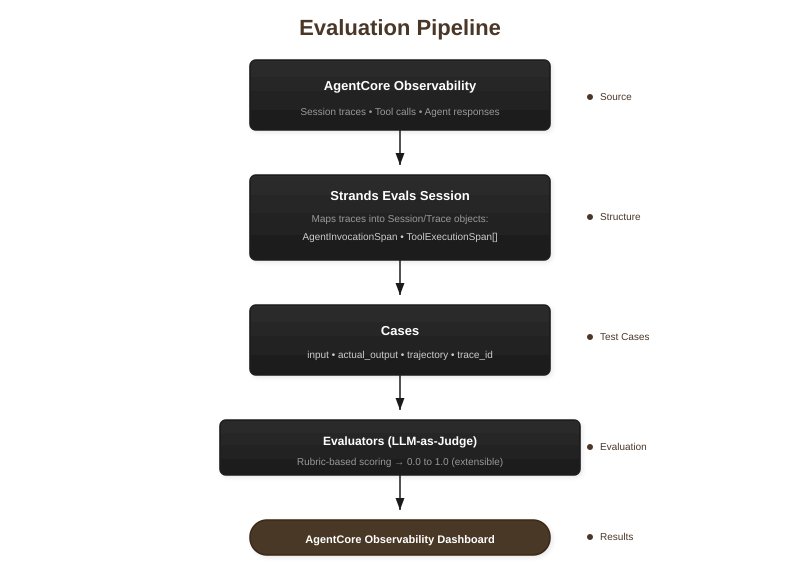

# Multi-Session Evaluation

This notebook evaluates agent sessions using Strands Evals, an extensible LLM-based evaluation framework that uses LLMs as judges. For each session, it fetches traces from AgentCore Observability, runs evaluators, and logs results back with original trace IDs for dashboard correlation.

**This notebook demonstrates two evaluators:**
- **OutputEvaluator**: Scores response quality (relevance, accuracy, completeness)
- **TrajectoryEvaluator**: Scores tool usage (selection, efficiency, sequence)

Strands Evals supports custom evaluators for virtually any evaluation type. The framework's power lies in the rubric system—define your criteria, and the LLM applies them consistently.

**Workflow:**
1. Load sessions from discovery notebook (or provide custom session IDs)
2. For each session: fetch traces, create evaluation cases, run evaluators
3. Log results to AgentCore in EMF format
4. Generate summary statistics

**Prerequisite:** Run the session discovery notebook first, or prepare a list of session IDs.

## Where This Fits

This is **Notebook 2 (Option A)** - evaluate sessions using custom rubrics you define.


## How Data Flows

The evaluation pipeline transforms AgentCore Observability traces into scored results:



## Setup

Import required modules including Strands Evals evaluators and utility classes for AgentCore Observability interaction. Configuration is loaded from `config.py`.

```python
import logging
import sys
from datetime import datetime, timedelta, timezone
from typing import List

sys.path.insert(0, ".")

from config import (
    AWS_REGION,
    SOURCE_LOG_GROUP,
    EVAL_RESULTS_LOG_GROUP,
    LOOKBACK_HOURS,
    MAX_CASES_PER_SESSION,
    DISCOVERED_SESSIONS_PATH,
    RESULTS_JSON_PATH,
    EVALUATION_CONFIG_ID,
    setup_cloudwatch_environment,
)

from utils import (
    CloudWatchSessionMapper,
    ObservabilityClient,
    SessionDiscoveryResult,
    SessionInfo,
    send_evaluation_to_cloudwatch,
)

from strands_evals import Case, Experiment
from strands_evals.evaluators import OutputEvaluator, TrajectoryEvaluator
from strands_evals.types.trace import AgentInvocationSpan, ToolExecutionSpan

logging.basicConfig(
    level=logging.INFO,
    format="%(asctime)s - %(name)s - %(levelname)s - %(message)s",
)
logger = logging.getLogger(__name__)
```

## Configuration

Define evaluator names for CloudWatch metrics. These names appear in the AgentCore Observability dashboard and should follow the `Custom.YourEvaluatorName` convention. The `EVALUATION_CONFIG_ID` is loaded from `config.py`.

```python
# Custom evaluator names for CloudWatch metrics (customize for your use case)
OUTPUT_EVALUATOR_NAME = "Custom.OutputEvaluator"
TRAJECTORY_EVALUATOR_NAME = "Custom.TrajectoryEvaluator"
```

## CloudWatch Environment

Configure environment variables required for logging evaluation results. Uses `SERVICE_NAME` from `config.py` for OTEL resource attributes.

```python
setup_cloudwatch_environment()
```

## Load Sessions

Load sessions from the discovery notebook JSON output. Alternatively, set `USE_JSON_FILE = False` and provide custom session IDs directly for targeted re-evaluation of specific sessions.

```python
# Set to False to provide custom session IDs instead
USE_JSON_FILE = True

if USE_JSON_FILE:
    discovery_result = SessionDiscoveryResult.load_from_json(DISCOVERED_SESSIONS_PATH)
    sessions_to_process = discovery_result.sessions
else:
    # Provide custom session IDs here
    session_ids = [
        "your-session-id-here",
    ]
    sessions_to_process = [
        SessionInfo(
            session_id=sid,
            span_count=0,
            first_seen=datetime.now(timezone.utc),
            last_seen=datetime.now(timezone.utc),
            discovery_method="user_provided",
        )
        for sid in session_ids
    ]

print(f"Loaded {len(sessions_to_process)} sessions")
```

## Evaluator Rubrics

Rubrics define your evaluation criteria. The evaluator sends the rubric along with the agent's output to an LLM, which acts as a judge and returns a score (0.0-1.0) with an explanation.

**Writing effective rubrics:**
- Be specific about what constitutes good vs poor quality
- Include scoring anchors (what does 1.0 vs 0.5 vs 0.0 mean?)
- Focus on measurable criteria relevant to your agent's domain

Customize these rubrics below. The default rubrics evaluate general response quality and tool usage patterns.

```python
output_rubric = """
Evaluate the agent's response based on:
1. Relevance: Does the response directly address the user's question?
2. Accuracy: Is the information factually correct?
3. Completeness: Does the response provide sufficient detail?

Score 0.0-1.0: 1.0=excellent, 0.5=adequate, 0.0=poor
"""

trajectory_rubric = """
Evaluate the agent's tool usage based on:
1. Tool Selection: Did the agent choose appropriate tools?
2. Efficiency: Were tools used without unnecessary calls?
3. Logical Sequence: Were tools used in a logical order?

Score 0.0-1.0: 1.0=optimal, 0.5=acceptable, 0.0=poor
"""
```

## Helper Functions

These functions bridge AgentCore Observability traces and Strands Evals:

- `task_fn(case)`: Returns the agent's actual response for OutputEvaluator to score against the rubric.

- `trajectory_task_fn(case)`: Returns both the response and tool sequence for TrajectoryEvaluator to assess tool usage patterns.

- `create_cases_from_session(session)`: Converts a Strands Eval Session into evaluation Cases. Extracts user prompts from AgentInvocationSpan, tool names from ToolExecutionSpan objects, and preserves the original trace_id for CloudWatch correlation.

- `log_case_result_to_cloudwatch(case, ...)`: Sends evaluation results to AgentCore Observability using the original trace_id, allowing you to see scores alongside the original traces in the dashboard.

```python
def task_fn(case: Case) -> str:
    """Return actual output from trace metadata."""
    return case.metadata.get("actual_output", "")


def trajectory_task_fn(case: Case):
    """Return output and trajectory from trace metadata."""
    return {
        "output": case.metadata.get("actual_output", ""),
        "trajectory": case.metadata.get("trajectory_for_eval", []),
    }


def log_case_result_to_cloudwatch(
    case: Case, evaluator_name: str, score: float, explanation: str, label: str = None
) -> bool:
    """Log evaluation result to CloudWatch with original trace ID."""
    trace_id = case.metadata.get("trace_id", "")
    if not trace_id:
        return False
    return send_evaluation_to_cloudwatch(
        trace_id=trace_id,
        session_id=case.session_id,
        evaluator_name=evaluator_name,
        score=score,
        explanation=explanation,
        label=label,
        config_id=EVALUATION_CONFIG_ID,
    )


def create_cases_from_session(session, session_id: str, max_cases: int = None) -> List[Case]:
    """Create evaluation cases from a Strands Eval Session."""
    cases = []
    for i, trace in enumerate(session.traces):
        if max_cases and len(cases) >= max_cases:
            break
        agent_span = None
        tool_names = []
        for span in trace.spans:
            if isinstance(span, AgentInvocationSpan):
                agent_span = span
            elif isinstance(span, ToolExecutionSpan):
                tool_names.append(span.tool_call.name)
        if agent_span:
            case = Case(
                name=f"trace_{i + 1}_{trace.trace_id[:8]}",
                input=agent_span.user_prompt or "",
                expected_output="",
                session_id=session_id,
                metadata={
                    "actual_output": agent_span.agent_response or "",
                    "actual_trajectory": tool_names,
                    "trace_id": trace.trace_id,
                    "tool_count": len(tool_names),
                },
            )
            cases.append(case)
    return cases
```

## Initialize Client

Create the `ObservabilityClient` to fetch traces and the `CloudWatchSessionMapper` to convert them.

The mapper transforms raw AgentCore Observability spans into structured Strands Eval objects:
- Groups spans by trace_id to reconstruct each interaction
- Extracts tool calls and matches them with their results
- Identifies user prompts (first message) and agent responses (final output)
- Produces AgentInvocationSpan (full interaction) and ToolExecutionSpan (each tool use)

```python
obs_client = ObservabilityClient(
    region_name=AWS_REGION,
    log_group=SOURCE_LOG_GROUP,
)
mapper = CloudWatchSessionMapper()

end_time = datetime.now(timezone.utc)
start_time = end_time - timedelta(hours=LOOKBACK_HOURS)
start_time_ms = int(start_time.timestamp() * 1000)
end_time_ms = int(end_time.timestamp() * 1000)
```

## Process Sessions

The main evaluation loop. For each session:
1. Fetch spans from AgentCore Observability
2. Convert spans to Strands Eval Session format using the mapper
3. Create evaluation Cases from each trace in the session
4. Run OutputEvaluator on all cases
5. Run TrajectoryEvaluator on cases that used tools
6. Log all results to AgentCore Observability with original trace IDs for dashboard correlation

Progress is printed for each session. Errors are caught and logged without stopping the loop.

```python
all_session_results = []
total_cases_evaluated = 0
total_logs_sent = 0
all_tools_used = set()

for session_idx, session_info in enumerate(sessions_to_process):
    session_id = session_info.session_id
    print(f"[{session_idx + 1}/{len(sessions_to_process)}] {session_id}")

    try:
        trace_data = obs_client.get_session_data(
            session_id=session_id,
            start_time_ms=start_time_ms,
            end_time_ms=end_time_ms,
            include_runtime_logs=False,
        )

        if not trace_data.spans:
            all_session_results.append({"session_id": session_id, "status": "skipped", "reason": "no_spans"})
            continue

        session = trace_data.to_session(mapper)
        cases = create_cases_from_session(session, session_id, MAX_CASES_PER_SESSION)

        if not cases:
            all_session_results.append({"session_id": session_id, "status": "skipped", "reason": "no_cases"})
            continue

        for case in cases:
            for tool in case.metadata.get("actual_trajectory", []):
                all_tools_used.add(tool)

        # Run Output Evaluator
        output_experiment = Experiment(cases=cases, evaluators=[OutputEvaluator(rubric=output_rubric)])
        output_results = output_experiment.run_evaluations(task_fn)
        output_report = output_results[0]

        output_logged = 0
        for i, case in enumerate(cases):
            if log_case_result_to_cloudwatch(
                case,
                OUTPUT_EVALUATOR_NAME,
                output_report.scores[i],
                output_report.reasons[i] if i < len(output_report.reasons) else "",
            ):
                output_logged += 1

        # Run Trajectory Evaluator
        trajectory_cases = [c for c in cases if c.metadata.get("actual_trajectory")]
        trajectory_score = None
        trajectory_logged = 0

        if trajectory_cases:
            traj_eval_cases = [
                Case(
                    name=c.name,
                    input=c.input,
                    expected_output=c.expected_output,
                    session_id=c.session_id,
                    metadata={
                        **c.metadata,
                        "trajectory_for_eval": c.metadata.get("actual_trajectory", []),
                    },
                )
                for c in trajectory_cases
            ]
            trajectory_experiment = Experiment(
                cases=traj_eval_cases,
                evaluators=[
                    TrajectoryEvaluator(
                        rubric=trajectory_rubric,
                        trajectory_description={"available_tools": list(all_tools_used)},
                    )
                ],
            )
            trajectory_results = trajectory_experiment.run_evaluations(trajectory_task_fn)
            trajectory_report = trajectory_results[0]
            trajectory_score = trajectory_report.overall_score

            for i, case in enumerate(traj_eval_cases):
                if log_case_result_to_cloudwatch(
                    case,
                    TRAJECTORY_EVALUATOR_NAME,
                    trajectory_report.scores[i],
                    trajectory_report.reasons[i] if i < len(trajectory_report.reasons) else "",
                ):
                    trajectory_logged += 1

        all_session_results.append(
            {
                "session_id": session_id,
                "status": "completed",
                "case_count": len(cases),
                "output_score": output_report.overall_score,
                "trajectory_score": trajectory_score,
                "logs_sent": output_logged + trajectory_logged,
            }
        )
        total_cases_evaluated += len(cases)
        total_logs_sent += output_logged + trajectory_logged

    except Exception as e:
        all_session_results.append({"session_id": session_id, "status": "error", "error": str(e)})

print(
    f"\nCompleted: {len([r for r in all_session_results if r['status'] == 'completed'])} sessions, {total_cases_evaluated} cases, {total_logs_sent} logs sent"
)
```

## Summary

Aggregate statistics across all evaluated sessions including completion rate, total cases evaluated, and average scores for both output and trajectory evaluators.

```python
completed = [r for r in all_session_results if r.get("status") == "completed"]
output_scores = [r["output_score"] for r in completed if r.get("output_score") is not None]
trajectory_scores = [r["trajectory_score"] for r in completed if r.get("trajectory_score") is not None]

print(f"Sessions: {len(completed)}/{len(all_session_results)} completed")
print(f"Cases evaluated: {total_cases_evaluated}")
print(f"CloudWatch logs sent: {total_logs_sent}")

if output_scores:
    print(
        f"Output score: avg={sum(output_scores) / len(output_scores):.2f}, min={min(output_scores):.2f}, max={max(output_scores):.2f}"
    )
if trajectory_scores:
    print(
        f"Trajectory score: avg={sum(trajectory_scores) / len(trajectory_scores):.2f}, min={min(trajectory_scores):.2f}, max={max(trajectory_scores):.2f}"
    )
```

## Per-Session Results

Individual results for each session showing output and trajectory scores. Sessions marked "skipped" had no spans or valid cases. Sessions marked "error" encountered exceptions during processing.

```python
for i, r in enumerate(all_session_results):
    status = r.get("status", "unknown")
    if status == "completed":
        print(
            f"{i + 1}. {r['session_id'][:20]}... output={r.get('output_score', 0):.2f} traj={r.get('trajectory_score') or '-'}"
        )
    else:
        print(f"{i + 1}. {r['session_id'][:20]}... {status}")
```

## Export Results

Save evaluation results to JSON for further analysis or reporting. The export includes configuration, summary statistics, and per-session results.

```python
import json

export_data = {
    "evaluation_time": datetime.now(timezone.utc).isoformat(),
    "config": {
        "source_log_group": SOURCE_LOG_GROUP,
        "eval_results_log_group": EVAL_RESULTS_LOG_GROUP,
        "output_evaluator": OUTPUT_EVALUATOR_NAME,
        "trajectory_evaluator": TRAJECTORY_EVALUATOR_NAME,
    },
    "summary": {
        "total_sessions": len(all_session_results),
        "completed_sessions": len(completed),
        "total_cases": total_cases_evaluated,
        "avg_output_score": sum(output_scores) / len(output_scores) if output_scores else None,
        "avg_trajectory_score": sum(trajectory_scores) / len(trajectory_scores) if trajectory_scores else None,
    },
    "session_results": all_session_results,
}

with open(RESULTS_JSON_PATH, "w") as f:
    json.dump(export_data, f, indent=2)

print(f"Exported to {RESULTS_JSON_PATH}")
```
