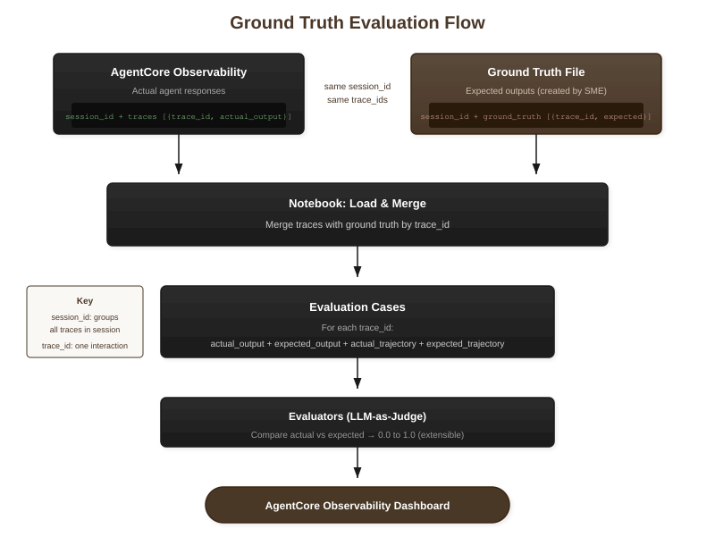

# Ground Truth Evaluation

This notebook evaluates agent responses against ground truth (expected outputs) using Strands Evals, an extensible LLM-based evaluation framework. Unlike rubric-only evaluation, ground truth evaluation compares actual outputs to predefined correct answers.

**Use Cases:**
- Regression testing: Ensure agent changes don't break known-good responses
- Quality benchmarking: Measure how well agents match expected behavior
- Training data validation: Verify agent outputs against curated examples

**Two Data Sources (Separate Files):**
1. **Traces File** (`demo_traces.json`): Contains actual agent responses from AgentCore Observability
2. **Ground Truth File** (`demo_ground_truth.json`): Contains YOUR expected outputs for each trace

The notebook merges these files by `trace_id` to compare actual vs expected.

**Two Modes:**
1. **Demo Mode**: Load sample data from JSON files (no AWS access needed)
2. **Live Mode**: Fetch real traces from AgentCore Observability, provide your own ground truth file

**This notebook demonstrates two evaluators:**
- Output evaluation: Compares actual response against expected ground truth
- Trajectory evaluation: Compares actual tool usage against expected tools

Strands Evals supports custom evaluators for virtually any evaluation type—you can extend this pattern to evaluate any criteria that can be expressed as scoring criteria.

**Workflow:**
1. Load traces (demo files or live from AgentCore Observability)
2. Load ground truth expectations (your expected outputs/trajectories)
3. Merge by trace_id
4. Run evaluators comparing actual vs expected
5. Log results to AgentCore Observability (optional)
6. Analyze results and identify gaps

## Where This Fits

This is **Notebook 3 (Option B)** - evaluate sessions by comparing against expected ground truth outputs.


## How Ground Truth Evaluation Works

An SME (Subject Matter Expert) creates a ground truth file with expected outputs. This is merged with actual traces by `trace_id`:



## Setup

Import modules and configure logging.

```python
import json
import logging
import sys
from datetime import datetime, timedelta, timezone
from typing import List, Dict

sys.path.insert(0, ".")

from strands_evals import Case, Experiment
from strands_evals.evaluators import OutputEvaluator, TrajectoryEvaluator

logging.basicConfig(
    level=logging.INFO,
    format="%(asctime)s - %(name)s - %(levelname)s - %(message)s",
)
logger = logging.getLogger(__name__)
```

## Configuration

Choose between Demo Mode (uses sample files) or Live Mode (fetches from AgentCore Observability).

**Demo Mode** (`USE_DEMO_MODE = True`):
- Loads traces from `DEMO_TRACES_PATH`
- Loads ground truth from `DEMO_GROUND_TRUTH_PATH`
- No AWS credentials required

**Live Mode** (`USE_DEMO_MODE = False`):
- Fetches traces from AgentCore Observability using `SESSION_ID`
- Loads ground truth from `GROUND_TRUTH_PATH` (you must create this file)
- Requires AWS credentials and `config.py` settings

**CloudWatch Logging** (`LOG_TO_CLOUDWATCH = True`):
- Sends evaluation results to AgentCore Observability dashboard
- Requires `EVALUATION_CONFIG_ID` and evaluator names

```python
# =============================================================================
# Mode Selection
# =============================================================================
USE_DEMO_MODE = True

# =============================================================================
# Demo Mode Paths
# =============================================================================
DEMO_TRACES_PATH = "demo_traces.json"  # Actual agent responses
DEMO_GROUND_TRUTH_PATH = "demo_ground_truth.json"  # Your expected outputs

# =============================================================================
# Live Mode Settings
# =============================================================================
SESSION_ID = "your-session-id-here"  # Session to evaluate
GROUND_TRUTH_PATH = "my_ground_truth.json"  # Your ground truth file

# =============================================================================
# CloudWatch Logging
# =============================================================================
LOG_TO_CLOUDWATCH = True
OUTPUT_EVALUATOR_NAME = "Custom.GroundTruthOutput"
TRAJECTORY_EVALUATOR_NAME = "Custom.GroundTruthTrajectory"
```

## File Formats

Ground truth evaluation uses **two separate files** that share the same `session_id`:

**Key concepts:**
- `session_id`: Groups all traces from a single user session
- `trace_id`: Identifies each individual interaction within the session

### 1. Traces File (actual agent responses)
Contains what the agent actually did - fetched from CloudWatch or saved locally:
```json
{
  "session_id": "5B467129-E54A-4F70-908D-CB31818004B5",
  "traces": [
    {
      "trace_id": "693cb6c4e931",
      "user_prompt": "What is the best route for a NZ road trip?",
      "actual_output": "Based on the search results, here are the best routes...",
      "actual_trajectory": ["web_search"]
    },
    {
      "trace_id": "693cb6fa87aa",
      "user_prompt": "Should I visit North or South Island?",
      "actual_output": "Here's how the islands compare...",
      "actual_trajectory": ["web_search"]
    }
  ]
}
```

### 2. Ground Truth File (your expected outputs)
SME reviews the traces and writes expected outputs for each `trace_id`:
```json
{
  "session_id": "5B467129-E54A-4F70-908D-CB31818004B5",
  "ground_truth": [
    {
      "trace_id": "693cb6c4e931",
      "user_prompt_reference": "What is the best route for a NZ road trip?",
      "expected_output": "Response should mention Milford Road, Southern Scenic Route...",
      "expected_trajectory": ["web_search"]
    },
    {
      "trace_id": "693cb6fa87aa",
      "user_prompt_reference": "Should I visit North or South Island?",
      "expected_output": "Response should compare both islands with key features...",
      "expected_trajectory": ["web_search"]
    }
  ]
}
```

**Note:** `user_prompt_reference` is optional - it helps SMEs remember which trace they're writing expectations for.

## Load Traces and Ground Truth

Load trace data from demo files or CloudWatch, then load ground truth expectations and merge by `trace_id`.

```python
if USE_DEMO_MODE:
    # Load traces (actual agent responses)
    with open(DEMO_TRACES_PATH, "r") as f:
        traces_data = json.load(f)

    SESSION_ID = traces_data["session_id"]
    traces = []
    for i, t in enumerate(traces_data["traces"]):
        traces.append(
            {
                "trace_index": i,
                "trace_id": t.get("trace_id", f"demo-trace-{i:03d}"),
                "user_prompt": t["user_prompt"],
                "actual_output": t.get("actual_output", ""),
                "actual_trajectory": t.get("actual_trajectory", []),
            }
        )

    # Load ground truth (expected outputs) - separate file!
    with open(DEMO_GROUND_TRUTH_PATH, "r") as f:
        gt_data = json.load(f)

    # Build ground truth lookup by trace_id
    gt_by_trace_id = {
        gt["trace_id"]: {
            "expected_output": gt["expected_output"],
            "expected_trajectory": gt.get("expected_trajectory", []),
        }
        for gt in gt_data["ground_truth"]
    }

    # Merge: match traces to ground truth by trace_id
    ground_truth = {}
    matched_count = 0
    for trace in traces:
        trace_id = trace["trace_id"]
        if trace_id in gt_by_trace_id:
            ground_truth[trace["trace_index"]] = gt_by_trace_id[trace_id]
            matched_count += 1

    print("Demo Mode:")
    print(f"  Traces loaded: {len(traces)} from {DEMO_TRACES_PATH}")
    print(f"  Ground truth loaded: {len(gt_data['ground_truth'])} entries from {DEMO_GROUND_TRUTH_PATH}")
    print(f"  Matched by trace_id: {matched_count}")
    print(f"  Session ID: {SESSION_ID}")
    if gt_data.get("description"):
        print(f"  Description: {gt_data['description']}")

else:
    from config import AWS_REGION, SOURCE_LOG_GROUP, LOOKBACK_HOURS
    from utils import CloudWatchSessionMapper, ObservabilityClient
    from strands_evals.types.trace import AgentInvocationSpan, ToolExecutionSpan

    # Fetch traces from CloudWatch
    obs_client = ObservabilityClient(region_name=AWS_REGION, log_group=SOURCE_LOG_GROUP)
    mapper = CloudWatchSessionMapper()

    end_time = datetime.now(timezone.utc)
    start_time = end_time - timedelta(hours=LOOKBACK_HOURS)

    trace_data = obs_client.get_session_data(
        session_id=SESSION_ID,
        start_time_ms=int(start_time.timestamp() * 1000),
        end_time_ms=int(end_time.timestamp() * 1000),
        include_runtime_logs=False,
    )

    if not trace_data.spans:
        raise ValueError(f"No spans found for session {SESSION_ID}")

    session = trace_data.to_session(mapper)
    traces = []
    for i, trace in enumerate(session.traces):
        agent_span = None
        tool_calls = []
        for span in trace.spans:
            if isinstance(span, AgentInvocationSpan):
                agent_span = span
            elif isinstance(span, ToolExecutionSpan):
                tool_calls.append(span.tool_call.name)
        if agent_span:
            traces.append(
                {
                    "trace_index": i,
                    "trace_id": trace.trace_id,
                    "user_prompt": agent_span.user_prompt or "",
                    "actual_output": agent_span.agent_response or "",
                    "actual_trajectory": tool_calls,
                }
            )

    # Load ground truth from separate file
    try:
        with open(GROUND_TRUTH_PATH, "r") as f:
            gt_data = json.load(f)
        gt_by_trace_id = {
            gt["trace_id"]: {
                "expected_output": gt["expected_output"],
                "expected_trajectory": gt.get("expected_trajectory", []),
            }
            for gt in gt_data["ground_truth"]
        }
        ground_truth = {}
        for trace in traces:
            trace_id = trace["trace_id"]
            if trace_id in gt_by_trace_id:
                ground_truth[trace["trace_index"]] = gt_by_trace_id[trace_id]
        print(f"Ground truth loaded: {len(ground_truth)} matches from {GROUND_TRUTH_PATH}")
    except FileNotFoundError:
        ground_truth = {}
        print(f"Ground truth file not found: {GROUND_TRUTH_PATH}")
        print("Create a ground truth file or define manually in the next section")

    print(f"Live Mode: Loaded {len(traces)} traces from CloudWatch")
```

## Review Traces

Display each trace's details. Review these to understand what ground truth should look like for each interaction.

```python
for trace in traces:
    print(f"\n{'=' * 70}")
    print(f"TRACE {trace['trace_index'] + 1} (ID: {trace['trace_id']})")
    print(f"{'=' * 70}")

    prompt = trace["user_prompt"]
    output = trace["actual_output"]

    print(f"\nUSER PROMPT:\n{prompt[:500]}..." if len(prompt) > 500 else f"\nUSER PROMPT:\n{prompt}")
    print(f"\nACTUAL OUTPUT:\n{output[:500]}..." if len(output) > 500 else f"\nACTUAL OUTPUT:\n{output}")
    print(f"\nACTUAL TRAJECTORY: {trace['actual_trajectory']}")

    if trace["trace_index"] in ground_truth:
        gt = ground_truth[trace["trace_index"]]
        print(f"\nEXPECTED OUTPUT: {gt['expected_output']}")
        print(f"EXPECTED TRAJECTORY: {gt['expected_trajectory']}")
```

## Define Ground Truth (Live Mode Only)

If using Live Mode, define the expected output and expected trajectory for each trace here.

**In Demo Mode, ground truth is pre-loaded from the JSON file.**

```python
if not ground_truth:
    print("Ground truth not defined. Generating template...\n")
    print("Copy, edit, and paste the following:\n")
    print("ground_truth = {")
    for trace in traces:
        prompt_preview = trace["user_prompt"][:50].replace('"', "'")
        print(f"    {trace['trace_index']}: {{")
        print(f'        "expected_output": "TODO: {prompt_preview}...",')
        print(f'        "expected_trajectory": {trace["actual_trajectory"]},')
        print("    },")
    print("}")
else:
    print(f"Ground truth already defined for {len(ground_truth)} traces")
```

## Evaluator Rubrics

Both evaluators use rubrics to compare actual vs expected values:

- **OutputEvaluator**: Compares actual response against expected output using semantic similarity
- **TrajectoryEvaluator**: Compares actual tool trajectory against expected trajectory

```python
ground_truth_output_rubric = """
Compare the agent's actual output against the expected ground truth output.

Evaluation criteria:
1. Semantic Match (0-0.5): Does the actual output convey the same meaning as expected?
   - 0.5: Full semantic alignment - same information and intent
   - 0.3: Partial alignment - captures main points but misses details
   - 0.0: No alignment - different information or wrong answer

2. Completeness (0-0.3): Does the actual output include all key points from expected?
   - 0.3: All key information present
   - 0.15: Most key information present
   - 0.0: Missing critical information

3. Correctness (0-0.2): Is the actual output factually consistent with expected?
   - 0.2: No factual contradictions
   - 0.1: Minor inconsistencies
   - 0.0: Major contradictions or errors

Final score = sum of all criteria (0.0 to 1.0)
"""

trajectory_rubric = """
Compare the agent's actual tool trajectory against the expected trajectory.

Evaluation criteria:
1. Tool Match (0-0.5): Did the agent use the expected tools?
   - 0.5: All expected tools were used
   - 0.25: Some expected tools were used
   - 0.0: None of the expected tools were used

2. No Extra Tools (0-0.3): Did the agent avoid unnecessary tools?
   - 0.3: No extra tools beyond expected
   - 0.15: One extra tool
   - 0.0: Multiple unnecessary tools

3. Order (0-0.2): Were tools used in the expected sequence?
   - 0.2: Correct order
   - 0.1: Minor order differences
   - 0.0: Completely different order

Final score = sum of all criteria (0.0 to 1.0)
"""
```

## Create Evaluation Cases

Create Cases that include both actual outputs and expected ground truth for comparison.

```python
def create_ground_truth_cases(traces: List[Dict], ground_truth: Dict[int, Dict], session_id: str) -> List[Case]:
    """Create evaluation cases with ground truth for comparison."""
    cases = []

    for trace in traces:
        idx = trace["trace_index"]
        gt = ground_truth.get(idx, {})

        if not gt:
            print(f"Warning: No ground truth for trace {idx}, skipping")
            continue

        case = Case(
            name=f"trace_{idx}_{trace['trace_id'][:8]}",
            input=trace["user_prompt"],
            expected_output=gt.get("expected_output", ""),
            session_id=session_id,
            metadata={
                "actual_output": trace["actual_output"],
                "actual_trajectory": trace["actual_trajectory"],
                "expected_trajectory": gt.get("expected_trajectory", []),
                "trace_id": trace["trace_id"],
            },
        )
        cases.append(case)

    return cases


cases = create_ground_truth_cases(traces, ground_truth, SESSION_ID)
print(f"Created {len(cases)} evaluation cases")
```

## Task Functions

These functions extract actual and expected values for the evaluator to compare.

```python
def ground_truth_task_fn(case: Case) -> str:
    """Return actual and expected output for comparison."""
    actual = case.metadata.get("actual_output", "")
    expected = case.expected_output or ""
    return f"ACTUAL OUTPUT:\n{actual}\n\nEXPECTED OUTPUT (Ground Truth):\n{expected}"


def trajectory_task_fn(case: Case):
    """Return output and trajectory for TrajectoryEvaluator.

    TrajectoryEvaluator expects a dictionary with 'output' and 'trajectory' keys.
    """
    actual_output = case.metadata.get("actual_output", "")
    actual_trajectory = case.metadata.get("actual_trajectory", [])
    expected_trajectory = case.metadata.get("expected_trajectory", [])

    # Format output to include comparison context
    comparison_output = f"""ACTUAL OUTPUT:
{actual_output}

EXPECTED TRAJECTORY: {expected_trajectory}
ACTUAL TRAJECTORY: {actual_trajectory}"""

    # Return dictionary format expected by TrajectoryEvaluator
    return {"output": comparison_output, "trajectory": actual_trajectory}
```

## Run Ground Truth Evaluation

Execute the evaluation comparing actual outputs against ground truth.

```python
if cases:
    print("Running Output Evaluation...")
    output_evaluator = OutputEvaluator(rubric=ground_truth_output_rubric)
    output_experiment = Experiment(cases=cases, evaluators=[output_evaluator])
    output_results = output_experiment.run_evaluations(ground_truth_task_fn)
    output_report = output_results[0]  # Extract the report from the list
    print(f"Output Evaluation Complete - Overall Score: {output_report.overall_score:.2f}")
else:
    print("No cases to evaluate. Please define ground truth first.")
```

```python
if cases:
    print("Running Trajectory Evaluation...")

    # Collect all unique tools from actual and expected trajectories
    all_tools = set()
    for trace in traces:
        all_tools.update(trace["actual_trajectory"])
    for gt in ground_truth.values():
        all_tools.update(gt.get("expected_trajectory", []))

    trajectory_evaluator = TrajectoryEvaluator(
        rubric=trajectory_rubric,
        trajectory_description={"available_tools": list(all_tools)},
    )
    trajectory_experiment = Experiment(cases=cases, evaluators=[trajectory_evaluator])
    trajectory_results = trajectory_experiment.run_evaluations(trajectory_task_fn)
    trajectory_report = trajectory_results[0]
    print(f"Trajectory Evaluation Complete - Overall Score: {trajectory_report.overall_score:.2f}")
```

## Detailed Results

View per-trace scores and explanations.

```python
if cases:
    print("\n" + "=" * 70)
    print("GROUND TRUTH EVALUATION RESULTS")
    print("=" * 70)

    for i, case in enumerate(cases):
        print(f"\n--- Trace {i + 1}: {case.name} ---")
        prompt_display = case.input[:80] + "..." if len(case.input) > 80 else case.input
        print(f"User Prompt: {prompt_display}")

        output_score = output_report.scores[i] if i < len(output_report.scores) else 0
        output_reason = output_report.reasons[i] if i < len(output_report.reasons) else "N/A"
        print(f"\nOutput Score: {output_score:.2f}")
        print(
            f"Explanation: {output_reason[:250]}..."
            if len(str(output_reason)) > 250
            else f"Explanation: {output_reason}"
        )

        traj_score = trajectory_report.scores[i] if i < len(trajectory_report.scores) else 0
        traj_reason = trajectory_report.reasons[i] if i < len(trajectory_report.reasons) else "N/A"
        print(f"\nTrajectory Score: {traj_score:.2f}")
        print(f"Expected Tools: {case.metadata.get('expected_trajectory', [])}")
        print(f"Actual Tools:   {case.metadata.get('actual_trajectory', [])}")
        print(f"Explanation: {traj_reason[:250]}..." if len(str(traj_reason)) > 250 else f"Explanation: {traj_reason}")
```

## Log Results to CloudWatch (Optional)

Send evaluation results to AgentCore Observability dashboard using the original trace IDs. This allows you to see ground truth evaluation scores alongside the original traces in the AgentCore Observability console.

Set `LOG_TO_CLOUDWATCH = True` in the configuration section to enable this feature.

```python
if LOG_TO_CLOUDWATCH and cases:
    from config import EVALUATION_CONFIG_ID, setup_cloudwatch_environment
    from utils import send_evaluation_to_cloudwatch

    # Setup CloudWatch environment
    setup_cloudwatch_environment()

    output_logged = 0
    trajectory_logged = 0

    print("Logging results to CloudWatch...")

    for i, case in enumerate(cases):
        trace_id = case.metadata.get("trace_id", "")
        if not trace_id:
            continue

        # Log output evaluation result
        output_score = output_report.scores[i] if i < len(output_report.scores) else 0
        output_reason = output_report.reasons[i] if i < len(output_report.reasons) else ""
        if send_evaluation_to_cloudwatch(
            trace_id=trace_id,
            session_id=SESSION_ID,
            evaluator_name=OUTPUT_EVALUATOR_NAME,
            score=output_score,
            explanation=str(output_reason)[:500],
            config_id=EVALUATION_CONFIG_ID,
        ):
            output_logged += 1

        # Log trajectory evaluation result
        traj_score = trajectory_report.scores[i] if i < len(trajectory_report.scores) else 0
        traj_reason = trajectory_report.reasons[i] if i < len(trajectory_report.reasons) else ""
        if send_evaluation_to_cloudwatch(
            trace_id=trace_id,
            session_id=SESSION_ID,
            evaluator_name=TRAJECTORY_EVALUATOR_NAME,
            score=traj_score,
            explanation=str(traj_reason)[:500],
            config_id=EVALUATION_CONFIG_ID,
        ):
            trajectory_logged += 1

    print("CloudWatch logging complete:")
    print(f"  Output evaluations logged: {output_logged}/{len(cases)}")
    print(f"  Trajectory evaluations logged: {trajectory_logged}/{len(cases)}")
else:
    if not LOG_TO_CLOUDWATCH:
        print("CloudWatch logging disabled. Set LOG_TO_CLOUDWATCH = True to enable.")
```

## Summary

Aggregate results showing how well the agent matched ground truth.

```python
if cases:
    print("\n" + "=" * 70)
    print("SUMMARY")
    print("=" * 70)
    print(f"\nSession: {SESSION_ID}")
    print(f"Mode: {'Demo' if USE_DEMO_MODE else 'Live'}")
    print(f"Traces Evaluated: {len(cases)}")

    print("\nOutput Evaluation (Actual vs Expected Response):")
    print(f"  Overall Score: {output_report.overall_score:.2f}")
    print(f"  Range: {min(output_report.scores):.2f} - {max(output_report.scores):.2f}")

    print("\nTrajectory Evaluation (Actual vs Expected Tools):")
    print(f"  Overall Score: {trajectory_report.overall_score:.2f}")
    print(f"  Range: {min(trajectory_report.scores):.2f} - {max(trajectory_report.scores):.2f}")

    low_output = [i + 1 for i, s in enumerate(output_report.scores) if s < 0.5]
    low_traj = [i + 1 for i, s in enumerate(trajectory_report.scores) if s < 0.5]

    if low_output:
        print(f"\nTraces with low output scores (<0.5): {low_output}")
    if low_traj:
        print(f"Traces with low trajectory scores (<0.5): {low_traj}")

    if not low_output and not low_traj:
        print("\nAll traces scored above 0.5 - agent behavior matches ground truth well!")
```

## Export Results

Save evaluation results to JSON.

```python
if cases:
    export_data = {
        "evaluation_time": datetime.now(timezone.utc).isoformat(),
        "session_id": SESSION_ID,
        "mode": "demo" if USE_DEMO_MODE else "live",
        "evaluation_type": "ground_truth",
        "summary": {
            "traces_evaluated": len(cases),
            "output_overall_score": output_report.overall_score,
            "trajectory_overall_score": trajectory_report.overall_score,
        },
        "traces": [
            {
                "trace_id": case.metadata.get("trace_id"),
                "user_prompt": case.input,
                "expected_output": case.expected_output,
                "actual_output": case.metadata.get("actual_output"),
                "expected_trajectory": case.metadata.get("expected_trajectory"),
                "actual_trajectory": case.metadata.get("actual_trajectory"),
                "output_score": output_report.scores[i] if i < len(output_report.scores) else None,
                "trajectory_score": trajectory_report.scores[i] if i < len(trajectory_report.scores) else None,
            }
            for i, case in enumerate(cases)
        ],
    }

    output_path = "ground_truth_results.json"
    with open(output_path, "w") as f:
        json.dump(export_data, f, indent=2)

    print(f"Results exported to {output_path}")
```
