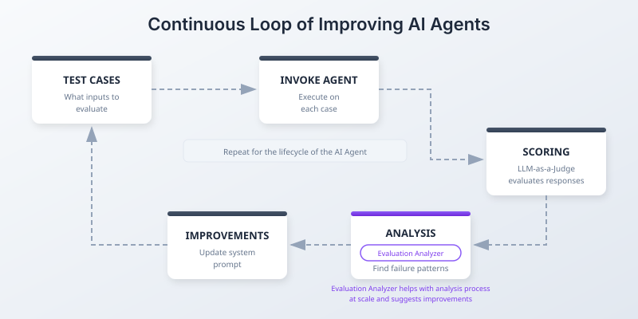
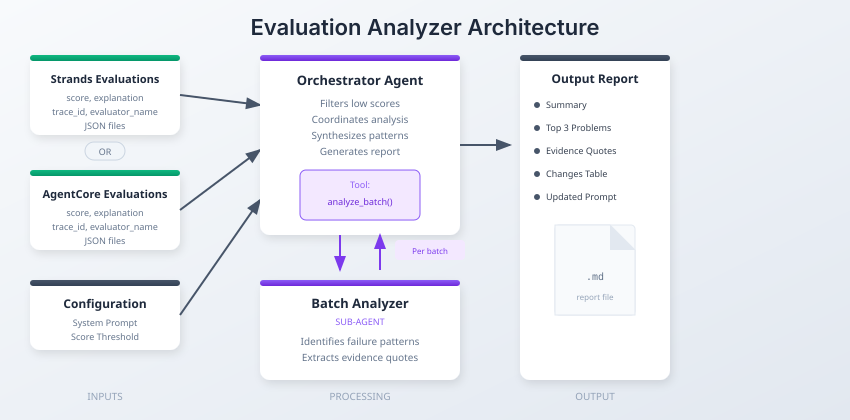

# Evaluation Analyzer

Scale your AI agent evaluation analysis from days/weeks to minutes.

**The Problem:** At scale, LLM-as-a-Judge evaluations produce hundreds of score/explanation pairs. Reading through all of them to find patterns is time-consuming, error-prone, and doesn't scale.

**The Solution:** This notebook uses AI to analyze AI evaluations results, identifies systematic problems using the evaluation explanations, and generates specific system prompt fixes for the AI Agent being evaluated. The developer is responsible to use the suggested prompts and updated the AI Agent manually/automatically to test our the improvments driven with the proposed fix.

## Where This Fits

AI Agent evaluation is a continuous loop where you test the agent using your test cases, analyze the responses via GroundTruth or via context-based evaluations using an LLM, analyze the evaluation results, make improvements to your agent, and repeat unless your success criteria is met to launch the agent to production.

<p align="center">

</p>

## How It Works

Built with [Strands Agents SDK](https://github.com/strands-agents/sdk-python):

- **Orchestrator** receives all low-scoring evaluations and your system prompt
- Calls `analyze_batch()` tool for each batch → invokes **Batch Analyzer** sub-agent
- **Batch Analyzer** reads LLM judge explanations, groups failures into patterns, extracts evidence quotes
- Orchestrator aggregates patterns across batches, ranks by frequency × severity
- Generates final report with top 3 problems and copy-paste-ready prompt fixes

<p align="center">

</p>

## Input Sources

- [Strands Evaluation Output](https://github.com/strands-agents/strands-evals)
- [AWS AgentCore Evaluation  Output](https://docs.aws.amazon.com/agentcore/)

## Step 1: Configuration

```python
# Configuration
EVAL_FOLDER = "eval_data/"
BATCH_SIZE = 10
SCORE_THRESHOLD = 0.7
SYSTEM_PROMPT_FILE = "system_prompt.txt"
MODEL_ID = "us.anthropic.claude-sonnet-4-5-20250929-v1:0"
AWS_REGION = "us-east-1"

# Load system prompt
from pathlib import Path

prompt_path = Path(SYSTEM_PROMPT_FILE)
if not prompt_path.exists() or prompt_path.stat().st_size < 100:
    print(f"Warning: {SYSTEM_PROMPT_FILE} not found, using example_system_prompt.txt")
    SYSTEM_PROMPT_FILE = "example_system_prompt.txt"

with open(SYSTEM_PROMPT_FILE, "r") as f:
    AGENT_SYSTEM_PROMPT = f.read()

# Strip comment header if present
lines = AGENT_SYSTEM_PROMPT.split("\n")
content_lines = []
in_header = True
for line in lines:
    if in_header and line.startswith("#"):
        continue
    in_header = False
    content_lines.append(line)
AGENT_SYSTEM_PROMPT = "\n".join(content_lines).strip()
```

## Step 2: Setup

```python
import json
import time
from pathlib import Path
from typing import List, Dict, Any, Optional
from statistics import mean, stdev
from collections import defaultdict
from IPython.display import display, Markdown

from strands import Agent, tool
from strands.models import BedrockModel
```

```python
def extract_evaluations(data: Any, parent_metadata: Optional[Dict] = None) -> List[Dict]:
    """Recursively extract evaluations from any JSON structure."""
    evaluations = []
    parent_metadata = parent_metadata or {}

    if isinstance(data, list):
        for item in data:
            evaluations.extend(extract_evaluations(item, parent_metadata))
    elif isinstance(data, dict):
        score_key = "score" if "score" in data else ("value" if "value" in data else None)

        if score_key and "explanation" in data:
            eval_entry = {
                "score": data[score_key],
                "explanation": data["explanation"],
                "metadata": {**parent_metadata},
            }
            for key, val in data.items():
                if key not in ["score", "value", "explanation"]:
                    if isinstance(val, (str, int, float, bool)):
                        eval_entry["metadata"][key] = val
            evaluations.append(eval_entry)
        else:
            nested_metadata = {**parent_metadata}
            for key in ["session_id", "trace_id", "evaluator_name", "evaluator_id"]:
                if key in data:
                    nested_metadata[key] = data[key]
            for key in ["results", "evaluations", "data", "items"]:
                if key in data:
                    evaluations.extend(extract_evaluations(data[key], nested_metadata))

    return evaluations


def load_evaluations(folder_path: str) -> List[Dict]:
    """Load all JSON files from a folder and extract evaluations."""
    evaluations = []
    folder = Path(folder_path)

    for json_file in sorted(folder.glob("*.json")):
        try:
            with open(json_file, "r") as f:
                data = json.load(f)
            evals = extract_evaluations(data, {"source_file": json_file.name})
            evaluations.extend(evals)
            print(f"  {json_file.name}: {len(evals)} evaluations")
        except Exception as e:
            print(f"  {json_file.name}: Error - {e}")

    return evaluations


def compute_statistics(evaluations: List[Dict], threshold: float) -> Dict:
    """Compute statistics from evaluations."""
    if not evaluations:
        return {"total": 0, "error": "No evaluations found"}

    scores = [e["score"] for e in evaluations if e["score"] is not None]

    by_evaluator = defaultdict(list)
    for e in evaluations:
        evaluator = e["metadata"].get("evaluator_name", e["metadata"].get("label", "unknown"))
        if e["score"] is not None:
            by_evaluator[evaluator].append(e["score"])

    evaluator_stats = {}
    for evaluator, eval_scores in by_evaluator.items():
        evaluator_stats[evaluator] = {
            "count": len(eval_scores),
            "mean": round(mean(eval_scores), 3),
            "min": round(min(eval_scores), 3),
            "max": round(max(eval_scores), 3),
        }
        if len(eval_scores) > 1:
            evaluator_stats[evaluator]["stdev"] = round(stdev(eval_scores), 3)

    low_scoring = [e for e in evaluations if e["score"] is not None and e["score"] < threshold]

    return {
        "total": len(evaluations),
        "valid_scores": len(scores),
        "mean_score": round(mean(scores), 3) if scores else None,
        "min_score": round(min(scores), 3) if scores else None,
        "max_score": round(max(scores), 3) if scores else None,
        "stdev": round(stdev(scores), 3) if len(scores) > 1 else None,
        "low_scoring_count": len(low_scoring),
        "low_scoring_pct": round(len(low_scoring) / len(scores) * 100, 1) if scores else 0,
        "by_evaluator": evaluator_stats,
        "threshold": threshold,
    }


def batch_evaluations(evaluations: List[Dict], batch_size: int) -> List[List[Dict]]:
    """Split evaluations into batches."""
    return [evaluations[i : i + batch_size] for i in range(0, len(evaluations), batch_size)]
```

## Step 3: Load and Validate Data

```python
# Validate configuration
if not AGENT_SYSTEM_PROMPT.strip():
    raise ValueError(f"System prompt is empty. Edit {SYSTEM_PROMPT_FILE}")

if "example_system_prompt" in SYSTEM_PROMPT_FILE:
    print("Using example system prompt. Edit system_prompt.txt for best results.")
else:
    print(f"System prompt loaded ({len(AGENT_SYSTEM_PROMPT)} chars)")

eval_path = Path(EVAL_FOLDER)
if not eval_path.exists():
    raise ValueError(f"Evaluation folder not found: {EVAL_FOLDER}")

json_files = list(eval_path.glob("*.json"))
if not json_files:
    raise ValueError(f"No JSON files found in {EVAL_FOLDER}")
print(f"Found {len(json_files)} JSON files in {EVAL_FOLDER}")
```

```python
print(f"Loading evaluations from {EVAL_FOLDER}:")
evaluations = load_evaluations(EVAL_FOLDER)
print(f"\nTotal: {len(evaluations)} evaluations")
```

```python
stats = compute_statistics(evaluations, SCORE_THRESHOLD)

print(f"Mean score: {stats['mean_score']} (range: {stats['min_score']} - {stats['max_score']})")
print(f"Low scoring (<{SCORE_THRESHOLD}): {stats['low_scoring_count']} ({stats['low_scoring_pct']}%)")

print("\nBy evaluator:")
for evaluator, eval_stats in stats["by_evaluator"].items():
    print(f"  {evaluator}: mean={eval_stats['mean']}, count={eval_stats['count']}")

low_scoring = [e for e in evaluations if e["score"] is not None and e["score"] < SCORE_THRESHOLD]
print(f"\n{len(low_scoring)} low-scoring evaluations will be analyzed")
```

## Step 4: Define Analysis Agents

This step creates two agents using [Strands Agents SDK](https://github.com/strands-agents/sdk-python):

**Orchestrator** (main agent)<br>
**Batch Analyzer** (sub-agent)

**Flow:**  `Orchestrator` → `analyze_batch()` tool → `Batch Analyzer` → JSON patterns → Orchestrator synthesizes → `Report` -> `User updates System Prompt of their AI Agent under evaluation`

````python
# ============================================
# AGENT PROMPTS
# ============================================

BATCH_ANALYZER_PROMPT = """
You analyze low-scoring evaluations to identify systematic failure patterns.

## Input
A batch of evaluations, each with:
- score: numeric 0-1 (scores < 0.7 indicate problems)
- explanation: detailed text from the LLM judge explaining why the score was given
- metadata: context including evaluator_name, trace_id/session_id

## Your Task
1. Read each explanation carefully - these contain the LLM judge's reasoning
2. Identify SYSTEMATIC PATTERNS (not isolated incidents) in why scores are low
3. Group similar failures together
4. Extract 2-3 specific quotes as evidence per pattern
5. Note which evaluator metrics are affected

## Output (JSON)
Return ONLY valid JSON with this structure:
{
  "patterns": [
    {
      "name": "short descriptive name",
      "description": "what the agent did wrong and why it's problematic",
      "count": N,
      "evaluators_affected": ["Faithfulness", "Correctness"],
      "evidence": ["direct quote from explanation 1", "direct quote from explanation 2"],
      "root_cause": "what's missing or unclear in the system prompt"
    }
  ]
}

CONSTRAINTS:
- Maximum 5 patterns per batch
- Only include patterns that appear 2+ times (systematic, not isolated)
- Evidence quotes should be verbatim from explanations
- Root cause should identify what prompt guidance would fix this
"""

ORCHESTRATOR_PROMPT = """
You synthesize evaluation analysis into actionable recommendations with system prompt improvements.

## Your Task
1. Use the analyze_batch tool to analyze low-scoring evaluations in batches
2. Collect patterns from all batches
3. Identify the TOP 3 most impactful problems based on:
   - **Frequency**: Appears across multiple evaluations (the more, the worse)
   - **Severity**: Lower scores indicate more severe problems
   - **Fixability**: Can be addressed by clarifying the system prompt
4. Generate specific, minimal prompt changes to fix each problem

## Required Output Format

# Evaluation Analysis Report

## Summary
[2-3 sentences on overall health of the agent based on the statistics and patterns found]

## Top 3 Problems

### Problem 1: [Specific Descriptive Name]

**Evidence from evaluations:**
- "[Direct quote from LLM judge explanation]"
- "[Another direct quote showing this pattern]"

**Frequency & Impact:**
- Appears in X out of Y low-scoring evaluations
- Affects metrics: [list evaluator names]
- Average score when this occurs: X.XX

**Root Cause:**
[What's missing or unclear in the current system prompt that causes this behavior]

**Proposed Fix:**
[Specific text to add/modify in the prompt and why it will work]

---

### Problem 2: [Specific Descriptive Name]

**Evidence from evaluations:**
- "[Direct quote]"
- "[Another quote]"
- "[TraceID and SessionID]"

**Frequency & Impact:**
- Appears in X out of Y low-scoring evaluations
- Affects metrics: [list]
- Average score when this occurs: X.XX

**Root Cause:**
[What's missing in the prompt]

**Proposed Fix:**
[Specific change and rationale]

---

### Problem 3: [Specific Descriptive Name]

**Evidence from evaluations:**
- "[Direct quote]"
- "[Another quote]"

**Frequency & Impact:**
- Appears in X out of Y low-scoring evaluations
- Affects metrics: [list]
- Average score when this occurs: X.XX

**Root Cause:**
[What's missing in the prompt]

**Proposed Fix:**
[Specific change and rationale]

---

## Suggested System Prompt Changes

### Changes Summary
| # | What Changed | Original Text | New Text | Fixes |
|---|--------------|---------------|----------|-------|
| 1 | [brief description] | [exact original snippet] | [exact new snippet] | Problem 1 |
| 2 | [brief description] | [exact original snippet] | [exact new snippet] | Problem 2 |
| 3 | [brief description] | [exact original snippet] | [exact new snippet] | Problem 3 |

### Complete Updated System Prompt
```
[FULL UPDATED PROMPT - COPY-PASTE READY]
```

## CONSTRAINTS
- Only 3 problems, ranked by impact (frequency × severity)
- Evidence must be actual quotes from the evaluation explanations with traceID and sessionID
- Make minimal, surgical prompt changes (not a complete rewrite)
- Preserve everything in the original prompt that works well
- The Complete Updated System Prompt must be the FULL prompt, ready to use
- No implementation roadmaps, KPIs, timelines, or risk assessments
"""
````

```python
model = BedrockModel(model_id=MODEL_ID, region_name=AWS_REGION)

batch_analyzer_agent = Agent(model=model, system_prompt=BATCH_ANALYZER_PROMPT)


@tool
def analyze_batch(batch_json: str) -> str:
    """Analyze a batch of low-scoring evaluations to identify failure patterns."""
    result = batch_analyzer_agent(f"Analyze these evaluations and return JSON patterns:\n{batch_json}")
    return str(result)


orchestrator = Agent(model=model, system_prompt=ORCHESTRATOR_PROMPT, tools=[analyze_batch])
```

---

## Step 5: Run the Analysis

The orchestrator will:
1. Process evaluations in batches using the sub-agent
2. Identify the top 3 problems
3. Generate specific prompt improvements
4. Output a complete updated system prompt

```python
print(f"Analyzing {len(low_scoring)} evaluations in {len(batch_evaluations(low_scoring, BATCH_SIZE))} batches...")

batches = batch_evaluations(low_scoring, BATCH_SIZE)
batches_json = [json.dumps(batch, indent=2) for batch in batches]

analysis_prompt = f"""
Analyze these evaluation results and provide a comprehensive report.

## Statistics
- Total evaluations: {stats["total"]}
- Mean score: {stats["mean_score"]}
- Low scoring (<{SCORE_THRESHOLD}): {stats["low_scoring_count"]} ({stats["low_scoring_pct"]}%)
- Score range: {stats["min_score"]} - {stats["max_score"]}

## Evaluator Breakdown
{json.dumps(stats["by_evaluator"], indent=2)}

## Current Agent System Prompt (to be improved)
{AGENT_SYSTEM_PROMPT}

## Low-Scoring Evaluations
There are {len(batches)} batches of evaluations to analyze.
Use the analyze_batch tool for each batch:

"""

for i, batch_json in enumerate(batches_json):
    analysis_prompt += f"\nBatch {i + 1}:\n{batch_json}\n"

start_time = time.time()
result = orchestrator(analysis_prompt)
elapsed_time = round(time.time() - start_time, 2)
result_text = str(result)

print(f"Analysis complete ({elapsed_time}s)")
```

## Step 6: View Results

After running this notebook:

- **Top 3 problems** with evidence quotes from the LLM judge
- **Root cause analysis** for each problem
- **Before/after changes table** showing exact prompt modifications
- **Complete updated system prompt** ready to copy-paste

See [example_agent_output.md](example_agent_output.md) for a sample.

```python
# ============================================
# DISPLAY RESULTS
# ============================================

display(Markdown(result_text))
```

## Step 7: Save Results

```python
from datetime import datetime

timestamp = datetime.now().strftime("%Y%m%d_%H%M%S")
output_file = f"analysis_report_{timestamp}.md"

report_content = f"""# Evaluation Analysis Report

**Generated:** {datetime.now().strftime("%Y-%m-%d %H:%M:%S")}
**Evaluations Analyzed:** {len(low_scoring)} low-scoring out of {stats["total"]} total
**Processing Time:** {elapsed_time}s

---

{result_text}
"""

with open(output_file, "w") as f:
    f.write(report_content)

print(f"Report saved to {output_file}")
```

---

## Next Steps

After running this analysis:

1. **Review the report** - Check if the identified problems match your observations
2. **Copy the updated prompt** - Use the "Complete Updated System Prompt" section
3. **Test incrementally** - Apply one change at a time if preferred
4. **Re-evaluate** - Run your evaluation suite again to measure improvement
5. **Iterate** - Repeat this process until scores meet your targets

### Tips

- If you have many low-scoring evaluations, increase `BATCH_SIZE` to reduce API calls
- Focus on the highest-impact problems first (those affecting multiple evaluators)
- Keep your original system prompt backed up before making changes
