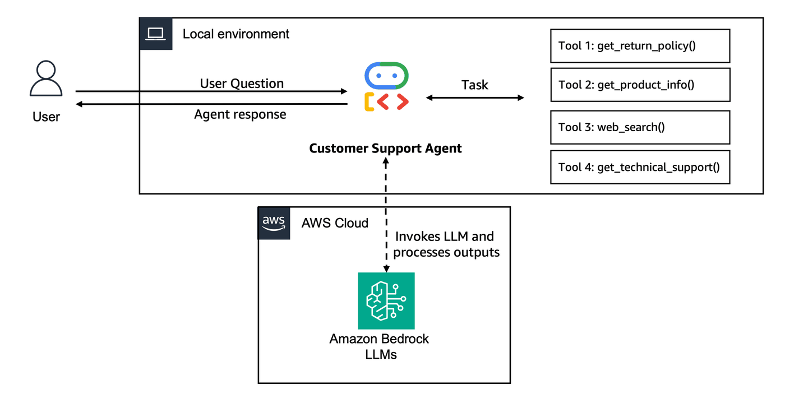

## Lab 1: Creating a simple customer support agent prototype

### Overview

[Amazon Bedrock AgentCore](https://aws.amazon.com/bedrock/agentcore/) helps you deploying and operating AI agents securely at scale - using any framework and model. It provides you with the capability to move from prototype to production faster. 

In this 5-labs tutorial, we will demonstrate the end-to-end journey from prototype to production using a **Customer Support Agent**. For this example we will use [Google ADK (Agent Development Kit)](https://google.github.io/adk-docs/) with [Amazon Bedrock](https://aws.amazon.com/bedrock/) models via [LiteLLM](https://google.github.io/adk-docs/agents/models/litellm/). For your application you can use the framework and model of your choice. It's important to note that the concepts covered here can be applied using other frameworks and models as well.

**Workshop Journey:**
- **Lab 1 (Current)**: Create Agent Prototype - Build a functional customer support agent
- **Lab 2**: Enhance with Memory - Add conversation context and personalization
- **Lab 3**: Scale with Gateway & Identity - Share tools across agents securely
- **Lab 4**: Deploy to Production - Use AgentCore Runtime with observability
- **Lab 5**: Build User Interface - Create a customer-facing application

In this first lab, we'll build a Customer Support Agent prototype that will evolve throughout the workshop into a production-ready system serving multiple customers with persistent memory, shared tools, and full observability. Our agent will have the following local tools available:
- **get_return_policy()** - Get return policy for specific products
- **get_product_info()** - Get product information
- **web_search()** - Search the web for troubleshooting help
- **get_technical_support()** - Search a Bedrock Knowledge Base

### Architecture for Lab 1
<div style="text-align:left">
    
</div>

*Simple prototype running locally. In subsequent labs, we'll migrate this to AgentCore services with shared tools, persistent memory, and production-grade observability.*

### Prerequisites

* **AWS Account** with appropriate permissions
* **Python 3.10+** installed locally
* **AWS CLI configured** with credentials
* **Amazon Bedrock** model access enabled (e.g., Anthropic Claude or Amazon Nova)
* **Google ADK** and other libraries installed in the next cells

#### Not using an AWS workshop account? 

If you are running this as a self-paced lab you MUST do additional 2 steps to create and deploy the cloudformation stack:

**Step 0.1: [Only for Self-paced labs]** 

Uncomment the cell below with command `!aws sts get-caller-identity` to know your Sagemaker Role. Proceed to IAM in the AWS console and search for your Sagemaker Role. Now add the [IAM Policy, AWS managed policies and Trust relationships](https://catalog.us-east-1.prod.workshops.aws/workshops/850fcd5c-fd1f-48d7-932c-ad9babede979/en-US/00-prerequisites/02-self-paced#iam-policy-for-bedrock-agentcore-workshop) as described in the [workshop self-paced prerequisites](https://catalog.us-east-1.prod.workshops.aws/workshops/850fcd5c-fd1f-48d7-932c-ad9babede979/en-US/00-prerequisites/02-self-paced) lab.

```python
# Note: Uncomment and run only for self-paced labs
!aws sts get-caller-identity
```

**Step 0.2: [Only for Self-paced labs]**

Now, once you have all the required permissions for this `prereq.sh` script, run the following command to deploy the cloudformation template.

```python
# Note: Uncomment and run only for self-paced labs
# !bash scripts/prereq.sh
```

### Step 1: Install Dependencies and Import Libraries
Before we start, let's install the dependencies for this lab. You will see some dependency errors - they're safe to ignore for the scope of this workshop.

```python
# Install required packages
%pip install -r requirements.txt -q
```

We can now import the required libraries and initialize our boto3 session

```python
# Import libraries
import boto3
from boto3.session import Session

from lab_helpers.utils import suppress_warnings

suppress_warnings()

from ddgs.exceptions import DDGSException, RatelimitException
from ddgs import DDGS

from google.adk.agents import LlmAgent
from google.adk.models.lite_llm import LiteLlm
from google.adk.runners import Runner
from google.adk.sessions import InMemorySessionService
from google.genai import types
```

```python
# Get boto session
boto_session = Session()
region = boto_session.region_name
```

### Step 2: Implementing custom tools

Next, we will implement the 4 tools which will be provided to the Customer Support Agent.

In Google ADK, tools are simply Python functions with type hints and docstrings. ADK uses the function signature and documentation to provide context on each tool to the agent.

#### Tool 1: Get Return Policy

**Purpose:** This tool helps customers understand return policies for different product categories. It provides detailed information about return windows, conditions, processes, and refund timelines so customers know exactly what to expect when returning items.

```python
def get_return_policy(product_category: str) -> str:
    """Get return policy information for a specific product category.

    Args:
        product_category: Electronics category (e.g., 'smartphones', 'laptops', 'accessories')

    Returns:
        Formatted return policy details including timeframes and conditions
    """
    # Mock return policy database - in real implementation, this would query policy database
    return_policies = {
        "smartphones": {
            "window": "30 days",
            "condition": "Original packaging, no physical damage, factory reset required",
            "process": "Online RMA portal or technical support",
            "refund_time": "5-7 business days after inspection",
            "shipping": "Free return shipping, prepaid label provided",
            "warranty": "1-year manufacturer warranty included",
        },
        "laptops": {
            "window": "30 days",
            "condition": "Original packaging, all accessories, no software modifications",
            "process": "Technical support verification required before return",
            "refund_time": "7-10 business days after inspection",
            "shipping": "Free return shipping with original packaging",
            "warranty": "1-year manufacturer warranty, extended options available",
        },
        "accessories": {
            "window": "30 days",
            "condition": "Unopened packaging preferred, all components included",
            "process": "Online return portal",
            "refund_time": "3-5 business days after receipt",
            "shipping": "Customer pays return shipping under $50",
            "warranty": "90-day manufacturer warranty",
        },
    }

    # Default policy for unlisted categories
    default_policy = {
        "window": "30 days",
        "condition": "Original condition with all included components",
        "process": "Contact technical support",
        "refund_time": "5-7 business days after inspection",
        "shipping": "Return shipping policies vary",
        "warranty": "Standard manufacturer warranty applies",
    }

    policy = return_policies.get(product_category.lower(), default_policy)
    return (
        f"Return Policy - {product_category.title()}:\n\n"
        f"• Return window: {policy['window']} from delivery\n"
        f"• Condition: {policy['condition']}\n"
        f"• Process: {policy['process']}\n"
        f"• Refund timeline: {policy['refund_time']}\n"
        f"• Shipping: {policy['shipping']}\n"
        f"• Warranty: {policy['warranty']}"
    )


print("✅ Return policy tool ready")
```

#### Tool 2: Get Product Information

**Purpose:** This tool provides customers with comprehensive product details including warranties, available models, key features, shipping policies, and return information. It helps customers make informed purchasing decisions and understand what they're buying.

```python
def get_product_info(product_type: str) -> str:
    """Get detailed technical specifications and information for electronics products.

    Args:
        product_type: Electronics product type (e.g., 'laptops', 'smartphones', 'headphones', 'monitors')
    Returns:
        Formatted product information including warranty, features, and policies
    """
    # Mock product catalog - in real implementation, this would query a product database
    products = {
        "laptops": {
            "warranty": "1-year manufacturer warranty + optional extended coverage",
            "specs": "Intel/AMD processors, 8-32GB RAM, SSD storage, various display sizes",
            "features": "Backlit keyboards, USB-C/Thunderbolt, Wi-Fi 6, Bluetooth 5.0",
            "compatibility": "Windows 11, macOS, Linux support varies by model",
            "support": "Technical support and driver updates included",
        },
        "smartphones": {
            "warranty": "1-year manufacturer warranty",
            "specs": "5G/4G connectivity, 128GB-1TB storage, multiple camera systems",
            "features": "Wireless charging, water resistance, biometric security",
            "compatibility": "iOS/Android, carrier unlocked options available",
            "support": "Software updates and technical support included",
        },
        "headphones": {
            "warranty": "1-year manufacturer warranty",
            "specs": "Wired/wireless options, noise cancellation, 20Hz-20kHz frequency",
            "features": "Active noise cancellation, touch controls, voice assistant",
            "compatibility": "Bluetooth 5.0+, 3.5mm jack, USB-C charging",
            "support": "Firmware updates via companion app",
        },
        "monitors": {
            "warranty": "3-year manufacturer warranty",
            "specs": "4K/1440p/1080p resolutions, IPS/OLED panels, various sizes",
            "features": "HDR support, high refresh rates, adjustable stands",
            "compatibility": "HDMI, DisplayPort, USB-C inputs",
            "support": "Color calibration and technical support",
        },
    }
    product = products.get(product_type.lower())
    if not product:
        return f"Technical specifications for {product_type} not available. Please contact our technical support team for detailed product information and compatibility requirements."

    return (
        f"Technical Information - {product_type.title()}:\n\n"
        f"• Warranty: {product['warranty']}\n"
        f"• Specifications: {product['specs']}\n"
        f"• Key Features: {product['features']}\n"
        f"• Compatibility: {product['compatibility']}\n"
        f"• Support: {product['support']}"
    )


print("✅ get_product_info tool ready")
```

#### Tool 3: Web-search

**Purpose:** This tool allows customers to get troubleshooting support or suggestions on product recommendations etc.

```python
def web_search(keywords: str, region: str, max_results: int) -> str:
    """Search the web for updated information.

    Args:
        keywords: The search query keywords.
        region: The search region: wt-wt, us-en, uk-en, ru-ru, etc..
        max_results: The maximum number of results to return.
    Returns:
        List of dictionaries with search results.
    """
    if not region:
        region = "us-en"
    if not max_results:
        max_results = 5
    try:
        results = DDGS().text(keywords, region=region, max_results=max_results)
        return results if results else "No results found."
    except RatelimitException:
        return "Rate limit reached. Please try again later."
    except DDGSException as e:
        return f"Search error: {e}"
    except Exception as e:
        return f"Search error: {str(e)}"


print("✅ Web search tool ready")
```

#### Customer Support Agent - Knowledge Base Integration Steps

##### Download product technical_support files from S3

```python
import os


def download_files():
    # Get account and region
    account_id = boto3.client("sts").get_caller_identity()["Account"]
    region = boto3.Session().region_name
    bucket_name = f"{account_id}-{region}-kb-data-bucket"

    # Create local folder
    os.makedirs("knowledge_base_data", exist_ok=True)

    # Download all files
    s3 = boto3.client("s3")
    objects = s3.list_objects_v2(Bucket=bucket_name)

    for obj in objects["Contents"]:
        file_name = obj["Key"]
        s3.download_file(bucket_name, file_name, f"knowledge_base_data/{file_name}")
        print(f"Downloaded: {file_name}")

    print("All files saved to: knowledge_base_data/")


# Run it
download_files()
```

#### Knowledge Base Sync Job

##### Sync the knowledge base with product technical_support files from S3 which can be integrated with the agent

```python
import time

# Get parameters
ssm = boto3.client("ssm")
bedrock = boto3.client("bedrock-agent")
s3 = boto3.client("s3")

account_id = boto3.client("sts").get_caller_identity()["Account"]
region = boto3.Session().region_name

kb_id = ssm.get_parameter(Name=f"/{account_id}-{region}/kb/knowledge-base-id")["Parameter"]["Value"]
ds_id = ssm.get_parameter(Name=f"/{account_id}-{region}/kb/data-source-id")["Parameter"]["Value"]

# Get file names from S3 bucket
bucket_name = f"{account_id}-{region}-kb-data-bucket"
s3_objects = s3.list_objects_v2(Bucket=bucket_name)
file_names = [obj["Key"] for obj in s3_objects.get("Contents", [])]

# Start sync job
response = bedrock.start_ingestion_job(knowledgeBaseId=kb_id, dataSourceId=ds_id, description="Quick sync")

job_id = response["ingestionJob"]["ingestionJobId"]
print("Bedrock knowledge base sync job started, ingesting the data files from s3")

# Monitor until complete
while True:
    job = bedrock.get_ingestion_job(knowledgeBaseId=kb_id, dataSourceId=ds_id, ingestionJobId=job_id)["ingestionJob"]

    status = job["status"]

    if status in ["COMPLETE", "FAILED"]:
        break

    time.sleep(10)

# Print final result
if status == "COMPLETE":
    file_count = job.get("statistics", {}).get("numberOfDocumentsScanned", 0)
    files_list = ", ".join(file_names)
    print(f"Bedrock knowledge base sync job completed Successfully, ingested {file_count} files")
    print(f"Files ingested: {files_list}")
else:
    print(f"Bedrock knowledge base sync job failed with status: {status}")
```

#### Tool 4: Get Technical Support

**Purpose:**  This tool provides customers with comprehensive technical support and troubleshooting assistance by accessing our knowledge base of electronics documentation. It includes detailed setup guides, maintenance instructions, troubleshooting steps, connectivity solutions, and warranty service information. This tool helps customers resolve technical issues, properly configure their devices, and understand maintenance requirements for optimal product performance.

Since we are using Google ADK instead of Strands, we replace the Strands `retrieve` tool with a direct boto3 call to the Bedrock Knowledge Base `retrieve` API.

```python
def get_technical_support(issue_description: str) -> str:
    """Get technical support and troubleshooting guidance by searching the knowledge base.

    Args:
        issue_description: Description of the technical issue or question.

    Returns:
        Relevant technical support documentation and troubleshooting steps.
    """
    try:
        # Get KB ID from parameter store
        ssm_client = boto3.client("ssm")
        account_id = boto3.client("sts").get_caller_identity()["Account"]
        region = boto3.Session().region_name

        kb_id = ssm_client.get_parameter(Name=f"/{account_id}-{region}/kb/knowledge-base-id")["Parameter"]["Value"]
        print(f"Successfully retrieved KB ID: {kb_id}")

        # Use boto3 bedrock-agent-runtime to retrieve from knowledge base
        bedrock_agent_runtime = boto3.client("bedrock-agent-runtime", region_name=region)

        response = bedrock_agent_runtime.retrieve(
            knowledgeBaseId=kb_id,
            retrievalQuery={"text": issue_description},
            retrievalConfiguration={
                "vectorSearchConfiguration": {
                    "numberOfResults": 3,
                }
            },
        )

        # Extract and format results
        results = response.get("retrievalResults", [])
        if not results:
            return "No relevant technical support documentation found for this issue."

        formatted_results = []
        for i, result in enumerate(results, 1):
            content = result.get("content", {}).get("text", "")
            score = result.get("score", 0)
            if score >= 0.4:
                formatted_results.append(f"--- Result {i} (relevance: {score:.2f}) ---\n{content}")

        if not formatted_results:
            return "No sufficiently relevant technical support documentation found. Please contact our support team directly."

        return "\n\n".join(formatted_results)

    except Exception as e:
        print(f"Detailed error in get_technical_support: {str(e)}")
        return f"Unable to access technical support documentation. Error: {str(e)}"


print("✅ Technical support tool ready")
```

### Step 4: Create and Configure the Customer Support Agent

Next, we will create the Customer Support Agent using Google ADK's `LlmAgent` with an Amazon Bedrock model via LiteLLM. We provide the model, the list of tools implemented in the previous step, and a system instruction.

We also define a helper function `call_agent` that handles the async ADK runner invocation pattern.

```python
SYSTEM_PROMPT = """You are a helpful and professional customer support assistant for an electronics e-commerce company.
Your role is to:
- Provide accurate information using the tools available to you
- Support the customer with technical information and product specifications, and maintenance questions
- Be friendly, patient, and understanding with customers
- Always offer additional help after answering questions
- If you can't help with something, direct customers to the appropriate contact

You have access to the following tools:
1. get_return_policy() - For warranty and return policy questions
2. get_product_info() - To get information about a specific product
3. web_search() - To access current technical documentation, or for updated information. 
4. get_technical_support() - For troubleshooting issues, setup guides, maintenance tips, and detailed technical assistance
For any technical problems, setup questions, or maintenance concerns, always use the get_technical_support() tool as it contains our comprehensive technical documentation and step-by-step guides.

Always use the appropriate tool to get accurate, up-to-date information rather than making assumptions about electronic products or specifications."""

APP_NAME = "customer_support_agent"
USER_ID = "user_123"
SESSION_ID = "lab01_session"

# Create the Google ADK agent using Amazon Bedrock via LiteLLM
agent = LlmAgent(
    model=LiteLlm(model="bedrock/global.anthropic.claude-haiku-4-5-20251001-v1:0"),
    name="customer_support_agent",
    description="A customer support agent for an electronics e-commerce company.",
    instruction=SYSTEM_PROMPT,
    tools=[
        get_product_info,  # Tool 1: Simple product information lookup
        get_return_policy,  # Tool 2: Simple return policy lookup
        web_search,  # Tool 3: Access the web for updated information
        get_technical_support,  # Tool 4: Technical support & troubleshooting
    ],
)


async def call_agent(query: str) -> str:
    """Invoke the ADK agent with a user query and return the response."""
    session_service = InMemorySessionService()
    await session_service.create_session(app_name=APP_NAME, user_id=USER_ID, session_id=SESSION_ID)
    runner = Runner(agent=agent, app_name=APP_NAME, session_service=session_service)
    content = types.Content(role="user", parts=[types.Part(text=query)])
    events = runner.run_async(user_id=USER_ID, session_id=SESSION_ID, new_message=content)
    final_response = ""
    async for event in events:
        if event.is_final_response():
            final_response = event.content.parts[0].text
    return final_response


print("Customer Support Agent created successfully!")
```

### Step 5: Test the Customer Support Agent

Let's test our agent with sample queries to ensure all tools work correctly.

#### Test Return check

```python
response = await call_agent("What's the return policy for my thinkpad X1 Carbon?")
print(response)
```

```python
response = await call_agent("My laptop won't turn on, what should I check?")
print(response)
```

#### Test Troubleshooting

```python
response = await call_agent("I bought an iphone 14 last month. I don't like it because it heats up. How do I solve it?")
print(response)
```

## 🎉 Lab 1 Complete!

You've successfully created a functional Customer Support Agent prototype using **Google ADK** with **Amazon Bedrock** models via **LiteLLM**! Here's what you accomplished:

- Built a Google ADK agent with 4 tools (return policy, product info, web search, technical support KB)
- Used LiteLLM to invoke Amazon Bedrock models from the ADK framework
- Tested multi-tool interactions and web search capabilities  
- Established the foundation for our production journey  

### Current Limitations (We'll fix these!)
- **Single user conversation memory** - local conversation session, multiple customers need multiple sessions.
- **Conversation history limited to session** - no long term memory or cross session information is available in the conversation.
- **Tools reusability** - tools aren't reusable across different agents  
- **Running locally only** - not scalable
- **Identity** - No user and/or agent identity or access control
- **Observability** - Limited observability into agent behavior
- **Existing APIs** - No access to existing enterprise APIs for customer data

##### Next Up [Lab 2: Personalize our agent by adding memory →](lab-02-agentcore-memory.ipynb)
