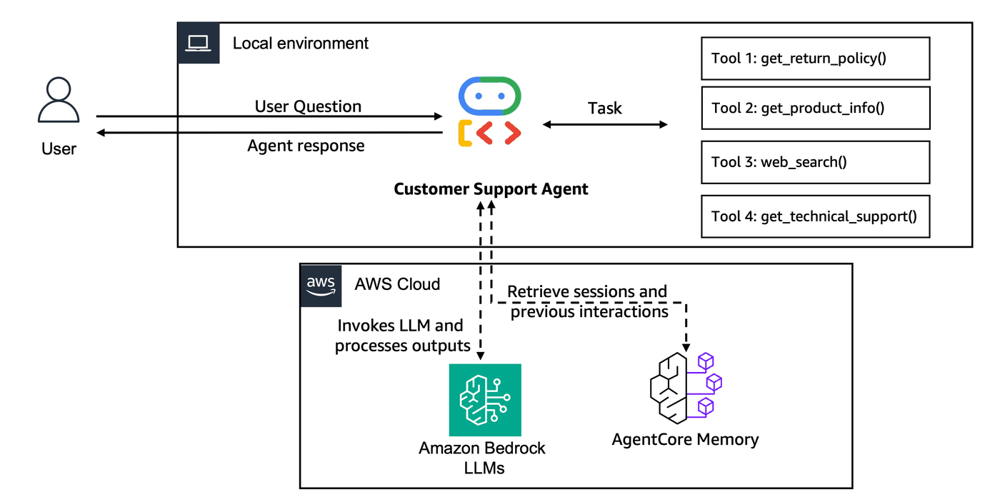

## Lab 2: Personalize our agent by adding memory

### Overview

In Lab 1, you built a Customer Support Agent that worked well for a single user in a local session. However, real-world customer support needs to scale beyond a single user running in a local environment.

When we run an **Agent in Production**, we'll need:
- **Multi-User Support**: Handle thousands of customers simultaneously
- **Persistent Storage**: Save conversations beyond session lifecycle
- **Long-Term Learning**: Extract customer preferences and behavioral patterns
- **Cross-Session Continuity**: Remember customers across different interactions

**Workshop Progress:**
- **Lab 1 (Done)**: Create Agent Prototype - Build a functional customer support agent
- **Lab 2 (Current)**: Enhance with Memory - Add conversation context and personalization
- **Lab 3**: Scale with Gateway & Identity - Share tools across agents securely
- **Lab 4**: Deploy to Production - Use AgentCore Runtime with observability
- **Lab 5**: Build User Interface - Create a customer-facing application

In this lab, you'll add the missing persistence and learning layer that transforms your Goldfish-Agent (forgets the conversation in seconds) into a smart personalized Assistant.

Memory is a critical component of intelligence. While Large Language Models (LLMs) have impressive capabilities, they lack persistent memory across conversations. [Amazon Bedrock AgentCore Memory](https://docs.aws.amazon.com/bedrock-agentcore/latest/devguide/memory-getting-started.html) addresses this limitation by providing a managed service that enables AI agents to maintain context over time, remember important facts, and deliver consistent, personalized experiences.

AgentCore Memory operates on two levels:
- **Short-Term Memory**: Immediate conversation context and session-based information that provides continuity within a single interaction or closely related sessions.
- **Long-Term Memory**: Persistent information extracted and stored across multiple conversations, including facts, preferences, and summaries that enable personalized experiences over time.

### Architecture for Lab 2
<div style="text-align:left">
    
</div>

*Multi-user agent with persistent short term and long term memory capabilities.*

### Prerequisites

* **AWS Account** with appropriate permissions
* **Python 3.10+** installed locally
* **AWS CLI configured** with credentials
* **Google ADK** and other libraries installed in the next cells
* These resources are created for you within an AWS workshop account
    - AWS Lambda function 
    - Amazon Bedrock Knowledge Base

### Step 1: Import Libraries

Let's import the libraries for AgentCore Memory. For it, we will use the [Amazon Bedrock AgentCore Memory](https://docs.aws.amazon.com/bedrock-agentcore/latest/devguide/memory.html) SDK.

We'll also import Google ADK components to build our agent, using **LiteLLM** to invoke **Amazon Bedrock** models.

> **Note:** Google ADK uses async patterns. In Jupyter notebooks, we can use `await` directly at the top level since the notebook already runs an asyncio event loop.

> **Note:** We use `LiteLlm` from Google ADK to route requests to Amazon Bedrock models. This means we don't need a Gemini API key — we use AWS credentials instead.

```python
import uuid
import time

from lab_helpers.utils import suppress_warnings

suppress_warnings()

import boto3
from boto3.session import Session

from bedrock_agentcore_starter_toolkit.operations.memory.manager import MemoryManager
from bedrock_agentcore.memory import MemoryClient
from bedrock_agentcore.memory.constants import StrategyType

from ddgs.exceptions import DDGSException, RatelimitException
from ddgs import DDGS

from google.adk.agents import LlmAgent
from google.adk.models.lite_llm import LiteLlm
from google.adk.runners import Runner
from google.adk.sessions import InMemorySessionService
from google.genai import types

from lab_helpers.utils import put_ssm_parameter

# Get boto session and region
boto_session = Session()
REGION = boto_session.region_name
print(f"Region: {REGION}")
```

### Step 2: Create Bedrock AgentCore Memory resources

Amazon Bedrock AgentCore Memory is a fully managed service that provides persistent memory for AI agents. Let's create our memory resource with two strategies:

1. **User Preference Strategy**: Captures customer preferences and behavior patterns
2. **Semantic Strategy**: Stores factual information from conversations using vector embeddings

Each strategy has its own namespace for organized retrieval.

```python
memory_name = "CustomerSupportMemory"

memory_manager = MemoryManager(region_name=REGION)
memory = memory_manager.get_or_create_memory(
    name=memory_name,
    strategies=[
        {
            StrategyType.USER_PREFERENCE.value: {
                "name": "CustomerPreferences",
                "description": "Captures customer preferences and behavior",
                "namespaces": ["support/customer/{actorId}/preferences/"],
            }
        },
        {
            StrategyType.SEMANTIC.value: {
                "name": "CustomerSupportSemantic",
                "description": "Stores facts from conversations",
                "namespaces": ["support/customer/{actorId}/semantic/"],
            }
        },
    ],
)
memory_id = memory["id"]
put_ssm_parameter("/app/customersupport/agentcore/memory_id", memory_id)
```

```python
if memory_id:
    print("\u2705 AgentCore Memory created successfully!")
    print(f"Memory ID: {memory_id}")
else:
    print("Memory resource not created. Try Again !")
```

## Step 3: Seed previous customer interactions

**Why are we seeding memory?**

In production, agents accumulate memory naturally through customer interactions. However, for this lab, we're seeding historical conversations to demonstrate how Long-Term Memory (LTM) works without waiting for real conversations.

**How memory processing works:**
1. `create_event` stores interactions in **Short-Term Memory** (STM) instantly
2. STM is asynchronously processed by **Long-Term Memory** strategies
3. LTM extracts patterns, preferences, and facts for future retrieval

Let's seed some customer history to see this in action:

```python
from lab_helpers.lab2_memory import ACTOR_ID


# Seed with previous customer interactions
previous_interactions = [
    ("I'm having issues with my MacBook Pro overheating during video editing.", "USER"),
    (
        "I can help with that thermal issue. For video editing workloads, let's check your Activity Monitor and adjust performance settings. Your MacBook Pro order #MB-78432 is still under warranty.",
        "ASSISTANT",
    ),
    (
        "What's the return policy on gaming headphones? I need low latency for competitive FPS games",
        "USER",
    ),
    (
        "For gaming headphones, you have 30 days to return. Since you're into competitive FPS, I'd recommend checking the audio latency specs - most gaming models have <40ms latency.",
        "ASSISTANT",
    ),
    (
        "I need a laptop under $1200 for programming. Prefer 16GB RAM minimum and good Linux compatibility. I like ThinkPad models.",
        "USER",
    ),
    (
        "Perfect! For development work, I'd suggest looking at our ThinkPad E series or Dell XPS models. Both have excellent Linux support and 16GB RAM options within your budget.",
        "ASSISTANT",
    ),
]

# Save previous interactions
if memory_id:
    try:
        memory_client = MemoryClient(region_name=REGION)
        memory_client.create_event(
            memory_id=memory_id,
            actor_id=ACTOR_ID,
            session_id="previous_session",
            messages=previous_interactions,
        )
        print("\u2705 Seeded customer history successfully")
        print("\U0001f4dd Interactions saved to Short-Term Memory")
        print("\u23f3 Long-Term Memory processing will begin automatically...")
    except Exception as e:
        print(f"\u26a0\ufe0f Error seeding history: {e}")
```

### Understanding Memory Processing

After creating events with `create_event`, AgentCore Memory processes the data in two stages:

1. **Immediate**: Messages stored in Short-Term Memory (STM)
2. **Asynchronous**: STM processed into Long-Term Memory (LTM) strategies

LTM processing typically takes 20-30 seconds as the system:
- Analyzes conversation patterns
- Extracts customer preferences and behaviors
- Creates semantic embeddings for factual information
- Organizes memories by namespace for efficient retrieval

Let's check if our Long-Term Memory processing is complete by retrieving customer preferences:

```python
# Wait for Long-Term Memory processing to complete
print("\U0001f50d Checking for processed Long-Term Memories...")
retries = 0
max_retries = 6  # 1 minute wait

while retries < max_retries:
    memories = memory_client.retrieve_memories(
        memory_id=memory_id,
        namespace=f"support/customer/{ACTOR_ID}/preferences/",
        query="can you summarize the support issue",
    )

    if memories:
        print(f"\u2705 Found {len(memories)} preference memories after {retries * 10} seconds!")
        break

    retries += 1
    if retries < max_retries:
        print(f"\u23f3 Still processing... waiting 10 more seconds (attempt {retries}/{max_retries})")
        time.sleep(10)
    else:
        print("\u26a0\ufe0f Memory processing is taking longer than expected. This can happen with overloading..")
        break

print("\U0001f3af AgentCore Memory automatically extracted these customer preferences from our seeded conversations:")
print("=" * 80)

for i, memory in enumerate(memories, 1):
    if isinstance(memory, dict):
        content = memory.get("content", {})
        if isinstance(content, dict):
            text = content.get("text", "")
            print(f"  {i}. {text}")
```

### Exploring Semantic Memory

Semantic memory stores factual information from conversations using vector embeddings. This enables similarity-based retrieval of relevant facts and context.

```python
import time

# Retrieve semantic memories (factual information)
while True:
    semantic_memories = memory_client.retrieve_memories(
        memory_id=memory_id,
        namespace=f"support/customer/{ACTOR_ID}/semantic/",
        query="information on the technical support issue",
    )
    print("\U0001f9e0 AgentCore Memory identified these factual details from conversations:")
    print("=" * 80)
    if semantic_memories:
        break
    time.sleep(10)
for i, memory in enumerate(semantic_memories, 1):
    if isinstance(memory, dict):
        content = memory.get("content", {})
        if isinstance(content, dict):
            text = content.get("text", "")
            print(f"  {i}. {text}")
```

## Step 4: Create a Customer Support Agent with memory

Next, we will implement the Customer Support Agent just as we did in Lab 1, but this time we will integrate AgentCore Memory.

Since Google ADK does not have a built-in `AgentCoreMemorySessionManager` (like Strands does), we implement memory integration explicitly:

1. **Before each query**: Retrieve relevant customer context from memory (preferences + semantic)
2. **Inject context**: Prepend retrieved memories to the user query so the LLM has personalization context
3. **After each response**: Save the interaction (query + response) back to memory for future use

This pattern gives us the same memory-enhanced behavior while keeping full control over the retrieval and storage logic.

> **Note:** We use `LlmAgent` with `LiteLlm` to invoke Amazon Bedrock models (Claude) through Google ADK. This means the LLM calls go through your AWS credentials, not a Gemini API key.

> **Note:** We reuse the same tools from Lab 1 (get_return_policy, get_product_info, web_search, get_technical_support).

```python
# ============================================================
# Define the same tools from Lab 1
# ============================================================


def get_return_policy(product_category: str) -> str:
    """
    Get return policy information for a specific product category.

    Args:
        product_category: Electronics category (e.g., 'smartphones', 'laptops', 'accessories')

    Returns:
        Formatted return policy details including timeframes and conditions
    """
    return_policies = {
        "smartphones": {
            "window": "30 days",
            "condition": "Original packaging, no physical damage, factory reset required",
            "process": "Online RMA portal or technical support",
            "refund_time": "5-7 business days after inspection",
            "shipping": "Free return shipping, prepaid label provided",
            "warranty": "1-year manufacturer warranty included",
        },
        "laptops": {
            "window": "30 days",
            "condition": "Original packaging, all accessories, no software modifications",
            "process": "Technical support verification required before return",
            "refund_time": "7-10 business days after inspection",
            "shipping": "Free return shipping with original packaging",
            "warranty": "1-year manufacturer warranty, extended options available",
        },
        "accessories": {
            "window": "30 days",
            "condition": "Unopened packaging preferred, all components included",
            "process": "Online return portal",
            "refund_time": "3-5 business days after receipt",
            "shipping": "Customer pays return shipping under $50",
            "warranty": "90-day manufacturer warranty",
        },
    }
    default_policy = {
        "window": "30 days",
        "condition": "Original condition with all included components",
        "process": "Contact technical support",
        "refund_time": "5-7 business days after inspection",
        "shipping": "Return shipping policies vary",
        "warranty": "Standard manufacturer warranty applies",
    }
    policy = return_policies.get(product_category.lower(), default_policy)
    return (
        f"Return Policy - {product_category.title()}:\n\n"
        f"\u2022 Return window: {policy['window']} from delivery\n"
        f"\u2022 Condition: {policy['condition']}\n"
        f"\u2022 Process: {policy['process']}\n"
        f"\u2022 Refund timeline: {policy['refund_time']}\n"
        f"\u2022 Shipping: {policy['shipping']}\n"
        f"\u2022 Warranty: {policy['warranty']}"
    )
```

```python
def get_product_info(product_type: str) -> str:
    """
    Get detailed technical specifications and information for electronics products.

    Args:
        product_type: Electronics product type (e.g., 'laptops', 'smartphones', 'headphones', 'monitors')
    Returns:
        Formatted product information including warranty, features, and policies
    """
    products = {
        "laptops": {
            "warranty": "1-year standard, 3-year extended available",
            "specs": "Intel/AMD processors, 8-64GB RAM, SSD storage",
            "features": "Backlit keyboards, fingerprint readers, Thunderbolt ports",
            "compatibility": "Windows, Linux, macOS (Apple only)",
            "support": "24/7 technical support, on-site repair options",
        },
        "smartphones": {
            "warranty": "1-year manufacturer, 2-year extended",
            "specs": "Latest processors, 6-12GB RAM, 128GB-1TB storage",
            "features": "5G capable, water resistant, wireless charging",
            "compatibility": "iOS or Android ecosystem",
            "support": "In-store and mail-in repair services",
        },
        "headphones": {
            "warranty": "1-year standard warranty",
            "specs": "Bluetooth 5.0+, ANC, 20-40hr battery",
            "features": "Active noise cancellation, transparency mode, multipoint",
            "compatibility": "Universal Bluetooth, some with proprietary apps",
            "support": "Replacement program for defective units",
        },
        "monitors": {
            "warranty": "3-year standard, zero dead pixel guarantee",
            "specs": "4K/1440p resolution, 60-240Hz refresh rate",
            "features": "HDR support, high refresh rates, adjustable stands",
            "compatibility": "HDMI, DisplayPort, USB-C inputs",
            "support": "Color calibration and technical support",
        },
    }
    product = products.get(product_type.lower())
    if not product:
        return f"Technical specifications for {product_type} not available. Please contact our technical support team for detailed product information and compatibility requirements."
    return (
        f"Technical Information - {product_type.title()}:\n\n"
        f"\u2022 Warranty: {product['warranty']}\n"
        f"\u2022 Specifications: {product['specs']}\n"
        f"\u2022 Key Features: {product['features']}\n"
        f"\u2022 Compatibility: {product['compatibility']}\n"
        f"\u2022 Support: {product['support']}"
    )


def web_search(keywords: str) -> str:
    """Search the web for updated information.

    Args:
        keywords: The search query keywords.
    Returns:
        List of dictionaries with search results.
    """
    try:
        results = DDGS().text(keywords, region="us-en", max_results=5)
        return str(results) if results else "No results found."
    except RatelimitException:
        return "Rate limit reached. Please try again later."
    except DDGSException as e:
        return f"Search error: {e}"
    except Exception as e:
        return f"Search error: {str(e)}"


def get_technical_support(issue_description: str) -> str:
    """Search the technical support knowledge base for troubleshooting help, setup guides, and maintenance tips.

    Args:
        issue_description: Description of the technical issue or question the customer needs help with.
    Returns:
        Relevant technical support documentation and troubleshooting steps.
    """
    try:
        ssm = boto3.client("ssm")
        account_id = boto3.client("sts").get_caller_identity()["Account"]
        region = boto3.Session().region_name
        kb_id = ssm.get_parameter(Name=f"/{account_id}-{region}/kb/knowledge-base-id")["Parameter"]["Value"]
        bedrock_agent_runtime = boto3.client("bedrock-agent-runtime", region_name=region)
        response = bedrock_agent_runtime.retrieve(
            knowledgeBaseId=kb_id,
            retrievalQuery={"text": issue_description},
            retrievalConfiguration={"vectorSearchConfiguration": {"numberOfResults": 3}},
        )
        results = response.get("retrievalResults", [])
        if not results:
            return "No relevant technical support documentation found for this issue."
        formatted_results = []
        for i, result in enumerate(results, 1):
            text = result.get("content", {}).get("text", "")
            score = result.get("score", 0)
            if score >= 0.4:
                formatted_results.append(f"--- Result {i} (relevance: {score:.2f}) ---\n{text}")
        if not formatted_results:
            return "No sufficiently relevant technical support documentation found."
        return "\n\n".join(formatted_results)
    except Exception as e:
        return f"Unable to access technical support documentation. Error: {str(e)}"


print("\u2705 All tools defined")
```

```python
APP_NAME = "customer_support_agent"
USER_ID = "user1234"

SYSTEM_PROMPT = """You are a helpful and professional customer support assistant for an electronics e-commerce company.
Your role is to:
- Provide accurate information using the tools available to you
- Support the customer with technical information and product specifications, and maintenance questions
- Be friendly, patient, and understanding with customers
- Always offer additional help after answering questions
- If you can't help with something, direct customers to the appropriate contact

You have access to the following tools:
1. get_return_policy() - For warranty and return policy questions
2. get_product_info() - To get information about a specific product
3. web_search() - To access current technical documentation, or for updated information.
4. get_technical_support() - For troubleshooting issues, setup guides, maintenance tips, and detailed technical assistance
For any technical problems, setup questions, or maintenance concerns, always use the get_technical_support() tool.

Always use the appropriate tool to get accurate, up-to-date information rather than making assumptions."""

# Create the Google ADK agent using LiteLLM to invoke Amazon Bedrock models
# This routes LLM calls through AWS credentials — no Gemini API key needed.
agent = LlmAgent(
    model=LiteLlm(model="bedrock/us.anthropic.claude-haiku-4-5-20251001-v1:0"),
    name="customer_support_agent",
    description="A customer support agent for an electronics e-commerce company.",
    instruction=SYSTEM_PROMPT,
    tools=[
        get_product_info,
        get_return_policy,
        web_search,
        get_technical_support,
    ],
)

print("\u2705 Customer Support Agent created with Amazon Bedrock model via LiteLLM")
```

```python
# Memory-enhanced helper: retrieve context -> run agent -> save interaction
async def call_agent_with_memory(query: str, session_id: str = None):
    """Send a query to the agent with memory context injection."""
    if session_id is None:
        session_id = str(uuid.uuid4())

    # --- 1. Retrieve customer context from memory ---
    all_context = []
    namespaces = {
        "preferences": f"support/customer/{ACTOR_ID}/preferences/",
        "semantic": f"support/customer/{ACTOR_ID}/semantic/",
    }
    for context_type, namespace in namespaces.items():
        try:
            memories = memory_client.retrieve_memories(
                memory_id=memory_id,
                namespace=namespace,
                query=query,
                top_k=3,
            )
            for mem in memories:
                if isinstance(mem, dict):
                    text = mem.get("content", {}).get("text", "").strip()
                    if text:
                        all_context.append(f"[{context_type.upper()}] {text}")
        except Exception as e:
            print(f"Warning: Could not retrieve {context_type} memories: {e}")

    # --- 2. Build enriched query with context ---
    if all_context:
        context_text = "\n".join(all_context)
        enriched_query = f"Customer Context:\n{context_text}\n\n{query}"
        print(f"\U0001f4cb Retrieved {len(all_context)} memory items for context")
    else:
        enriched_query = query
        print("No prior memory context found")

    # --- 3. Run the ADK agent ---
    session_service = InMemorySessionService()
    await session_service.create_session(app_name=APP_NAME, user_id=USER_ID, session_id=session_id)
    runner = Runner(agent=agent, app_name=APP_NAME, session_service=session_service)
    content = types.Content(role="user", parts=[types.Part(text=enriched_query)])

    final_response = ""
    async for event in runner.run_async(user_id=USER_ID, session_id=session_id, new_message=content):
        if event.is_final_response():
            final_response = event.content.parts[0].text
            print("\nAgent Response:\n", final_response)

    # --- 4. Save interaction to memory ---
    if final_response:
        try:
            memory_client.create_event(
                memory_id=memory_id,
                actor_id=ACTOR_ID,
                session_id=session_id,
                messages=[
                    (query, "USER"),
                    (final_response, "ASSISTANT"),
                ],
            )
            print("\U0001f4be Interaction saved to memory")
        except Exception as e:
            print(f"Warning: Could not save to memory: {e}")

    return final_response


print("\u2705 Memory-enhanced agent helper ready")
```

## Step 5: Test Personalized Agent

Let's test our memory-enhanced agent! Watch how it uses the customer's historical preferences to provide personalized recommendations.

The agent will automatically:
1. Retrieve relevant customer context from memory
2. Use that context to personalize the response
3. Save this new interaction for future use

```python
print("\U0001f3a7 Testing headphone recommendation with customer memory...\n\n")
response1 = await call_agent_with_memory("Which headphones would you recommend?")
```

```python
print("\n\U0001f4bb Testing laptop preference recall...\n\n")
response2 = await call_agent_with_memory("What is my preferred laptop brand and requirements?")
```

Notice how the Agent remembers:

- Your gaming preferences (low latency headphones)
- Your laptop preferences (ThinkPad, 16GB RAM, Linux compatibility)
- Your budget constraints ($1200 for laptops)
- Previous technical issues (MacBook overheating) 

This is the power of AgentCore Memory - persistent, personalized customer experiences!

## Congratulations! 🎉

You have successfully completed **Lab 2: Add memory to the Customer Support Agent**!

### What You Accomplished:

- Created a serverless managed memory with Amazon Bedrock AgentCore Memory
- Implemented long-term memory to store User-Preferences and Semantic (Factual) information.
- Integrated AgentCore Memory with the customer support Agent using Google ADK with explicit memory retrieval and storage
- Used LiteLLM to invoke Amazon Bedrock models (Claude) through Google ADK

##### Next Up [Lab 3 - Scaling with Gateway and Identity  \u2192](lab-03-agentcore-gateway.ipynb)

## Resources
- [Amazon Bedrock Agent Core Memory](https://docs.aws.amazon.com/bedrock-agentcore/latest/devguide/memory.html)
- [Amazon Bedrock AgentCore Memory Deep Dive blog](https://aws.amazon.com/blogs/machine-learning/amazon-bedrock-agentcore-memory-building-context-aware-agents/)
- [Google ADK Documentation](https://google.github.io/adk-docs/)
- [Google ADK LiteLLM Integration](https://google.github.io/adk-docs/agents/models/litellm/)
- [AgentCore with Google ADK Integration](https://docs.aws.amazon.com/bedrock-agentcore/latest/devguide/using-any-agent-framework.html#agent-runtime-frameworks-google-adk)
