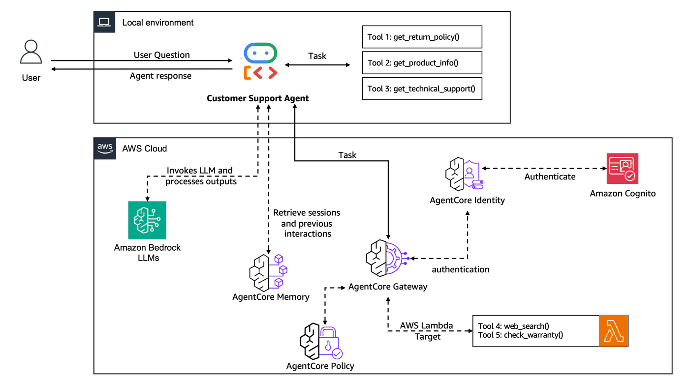

# Lab 3: Securely connect tools to your Agent with AgentCore Gateway 

## Overview

In this Lab, you will learn how to integrate tools available in your organization with the Customer Support Agent using the Amazon Bedrock Gateway.

The [Model Context Protocol (MCP)](https://modelcontextprotocol.io/docs/getting-started/intro) is an open protocol that standardizes how applications provide tools and context to Large Language Models (LLMs).

With [Amazon Bedrock Agent Core Gateway](https://docs.aws.amazon.com/bedrock-agentcore/latest/devguide/gateway.html), developers can convert APIs, Lambda functions, and existing services into MCP-compatible tools and make them available to agents through Gateway endpoints with just a few lines of code.


**Workshop Journey:**

- **Lab 1 (Done):** Create Agent Prototype - Built a functional customer support agent
- **Lab 2 (Done):** Enhance with Memory - Added conversation context and personalization
- **Lab 3 (Current):** Scale with Gateway & Identity - Shared tools across agents securely
- **Lab 4:** Deploy to Production - Used AgentCore Runtime with observability
- **Lab 5:** Build User Interface - Create a customer-facing application


### Why AgentCore Gateway & Tool Sharing Matter

Current State (Lab 1-2): Each agent has its own copy of tools. A practice that is not scalable and leads to:

- Code duplication across different agents
- Inconsistent tool behavior and maintenance overhead
- No centralized security or access control
- Difficulty scaling to multiple use cases

After this lab, we will have centralized, reusable tools that can serve:

- Customer Support Agent (our current use case)
- Sales Agent (needs same product info and customer data)
- Inventory Agent (needs same product info and warranty checking)
- Returns Processing Agent (needs return policies and customer profiles)

and other use cases. 

### Adding secure authentication with AgentCore Identity

Additionally, AgentCore Gateway requires you to securely authenticate both inbound and outbound connections. [AgentCore Identity](https://docs.aws.amazon.com/bedrock-agentcore/latest/devguide/identity.html) provides seamless agent identity and access management across AWS services and third-party applications such as Slack and Zoom while supporting any standard identity providers such as Okta, Entra, and Amazon Cognito. In this lab we will see how AgentCore Gateway integrates with AgentCore Identity to provide secure connections via inbound and outbound authentication. 

For the inbound authentication, the AgentCore Gateway analyzes the OAuth token passed during invocation to decide allow or deny the access to a tool in the gateway. If a tool needs access to external resources, the AgentCore Gateway can use outbound authentication via API Key, IAM or OAuth Token to allow or deny the access to the external resource.

During the inbound authorization flow, an agent or the MCP client calls an MCP tool in the AgentCore Gateway adding an OAuth access token (generated from the user's IdP). AgentCore Gateway then validates the OAuth access token and performs inbound authorization.

If the tool running in AgentCore Gateway needs to access external resources, OAuth will retrieve credentials of downstream resources using the resource credential provider for the Gateway target. AgentCore Gateway pass the authorization credentials to the caller to get access to the downstream API.


## Architecture for Lab 3

<div style="text-align:left">
    
</div>

*Web search tool is now centralized in AgentCore Gateway with secure identity-based access control. Multiple agents and use cases can share the same tool securely. We will also reuse the `check_warranty()` tool built for other applications and add the `web_search()` tool for use within other applications. `get_product_info()`, `get_return_policy()`, and `get_technical_support` remain as local tools as they are specific to the customer support use case*

### Key Features
- **Seamlessly integrate AWS Lambda functions:** This example shows how to integrate your Agent with existing AWS Lambda functions to check the warranty of an item and to get the customer profile using Amazon Bedrock AgentCore Gateway.
- **Secure your Gateway endpoint with Inbound Auth**: Only an Agent providing a valid JWT token can connect to the endpoint to use the tools
- **Configure the Agent to use the MCP endpoint**: The Agent gets a valid JWT token and uses it to connect to the MCP endpoint provided by AgentCore Gateway

## Prerequisites

* Python 3.12+
* AWS credentials configured
* Complete Lab 2 Add memory to the Customer Support Agent
* These resources are created for you within an AWS workshop account
    - AWS Lambda function 
    - AWS Lambda Execution IAM Role
    - AgentCore Gateway IAM Role
    - DynamoDB tables used by the AWS Lambda function. 
    - Cognito User Pool and User Pool Client

## Step 1: Import required libraries

```python
# Import libraries
import os
import sys
import boto3
import json
import uuid
import time

from lab_helpers.utils import suppress_warnings

suppress_warnings()

from mcp import ClientSession
from mcp.client.streamable_http import streamablehttp_client

import asyncio
import nest_asyncio

nest_asyncio.apply()

from google.adk.agents import LlmAgent
from google.adk.models.lite_llm import LiteLlm
from google.adk.runners import Runner
from google.adk.sessions import InMemorySessionService
from google.genai import types

from bedrock_agentcore.memory import MemoryClient
from lab_helpers.lab2_memory import ACTOR_ID, create_or_get_memory_resource

from lab_helpers.utils import (
    get_or_create_cognito_pool,
    put_ssm_parameter,
    get_ssm_parameter,
    load_api_spec,
)


sts_client = boto3.client("sts")
account_id = sts_client.get_caller_identity()["Account"]
# Get AWS account details
REGION = boto3.session.Session().region_name

gateway_client = boto3.client(
    "bedrock-agentcore-control",
    region_name=REGION,
)

print("\u2705 Libraries imported successfully!")
```

## Step 2: Give our agent a tool to access existing customer data
AgentCore Gateway simplifies agent tool integration in three key ways:

Universal MCP Support: Instantly make your tools compatible with any agent framework by exposing them through AgentCore Gateway's MCP standard

Simple REST Integration: Transform existing REST services into agent tools by just adding them as AgentCore Gateway targets

Lambda Flexibility: Expose Lambda functions as MCP endpoints that can call any API - demonstrated here with a function that checks warranty status

AgentCore Gateway populates the Lambda context with the name of the tool to invoke, while the parameters passed to the tool are provided in the Lambda event:

```
extended_tool_name = context.client_context.custom["bedrockAgentCoreToolName"]
resource = extended_tool_name.split("___")[1]
```

[Lambda function](./prerequisite/lambda/python/lambda_function.py)

```
def lambda_handler(event, context):
    if get_tool_name(event) == "check_warranty_status":
        serial_number = get_named_parameter(event=event, name="serial_number")
        customer_email = get_named_parameter(event=event, name="customer_email")

        warranty_status = check_warranty_status(serial_number, customer_email)
        return {"statusCode": 200, "body": warranty_status}
```

## Step 3 Convert your web search tool to MCP
Now that we are developing an MCP server using AgentCore Gateway, we can MCP-ify any tools which we think we'll use for multiple Agents. One of these tools might be a web search tool like we built in Lab1. As a result, we also converted the web search tool from Lab 1 into a Lambda tool within our AgentCore Gateway:

[Web search Lambda](./prerequisite/lambda/python/web_search.py)
```
from ddgs import DDGS


def web_search(keywords: str, region: str = "us-en", max_results: int = 5) -> str:
    """Search the web for updated information.
    
    Args:
        keywords (str): The search query keywords.
        region (str): The search region: wt-wt, us-en, uk-en, ru-ru, etc.
        max_results (int): The maximum number of results to return.
        
    Returns:
        List of dictionaries with search results.
    """
    try:
        results = DDGS().text(keywords, region=region, max_results=max_results)
        return results if results else "No results found."
    except Exception as e:
        return f"Search error: {str(e)}"


print("\u2705 Web search tool ready")
```

## Step 4 Create your function definition metadata
Lastly, we need to write tool schema which describes the tools implemented by your Lambda function.

This file has been already defined in [prerequisite/lambda/api_spec.json](./prerequisite/lambda/api_spec.json)

```
[
    {
        "name": "check_warranty_status",
        "description": "Check the warranty status of a product using its serial number and optionally verify via email",
        "inputSchema": {
            "type": "object",
            "properties": {
                "serial_number": {
                    "type": "string"
                },
                "customer_email": {
                    "type": "string"
                }
            },
            "required": [
                "serial_number"
            ]
        }
    },
    {
        "name": "web_search",
        "description": "Search the web for updated information using DuckDuckGo",
        "inputSchema": {
            "type": "object",
            "properties": {
                "keywords": {
                    "type": "string",
                    "description": "The search query keywords"
                },
                "region": {
                    "type": "string",
                    "description": "The search region (e.g., us-en, uk-en, ru-ru)"
                },
                "max_results": {
                    "type": "integer",
                    "description": "The maximum number of results to return"
                }
            },
            "required": [
                "keywords"
            ]
        }
    }
]
```

## Step 5. Create your AgentCore Gateway

Now let's create the AgentCore Gateway to expose the Lambda function as MCP-compatible endpoint.

To validate the callers authorized to invoke our tools we need to configure the Inbound Auth.

Inbound Auth works using OAuth authorization, the standard for MCP servers. With OAuth the client application must authenticate with the OAuth authorizer before using the Gateway. Your client would receive an access token which is used at runtime.

You need to specify an OAuth discovery server and client IDs. The Cloudformation provided with the workshop already provisioned the Cognito UserPool and UserPoolClient and it stored the discovery URL and the Client ID in dedicated SSM parameters.

```python
gateway_name = "customersupport-gw"

cognito_config = get_or_create_cognito_pool(refresh_token=True)
auth_config = {
    "customJWTAuthorizer": {
        "allowedClients": [cognito_config["client_id"]],
        "discoveryUrl": cognito_config["discovery_url"],
    }
}

try:
    # create new gateway
    print(f"Creating gateway in region {REGION} with name: {gateway_name}")

    create_response = gateway_client.create_gateway(
        name=gateway_name,
        roleArn=get_ssm_parameter("/app/customersupport/agentcore/gateway_iam_role"),
        protocolType="MCP",
        authorizerType="CUSTOM_JWT",
        authorizerConfiguration=auth_config,
        description="Customer Support AgentCore Gateway",
    )

    gateway_id = create_response["gatewayId"]

    gateway = {
        "id": gateway_id,
        "name": gateway_name,
        "gateway_url": create_response["gatewayUrl"],
        "gateway_arn": create_response["gatewayArn"],
    }
    put_ssm_parameter("/app/customersupport/agentcore/gateway_id", gateway_id)
    put_ssm_parameter("/app/customersupport/agentcore/gateway_name", gateway_name)
    put_ssm_parameter("/app/customersupport/agentcore/gateway_arn", create_response["gatewayArn"])
    put_ssm_parameter("/app/customersupport/agentcore/gateway_url", create_response["gatewayUrl"])
    print(f"\u2705 Gateway created successfully with ID: {gateway_id}")

except Exception:
    # If gateway exists, collect existing gateway ID from SSM
    existing_gateway_id = get_ssm_parameter("/app/customersupport/agentcore/gateway_id")
    print(f"Found existing gateway with ID: {existing_gateway_id}")

    # Get existing gateway details
    gateway_response = gateway_client.get_gateway(gatewayIdentifier=existing_gateway_id)
    gateway = {
        "id": existing_gateway_id,
        "name": gateway_response["name"],
        "gateway_url": gateway_response["gatewayUrl"],
        "gateway_arn": gateway_response["gatewayArn"],
    }
    gateway_id = gateway["id"]
```

## Step 6. Add the Lambda function Target
Now we will use the previously defined function definitions from [prerequisite/lambda/api_spec.json](./prerequisite/lambda/api_spec.json) to create a Lambda target within our Agent Gateway. This will define the tools that your gateway will host.

Gateway allows you to attach multiple targets to a Gateway and you can change the targets / tools attached to a gateway at any point. Each target can have its own credential provider, but Gateway becomes a single MCP URL enabling access to all of the relevant tools for an agent across myriad APIs.

```python
try:
    api_spec_file = "./prerequisite/lambda/api_spec.json"

    # Validate API spec file exists
    if not os.path.exists(api_spec_file):
        print(f"\u274c API specification file not found: {api_spec_file}")
        sys.exit(1)

    api_spec = load_api_spec(api_spec_file)

    # Use Cognito for Inbound OAuth to our Gateway
    lambda_target_config = {
        "mcp": {
            "lambda": {
                "lambdaArn": get_ssm_parameter("/app/customersupport/agentcore/lambda_arn"),
                "toolSchema": {"inlinePayload": api_spec},
            }
        }
    }

    # Create gateway target
    credential_config = [{"credentialProviderType": "GATEWAY_IAM_ROLE"}]

    create_target_response = gateway_client.create_gateway_target(
        gatewayIdentifier=gateway_id,
        name="LambdaUsingSDK",
        description="Lambda Target using SDK",
        targetConfiguration=lambda_target_config,
        credentialProviderConfigurations=credential_config,
    )

    print(f"\u2705 Gateway target created: {create_target_response['targetId']}")

except Exception as e:
    print(f"\u274c Error creating gateway target: {str(e)}")
```

## Step 7: Add our new MCP-based tools to our support agent
Here we integrate our authentication token from Cognito with the MCP client to connect to the AgentCore Gateway, then wrap the MCP tools as Google ADK-compatible functions.
### Step 7.1. Set up a secure MCP client and list available tools

```python
print(f"Gateway Endpoint - MCP URL: {gateway['gateway_url']}")


# List tools available on the gateway using the MCP client directly
async def list_gateway_tools():
    async with streamablehttp_client(
        gateway["gateway_url"],
        headers={"Authorization": f"Bearer {cognito_config['bearer_token']}"},
    ) as (read_stream, write_stream, _):
        async with ClientSession(read_stream, write_stream) as session:
            await session.initialize()
            result = await session.list_tools()
            print(f"   Found {len(result.tools)} tool(s):\n")
            for tool in result.tools:
                print(f"   \u2705 {tool.name}")
                print(f"      {tool.description}\n")
            return result.tools


gateway_tools_list = await list_gateway_tools()
```

### Step 7.2. Create the agent with local tools + MCP gateway tools + memory

We create our Google ADK agent combining:
- **Local tools**: `get_product_info`, `get_return_policy`, `get_technical_support` (specific to customer support)
- **MCP tools via AgentCore Gateway**: `check_warranty_status`, `web_search` (shared across agents)
- **AgentCore Memory**: Explicit memory retrieval and storage (same pattern as Lab 2)

Since Google ADK doesn't natively consume MCP tools, we create thin wrapper functions that call the gateway MCP endpoint. These wrappers are registered as regular ADK tools.

```python
# ============================================================
# Local tools (same as Lab 1/2, specific to customer support)
# ============================================================


def get_return_policy(product_category: str) -> str:
    """Get return policy information for a specific product category.

    Args:
        product_category: Electronics category (e.g., 'smartphones', 'laptops', 'accessories')

    Returns:
        Formatted return policy details including timeframes and conditions
    """
    return_policies = {
        "smartphones": {
            "window": "30 days",
            "condition": "Original packaging, no physical damage, factory reset required",
            "process": "Online RMA portal or technical support",
            "refund_time": "5-7 business days after inspection",
            "shipping": "Free return shipping, prepaid label provided",
            "warranty": "1-year manufacturer warranty included",
        },
        "laptops": {
            "window": "30 days",
            "condition": "Original packaging, all accessories, no software modifications",
            "process": "Technical support verification required before return",
            "refund_time": "7-10 business days after inspection",
            "shipping": "Free return shipping with original packaging",
            "warranty": "1-year manufacturer warranty, extended options available",
        },
        "accessories": {
            "window": "30 days",
            "condition": "Unopened packaging preferred, all components included",
            "process": "Online return portal",
            "refund_time": "3-5 business days after receipt",
            "shipping": "Customer pays return shipping under $50",
            "warranty": "90-day manufacturer warranty",
        },
    }
    default_policy = {
        "window": "30 days",
        "condition": "Original condition with all included components",
        "process": "Contact technical support",
        "refund_time": "5-7 business days after inspection",
        "shipping": "Return shipping policies vary",
        "warranty": "Standard manufacturer warranty applies",
    }
    policy = return_policies.get(product_category.lower(), default_policy)
    return (
        f"Return Policy - {product_category.title()}:\n\n"
        f"\u2022 Return window: {policy['window']} from delivery\n"
        f"\u2022 Condition: {policy['condition']}\n"
        f"\u2022 Process: {policy['process']}\n"
        f"\u2022 Refund timeline: {policy['refund_time']}\n"
        f"\u2022 Shipping: {policy['shipping']}\n"
        f"\u2022 Warranty: {policy['warranty']}"
    )


def get_product_info(product_type: str) -> str:
    """Get detailed technical specifications and information for electronics products.

    Args:
        product_type: Electronics product type (e.g., 'laptops', 'smartphones', 'headphones', 'monitors')
    Returns:
        Formatted product information including warranty, features, and policies
    """
    products = {
        "laptops": {
            "warranty": "1-year standard, 3-year extended available",
            "specs": "Intel/AMD processors, 8-64GB RAM, SSD storage",
            "features": "Backlit keyboards, fingerprint readers, Thunderbolt ports",
            "compatibility": "Windows, Linux, macOS (Apple only)",
            "support": "24/7 technical support, on-site repair options",
        },
        "smartphones": {
            "warranty": "1-year manufacturer, 2-year extended",
            "specs": "Latest processors, 6-12GB RAM, 128GB-1TB storage",
            "features": "5G capable, water resistant, wireless charging",
            "compatibility": "iOS or Android ecosystem",
            "support": "In-store and mail-in repair services",
        },
        "headphones": {
            "warranty": "1-year standard warranty",
            "specs": "Bluetooth 5.0+, ANC, 20-40hr battery",
            "features": "Active noise cancellation, transparency mode, multipoint",
            "compatibility": "Universal Bluetooth, some with proprietary apps",
            "support": "Replacement program for defective units",
        },
        "monitors": {
            "warranty": "3-year standard, zero dead pixel guarantee",
            "specs": "4K/1440p resolution, 60-240Hz refresh rate",
            "features": "HDR support, high refresh rates, adjustable stands",
            "compatibility": "HDMI, DisplayPort, USB-C inputs",
            "support": "Color calibration and technical support",
        },
    }
    product = products.get(product_type.lower())
    if not product:
        return f"Technical specifications for {product_type} not available. Please contact our technical support team."
    return (
        f"Technical Information - {product_type.title()}:\n\n"
        f"\u2022 Warranty: {product['warranty']}\n"
        f"\u2022 Specifications: {product['specs']}\n"
        f"\u2022 Key Features: {product['features']}\n"
        f"\u2022 Compatibility: {product['compatibility']}\n"
        f"\u2022 Support: {product['support']}"
    )


def get_technical_support(issue_description: str) -> str:
    """Search the technical support knowledge base for troubleshooting help, setup guides, and maintenance tips.

    Args:
        issue_description: Description of the technical issue or question the customer needs help with.
    Returns:
        Relevant technical support documentation and troubleshooting steps.
    """
    try:
        ssm = boto3.client("ssm")
        acct = boto3.client("sts").get_caller_identity()["Account"]
        region = boto3.Session().region_name
        kb_id = ssm.get_parameter(Name=f"/{acct}-{region}/kb/knowledge-base-id")["Parameter"]["Value"]
        bedrock_agent_runtime = boto3.client("bedrock-agent-runtime", region_name=region)
        response = bedrock_agent_runtime.retrieve(
            knowledgeBaseId=kb_id,
            retrievalQuery={"text": issue_description},
            retrievalConfiguration={"vectorSearchConfiguration": {"numberOfResults": 3}},
        )
        results = response.get("retrievalResults", [])
        if not results:
            return "No relevant technical support documentation found for this issue."
        formatted_results = []
        for i, result in enumerate(results, 1):
            text = result.get("content", {}).get("text", "")
            score = result.get("score", 0)
            if score >= 0.4:
                formatted_results.append(f"--- Result {i} (relevance: {score:.2f}) ---\n{text}")
        if not formatted_results:
            return "No sufficiently relevant technical support documentation found."
        return "\n\n".join(formatted_results)
    except Exception as e:
        return f"Unable to access technical support documentation. Error: {str(e)}"


print("\u2705 Local tools defined")
```

```python
# ============================================================
# MCP Gateway tool wrappers
# Thin wrapper functions that call the Gateway MCP endpoint.
# These expose Gateway tools as regular Python functions to ADK.
# ============================================================

import nest_asyncio

nest_asyncio.apply()


async def _call_mcp_tool(tool_name: str, arguments: dict) -> str:
    """Helper to call an MCP tool on the AgentCore Gateway."""
    async with streamablehttp_client(
        gateway["gateway_url"],
        headers={"Authorization": f"Bearer {cognito_config['bearer_token']}"},
    ) as (read_stream, write_stream, _):
        async with ClientSession(read_stream, write_stream) as session:
            await session.initialize()
            result = await session.call_tool(tool_name, arguments)
            # Extract text content from the MCP result
            if result.content:
                return "\n".join(part.text for part in result.content if hasattr(part, "text"))
            return "No result returned."


def check_warranty_status(serial_number: str, customer_email: str) -> str:
    """Check the warranty status of a product using its serial number and optionally verify via email.

    Args:
        serial_number: The product serial number to look up.
        customer_email: Customer email for verification. Pass empty string if not available.

    Returns:
        Warranty status information for the product.
    """
    args = {"serial_number": serial_number}
    if customer_email:
        args["customer_email"] = customer_email
    return asyncio.get_event_loop().run_until_complete(_call_mcp_tool("LambdaUsingSDK___check_warranty_status", args))


def web_search(keywords: str, region: str, max_results: int) -> str:
    """Search the web for updated information using DuckDuckGo.

    Args:
        keywords: The search query keywords.
        region: The search region (e.g., us-en, uk-en, ru-ru).
        max_results: The maximum number of results to return.

    Returns:
        Search results from the web.
    """
    args = {"keywords": keywords, "region": region, "max_results": max_results}
    return asyncio.get_event_loop().run_until_complete(_call_mcp_tool("LambdaUsingSDK___web_search", args))


print("\u2705 MCP gateway tool wrappers defined")
```

```python
# ============================================================
# Agent creation with Google ADK + Memory integration
# ============================================================

SYSTEM_PROMPT = """You are a helpful and professional customer support assistant for an electronics e-commerce company.
Your role is to:
- Provide accurate information using the tools available to you
- Support the customer with technical information and product specifications.
- Be friendly, patient, and understanding with customers
- Always offer additional help after answering questions
- If you can't help with something, direct customers to the appropriate contact

You have access to the following tools:
1. get_return_policy() - For warranty and return policy questions
2. get_product_info() - To get information about a specific product
3. get_technical_support() - To search the technical support knowledge base
4. check_warranty_status() - To check warranty status via serial number (via AgentCore Gateway)
5. web_search() - To access current technical documentation, or for updated information (via AgentCore Gateway)
Always use the appropriate tool to get accurate, up-to-date information rather than making assumptions about electronic products or specifications."""


# Create the Google ADK agent with all tools
all_tools = [
    get_product_info,
    get_return_policy,
    get_technical_support,
    check_warranty_status,
    web_search,
]

agent = LlmAgent(
    name="customer_support_agent",
    model=LiteLlm(model="bedrock/us.anthropic.claude-haiku-4-5-20251001-v1:0"),
    instruction=SYSTEM_PROMPT,
    tools=all_tools,
)

# Set up memory
memory_id = create_or_get_memory_resource()
memory_client = MemoryClient(region_name=REGION)

APP_NAME = "customer_support_app"
USER_ID = "user_001"


async def create_agent(prompt):
    """Send a query to the agent with memory context injection."""
    session_id = str(uuid.uuid4())

    # --- 1. Retrieve customer context from memory ---
    all_context = []
    namespaces = {
        "preferences": f"support/customer/{ACTOR_ID}/preferences/",
        "semantic": f"support/customer/{ACTOR_ID}/semantic/",
    }
    for context_type, namespace in namespaces.items():
        try:
            memories = memory_client.retrieve_memories(
                memory_id=memory_id,
                namespace=namespace,
                query=prompt,
                top_k=3,
            )
            for mem in memories:
                if isinstance(mem, dict):
                    text = mem.get("content", {}).get("text", "").strip()
                    if text:
                        all_context.append(f"[{context_type.upper()}] {text}")
        except Exception as e:
            print(f"Warning: Could not retrieve {context_type} memories: {e}")

    # --- 2. Build enriched query with context ---
    if all_context:
        context_text = "\n".join(all_context)
        enriched_query = f"Customer Context:\n{context_text}\n\n{prompt}"
        print(f"\U0001f4cb Retrieved {len(all_context)} memory items for context")
    else:
        enriched_query = prompt
        print("No prior memory context found")

    # --- 3. Run the ADK agent ---
    session_service = InMemorySessionService()
    await session_service.create_session(app_name=APP_NAME, user_id=USER_ID, session_id=session_id)
    runner = Runner(agent=agent, app_name=APP_NAME, session_service=session_service)
    content = types.Content(role="user", parts=[types.Part(text=enriched_query)])

    final_response = ""
    async for event in runner.run_async(user_id=USER_ID, session_id=session_id, new_message=content):
        if event.is_final_response():
            final_response = event.content.parts[0].text

    # --- 4. Save interaction to memory ---
    if final_response:
        try:
            memory_client.create_event(
                memory_id=memory_id,
                actor_id=ACTOR_ID,
                session_id=session_id,
                messages=[
                    (prompt, "USER"),
                    (final_response, "ASSISTANT"),
                ],
            )
            print("\U0001f4be Interaction saved to memory")
        except Exception as e:
            print(f"Warning: Could not save to memory: {e}")

    return final_response


print("\u2705 Customer support agent created successfully!")
```

## Step 8: Test the agent with MCP tool access to existing APIs

Let's test our agent with sample queries to ensure all features work correctly. You should see 5 tools in the output.

```python
test_prompts = [
    # Warranty Checks
    "List all of your tools",
    "I bought an iphone 14 last month. I don't like it because it heats up. How do I solve it?",
    "I have a Gaming Console Pro device , I want to check my warranty status, warranty serial number is MNO33333333.",
    "What are the warranty support guidelines?",
    "How can I fix Lenovo Thinkpad with a blue screen",
    "Tell me detailed information about the technical documentation on installing a new CPU",
]


# Function to test the agent
async def test_agent_responses(prompts):
    for i, prompt in enumerate(prompts, 1):
        print(f"\nTest Case {i}: {prompt}")
        print("-" * 50)
        try:
            response = await create_agent(prompt)
            print(response)
        except Exception as e:
            # Extract the root cause from nested ExceptionGroups
            root = e
            while hasattr(root, "exceptions") and root.exceptions:
                root = root.exceptions[0]
            print(f"Error: {root}")
        print("-" * 50)


# Run the tests
await test_agent_responses(test_prompts)

print("\n\u2705 Basic testing completed!")
```

## [Optional Section] AgentCore Policy

### Step 9: Create Policy Engine

Create a Policy Engine to contain Cedar authorization policies for fine-grained access control.

```python
# Try to import from toolkit, fall back to custom implementation if not available
try:
    from bedrock_agentcore_starter_toolkit.operations.policy.client import PolicyClient

    print("\u2705 Using toolkit PolicyClient")
except ImportError:
    from utils.policy_utils import PolicyClient

    print("\u2705 Using custom PolicyClient (toolkit policy module not available)")

# Initialize the policy client
policy_client = PolicyClient(region_name=REGION)

print("\n\U0001f527 Creating Policy Engine...")

# Create or get existing policy engine
# The policy engine is a container for all our authorization policies
engine = policy_client.create_or_get_policy_engine(
    name="customersupport_pe",
    description="Policy engine for customer support gateway",
)

engine_id = engine["policyEngineId"]
engine_arn = engine["policyEngineArn"]
put_ssm_parameter("/app/customersupport/agentcore/policy_engine_id", engine_id)

print("\n\u2705 Policy Engine ready")
print(f"   Engine ID: {engine_id}")
print(f"   Engine ARN: {engine_arn}")
```

### [Optional]:  Create Cedar Policy using Natural Language

AgentCore Policy provides the ability to generate Cedar policies using natural language to enforce scope-based access.

```python
# Create Cedar policy for approve tool (write scope)
print("\n\U0001f4dd Generating Cedar Policy from Natural language...")

nl_input = "Allow tag username == 'testuser' to perform check warranty status on the customer support gateway."

warranty_tool_policy = policy_client.generate_policy(
    policy_engine_id=engine["policyEngineId"],
    name=f"nl_policy_{int(time.time())}",
    resource={"arn": gateway["gateway_arn"]},
    content={"rawText": nl_input},
    fetch_assets=True,
)

print("\u2705 Policy generated from natural language")
```

```python
print("\U0001f4cb Generated Cedar Policies:\n")
print("=" * 80)

# Allow warranty status policy
print("\n1\ufe0f\u20e3  Warranty Status")
print("-" * 80)
warranty_tool_policy_cedar = warranty_tool_policy["generatedPolicies"][0]["definition"]["cedar"]["statement"]
print(warranty_tool_policy_cedar)

print("\n" + "=" * 80)
```

### Step 10 : Create Cedar Policy

Let's generate Cedar policies to enforce scope-based access. We can write scope for approve operations, read scope for create/list operations.

For the scope of this workshop, we will use pre-crafted allow/deny cedar policies to ensure consistency for all users.

```python
# Providing policies to allow for consistency in use case execution
allow_policy = {
    "cedar": {
        "statement": f"""permit(
            principal,
            action in [AgentCore::Action::"LambdaUsingSDK___check_warranty_status", AgentCore::Action::"LambdaUsingSDK___web_search"],
            resource == AgentCore::Gateway::"arn:aws:bedrock-agentcore:{REGION}:{account_id}:gateway/{gateway["id"]}"
        ) when {{
            (principal.hasTag("username")) && 
            ((principal.getTag("username")) == "testuser")
        }};"""
    }
}

# deny web search for "iPhone 8" keywords
deny_web_search_policy = {
    "cedar": {
        "statement": f"""forbid(
            principal,
            action == AgentCore::Action::"LambdaUsingSDK___web_search",
            resource == AgentCore::Gateway::"arn:aws:bedrock-agentcore:{REGION}:{account_id}:gateway/{gateway["id"]}"
        ) when {{
            context.input has keywords &&
            context.input.keywords like "*iPhone 8*"
        }};"""
    }
}
```

### Step 11: Add Policies in Policy Engine

Create the generated Cedar policies in the Policy Engine.

```python
print("\U0001f527 Creating policies in Policy Engine...\n")

# Create allow both tools policy
warranty_result = policy_client.create_or_get_policy(
    policy_engine_id=engine["policyEngineId"],
    name="allow_policy",
    description="Allow web_search and check_warranty_status calls",
    definition=allow_policy,
)
print("\u2705 Policy ready: allow_policy")
print("   Tools allowed: check_warranty_status and web_search\n")

# Create deny web search list policy
web_search_deny_result = policy_client.create_or_get_policy(
    policy_engine_id=engine["policyEngineId"],
    name="deny_web_search",
    description="Deny web_search tool call for iPhone 8",
    definition=deny_web_search_policy,
)
print("\u2705 Policy ready: deny_web_search")
print("   Tools denied conditionally: web_search\n")

print("\u2705 All policies ready!")
```

### Step 12: Update Gateway IAM Role Permissions

Before attaching the Policy Engine, we need to grant the Gateway IAM role permission to access the Policy Engine.

```python
role_arn = get_ssm_parameter("/app/customersupport/agentcore/gateway_iam_role")
role_name = role_arn.split("/")[-1]

iam_client = boto3.client("iam")
print("\U0001f527 Updating Gateway IAM role with Policy Engine permissions...")

# Policy document that grants access to Policy Engine
policy_document = {
    "Version": "2012-10-17",
    "Statement": [
        {
            "Effect": "Allow",
            "Action": ["bedrock-agentcore:*"],
            "Resource": [
                f"arn:aws:bedrock-agentcore:{REGION}:{account_id}:policy-engine/*",
                f"arn:aws:bedrock-agentcore:{REGION}:{account_id}:gateway/*",
            ],
        }
    ],
}

try:
    # Add inline policy to the role
    iam_client.put_role_policy(
        RoleName=role_name,
        PolicyName="PolicyEngineAccess",
        PolicyDocument=json.dumps(policy_document),
    )

    print("\u2705 IAM role updated successfully")
    print(f"   Role: {role_name}")
    print("   Added permissions: GetPolicyEngine, GetPolicy, ListPolicies")
    print("\n\u23f3 Waiting 10 seconds for IAM changes to propagate...")
    time.sleep(10)

    print("\u2705 Ready to attach Policy Engine")

except Exception as e:
    print(f"\u274c Error updating IAM role: {e}")
    print("\nYou may need to manually add these permissions to the role.")
```

### Step 13: Attach Policy Engine to Gateway

Enable policy enforcement by attaching the Policy Engine to the Gateway in ENFORCE mode.

```python
from bedrock_agentcore_starter_toolkit.operations.gateway.client import GatewayClient

# Initialize gateway client
gateway_client_toolkit = GatewayClient(region_name=REGION)

print("\U0001f527 Attaching Policy Engine to Gateway...")
print("   Mode: ENFORCE (policies will block unauthorized requests)\n")

# Attach the policy engine to the gateway
update_response = gateway_client_toolkit.update_gateway_policy_engine(
    gateway_identifier=gateway["id"],
    policy_engine_arn=engine["policyEngineArn"],
    mode="ENFORCE",
)

print("\u2705 Policy Engine attached successfully!")
print(f"   Gateway ID: {gateway['id']}")
print(f"   Policy Engine: {engine['policyEngineId']}")
print("   Mode: ENFORCE")
print("\n\U0001f512 Authorization is now active!")
```

### Step 14: Test Policy Enforcement

```python
test_prompts = [
    "List all of your tools",
    "Search the web for heating issues with Samsung zfold 7",
    "Search the internet for heating issues with iPhone 8",
]


# Function to test the agent
async def test_agent_responses(prompts):
    for i, prompt in enumerate(prompts, 1):
        print(f"\nTest Case {i}: {prompt}")
        print("-" * 50)
        try:
            response = await create_agent(prompt)
            print(response)
        except Exception as e:
            # Extract the root cause from nested ExceptionGroups
            root = e
            while hasattr(root, "exceptions") and root.exceptions:
                root = root.exceptions[0]
            print(f"Error: {root}")
        print("-" * 50)


# Run the tests
await test_agent_responses(test_prompts)

print("\n\u2705 Policy testing completed!")
```

### Congratulations! 🎉


You have successfully completed Lab 3: Securely connect tools to your Agent with AgentCore Gateway

What You Accomplished:

##### Tool Centralization & Reusability:

- Migrated web search from local tool to centralized AgentCore Gateway
- Integrated existing enterprise Lambda functions (warranty check, customer profile)
- Created a shared tool infrastructure that multiple agent types can access

##### Enterprise-Grade Security:

- Implemented JWT-based authentication with Cognito integration
- Configured secure inbound authorization for gateway access
- Established identity-based access control for tool usage

##### Scalable Architecture Foundation:

- Built reusable tools that serve multiple use cases (customer support, sales, returns processing)
- Eliminated code duplication across different agents
- Created centralized management for tool updates and maintenance

##### Current Limitations (We'll fix these next!):

- **Local Development Environment** - Still running on your laptop, not production-ready
- **Limited Observability** - No comprehensive monitoring of agent behavior and performance
- **Manual Scaling** - Cannot automatically handle increased load or multiple concurrent users

##### Next Up: [Lab 4 - Deploying to Production with AgentCore Runtime  →](lab-04-agentcore-runtime.ipynb)

In Lab 4, you'll transform your prototype into a production-ready system with:

- AgentCore Runtime for scalable agent deployment
- Comprehensive observability with metrics, logging, and tracing
- Auto-scaling capabilities to handle real-world traffic

### Resources
- [Amazon Bedrock Agent Core Gateway](https://docs.aws.amazon.com/bedrock-agentcore/latest/devguide/gateway.html)
- [Google ADK Documentation](https://google.github.io/adk-docs/)
- [Google ADK with LiteLLM](https://google.github.io/adk-docs/agents/models/litellm/)
- [Official Customer Support Sample](https://github.com/awslabs/amazon-bedrock-agentcore-samples/tree/main/02-use-cases/customer-support-assistant)
